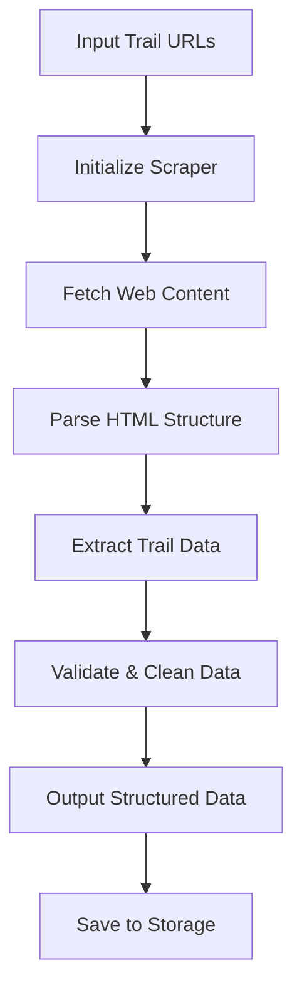

# `trailscraper`

## Repository Overview

### Tree Structure
```
trailscraper/
├── trailscraper/          # Main package directory
│   ├── __init__.py        # Package initialization
│   └── setup.py           # Setup configuration and utilities
└── setup.py               # Top-level setup script
```

### Purpose
TrailScraper is a Python-based web scraping utility designed to extract structured data from trail-related websites. It provides tools for collecting trail information, including difficulty ratings, elevation profiles, and geographic coordinates, making it valuable for outdoor enthusiasts, hiking communities, and travel platforms seeking reliable trail data.

### Target Users
- Outdoor recreation enthusiasts looking for detailed trail information
- Travel and tourism platforms requiring structured trail data
- Developers building applications around hiking and trail exploration
- Researchers analyzing trail usage patterns and accessibility

### Position in Ecosystem
TrailScraper functions as a standalone data collection tool that can be integrated into larger applications or used independently via command-line interface. It serves as a foundational component for trail data aggregation services and can be extended with custom scrapers for specific trail websites.

### Architecture
The system follows a modular architecture pattern with clear separation between data extraction logic and configuration management. It uses a pipeline approach for processing scraped data and supports extensible scraper implementations.

#### Data Flow Diagram


### Entry Points
1. **CLI Interface**: Command-line tool for batch scraping trail data
2. **Importable API**: Direct Python module imports for programmatic usage
3. **Configuration File**: Runtime settings for customizing scraping behavior

### Core Features
1. **Trail Data Extraction** - Collects trail difficulty, distance, elevation, and location data
2. **Multi-Source Support** - Compatible with various trail website formats
3. **Data Validation** - Ensures consistency and accuracy of extracted information
4. **Batch Processing** - Handles multiple trail URLs efficiently
5. **Export Capabilities** - Outputs data in standard formats (JSON, CSV)

### Dependencies
- `requests` - HTTP client for fetching web pages
- `beautifulsoup4` - HTML parsing library
- `pandas` - Data manipulation and export capabilities
- `click` - Command-line interface framework

### Configuration
The system supports configuration through:
- Environment variables for sensitive settings
- Command-line arguments for runtime customization
- Configuration files for persistent settings

### Extension Points
- Custom scraper plugins for new trail website formats
- Data validation rules that can be overridden or extended
- Export format handlers for additional output types

### Implementation Details
The main package contains a `setup.py` utility function `read_file` that safely reads file contents with graceful error handling. This utility is commonly used in setup scripts to read documentation files like README for package metadata.

---

## Modules

- [`trailscraper`](trailscraper.md)
- [`trailscraper/record_sources`](trailscraper/record_sources.md)

