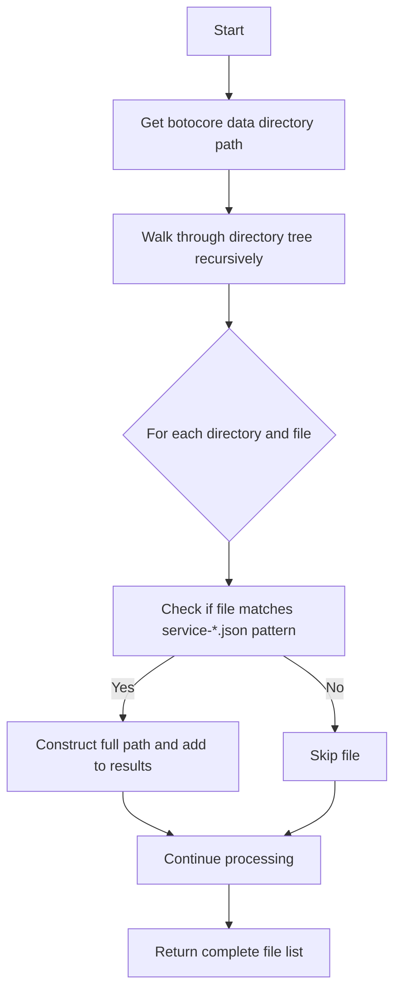

# `boto_service_definitions.py`

## `trailscraper.boto_service_definitions.boto_service_definition_files` · *function*

## Summary:
Returns a list of file paths to AWS service definition JSON files from the botocore library installation.

## Description:
This function discovers and collects all AWS service definition files (named service-*.json) located within the botocore library's data directory structure. These files contain metadata about AWS services and their operations, which are used by the trailscraper tool to understand AWS service capabilities and generate appropriate security policies.

The function is extracted into its own component to encapsulate the complex file discovery logic and provide a clean interface for accessing AWS service definitions, separating this concern from the higher-level policy generation logic.

## Args:
    None

## Returns:
    list[str]: A list of absolute file paths pointing to AWS service definition JSON files in the format 'service-*.json'. Each path is constructed by joining directory paths with filenames using os.path.join(). Returns an empty list if no matching files are found.

## Raises:
    None

## Constraints:
    Preconditions:
    - The botocore package must be installed in the Python environment
    - The botocore data directory must exist and be readable
    - Service definition files must follow the naming pattern 'service-*.json'
    
    Postconditions:
    - Returns a list of absolute file paths (never relative paths)
    - All returned paths point to existing files that match the service-*.json pattern
    - The list may be empty if no matching files are found

## Side Effects:
    - Reads from the file system to discover directory contents
    - Makes a call to pkg_resources.resource_filename to resolve the botocore data directory location
    - No external service calls or state mutations

## Control Flow:


## Examples:
    # Typical usage in a trailscraper workflow
    service_files = boto_service_definition_files()
    for file_path in service_files:
        with open(file_path, 'r') as f:
            service_def = json.load(f)
        # Process service definition...
```

## `trailscraper.boto_service_definitions.service_definition_file` · *function*

## Summary:
Returns the most recent AWS service definition file for a given service name by filtering and sorting available service definition files.

## Description:
This function retrieves the latest AWS service definition file for a specified service by first collecting all available service definition files using `boto_service_definition_files()`, then filtering them to find those matching the given service name, sorting them chronologically, and returning the most recent one. It serves as a utility to select the appropriate service definition file when multiple versions exist for the same AWS service.

The function is extracted into its own component to encapsulate the logic for selecting the most recent service definition file, providing a clean interface for retrieving service definitions while separating this selection logic from the broader trailscraper workflow.

## Args:
    servicename (str): The name of the AWS service to retrieve the definition file for. This corresponds to the service name used in AWS service definition file paths.

## Returns:
    str: The absolute path to the most recent service definition file matching the given service name. Returns an empty string if no matching files are found.

## Raises:
    IndexError: Raised when no service definition files are found for the given service name, as accessing [-1] on an empty list would fail.

## Constraints:
    Preconditions:
    - The botocore package must be installed and accessible
    - The `servicename` parameter must be a non-empty string
    - Service definition files must exist in the botocore data directory
    
    Postconditions:
    - Returns an absolute file path to an existing file (when successful)
    - The returned file path matches the pattern '**/{servicename}/*/service-*.json'
    - When no files are found, returns an empty string

## Side Effects:
    - Calls `boto_service_definition_files()` which reads from the file system
    - Makes a call to `pkg_resources.resource_filename()` to resolve the botocore data directory location
    - No external service calls or state mutations

## Control Flow:
```mermaid
flowchart TD
    A[Start] --> B[Call boto_service_definition_files()]
    B --> C[Filter files with fnmatch for pattern **/{servicename}/*/service-*.json]
    C --> D[Sort filtered files alphabetically]
    D --> E{Are there matching files?}
    E -->|No| F[Return empty string]
    E -->|Yes| G[Return last item (latest version)]
```

## Examples:
    # Retrieve the latest service definition for S3
    s3_definition_file = service_definition_file("s3")
    if s3_definition_file:
        with open(s3_definition_file, 'r') as f:
            s3_service_def = json.load(f)
        # Process S3 service definition...
    
    # Handle case where no definition is found
    ec2_definition_file = service_definition_file("ec2")
    if not ec2_definition_file:
        print("No EC2 service definition found")
```

## `trailscraper.boto_service_definitions.operation_definition` · *function*

## Summary:
Retrieves the definition of a specific AWS service operation from the service definition file.

## Description:
This function loads the JSON service definition for a given AWS service and extracts the definition for a specific operation. It serves as a utility to access detailed information about AWS service operations, such as their parameters, return types, and documentation, by reading from pre-defined service definition files.

The function is extracted into its own component to encapsulate the logic for retrieving operation definitions from service definition files, providing a clean interface for accessing operation-specific metadata while separating this data access logic from the broader trailscraper workflow.

## Args:
    servicename (str): The name of the AWS service (e.g., 's3', 'ec2') for which to retrieve the operation definition.
    operationname (str): The name of the specific operation within the service (e.g., 'ListObjects', 'DescribeInstances').

## Returns:
    dict: The operation definition dictionary containing metadata about the specified operation, including parameters, return types, and documentation.

## Raises:
    KeyError: Raised when the specified operationname does not exist in the service definition's operations dictionary.
    FileNotFoundError: Raised when the service definition file for the given servicename cannot be found.
    json.JSONDecodeError: Raised when the service definition file contains invalid JSON.
    IndexError: Raised when no service definition files are found for the given servicename, as accessing [-1] on an empty list would fail in the underlying service_definition_file function.

## Constraints:
    Preconditions:
    - The servicename must correspond to a valid AWS service with an existing service definition file
    - The operationname must exist within the service definition's operations dictionary
    - The service definition file must be readable and contain valid JSON

    Postconditions:
    - Returns a dictionary containing the full operation definition
    - The returned dictionary is a direct reference to data loaded from the service definition file

## Side Effects:
    - Reads from the file system to load the service definition file
    - Makes a call to `service_definition_file()` which internally accesses the file system

## Control Flow:
```mermaid
flowchart TD
    A[Start] --> B[Call service_definition_file(servicename)]
    B --> C{service_definition_file returns empty string?}
    C -->|Yes| D[FileNotFoundError]
    C -->|No| E[Open service definition file]
    E --> F[Load JSON content]
    F --> G[Access operations[operationname]]
    G --> H[Return operation definition]
```

## Examples:
    # Retrieve the definition for the ListObjects operation in S3
    try:
        s3_list_objects_def = operation_definition("s3", "ListObjects")
        print(f"Operation: {s3_list_objects_def.get('name')}")
        print(f"Documentation: {s3_list_objects_def.get('documentation')}")
    except KeyError as e:
        print(f"Operation not found: {e}")
    except FileNotFoundError as e:
        print(f"Service definition file not found: {e}")
```

