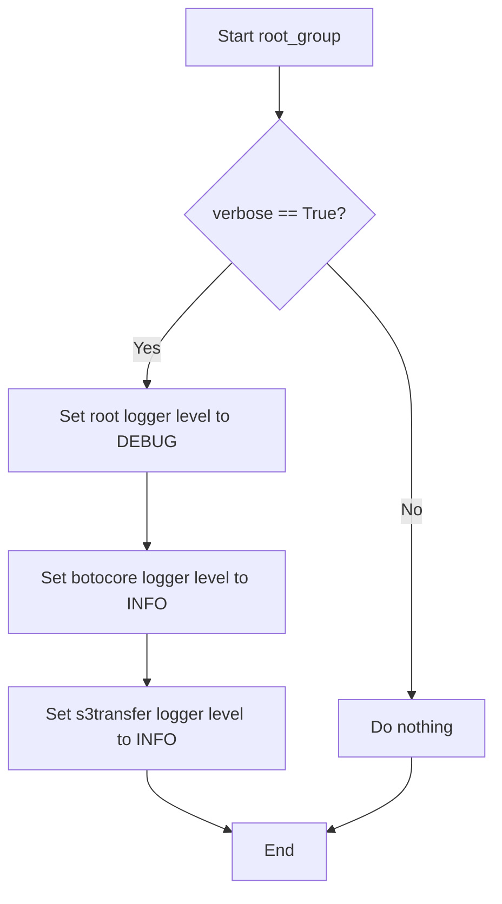
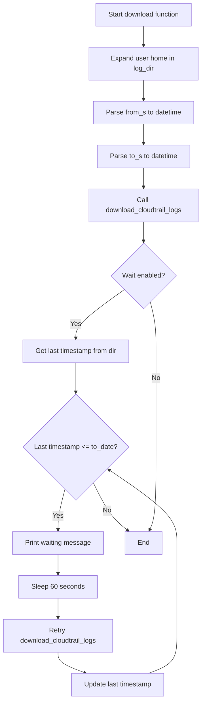
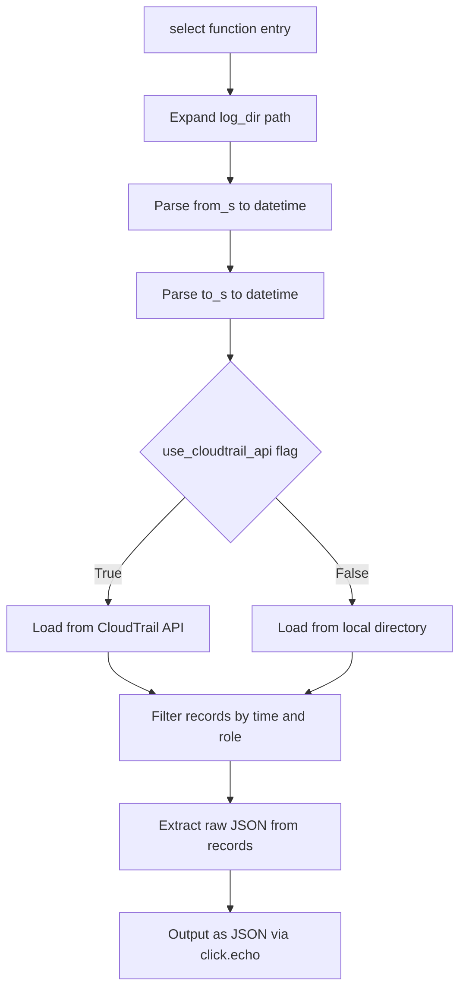

# `cli.py`

## `trailscraper.cli.root_group` · *function*

## Summary:
Configures the logging level for the application based on the verbose flag.

## Description:
This function sets up the logging configuration for the trailscraper CLI application. When the verbose flag is enabled, it adjusts the logging levels for the main logger and specific third-party libraries to provide more detailed output during execution.

## Args:
    verbose (bool): Flag indicating whether verbose logging should be enabled. When True, sets logging level to DEBUG for the main logger and INFO for botocore and s3transfer libraries.

## Returns:
    None: This function does not return any value.

## Raises:
    None: This function does not explicitly raise any exceptions.

## Constraints:
    Preconditions:
        - The logging module must be properly imported and available
        - The function should be called before any logging operations occur in the application
    Postconditions:
        - The root logger's level is set to DEBUG if verbose is True, otherwise remains unchanged
        - The botocore and s3transfer loggers' levels are set to INFO if verbose is True

## Side Effects:
    - Modifies global logging configuration via logging.getLogger()
    - Changes logging levels for botocore and s3transfer libraries
    - May affect console output verbosity during application execution

## Control Flow:


## Examples:
    # Enable verbose logging
    root_group(verbose=True)
    
    # Use default logging level
    root_group(verbose=False)

## `trailscraper.cli.download` · *function*

## Summary:
Downloads CloudTrail log files from S3 for a specified time range and optionally waits for logs to catch up to a target timestamp.

## Description:
This function orchestrates the downloading of CloudTrail log files from an S3 bucket for a given date range. It expands user-provided directory paths, parses human-readable time strings into datetime objects, and delegates the actual downloading to `download_cloudtrail_logs`. When the `wait` flag is enabled, it continuously monitors the downloaded files and retries downloads until the latest timestamp in the directory matches or exceeds the target end time.

The function is designed to be used in command-line interfaces where users want to fetch CloudTrail logs for analysis or further processing. It handles both immediate downloads and polling-based waiting for log completion.

## Args:
    bucket (str): Name of the S3 bucket containing CloudTrail logs
    prefix (str): Base prefix to prepend to S3 key paths for filtering
    org_id (str | None): AWS Organization ID, or None for account-based trails
    account_id (str): AWS Account ID to include in the generated S3 key prefixes
    region (str): AWS region to include in the generated S3 key prefixes
    log_dir (str): Local directory path where downloaded CloudTrail log files will be stored
    from_s (str): Human-readable start time string for the date range
    to_s (str): Human-readable end time string for the date range
    wait (bool): Whether to wait for logs to catch up to the target end time
    parallelism (int): Maximum number of concurrent download threads to use

## Returns:
    None: This function does not return any meaningful value

## Raises:
    None explicitly raised - though underlying functions may raise exceptions from time parsing or S3 operations

## Constraints:
    Preconditions:
        - `bucket` must be a valid S3 bucket name
        - `account_id` must be a valid AWS Account ID string
        - `region` must be a valid AWS region identifier
        - `from_s` and `to_s` must be parseable by `time_utils.parse_human_readable_time`
        - `log_dir` must be a writable directory path
        - `parallelism` must be a positive integer
        - When `wait=True`, the function will loop indefinitely until the target timestamp is reached

    Postconditions:
        - CloudTrail log files matching the criteria will be downloaded to `log_dir`
        - If `wait=True`, the function will not return until the latest timestamp in `log_dir` is at least `to_date`

## Side Effects:
    - Creates directories in the local filesystem as needed
    - Downloads files from S3 to the local filesystem
    - Makes HTTP requests to AWS S3 service
    - Prints status messages to stdout via click.echo when waiting
    - Sleeps for 60 seconds during waiting periods

## Control Flow:


## Examples:
```python
# Download CloudTrail logs for a specific date range
download(
    bucket="my-cloudtrail-bucket",
    prefix="AWSLogs/",
    org_id=None,
    account_id="123456789012",
    region="us-east-1",
    log_dir="/tmp/cloudtrail_logs",
    from_s="2023-12-25 00:00:00",
    to_s="2023-12-25 23:59:59",
    wait=False,
    parallelism=5
)

# Download and wait for logs to catch up to a future timestamp
download(
    bucket="my-cloudtrail-bucket",
    prefix="AWSLogs/",
    org_id=None,
    account_id="123456789012",
    region="us-east-1",
    log_dir="/tmp/cloudtrail_logs",
    from_s="2023-12-25 00:00:00",
    to_s="2023-12-26 00:00:00",
    wait=True,
    parallelism=5
)
```

## `trailscraper.cli.select` · *function*

## Summary:
Selects and filters CloudTrail records from either AWS API or local directory based on time range and IAM role ARNs, outputting the results as JSON.

## Description:
This function serves as the core selection logic for CloudTrail data processing, enabling users to extract records from either live AWS CloudTrail API or local log files within a specified time range. It handles the orchestration of data fetching, filtering, and output formatting, making it a central component in the CLI workflow for analyzing CloudTrail events.

The function is extracted into its own component to enforce clear separation between data sourcing (API vs local), filtering logic, and output formatting. This modularization allows for easier testing, maintenance, and extension of the selection pipeline while keeping the CLI command implementation clean and focused.

## Args:
    log_dir (str): Path to the local directory containing CloudTrail log files. Required when use_cloudtrail_api is False.
    filter_assumed_role_arn (str or None): IAM role ARN to filter records by. If None, no role-based filtering is applied. If provided, only records associated with this role are included.
    use_cloudtrail_api (bool): Flag indicating whether to fetch records from AWS CloudTrail API (True) or load from local directory (False).
    from_s (str): Human-readable start time for the selection range (e.g., "2023-01-01", "1 hour ago").
    to_s (str): Human-readable end time for the selection range (e.g., "2023-01-01", "now").

## Returns:
    None: This function does not return a value directly. Instead, it outputs JSON-formatted records to stdout via click.echo().

## Raises:
    None explicitly raised by this function. Exceptions from underlying components (time parsing, API calls, file operations) may propagate upward.

## Constraints:
    Preconditions:
        - log_dir must be a valid directory path when use_cloudtrail_api is False
        - from_s and to_s must be parseable by dateparser into timezone-aware datetime objects
        - When use_cloudtrail_api is True, appropriate AWS credentials must be configured for API access
        - When use_cloudtrail_api is False, log_dir must contain valid CloudTrail log files

    Postconditions:
        - Records are filtered by both time range and role ARN (if specified)
        - Output is formatted as JSON with a "Records" key containing the filtered records
        - Function completes successfully if records are processed and output, even if no records match the criteria

## Side Effects:
    - Reads from local filesystem when use_cloudtrail_api is False
    - Makes AWS API calls when use_cloudtrail_api is True
    - Writes JSON output to stdout via click.echo()
    - Expands user home directory in log_dir path

## Control Flow:


## Examples:
```python
# Select records from last 24 hours using CloudTrail API
select(
    log_dir="/path/to/logs",
    filter_assumed_role_arn="arn:aws:iam::123456789012:role/AdminRole",
    use_cloudtrail_api=True,
    from_s="24 hours ago",
    to_s="now"
)

# Select records from specific date range from local files
select(
    log_dir="/var/log/cloudtrail",
    filter_assumed_role_arn=None,
    use_cloudtrail_api=False,
    from_s="2023-01-01 00:00:00",
    to_s="2023-01-01 23:59:59"
)
```

## `trailscraper.cli.generate` · *function*

## Summary:
Generates an IAM policy document from CloudTrail records provided via standard input.

## Description:
This function serves as the primary command-line interface for generating IAM policies based on CloudTrail event data. It reads JSON-formatted CloudTrail records from standard input, parses them into structured records, generates policy statements from those records, and outputs the resulting IAM policy in JSON format to standard output.

The function is designed to be invoked as part of a command-line workflow where CloudTrail logs are piped into the tool. It encapsulates the entire process of policy generation from raw event data to structured IAM policy output, enforcing a clear separation between data ingestion and policy creation logic.

## Args:
    None

## Returns:
    None

## Raises:
    None explicitly raised by this function. Exceptions from underlying functions (json.load, parse_records, policy_generator.generate_policy) are propagated upward.

## Constraints:
    Preconditions:
        - Standard input must contain valid JSON data with a 'Records' key
        - The 'Records' value must be a list of CloudTrail event records
        - Each record must contain required fields for parsing (eventSource, eventName, eventTime)
    
    Postconditions:
        - Outputs a valid IAM policy document in JSON format to standard output
        - Function completes successfully if all processing steps succeed

## Side Effects:
    - Reads from standard input stream
    - Writes to standard output stream
    - Invokes functions that may perform I/O operations (json loading, record parsing, policy generation)

## Control Flow:
```mermaid
flowchart TD
    A[Start generate()] --> B[Read from stdin]
    B --> C[Load JSON data]
    C --> D[Extract Records array]
    D --> E[Parse records with parse_records()]
    E --> F[Generate policy with policy_generator.generate_policy()]
    F --> G[Output policy JSON to stdout]
```

## Examples:
    # Example usage in command line:
    # cat cloudtrail_events.json | python -m trailscraper.cli.generate
    # This would read events from cloudtrail_events.json and output a generated IAM policy

## `trailscraper.cli.guess` · *function*

## Summary:
Processes an IAM policy from standard input to infer and expand resource scopes based on allowed action prefixes.

## Description:
Reads an IAM policy document from standard input, parses it into a structured format, and applies inference logic to potentially expand resource scope in policy statements. This function serves as the command-line interface for the policy guessing feature, enabling users to enhance IAM policies with inferred action extensions while maintaining security boundaries defined by allowed prefixes.

The function leverages `parse_policy_document` to convert JSON input into a structured policy object, then uses `guess_statements` to apply inference logic that expands resource coverage based on action prefix matching. The resulting enhanced policy is output as JSON to standard output.

## Args:
    only (list[str]): Collection of string prefixes that define valid action extensions for inference. Each prefix is converted to title case for comparison.

## Returns:
    None: This function does not return a value directly. Instead, it outputs the enhanced policy as JSON to standard output via `click.echo`.

## Raises:
    json.JSONDecodeError: When the input stream contains invalid JSON that cannot be parsed.
    KeyError: When the parsed JSON lacks required keys ('Statement' or 'Version').
    TypeError: When the input stream is neither a string nor a file-like object.

## Constraints:
    Preconditions:
        - Standard input must contain valid JSON data representing an IAM policy document
        - The JSON must include both 'Statement' and 'Version' keys at the root level
        - If 'Statement' is present, it must be a list of statement dictionaries
        - The 'Version' value must be a valid IAM policy version string
        - The `only` parameter must be iterable with string elements
    Postconditions:
        - The function outputs a valid JSON representation of the enhanced policy to standard output
        - The enhanced policy maintains the same Version as the input policy
        - All statements in the enhanced policy are processed through the inference logic

## Side Effects:
    - Reads from standard input stream using `click.get_text_stream('stdin')`
    - Writes to standard output using `click.echo()`
    - Invokes `parse_policy_document` to parse input JSON
    - Invokes `guess_statements` to process policy statements
    - Invokes `policy.to_json()` to serialize the enhanced policy

## Control Flow:
```mermaid
flowchart TD
    A[Call guess(only)] --> B[Get stdin stream]
    B --> C[Parse policy from stdin]
    C --> D[Convert allowed_prefixes to title case]
    D --> E[Apply guess_statements to policy]
    E --> F[Serialize enhanced policy to JSON]
    F --> G[Echo JSON to stdout]
```

## Examples:
```python
# Typical usage with pipe
echo '{"Version":"2012-10-17","Statement":[{"Effect":"Allow","Action":"s3:GetObject","Resource":"arn:aws:s3:::example-bucket/*"}]}' | trailscraper guess --only s3: ec2:

# Usage with file redirection
trailscraper guess --only s3: < policy.json
```

## `trailscraper.cli.last_event_timestamp` · *function*

## Summary:
Retrieves and displays the latest event timestamp from CloudTrail log files in a local directory.

## Description:
This function provides a command-line interface to determine the most recent CloudTrail event timestamp from a specified local directory. It expands user home paths, creates a local directory record source, and outputs the latest timestamp found in the directory's CloudTrail log files.

The function serves as a utility for users to quickly check the most recent data available in their local CloudTrail log storage, which is useful for monitoring data ingestion status or determining where to resume scraping from.

## Args:
    log_dir (str): Path to the local directory containing CloudTrail log files. Can include tilde (~) for user home directory expansion.

## Returns:
    None: This function does not return a value. It outputs the timestamp directly to stdout using click.echo.

## Raises:
    FileNotFoundError: If the specified directory does not exist.
    PermissionError: If the process lacks permission to access the specified directory.
    IndexError: If there are no valid CloudTrail log files in the directory or no records in the most recent file.
    AttributeError: If the most recent file does not have a valid event_time attribute.
    ValueError: If the timestamp substring in a filename cannot be parsed into valid integers or represents an invalid date/time.

## Constraints:
    Preconditions:
        - The log_dir parameter must be a valid directory path
        - The directory must contain at least one valid CloudTrail log file
        - The most recent valid log file must contain at least one CloudTrail record
        
    Postconditions:
        - The function outputs a timezone-aware datetime object in UTC to stdout
        - The displayed timestamp represents the latest event time in the most recent valid log file

## Side Effects:
    - Reads from the filesystem to access CloudTrail log files
    - Decompresses and parses gzipped JSON log files
    - Performs multiple file I/O operations during processing
    - Outputs to stdout using click.echo

## Control Flow:
```mermaid
flowchart TD
    A[Start last_event_timestamp] --> B[Expand user home path]
    B --> C[Create LocalDirectoryRecordSource]
    C --> D[Call last_event_timestamp_in_dir()]
    D --> E[Output timestamp with click.echo]
    E --> F[End]
```

## Examples:
```python
# Basic usage
last_event_timestamp("/path/to/cloudtrail/logs")

# Using home directory shortcut
last_event_timestamp("~/cloudtrail-logs")
```

