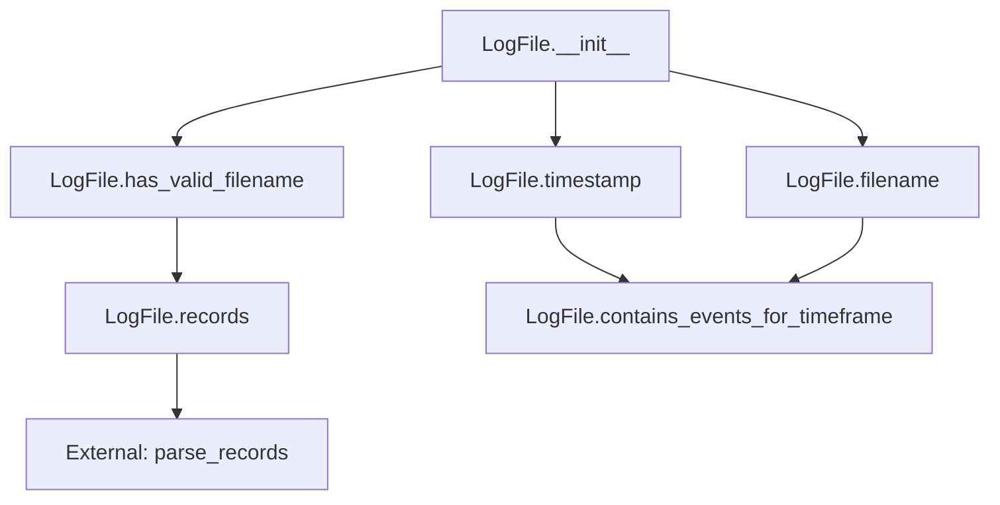
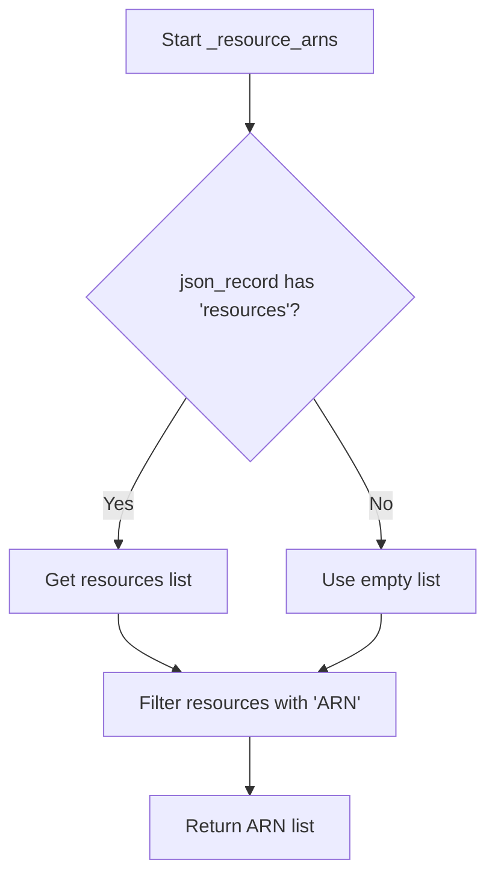
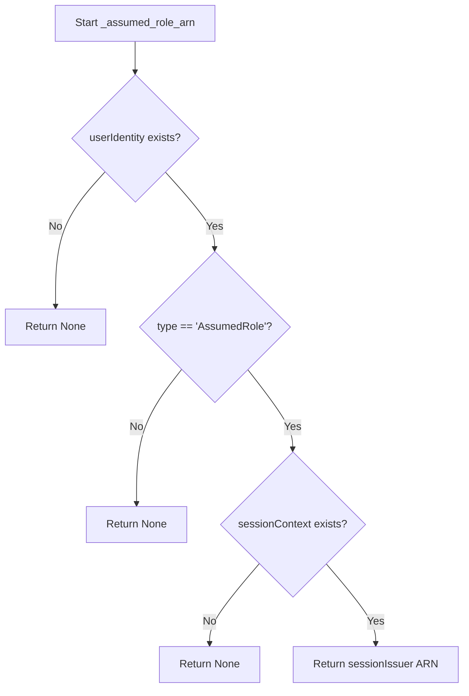
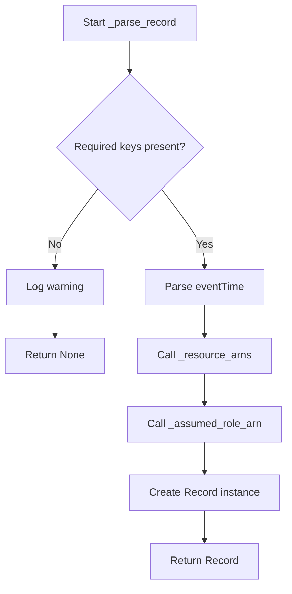
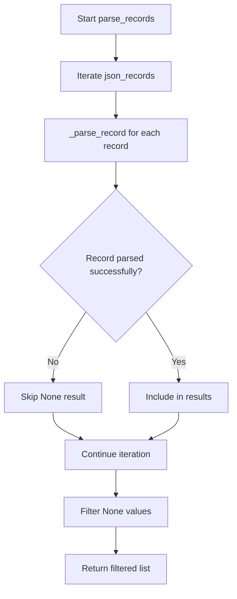
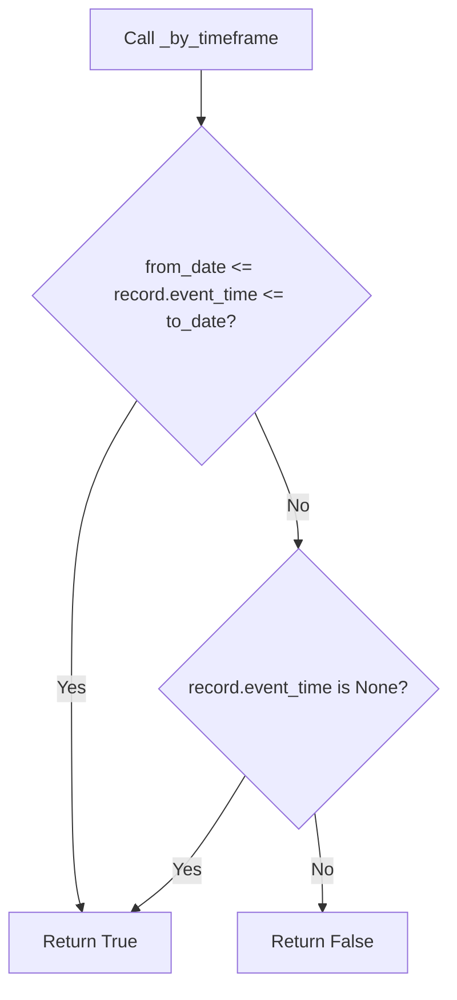
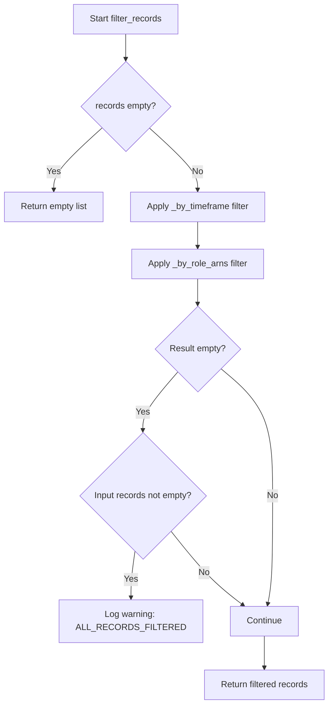

# `cloudtrail.py`

## `trailscraper.cloudtrail.Record` · *class*

## Summary:
Record represents a parsed AWS CloudTrail event with metadata and conversion capabilities to IAM policy statements.

## Description:
The Record class encapsulates the structure and behavior of an AWS CloudTrail event, serving as a bridge between raw CloudTrail data and IAM policy statement generation. It is designed to be instantiated by cloudtrail parsing systems and provides methods to convert CloudTrail events into equivalent IAM policy statements for access control analysis.

The class enforces a clear boundary between CloudTrail event data representation and IAM policy statement generation, making it suitable for security auditing and access control validation workflows where CloudTrail events need to be translated into policy expressions.

## State:
- event_source (str): The AWS service that generated the event (e.g., 's3.amazonaws.com')
- event_name (str): The name of the CloudTrail event (e.g., 'ListObjects')
- raw_source (str, optional): Original raw CloudTrail event data
- event_time (datetime, optional): Timestamp of when the event occurred
- resource_arns (list[str]): List of ARNs representing resources involved in the event, defaults to ['*']
- assumed_role_arn (str, optional): ARN of the assumed role if applicable

## Lifecycle:
- Creation: Instantiate with event_source and event_name; optional parameters can be provided for additional metadata
- Usage: Call to_statement() to generate an IAM policy statement representation of the event
- Destruction: Standard Python object cleanup; no special destruction required

## Method Map:
```mermaid
graph TD
    A[Record] --> B[to_statement()]
    A --> C[_source_to_iam_prefix()]
    A --> D[_event_name_to_iam_action()]
    A --> E[_to_api_gateway_statement()]
    B --> F[Statement]
    C --> G[str]
    D --> H[str]
    E --> F
```

## Raises:
- None explicitly raised by __init__; however, invalid inputs may cause issues in downstream processing when converting to IAM statements

## Example:
```python
# Create a record for an S3 ListObjects event
record = Record(
    event_source="s3.amazonaws.com",
    event_name="ListObjects",
    resource_arns=["arn:aws:s3:::my-bucket/*"],
    event_time=datetime.datetime.now(pytz.utc)
)

# Convert to IAM statement
statement = record.to_statement()
print(statement.json_repr())  # JSON representation of the IAM statement
```

### `trailscraper.cloudtrail.Record.__init__` · *method*

## Summary:
Initializes a CloudTrail record with event metadata and optional resource/role information.

## Description:
The `__init__` method sets up the basic attributes of a CloudTrail record, establishing the event source, event name, and associated metadata such as resource ARNs, assumed role ARNs, and timestamps. This method serves as the constructor for the Record class, preparing the object for further processing in the trail scraping pipeline.

## Args:
    event_source (str): The AWS service that generated the event.
    event_name (str): The name of the CloudTrail event.
    resource_arns (list[str], optional): List of ARNs for resources involved in the event. Defaults to ["*"] if None.
    assumed_role_arn (str, optional): ARN of the IAM role assumed during the event. Defaults to None.
    event_time (datetime.datetime, optional): Timestamp of when the event occurred. Defaults to None.
    raw_source (dict, optional): Raw JSON data from CloudTrail source. Defaults to None.

## Returns:
    None: This method initializes instance attributes and does not return a value.

## Raises:
    None: This method does not explicitly raise exceptions.

## State Changes:
    Attributes READ: None
    Attributes WRITTEN: 
        - self.event_source
        - self.event_name
        - self.raw_source
        - self.event_time
        - self.resource_arns
        - self.assumed_role_arn

## Constraints:
    Preconditions: 
        - event_source and event_name must be provided as strings.
        - resource_arns, if provided, must be a list of strings.
        - event_time, if provided, must be a datetime object.
    Postconditions:
        - self.resource_arns will always be a list, defaulting to ["*"] if None was provided.

## Side Effects:
    None: This method performs no I/O operations or external service calls.

### `trailscraper.cloudtrail.Record.__repr__` · *method*

## Summary:
Returns a string representation of the CloudTrail record that displays key identifying attributes for debugging and logging purposes.

## Description:
This method provides a standardized string format for representing CloudTrail record objects, primarily intended for debugging and logging scenarios. It is automatically invoked when the built-in `repr()` function is called on a Record instance. The method aggregates key metadata from the record including the event source, event name, event time, and associated resource ARNs.

## Args:
    None

## Returns:
    str: A formatted string containing the event source, event name, event time, and resource ARNs in the format: "Record(event_source=<value> event_name=<value> event_time=<value> resource_arns=<value>)"

## Raises:
    None

## State Changes:
    Attributes READ: 
    - self.event_source
    - self.event_name  
    - self.event_time
    - self.resource_arns

## Constraints:
    Preconditions:
    - All attributes (event_source, event_name, event_time, resource_arns) must be accessible on the Record instance
    - The attributes should be of types compatible with string formatting (typically str, datetime, or list-like objects)

    Postconditions:
    - The returned string follows a consistent format for all Record instances
    - No modifications are made to the Record instance's state

## Side Effects:
    None

### `trailscraper.cloudtrail.Record.__eq__` · *method*

## Summary:
Compares two CloudTrail record objects for equality based on key identifying attributes.

## Description:
This method implements the equality comparison operator (`==`) for CloudTrail record objects. It enables developers to determine if two records represent the same CloudTrail event by comparing their core identifying characteristics. This method is typically invoked during object comparisons, such as when checking if a record already exists in a collection or when performing deduplication operations.

## Args:
    other (Record): Another CloudTrail record object to compare against

## Returns:
    bool: True if both records have identical values for event_source, event_name, event_time, resource_arns, and assumed_role_arn; False otherwise

## Raises:
    None explicitly raised

## State Changes:
    Attributes READ: 
    - self.event_source
    - self.event_name  
    - self.event_time
    - self.resource_arns
    - self.assumed_role_arn

## Constraints:
    Preconditions:
    - The 'other' parameter must be an instance of the same class (Record)
    - All compared attributes (event_source, event_name, event_time, resource_arns, assumed_role_arn) must be comparable using '==' operator
    
    Postconditions:
    - Returns boolean value indicating equality of the two records
    - Does not modify either record's state

## Side Effects:
    None

### `trailscraper.cloudtrail.Record.__hash__` · *method*

## Summary:
Computes a hash value for the CloudTrail record based on its identifying attributes to enable object equality comparison and use in hash-based collections.

## Description:
This method implements the `__hash__` protocol for the Record class, providing a consistent hash value derived from key attributes of the CloudTrail event. It enables instances of Record to be used as dictionary keys or elements in sets, ensuring that two records with identical attributes will have the same hash value.

The method is called during hash table operations, such as when a Record instance is added to a set or used as a dictionary key, and when comparing records for equality using the `==` operator (which internally uses `__hash__` for optimization).

## Args:
    None

## Returns:
    int: An integer hash value computed from the combination of event_source, event_name, event_time, resource_arns, and assumed_role_arn attributes.

## Raises:
    TypeError: If any of the attributes used in the hash computation are unhashable (though this would indicate a programming error in the class design).

## State Changes:
    Attributes READ: 
    - self.event_source
    - self.event_name
    - self.event_time
    - self.resource_arns
    - self.assumed_role_arn

## Constraints:
    Preconditions:
    - All attributes referenced in the hash calculation (event_source, event_name, event_time, resource_arns, assumed_role_arn) must be defined on the instance.
    - The resource_arns attribute must be iterable to allow conversion to a tuple.

    Postconditions:
    - The returned hash value remains consistent for the lifetime of the object (assuming the attributes remain unchanged).
    - Records with identical attribute values will produce identical hash values.

## Side Effects:
    None

### `trailscraper.cloudtrail.Record.__ne__` · *method*

## Summary:
Implements inequality comparison between two Record objects by negating equality comparison.

## Description:
This method provides the logical negation of equality comparison for Record instances. It is automatically invoked when using the `!=` operator between two Record objects. The method delegates the actual comparison logic to the `__eq__` method and simply negates its result.

## Args:
    other (object): Another object to compare with this Record instance for inequality.

## Returns:
    bool: True if the records are not equal, False if they are equal.

## Raises:
    None explicitly raised.

## State Changes:
    Attributes READ: self.event_source, self.event_name, self.event_time, self.resource_arns, self.assumed_role_arn
    Attributes WRITTEN: None

## Constraints:
    Preconditions: The `other` parameter can be any object, though meaningful comparisons only occur when it's another Record instance.
    Postconditions: Returns a boolean value indicating inequality between self and other.

## Side Effects:
    None.

### `trailscraper.cloudtrail.Record._source_to_iam_prefix` · *method*

## Summary:
Maps AWS service endpoint identifiers to their corresponding IAM action prefixes for permission analysis.

## Description:
This method translates AWS service endpoint names (such as 'ec2.amazonaws.com') into IAM action prefixes (like 'ec2') that are used to construct IAM policy statements. It handles special cases where the service endpoint doesn't directly map to the IAM prefix, falling back to extracting the prefix from the service endpoint's domain name.

This logic is separated into its own method to encapsulate the mapping logic and make it reusable across different parts of the cloudtrail processing pipeline, particularly when constructing IAM statements from CloudTrail events.

## Args:
    self: The Record instance containing the event_source attribute to be converted.

## Returns:
    str: The IAM action prefix derived from the event_source. For special cases defined in the method, returns the mapped prefix; otherwise, returns the first part of the event_source split by '.' (e.g., 'ec2' from 'ec2.amazonaws.com').

## Raises:
    None explicitly raised.

## State Changes:
    Attributes READ: self.event_source
    Attributes WRITTEN: None

## Constraints:
    Preconditions: The Record instance must have an event_source attribute set to a string representing a valid AWS service endpoint.
    Postconditions: The returned string is either a special case mapping from the predefined dictionary or the first component of the event_source domain name.

## Side Effects:
    None.

### `trailscraper.cloudtrail.Record._event_name_to_iam_action` · *method*

## Summary:
Transforms CloudTrail event names into equivalent IAM action names using service-specific mappings and regex normalization.

## Description:
This method maps CloudTrail event names to their corresponding IAM action names for policy analysis purposes. It applies service-specific special case mappings (particularly for S3 and KMS) followed by regex-based normalization patterns to standardize event names. The method is typically invoked during CloudTrail record processing to enable accurate IAM policy evaluation and compliance checking.

## Args:
    None

## Returns:
    str: The normalized IAM action name that corresponds to the CloudTrail event name, or the original event name if no transformation applies.

## Raises:
    None explicitly raised

## State Changes:
    Attributes READ: self.event_name (the CloudTrail event name), self.event_source (AWS service identifier)
    Attributes WRITTEN: None

## Constraints:
    Preconditions: 
    - self.event_name must be a string containing the CloudTrail event name
    - self.event_source must be a string identifying the AWS service (e.g., 's3.amazonaws.com', 'kms.amazonaws.com')
    Postconditions:
    - Returns a string representing the equivalent IAM action name or the unchanged event name if no mapping applies

## Side Effects:
    None

### `trailscraper.cloudtrail.Record._to_api_gateway_statement` · *method*

## Summary:
Converts an API Gateway CloudTrail event into an IAM Statement representing the allowed action and resource.

## Description:
This method transforms a CloudTrail record with API Gateway event source into an AWS IAM Statement that captures the HTTP method and resource path accessed via the API Gateway operation. It leverages the operation definition system to extract HTTP method and URI information, processes the URI to normalize path parameters, and constructs an appropriate IAM statement with wildcard resource matching.

The method is specifically designed for API Gateway events and handles the unique structure of API Gateway operations, which are defined by HTTP methods and request URis rather than traditional IAM action names. This approach enables proper IAM policy generation for API Gateway access patterns.

Known callers:
- Record.to_statement() when event_source is "apigateway.amazonaws.com"
- This method is part of the CloudTrail record processing pipeline, specifically handling API Gateway event translation for IAM policy generation

This logic is separated into its own method because API Gateway operations require special handling due to their HTTP-based nature, unlike other AWS services that map directly to IAM actions. The method encapsulates the complexity of translating HTTP operations into IAM policy statements.

## Args:
    self: The Record instance containing event information

## Returns:
    Statement: An IAM Statement object with Effect="Allow", Action=[Action("apigateway", http_method)], and Resource=[arn:aws:apigateway:*::<normalized_resource_path>]

## Raises:
    KeyError: When operation_definition returns a dictionary missing 'http' key or 'method'/'requestUri' keys
    FileNotFoundError: When the API Gateway service definition file cannot be found
    json.JSONDecodeError: When the API Gateway service definition file contains invalid JSON
    IndexError: When no service definition files are found for API Gateway

## State Changes:
    Attributes READ: self.event_name
    Attributes WRITTEN: None

## Constraints:
    Preconditions:
    - self.event_name must correspond to a valid API Gateway operation in the service definition
    - The operation_definition function must successfully retrieve the API Gateway operation definition
    - The operation definition must contain HTTP method and request URI information

    Postconditions:
    - Returns a properly formatted IAM Statement for API Gateway access
    - The statement uses wildcard region ("*") as region information is not available in the record
    - The resource path has path parameters replaced with wildcards

## Side Effects:
    - Reads from the file system to load API Gateway service definition files
    - Makes calls to external functions (operation_definition) that may perform I/O operations

### `trailscraper.cloudtrail.Record.to_statement` · *method*

## Summary:
Converts a CloudTrail record into an IAM Statement representing the allowed action and resource.

## Description:
Transforms a CloudTrail event record into an AWS IAM Statement that captures the permissions granted by the event. This method handles special cases for STS GetCallerIdentity and API Gateway events, while generating standard IAM statements for other services by mapping the event source and name to IAM action prefixes and actions.

The method is part of the CloudTrail record processing pipeline, specifically responsible for translating CloudTrail events into IAM policy representations for access control analysis and compliance checking.

Known callers:
- Record.to_statement() when event_source is "apigateway.amazonaws.com"
- This method is part of the CloudTrail record processing pipeline, specifically handling event-to-IAM-statement conversion

This logic is separated into its own method because different AWS services require different translation approaches for IAM policy generation. STS GetCallerIdentity events are excluded from policy generation, and API Gateway events require special HTTP-based translation logic.

## Args:
    self: The Record instance containing event information

## Returns:
    Statement or None: An IAM Statement object with Effect="Allow" for most events, or None for STS GetCallerIdentity events. The statement includes the appropriate IAM action and sorted resource ARNs.

## Raises:
    None explicitly raised

## State Changes:
    Attributes READ: self.event_source, self.event_name, self.resource_arns
    Attributes WRITTEN: None

## Constraints:
    Preconditions:
    - self.event_source must be a valid AWS service endpoint identifier
    - self.event_name must be a valid CloudTrail event name
    - self.resource_arns must be a collection of resource ARNs

    Postconditions:
    - Returns a properly formatted IAM Statement for standard services
    - Returns None for STS GetCallerIdentity events
    - Returns result of _to_api_gateway_statement() for API Gateway events

## Side Effects:
    - Calls internal methods (_to_api_gateway_statement, _source_to_iam_prefix, _event_name_to_iam_action)
    - May perform I/O operations through internal method calls

## `trailscraper.cloudtrail.LogFile` · *class*

## Summary:
Represents a CloudTrail log file with methods for parsing metadata, extracting events, and filtering by time range.

## Description:
The LogFile class encapsulates the functionality for working with individual CloudTrail log files. It provides methods to extract metadata such as timestamps and filenames, parse the JSON records contained within the gzipped file, and filter log files based on temporal criteria. This abstraction allows for consistent handling of CloudTrail data regardless of its underlying storage format.

## State:
- `_path` (str): The absolute or relative file path to the CloudTrail log file. Must be a valid path to a gzipped JSON file. This is the sole constructor parameter and is required.
- The class maintains no other mutable state beyond the file path.

## Lifecycle:
- Creation: Instantiate with a valid file path string via `LogFile(path)`
- Usage: Call methods in any order, though `records()` should typically be called after verifying the file has a valid filename with `has_valid_filename()`
- Destruction: No explicit cleanup required; relies on Python's garbage collection

## Method Map:


## Raises:
- `IndexError`: Raised by `timestamp()` if the filename doesn't contain enough underscore-separated components
- `ValueError`: Raised by `timestamp()` if the timestamp substring cannot be parsed into valid integers or represents an invalid date/time
- `IOError` or `OSError`: Caught and logged by `records()` when the file cannot be opened or read

## Example:
```python
# Create a LogFile instance
log_file = LogFile("/path/to/20230101T1200Z_RegionName_123456789012.json.gz")

# Check if filename is valid
if log_file.has_valid_filename():
    # Get the timestamp
    ts = log_file.timestamp()
    print(f"Log file timestamp: {ts}")
    
    # Load records
    records = log_file.records()
    print(f"Loaded {len(records)} records")
    
    # Filter by timeframe
    from datetime import datetime
    start = datetime(2023, 1, 1, 10, 0, 0)
    end = datetime(2023, 1, 1, 14, 0, 0)
    if log_file.contains_events_for_timeframe(start, end):
        print("Log file contains events in the specified timeframe")
```

### `trailscraper.cloudtrail.LogFile.__init__` · *method*

## Summary:
Initializes a LogFile instance with the specified file path.

## Description:
The `__init__` method serves as the constructor for the LogFile class, setting up the object with the file path to a CloudTrail log file. This method establishes the fundamental state of the object by storing the provided path, which is subsequently used by other methods to access and process the log file's contents.

## Args:
    path (str): The absolute or relative file path to the CloudTrail log file. Must be a valid path pointing to a gzipped JSON file.

## Returns:
    None: This method does not return any value.

## Raises:
    None: This method does not raise any exceptions.

## State Changes:
    Attributes READ: None
    Attributes WRITTEN: `_path` - stores the provided file path as an instance attribute

## Constraints:
    Preconditions: The `path` argument must be a string representing a valid file path.
    Postconditions: The instance will have its `_path` attribute set to the provided `path` value.

## Side Effects:
    None: This method performs no I/O operations or external service calls. It only assigns the input parameter to an instance attribute.

### `trailscraper.cloudtrail.LogFile.timestamp` · *method*

## Summary:
Parses and returns the timestamp from a CloudTrail log filename as a UTC datetime object.

## Description:
This method extracts the timestamp portion from a CloudTrail log filename and converts it into a timezone-aware datetime object in UTC. The filename is expected to follow the CloudTrail naming convention where the timestamp is the fourth component (index 3) when split by underscores. The timestamp format is assumed to be YYYYMMDDHHMM (e.g., 202301011230).

## Args:
    self: The LogFile instance containing the filename to parse.

## Returns:
    datetime.datetime: A timezone-aware datetime object representing the parsed timestamp in UTC.

## Raises:
    IndexError: If the filename does not contain at least 4 underscore-separated components.
    ValueError: If the timestamp substring cannot be properly parsed into integers or represents an invalid date/time.

## State Changes:
    Attributes READ: self.filename()
    Attributes WRITTEN: None

## Constraints:
    Preconditions: 
    - The LogFile instance must have a valid filename() method that returns a string.
    - The filename must follow the CloudTrail naming convention with timestamp at index 3 after splitting by '_'.
    - The timestamp substring must be in the format YYYYMMDDHHMM (12 characters total).
    - The timestamp substring must represent a valid calendar date and time.
    
    Postconditions:
    - The returned datetime object will have timezone info set to UTC.
    - The datetime object will be properly parsed from the filename string.

## Side Effects:
    None

### `trailscraper.cloudtrail.LogFile.filename` · *method*

## Summary:
Returns the base filename portion of the log file's full path.

## Description:
Extracts the filename from the full file path stored in the LogFile instance. This method provides a clean way to access just the filename component without the directory path, which is useful for identification and processing purposes.

This method was extracted from the LogFile class to provide a reusable way to access the filename component of the file path. It encapsulates the os.path.split logic and makes the filename extraction explicit and testable.

Known callers:
- LogFile.timestamp(): Used to extract the filename for parsing timestamp information from the filename
- LogFile.has_valid_filename(): Used to extract the filename for validation against a regex pattern

## Args:
    None

## Returns:
    str: The basename of the file path, which is the last component after splitting by the path separator.

## Raises:
    None

## State Changes:
    Attributes READ: self._path
    Attributes WRITTEN: None

## Constraints:
    Preconditions: The LogFile instance must have been initialized with a valid path string in self._path.
    Postconditions: The returned string is guaranteed to be the filename portion of the path.

## Side Effects:
    None

### `trailscraper.cloudtrail.LogFile.has_valid_filename` · *method*

## Summary:
Checks if the log file's filename matches the expected CloudTrail filename pattern.

## Description:
This method validates whether the filename of a CloudTrail log file conforms to the standard naming convention used by AWS CloudTrail. It is typically called during log file processing to ensure that only properly formatted CloudTrail files are processed further in the pipeline. The validation uses a regular expression pattern that matches the expected structure of CloudTrail filenames.

Known callers:
- LogFile.records(): Called before processing log records to validate the file format
- LogFile.contains_events_for_timeframe(): Called during timeframe filtering to validate file names

This logic is separated into its own method to provide a clear validation interface and to enable reuse across different parts of the CloudTrail processing pipeline. It encapsulates the filename validation logic, making the code more modular and testable.

## Args:
    None

## Returns:
    bool: True if the filename matches the CloudTrail pattern, False otherwise.

## Raises:
    None

## State Changes:
    Attributes READ: self.filename()
    Attributes WRITTEN: None

## Constraints:
    Preconditions: The LogFile instance must have a valid filename() method that returns a string.
    Postconditions: The method returns a boolean indicating pattern match status.

## Side Effects:
    None

### `trailscraper.cloudtrail.LogFile.records` · *method*

## Summary:
Returns a list of parsed CloudTrail records from the compressed JSON log file.

## Description:
Loads and parses the CloudTrail log file at the specified path, extracting and transforming individual event records into structured Record objects. This method serves as the primary interface for accessing CloudTrail event data within the application.

The method handles decompression of gzipped files and JSON parsing, with graceful error handling for file access issues. It delegates the actual record transformation to the `parse_records` utility function.

## Args:
    None

## Returns:
    list[Record]: A list of parsed Record objects representing CloudTrail events. Returns an empty list if the file cannot be loaded or contains no valid records.

## Raises:
    None explicitly raised by this method. File I/O errors are caught and logged as warnings.

## State Changes:
    Attributes READ: self._path
    Attributes WRITTEN: None

## Constraints:
    Preconditions:
        - The LogFile instance must have been initialized with a valid file path
        - The file at self._path must be a valid gzipped JSON file containing a 'Records' key
    
    Postconditions:
        - Returns a list of Record instances or an empty list
        - The file is read and closed properly

## Side Effects:
    - Reads from the filesystem at self._path
    - Performs decompression and JSON parsing operations
    - Logs debug messages when loading the file
    - Logs warning messages when file loading fails

### `trailscraper.cloudtrail.LogFile.contains_events_for_timeframe` · *method*

## Summary:
Determines whether the log file contains events within a specified time range, including a one-hour grace period at the end of the range.

## Description:
This method evaluates if the timestamp of the log file falls within the inclusive range defined by `from_date` and `to_date`, with an additional one-hour buffer appended to `to_date`. This buffer accounts for potential timing discrepancies in event logging and ensures that events near the boundary of the requested timeframe are included. It is commonly used during cloud trail processing to filter log files based on temporal criteria.

## Args:
    from_date (datetime.datetime): The starting datetime for the timeframe check.
    to_date (datetime.datetime): The ending datetime for the timeframe check.

## Returns:
    bool: True if the log file's timestamp is within the inclusive range [from_date, to_date + 1 hour], False otherwise.

## Raises:
    None explicitly raised.

## State Changes:
    Attributes READ: self.timestamp()
    Attributes WRITTEN: None

## Constraints:
    Preconditions: 
    - `from_date` and `to_date` must be datetime objects.
    - `from_date` must be less than or equal to `to_date`.
    Postconditions: 
    - The method returns a boolean value indicating inclusion in the timeframe.

## Side Effects:
    None.

## `trailscraper.cloudtrail._resource_arns` · *function*

## Summary:
Extracts Amazon Resource Names (ARNs) from the resources field of a CloudTrail JSON record.

## Description:
This function processes a CloudTrail event record to extract ARN identifiers from the resources section. It is designed to handle potentially malformed records where the 'resources' field may be missing or contain entries without ARN information. The function serves as a utility for identifying the AWS resources involved in a CloudTrail event.

## Args:
    json_record (dict): A CloudTrail event record represented as a dictionary containing a 'resources' key that maps to a list of resource dictionaries.

## Returns:
    list[str]: A list of ARN strings extracted from the resources field. Returns an empty list if the 'resources' key is missing or contains no valid ARN entries.

## Raises:
    None: This function does not raise any exceptions as it uses safe dictionary access patterns.

## Constraints:
    Preconditions:
        - The input `json_record` must be a dictionary-like object.
        - The 'resources' key in `json_record` should map to a list of dictionaries.
    Postconditions:
        - The returned list will only contain strings that represent valid ARNs.
        - The function will never return None; it will always return a list.

## Side Effects:
    None: This function performs no I/O operations or external state mutations.

## Control Flow:


## Examples:
    Example 1: Normal case with valid resources
    ```python
    record = {
        'resources': [
            {'ARN': 'arn:aws:s3:::my-bucket'},
            {'ARN': 'arn:aws:ec2:us-east-1:123456789012:instance/i-1234567890abcdef0'}
        ]
    }
    result = _resource_arns(record)
    # Returns: ['arn:aws:s3:::my-bucket', 'arn:aws:ec2:us-east-1:123456789012:instance/i-1234567890abcdef0']
    ```

    Example 2: Record with missing resources field
    ```python
    record = {'eventname': 'TestEvent'}
    result = _resource_arns(record)
    # Returns: []
    ```

    Example 3: Record with resources but no ARNs
    ```python
    record = {'resources': [{'id': 'some-id'}, {'name': 'some-name'}]}
    result = _resource_arns(record)
    # Returns: []
    ```

## `trailscraper.cloudtrail._assumed_role_arn` · *function*

## Summary:
Extracts the ARN of the session issuer from an assumed role user identity in CloudTrail JSON records.

## Description:
This function processes a CloudTrail event record to identify and extract the ARN of the role that was assumed by a user. It specifically handles events where the user identity type is 'AssumedRole', which occurs when an IAM user or role assumes a role using temporary credentials. The function is designed to safely navigate nested dictionary structures while avoiding key errors through conditional checks.

## Args:
    json_record (dict): A CloudTrail event record containing user identity information. Must include a 'userIdentity' key with nested structure.

## Returns:
    str or None: The ARN of the session issuer (the role being assumed) if the record represents an AssumedRole event, otherwise None.

## Raises:
    KeyError: If the expected nested keys ('userIdentity', 'type', 'sessionContext', 'sessionIssuer', 'arn') are missing from the input record.
    TypeError: If json_record is not a dictionary or if any of the expected nested elements are not dictionaries.

## Constraints:
    Preconditions:
        - The input json_record must be a dictionary
        - The 'userIdentity' key must exist in the record
        - The 'type' field under 'userIdentity' must be 'AssumedRole'
        - The 'sessionContext' key must exist in the 'userIdentity' dictionary
        - The 'sessionIssuer' key must exist in the 'sessionContext' dictionary
        - The 'arn' key must exist in the 'sessionIssuer' dictionary
    
    Postconditions:
        - Returns either a string (ARN) or None
        - Does not modify the input json_record

## Side Effects:
    None

## Control Flow:


## Examples:
    # Example 1: Valid AssumedRole event
    record = {
        "userIdentity": {
            "type": "AssumedRole",
            "sessionContext": {
                "sessionIssuer": {
                    "arn": "arn:aws:iam::123456789012:role/MyRole"
                }
            }
        }
    }
    result = _assumed_role_arn(record)
    # Returns: "arn:aws:iam::123456789012:role/MyRole"

    # Example 2: Non-AssumedRole event
    record = {
        "userIdentity": {
            "type": "IAMUser"
        }
    }
    result = _assumed_role_arn(record)
    # Returns: None

    # Example 3: Missing sessionContext
    record = {
        "userIdentity": {
            "type": "AssumedRole"
        }
    }
    result = _assumed_role_arn(record)
    # Returns: None
```

## `trailscraper.cloudtrail._parse_record` · *function*

## Summary:
Parses a CloudTrail JSON record into a structured Record object for further processing.

## Description:
Converts a raw CloudTrail event JSON dictionary into a Record instance, extracting key metadata fields such as event source, event name, timestamp, and resource ARNs. This function serves as the primary entry point for transforming CloudTrail data into a standardized format suitable for IAM policy analysis and access control evaluation.

The function is extracted from inline parsing logic to enforce a clear separation between data ingestion and data transformation, ensuring that CloudTrail record parsing follows a consistent pattern across the application.

## Args:
    json_record (dict): A CloudTrail event record represented as a dictionary containing required fields like 'eventSource', 'eventName', and 'eventTime'.

## Returns:
    Record or None: A Record instance populated with parsed CloudTrail event data, or None if required fields are missing from the input record.

## Raises:
    KeyError: Raised when any of the required fields ('eventSource', 'eventName', 'eventTime') are missing from the json_record parameter.

## Constraints:
    Preconditions:
        - The input json_record must be a dictionary-like object
        - The json_record must contain 'eventSource', 'eventName', and 'eventTime' keys
        - The 'eventTime' value must be a string in ISO 8601 format (%Y-%m-%dT%H:%M:%SZ)
        - The json_record must contain valid data for _resource_arns and _assumed_role_arn functions
    
    Postconditions:
        - If successful, returns a properly initialized Record object with raw_source set to the original json_record
        - If unsuccessful due to missing keys, logs a warning and returns None

## Side Effects:
    - Writes a warning message to the logging system when a record cannot be parsed due to missing keys
    - No external state mutations or I/O operations beyond logging

## Control Flow:


## Examples:
    # Example 1: Successful parsing
    record_data = {
        'eventSource': 's3.amazonaws.com',
        'eventName': 'ListObjects',
        'eventTime': '2023-01-01T12:00:00Z',
        'resources': [{'ARN': 'arn:aws:s3:::my-bucket'}],
        'userIdentity': {
            'type': 'AssumedRole',
            'sessionContext': {
                'sessionIssuer': {'arn': 'arn:aws:iam::123456789012:role/MyRole'}
            }
        }
    }
    parsed_record = _parse_record(record_data)
    # Returns: Record instance with parsed data and raw_source set to record_data

    # Example 2: Failed parsing due to missing keys
    incomplete_record = {
        'eventSource': 's3.amazonaws.com',
        'eventName': 'ListObjects'
        # Missing 'eventTime'
    }
    parsed_record = _parse_record(incomplete_record)
    # Logs warning and returns None
```

## `trailscraper.cloudtrail.parse_records` · *function*

## Summary:
Parses a list of CloudTrail JSON records into a filtered list of structured Record objects.

## Description:
Processes a collection of raw CloudTrail event records by applying individual parsing logic to each record and filtering out any that fail to parse correctly. This function acts as the main interface for converting CloudTrail data into a standardized format suitable for downstream analysis and policy evaluation.

The function is extracted from inline parsing logic to enforce a clear separation between data ingestion and data transformation, ensuring that CloudTrail record parsing follows a consistent pattern across the application.

## Args:
    json_records (list[dict]): A list of CloudTrail event records represented as dictionaries containing required fields like 'eventSource', 'eventName', and 'eventTime'.

## Returns:
    list[Record]: A list of Record instances populated with parsed CloudTrail event data. Empty list is returned if no records can be parsed successfully.

## Raises:
    None explicitly raised by this function. Exceptions from individual record parsing are handled internally.

## Constraints:
    Preconditions:
        - The input json_records must be a list-like object
        - Each item in json_records must be a dictionary-like object
        - Each dictionary must contain 'eventSource', 'eventName', and 'eventTime' keys
    
    Postconditions:
        - Returns a list of Record objects or an empty list
        - All returned records have been successfully parsed by _parse_record

## Side Effects:
    - Delegates to _parse_record for individual record processing
    - May log warnings when individual records fail to parse
    - No external state mutations or I/O operations beyond those in _parse_record

## Control Flow:


## Examples:
    # Example 1: Successful parsing of multiple records
    records_data = [
        {
            'eventSource': 's3.amazonaws.com',
            'eventName': 'ListObjects',
            'eventTime': '2023-01-01T12:00:00Z',
            'resources': [{'ARN': 'arn:aws:s3:::my-bucket'}]
        },
        {
            'eventSource': 'ec2.amazonaws.com',
            'eventName': 'RunInstances',
            'eventTime': '2023-01-01T13:00:00Z',
            'resources': [{'ARN': 'arn:aws:ec2:us-east-1:123456789012:instance/i-1234567890abcdef0'}]
        }
    ]
    parsed_records = parse_records(records_data)
    # Returns: list of two Record instances

    # Example 2: Mixed success/failure parsing
    mixed_records_data = [
        {
            'eventSource': 's3.amazonaws.com',
            'eventName': 'ListObjects',
            'eventTime': '2023-01-01T12:00:00Z'
        },
        {
            'eventSource': 'ec2.amazonaws.com',
            'eventName': 'RunInstances'
            # Missing 'eventTime'
        }
    ]
    parsed_records = parse_records(mixed_records_data)
    # Returns: list with one Record instance (the second record fails to parse)

## `trailscraper.cloudtrail._by_timeframe` · *function*

## Summary:
Filters CloudTrail records based on a specified time range, allowing records with null timestamps or those falling within the given date bounds.

## Description:
This function generates a predicate lambda that evaluates whether a CloudTrail record should be included in a filtered dataset based on its event timestamp. It is designed to work with filtering operations that process collections of records over time periods. The function is typically used in pipelines where CloudTrail data needs to be narrowed down to specific temporal windows.

## Args:
    from_date (datetime.datetime): The start of the time range (inclusive). Must be a timezone-aware datetime object.
    to_date (datetime.datetime): The end of the time range (inclusive). Must be a timezone-aware datetime object.

## Returns:
    callable: A lambda function that accepts a record object and returns True if the record's event_time is either None or falls within the [from_date, to_date] range, False otherwise.

## Raises:
    None explicitly raised by this function.

## Constraints:
    Preconditions:
        - Both `from_date` and `to_date` must be timezone-aware datetime objects.
        - `from_date` must be less than or equal to `to_date`.
    Postconditions:
        - The returned lambda function will always return a boolean value when called with a record object.
        - Records with event_time=None are always included in results.

## Side Effects:
    None.

## Control Flow:


## Examples:
```python
# Example usage in a filtering pipeline
from datetime import datetime, timezone
import pytz

# Define time range
tz = pytz.UTC
start = datetime(2023, 1, 1, tzinfo=tz)
end = datetime(2023, 12, 31, tzinfo=tz)

# Create filter predicate
time_filter = _by_timeframe(start, end)

# Apply filter to records
filtered_records = list(filter(time_filter, cloudtrail_records))
```

## `trailscraper.cloudtrail._by_role_arns` · *function*

## Summary:
Filters CloudTrail records based on whether their assumed role ARN matches a specified list of ARNs.

## Description:
This function creates a predicate function that determines if a CloudTrail record should be included based on its assumed role ARN. It is designed to be used as a filtering mechanism in data processing pipelines where only records from specific IAM roles need to be processed.

The function is extracted into its own component to encapsulate the filtering logic and make it reusable across different parts of the application. This promotes clean separation of concerns and allows for easy testing of the filtering criteria independently.

## Args:
    arns_to_filter_for (list[str] or None): A list of IAM role ARNs to filter for. If None, defaults to an empty list. When empty, all records are accepted.

## Returns:
    callable: A lambda function that takes a CloudTrail record object and returns True if the record's assumed_role_arn is in the provided list or if the filter list is empty, False otherwise.

## Raises:
    None explicitly raised.

## Constraints:
    Preconditions:
        - The input arns_to_filter_for must be a list or None
        - The record object passed to the returned lambda must have an assumed_role_arn attribute
    
    Postconditions:
        - The returned lambda function will always return a boolean value
        - If arns_to_filter_for is empty, the lambda will return True for all records
        - If arns_to_filter_for contains elements, the lambda will return True only for records whose assumed_role_arn is in the list

## Side Effects:
    None.

## Control Flow:
```mermaid
flowchart TD
    A[Input: arns_to_filter_for] --> B{Is None?}
    B -- Yes --> C[Set arns_to_filter_for = []]
    B -- No --> C
    C --> D[Return lambda function]
    D --> E[Input: record]
    E --> F{record.assumed_role_arn in arns_to_filter_for?}
    F -- Yes --> G[Return True]
    F -- No --> H{len(arns_to_filter_for) == 0?}
    H -- Yes --> G
    H -- No --> I[Return False]
```

## Examples:
```python
# Filter for specific roles
role_filter = _by_role_arns(['arn:aws:iam::123456789012:role/AdminRole', 'arn:aws:iam::123456789012:role/PowerUser'])
filtered_records = list(filter(role_filter, cloudtrail_records))

# Accept all records (no filtering)
all_filter = _by_role_arns([])
filtered_records = list(filter(all_filter, cloudtrail_records))
```

## `trailscraper.cloudtrail.filter_records` · *function*

## Summary:
Filters CloudTrail records by time range and IAM role ARNs, returning only records that match both criteria.

## Description:
This function applies two sequential filters to a collection of CloudTrail records: first filtering by a specified time range, then filtering by a list of IAM role ARNs. It uses the toolz library's pipe and curried filter functions to create a functional filtering pipeline. The function is designed to be reusable across different parts of the application for processing CloudTrail data with consistent filtering logic.

The filtering logic is extracted into separate helper functions (_by_timeframe, _by_role_arns) to promote code reuse, testability, and separation of concerns. This approach makes the filtering criteria easily modifiable and allows for independent testing of each filtering component.

## Args:
    records (list): A list of CloudTrail record objects to be filtered.
    arns_to_filter_for (list[str] or None): A list of IAM role ARNs to filter for. If None, defaults to None (no role-based filtering). When empty, all records are accepted.
    from_date (datetime.datetime): The start of the time range (inclusive). Must be a timezone-aware datetime object. Defaults to Unix epoch (1970-01-01 UTC).
    to_date (datetime.datetime): The end of the time range (inclusive). Must be a timezone-aware datetime object. Defaults to current UTC time.

## Returns:
    list: A list of CloudTrail records that match both the time range and role ARN filters. Returns an empty list if no records match both criteria.

## Raises:
    None explicitly raised by this function.

## Constraints:
    Preconditions:
        - All records in the input list must have an event_time attribute (or be None)
        - Records must have an assumed_role_arn attribute for role-based filtering to work properly
        - from_date and to_date must be timezone-aware datetime objects
        - arns_to_filter_for must be a list or None
        
    Postconditions:
        - The returned list will contain only records that satisfy both filtering conditions
        - If no records match both filters, an empty list is returned
        - If records is empty, an empty list is returned

## Side Effects:
    - Logs a warning message via the logging module if no records remain after filtering but the input records list was not empty
    - No external state mutations or I/O operations

## Control Flow:


## Examples:
```python
# Filter records from last 24 hours for specific roles
from datetime import datetime, timedelta
import pytz

# Define time range
tz = pytz.UTC
to_date = datetime.now(tz=tz)
from_date = to_date - timedelta(hours=24)

# Filter for specific roles
role_arns = [
    'arn:aws:iam::123456789012:role/AdminRole',
    'arn:aws:iam::123456789012:role/PowerUser'
]

filtered_records = filter_records(
    records=cloudtrail_data,
    arns_to_filter_for=role_arns,
    from_date=from_date,
    to_date=to_date
)

# Filter all records by time range only (no role filtering)
all_records = filter_records(
    records=cloudtrail_data,
    arns_to_filter_for=None,
    from_date=datetime(2023, 1, 1, tzinfo=pytz.UTC),
    to_date=datetime(2023, 12, 31, tzinfo=pytz.UTC)
)
```

