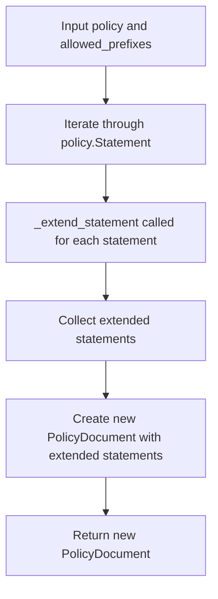

# `guess.py`

## `trailscraper.guess._guess_actions` · *function*

## Summary:
Flattens and filters AWS action identifiers from IAM statement actions based on allowed prefixes.

## Description:
This function takes a collection of IAM action objects and a set of allowed prefixes, then returns a flattened list of action identifiers that match any of the allowed prefixes. It processes each action by calling its `matching_actions` method with the allowed prefixes and combines all results into a single flat list. This utility is used during IAM policy analysis to extract relevant action identifiers for further processing.

## Args:
    actions (iterable): An iterable of action objects that must implement a `matching_actions` method.
    allowed_prefixes (iterable): An iterable of string prefixes used to filter actions.

## Returns:
    list: A flattened list of action identifiers that match at least one of the allowed prefixes. The result contains all action strings returned by calling `matching_actions` on each action object.

## Raises:
    AttributeError: If any item in the actions iterable does not have a `matching_actions` method.

## Constraints:
    Preconditions:
        - The `actions` parameter must be iterable and contain objects with a `matching_actions` method.
        - The `allowed_prefixes` parameter must be iterable.
    Postconditions:
        - The returned list contains only action identifiers that match at least one of the allowed prefixes.
        - The result is a flat list of action strings, not nested structures.

## Side Effects:
    None

## Control Flow:
```mermaid
flowchart TD
    A[Input actions iterable] --> B{Each action has matching_actions?}
    B -- Yes --> C[Call action.matching_actions(allowed_prefixes)]
    C --> D[Flatten results]
    B -- No --> E[AttributeError raised]
    D --> F[Return flattened list]
```

## Examples:
```python
# Example usage with mock action objects
class MockAction:
    def __init__(self, name):
        self.name = name
    
    def matching_actions(self, prefixes):
        if any(self.name.startswith(prefix) for prefix in prefixes):
            return [self.name]
        return []

actions = [MockAction("s3:GetObject"), MockAction("ec2:RunInstances")]
allowed = ["s3:", "lambda:"]
result = _guess_actions(actions, allowed)
# Result would be ['s3:GetObject']
```

## `trailscraper.guess._extend_statement` · *function*

## Summary:
Processes an IAM statement to potentially add an expanded version with broader resource scope.

## Description:
This function analyzes the actions in a given IAM statement to determine if any action extensions can be derived from the allowed prefixes. When extensions are identified, it creates a new statement with those extended actions while preserving the original statement's properties. The function returns a list containing either the original statement or both the original and extended statements. This approach enables policy expansion with inferred actions while maintaining the original statement structure.

## Args:
    statement (Statement): The IAM statement to process, containing Action, Effect, and Resource fields.
    allowed_prefixes (iterable): Collection of string prefixes used to determine valid action extensions.

## Returns:
    list[Statement]: A list containing either one statement (the original) or two statements (original + extended version).

## Raises:
    None explicitly raised by this function.

## Constraints:
    Preconditions:
        - The statement parameter must be a valid Statement object with Action, Effect, and Resource fields.
        - The allowed_prefixes parameter must be iterable.
    Postconditions:
        - If extended actions exist, the returned list contains exactly two statements.
        - If no extended actions exist, the returned list contains exactly one statement.

## Side Effects:
    None

## Control Flow:
```mermaid
flowchart TD
    A[Input statement and allowed_prefixes] --> B[_guess_actions called]
    B --> C{Extended actions found?}
    C -- Yes --> D[Create new statement with extended actions]
    D --> E[Return [original_statement, extended_statement]]
    C -- No --> F[Return [original_statement]]
```

## Examples:
```python
# Example usage with basic statement
from trailscraper.iam import Statement

statement = Statement(
    Action=["s3:GetObject"],
    Effect="Allow",
    Resource=["arn:aws:s3:::example-bucket/*"]
)
allowed = ["s3:", "ec2:"]
result = _extend_statement(statement, allowed)
# Result would be [statement, Statement(Action=['s3:GetObject'], Effect='Allow', Resource=['*'])]
```

## `trailscraper.guess.guess_statements` · *function*

## Summary:
Expands IAM policy statements by inferring extended resource scopes based on allowed action prefixes.

## Description:
Processes a policy's statements to identify opportunities for expanding resource scope when action extensions are possible. This function iterates through each statement in the policy and applies the `_extend_statement` helper to potentially create expanded versions with broader resource coverage. The result is a new policy document with the same version but potentially modified statements that include inferred extended actions.

The function extracts all statements from the input policy, processes them through `_extend_statement` to potentially generate expanded versions, and returns a new `PolicyDocument` with these processed statements. This approach enables policy expansion with inferred actions while maintaining the original statement structure.

## Args:
    policy (PolicyDocument): The IAM policy document containing statements to process
    allowed_prefixes (iterable): Collection of string prefixes used to determine valid action extensions

## Returns:
    PolicyDocument: A new policy document with the same version but potentially expanded statements

## Raises:
    None explicitly raised by this function

## Constraints:
    Preconditions:
        - The policy parameter must be a valid PolicyDocument object with a Statement attribute
        - The policy.Statement must be iterable (list-like)
        - The allowed_prefixes parameter must be iterable
    Postconditions:
        - The returned PolicyDocument will have the same Version as the input policy
        - The Statement list in the returned document will contain all extended statements

## Side Effects:
    None

## Control Flow:


## Examples:
```python
from trailscraper.iam import PolicyDocument, Statement
from trailscraper.guess import guess_statements

# Create a policy with basic statements
statement = Statement(
    Action=["s3:GetObject"],
    Effect="Allow",
    Resource=["arn:aws:s3:::example-bucket/*"]
)

policy = PolicyDocument(Version="2012-10-17", Statement=[statement])
allowed = ["s3:", "ec2:"]

# Process the policy to potentially expand statements
expanded_policy = guess_statements(policy, allowed)
# Returns a new PolicyDocument with possibly expanded statements
```

