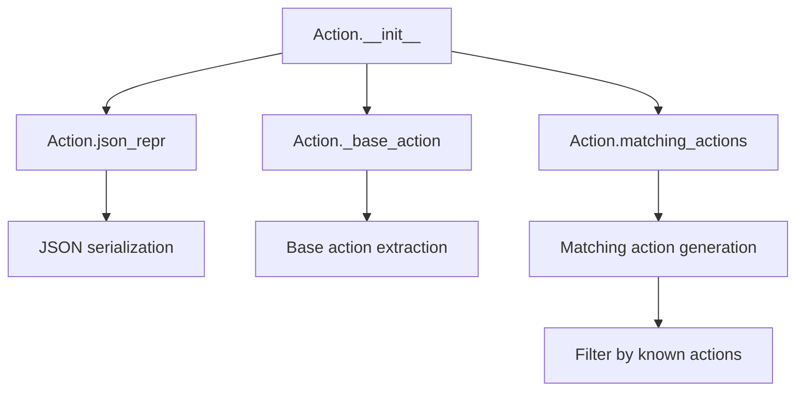
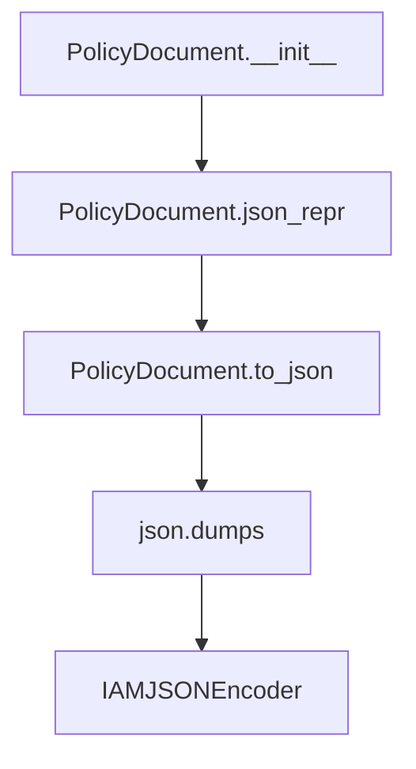
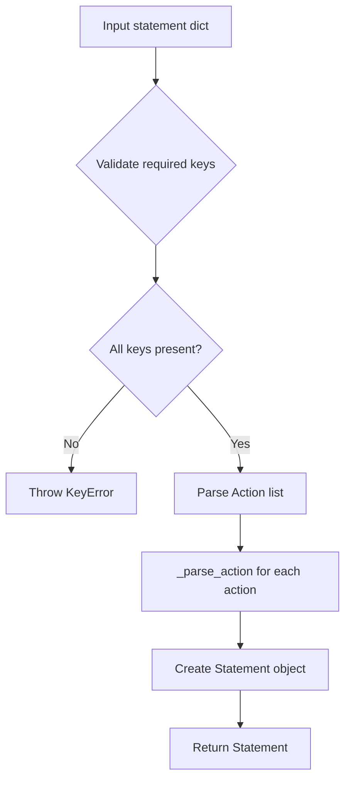
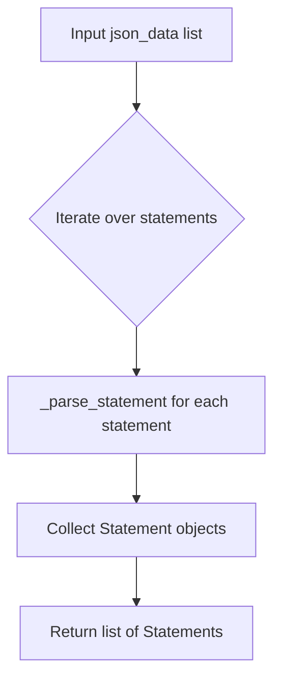
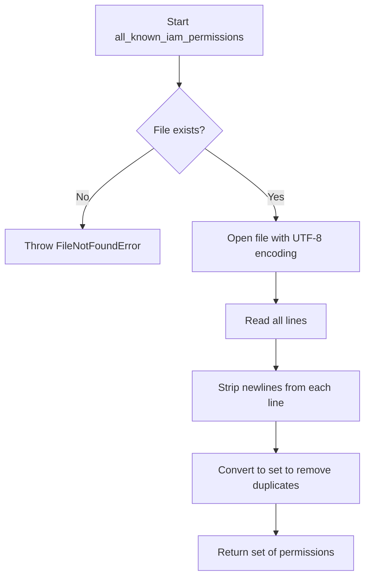

# `iam.py`

## `trailscraper.iam.BaseElement` · *class*

## Summary:
BaseElement is an abstract base class that defines a common interface for IAM elements with JSON serialization capabilities.

## Description:
BaseElement serves as a foundation for IAM-related classes that need to represent themselves as JSON objects. It provides standardized equality comparison, hashing, and string representation based on JSON serialization. This class enforces a contract that derived classes must implement the `json_repr()` method to provide their JSON representation.

## State:
- json_repr(): Abstract method that must be implemented by subclasses to return a JSON-serializable representation
- No instance attributes beyond what's defined by subclasses

## Lifecycle:
- Creation: Must be subclassed; instances are created through subclass constructors
- Usage: Typically used for equality comparisons, hashing, and string representations based on JSON serialization
- Destruction: No special cleanup required; inherits standard Python object destruction

## Method Map:
```mermaid
graph TD
    A[BaseElement] --> B[json_repr()]
    A --> C[__eq__]
    A --> D[__hash__]
    A --> E[__repr__]
    B -->|Must implement| F[Subclass]
```

## Raises:
- NotImplementedError: Raised by json_repr() method when not overridden by subclasses

## Example:
```python
class User(BaseElement):
    def __init__(self, name, email):
        self.name = name
        self.email = email
    
    def json_repr(self):
        return {"name": self.name, "email": self.email}

# Usage
user1 = User("Alice", "alice@example.com")
user2 = User("Alice", "alice@example.com")
print(user1 == user2)  # True if json_repr() returns identical dicts
print(hash(user1))     # Hash based on JSON representation
print(repr(user1))     # String representation of JSON
```

### `trailscraper.iam.BaseElement.json_repr` · *method*

## Summary:
Abstract method that must be implemented by subclasses to provide a JSON-serializable representation of the IAM element.

## Description:
The `json_repr` method serves as an abstract interface that defines how different IAM elements (such as Actions, Resources, and Statements) should be represented in JSON format. This method is intended to be overridden by subclasses to provide specific serialization logic. The method is called internally by other methods like `__eq__`, `__hash__`, and `__repr__` to enable comparison, hashing, and string representation of IAM elements.

## Args:
    None

## Returns:
    dict or str: The JSON representation of the IAM element, which can be either a dictionary (for complex elements like Statements) or a string (for simpler elements like Actions).

## Raises:
    NotImplementedError: This method is not implemented in the base class and must be overridden by subclasses.

## State Changes:
    Attributes READ: None
    Attributes WRITTEN: None

## Constraints:
    Preconditions: This method must be implemented by all subclasses of BaseElement.
    Postconditions: The returned value must be serializable to JSON.

## Side Effects:
    None

### `trailscraper.iam.BaseElement.__eq__` · *method*

## Summary:
Compares two BaseElement instances for equality based on their JSON representations.

## Description:
This method implements the equality operator (`==`) for BaseElement objects. It first verifies that the other object is an instance of the same class, then compares their JSON representations to determine equality. This approach ensures semantic equality based on the data content rather than object identity, making it suitable for comparing elements with equivalent data even if they were constructed differently.

## Args:
    other (BaseElement): Another BaseElement instance to compare against

## Returns:
    bool: True if both objects are of the same class and have identical JSON representations, False otherwise

## Raises:
    None explicitly raised

## State Changes:
    Attributes READ: 
    - self.__class__: Class reference for type checking
    - self.json_repr(): Method call that generates JSON representation of this instance
    - other.json_repr(): Method call that generates JSON representation of the other instance

## Constraints:
    Preconditions:
    - The other object must be an instance of BaseElement or its subclass
    - Both objects must implement the json_repr() method that returns comparable values
    
    Postconditions:
    - Returns boolean value indicating equality status
    - Does not modify either object's state

## Side Effects:
    None

### `trailscraper.iam.BaseElement.__ne__` · *method*

## Summary:
Implements the inequality comparison operator for BaseElement instances by negating the result of equality comparison.

## Description:
This method provides the logical inverse of the equality comparison operation. It is automatically invoked when the `!=` operator is used between two BaseElement instances. The method delegates the core comparison logic to the `__eq__` method and simply negates its result.

## Args:
    other (Any): Another object to compare against this BaseElement instance.

## Returns:
    bool: True if the objects are not equal, False if they are equal.

## Raises:
    None explicitly raised.

## State Changes:
    Attributes READ: None
    Attributes WRITTEN: None

## Constraints:
    Preconditions: The `other` argument can be any object, though meaningful comparisons are only possible when it is also a BaseElement instance of the same class.
    Postconditions: The return value is the logical negation of `self.__eq__(other)`.

## Side Effects:
    None.

### `trailscraper.iam.BaseElement.__hash__` · *method*

## Summary:
Computes and returns a hash value based on the JSON representation of the BaseElement instance.

## Description:
This method implements the standard Python `__hash__` protocol by delegating to the instance's `json_repr()` method. It enables instances of BaseElement subclasses to be used in hash-based collections like sets and dictionaries. The method is part of the object's identity contract, ensuring that equal objects produce equal hash values.

This implementation relies on the `json_repr()` method which must be implemented by subclasses to provide a stable string representation. The hash is computed using Python's built-in `hash()` function on this string representation.

## Args:
    None

## Returns:
    int: An integer hash value computed from the result of `self.json_repr()`.

## Raises:
    TypeError: If `self.json_repr()` returns a non-hashable type, which would cause `hash()` to raise a TypeError.

## State Changes:
    Attributes READ: self.json_repr()
    Attributes WRITTEN: None

## Constraints:
    Preconditions: The `json_repr()` method must return a hashable type (typically a string) and must be consistent for the lifetime of the object.
    Postconditions: The returned hash value is consistent for the lifetime of the object, assuming `json_repr()` remains unchanged.

## Side Effects:
    None

### `trailscraper.iam.BaseElement.__repr__` · *method*

## Summary:
Returns a string representation of the IAM element by delegating to its JSON representation method.

## Description:
This method provides a standard string representation for IAM elements by converting the object's JSON representation into a string. It is part of the standard Python object protocol and enables consistent display and debugging of IAM elements throughout the system. The method delegates to the abstract `json_repr()` method which must be implemented by subclasses to provide the actual JSON serialization logic.

The `__repr__` method is called by Python's built-in `repr()` function and is intended for developers to understand the object's representation. It's commonly used in debugging and logging contexts.

## Args:
    None

## Returns:
    str: A string representation of the IAM element, derived from its JSON representation.

## Raises:
    NotImplementedError: If the subclass does not implement the `json_repr()` method, which is required for proper functionality.

## State Changes:
    Attributes READ: None
    Attributes WRITTEN: None

## Constraints:
    Preconditions: The `json_repr()` method must be implemented by subclasses and should return a string.
    Postconditions: The returned string will be the result of calling `str()` on the output of `json_repr()`.

## Side Effects:
    None

## `trailscraper.iam.Action` · *class*

## Summary:
Action represents a structured IAM action with a prefix and action component, enabling standardized comparison and transformation operations.

## Description:
The Action class encapsulates an AWS IAM action in the format "prefix:action" and provides methods for JSON serialization, base action extraction, and finding matching actions based on allowed prefixes. It extends BaseElement to inherit standardized equality, hashing, and string representation behaviors based on JSON serialization.

This class is primarily used in IAM policy analysis and validation workflows where actions need to be compared, transformed, or matched against known action sets. It supports operations like identifying equivalent actions with different prefixes (e.g., "ec2:RunInstances" vs "aws:RunInstances") and generating potential matches for validation purposes.

## State:
- action (str): The action portion of the IAM action identifier (e.g., "RunInstances")
- prefix (str): The service prefix portion of the IAM action identifier (e.g., "ec2")

## Lifecycle:
- Creation: Instantiate with prefix and action parameters; both must be non-empty strings
- Usage: Used for equality comparisons, hashing, and string representations based on JSON serialization inherited from BaseElement; also used for generating matching actions
- Destruction: Standard Python object destruction; no special cleanup required

## Method Map:


## Raises:
- None explicitly raised by __init__; however, invalid inputs may cause issues in parent class methods or downstream processing

## Example:
```python
# Create an action
action = Action("ec2", "RunInstances")

# Get JSON representation
json_repr = action.json_repr()  # Returns "ec2:RunInstances"

# Extract base action (removes prefixes and plural forms)
base = action._base_action()  # Returns "RunInstance"

# Find matching actions with different prefixes
matches = action.matching_actions(["aws", "iam"])  # Finds equivalent actions with aws: or iam: prefixes
```

### `trailscraper.iam.Action.__init__` · *method*

## Summary:
Initializes an Action object with a service prefix and action name, setting up the core components for IAM action identification and comparison.

## Description:
The `__init__` method constructs an Action instance by assigning the provided prefix and action parameters to instance attributes. This method serves as the constructor for the Action class, establishing the fundamental structure needed for IAM action operations such as JSON serialization, base action extraction, and matching against alternative prefixes.

This logic is separated into its own method to ensure proper object initialization and to maintain clean separation of concerns. It allows the Action class to properly encapsulate IAM action data while providing a consistent interface for downstream operations that rely on these core attributes.

## Args:
    prefix (str): The service prefix portion of the IAM action identifier (e.g., "ec2", "iam"). Must be a non-empty string.
    action (str): The action portion of the IAM action identifier (e.g., "RunInstances"). Must be a non-empty string.

## Returns:
    None: This method initializes instance attributes and does not return a value.

## Raises:
    None: This method does not explicitly raise exceptions, though invalid inputs may cause issues in subsequent operations.

## State Changes:
    Attributes READ: None
    Attributes WRITTEN: 
    - self.action (str): Stores the action portion of the IAM action identifier
    - self.prefix (str): Stores the service prefix portion of the IAM action identifier

## Constraints:
    Preconditions:
    - Both `prefix` and `action` must be non-empty strings
    - The method should only be called during object construction
    - Values should conform to standard IAM action naming conventions

    Postconditions:
    - Instance attributes `self.action` and `self.prefix` are set to the provided values
    - The Action object is ready for use in downstream operations requiring these attributes

## Side Effects:
    None: This method performs no I/O operations, external service calls, or mutations to objects outside the instance being initialized.

### `trailscraper.iam.Action.json_repr` · *method*

## Summary:
Returns a colon-separated string representation combining the action's prefix and action components.

## Description:
This method generates a standardized string representation of an IAM action by concatenating the instance's prefix and action attributes with a colon separator. It is used to create a unique identifier for IAM actions that can be easily serialized and compared.

## Args:
    None

## Returns:
    str: A colon-separated string in the format "prefix:action" where prefix and action are the respective attributes of the Action instance.

## Raises:
    None

## State Changes:
    Attributes READ: self.prefix, self.action
    Attributes WRITTEN: None

## Constraints:
    Preconditions: Both self.prefix and self.action must be string-type attributes.
    Postconditions: The returned string will always follow the format "prefix:action" with no additional processing or validation.

## Side Effects:
    None

### `trailscraper.iam.Action._base_action` · *method*

## Summary:
Extracts the base action name by removing prefixes and singularizing plural forms from the action string.

## Description:
This method processes the action attribute of an Action instance to derive a normalized base action name. It removes known prefixes defined in BASE_ACTION_PREFIXES and strips trailing 's' characters to convert plurals to singular form. This normalized form is used for matching and comparison operations in IAM action handling.

## Args:
    None

## Returns:
    str: The base action name with prefixes removed and plural suffixes stripped.

## Raises:
    None explicitly raised

## State Changes:
    Attributes READ: self.action
    Attributes WRITTEN: None

## Constraints:
    Preconditions: The action attribute must be a string containing valid IAM action identifiers.
    Postconditions: The returned string represents a canonical form of the action without prefixes or pluralization.

## Side Effects:
    None

### `trailscraper.iam.Action.matching_actions` · *method*

## Summary:
Generates candidate IAM actions by combining allowed prefixes with the base action name, filtering for valid actions that differ from the current instance.

## Description:
This method creates potential IAM action variations by combining specified prefixes with the base action name extracted from the current action. It generates both singular and plural forms of these combinations and filters them against known IAM actions for the same service prefix, excluding the current action itself. This is primarily used for finding related IAM actions during policy analysis and validation workflows.

The method separates the logic of generating and filtering potential matches from inline code, enabling better testability and reuse in IAM policy processing pipelines.

## Args:
    allowed_prefixes (list[str], optional): A list of IAM action prefixes to combine with the base action. If None or empty, defaults to BASE_ACTION_PREFIXES.

## Returns:
    list[Action]: A list of Action objects representing valid IAM actions that match the constructed patterns but are not identical to the current action instance.

## Raises:
    None explicitly raised by this method.

## State Changes:
    Attributes READ: self.prefix, self._base_action()
    Attributes WRITTEN: None

## Constraints:
    Preconditions:
        - The current instance must have a valid prefix attribute.
        - The _base_action() method must return a valid string representation of the base action.
        - The known_iam_actions function must be available and return valid Action objects for the current prefix.
    
    Postconditions:
        - The returned list contains only Action objects that are valid for the current prefix.
        - All returned actions are different from the current instance (self).
        - The returned actions are formed by combining allowed prefixes with the base action name.

## Side Effects:
    - Calls the known_iam_actions function, which performs file I/O operations.
    - May raise exceptions from file operations if the known-iam-actions.txt file is inaccessible.

## `trailscraper.iam.Statement` · *class*

## Summary:
Statement represents an AWS IAM policy statement with Action, Effect, and Resource components, enabling JSON serialization and merging operations.

## Description:
The Statement class encapsulates the core components of an AWS IAM policy statement. It is designed to be instantiated by policy processing systems and supports merging of compatible statements. The class extends BaseElement, inheriting JSON serialization capabilities and equality semantics based on JSON representation.

## State:
- Action: List of action objects that define what operations are allowed or denied
- Effect: String value indicating whether the statement allows ('Allow') or denies ('Deny') access
- Resource: List of resource identifiers that the statement applies to

## Lifecycle:
- Creation: Instantiate with Action, Effect, and Resource parameters; Effect must be either 'Allow' or 'Deny'
- Usage: Typically used in policy merging operations and JSON serialization for policy generation
- Destruction: Standard Python object cleanup; no special destruction required

## Method Map:
```mermaid
graph TD
    A[Statement] --> B[merge(other)]
    A --> C[json_repr()]
    A --> D[__lt__(other)]
    B --> E[ValueError]
    C --> F[dict]
    D --> G[bool]
```

## Raises:
- ValueError: Raised during merge() when attempting to combine statements with different Effect values

## Example:
```python
# Create two statements with same Effect
stmt1 = Statement(
    Action=[action1, action2],
    Effect="Allow",
    Resource=["arn:aws:s3:::bucket/*"]
)
stmt2 = Statement(
    Action=[action3],
    Effect="Allow",
    Resource=["arn:aws:s3:::bucket2/*"]
)

# Merge compatible statements
merged = stmt1.merge(stmt2)
print(merged.json_repr())  # JSON representation of merged statement
```

### `trailscraper.iam.Statement.__init__` · *method*

## Summary:
Initializes a Statement object with Action, Effect, and Resource attributes.

## Description:
This method serves as the constructor for the Statement class, setting up the fundamental properties that define an IAM policy statement. It is called during object instantiation to configure the statement's core components.

## Args:
    Action (str or list): The action(s) permitted or denied by this statement
    Effect (str): The effect of the statement, typically 'Allow' or 'Deny'
    Resource (str or list): The resource(s) to which this statement applies

## Returns:
    None: This method does not return a value

## Raises:
    None: This method does not explicitly raise exceptions

## State Changes:
    Attributes READ: None
    Attributes WRITTEN: self.Action, self.Effect, self.Resource

## Constraints:
    Preconditions: The arguments must be provided in the correct order and of appropriate types
    Postconditions: The Statement object will have its Action, Effect, and Resource attributes set to the provided values

## Side Effects:
    None: This method performs no I/O operations or external service calls

### `trailscraper.iam.Statement.json_repr` · *method*

## Summary:
Returns a JSON representation of the IAM statement containing its action, effect, and resource properties.

## Description:
This method provides a standardized dictionary format for representing an IAM statement, primarily used for serialization purposes. It is typically called during the processing or export phase of IAM policy management workflows when converting statement objects into JSON-compatible structures.

## Args:
    None

## Returns:
    dict: A dictionary with keys 'Action', 'Effect', and 'Resource' mapping to their respective attribute values from the statement object.

## Raises:
    None

## State Changes:
    Attributes READ: self.Action, self.Effect, self.Resource
    Attributes WRITTEN: None

## Constraints:
    Preconditions: The statement object must have 'Action', 'Effect', and 'Resource' attributes defined.
    Postconditions: The returned dictionary exactly mirrors the three core attributes of the statement.

## Side Effects:
    None

### `trailscraper.iam.Statement.merge` · *method*

## Summary:
Merges two IAM statements with identical Effect values by combining their actions and resources while eliminating duplicates.

## Description:
This method combines two Statement objects that share the same Effect value into a single Statement with merged actions and resources. It's designed to consolidate similar IAM permissions during policy analysis or construction workflows. The method ensures that actions are sorted by their JSON representation and resources are deduplicated and sorted.

The merge operation is only valid when both statements have identical Effect values. If the Effect values differ, a ValueError is raised to prevent invalid policy combinations.

## Args:
    other (Statement): Another Statement object to merge with this one. Must have the same Effect value as self.

## Returns:
    Statement: A new Statement object containing:
        - Combined actions from both statements with duplicates removed and sorted by JSON representation
        - Combined resources from both statements with duplicates removed and sorted

## Raises:
    ValueError: When attempting to merge statements with different Effect values (e.g., "Allow" vs "Deny")

## State Changes:
    Attributes READ: self.Effect, self.Action, self.Resource
    Attributes WRITTEN: None (returns new object)

## Constraints:
    Preconditions: 
        - Both statements must have the same Effect value
        - Both statements must be valid Statement objects
    Postconditions: 
        - Returned statement has unique actions and resources
        - Actions are sorted by their JSON representation
        - Resources are sorted lexicographically

## Side Effects:
    None

### `trailscraper.iam.Statement.__action_list_strings` · *method*

## Summary:
Returns a hyphen-separated string representation of all action objects in the statement's Action list.

## Description:
This method aggregates all action objects contained in the Statement's Action attribute and converts each to its JSON representation before joining them with hyphens. It serves as a utility for creating a compact string identifier representing all actions associated with a statement. This method is primarily used internally for sorting and comparison operations, specifically in the `__lt__` method for comparing statements.

## Args:
    None

## Returns:
    str: A hyphen-separated string containing JSON representations of all action objects in self.Action.
         Returns an empty string if self.Action is empty or None.

## Raises:
    AttributeError: If self.Action is None or does not support iteration.
    AttributeError: If any object in self.Action does not have a json_repr() method.

## State Changes:
    Attributes READ: self.Action
    Attributes WRITTEN: None

## Constraints:
    Preconditions:
        - self.Action must be iterable (list-like structure)
        - Each item in self.Action must have a json_repr() method
    Postconditions:
        - Returns a string with hyphen-separated JSON representations
        - Empty string returned if self.Action is empty or None

## Side Effects:
    None

### `trailscraper.iam.Statement.__lt__` · *method*

## Summary:
Compares two IAM Statement objects for ordering based on Effect, Action, and Resource attributes.

## Description:
This method implements the less-than comparison operator for IAM Statement objects, enabling sorting and ordering operations. It compares statements primarily by Effect, then by Action (using string representations), and finally by Resource. This logic is encapsulated in its own method to support proper sorting behavior in collections of IAM statements.

## Args:
    other (Statement): Another IAM Statement object to compare against

## Returns:
    bool: True if self is considered "less than" other according to the defined ordering criteria, False otherwise

## Raises:
    None explicitly raised

## State Changes:
    Attributes READ: self.Effect, self.Action, self.Resource

## Constraints:
    Preconditions: Both self and other must be Statement instances with comparable attributes
    Postconditions: Returns boolean result based on lexicographic ordering of Effect, Action, and Resource

## Side Effects:
    None

## `trailscraper.iam.PolicyDocument` · *class*

## Summary:
PolicyDocument represents an AWS IAM policy document with version and statement components, providing JSON serialization capabilities.

## Description:
The PolicyDocument class encapsulates the structure of an AWS IAM policy, consisting of a version identifier and one or more statements. It serves as a data container for IAM policies that can be serialized to JSON format for use with AWS services. This class extends BaseElement to inherit standardized JSON-based equality, hashing, and string representation behaviors.

The class is designed to be instantiated with a Statement parameter (which can be a single statement or list of statements) and an optional Version parameter. It provides two primary methods for JSON serialization: json_repr() for generating the dictionary representation and to_json() for producing a formatted JSON string.

## State:
- Version (str): The IAM policy version, defaults to "2012-10-17" if not specified
- Statement: The policy statement(s) - can be a single statement dict or list of statement dicts

## Lifecycle:
- Creation: Instantiate with Statement parameter and optional Version parameter
- Usage: Call to_json() to serialize to formatted JSON string, or json_repr() for dictionary representation
- Destruction: Standard Python object cleanup via garbage collection

## Method Map:


## Raises:
- No explicit exceptions raised by __init__
- json.dumps() may raise JSON serialization exceptions if the data contains unserializable objects

## Example:
```python
from trailscraper.iam import PolicyDocument

# Create a policy document with a single statement
statement = {
    "Effect": "Allow",
    "Action": "s3:GetObject",
    "Resource": "arn:aws:s3:::example-bucket/*"
}

policy = PolicyDocument(Statement=statement)
json_output = policy.to_json()

# Output would be a formatted JSON string representing the policy
```

### `trailscraper.iam.PolicyDocument.__init__` · *method*

## Summary:
Initializes a PolicyDocument object with a specified statement and version.

## Description:
This method sets up the basic structure of an IAM policy document by assigning the provided statement and version to the object's attributes. It serves as the constructor for the PolicyDocument class, establishing the foundational elements needed for an IAM policy.

## Args:
    Statement (any): The statement or statements that define the permissions for this policy document.
    Version (str): The version of the policy language. Defaults to "2012-10-17".

## Returns:
    None: This method does not return any value.

## Raises:
    None: This method does not explicitly raise any exceptions.

## State Changes:
    Attributes READ: None
    Attributes WRITTEN: self.Version, self.Statement

## Constraints:
    Preconditions: The Statement parameter should be a valid IAM policy statement structure.
    Postconditions: The PolicyDocument instance will have its Version and Statement attributes set to the provided values.

## Side Effects:
    None: This method does not perform any I/O operations or mutate external objects.

### `trailscraper.iam.PolicyDocument.json_repr` · *method*

## Summary:
Returns a dictionary representation of the policy document suitable for JSON serialization.

## Description:
This method provides a standardized dictionary format for the policy document that can be directly serialized to JSON. It extracts the Version and Statement attributes from the policy document instance and structures them according to AWS IAM policy document conventions.

The method is designed to be called during the serialization phase of policy document processing, typically when preparing the document for storage, transmission, or API requests to AWS services.

This logic is encapsulated in its own method rather than being inlined because it provides a consistent interface for converting the policy document object to its JSON representation, making the code more readable and maintainable.

## Args:
    None

## Returns:
    dict: A dictionary containing 'Version' and 'Statement' keys with their respective values from the policy document instance.

## Raises:
    None

## State Changes:
    Attributes READ: self.Version, self.Statement
    Attributes WRITTEN: None

## Constraints:
    Preconditions: The PolicyDocument instance must have both Version and Statement attributes defined.
    Postconditions: The returned dictionary will always contain exactly the 'Version' and 'Statement' keys with their corresponding attribute values.

## Side Effects:
    None

### `trailscraper.iam.PolicyDocument.to_json` · *method*

## Summary:
Converts the policy document's JSON representation into a formatted JSON string.

## Description:
This method serializes the policy document's internal representation into a human-readable JSON format. It leverages the `json_repr()` method to obtain the dictionary representation and uses `json.dumps()` with custom formatting options to produce a properly indented and sorted JSON string. This method is typically called during policy validation or export operations.

## Args:
    None

## Returns:
    str: A formatted JSON string representing the policy document, with 4-space indentation and keys sorted alphabetically.

## Raises:
    TypeError: If the object returned by `json_repr()` contains non-serializable types.

## State Changes:
    Attributes READ: self.json_repr()
    Attributes WRITTEN: None

## Constraints:
    Preconditions: The object must have a `json_repr()` method that returns a serializable dictionary.
    Postconditions: The returned string is a valid JSON representation of the policy document with consistent formatting.

## Side Effects:
    None

## `trailscraper.iam.IAMJSONEncoder` · *class*

## Summary:
A custom JSON encoder that extends the standard library's JSONEncoder to handle objects with a json_repr() method.

## Description:
The IAMJSONEncoder class provides a mechanism to serialize custom objects that implement a json_repr() method into JSON format. It serves as a bridge between Python objects and JSON serialization, allowing objects to define their own JSON representation without modifying the core serialization logic.

This class is particularly useful when working with complex data models that need to be converted to JSON for storage, transmission, or API responses. It maintains compatibility with standard JSON encoding while extending functionality to support custom object representations.

## State:
- No instance attributes beyond those inherited from json.JSONEncoder
- Inherits all state and behavior from json.JSONEncoder base class
- The encoder operates on a per-object basis during serialization

## Lifecycle:
- Creation: Instantiated like any other JSONEncoder subclass (no special constructor required)
- Usage: Called automatically by json.dumps() or json.dump() when encountering objects that don't have built-in JSON serialization support
- Destruction: Managed by Python's garbage collection; no explicit cleanup required

## Method Map:
```mermaid
graph TD
    A[json.dumps()] --> B[IAMJSONEncoder.default()]
    B --> C{hasattr(o, 'json_repr')?}
    C -->|Yes| D[o.json_repr()]
    C -->|No| E[json.JSONEncoder.default()]
```

## Raises:
- No explicit exceptions raised by __init__ (inherits from json.JSONEncoder)
- May raise standard JSON serialization exceptions from parent class when handling unsupported types

## Example:
```python
import json
from trailscraper.iam import IAMJSONEncoder

class User:
    def __init__(self, name, email):
        self.name = name
        self.email = email
    
    def json_repr(self):
        return {'name': self.name, 'email': self.email}

user = User("John Doe", "john@example.com")
json_string = json.dumps(user, cls=IAMJSONEncoder)
# Result: '{"name": "John Doe", "email": "john@example.com"}'
```

### `trailscraper.iam.IAMJSONEncoder.default` · *method*

## Summary:
Handles serialization of objects that have a custom JSON representation method.

## Description:
This method overrides the default JSON encoding behavior to support objects that define a `json_repr()` method. It is called by the JSON encoder when it encounters an object that is not natively serializable. The method checks if the object has a `json_repr` attribute and delegates serialization to that method if present, otherwise falls back to the parent class's default handling.

## Args:
    o (Any): The object to serialize to JSON.

## Returns:
    Any: The serialized representation of the object, either from `json_repr()` or the parent encoder.

## Raises:
    TypeError: When the object cannot be serialized by either the custom `json_repr` method or the parent encoder.

## State Changes:
    Attributes READ: None
    Attributes WRITTEN: None

## Constraints:
    Preconditions: The object being serialized must either have a `json_repr` method or be serializable by the parent JSON encoder.
    Postconditions: The returned value is a JSON-serializable representation of the input object.

## Side Effects:
    None

## `trailscraper.iam._parse_action` · *function*

## Summary:
Parses an IAM action string into its prefix and action components.

## Description:
This function splits an IAM action string by the colon (:) delimiter and constructs an Action object with the resulting parts. It serves as a utility for parsing IAM action identifiers that follow the format "prefix:action".

The function is used internally to process IAM permissions defined in external files and convert them into structured Action objects for further processing and validation. It assumes the input follows the standard AWS IAM action format.

## Args:
    action (str): A string representing an IAM action in the format "prefix:action" where prefix and action are non-empty strings.

## Returns:
    Action: An Action object with the prefix and action attributes set to the respective parts from the input string.

## Raises:
    IndexError: If the input action string does not contain exactly two parts when split by ':' (i.e., if split results in fewer than 2 or more than 2 parts).

## Constraints:
    Preconditions:
        - The input action string must contain at least one colon character.
        - When split by ':', the result must contain exactly two elements.
        - Both parts must be non-empty strings after splitting.
    
    Postconditions:
        - The returned Action object will have its prefix and action attributes set to the respective parts from the input string.
        - The prefix attribute will contain the first part after splitting.
        - The action attribute will contain the second part after splitting.

## Side Effects:
    None

## Control Flow:
```mermaid
flowchart TD
    A[Input action string] --> B{Split by ":"}
    B --> C{Number of parts = 2?}
    C -->|No| D[Throw IndexError]
    C -->|Yes| E[Create Action(prefix=parts[0], action=parts[1])]
    E --> F[Return Action]
```

## Examples:
```python
# Basic usage
action = _parse_action("ec2:RunInstances")
# Returns Action object with prefix="ec2" and action="RunInstances"

# Error case - input with no colon
try:
    _parse_action("invalidaction")
except IndexError:
    # Handle case where action doesn't contain a colon
    pass

# Error case - input with multiple colons  
try:
    _parse_action("ec2:s3:RunInstances")
except IndexError:
    # Handle case where action contains multiple colons
    pass
```

## `trailscraper.iam._parse_statement` · *function*

## Summary:
Parses a raw IAM policy statement dictionary into a structured Statement object with parsed Action components.

## Description:
This function transforms a dictionary representation of an AWS IAM policy statement into a Statement object by processing each action in the statement's Action field through the _parse_action helper function. It serves as a bridge between raw policy data and structured policy objects, enabling downstream processing and validation.

The function is extracted into its own component to enforce a clear separation between data parsing and policy manipulation logic. This design ensures that statement parsing is reusable and testable independently from the broader policy processing pipeline.

## Args:
    statement (dict): A dictionary containing the keys 'Action', 'Effect', and 'Resource' representing an IAM policy statement. The 'Action' key must map to a list of action strings, 'Effect' must be either 'Allow' or 'Deny', and 'Resource' must map to a list of resource ARNs.

## Returns:
    Statement: A Statement object with Action components parsed into structured Action objects, Effect set to the provided value, and Resource set to the provided list.

## Raises:
    KeyError: If the input statement dictionary is missing any of the required keys: 'Action', 'Effect', or 'Resource'.
    IndexError: If any action string in the statement's Action list fails to parse correctly via _parse_action due to improper formatting (specifically, if an action string does not contain exactly two parts when split by ':'.

## Constraints:
    Preconditions:
        - The input statement must be a dictionary containing all required keys: 'Action', 'Effect', and 'Resource'.
        - The 'Effect' value must be either 'Allow' or 'Deny'.
        - The 'Action' value must be a list of strings.
        - The 'Resource' value must be a list of strings.
    
    Postconditions:
        - The returned Statement object will have properly parsed Action components.
        - The Effect and Resource fields will retain their original values from the input statement.

## Side Effects:
    None

## Control Flow:


## Examples:
```python
# Basic usage
raw_statement = {
    "Action": ["ec2:RunInstances", "ec2:DescribeInstances"],
    "Effect": "Allow",
    "Resource": ["arn:aws:ec2:*:*:instance/*"]
}

parsed_statement = _parse_statement(raw_statement)
# Returns Statement object with parsed actions and original Effect/Resource

# Error case - missing key
try:
    incomplete_statement = {"Action": [], "Effect": "Allow"}
    _parse_statement(incomplete_statement)
except KeyError:
    # Handle missing Resource key
    pass
```

## `trailscraper.iam._parse_statements` · *function*

## Summary:
Parses a list of raw IAM policy statement dictionaries into a list of structured Statement objects.

## Description:
Processes a list of IAM policy statement dictionaries by applying the `_parse_statement` function to each item. This function serves as the entry point for converting raw policy data into structured objects that can be further processed or validated.

The function is extracted into its own component to separate the concern of list iteration from individual statement parsing logic. This design allows for clean composition with other data processing functions and enables testing of the parsing pipeline at different levels.

## Args:
    json_data (list[dict]): A list of dictionaries, each representing an IAM policy statement with keys 'Action', 'Effect', and 'Resource'. Each dictionary must conform to the expected IAM statement structure.

## Returns:
    list[Statement]: A list of Statement objects, each created by parsing the corresponding input statement dictionary using `_parse_statement`.

## Raises:
    KeyError: If any statement dictionary in the input list is missing required keys ('Action', 'Effect', or 'Resource') when passed to `_parse_statement`.
    IndexError: If any action string in a statement's Action list fails to parse correctly via `_parse_action` due to improper formatting.

## Constraints:
    Preconditions:
        - The input `json_data` must be a list of dictionaries.
        - Each dictionary in the list must contain all required keys: 'Action', 'Effect', and 'Resource'.
        - The 'Effect' value in each statement must be either 'Allow' or 'Deny'.
        - The 'Action' and 'Resource' values in each statement must be lists of strings.
    
    Postconditions:
        - The returned list contains Statement objects with properly parsed Action components.
        - Each Statement object retains the original Effect and Resource values from its input dictionary.

## Side Effects:
    None

## Control Flow:


## Examples:
```python
# Basic usage
raw_statements = [
    {
        "Action": ["ec2:RunInstances", "ec2:DescribeInstances"],
        "Effect": "Allow",
        "Resource": ["arn:aws:ec2:*:*:instance/*"]
    },
    {
        "Action": ["s3:GetObject"],
        "Effect": "Deny",
        "Resource": ["arn:aws:s3:::example-bucket/*"]
    }
]

parsed_statements = _parse_statements(raw_statements)
# Returns list of Statement objects with parsed actions and original Effect/Resource

# Error case - malformed statement in list
try:
    invalid_statements = [
        {"Action": [], "Effect": "Allow", "Resource": []},
        {"Action": [], "Effect": "Allow"}  # Missing Resource
    ]
    _parse_statements(invalid_statements)
except KeyError:
    # Handle missing Resource key in second statement
    pass
```

## `trailscraper.iam.parse_policy_document` · *function*

## Summary:
Parses an AWS IAM policy document from JSON input into a structured PolicyDocument object.

## Description:
Converts raw JSON-formatted IAM policy data into a structured PolicyDocument object containing parsed statements and version information. This function serves as the primary entry point for processing IAM policy documents within the trailscraper system, enabling downstream analysis and validation of IAM permissions.

The function handles both string and file-like input streams, making it flexible for various data sources while maintaining consistent output structure. It delegates the actual statement parsing to the `_parse_statements` helper function, ensuring separation of concerns between input handling and policy structure processing.

## Args:
    stream: Either a JSON string containing the policy document or a file-like object with JSON content. When a string is provided, it's parsed directly using `json.loads()`. When a file-like object is provided, it's parsed using `json.load()`.

## Returns:
    PolicyDocument: A structured PolicyDocument object containing parsed statements and version information extracted from the input JSON.

## Raises:
    json.JSONDecodeError: When the input stream contains invalid JSON that cannot be parsed.
    KeyError: When the parsed JSON lacks required keys ('Statement' or 'Version').
    TypeError: When the input stream is neither a string nor a file-like object.

## Constraints:
    Preconditions:
        - Input stream must contain valid JSON data representing an IAM policy document
        - The JSON must include both 'Statement' and 'Version' keys at the root level
        - If 'Statement' is present, it must be a list of statement dictionaries
        - The 'Version' value must be a valid IAM policy version string
    
    Postconditions:
        - Returns a properly initialized PolicyDocument object
        - The returned object contains parsed Statement objects in its Statement attribute
        - The Version attribute of the returned object matches the input version

## Side Effects:
    None

## Control Flow:
```mermaid
flowchart TD
    A[parse_policy_document called] --> B{stream is string?}
    B -->|Yes| C[json.loads(stream)]
    B -->|No| D[json.load(stream)]
    C --> E[Extract Statement and Version]
    D --> E
    E --> F[_parse_statements for Statement]
    F --> G[Create PolicyDocument]
    G --> H[Return PolicyDocument]
```

## Examples:
```python
# Parse from JSON string
policy_string = '''
{
    "Version": "2012-10-17",
    "Statement": [
        {
            "Effect": "Allow",
            "Action": "s3:GetObject",
            "Resource": "arn:aws:s3:::example-bucket/*"
        }
    ]
}
'''

policy_doc = parse_policy_document(policy_string)
# Returns PolicyDocument with parsed statement and version

# Parse from file-like object
import io
policy_file = io.StringIO(policy_string)
policy_doc = parse_policy_document(policy_file)
# Same result as above
```

## `trailscraper.iam.all_known_iam_permissions` · *function*

## Summary:
Returns a set of all known IAM permissions by reading from a static file.

## Description:
This function provides access to a predefined list of AWS IAM permissions stored in a text file. It reads the file line-by-line, strips newline characters, and returns the permissions as a set for efficient lookup operations. The function is designed to centralize permission definitions and make them easily accessible throughout the application.

## Args:
    None

## Returns:
    set[str]: A set containing all known IAM permissions as strings, with trailing newlines removed from each line.

## Raises:
    FileNotFoundError: When the 'known-iam-actions.txt' file does not exist in the same directory as the iam.py module.
    UnicodeDecodeError: When the file cannot be decoded using UTF-8 encoding.

## Constraints:
    Preconditions:
        - The 'known-iam-actions.txt' file must exist in the same directory as the iam.py module.
        - The file must be readable and properly formatted with one permission per line.
    Postconditions:
        - The returned set contains no duplicate permissions.
        - All permissions in the set have trailing newlines stripped.

## Side Effects:
    - Reads from the filesystem (specifically the 'known-iam-actions.txt' file in the same directory as this module).
    - May raise file I/O related exceptions if the file is inaccessible or improperly formatted.

## Control Flow:


## Examples:
```python
# Basic usage
permissions = all_known_iam_permissions()
print(len(permissions))  # Prints number of known IAM permissions

# Check if specific permission exists
if "s3:GetObject" in permissions:
    print("S3 GetObject permission is known")
```

## `trailscraper.iam.known_iam_actions` · *function*

## Summary:
Retrieves a list of known IAM actions for a specified service prefix.

## Description:
This function filters and returns all known IAM actions that belong to a given service prefix. It processes a collection of all known IAM permissions by parsing each action into its prefix and action components, grouping them by prefix, and returning the subset matching the requested prefix.

The function is designed to support IAM policy analysis and validation by providing easy access to service-specific IAM actions. It leverages a pipeline of transformations using toolz functions to efficiently process and organize the IAM permission data.

## Args:
    prefix (str): The AWS service prefix (e.g., "ec2", "s3") to filter IAM actions by.

## Returns:
    list[Action]: A list of Action objects representing IAM actions that match the specified prefix. Returns an empty list if no actions are found for the prefix.

## Raises:
    None explicitly raised by this function.

## Constraints:
    Preconditions:
        - The input prefix must be a non-empty string.
        - The underlying data source (known-iam-actions.txt) must be accessible and properly formatted.
    
    Postconditions:
        - The returned list contains Action objects with valid prefix and action attributes.
        - The list is empty if no actions match the provided prefix.

## Side Effects:
    - Reads from the filesystem (specifically the 'known-iam-actions.txt' file in the same directory as this module).
    - May raise file I/O related exceptions if the file is inaccessible or improperly formatted.

## Control Flow:
```mermaid
flowchart TD
    A[Call known_iam_actions(prefix)] --> B[Get all known IAM permissions]
    B --> C[Parse each action into prefix/action components using _parse_action]
    C --> D[Group parsed actions by prefix using groupby]
    D --> E[Retrieve actions for specified prefix]
    E --> F[Return list of actions or empty list]
```

## Examples:
```python
# Get all EC2 actions
ec2_actions = known_iam_actions("ec2")
print(f"Found {len(ec2_actions)} EC2 actions")

# Get actions for a non-existent prefix
unknown_actions = known_iam_actions("nonexistent")
print(f"Found {len(unknown_actions)} actions for nonexistent service")  # Returns 0
```

