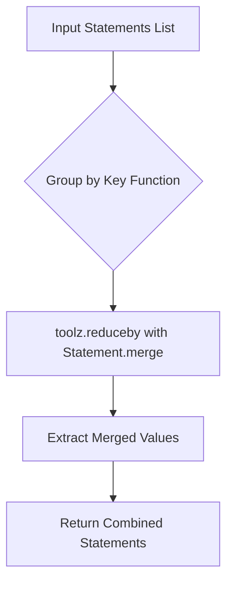

# `policy_generator.py`

## `trailscraper.policy_generator._combine_statements_by` · *function*

## Summary:
Combines IAM statements with identical keys into merged statements using a specified key function.

## Description:
This function creates a curried combiner that groups IAM statements by a specified key and merges those with identical keys using Statement.merge. It's designed to consolidate similar IAM permissions during policy analysis or construction workflows.

The function is typically used in policy generation pipelines where multiple CloudTrail records need to be aggregated into consolidated IAM statements with minimal redundancy. It leverages toolz.reduceby internally to perform the grouping and merging operations efficiently.

## Args:
    key (callable): A function that takes a Statement object and returns a hashable key for grouping. The key determines which statements are considered equivalent for merging.

## Returns:
    callable: A function that accepts a list of Statement objects and returns a list of merged Statement objects, where statements with identical keys have been combined.

## Raises:
    None explicitly raised by this function. Exceptions may occur during Statement.merge if statements have incompatible Effect values.

## Constraints:
    Preconditions:
        - The key function must return hashable values for proper grouping
        - Input statements should be valid Statement objects
        - All statements with the same key must be compatible for merging (same Effect values)
    Postconditions:
        - Output contains one statement per unique key
        - Statements with identical keys are merged using Statement.merge
        - Merged statements maintain sorted actions and resources

## Side Effects:
    None

## Control Flow:


## Examples:
```python
# Example usage for combining statements by Effect
from trailscraper.iam import Statement

statements = [
    Statement(Effect="Allow", Action=["s3:GetObject"], Resource=["arn:aws:s3:::bucket/*"]),
    Statement(Effect="Allow", Action=["s3:PutObject"], Resource=["arn:aws:s3:::bucket/*"]),
    Statement(Effect="Deny", Action=["s3:DeleteObject"], Resource=["arn:aws:s3:::bucket/*"])
]

# Combine statements by Effect
combine_by_effect = _combine_statements_by(lambda stmt: stmt.Effect)
result = combine_by_effect(statements)
# Result would contain 2 statements: one Allow and one Deny with combined actions/resources
```

## `trailscraper.policy_generator.generate_policy` · *function*

## Summary:
Generates an AWS IAM policy document from CloudTrail records by converting them to statements and consolidating similar permissions.

## Description:
Transforms a collection of CloudTrail records into a structured IAM policy document by converting each record to an IAM statement, filtering out invalid statements, consolidating statements with identical resources or actions, and sorting the final result. This function serves as the core policy generation logic that aggregates CloudTrail event data into a standardized IAM policy representation for access control analysis and security auditing.

The function implements a functional pipeline using toolz curried functions to process records through multiple stages of conversion and consolidation. It's designed to be called during policy analysis workflows where CloudTrail records need to be transformed into policy representations for further processing or inspection.

## Args:
    selected_records (Iterable[Record]): Collection of CloudTrail Record objects to be converted into policy statements. Each record represents an AWS service event with associated metadata such as event source, event name, and resource ARNs.

## Returns:
    PolicyDocument: An IAM policy document containing consolidated statements derived from the input records. The policy has version "2012-10-17" and includes all valid statements from the input records, grouped and merged appropriately to minimize redundancy.

## Raises:
    None explicitly raised by this function. Exceptions may occur during statement processing if records contain invalid data or if statement merging fails due to incompatible effects during the consolidation phase.

## Constraints:
    Preconditions:
        - Input records must be valid Record objects with proper event data
        - Each record should be convertible to a valid IAM statement via Record.to_statement()
    Postconditions:
        - Output policy document contains only valid statements (None statements filtered out)
        - Statements with identical resources are merged into single statements using _combine_statements_by
        - Statements with identical actions are merged into single statements using _combine_statements_by
        - Final statements are sorted by their string representation for consistent output

## Side Effects:
    None

## Control Flow:
```mermaid
flowchart TD
    A[Input selected_records] --> B[Convert to statements using Record.to_statement]
    B --> C[Filter out None statements]
    C --> D[Group and merge statements by Resource using _combine_statements_by]
    D --> E[Group and merge statements by Action using _combine_statements_by]
    E --> F[Sort final statements]
    F --> G[Create PolicyDocument with Version="2012-10-17"]
    G --> H[Return PolicyDocument]
```

## Examples:
```python
# Basic usage with sample records
from trailscraper.cloudtrail import Record
from trailscraper.policy_generator import generate_policy

# Create sample CloudTrail records
records = [
    Record(event_source="s3.amazonaws.com", event_name="GetObject"),
    Record(event_source="s3.amazonaws.com", event_name="PutObject")
]

# Generate policy document
policy = generate_policy(records)
print(policy.to_json())
```

