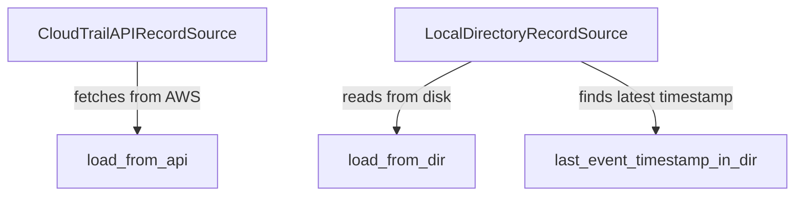

# `trailscraper.record_sources`

## Tree:
record_sources/
├── cloudtrail_api_record_source.py
└── local_directory_record_source.py

## Role:
Provides unified interfaces for loading CloudTrail audit records from either AWS CloudTrail API or local log files.

## Description:
This module encapsulates the data sourcing logic for CloudTrail records, offering two distinct implementations: one for fetching records directly from the AWS CloudTrail API and another for reading records from locally stored CloudTrail log files. The module abstracts away the differences between these data sources, allowing higher-level components to consume CloudTrail data uniformly regardless of its origin.

The module is primarily consumed by the main trailscraper workflow components that require access to CloudTrail data for analysis, such as the record loader and processor. By separating the data source concerns into dedicated classes, the module promotes loose coupling and testability while maintaining a consistent interface for data consumption.

## Components:
- `CloudTrailAPIRecordSource`: Fetches CloudTrail events from AWS API using boto3 client
  - Provides `load_from_api(from_date, to_date)` method for retrieving records
- `LocalDirectoryRecordSource`: Loads CloudTrail records from local gzipped JSON files
  - Provides `load_from_dir(from_date, to_date)` method for retrieving records within a date range
  - Provides `last_event_timestamp_in_dir()` method for finding the latest event timestamp

## Public API:
- `CloudTrailAPIRecordSource`: 
  - Constructor: `CloudTrailAPIRecordSource()`
  - Method: `load_from_api(from_date: datetime, to_date: datetime) -> list[Record]`
- `LocalDirectoryRecordSource`:
  - Constructor: `LocalDirectoryRecordSource(log_dir: str)`
  - Method: `load_from_dir(from_date: datetime, to_date: datetime) -> list[dict]`
  - Method: `last_event_timestamp_in_dir() -> datetime`

## Dependencies:
- Internal: 
  - `trailscraper.logfile`: For parsing CloudTrail log files (`LogFile` class)
  - `trailscraper.record`: For structured record representation (`Record` class)
- External:
  - `boto3`: For AWS CloudTrail API interactions
  - `toolz`: For functional programming utilities in file processing
  - `os`, `gzip`, `json`: Standard library modules for file I/O and data parsing

## Constraints:
- `CloudTrailAPIRecordSource`:
  - Requires valid AWS credentials with CloudTrail permissions
  - Date parameters must be timezone-aware datetime objects
  - AWS region must be configured in boto3 client
- `LocalDirectoryRecordSource`:
  - Log directory must exist and be readable
  - Log files must follow CloudTrail naming conventions
  - File system access permissions required for directory traversal

---

## Files

- [`cloudtrail_api_record_source.py`](record_sources/cloudtrail_api_record_source.md)
- [`local_directory_record_source.py`](record_sources/local_directory_record_source.md)

