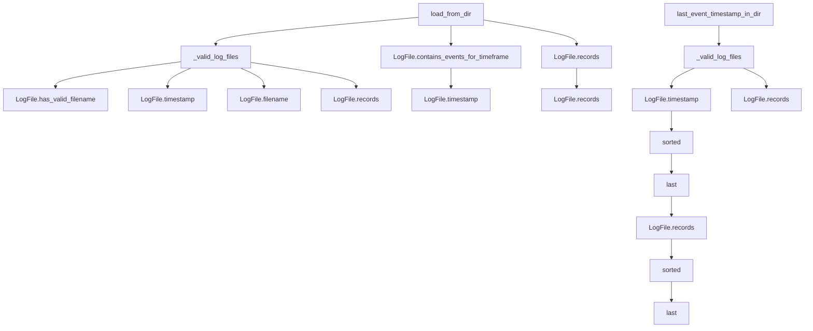

# `local_directory_record_source.py`

## `trailscraper.record_sources.local_directory_record_source.LocalDirectoryRecordSource` · *class*

## Summary:
A record source that loads CloudTrail log records from a local directory structure.

## Description:
The LocalDirectoryRecordSource class provides an interface for loading CloudTrail log records from a local directory containing gzipped JSON files. It enables processing of CloudTrail data by scanning a directory tree, identifying valid log files, and retrieving records within specified timeframes. This abstraction allows for easy integration of local CloudTrail data into processing pipelines without requiring network connectivity or cloud service access.

The class is designed to work with the standard CloudTrail log file naming convention and provides methods for loading records within date ranges and determining the latest event timestamp in the directory.

## State:
- `_log_dir` (str): The absolute or relative path to the root directory containing CloudTrail log files. Must be a valid directory path. This is the sole constructor parameter and is required.

## Lifecycle:
- Creation: Instantiate with a valid directory path via `LocalDirectoryRecordSource(log_dir)`
- Usage: Call `load_from_dir()` to retrieve records within a date range, or `last_event_timestamp_in_dir()` to find the latest event time
- Destruction: No explicit cleanup required; relies on Python's garbage collection

## Method Map:


## Raises:
- `TypeError`: Raised by `__init__` if `log_dir` is not a string
- `FileNotFoundError`: Raised by `os.walk()` if `log_dir` does not exist
- `PermissionError`: Raised by `os.walk()` if the process lacks permission to access `log_dir`
- `IndexError`: Raised by `LogFile.timestamp()` if a filename doesn't contain enough underscore-separated components
- `ValueError`: Raised by `LogFile.timestamp()` if the timestamp substring cannot be parsed into valid integers or represents an invalid date/time

## Example:
```python
from datetime import datetime
from trailscraper.record_sources.local_directory_record_source import LocalDirectoryRecordSource

# Create a record source for a directory containing CloudTrail logs
record_source = LocalDirectoryRecordSource("/path/to/cloudtrail/logs")

# Load records for a specific time range
start_date = datetime(2023, 1, 1, 0, 0, 0)
end_date = datetime(2023, 1, 1, 23, 59, 59)
records = record_source.load_from_dir(start_date, end_date)

# Find the latest event timestamp in the directory
latest_timestamp = record_source.last_event_timestamp_in_dir()
```

### `trailscraper.record_sources.local_directory_record_source.LocalDirectoryRecordSource.__init__` · *method*

## Summary:
Initializes a LocalDirectoryRecordSource with a specified log directory path.

## Description:
This method sets up the local directory record source by storing the provided log directory path as an internal attribute. It serves as the constructor for the LocalDirectoryRecordSource class, establishing the foundational configuration needed to access CloudTrail log files from a local filesystem directory.

## Args:
    log_dir (str): The absolute or relative path to the directory containing CloudTrail log files.

## Returns:
    None: This method does not return any value.

## Raises:
    None: This method does not explicitly raise any exceptions.

## State Changes:
    Attributes READ: None
    Attributes WRITTEN: self._log_dir

## Constraints:
    Preconditions: The log_dir argument must be a valid string representing a directory path.
    Postconditions: The instance will have its _log_dir attribute set to the provided log_dir value.

## Side Effects:
    None: This method performs no I/O operations or external service calls.

### `trailscraper.record_sources.local_directory_record_source.LocalDirectoryRecordSource._valid_log_files` · *method*

## Summary:
Returns an iterator of valid CloudTrail log files from the configured directory, filtering out files with invalid filenames and logging warnings for invalid entries.

## Description:
This method walks through the configured log directory and processes all files to identify valid CloudTrail log files. It uses functional programming constructs via toolz to chain operations: walking the directory tree, extracting file paths, creating LogFile objects, and filtering valid files. Invalid filenames trigger warning messages but don't halt execution. The method is designed as a separate utility to encapsulate the complex file processing pipeline.

## Args:
    None

## Returns:
    Iterator[LogFile]: An iterator of LogFile objects representing valid CloudTrail log files found in the directory.

## Raises:
    None explicitly raised

## State Changes:
    Attributes READ: self._log_dir
    Attributes WRITTEN: None

## Constraints:
    Preconditions: The instance must have a valid _log_dir attribute set to a directory path.
    Postconditions: The returned iterator contains only LogFile objects with valid filenames according to LogFile.has_valid_filename().

## Side Effects:
    I/O: Reads directory structure using os.walk().
    External service calls: None
    Mutations to objects outside self: Writes warning messages to the logging system for invalid filenames.

### `trailscraper.record_sources.local_directory_record_source.LocalDirectoryRecordSource.load_from_dir` · *method*

## Summary:
Loads and filters CloudTrail log records from a directory based on a specified date range.

## Description:
This method retrieves all valid CloudTrail log files from the configured directory, filters them based on whether they contain events within the specified date range (with a one-hour grace period at the end), and aggregates the records from matching files. It serves as the primary interface for fetching historical CloudTrail data for analysis or processing within a defined temporal scope.

## Args:
    from_date (datetime): The start of the date range to filter log events.
    to_date (datetime): The end of the date range to filter log events.

## Returns:
    list[dict]: A list of CloudTrail event records that occurred within the specified date range. Each record is represented as a dictionary containing the event data.

## Raises:
    None explicitly raised by this method. Exceptions from underlying operations (e.g., file I/O errors in `logfile.records()`) are propagated upward.

## State Changes:
    Attributes READ: 
        - self._log_dir: Used to traverse the directory tree in `_valid_log_files()`
    Attributes WRITTEN: None

## Constraints:
    Preconditions:
        - The directory specified in `self._log_dir` must be accessible and contain valid CloudTrail log files.
        - `from_date` must be earlier than or equal to `to_date`.
    Postconditions:
        - Returns a list of records that are guaranteed to fall within the inclusive date range [from_date, to_date + 1 hour].

## Side Effects:
    - Performs file system I/O operations to enumerate and read log files in the directory.
    - May emit warning messages to the logging system for log files with invalid filenames.

### `trailscraper.record_sources.local_directory_record_source.LocalDirectoryRecordSource.last_event_timestamp_in_dir` · *method*

## Summary:
Retrieves the latest event timestamp from the most recent valid CloudTrail log file in the directory.

## Description:
This method identifies the most recent valid CloudTrail log file in the directory managed by this record source, extracts all CloudTrail records from that file, and returns the timestamp of the most recent event among those records. It uses a functional pipeline approach with toolz combinators to process the data sequentially.

The method is designed to be called during the record scraping process to determine the latest timestamp that has been processed, enabling incremental scraping of new events.

## Args:
    None

## Returns:
    datetime.datetime: The UTC timestamp of the most recent CloudTrail event in the latest valid log file.

## Raises:
    AttributeError: If the most recent file does not have a valid event_time attribute.
    IndexError: If there are no valid log files in the directory or no records in the most recent file.

## State Changes:
    Attributes READ: None
    Attributes WRITTEN: None

## Constraints:
    Preconditions:
        - The LocalDirectoryRecordSource instance must have been initialized with a valid directory path
        - The directory must contain at least one valid CloudTrail log file
        - The most recent valid log file must contain at least one CloudTrail record
        
    Postconditions:
        - Returns a timezone-aware datetime object in UTC
        - The returned timestamp represents the latest event time in the most recent valid log file

## Side Effects:
    - Reads from the filesystem to access CloudTrail log files
    - Decompresses and parses gzipped JSON log files
    - May perform multiple file I/O operations during processing

