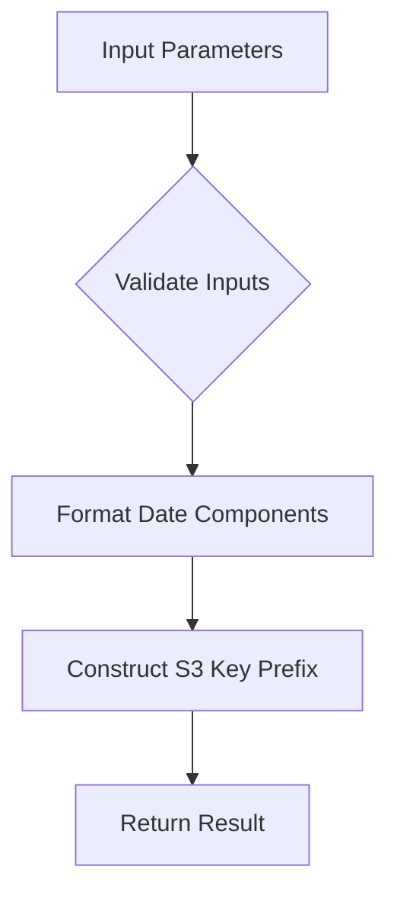
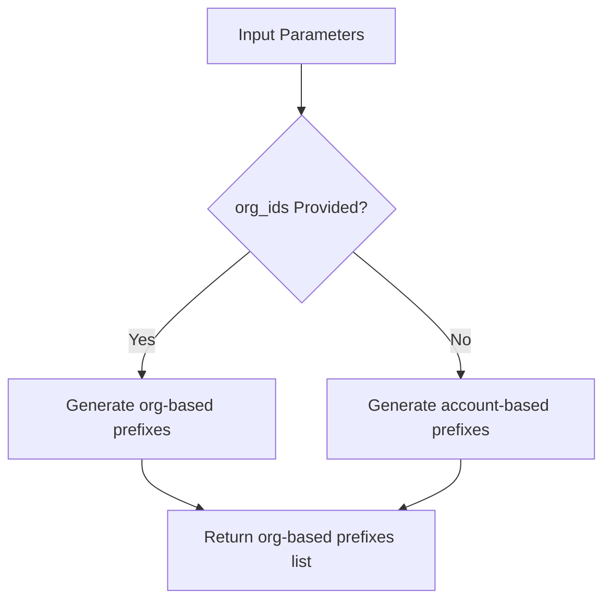
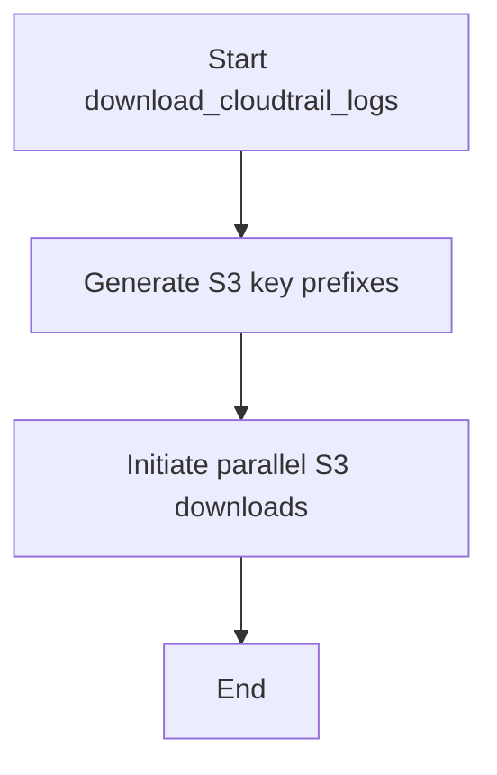

# `s3_download.py`

## `trailscraper.s3_download._s3_key_prefix` · *function*

## Summary:
Generates an S3 object key prefix for CloudTrail log files based on account, region, and date information.

## Description:
This function constructs the standardized S3 key prefix used to locate CloudTrail log files in AWS S3 buckets. It follows AWS CloudTrail's standard directory structure where logs are organized by account ID, region, and date. The function is designed to be reusable across different parts of the trailscraper system that need to generate S3 paths for CloudTrail data retrieval.

## Args:
    prefix (str): The base prefix to prepend to the S3 key path
    date (datetime.date): The date for which to generate the key prefix
    account_id (str): The AWS account ID associated with the logs
    region (str): The AWS region where the logs were generated

## Returns:
    str: A formatted S3 key prefix following the pattern: {prefix}AWSLogs/{account_id}/CloudTrail/{region}/{year}/{month:02d}/{day:02d}/

## Raises:
    None explicitly raised

## Constraints:
    Preconditions:
        - The date parameter must be a valid datetime.date object
        - The account_id must be a non-empty string
        - The region must be a non-empty string
        - The prefix must be a string (though empty string is acceptable)

    Postconditions:
        - The returned string will always follow the exact format specified
        - All date components will be zero-padded appropriately

## Side Effects:
    None

## Control Flow:


## Examples:
    >>> _s3_key_prefix("logs/", datetime.date(2023, 12, 25), "123456789012", "us-east-1")
    "logs/AWSLogs/123456789012/CloudTrail/us-east-1/2023/12/25/"
    
    >>> _s3_key_prefix("", datetime.date(2023, 1, 1), "999999999999", "eu-west-1")
    "AWSLogs/999999999999/CloudTrail/eu-west-1/2023/01/01/"

## `trailscraper.s3_download._s3_key_prefix_for_org_trails` · *function*

## Summary:
Generates an S3 object key prefix for CloudTrail logs within an organization structure.

## Description:
Constructs a standardized S3 key prefix path for AWS CloudTrail logs stored in an organization's S3 bucket. This function is used to determine the correct location where trail logs are stored based on organizational hierarchy and timestamp.

The function extracts the year, month, and day from the provided date object and formats them into a zero-padded string representation for proper S3 path construction. It is designed to work with AWS Organizations and multi-account environments where logs are organized hierarchically.

This logic is extracted into its own function to ensure consistent path construction across different parts of the application and to encapsulate the specific formatting requirements for S3 keys used by AWS CloudTrail.

## Args:
    prefix (str): The base prefix for the S3 key path
    date (datetime.date): The date for which to construct the path
    org_id (str): The AWS Organization ID
    account_id (str): The AWS Account ID
    region (str): The AWS region where the trail was created

## Returns:
    str: A formatted S3 key prefix path following the pattern: {prefix}AWSLogs/{org_id}/{account_id}/CloudTrail/{region}/{year}/{month:02d}/{day:02d}/

## Raises:
    None

## Constraints:
    - Preconditions: All arguments must be provided and valid
    - Postconditions: The returned string will always follow the specified S3 path format

## Side Effects:
    None

## Control Flow:
```mermaid
flowchart TD
    A[Start] --> B[Format prefix with AWSLogs/{org_id}/{account_id}/CloudTrail/{region}]
    B --> C[Append year/{month:02d}/{day:02d}/]
    C --> D[Return formatted string]
```

## Examples:
    >>> _s3_key_prefix_for_org_trails("logs/", datetime.date(2023, 12, 25), "o-1234567890", "123456789012", "us-east-1")
    'logs/AWSLogs/o-1234567890/123456789012/CloudTrail/us-east-1/2023/12/25/'
```

## `trailscraper.s3_download._s3_key_prefixes` · *function*

## Summary:
Generates a list of S3 object key prefixes for CloudTrail log files over a date range, supporting both organization and account-based trail structures.

## Description:
This function creates a comprehensive list of S3 key prefixes needed to retrieve CloudTrail logs for a specified date range. It handles two distinct AWS CloudTrail storage patterns: organization-based trails and standard account-based trails. The function calculates all dates between the provided from_date and to_date (inclusive) and generates appropriate S3 key prefixes for each combination of date, account, and region.

The function is designed to be called by higher-level functions in the trailscraper system that need to enumerate all potential S3 locations where CloudTrail logs might be stored for processing.

## Args:
    prefix (str): Base prefix to prepend to all generated S3 key paths
    org_ids (list[str] | None): List of AWS Organization IDs, or None for account-based trails
    account_ids (list[str]): List of AWS Account IDs to include in the generated prefixes
    regions (list[str]): List of AWS regions to include in the generated prefixes
    from_date (datetime.datetime): Start date (inclusive) for the date range
    to_date (datetime.datetime): End date (inclusive) for the date range

## Returns:
    list[str]: A list of S3 key prefixes representing all combinations of dates, accounts, regions, and optionally organizations for CloudTrail log retrieval

## Raises:
    None explicitly raised

## Constraints:
    Preconditions:
        - from_date and to_date must be datetime.datetime objects
        - from_date must be less than or equal to to_date
        - account_ids must be a non-empty list
        - regions must be a non-empty list
        - prefix must be a string

    Postconditions:
        - The returned list will contain exactly (len(org_ids) * len(account_ids) * len(regions) * number_of_days) entries when org_ids is provided
        - The returned list will contain exactly (len(account_ids) * len(regions) * number_of_days) entries when org_ids is None
        - All returned strings will follow the S3 key prefix format defined by the underlying helper functions

## Side Effects:
    None

## Control Flow:


## Examples:
    >>> from datetime import datetime
    >>> _s3_key_prefixes(
    ...     prefix="logs/",
    ...     org_ids=["o-1234567890"],
    ...     account_ids=["123456789012"],
    ...     regions=["us-east-1"],
    ...     from_date=datetime(2023, 12, 25),
    ...     to_date=datetime(2023, 12, 26)
    ... )
    ['logs/AWSLogs/o-1234567890/123456789012/CloudTrail/us-east-1/2023/12/25/',
     'logs/AWSLogs/o-1234567890/123456789012/CloudTrail/us-east-1/2023/12/26/']

    >>> _s3_key_prefixes(
    ...     prefix="",
    ...     org_ids=None,
    ...     account_ids=["123456789012", "999999999999"],
    ...     regions=["us-east-1", "us-west-2"],
    ...     from_date=datetime(2023, 12, 25),
    ...     to_date=datetime(2023, 12, 25)
    ... )
    ['AWSLogs/123456789012/CloudTrail/us-east-1/2023/12/25/',
     'AWSLogs/123456789012/CloudTrail/us-west-2/2023/12/25/',
     'AWSLogs/999999999999/CloudTrail/us-east-1/2023/12/25/',
     'AWSLogs/999999999999/CloudTrail/us-west-2/2023/12/25/']

## `trailscraper.s3_download._s3_download_recursive` · *function*

## Summary:
Downloads files from an S3 bucket recursively based on specified prefixes, using parallel threads for efficient transfer.

## Description:
This function downloads files from an AWS S3 bucket that match specified prefixes, traversing directory structures recursively. It uses a thread pool to download files in parallel, improving performance when dealing with large numbers of files. The function handles directory creation automatically and skips files that already exist locally.

The function is designed to be called internally by the S3 download module and is not intended for direct public use. It implements a recursive listing strategy to discover all matching files under the specified prefixes, then downloads them concurrently using a thread pool.

## Args:
    bucket (str): The name of the S3 bucket to download from
    prefixes (list[str]): List of prefixes to filter files by - only files starting with these prefixes will be downloaded
    target_dir (str): Local directory path where downloaded files will be stored
    parallelism (int): Maximum number of concurrent download threads to use

## Returns:
    None: This function does not return any meaningful value

## Raises:
    None explicitly raised - though underlying S3 operations may raise boto3 exceptions like ClientError

## Constraints:
    Preconditions:
        - The bucket must be accessible with configured AWS credentials
        - The target_dir must be writable
        - The prefixes list must contain valid string prefixes
        - Parallelism must be a positive integer
    Postconditions:
        - All matching files from the S3 bucket will be downloaded to the target directory
        - Directory structure will be preserved in the local filesystem
        - Files that already exist locally will be skipped

## Side Effects:
    - Creates directories in the target filesystem as needed
    - Downloads files from S3 to the local filesystem
    - Makes HTTP requests to AWS S3 service
    - Writes log messages to the application logger
    - Uses thread-local storage for S3 client instances

## Control Flow:
```mermaid
flowchart TD
    A[Start _s3_download_recursive] --> B[Initialize thread-local S3 client]
    B --> C[Call _list_files_to_download("")]
    C --> D{Files found?}
    D -- Yes --> E[Create ThreadPoolExecutor with parallelism workers]
    E --> F[Map _download_file to all files]
    F --> G[Consume results to trigger downloads]
    G --> H[End]
    D -- No --> H
```

## Examples:
```python
# Download all files from bucket 'my-bucket' under prefixes 'logs/' and 'data/'
_s3_download_recursive(
    bucket="my-bucket",
    prefixes=["logs/", "data/"],
    target_dir="/local/downloads",
    parallelism=10
)

# Download all files from bucket 'backup-bucket' with prefix 'backups/2023/'
_s3_download_recursive(
    bucket="backup-bucket",
    prefixes=["backups/2023/"],
    target_dir="./backups",
    parallelism=5
)
```

## `trailscraper.s3_download.download_cloudtrail_logs` · *function*

## Summary:
Downloads CloudTrail log files from S3 by generating S3 key prefixes for a date range and initiating parallel downloads.

## Description:
This function serves as the main entry point for downloading CloudTrail logs from an S3 bucket. It orchestrates the process by first generating the appropriate S3 key prefixes based on the specified date range, organization IDs, account IDs, and regions, then initiates a parallel download operation for all matching files.

The function is designed to handle both organization-based and account-based CloudTrail trail structures, making it flexible for various AWS environments. It leverages the `_s3_key_prefixes` helper to enumerate all required S3 paths and `_s3_download_recursive` to perform the actual downloading with configurable parallelism.

## Args:
    target_dir (str): Local directory path where downloaded CloudTrail log files will be stored
    bucket (str): Name of the S3 bucket containing the CloudTrail logs
    cloudtrail_prefix (str): Base prefix to prepend to all generated S3 key paths for filtering
    org_ids (list[str] | None): List of AWS Organization IDs, or None for account-based trails
    account_ids (list[str]): List of AWS Account IDs to include in the generated prefixes
    regions (list[str]): List of AWS regions to include in the generated prefixes
    from_date (datetime.datetime): Start date (inclusive) for the date range of logs to download
    to_date (datetime.datetime): End date (inclusive) for the date range of logs to download
    parallelism (int): Maximum number of concurrent download threads to use for transferring files

## Returns:
    None: This function does not return any meaningful value

## Raises:
    None explicitly raised - though underlying S3 operations may raise boto3 exceptions like ClientError

## Constraints:
    Preconditions:
        - from_date and to_date must be datetime.datetime objects
        - from_date must be less than or equal to to_date
        - account_ids must be a non-empty list
        - regions must be a non-empty list
        - parallelism must be a positive integer
        - The bucket must be accessible with configured AWS credentials
        - The target_dir must be writable

    Postconditions:
        - All matching CloudTrail log files from the S3 bucket will be downloaded to the target directory
        - Directory structure will be preserved in the local filesystem
        - Files that already exist locally will be skipped

## Side Effects:
    - Creates directories in the target filesystem as needed
    - Downloads files from S3 to the local filesystem
    - Makes HTTP requests to AWS S3 service
    - Writes log messages to the application logger
    - Uses thread-local storage for S3 client instances

## Control Flow:


## Examples:
```python
# Download CloudTrail logs for a specific date range across multiple accounts and regions
download_cloudtrail_logs(
    target_dir="/tmp/cloudtrail_logs",
    bucket="my-cloudtrail-bucket",
    cloudtrail_prefix="AWSLogs/",
    org_ids=None,
    account_ids=["123456789012", "999999999999"],
    regions=["us-east-1", "us-west-2"],
    from_date=datetime.datetime(2023, 12, 25),
    to_date=datetime.datetime(2023, 12, 26),
    parallelism=10
)

# Download organization-based CloudTrail logs for a single account and region
download_cloudtrail_logs(
    target_dir="./org_logs",
    bucket="org-cloudtrail-bucket",
    cloudtrail_prefix="logs/",
    org_ids=["o-1234567890"],
    account_ids=["123456789012"],
    regions=["us-east-1"],
    from_date=datetime.datetime(2023, 12, 25),
    to_date=datetime.datetime(2023, 12, 25),
    parallelism=5
)
```

