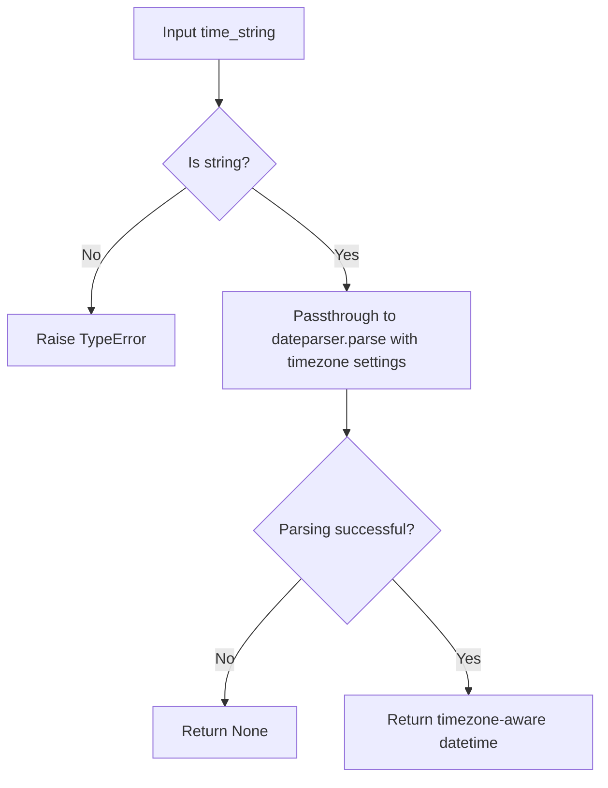

# `time_utils.py`

## `trailscraper.time_utils.parse_human_readable_time` · *function*

## Summary:
Converts human-readable time strings into timezone-aware datetime objects.

## Description:
Parses natural language time expressions (like "2 days ago" or "next Monday") into Python datetime objects with timezone information. This function serves as a centralized utility for time parsing throughout the application, ensuring consistent handling of temporal data regardless of input format.

## Args:
    time_string (str): A human-readable time expression such as "yesterday", "in 3 hours", or "2023-12-25".

## Returns:
    datetime.datetime: A timezone-aware datetime object representing the parsed time. When parsing fails, dateparser.parse returns None.

## Raises:
    TypeError: If time_string is not a string type (this depends on dateparser implementation).

## Constraints:
    Preconditions:
        - Input must be a string
        - String should represent a valid time expression recognizable by dateparser
    Postconditions:
        - Returned datetime object is timezone-aware due to the settings parameter
        - Function handles various time formats including relative expressions and absolute dates

## Side Effects:
    None

## Control Flow:

## Examples:
    >>> parse_human_readable_time("2 days ago")
    datetime.datetime(2023, 10, 15, 14, 30, 0, tzinfo=datetime.timezone.utc)
    
    >>> parse_human_readable_time("next Monday")
    datetime.datetime(2023, 10, 23, 0, 0, 0, tzinfo=datetime.timezone.utc)
    
    >>> parse_human_readable_time("invalid date")
    None

