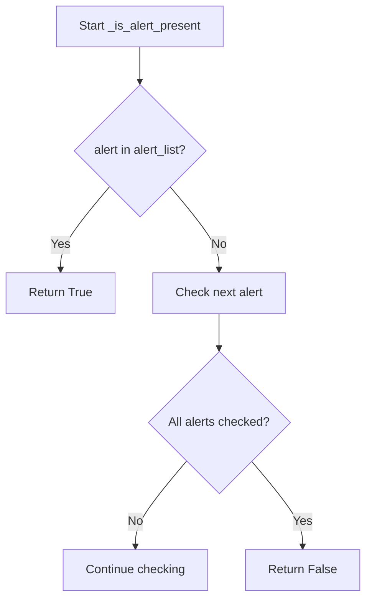
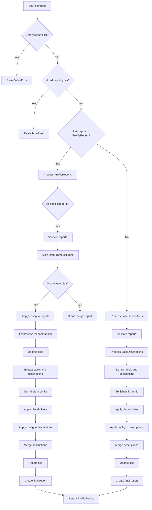

# `compare_reports.py`

## `src.ydata_profiling.compare_reports._should_wrap` · *function*

## Summary:
Determines whether two values should be considered equal for comparison purposes, with special handling for pandas objects.

## Description:
This function evaluates whether two values should be considered equal for comparison operations. It handles special cases for pandas DataFrame and Series objects using their native equality methods, while avoiding wrapping of complex data structures like lists and dictionaries. The function is used internally to determine appropriate comparison behavior between profile report elements.

## Args:
    v1 (Any): First value to compare
    v2 (Any): Second value to compare

## Returns:
    bool: True if the values are equal (and should be wrapped), False otherwise

## Raises:
    None explicitly raised

## Constraints:
    Preconditions:
        - Both arguments must be valid Python objects
        - v1 and v2 can be of any type
    
    Postconditions:
        - Always returns a boolean value
        - For pandas DataFrame objects, uses DataFrame.equals() method
        - For pandas Series objects, uses Series.equals() method
        - For other objects, uses standard equality operator (==)
        - Lists and dictionaries are never considered equal by this function

## Side Effects:
    None

## Control Flow:
```mermaid
flowchart TD
    A[Start _should_wrap] --> B{v1 is list or dict?}
    B -- Yes --> C[Return False]
    B -- No --> D{v1 is DataFrame AND v2 is DataFrame?}
    D -- Yes --> E[v1.equals(v2)]
    D -- No --> F{v1 is Series AND v2 is Series?}
    F -- Yes --> G[v1.equals(v2)]
    F -- No --> H[Try v1 == v2]
    H --> I{ValueError raised?}
    I -- Yes --> J[Return False]
    I -- No --> K[Return v1 == v2]
```

## Examples:
    # Comparing identical DataFrames
    # df1 = pd.DataFrame({'A': [1, 2], 'B': [3, 4]})
    # df2 = pd.DataFrame({'A': [1, 2], 'B': [3, 4]})
    # result = _should_wrap(df1, df2)  # Returns True
    
    # Comparing different DataFrames
    # df1 = pd.DataFrame({'A': [1, 2], 'B': [3, 4]})
    # df2 = pd.DataFrame({'A': [1, 2], 'B': [3, 5]})
    # result = _should_wrap(df1, df2)  # Returns False
    
    # Comparing lists (will not be wrapped)
    result = _should_wrap([1, 2, 3], [1, 2, 3])  # Returns False
    
    # Comparing primitive values
    result = _should_wrap(5, 5)  # Returns True
```

## `src.ydata_profiling.compare_reports._update_merge_dict` · *function*

## Summary:
Merges two dictionaries by combining their keys and values, with special handling for overlapping keys.

## Description:
This function merges two dictionaries by taking all keys from both dictionaries and combining values for overlapping keys. For keys that exist in both dictionaries, it applies special logic to determine whether to wrap the values in a list or merge them further based on their types and content. This function is part of the report comparison system and helps maintain consistent data structures when comparing profile reports.

## Args:
    d1 (Any): First dictionary to merge
    d2 (Any): Second dictionary to merge

## Returns:
    dict: A new dictionary containing all keys from both input dictionaries, with overlapping keys handled according to the merge logic:
        - Non-overlapping keys are simply added to the result
        - Overlapping keys are processed by checking if values should be wrapped in a list or merged further using `_update_merge_mixed`

## Raises:
    None explicitly raised

## Constraints:
    Preconditions:
        - Both arguments must be dictionaries or dictionary-like objects
        - Keys in both dictionaries should be hashable
    
    Postconditions:
        - Returns a new dictionary object (no mutation of inputs)
        - All keys from both dictionaries are preserved in the result
        - Overlapping keys are processed according to the merge strategy:
          * If `_should_wrap()` returns True, values are wrapped in a list
          * Otherwise, values are merged using `_update_merge_mixed()`

## Side Effects:
    None

## Control Flow:
```mermaid
flowchart TD
    A[Start _update_merge_dict(d1, d2)] --> B{Keys in d1 and d2?}
    B -- Yes --> C[Process overlapping keys]
    B -- No --> D[No overlap, merge all keys]
    C --> E{Should wrap values?}
    E -- Yes --> F[Wrap in list: [d1[k], d2[k]]]
    E -- No --> G[Merge using _update_merge_mixed]
    F --> H[Combine all key-value pairs]
    G --> H
    D --> H
    H --> I[Return merged dictionary]
```

## Examples:
    # Basic merge with no overlapping keys
    result = _update_merge_dict({"a": 1}, {"b": 2})
    # Returns: {"a": 1, "b": 2}
    
    # Merge with overlapping keys that should be wrapped
    result = _update_merge_dict({"a": 1}, {"a": 2})
    # Returns: {"a": [1, 2]}
    
    # Merge with overlapping keys that should be merged further
    result = _update_merge_dict({"a": {"x": 1}}, {"a": {"y": 2}})
    # Returns: {"a": [{"x": 1}, {"y": 2}]}

## `src.ydata_profiling.compare_reports._update_merge_seq` · *function*

## Summary:
Updates and merges two sequences by handling different combinations of list and tuple inputs according to specific rules.

## Description:
This utility function processes two input sequences (lists or tuples) and applies different merging strategies based on their types. It is designed to handle various combinations of list and tuple inputs while maintaining type consistency and proper sequence merging behavior. The function is primarily used internally within the compare_reports module to manage sequence data during report comparison operations.

## Args:
    d1 (Any): First sequence or item to process. Can be a list, tuple, or any other type.
    d2 (Any): Second sequence or item to process. Can be a list, tuple, or any other type.

## Returns:
    Union[list, tuple]: The result depends on input types:
        - If both d1 and d2 are lists: returns a tuple containing (d1, d2)
        - If d1 is a tuple and d2 is a list: returns a tuple with d1 elements plus d2 as the last element
        - Otherwise: returns a list containing both d1 and d2 as elements (converted to lists if needed)

## Raises:
    None explicitly raised.

## Constraints:
    Preconditions:
        - Both arguments can be of any type (though behavior varies based on type)
        - Function handles all combinations of list/tuple/other types gracefully
    
    Postconditions:
        - Return value is either a list or tuple as specified by the logic
        - Input arguments remain unchanged (no mutation)

## Side Effects:
    None.

## Control Flow:
```mermaid
flowchart TD
    A[Start _update_merge_seq(d1, d2)] --> B{isinstance(d1, list) AND isinstance(d2, list)?}
    B -- Yes --> C[Return (d1, d2)]
    B -- No --> D{isinstance(d1, tuple) AND isinstance(d2, list)?}
    D -- Yes --> E[Return (*d1, d2)]
    D -- No --> F[Return [*(d1 if isinstance(d1, list) else [d1]), *(d2 if isinstance(d2, list) else [d2])]]
```

## Examples:
    # Example 1: Both inputs are lists
    result = _update_merge_seq([1, 2], [3, 4])
    # Returns: ([1, 2], [3, 4])

    # Example 2: First input is tuple, second is list  
    result = _update_merge_seq((1, 2), [3, 4])
    # Returns: ((1, 2), [3, 4])

    # Example 3: Both inputs are non-list/tuple types
    result = _update_merge_seq("hello", "world")
    # Returns: ['hello', 'world']

    # Example 4: First input is list, second is non-list/tuple
    result = _update_merge_seq([1, 2], "hello")
    # Returns: [[1, 2], 'hello']

    # Example 5: First input is tuple, second is non-list/tuple
    result = _update_merge_seq((1, 2), "hello")
    # Returns: [(1, 2), 'hello']
```

## `src.ydata_profiling.compare_reports._update_merge_mixed` · *function*

## Summary:
Merges two data structures by dispatching to specialized merge functions based on the types of the inputs.

## Description:
This utility function serves as a dispatcher for merging two data structures. When both inputs are dictionaries, it delegates to `_update_merge_dict` for dictionary-specific merging logic. For all other cases, it delegates to `_update_merge_seq` which handles merging for non-dictionary inputs. This function is part of the report comparison system and ensures appropriate merging behavior based on data structure types.

## Args:
    d1 (Any): First data structure to merge. Can be of any type.
    d2 (Any): Second data structure to merge. Can be of any type.

## Returns:
    Union[dict, list, tuple]: The merged result, which depends on the input types:
        - If both inputs are dictionaries: returns a merged dictionary from `_update_merge_dict`
        - Otherwise: returns a merged result from `_update_merge_seq` which handles various combinations of list, tuple, and other types according to specific rules

## Raises:
    None explicitly raised.

## Constraints:
    Preconditions:
        - Both arguments can be of any Python type
        - Function handles all combinations of data types gracefully
    
    Postconditions:
        - Return value is either a dict, list, or tuple as determined by the dispatch logic
        - Input arguments remain unchanged (no mutation)

## Side Effects:
    None.

## Control Flow:
```mermaid
flowchart TD
    A[Start _update_merge_mixed(d1, d2)] --> B{isinstance(d1, dict) AND isinstance(d2, dict)?}
    B -- Yes --> C[Return _update_merge_dict(d1, d2)]
    B -- No --> D[Return _update_merge_seq(d1, d2)]
```

## Examples:
    # Example 1: Both inputs are dictionaries
    result = _update_merge_mixed({"a": 1}, {"b": 2})
    # Returns: {'a': 1, 'b': 2, 'a': [1], 'b': [2]} (merged via _update_merge_dict)

    # Example 2: Inputs are lists
    result = _update_merge_mixed([1, 2], [3, 4])
    # Returns: ([1, 2], [3, 4]) (merged via _update_merge_seq)

    # Example 3: First input is dict, second is list
    result = _update_merge_mixed({"a": 1}, [2, 3])
    # Returns: ([{'a': 1}, [2, 3]]) (merged via _update_merge_seq)
```

## `src.ydata_profiling.compare_reports._update_merge` · *function*

## Summary:
Updates and merges two dictionary objects, handling cases where the first dictionary is None or when type validation fails.

## Description:
This function serves as a wrapper for merging two dictionaries, providing safety checks for None values and type validation. It delegates the actual merging logic to `_update_merge_dict`. The function is designed to handle the comparison of profile reports by ensuring proper dictionary merging while maintaining type consistency.

## Args:
    d1 (Optional[dict]): First dictionary to merge, can be None
    d2 (dict): Second dictionary to merge, must be a dictionary

## Returns:
    dict: The merged dictionary result from `_update_merge_dict`

## Raises:
    TypeError: When either argument is not of type dictionary

## Constraints:
    Preconditions:
        - d2 must be a dictionary
        - If d1 is provided, it must also be a dictionary
        
    Postconditions:
        - Returns a dictionary object
        - If d1 is None, returns d2 directly
        - If both are dictionaries, returns result of `_update_merge_dict`

## Side Effects:
    None

## Control Flow:
```mermaid
flowchart TD
    A[Start _update_merge(d1, d2)] --> B{d1 is None?}
    B -- Yes --> C[Return d2]
    B -- No --> D{Both args dict?}
    D -- No --> E[Raise TypeError]
    D -- Yes --> F[Call _update_merge_dict(d1, d2)]
    C --> G[Return]
    E --> G
    F --> G
```

## `src.ydata_profiling.compare_reports._placeholders` · *function*

## Summary:
Initializes placeholder values in scatter plot and type distribution data structures across multiple profile reports to ensure consistent data structure for comparison operations.

## Description:
This function ensures that all profile reports in a collection have consistent data structures for scatter plots and type distributions by populating missing keys with default placeholder values. It is designed to be called during report comparison operations where uniform data structures are required for meaningful analysis.

The function processes a list of BaseDescription objects and modifies them in-place to guarantee that:
1. All scatter plot entries have consistent key combinations
2. All type distribution entries have consistent type keys

This logic is extracted into its own function to enforce a clear separation between data structure normalization and comparison logic, making the code more modular and testable.

## Args:
    reports (List[BaseDescription]): A list of profile report description objects that need to have their data structures standardized

## Returns:
    None: This function modifies the input reports in-place and does not return any value

## Raises:
    None: This function does not explicitly raise any exceptions

## Constraints:
    Preconditions:
    - Input reports must be a list of BaseDescription objects
    - Each BaseDescription object must have a 'scatter' attribute that is a dictionary
    - Each BaseDescription object must have a 'table' attribute that contains a 'types' key mapping to a dictionary
    
    Postconditions:
    - All reports will have consistent scatter plot data structures
    - All reports will have consistent type distribution data structures
    - No new reports are added to the input list
    - Original reports are modified in-place

## Side Effects:
    None: This function does not perform any I/O operations or external state mutations

## Control Flow:
```mermaid
flowchart TD
    A[Start _placeholders] --> B[Collect all scatter keys from reports]
    B --> C[Collect all type keys from reports]
    C --> D[For each report in reports]
    D --> E[For each key pair (k1,k2) in scatter keys]
    E --> F{Does k1 exist in report.scatter?}
    F -- No --> G[Create report.scatter[k1] as empty dict]
    F -- Yes --> H[Continue]
    G --> I[Set report.scatter[k1][k2] = ""]
    H --> I
    I --> J[Continue with next k2]
    J --> K{All k2 processed?}
    K -- No --> L[Process next k2]
    K -- Yes --> M[Continue with next k1]
    M --> N{All k1 processed?}
    N -- No --> O[Process next k1]
    N -- Yes --> P[Process type keys]
    P --> Q[For each type_key in type keys]
    Q --> R{Does type_key exist in report.table["types"]?}
    R -- No --> S[Set report.table["types"][type_key] = 0]
    R -- Yes --> T[Continue]
    S --> U[Continue with next type_key]
    T --> U
    U --> V{All type_keys processed?}
    V -- No --> W[Process next type_key]
    V -- Yes --> X[End _placeholders]
```

## Examples:
```python
# Basic usage with two profile reports
from ydata_profiling.model import BaseDescription

# Create sample reports with inconsistent data structures
report1 = BaseDescription()
report1.scatter = {"A": {"B": "value1"}}
report1.table = {"types": {"int": 5}}

report2 = BaseDescription()
report2.scatter = {"A": {"C": "value2"}}  
report2.table = {"types": {"float": 3}}

reports = [report1, report2]
_placeholders(reports)

# After execution, both reports will have consistent structures:
# report1.scatter will contain {"A": {"B": "value1", "C": ""}, "B": {"A": "", "B": ""}}
# report2.scatter will contain {"A": {"B": "", "C": "value2"}, "B": {"A": "", "B": ""}}
# report1.table["types"] will contain {"int": 5, "float": 0}
# report2.table["types"] will contain {"int": 0, "float": 3}
```

## `src.ydata_profiling.compare_reports._update_titles` · *function*

## Summary:
Updates profile report titles to provide unique identifiers for dataset comparison.

## Description:
Modifies profile report titles in-place to replace the default "Pandas Profiling Report" with sequential alphabetic labels (Dataset A, Dataset B, etc.) when encountered. This enables clear visual distinction between multiple datasets in comparison views.

## Args:
    reports (List[ProfileReport]): A list of ProfileReport objects to update.

## Returns:
    None: Modifies report objects in-place.

## Raises:
    None explicitly raised.

## Constraints:
    Preconditions:
        - All items in the reports list must be ProfileReport instances
        - Each report's config attribute must be accessible and have a title attribute
    
    Postconditions:
        - Reports with default title "Pandas Profiling Report" will have their title replaced with a Dataset label
        - Reports with non-default titles remain unchanged

## Side Effects:
    None.

## Control Flow:
```mermaid
flowchart TD
    A[Start _update_titles] --> B{report.config.title == "Pandas Profiling Report"?}
    B -- Yes --> C[Set title to "Dataset " + chr(65 + idx)]
    B -- No --> D[Skip]
    C --> E[Continue to next report]
    D --> E
    E --> F{End of reports?}
    F -- No --> G[Process next report]
    F -- Yes --> H[End]
    G --> B
```

## Examples:
```python
# Basic usage
reports = [profile_report_1, profile_report_2]
_update_titles(reports)
# profile_report_1.title becomes "Dataset A"
# profile_report_2.title becomes "Dataset B"
```

## `src.ydata_profiling.compare_reports._compare_title` · *function*

## Summary:
Formats a comparison title for multiple report titles, returning either the common title or a descriptive comparison string.

## Description:
This utility function processes a list of title strings to create an appropriate display title for comparison operations. When all input titles are identical, it returns that single title. When titles differ, it constructs a formatted string indicating the comparison between multiple distinct titles.

## Args:
    titles (List[str]): A list of title strings to compare and format. Must contain at least one title string.

## Returns:
    str: A formatted title string. If all titles are identical, returns the common title. Otherwise, returns a formatted string like "<em>Comparing</em> title1, title2 <em>and</em> title3".

## Raises:
    None explicitly raised.

## Constraints:
    Preconditions:
        - The input list must contain at least one title string
        - All elements in the list must be strings
    
    Postconditions:
        - Always returns a string
        - Returns either the single common title or a formatted comparison string

## Side Effects:
    None.

## Control Flow:
```mermaid
flowchart TD
    A[Input titles list] --> B{All titles equal?}
    B -->|Yes| C[Return first title]
    B -->|No| D[Join all but last title with commas]
    D --> E[Format final string with "Comparing" and "and"]
    E --> F[Return formatted string]
```

## Examples:
    >>> _compare_title(["Report A", "Report A", "Report A"])
    'Report A'
    
    >>> _compare_title(["Report A", "Report B", "Report C"])
    '<em>Comparing</em> Report A, Report B <em>and</em> Report C'

## `src.ydata_profiling.compare_reports._compare_profile_report_preprocess` · *function*

## Summary:
Normalizes primary color configurations and synchronizes type sets across multiple profile reports for consistent comparison.

## Description:
This function prepares multiple ProfileReport objects for comparison by standardizing their HTML styling configurations and synchronizing their type set information. It ensures that all reports have consistent primary color settings and that subsequent processing operates on unified type information. This function is an internal utility used by the report comparison system to prepare reports before analysis.

## Args:
    reports (List[ProfileReport]): A list of ProfileReport objects to preprocess for comparison.
    config (Optional[Settings], optional): An optional global configuration to apply to all reports. If None, uses the first report's configuration. Defaults to None.

## Returns:
    Tuple[List[str], List[BaseDescription]]: A tuple containing:
        - labels: A list of report titles extracted from each report's configuration
        - descriptions: A list of BaseDescription objects representing the processed report metadata

## Raises:
    None explicitly raised

## Constraints:
    - Preconditions: The reports list must contain at least one ProfileReport object
    - Postconditions: All reports in the list will have their primary_colors configuration normalized and their _typeset attribute synchronized from the first report

## Side Effects:
    - Modifies the primary_colors configuration of each report in-place
    - Modifies the _typeset attribute of each report in-place (starting from the second report)
    - Mutates the input ProfileReport objects directly

## Control Flow:
```mermaid
flowchart TD
    A[Start _compare_profile_report_preprocess] --> B{config is None?}
    B -- Yes --> C{len(reports[0].config.html.style.primary_colors) > 1?}
    C -- Yes --> D[Set each report's primary_colors to single color from index]
    C -- No --> E[Skip primary_colors modification]
    B -- No --> F{len(config.html.style.primary_colors) > 1?}
    F -- Yes --> G[Set each report's primary_colors to config's colors]
    F -- No --> H[Skip primary_colors modification]
    D --> I[Sync _typeset from first report to others]
    E --> I
    G --> I
    H --> I
    I --> J[Extract descriptions from reports]
    J --> K[Update description titles]
    K --> L[Return labels and descriptions]
```

## Examples:
```python
# Basic usage with multiple reports
from ydata_profiling import ProfileReport
reports = [ProfileReport(df1), ProfileReport(df2)]
labels, descriptions = _compare_profile_report_preprocess(reports)

# Usage with custom config
custom_config = Settings(title="Custom Report")
labels, descriptions = _compare_profile_report_preprocess(reports, custom_config)
```

## `src.ydata_profiling.compare_reports._compare_dataset_description_preprocess` · *function*

## Summary:
Extracts dataset labels from profile report descriptions while preserving the original report objects for comparison operations.

## Description:
This function serves as a preprocessing utility for comparing multiple dataset profiles by extracting human-readable labels from each report's analysis title while maintaining the original report objects unchanged. It is designed to be called during the comparison workflow where multiple profile reports need to be analyzed side-by-side.

The function isolates the label extraction logic to enable clean separation between data preparation and comparison operations, making the comparison process more modular and testable.

## Args:
    reports (List[BaseDescription]): A list of profile report descriptions containing analysis metadata including titles

## Returns:
    Tuple[List[str], List[BaseDescription]]: A tuple containing two elements:
        1. labels (List[str]): A list of string labels extracted from each report's analysis.title field
        2. reports (List[BaseDescription]): The original list of report objects (unchanged)

## Raises:
    AttributeError: Raised if any report in the input list does not have an 'analysis' attribute or if the 'analysis' attribute does not have a 'title' field

## Constraints:
    Preconditions:
        - Input 'reports' should be a list (can be empty)
        - Each item in 'reports' should have an 'analysis' attribute with a 'title' field
    Postconditions:
        - The returned labels list will have the same length as the input reports list
        - The original reports list remains unmodified (same object references)

## Side Effects:
    None

## Control Flow:
```mermaid
flowchart TD
    A[Start _compare_dataset_description_preprocess] --> B{Input validation}
    B --> C[Extract labels from report.analysis.title]
    C --> D[Return (labels, reports)]
```

## Examples:
```python
# Basic usage with two profile reports
from ydata_profiling.model import BaseDescription

# Assuming we have two BaseDescription objects with analysis titles
labels, reports = _compare_dataset_description_preprocess([report1, report2])
# labels would contain ['Dataset 1', 'Dataset 2']
# reports would be the original report objects unchanged

# Empty list case
empty_labels, empty_reports = _compare_dataset_description_preprocess([])
# Returns ([], [])
```

## `src.ydata_profiling.compare_reports.validate_reports` · *function*

## Summary:
Validates compatibility of profile reports for comparison operations by checking count, type consistency, and feature alignment.

## Description:
This function performs essential validation checks before comparing profile reports to ensure the comparison will be meaningful and avoid runtime errors. It verifies that the reports meet basic requirements for comparison, such as having the right number of reports, consistent report types, and compatible data structures. This validation prevents invalid comparisons that could produce unexpected results.

## Args:
    reports (Union[List[ProfileReport], List[BaseDescription]]): A list containing at least two profile reports to validate, either ProfileReport objects or BaseDescription objects
    configs (List[dict]): A list of configuration dictionaries, one for each report, used to determine report types

## Returns:
    None: This function does not return any value but raises exceptions when validation fails

## Raises:
    ValueError: Raised when fewer than two reports are provided, when trying to compare timeseries and tabular reports simultaneously, or when ProfileReport objects aren't initialized with DataFrames
    Warning: Issued when comparing more than two reports (unsupported but still processed) or when datasets have different column sets

## Constraints:
    Preconditions:
    - At least two reports must be provided for comparison
    - Reports must be either all ProfileReport or all BaseDescription instances
    - Configurations must correspond to each report in order
    - When reports are ProfileReport instances, they must have been initialized with DataFrames
    
    Postconditions:
    - All validation checks pass successfully
    - Reports are compatible for comparison operations

## Side Effects:
    - Issues warnings via Python's warnings module for unsupported scenarios
    - Raises ValueError exceptions which terminate execution if validation fails

## Control Flow:
```mermaid
flowchart TD
    A[Start validate_reports] --> B{len(reports) < 2?}
    B -- Yes --> C[Raise ValueError: "At least two reports required"]
    B -- No --> D{len(reports) > 2?}
    D -- Yes --> E[Warn about unsupported multi-report comparison]
    D -- No --> F{All report_types same?}
    F -- No --> G[Raise ValueError: "Comparison between timeseries and tabular reports not supported"]
    F -- Yes --> H{isinstance(reports[0], ProfileReport)?}
    H -- Yes --> I{All df available?}
    I -- No --> J[Raise ValueError: "Reports not initialized with DataFrame"]
    H -- No --> K[Get features from variables keys]
    I -- Yes --> L[Get features from df columns]
    L --> M{All features equal?}
    K --> M
    M -- No --> N[Warn about different columns]
```

## Examples:
    # Valid usage with two compatible reports
    validate_reports([report1, report2], [config1, config2])
    
    # Usage that raises warning for more than two reports
    validate_reports([report1, report2, report3], [config1, config2, config3])
    
    # Usage that raises ValueError for insufficient reports
    validate_reports([report1], [config1])  # Raises ValueError
    
    # Usage that raises ValueError for mixed report types
    validate_reports([profile_report, base_description], [config1, config2])  # Raises ValueError

## `src.ydata_profiling.compare_reports._apply_config` · *function*

## Summary:
Filters and conditions report elements in a BaseDescription object based on configuration settings.

## Description:
This function applies configuration-driven filtering to a BaseDescription object, selectively retaining or removing report components such as missing diagrams, correlations, samples, duplicates, and scatter plots. It ensures that only the report elements explicitly enabled in the configuration are preserved, making it suitable for report comparison operations where minimal data representation is desired.

## Args:
    description (BaseDescription): The base description object containing various report components like missing diagrams, correlations, samples, etc.
    config (Settings): Configuration object that defines which report components should be included or excluded.

## Returns:
    BaseDescription: The modified description object with filtered attributes according to the configuration.

## Raises:
    None explicitly raised.

## Constraints:
    Preconditions:
        - description must be a valid BaseDescription instance with all expected attributes initialized.
        - config must be a valid Settings instance with properly configured missing_diagrams and correlations dictionaries.
    Postconditions:
        - The returned description object will have filtered missing diagrams and correlations based on config settings.
        - Sample data will be preserved only if any of the sample sizes (head, tail, random) are greater than zero.
        - Duplicate and scatter data will be preserved only if their respective configuration flags allow them.

## Side Effects:
    None.

## Control Flow:
```mermaid
flowchart TD
    A[Start _apply_config] --> B[Filter missing diagrams by config.missing_diagrams]
    B --> C[Filter correlations by config.correlations]
    C --> D[Check if any sample sizes > 0]
    D --> E{If any sample size > 0}
    E -->|Yes| F[Keep description.sample]
    E -->|No| G[Set description.sample = []]
    G --> H[Check config.duplicates.head > 0]
    H --> I{If duplicates head > 0}
    I -->|Yes| J[Keep description.duplicates]
    I -->|No| K[Set description.duplicates = None]
    K --> L[Check config.interactions.continuous]
    L --> M{If continuous interactions enabled}
    M -->|Yes| N[Keep description.scatter]
    M -->|No| O[Set description.scatter = {}]
    O --> P[Return modified description]
```

## Examples:
```python
# Assuming we have a description and config objects
filtered_description = _apply_config(description, config)
# The resulting filtered_description will contain only the elements specified in config
```

## `src.ydata_profiling.compare_reports._is_alert_present` · *function*

## Summary:
Checks whether a specific alert is already present in a list of alerts based on column name and alert type.

## Description:
This function determines if an alert with the same column name and alert type already exists in a given list of alerts. It is used during report comparison to avoid duplicate alerts in the output.

## Args:
    alert (Alert): The alert object to check for existence
    alert_list (list): A list of Alert objects to search through

## Returns:
    bool: True if an alert with matching column_name and alert_type is found, False otherwise

## Raises:
    None explicitly raised

## Constraints:
    Preconditions:
        - alert parameter must be an Alert instance with column_name and alert_type attributes
        - alert_list parameter must be iterable containing Alert instances
    Postconditions:
        - Returns a boolean value indicating presence of matching alert
        - Does not modify either input parameters

## Side Effects:
    None

## Control Flow:


## Examples:
    # Check if an alert exists in a list
    alert = Alert(column_name="age", alert_type="missing_values")
    alerts = [Alert(column_name="age", alert_type="missing_values"), Alert(column_name="name", alert_type="duplicates")]
    result = _is_alert_present(alert, alerts)  # Returns True

## `src.ydata_profiling.compare_reports._create_placehoder_alerts` · *function*

## Summary:
Ensures consistent alert structure across multiple report comparisons by creating placeholder alerts for missing alert types.

## Description:
This function processes a tuple of alert lists from multiple reports and ensures that each alert type appears consistently across all reports. When an alert type exists in one report but not another, it creates placeholder alerts with the `_is_empty` flag set to True to maintain structural consistency in the comparison results.

## Args:
    report_alerts (tuple): A tuple containing lists of Alert objects from different reports

## Returns:
    tuple: A tuple of lists where each list contains the original alerts plus placeholder alerts for missing alert types

## Raises:
    None explicitly raised

## Constraints:
    Preconditions:
        - report_alerts must be a tuple of lists containing Alert objects
        - Each Alert object must have column_name and alert_type attributes
    Postconditions:
        - Returns a tuple of lists with consistent alert structure across all reports
        - Original alerts are preserved in their respective positions
        - Placeholder alerts are created with _is_empty flag set to True

## Side Effects:
    None

## Control Flow:
```mermaid
flowchart TD
    A[Start _create_placehoder_alerts] --> B[Initialize fixed list with empty lists]
    B --> C[For each report's alerts (idx)]
    C --> D[For each alert in current report]
    D --> E[Add alert to fixed[idx]]
    E --> F[For each fixed list (i)]
    F --> G{i equals idx?}
    G -->|Yes| H[Skip (continue)]
    G -->|No| I[Check if alert present in report i]
    I --> J{Not present?}
    J -->|Yes| K[Copy alert]
    K --> L[Set _is_empty = True]
    L --> M[Append to fixed[i]]
    J -->|No| N[Continue to next fixed list]
    H --> O[Continue to next fixed list]
    O --> P[Continue to next alert]
    P --> Q[Continue to next report]
    Q --> R[Return tuple of fixed lists]
```

## Examples:
    # Basic usage with two reports having different alerts
    report1_alerts = [Alert(column_name="age", alert_type="missing_values")]
    report2_alerts = [Alert(column_name="name", alert_type="duplicates")]
    result = _create_placehoder_alerts((report1_alerts, report2_alerts))
    # Result will contain placeholder alerts ensuring both reports have both alert types

## `src.ydata_profiling.compare_reports.compare` · *function*

## Summary:
Compares multiple profile reports or dataset descriptions to generate a consolidated comparison report with aligned data structures and shared configurations.

## Description:
This function serves as the core comparison engine for ydata-profiling, enabling users to analyze and contrast multiple datasets or their profiling results. It handles both ProfileReport objects (full reports with DataFrames) and BaseDescription objects (summary data from get_description() method). The function normalizes configurations, aligns data structures, and merges report components to produce a unified comparison view that highlights differences and similarities across datasets.

## Args:
    reports (Union[List[ProfileReport], List[BaseDescription]]): A list of at least one profile report or dataset description object to compare. All items must be of the same type (either all ProfileReport or all BaseDescription).
    config (Optional[Settings], optional): Global configuration to apply to the comparison. If None, uses the first report's configuration. Defaults to None.
    compute (bool, optional): Flag to control whether to recompute report data. When True, clears cached data from reports. Defaults to False.

## Returns:
    ProfileReport: A new ProfileReport object containing the merged comparison results with aligned data structures and shared configurations.

## Raises:
    ValueError: Raised when no reports are provided or when ProfileReport objects are not initialized with DataFrames.
    TypeError: Raised when mixing ProfileReport and BaseDescription objects or when report types are inconsistent.

## Constraints:
    Preconditions:
        - At least one report must be provided in the reports list
        - All reports in the list must be of the same type (ProfileReport or BaseDescription)
        - ProfileReport objects must be initialized with DataFrames
        - Configurations must be compatible with the report types being compared
    
    Postconditions:
        - Returns a valid ProfileReport object with merged comparison data
        - All input reports remain unchanged
        - Configuration settings are properly applied to the output report

## Side Effects:
    - Modifies input ProfileReport objects in-place when config is provided (updates titles, configurations)
    - May clear cached data from input reports when compute=True
    - Creates new ProfileReport objects with merged data structures

## Control Flow:


## Examples:
    # Compare two ProfileReport objects
    comparison_report = compare([report1, report2])
    
    # Compare with custom configuration
    custom_config = Settings(title="My Comparison")
    comparison_report = compare([report1, report2], config=custom_config)
    
    # Compare BaseDescription objects
    desc1 = report1.get_description()
    desc2 = report2.get_description()
    comparison_report = compare([desc1, desc2])

