# `config.py`

## `src.ydata_profiling.config._merge_dictionaries` · *function*

## Summary:
Merges two dictionaries recursively, prioritizing values from the first dictionary while preserving nested dictionary structures.

## Description:
This function performs a deep merge of two dictionaries, where values from dict1 take precedence over values in dict2. When both dictionaries contain nested dictionaries with the same key, the function recursively merges those nested structures. It's designed to handle complex configuration merging scenarios where nested structures need to be preserved.

## Args:
    dict1 (dict): The source dictionary containing values to be merged. This dictionary's values take precedence.
    dict2 (dict): The target dictionary that will be updated with values from dict1.

## Returns:
    dict: The updated dict2 dictionary after merging. Both dictionaries are modified in-place, though the reference to dict2 is returned.

## Raises:
    None: This function does not explicitly raise any exceptions.

## Constraints:
    Preconditions:
        - Both arguments must be dictionaries
        - The function assumes dict1 contains valid dictionary keys
        - dict2 should be a mutable dictionary object
    
    Postconditions:
        - All non-dict values from dict1 are present in dict2
        - Nested dictionaries from dict1 are recursively merged into dict2
        - dict2 is modified in-place and returned

## Side Effects:
    None: This function has no side effects beyond modifying the input dictionaries.

## Control Flow:
```mermaid
flowchart TD
    A[Start _merge_dictionaries] --> B{key in dict1?}
    B -->|Yes| C[Get key-value pair]
    C --> D{value is dict?}
    D -->|Yes| E[Setdefault key in dict2]
    E --> F[Recursively call _merge_dictionaries]
    D -->|No| G{key not in dict2?}
    G -->|Yes| H[Set dict2[key] = val]
    G -->|No| I[Skip - dict2 value takes precedence]
    B -->|No| J[Return dict2]
```

## Examples:
    Basic usage:
    ```python
    dict1 = {'a': 1, 'b': {'c': 2}}
    dict2 = {'b': {'d': 3}, 'e': 4}
    result = _merge_dictionaries(dict1, dict2)
    # Result: {'a': 1, 'b': {'c': 2, 'd': 3}, 'e': 4}
    ```

    Nested merge:
    ```python
    dict1 = {'config': {'database': {'host': 'localhost', 'port': 5432}}}
    dict2 = {'config': {'database': {'timeout': 30}}}
    result = _merge_dictionaries(dict1, dict2)
    # Result: {'config': {'database': {'host': 'localhost', 'port': 5432, 'timeout': 30}}}
    ```

## `src.ydata_profiling.config.Dataset` · *class*

## Summary:
Represents metadata about a dataset including descriptive and attribution information using Pydantic's BaseModel for validation.

## Description:
The Dataset class is a Pydantic BaseModel subclass designed to store and manage metadata associated with a dataset. It provides a structured way to capture information such as description, creator, author, copyright details, and URL. This class serves as a standardized container for dataset metadata that can be used throughout the profiling system to provide contextual information about the data being analyzed.

The class leverages Pydantic's validation capabilities to ensure data integrity while maintaining a clean, intuitive interface for accessing dataset metadata fields.

## State:
- description: str, default ""
  - Contains a textual description of the dataset
  - Valid values: any string
  - Invariant: always a string value
- creator: str, default ""
  - Identifies the creator or originator of the dataset
  - Valid values: any string
  - Invariant: always a string value
- author: str, default ""
  - Specifies the author of the dataset
  - Valid values: any string
  - Invariant: always a string value
- copyright_holder: str, default ""
  - Names the holder of copyright for the dataset
  - Valid values: any string
  - Invariant: always a string value
- copyright_year: str, default ""
  - Indicates the year when copyright was established
  - Valid values: any string representing a year
  - Invariant: always a string value
- url: str, default ""
  - Provides a URL reference to the dataset
  - Valid values: any string (typically a URL)
  - Invariant: always a string value

## Lifecycle:
- Creation: Instantiate with optional keyword arguments for any of the fields. Pydantic handles validation and initialization
- Usage: Access fields directly as attributes; Pydantic provides automatic validation and serialization capabilities
- Destruction: Managed automatically by Python's garbage collection

## Method Map:
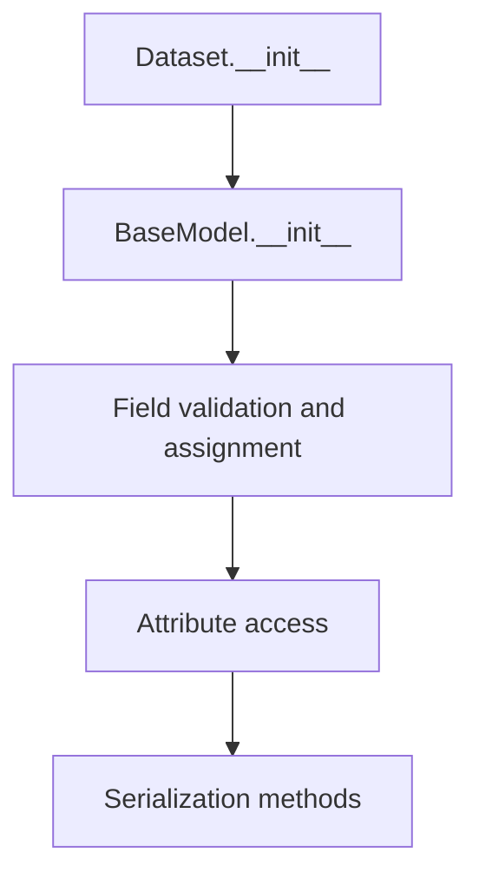

## Raises:
- No explicit exceptions raised by __init__
- Pydantic validation errors may occur during instantiation if field values don't meet validation requirements (though none are defined in this class)
- All fields are optional with default empty string values, so instantiation is always successful

## Example:
```python
# Create a dataset with basic metadata
dataset = Dataset(
    description="Sales data for Q1 2023",
    creator="Data Analytics Team",
    author="John Smith",
    copyright_holder="Acme Corp",
    copyright_year="2023",
    url="https://example.com/sales-data-q1-2023"
)

# Access metadata fields
print(dataset.description)  # "Sales data for Q1 2023"
print(dataset.author)       # "John Smith"

# Update metadata
dataset.description = "Updated sales data for Q1 2023"
print(dataset.description)  # "Updated sales data for Q1 2023"

# Convert to dictionary
metadata_dict = dataset.dict()
print(metadata_dict['author'])  # "John Smith"

# Create with minimal information
minimal_dataset = Dataset()
print(minimal_dataset.description)  # ""
```

## `src.ydata_profiling.config.NumVars` · *class*

## Summary:
Configuration class for numerical variable analysis settings in ydata-profiling.

## Description:
The NumVars class defines configuration parameters for analyzing numerical variables in the ydata-profiling library. It inherits from Pydantic's BaseModel to provide automatic validation and serialization of configuration values. This class encapsulates various thresholds and parameters used during statistical analysis of numerical data, particularly for determining categorical vs. continuous variable treatment and statistical tests.

## State:
- quantiles: List[float] = [0.05, 0.25, 0.5, 0.75, 0.95]
  - Type: List of floats representing percentile quantiles for statistical analysis
  - Valid range: Each value should be between 0 and 1
  - Purpose: Defines percentiles used for descriptive statistics calculation
- skewness_threshold: int = 20
  - Type: Integer threshold for determining variable skewness
  - Valid range: Positive integers
  - Purpose: Threshold for classifying variables as skewed based on skewness measure
- low_categorical_threshold: int = 5
  - Type: Integer threshold for determining if a numerical variable should be treated as categorical
  - Valid range: Non-negative integers
  - Purpose: Variables with fewer unique values than this threshold are considered categorical
- chi_squared_threshold: float = 0.999
  - Type: Float threshold for chi-squared test significance
  - Valid range: Between 0 and 1
  - Purpose: Threshold for determining statistical significance in chi-squared tests

## Lifecycle:
- Creation: Instantiate with optional parameter overrides; defaults are applied automatically
- Usage: Used as part of configuration objects passed to profiling functions; accessed via property access
- Destruction: Managed by Python garbage collection; no explicit cleanup required

## Method Map:
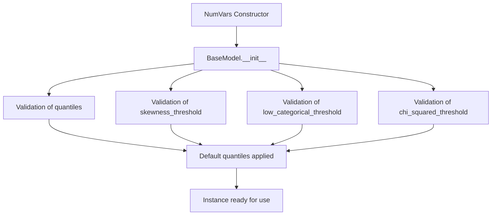

## Raises:
- ValidationError: Raised by Pydantic BaseModel during initialization if any field values fail validation
- TypeError: May occur if invalid types are provided for fields during instantiation

## Example:
```python
# Create default configuration
config = NumVars()

# Override specific parameters
custom_config = NumVars(
    quantiles=[0.1, 0.5, 0.9],
    skewness_threshold=15,
    chi_squared_threshold=0.99
)

# Access configuration values
print(config.quantiles)  # [0.05, 0.25, 0.5, 0.75, 0.95]
print(custom_config.skewness_threshold)  # 15
```

## `src.ydata_profiling.config.TextVars` · *class*

## Summary:
Defines configuration options for text variable analysis in data profiling.

## Description:
The TextVars class encapsulates settings that control which text statistics and transformations are computed when analyzing text variables in a dataset. It serves as a configuration container that determines the granularity of text analysis, allowing users to enable or disable specific metrics like length, word count, character count, and redaction features.

This class is designed to be used as part of a larger configuration system for data profiling tools, providing a standardized way to specify text analysis behavior without requiring direct manipulation of individual flags throughout the codebase.

## State:
- length: bool, default=True
  - Controls whether to compute the length of text values
  - Valid values: True or False
  - Invariant: This flag determines inclusion of text length statistics in analysis results

- words: bool, default=True
  - Controls whether to compute word counts for text values
  - Valid values: True or False
  - Invariant: This flag determines inclusion of word count statistics in analysis results

- characters: bool, default=True
  - Controls whether to compute character counts for text values
  - Valid values: True or False
  - Invariant: This flag determines inclusion of character count statistics in analysis results

- redact: bool, default=False
  - Controls whether to redact sensitive information from text values
  - Valid values: True or False
  - Invariant: When enabled, this flag triggers text redaction processing during analysis

## Lifecycle:
- Creation: Instances are created by passing keyword arguments to the constructor
  - Required arguments: None (all fields have defaults)
  - Factory methods: None (uses standard Pydantic model instantiation)
- Usage: Typically used as a configuration object passed to text analysis functions or methods
- Destruction: Managed automatically by Python's garbage collection; no explicit cleanup required

## Method Map:
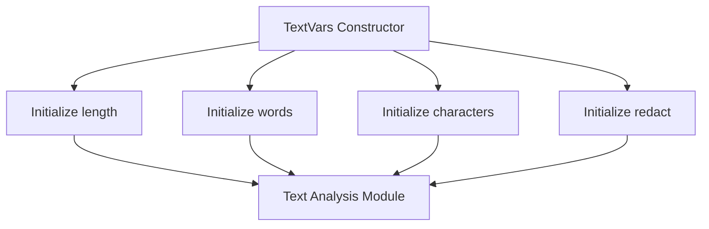

## Raises:
- No exceptions are explicitly raised by the __init__ method
- Validation errors may occur during instantiation if invalid values are provided for fields (handled by Pydantic)

## Example:
```python
# Create default text analysis configuration
config = TextVars()

# Create custom configuration with specific settings
custom_config = TextVars(
    length=True,
    words=False,
    characters=True,
    redact=True
)

# Use in text analysis context
# analysis_results = analyze_text_column(data_column, config)
```

## `src.ydata_profiling.config.CatVars` · *class*

## Summary:
Configuration class for categorical variable analysis settings in ydata-profiling.

## Description:
The CatVars class defines a set of configuration parameters used to control the behavior of categorical variable analysis within the ydata-profiling library. It inherits from Pydantic's BaseModel, providing automatic validation and serialization capabilities. This class is typically instantiated by the profiling configuration system and used internally by various analysis components to determine how categorical variables should be processed and reported.

## State:
- length: bool = True - Controls whether to compute string length statistics for categorical variables
- characters: bool = True - Controls whether to analyze character-level properties of categorical variables  
- words: bool = True - Controls whether to analyze word-level properties of categorical variables
- cardinality_threshold: int = 50 - Threshold for determining high cardinality categorical variables
- percentage_cat_threshold: float = 0.5 - Threshold for determining if a variable is mostly categorical
- imbalance_threshold: float = 0.5 - Threshold for detecting imbalanced categorical distributions
- n_obs: int = 5 - Minimum number of observations required for certain statistical tests
- chi_squared_threshold: float = 0.999 - Chi-squared test significance threshold for categorical associations
- coerce_str_to_date: bool = False - Whether to attempt conversion of strings to dates during analysis
- redact: bool = False - Whether to redact sensitive information in categorical variables
- histogram_largest: int = 50 - Maximum number of categories to display in histograms
- stop_words: List[str] = [] - List of words to exclude from text analysis

## Lifecycle:
- Creation: Instantiated automatically by the profiling configuration system; parameters can be overridden via constructor arguments
- Usage: Used by various analysis components during profiling runs to determine processing behavior
- Destruction: Managed automatically by Python's garbage collection; no explicit cleanup required

## Method Map:
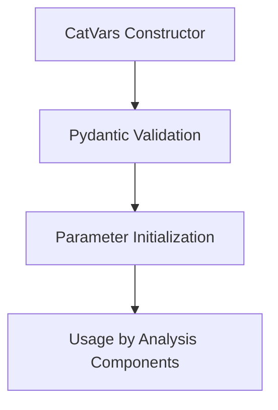

## Raises:
- ValidationError: Raised by Pydantic during initialization if any parameter values fail validation

## Example:
```python
# Create with default settings
config = CatVars()

# Create with custom settings
custom_config = CatVars(
    cardinality_threshold=100,
    chi_squared_threshold=0.95,
    redact=True
)
```

## `src.ydata_profiling.config.BoolVars` · *class*

## Summary:
A configuration class for boolean variable handling containing observation limits, imbalance thresholds, and string-to-boolean mappings.

## Description:
The BoolVars class serves as a centralized configuration container for boolean-related settings in the profiling system. It defines default values for observation counts, imbalance detection thresholds, and standardized string-to-boolean mappings used throughout the analysis pipeline. This class is designed to be instantiated as part of larger configuration objects and provides consistent boolean interpretation across different profiling components.

## State:
- n_obs: int = 3
  - Type: integer
  - Valid range: positive integers (typically small values like 3)
  - Purpose: Number of observations to consider for certain boolean operations
- imbalance_threshold: float = 0.5
  - Type: floating-point number
  - Valid range: [0.0, 1.0]
  - Purpose: Threshold for detecting class imbalance in categorical data
- mappings: Dict[str, bool] = {"t": True, "f": False, "yes": True, "no": False, "y": True, "n": False, "true": True, "false": False}
  - Type: dictionary mapping strings to booleans
  - Valid values: predefined set of lowercase string keys mapped to boolean values
  - Purpose: Standardized string representations for boolean conversion

## Lifecycle:
- Creation: Instantiated automatically as part of configuration objects; no special constructor required
- Usage: Accessed as attributes of configuration instances; typically used for boolean conversion and threshold checking
- Destruction: Managed by Python's garbage collection; no explicit cleanup needed

## Method Map:
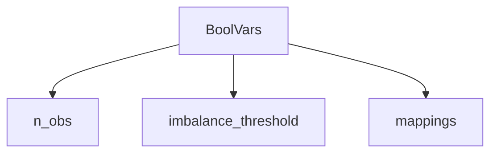

## Raises:
- No exceptions raised during initialization as all fields have default values

## Example:
```python
# Configuration instance creation
config = BoolVars()

# Accessing configuration values
print(config.n_obs)  # Output: 3
print(config.imbalance_threshold)  # Output: 0.5
print(config.mappings["true"])  # Output: True

# Using in context
threshold = config.imbalance_threshold
obs_count = config.n_obs
bool_value = config.mappings.get("yes", False)
```

## `src.ydata_profiling.config.FileVars` · *class*

## Summary:
Represents configuration variables for file processing within the ydata-profiling framework.

## Description:
The FileVars class is a Pydantic BaseModel that encapsulates configuration settings related to file handling operations. It serves as a structured container for file-related boolean flags, specifically tracking whether file processing is active. This class is designed to be part of a larger configuration system and provides a standardized way to manage file processing states.

## State:
- active: bool
  - Type: bool
  - Default value: False
  - Valid values: True or False
  - Purpose: Indicates whether file processing is currently enabled or disabled

## Lifecycle:
- Creation: Instances are created automatically by Pydantic when parsing configuration data or manually with optional parameters
- Usage: Typically accessed through configuration objects that contain this class as an attribute
- Destruction: Managed automatically by Python's garbage collection

## Method Map:
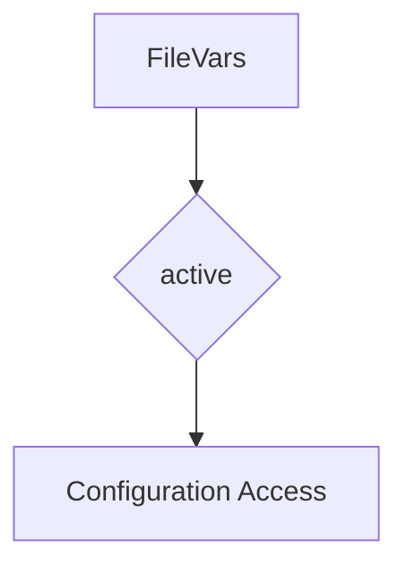

## Raises:
- ValidationError: May be raised by Pydantic during instantiation if invalid data types are provided for fields
- No explicit exceptions are raised by the constructor itself

## Example:
```python
# Creating a FileVars instance with default settings
file_vars = FileVars()

# Creating a FileVars instance with custom settings
file_vars = FileVars(active=True)

# Accessing the active flag
print(file_vars.active)  # Output: False (or True if set)
```

## `src.ydata_profiling.config.PathVars` · *class*

## Summary:
Represents configuration variables for path-related settings in the ydata-profiling library.

## Description:
The PathVars class is a Pydantic BaseModel that encapsulates configuration settings related to path handling within the ydata-profiling library. It serves as a structured container for path-related boolean flags, currently containing a single active flag that controls whether path-related operations are enabled.

This class provides a standardized way to manage path configuration options throughout the profiling system, ensuring consistent handling of path-related features across different components. It leverages Pydantic's validation capabilities to ensure type safety and proper configuration handling.

## State:
- active: bool
  - Type: bool
  - Default value: False
  - Valid values: True or False
  - Purpose: Controls whether path-related operations are active/enabled
  - Invariant: Must be a boolean value

## Lifecycle:
- Creation: Instantiate with optional active parameter (defaults to False)
- Usage: Access the active attribute to check path operation status
- Destruction: Managed automatically by Python's garbage collection

## Method Map:
```mermaid
graph TD
    A[PathVars.__init__] --> B[BaseModel.__init__]
    B --> C[Field validation]
    C --> D[active = False]
    D --> E[PathVars.__repr__]
    E --> F[PathVars.dict()]
```

## Raises:
- ValidationError: May be raised during instantiation if validation fails
- No explicit exceptions raised during normal initialization

## Example:
```python
# Create instance with default settings
path_config = PathVars()

# Create instance with custom settings
path_config = PathVars(active=True)

# Check if path operations are enabled
if path_config.active:
    # Perform path-related operations
    pass

# Convert to dictionary for serialization
config_dict = path_config.dict()

# Access individual field
is_active = path_config.active
```

## `src.ydata_profiling.config.ImageVars` · *class*

## Summary:
Represents configuration settings for image variable processing in data profiling.

## Description:
The ImageVars class encapsulates the configuration options for handling image variables during data profiling operations. It defines whether image processing is active, whether EXIF data should be extracted, and whether image hashing should be performed. This class serves as a dedicated configuration container that standardizes how image-related settings are managed throughout the profiling pipeline.

## State:
- active: bool, default=False - Controls whether image variable processing is enabled
- exif: bool, default=True - Determines if EXIF metadata extraction is performed
- hash: bool, default=True - Specifies whether image hashing operations are executed

All attributes are boolean flags with no additional constraints or valid ranges beyond their type.

## Lifecycle:
- Creation: Instantiated with optional keyword arguments for each configuration flag
- Usage: Used as a configuration object passed to image processing components
- Destruction: No special cleanup required; follows standard Pydantic BaseModel lifecycle

## Method Map:
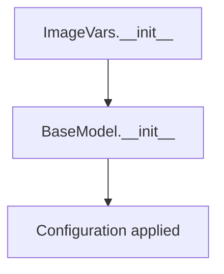

## Raises:
No exceptions are raised during initialization as all fields have default values and are type-safe.

## Example:
```python
# Create configuration with defaults
config = ImageVars()

# Create configuration with custom settings
custom_config = ImageVars(active=True, exif=False, hash=True)

# Use in profiling context
profile = ProfileReport(df, image_vars=custom_config)
```

## `src.ydata_profiling.config.UrlVars` · *class*

## Summary:
Represents configuration variables for URL-related settings in the profiling system.

## Description:
The UrlVars class is a Pydantic BaseModel that encapsulates URL configuration parameters, specifically managing an 'active' boolean flag. It serves as a structured configuration container that ensures type safety and validation for URL-related settings within the ydata-profiling framework. This class provides a standardized way to manage URL feature activation states throughout the profiling pipeline.

## State:
- active: bool
  - Type: bool
  - Default value: False
  - Valid values: True or False
  - Purpose: Controls whether URL-related features are enabled in the profiling process
  - Invariant: Must be a boolean value; enforced by Pydantic validation

## Lifecycle:
- Creation: Instantiate directly with optional 'active' parameter or use defaults
- Usage: Access the 'active' attribute to check URL feature status
- Destruction: Managed automatically by Python's garbage collection

## Method Map:
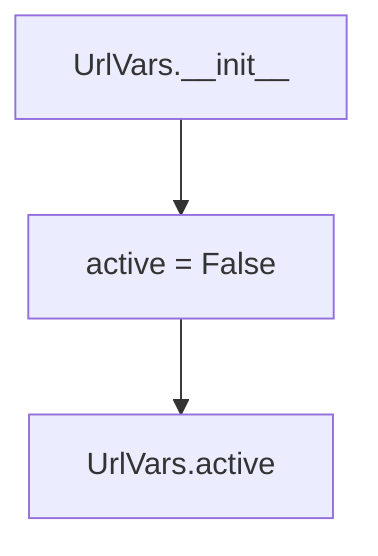

## Raises:
- ValidationError: May be raised by Pydantic if invalid values are provided during instantiation (though default prevents this)
- No explicit exceptions raised during normal initialization

## Example:
```python
# Create instance with default settings
url_config = UrlVars()

# Check if URLs are active
if url_config.active:
    # Enable URL processing
    pass

# Create instance with explicit setting
url_config = UrlVars(active=True)

# Access the active flag
is_active = url_config.active
```

## `src.ydata_profiling.config.TimeseriesVars` · *class*

## Summary:
Configuration class for time series variable settings in data profiling.

## Description:
The TimeseriesVars class encapsulates configuration parameters for time series analysis within the ydata-profiling library. It defines various settings that control how time series variables are processed and analyzed during data profiling. This class serves as a centralized configuration object that allows users to customize time series analysis behavior without modifying the core profiling logic.

## State:
- active: bool, default=False - Flag indicating whether time series analysis is enabled for the dataset
- sortby: Optional[str], default=None - Column name to sort time series data by; when None, no sorting is applied
- autocorrelation: float, default=0.7 - Threshold for autocorrelation analysis; values above this threshold indicate significant autocorrelation
- lags: List[int], default=[1, 7, 12, 24, 30] - List of lag values to use for time series analysis; these represent time intervals for correlation calculations
- significance: float, default=0.05 - Significance level for statistical tests; commonly used for hypothesis testing in time series analysis
- pacf_acf_lag: int, default=100 - Maximum lag for partial autocorrelation and autocorrelation functions; determines the range of lags considered in these calculations

## Lifecycle:
- Creation: Instantiate with optional keyword arguments to override defaults; uses Pydantic BaseModel validation
- Usage: Typically passed as a configuration parameter to time series analysis functions within the profiling pipeline
- Destruction: No special cleanup required; inherits standard Pydantic BaseModel garbage collection behavior

## Method Map:
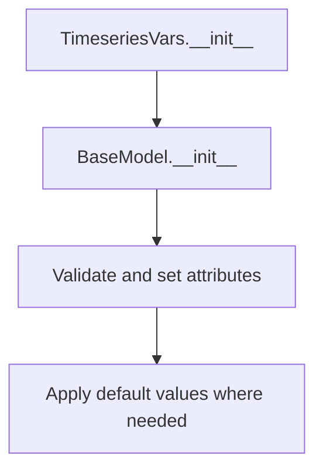

## Raises:
- ValidationError: Raised by Pydantic BaseModel validation if invalid values are provided for any field (e.g., incorrect types, out-of-range values)

## Example:
```python
# Create default configuration
config = TimeseriesVars()

# Create custom configuration
custom_config = TimeseriesVars(
    active=True,
    sortby="date_column",
    autocorrelation=0.8,
    lags=[1, 2, 3, 7, 14],
    significance=0.01
)

# Access configuration values
print(config.active)  # False
print(custom_config.lags)  # [1, 2, 3, 7, 14]
```

## `src.ydata_profiling.config.Univariate` · *class*

## Summary:
Configuration class for univariate variable analysis settings that aggregates settings for different variable types.

## Description:
The Univariate class serves as a centralized configuration container that groups together various variable-specific configuration objects for different data types. It provides a unified interface for accessing and managing configuration settings related to numerical, text, categorical, image, boolean, path, file, URL, and time series variables during data profiling operations. This class enables consistent configuration management across different variable types while maintaining their individual settings.

## State:
- num: NumVars = NumVars()
  - Type: NumVars
  - Purpose: Configuration for numerical variable analysis
  - Default value: Instance of NumVars with default settings
  
- text: TextVars = TextVars()
  - Type: TextVars
  - Purpose: Configuration for text variable analysis
  - Default value: Instance of TextVars with default settings
  
- cat: CatVars = CatVars()
  - Type: CatVars
  - Purpose: Configuration for categorical variable analysis
  - Default value: Instance of CatVars with default settings
  
- image: ImageVars = ImageVars()
  - Type: ImageVars
  - Purpose: Configuration for image variable analysis
  - Default value: Instance of ImageVars with default settings
  
- bool: BoolVars = BoolVars()
  - Type: BoolVars
  - Purpose: Configuration for boolean variable analysis
  - Default value: Instance of BoolVars with default settings
  
- path: PathVars = PathVars()
  - Type: PathVars
  - Purpose: Configuration for path variable analysis
  - Default value: Instance of PathVars with default settings
  
- file: FileVars = FileVars()
  - Type: FileVars
  - Purpose: Configuration for file variable analysis
  - Default value: Instance of FileVars with default settings
  
- url: UrlVars = UrlVars()
  - Type: UrlVars
  - Purpose: Configuration for URL variable analysis
  - Default value: Instance of UrlVars with default settings
  
- timeseries: TimeseriesVars = TimeseriesVars()
  - Type: TimeseriesVars
  - Purpose: Configuration for time series variable analysis
  - Default value: Instance of TimeseriesVars with default settings

## Lifecycle:
- Creation: Automatically instantiated as part of configuration objects; all fields are initialized with default instances of their respective configuration classes
- Usage: Accessed as attributes of configuration instances; used by various analysis components to retrieve type-specific settings
- Destruction: Managed automatically by Python's garbage collection; no explicit cleanup required

## Method Map:
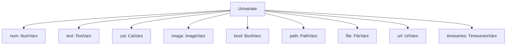

## Raises:
- No exceptions raised during initialization as all fields have default values and are properly initialized

## Example:
```python
# Create default univariate configuration
univariate_config = Univariate()

# Access individual variable type configurations
num_config = univariate_config.num
text_config = univariate_config.text
cat_config = univariate_config.cat

# Use configurations in analysis context
# profile = ProfileReport(df, config=univariate_config)
```

## `src.ydata_profiling.config.MissingPlot` · *class*

## Summary:
Represents configuration settings for missing data plot visualization in ydata-profiling.

## Description:
The MissingPlot class defines a configuration model for controlling the appearance and behavior of missing data plots. It inherits from Pydantic's BaseModel, providing validation and serialization capabilities. This class is used to customize how missing data patterns are visualized in profiling reports, particularly controlling label display and color mapping.

## State:
- force_labels: bool, default=True
  - Controls whether axis labels should be displayed on missing data plots
  - Valid values: True or False
  - When True, labels are shown; when False, they are hidden
- cmap: str, default="RdBu"
  - Specifies the colormap used for rendering missing data patterns
  - Valid values: String representing a matplotlib colormap name
  - Default "RdBu" corresponds to a red-blue diverging colormap

## Lifecycle:
- Creation: Instantiate with optional keyword arguments for force_labels and cmap
- Usage: Used as a configuration object passed to plotting functions
- Destruction: Managed automatically by Python's garbage collection

## Method Map:
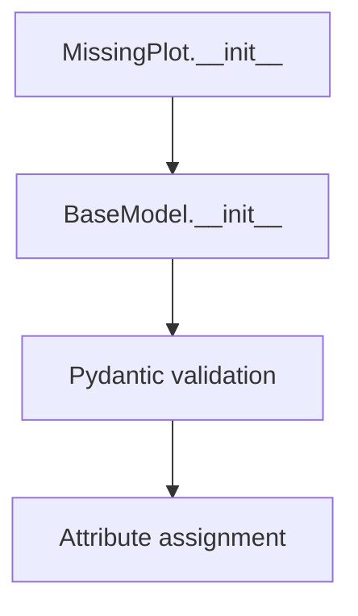

## Raises:
- ValidationError: Raised by Pydantic during initialization if invalid values are provided for force_labels or cmap

## Example:
```python
# Create default configuration
config = MissingPlot()

# Create custom configuration
custom_config = MissingPlot(force_labels=False, cmap="viridis")

# Use in plotting context
plot_config = MissingPlot(cmap="Blues")
```

## `src.ydata_profiling.config.ImageType` · *class*

## Summary:
Represents supported image formats for profile reports in the ydata-profiling library.

## Description:
The ImageType enum defines the valid image formats that can be used when generating profile reports. It serves as a type-safe enumeration to ensure only supported image formats are used throughout the profiling system. This class is typically used by configuration classes and report generation components that need to specify or validate image output formats.

## State:
- svg: str - SVG image format constant with value "svg"
- png: str - PNG image format constant with value "png"

## Lifecycle:
- Creation: Instantiated automatically as an Enum class; no explicit instantiation required
- Usage: Used as a type hint or direct reference in configuration objects and report generation
- Destruction: Managed by Python's garbage collection

## Method Map:
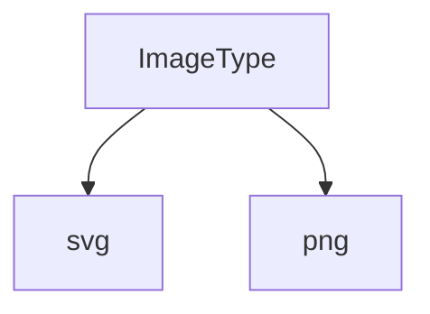

## Raises:
- None: Enum classes do not raise exceptions during initialization

## Example:
```python
from src.ydata_profiling.config import ImageType

# Using the enum values
format_svg = ImageType.svg  # Returns ImageType.svg
format_png = ImageType.png  # Returns ImageType.png

# String representation
print(format_svg.value)  # Outputs: "svg"
print(format_png.value)  # Outputs: "png"
```

## `src.ydata_profiling.config.CorrelationPlot` · *class*

## Summary:
Configuration settings for correlation plot visualization in ydata-profiling.

## Description:
This class defines visual appearance settings for correlation plots generated by the ydata-profiling library. It specifies color mapping and handling of invalid data points in correlation heatmaps. The class inherits from Pydantic's BaseModel, providing automatic validation, serialization, and type checking capabilities.

## State:
- cmap: str, default value "RdBu" - Specifies the matplotlib colormap used for rendering correlation values in the heatmap. Common options include "RdBu", "viridis", "plasma", etc.
- bad: str, default value "#000000" - Defines the hex color code used to represent invalid, missing, or undefined correlation values in the heatmap.

## Lifecycle:
- Creation: Instantiate directly with optional cmap and bad parameters. Uses Pydantic's automatic validation.
- Usage: Typically passed as a configuration object to correlation plotting functions within the profiling pipeline.
- Destruction: No special cleanup required as it's a simple data container with no resources to manage.

## Method Map:
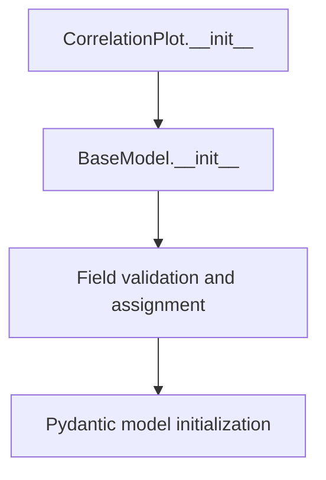

## Raises:
- ValidationError: May be raised during instantiation if provided values don't meet Pydantic validation rules (though none are explicitly defined in this class).

## Example:
```python
# Create default configuration
config = CorrelationPlot()

# Create custom configuration
custom_config = CorrelationPlot(cmap="viridis", bad="#FF0000")

# Access fields
print(config.cmap)  # Output: "RdBu"
print(custom_config.bad)  # Output: "#FF0000"

# Use in correlation plotting context
plot_config = CorrelationPlot()
```

## `src.ydata_profiling.config.Histogram` · *class*

## Summary:
Represents configuration settings for histogram visualization in data profiling.

## Description:
The Histogram class defines a set of configurable parameters that control how histograms are displayed in data profiling reports. It serves as a structured configuration object that encapsulates visualization settings for histogram charts, ensuring consistent formatting and display options across different histogram representations in the profiling analysis.

## State:
- bins: int = 50
  - Type: integer
  - Valid range: positive integers (typically 10-1000)
  - Purpose: Number of bins to use in the histogram
- max_bins: int = 250
  - Type: integer
  - Valid range: positive integers (typically 10-1000)
  - Purpose: Maximum number of bins allowed for histogram calculation
- x_axis_labels: bool = True
  - Type: boolean
  - Valid values: True or False
  - Purpose: Whether to display x-axis labels on the histogram
- density: bool = False
  - Type: boolean
  - Valid values: True or False
  - Purpose: Whether to normalize the histogram to show probability density instead of counts

## Lifecycle:
- Creation: Instantiate directly with optional keyword arguments for any parameter
- Usage: Used as a configuration object passed to histogram rendering functions
- Destruction: No special cleanup required; relies on Python garbage collection

## Method Map:
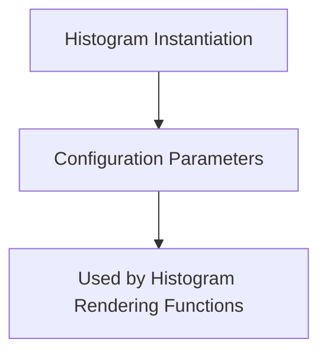

## Raises:
- No exceptions are raised during initialization as all parameters have default values
- Validation errors may occur during serialization/deserialization if invalid values are provided

## Example:
```python
# Create default histogram configuration
hist_config = Histogram()

# Create custom histogram configuration
custom_hist = Histogram(bins=100, max_bins=500, x_axis_labels=False)

# Use in histogram generation
# histogram_renderer.render(data, hist_config)
```

## `src.ydata_profiling.config.CatFrequencyPlot` · *class*

## Summary:
Configuration class for controlling category frequency plot display settings in data profiling.

## Description:
The CatFrequencyPlot class encapsulates configuration parameters for rendering category frequency plots in data profiling reports. It determines whether to show the plot, what visualization type to use, the maximum number of unique categories to display, and custom color schemes. This class is typically instantiated by the profiling system when configuring visualization settings for categorical data analysis.

## State:
- show: bool, default=True - Controls whether the category frequency plot is displayed. When False, the plot is disabled.
- type: str, default="bar" - Specifies the visualization type, either "bar" or "pie".
- max_unique: int, default=10 - Maximum number of unique categories to display in the plot.
- colors: Optional[List[str]], default=None - Custom color palette for the plot elements, or None to use default colors.

## Lifecycle:
- Creation: Instantiated with optional keyword arguments for configuration parameters
- Usage: Used as a configuration object by profiling components to determine plot rendering behavior
- Destruction: No special cleanup required, relies on standard Python garbage collection

## Method Map:
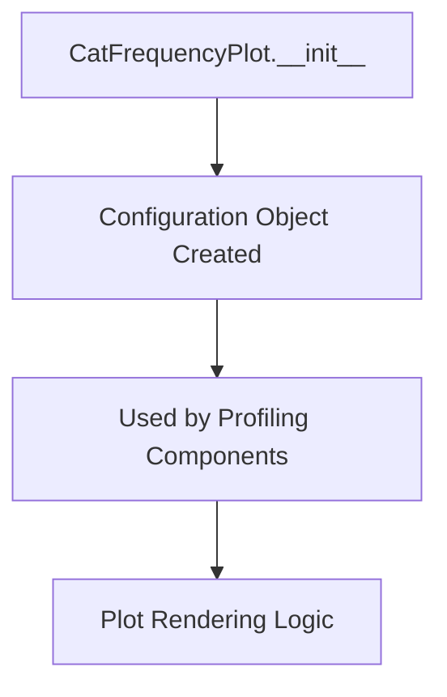

## Raises:
- No exceptions are raised during initialization as all parameters have sensible defaults

## Example:
```python
# Create default configuration
config = CatFrequencyPlot()

# Create custom configuration
custom_config = CatFrequencyPlot(
    show=True,
    type="pie",
    max_unique=15,
    colors=["red", "blue", "green"]
)
```

## `src.ydata_profiling.config.Plot` · *class*

## Summary:
Configuration class for controlling plot-related settings in data profiling reports.

## Description:
The Plot class encapsulates various configuration parameters that control the visualization aspects of data profiling reports. It serves as a centralized configuration object that manages settings for different types of plots including missing data visualization, correlation matrices, histograms, and categorical frequency displays. This class is typically instantiated by the profiling system when configuring visualization settings for statistical analysis reports.

## State:
- missing: MissingPlot, default=MissingPlot() - Configuration for missing data plot visualization
- image_format: ImageType, default=ImageType.svg - Specifies the output format for generated images (svg or png)
- correlation: CorrelationPlot, default=CorrelationPlot() - Configuration for correlation matrix plot appearance
- dpi: int, default=800 - DPI setting for PNG image output (ignored for SVG format)
- histogram: Histogram, default=Histogram() - Configuration for histogram visualization parameters
- scatter_threshold: int, default=1000 - Threshold for determining when to use scatter plots vs. other visualization methods
- cat_freq: CatFrequencyPlot, default=CatFrequencyPlot() - Configuration for categorical frequency plot settings

## Lifecycle:
- Creation: Instantiated with optional keyword arguments for any configuration parameter
- Usage: Used as a configuration object passed to various plotting and visualization components within the profiling pipeline
- Destruction: No special cleanup required; relies on standard Python garbage collection

## Method Map:
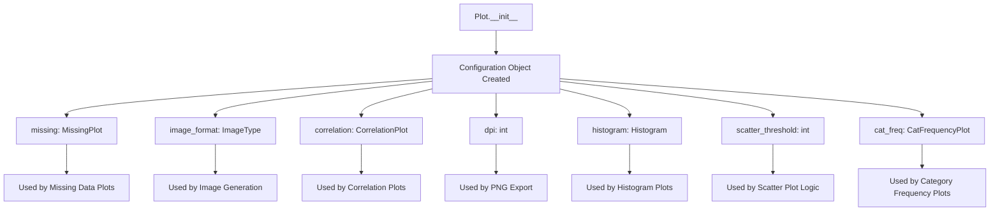

## Raises:
- ValidationError: May be raised during instantiation if provided values don't meet Pydantic validation rules for any of the nested configuration objects

## Example:
```python
# Create default plot configuration
plot_config = Plot()

# Create custom plot configuration
custom_plot_config = Plot(
    image_format="png",
    dpi=300,
    scatter_threshold=500,
    histogram=Histogram(bins=100)
)

# Access individual configuration components
print(plot_config.image_format)  # Output: "svg"
print(plot_config.histogram.bins)  # Output: 50
```

## `src.ydata_profiling.config.Theme` · *class*

## Summary:
Represents a collection of predefined UI themes for report styling in the profiling library.

## Description:
The Theme class defines a set of available UI themes that can be applied to generated reports. It serves as an enumeration of theme names that correspond to different CSS styling options, enabling users to customize the visual appearance of their profiling reports.

## State:
- united (Theme): Represents the 'united' theme variant with value "united"
- flatly (Theme): Represents the 'flatly' theme variant with value "flatly"  
- cosmo (Theme): Represents the 'cosmo' theme variant with value "cosmo"
- simplex (Theme): Represents the 'simplex' theme variant with value "simplex"

## Lifecycle:
- Creation: Instantiated automatically as an Enum class; no explicit construction required
- Usage: Used as a type-safe enumeration in configuration objects to specify report themes
- Destruction: Managed by Python's garbage collector

## Method Map:
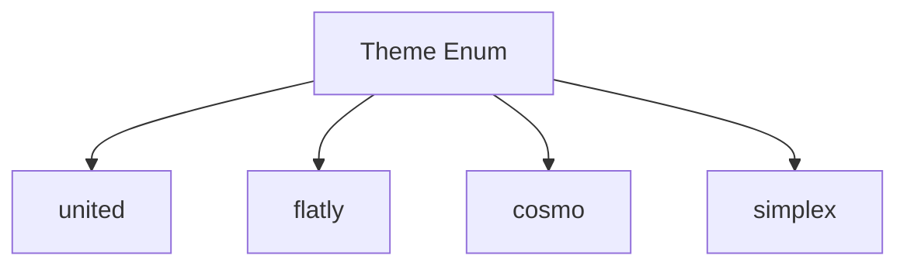

## Raises:
- No exceptions raised during initialization as this is a simple Enum definition

## Example:
```python
from src.ydata_profiling.config import Theme

# Using the theme in configuration
theme = Theme.united
print(theme.value)  # Output: "united"
```

## `src.ydata_profiling.config.Style` · *class*

## Summary:
Defines styling configuration for report generation, including color schemes, logos, and UI themes.

## Description:
The Style class encapsulates visual styling parameters for profiling reports. It provides a centralized configuration interface for customizing the appearance of generated reports, including primary colors, logos, and UI themes. This class is designed to work with Pydantic's BaseModel for validation and serialization capabilities.

## State:
- primary_colors (List[str]): A list of color hex codes defining the color palette. Default value is ["#377eb8", "#e41a1c", "#4daf4a"]. The first color is exposed via the primary_color property.
- logo (str): A string representing the logo path or identifier. Default value is an empty string.
- theme (Optional[Theme]): An optional reference to a UI theme enumeration. Default value is None.
- _labels (List[str]): A private attribute containing label definitions, initialized to ["_"].

## Lifecycle:
- Creation: Instances are created using standard Pydantic BaseModel instantiation patterns. All fields have default values, making instantiation straightforward.
- Usage: Typically accessed during report generation to apply visual styling configurations. The primary_color property provides convenient access to the main color.
- Destruction: Managed by Python's garbage collection mechanism.

## Method Map:
```mermaid
graph TD
    A[Style] --> B[primary_color(property)]
    B --> C[primary_colors[0]]
```

## Raises:
- No explicit exceptions are raised during __init__ as this is a Pydantic BaseModel with default field values.
- Validation errors may occur during instantiation if invalid values are provided for fields that require validation.

## Example:
```python
from src.ydata_profiling.config import Style

# Create a style instance with defaults
style = Style()

# Access primary color
print(style.primary_color)  # Output: "#377eb8"

# Create a style with custom settings
custom_style = Style(
    primary_colors=["#ff0000", "#00ff00"],
    logo="path/to/logo.png",
    theme=Theme.united
)
```

### `src.ydata_profiling.config.Style.primary_color` · *method*

## Summary:
Returns the first color from the primary_colors list for use as the main color in visualizations.

## Description:
This property provides access to the primary color configuration used for styling visualizations. It serves as a convenient accessor for the first element in the primary_colors list, which is typically used as the dominant color in charts and reports. The method is implemented as a property to provide clean, read-only access to the first color value.

## Args:
    None

## Returns:
    str: The first color value from the primary_colors list.

## Raises:
    IndexError: If primary_colors list is empty.

## State Changes:
    Attributes READ: self.primary_colors
    Attributes WRITTEN: None

## Constraints:
    Preconditions: The primary_colors attribute must be initialized as a list with at least one element.
    Postconditions: Returns a string representing a color value from the primary_colors list.

## Side Effects:
    None

## `src.ydata_profiling.config.Html` · *class*

## Summary:
Configures HTML report generation settings including styling, asset handling, and display options.

## Description:
The Html class manages configuration parameters for generating HTML reports in the ydata-profiling library. It controls various aspects of HTML output such as styling preferences, asset management, and layout options. This class extends Pydantic's BaseModel to provide automatic validation and serialization of configuration settings.

## State:
- style (Style): Configuration object for report styling, including color schemes and themes. Defaults to a new Style instance.
- navbar_show (bool): Flag indicating whether to display the navigation bar in the HTML report. Defaults to True.
- minify_html (bool): Flag controlling whether generated HTML should be minified for reduced file size. Defaults to True.
- use_local_assets (bool): Flag determining whether to use local asset files or CDN references. Defaults to True.
- inline (bool): Flag specifying whether CSS and JavaScript should be embedded inline rather than referenced externally. Defaults to True.
- assets_prefix (Optional[str]): Prefix to prepend to asset paths when using local assets. Defaults to None.
- assets_path (Optional[str]): Custom path for locating assets when use_local_assets is True. Defaults to None.
- full_width (bool): Flag controlling whether the report should span the full width of the browser window. Defaults to False.

## Lifecycle:
- Creation: Instantiate using standard Pydantic BaseModel patterns. All parameters have sensible defaults, making instantiation straightforward.
- Usage: Typically passed to report generation functions to customize HTML output behavior.
- Destruction: Managed by Python's garbage collection mechanism.

## Method Map:
```mermaid
graph TD
    A[Html] --> B[BaseModel]
```

## Raises:
- No explicit exceptions are raised during __init__ as this is a Pydantic BaseModel with default field values.
- Validation errors may occur during instantiation if invalid values are provided for fields that require validation.

## Example:
```python
from src.ydata_profiling.config import Html

# Create HTML configuration with defaults
html_config = Html()

# Create HTML configuration with custom settings
custom_html_config = Html(
    navbar_show=False,
    minify_html=False,
    full_width=True
)
```

## `src.ydata_profiling.config.Duplicates` · *class*

## Summary:
Represents configuration settings for duplicate detection in data profiling.

## Description:
The Duplicates class defines the configuration parameters used for identifying and reporting duplicate records in a dataset during profiling. It specifies how many duplicate records to display and what key to use for labeling duplicate information in reports. This class is part of a larger configuration system for data profiling tools.

## State:
- head: int = 10
  - Type: integer
  - Valid range: positive integers (default: 10)
  - Purpose: Number of duplicate records to display in reports
- key: str = "# duplicates"
  - Type: string
  - Valid values: any string value (default: "# duplicates")
  - Purpose: Key used to label duplicate information in report output

## Lifecycle:
- Creation: Instantiate with optional head and key parameters; defaults are applied automatically
- Usage: Used as part of a larger configuration object for data profiling
- Destruction: No special cleanup required as it's a simple data container

## Method Map:
```mermaid
graph TD
    A[Duplicates.__init__] --> B[Duplicates.head]
    A --> C[Duplicates.key]
```

## Raises:
- No exceptions are explicitly raised by __init__
- Validation errors may occur if invalid values are provided for fields (handled by Pydantic BaseModel validation)

## Example:
```python
# Create default configuration
config = Duplicates()

# Create custom configuration
custom_config = Duplicates(head=5, key="# dup")

# Access configuration values
print(config.head)  # Output: 10
print(config.key)   # Output: "# duplicates"
```

## `src.ydata_profiling.config.Correlation` · *class*

## Summary:
Configuration class for correlation analysis settings in ydata-profiling.

## Description:
The Correlation class defines configuration parameters for computing and analyzing correlations between variables in a dataset. It is used to control various aspects of the correlation calculation process including whether to compute correlations, the threshold for warning about high correlations, and binning parameters for correlation computation.

This class serves as a distinct abstraction to encapsulate all correlation-related configuration options, providing a centralized way to manage these settings throughout the profiling process. It ensures consistent configuration handling across different correlation analysis components.

## State:
- key: str, default="", uniquely identifies this correlation configuration
- calculate: bool, default=True, controls whether correlation calculations should be performed
- warn_high_correlations: int, default=10, number of high correlations to warn about
- threshold: float, default=0.5, correlation threshold for identifying strong correlations
- n_bins: int, default=10, number of bins to use for discretizing continuous variables during correlation calculation

## Lifecycle:
- Creation: Instantiate with optional keyword arguments for any field values
- Usage: Access fields directly for configuration purposes; typically used by correlation analysis components
- Destruction: No special cleanup required as it's a simple data container

## Method Map:
```mermaid
graph TD
    A[Correlation Config] --> B{calculate}
    A --> C{warn_high_correlations}
    A --> D{threshold}
    A --> E{n_bins}
    A --> F{key}
```

## Raises:
- No exceptions are raised during initialization as this is a simple Pydantic model with default values

## Example:
```python
# Create correlation config with defaults
config = Correlation()

# Create correlation config with custom settings
custom_config = Correlation(
    calculate=False,
    threshold=0.7,
    warn_high_correlations=5
)
```

## `src.ydata_profiling.config.Correlations` · *class*

## Summary:
Configuration class for managing correlation analysis settings including Pearson, Spearman, and Auto correlation methods.

## Description:
The Correlations class provides a centralized configuration container for correlation analysis settings in ydata-profiling. It manages three distinct correlation methods (Pearson, Spearman, and Auto) each represented by a Correlation configuration object. This class serves as a distinct abstraction to encapsulate all correlation-related configuration options, ensuring consistent configuration handling across different correlation analysis components throughout the profiling process.

## State:
- pearson: Correlation, default=Correlation(key="pearson"), configuration for Pearson correlation analysis
- spearman: Correlation, default=Correlation(key="spearman"), configuration for Spearman correlation analysis  
- auto: Correlation, default=Correlation(key="auto"), configuration for automatic correlation selection

## Lifecycle:
- Creation: Instantiated automatically with default Correlation objects for each method type
- Usage: Access individual correlation configurations via pearson, spearman, or auto attributes
- Destruction: No special cleanup required as it's a simple Pydantic model data container

## Method Map:
```mermaid
graph TD
    A[Correlations Config] --> B[pearson: Correlation]
    A --> C[spearman: Correlation]
    A --> D[auto: Correlation]
```

## Raises:
- No exceptions are raised during initialization as this is a simple Pydantic model with default values

## Example:
```python
# Create correlations config with defaults
config = Correlations()

# Access individual correlation configurations
pearson_config = config.pearson
spearman_config = config.spearman
auto_config = config.auto
```

## `src.ydata_profiling.config.Interactions` · *class*

## Summary:
Configuration class for defining interaction analysis parameters in data profiling, controlling continuous variable interactions and target variables.

## Description:
The Interactions class extends Pydantic's BaseModel to provide a structured configuration for interaction analysis in data profiling workflows. It enables users to specify whether continuous variable interactions should be computed and which variables should be treated as targets in interaction calculations. This configuration is used by profiling tools to customize the scope and behavior of interaction analysis without requiring code modifications.

## State:
- continuous: bool, default=True
  - Determines whether to compute interactions for continuous variables
  - When True (default), continuous variable interactions are analyzed
  - When False, continuous variable interactions are excluded from analysis
- targets: List[str], default=[]
  - Specifies target variables for interaction analysis
  - Empty list (default) means all variables are considered for interaction analysis
  - Non-empty list restricts interaction computation to specified target variables

## Lifecycle:
- Creation: Instantiate with optional continuous and targets parameters
- Usage: Pass instance to profiling configuration objects to control interaction analysis
- Destruction: Managed automatically by Python's garbage collection

## Method Map:
```mermaid
graph TD
    A[Interactions.__init__] --> B[BaseModel.__init__]
    B --> C[Field validation and assignment]
    C --> D[Configuration ready for profiling]
```

## Raises:
- ValidationError: May be raised by Pydantic during initialization if field values fail validation (though no explicit validators are defined in this class)

## Example:
```python
# Create default configuration (analyze all continuous interactions)
config = Interactions()

# Create configuration excluding continuous interactions
config = Interactions(continuous=False)

# Create configuration with specific target variables
config = Interactions(targets=['age', 'income'])

# Create full configuration
config = Interactions(continuous=False, targets=['age', 'income'])

# Use in profiling workflow
from ydata_profiling import ProfileReport
profile = ProfileReport(df, config=config)
```

## `src.ydata_profiling.config.Samples` · *class*

## Summary:
Configuration class for specifying sample sizes in data profiling reports.

## Description:
The Samples class defines the number of samples to display for different sections of a data profiling report. It controls how many rows are shown for the head (top), tail (bottom), and random samples of a dataset. This configuration is used by the profiling system to determine sample sizes when generating reports.

## State:
- head: int = 10
  - Type: integer
  - Valid range: non-negative integers
  - Purpose: Number of rows to show from the beginning of the dataset
- tail: int = 10
  - Type: integer
  - Valid range: non-negative integers
  - Purpose: Number of rows to show from the end of the dataset
- random: int = 0
  - Type: integer
  - Valid range: non-negative integers
  - Purpose: Number of random rows to show from the dataset

All attributes are initialized with default values and are part of the Pydantic BaseModel configuration.

## Lifecycle:
- Creation: Instances are created automatically by Pydantic when parsing configuration data or can be instantiated directly with keyword arguments
- Usage: Used internally by the profiling system to determine sample sizes for report generation
- Destruction: Managed by Python's garbage collection; no explicit cleanup required

## Method Map:
```mermaid
graph TD
    A[Samples.__init__] --> B[Pydantic BaseModel validation]
    B --> C[Validate and set head, tail, random values]
```

## Raises:
- ValidationError: Raised by Pydantic during initialization if invalid values are provided for the fields (though default values prevent this in normal usage)

## Example:
```python
# Create default samples configuration
samples = Samples()

# Create custom samples configuration
samples = Samples(head=5, tail=5, random=3)

# Access sample counts
print(samples.head)   # Output: 10
print(samples.tail)   # Output: 10
print(samples.random) # Output: 0
```

## `src.ydata_profiling.config.Variables` · *class*

## Summary:
The Variables class is a Pydantic BaseModel subclass that manages variable descriptions for data profiling configurations.

## Description:
The Variables class serves as a configuration container for storing variable descriptions within the ydata-profiling library. It inherits from Pydantic's BaseModel, providing structured data handling with built-in validation, serialization, and deserialization capabilities. This class is used internally by the profiling configuration system to manage metadata about dataset variables, allowing users to provide custom descriptions for variables during data profiling operations.

## State:
- descriptions: dict - A dictionary mapping variable names to their descriptions. Default value is an empty dictionary {}. This attribute stores metadata about variables that can be used during data profiling operations. The dictionary keys are typically variable names (strings) and values are description strings.

## Lifecycle:
- Creation: Instances can be created with optional descriptions parameter or with default empty dictionary. The class leverages Pydantic's initialization process for validation.
- Usage: Provides standard Pydantic model functionality including validation, serialization to dict/json, attribute access, and field validation.
- Destruction: Managed by Python's garbage collection; no explicit cleanup required.

## Method Map:
```mermaid
graph TD
    A[Variables.__init__] --> B[BaseModel.__init__]
    B --> C[Pydantic validation]
    C --> D[Field validation]
    D --> E[Attribute assignment]
    E --> F[Validation completion]
```

## Raises:
- ValidationError: May be raised by Pydantic during initialization if validation fails (though with the simple field shown, this is unlikely in normal usage).

## Example:
```python
# Creating a Variables instance with descriptions
config_vars = Variables(descriptions={"age": "Age of the person", "income": "Annual income"})

# Accessing descriptions
print(config_vars.descriptions)  # {"age": "Age of the person", "income": "Annual income"}

# Creating an empty Variables instance
empty_vars = Variables()
print(empty_vars.descriptions)  # {}

# Using Pydantic features
print(config_vars.dict())  # Converts to dictionary representation
print(config_vars.json())  # Converts to JSON string representation
```

## `src.ydata_profiling.config.IframeAttribute` · *class*

## Summary:
Represents valid HTML iframe attribute names for embedding content in profiling reports.

## Description:
This enumeration defines the supported iframe attributes that can be used when generating embedded content within profiling report outputs. It serves as a type-safe way to specify which iframe attribute should be used when embedding HTML content, particularly in contexts where security or compatibility considerations require specific attribute usage.

## State:
- `src` (str): The "src" iframe attribute value, representing the URL of the content to embed
- `srcdoc` (str): The "srcdoc" iframe attribute value, representing inline HTML content to embed

## Lifecycle:
- Creation: Instantiated automatically as part of the Enum class; no explicit instantiation required
- Usage: Used as an enumeration member when specifying iframe embedding strategies in report configuration
- Destruction: Managed by Python's garbage collection; no explicit cleanup needed

## Method Map:
```mermaid
graph TD
    A[IframeAttribute] --> B[src]
    A --> C[srcdoc]
```

## Raises:
- None: This is an enumeration class with no constructor logic that raises exceptions

## Example:
```python
from src.ydata_profiling.config import IframeAttribute

# Using the enumeration members
iframe_attr = IframeAttribute.src  # Represents "src" attribute
iframe_attr = IframeAttribute.srcdoc  # Represents "srcdoc" attribute

# These can be used in configurations where iframe attributes are specified
attribute_value = iframe_attr.value  # Returns "src" or "srcdoc"
```

## `src.ydata_profiling.config.Iframe` · *class*

## Summary:
Represents configuration settings for embedding HTML content in profiling reports using iframe attributes.

## Description:
The Iframe class provides a structured way to configure how HTML content is embedded within profiling report outputs. It defines the dimensions and attribute type used for embedding content in iframes, supporting both 'src' and 'srcdoc' attributes for flexible embedding strategies.

## State:
- `height` (str): The height dimension of the iframe, defaults to "800px"
- `width` (str): The width dimension of the iframe, defaults to "100%"
- `attribute` (IframeAttribute): The iframe attribute to use for embedding, defaults to IframeAttribute.srcdoc

## Lifecycle:
- Creation: Instantiate with optional height, width, and attribute parameters
- Usage: Typically used as part of report configuration when generating embedded content
- Destruction: Managed by Python's garbage collection; no explicit cleanup required

## Method Map:
```mermaid
graph TD
    A[Iframe.__init__] --> B[Iframe.height]
    A --> C[Iframe.width]
    A --> D[Iframe.attribute]
```

## Raises:
- None: The class inherits from BaseModel and doesn't define custom initialization logic that raises exceptions

## Example:
```python
from src.ydata_profiling.config import Iframe, IframeAttribute

# Create default iframe configuration
iframe_config = Iframe()

# Create custom iframe configuration
custom_iframe = Iframe(
    height="600px",
    width="80%",
    attribute=IframeAttribute.src
)

# Access configuration values
print(iframe_config.height)  # "800px"
print(iframe_config.attribute.value)  # "srcdoc"
```

## `src.ydata_profiling.config.Notebook` · *class*

## Summary:
Represents configuration settings for notebook-specific reporting features, primarily controlling iframe embedding behavior.

## Description:
The Notebook class encapsulates configuration options specifically designed for generating profiling reports within notebook environments. It provides a structured approach to customize how HTML content is embedded in notebooks, particularly focusing on iframe attributes and dimensions. This class serves as a dedicated configuration container that ensures consistent reporting behavior across different notebook platforms.

## State:
- `iframe` (Iframe): Configuration object for iframe embedding settings, including height, width, and attribute type. Defaults to a new Iframe instance with default values.

## Lifecycle:
- Creation: Instantiated without arguments, creating a default configuration with standard iframe settings
- Usage: Typically accessed as part of a larger configuration object when generating notebook-based reports
- Destruction: Managed by Python's garbage collection; no explicit cleanup required

## Method Map:
```mermaid
graph TD
    A[Notebook.__init__] --> B[Notebook.iframe]
```

## Raises:
- None: The class inherits from BaseModel and doesn't define custom initialization logic that raises exceptions

## Example:
```python
from src.ydata_profiling.config import Notebook

# Create default notebook configuration
notebook_config = Notebook()

# Access iframe configuration
print(notebook_config.iframe.height)  # "800px"
print(notebook_config.iframe.width)   # "100%"
print(notebook_config.iframe.attribute.value)  # "srcdoc"
```

## `src.ydata_profiling.config.Report` · *class*

## Summary:
The Report class is a Pydantic model that defines configuration settings for report generation, primarily controlling numerical precision display.

## Description:
This configuration class inherits from Pydantic's BaseModel to provide structured data handling with automatic validation. It encapsulates report-specific settings that influence how numerical data is formatted and displayed in profiling reports. The class is typically instantiated by the profiling system to manage formatting behavior.

## State:
- precision: int
  - Type: int
  - Default value: 8
  - Valid range: Any integer (though practically limited by floating-point representation)
  - Invariant: Should be a non-negative integer representing significant digits for numerical display

## Lifecycle:
- Creation: Instantiate with optional precision parameter (defaults to 8)
- Usage: Access the precision attribute to determine display formatting for numerical values
- Destruction: Managed automatically by Python's garbage collection (no explicit cleanup needed)

## Method Map:
```mermaid
graph TD
    A[Report.__init__] --> B[BaseModel.__init__]
    B --> C[Field validation and assignment]
    C --> D[precision = 8 (default)]
```

## Raises:
- No explicit exceptions raised by __init__ in the visible code
- Pydantic validation errors may occur during instantiation if invalid values are provided for fields (inherited behavior from BaseModel)

## Example:
```python
# Create default configuration
config = Report()

# Create with custom precision
config = Report(precision=10)

# Use in report generation context
display_precision = config.precision
print(f"Numbers will be displayed with {display_precision} significant digits")
```

## `src.ydata_profiling.config.Settings` · *class*

## Summary:
Configuration class for managing pandas profiling settings, serving as the central hub for all profiling parameters.

## Description:
The Settings class is a Pydantic BaseSettings subclass that provides a comprehensive configuration system for pandas data profiling operations. It aggregates various configuration objects and parameters that control different aspects of the profiling process, including dataset metadata, variable analysis settings, visualization options, and report generation parameters. This class acts as the primary interface for customizing profiling behavior and serves as the foundation for all profiling configurations.

The class is designed to be easily extensible and provides factory methods for creating instances from configuration files, making it flexible for different deployment scenarios. It leverages Pydantic's validation capabilities to ensure configuration integrity and provides methods for updating configurations dynamically.

## State:
- title: str = "Pandas Profiling Report"
  - Type: string
  - Valid values: any string
  - Purpose: Title to display on generated reports
  - Invariant: Always a string value

- dataset: Dataset = Dataset()
  - Type: Dataset object
  - Valid values: Instance of Dataset class
  - Purpose: Metadata about the dataset being profiled
  - Invariant: Always a Dataset instance

- variables: Variables = Variables()
  - Type: Variables object
  - Valid values: Instance of Variables class
  - Purpose: Variable descriptions and metadata
  - Invariant: Always a Variables instance

- infer_dtypes: bool = True
  - Type: boolean
  - Valid values: True or False
  - Purpose: Whether to infer data types during profiling
  - Invariant: Always a boolean value

- show_variable_description: bool = True
  - Type: boolean
  - Valid values: True or False
  - Purpose: Whether to display variable descriptions in reports
  - Invariant: Always a boolean value

- pool_size: int = 0
  - Type: integer
  - Valid values: non-negative integers
  - Purpose: Number of worker processes for parallel processing
  - Invariant: Always a non-negative integer

- progress_bar: bool = True
  - Type: boolean
  - Valid values: True or False
  - Purpose: Whether to display progress bars during profiling
  - Invariant: Always a boolean value

- vars: Univariate = Univariate()
  - Type: Univariate object
  - Valid values: Instance of Univariate class
  - Purpose: Configuration for univariate variable analysis
  - Invariant: Always a Univariate instance

- sort: Optional[str] = None
  - Type: string or None
  - Valid values: String values or None
  - Purpose: Sorting criteria for variables in reports (based on variable descriptions)
  - Invariant: Always a string or None

- missing_diagrams: Dict[str, bool] = {"bar": True, "matrix": True, "heatmap": True}
  - Type: dictionary mapping strings to booleans
  - Valid values: Dictionary with keys "bar", "matrix", "heatmap" and boolean values
  - Purpose: Controls which missing data diagrams to display
  - Invariant: Always a dictionary with specified keys and boolean values

- correlation_table: bool = True
  - Type: boolean
  - Valid values: True or False
  - Purpose: Whether to include correlation table in reports
  - Invariant: Always a boolean value

- correlations: Dict[str, Correlation] = {...}
  - Type: dictionary mapping strings to Correlation objects
  - Valid values: Dictionary with keys "auto", "spearman", "pearson", "phi_k", "cramers", "kendall"
  - Purpose: Configuration for different correlation methods
  - Invariant: Always a dictionary with specified keys and Correlation instances

- interactions: Interactions = Interactions()
  - Type: Interactions object
  - Valid values: Instance of Interactions class
  - Purpose: Configuration for interaction analysis
  - Invariant: Always an Interactions instance

- categorical_maximum_correlation_distinct: int = 100
  - Type: integer
  - Valid values: positive integers
  - Purpose: Maximum distinct values for categorical correlation analysis
  - Invariant: Always a positive integer

- memory_deep: bool = False
  - Type: boolean
  - Valid values: True or False
  - Purpose: Whether to use deep memory optimization
  - Invariant: Always a boolean value

- plot: Plot = Plot()
  - Type: Plot object
  - Valid values: Instance of Plot class
  - Purpose: Configuration for plot generation
  - Invariant: Always a Plot instance

- duplicates: Duplicates = Duplicates()
  - Type: Duplicates object
  - Valid values: Instance of Duplicates class
  - Purpose: Configuration for duplicate detection
  - Invariant: Always a Duplicates instance

- samples: Samples = Samples()
  - Type: Samples object
  - Valid values: Instance of Samples class
  - Purpose: Configuration for sample display
  - Invariant: Always a Samples instance

- reject_variables: bool = True
  - Type: boolean
  - Valid values: True or False
  - Purpose: Whether to reject variables with issues during profiling (based on variable descriptions)
  - Invariant: Always a boolean value

- n_obs_unique: int = 10
  - Type: integer
  - Valid values: non-negative integers
  - Purpose: Number of unique observations to display
  - Invariant: Always a non-negative integer

- n_freq_table_max: int = 10
  - Type: integer
  - Valid values: non-negative integers
  - Purpose: Maximum number of frequency table entries to display
  - Invariant: Always a non-negative integer

- n_extreme_obs: int = 10
  - Type: integer
  - Valid values: non-negative integers
  - Purpose: Number of extreme observations to display
  - Invariant: Always a non-negative integer

- report: Report = Report()
  - Type: Report object
  - Valid values: Instance of Report class
  - Purpose: Configuration for report generation (controls numerical precision)
  - Invariant: Always a Report instance

- html: Html = Html()
  - Type: Html object
  - Valid values: Instance of Html class
  - Purpose: Configuration for HTML report generation (controls styling and display options)
  - Invariant: Always an Html instance

- notebook: Notebook = Notebook()
  - Type: Notebook object
  - Valid values: Instance of Notebook class
  - Purpose: Configuration for notebook-specific report features (controls iframe embedding)
  - Invariant: Always a Notebook instance

## Lifecycle:
- Creation: Instances are created either with default values or via factory methods like from_file() or update()
- Usage: Used as a configuration object passed to ProfileReport constructor or other profiling functions
- Destruction: Managed automatically by Python's garbage collection

## Method Map:
```mermaid
graph TD
    A[Settings] --> B[update()]
    A --> C[from_file()]
    B --> D[_merge_dictionaries()]
    C --> E[open()]
    C --> F[yaml.safe_load()]
    E --> G[Settings.parse_obj()]
```

## Raises:
- ValidationError: May be raised during instantiation if configuration values don't meet Pydantic validation requirements
- FileNotFoundError: Raised by from_file() if the specified configuration file doesn't exist
- yaml.YAMLError: Raised by from_file() if the YAML file contains invalid syntax
- TypeError: May occur during update() if provided updates aren't compatible with the Settings schema

## Example:
```python
# Create default settings
settings = Settings()

# Load settings from file
settings_from_file = Settings.from_file("config.yaml")

# Update settings programmatically
updated_settings = settings.update({"title": "Custom Report Title"})

# Access configuration values
print(settings.title)  # "Pandas Profiling Report"
print(settings.report.precision)  # 8
```

## `src.ydata_profiling.config.Config` · *class*

## Summary:
The Config class serves as a foundational configuration management class for the ydata-profiling library, extending Pydantic's BaseSettings to support environment variable prefixing and structured configuration handling.

## Description:
The Config class provides a standardized base for configuration management within the ydata-profiling library. It inherits from Pydantic's BaseSettings class, which enables automatic loading of configuration values from environment variables, .env files, and other sources. The class establishes a consistent naming convention through its `env_prefix` attribute, ensuring that environment variables for profiling configurations are properly namespaced under the "profile_" prefix to prevent conflicts with other applications.

## State:
- env_prefix (str): Class attribute set to "profile_", which specifies that environment variables for this configuration should be prefixed with "profile_" when being loaded by Pydantic's BaseSettings mechanism.

## Lifecycle:
- Creation: The class is intended to be subclassed rather than instantiated directly. Subclasses should define their specific configuration fields using Pydantic field definitions with appropriate types, defaults, and validation constraints.
- Usage: Configuration values are accessed as attributes on instances of subclasses. Pydantic's BaseSettings automatically processes environment variables, .env files, and constructor arguments to populate configuration values.
- Destruction: No explicit cleanup is required as this is a base class with no resource management responsibilities.

## Method Map:
```mermaid
graph TD
    A[Config] --> B[BaseSettings]
    B --> C[BaseModel]
    C --> D[Pydantic BaseModel]
```

## Raises:
- No exceptions are explicitly raised by the Config class itself as it's a minimal base class.
- Subclasses may raise validation errors from Pydantic during instantiation if configuration values don't meet defined constraints (e.g., type mismatches, value ranges, required fields).

## Example:
```python
# Define a subclass with specific configuration fields
class ProfileConfig(Config):
    num_workers: int = Field(default=4, ge=1)
    max_memory_usage: float = Field(default=0.8, ge=0.0, le=1.0)
    theme: str = Field(default="united")

# Create instance (environment variables with prefix "profile_" will be considered)
config = ProfileConfig()

# Access configuration values
print(config.num_workers)  # Uses default value or environment variable
print(config.max_memory_usage)  # Uses default value or environment variable
print(config.theme)  # Uses default value or environment variable

# Environment variables would be: PROFILE_NUM_WORKERS, PROFILE_MAX_MEMORY_USAGE, PROFILE_THEME
```

### `src.ydata_profiling.config.Settings.update` · *method*

## Summary:
Updates configuration settings by merging provided updates with existing settings and returns a new validated Settings instance.

## Description:
This method provides a mechanism to create a new Settings instance with updated configuration values. It merges the current settings with the provided updates using a recursive dictionary merge operation, then validates and constructs a new Settings object with the merged data. This approach ensures type safety and maintains immutability of the original configuration.

## Args:
    updates (dict): A dictionary containing configuration key-value pairs to update. Keys correspond to Settings attributes, and values represent the new values to apply.

## Returns:
    Settings: A new Settings instance with the merged configuration. The original instance remains unchanged.

## Raises:
    ValidationError: May raise Pydantic validation errors if the merged configuration contains invalid data types or violates validation rules.

## State Changes:
    Attributes READ: 
        - self.dict() (converts current settings to dictionary for merging)
    Attributes WRITTEN: 
        - None (returns new instance rather than modifying self)

## Constraints:
    Preconditions:
        - The updates dictionary must contain valid configuration keys that exist in the Settings model
        - Values in updates must be compatible with the expected types of corresponding Settings attributes
    Postconditions:
        - A new Settings instance is returned with updated values
        - The original Settings instance remains unmodified
        - All nested configuration objects are properly merged through _merge_dictionaries

## Side Effects:
    None: This method has no side effects beyond creating a new Settings object and performing internal dictionary operations.

### `src.ydata_profiling.config.Settings.from_file` · *method*

## Summary:
Creates a Settings instance by loading configuration data from a YAML file.

## Description:
This static method reads a YAML configuration file and parses its contents into a Settings object. It serves as a factory method for creating Settings instances from persisted configuration data, enabling users to load pre-defined profiling configurations from disk.

## Args:
    config_file (Union[Path, str]): Path to the YAML configuration file to load.

## Returns:
    Settings: A new Settings instance populated with data from the YAML file.

## Raises:
    FileNotFoundError: If the specified config_file does not exist.
    yaml.YAMLError: If the YAML file contains invalid syntax.
    ValidationError: If the parsed data does not conform to the Settings schema.

## State Changes:
    - Attributes READ: None
    - Attributes WRITTEN: None (creates new instance)

## Constraints:
    - Preconditions: The config_file must be a valid path to an existing YAML file containing configuration data compatible with the Settings schema.
    - Postconditions: The returned Settings instance is fully initialized with data from the file.

## Side Effects:
    - I/O operation: Reads from the filesystem at the specified config_file path.
    - External service calls: None
    - Mutations to objects outside self: None

## `src.ydata_profiling.config.SparkSettings` · *class*

## Summary:
Configuration class for Spark-specific profiling settings that manages analysis parameters for large-scale data processing environments.

## Description:
The SparkSettings class extends the base Settings class to provide specialized configuration options tailored for Apache Spark-based data profiling operations. This class is designed to handle the unique requirements of profiling large datasets distributed across Spark clusters, including adjustments to correlation analysis, interaction computations, and sample handling that are optimized for distributed computing environments.

The class serves as a distinct abstraction to encapsulate all Spark-specific profiling configurations, ensuring that profiling operations can be properly adapted for distributed computing scenarios while maintaining compatibility with standard profiling workflows.

## State:
- vars: Univariate = Univariate()
  - Type: Univariate object
  - Valid values: Instance of Univariate class
  - Purpose: Configuration for univariate variable analysis, with low_categorical_threshold set to 0
  - Invariant: Always a Univariate instance with low_categorical_threshold = 0

- infer_dtypes: bool = False
  - Type: boolean
  - Valid values: True or False
  - Purpose: Whether to infer data types during profiling (set to False for Spark environments)
  - Invariant: Always a boolean value

- correlations: Dict[str, Correlation] = {
    "spearman": Correlation(key="spearman", calculate=True),
    "pearson": Correlation(key="pearson", calculate=True),
  }
  - Type: dictionary mapping strings to Correlation objects
  - Valid values: Dictionary with keys "spearman" and "pearson" and corresponding Correlation instances
  - Purpose: Configuration for different correlation methods in Spark environments
  - Invariant: Always a dictionary with specified keys and Correlation instances

- correlation_table: bool = True
  - Type: boolean
  - Valid values: True or False
  - Purpose: Whether to include correlation table in reports for Spark profiling
  - Invariant: Always a boolean value

- interactions: Interactions = Interactions()
  - Type: Interactions object
  - Valid values: Instance of Interactions class
  - Purpose: Configuration for interaction analysis in Spark environments
  - Invariant: Always an Interactions instance with continuous=False

- missing_diagrams: Dict[str, bool] = {
    "bar": False,
    "matrix": False,
    "dendrogram": False,
    "heatmap": False,
  }
  - Type: dictionary mapping strings to booleans
  - Valid values: Dictionary with keys "bar", "matrix", "dendrogram", "heatmap" and boolean values
  - Purpose: Controls which missing data diagrams to display in Spark profiling reports
  - Invariant: Always a dictionary with specified keys and boolean values

- samples: Samples = Samples()
  - Type: Samples object
  - Valid values: Instance of Samples class
  - Purpose: Configuration for sample display in Spark profiling reports
  - Invariant: Always a Samples instance with tail=0 and random=0

## Lifecycle:
- Creation: Instantiate with default values or via factory methods inherited from Settings parent class
- Usage: Pass instance to Spark-based profiling workflows to customize behavior for distributed environments
- Destruction: Managed automatically by Python's garbage collection; no explicit cleanup required

## Method Map:
```mermaid
graph TD
    A[SparkSettings.__init__] --> B[Settings.__init__]
    B --> C[Initialize vars.Univariate with low_categorical_threshold=0]
    C --> D[Set infer_dtypes=False]
    D --> E[Initialize correlations dict]
    E --> F[Set correlation_table=True]
    F --> G[Initialize interactions.Interactions with continuous=False]
    G --> H[Initialize missing_diagrams dict]
    H --> I[Initialize samples.Samples with tail=0, random=0]
```

## Raises:
- ValidationError: May be raised by Pydantic during initialization if field values fail validation (though default values prevent this in normal usage)
- TypeError: May occur during initialization if incompatible values are provided for fields

## Example:
```python
# Create default Spark settings
spark_config = SparkSettings()

# Customize Spark settings for specific requirements
custom_spark_config = SparkSettings(
    infer_dtypes=False,
    correlation_table=False
)

# Use in Spark profiling workflow
from ydata_profiling import ProfileReport
profile = ProfileReport(df, config=custom_spark_config)
```

### `src.ydata_profiling.config.Config.get_arg_groups` · *method*

## Summary:
Retrieves shorthand argument mappings for a given configuration key by extracting and processing the associated argument group.

## Description:
This method provides access to predefined shorthand argument configurations stored in the Config class. Given a configuration key, it retrieves the corresponding argument group from Config.arg_groups, applies shorthand expansion logic (without splitting), and returns the resulting shorthand arguments. This enables convenient access to pre-defined argument configurations that may include shorthand expansions.

## Args:
    key (str): The configuration key used to look up the argument group in Config.arg_groups

## Returns:
    dict: A dictionary containing the shorthand arguments derived from the specified argument group

## Raises:
    KeyError: When the provided key does not exist in Config.arg_groups

## State Changes:
    Attributes READ: 
    - Config.arg_groups
    - Config._shorthands
    Attributes WRITTEN: None

## Constraints:
    Preconditions:
    - The key parameter must be a string that exists as a key in Config.arg_groups
    - Config.arg_groups must be initialized and populated with valid data
    - Config._shorthands must be initialized and populated with valid data
    
    Postconditions:
    - The returned dictionary contains only the shorthand-expanded arguments
    - The original Config.arg_groups and Config._shorthands remain unchanged

## Side Effects:
    None

### `src.ydata_profiling.config.Config.shorthands` · *method*

## Summary:
Processes keyword arguments to replace None values with predefined shorthand configurations.

## Description:
This function handles configuration shorthand expansion by replacing None values in the input dictionary with corresponding values from a predefined shorthands mapping. It's designed to support flexible configuration management where users can specify None as a placeholder for common configuration patterns. The function operates on the assumption that there exists a static `_shorthands` attribute in the `Config` class that maps shorthand names to their full configuration values.

## Args:
    kwargs (dict): Dictionary of configuration parameters where some values may be None
    split (bool): Flag indicating whether to separate processed arguments from unprocessed ones. Defaults to True.

## Returns:
    Tuple[dict, dict]: When split=True, returns (shorthand_args, remaining_kwargs). When split=False, returns (shorthand_args, {}).

## Raises:
    None explicitly raised

## State Changes:
    Attributes READ: Config._shorthands
    Attributes WRITTEN: None

## Constraints:
    Preconditions: 
    - kwargs must be a dictionary
    - Config._shorthands must be defined and accessible as a class attribute
    - Keys in kwargs that are None and exist in Config._shorthands will be replaced
    Postconditions:
    - If split=True, shorthand_args will contain keys from kwargs that were None and found in Config._shorthands
    - If split=True, remaining_kwargs will contain the original kwargs with shorthand keys removed
    - If split=False, shorthand_args will contain all kwargs (with None values replaced) and remaining_kwargs will be empty

## Side Effects:
    None

