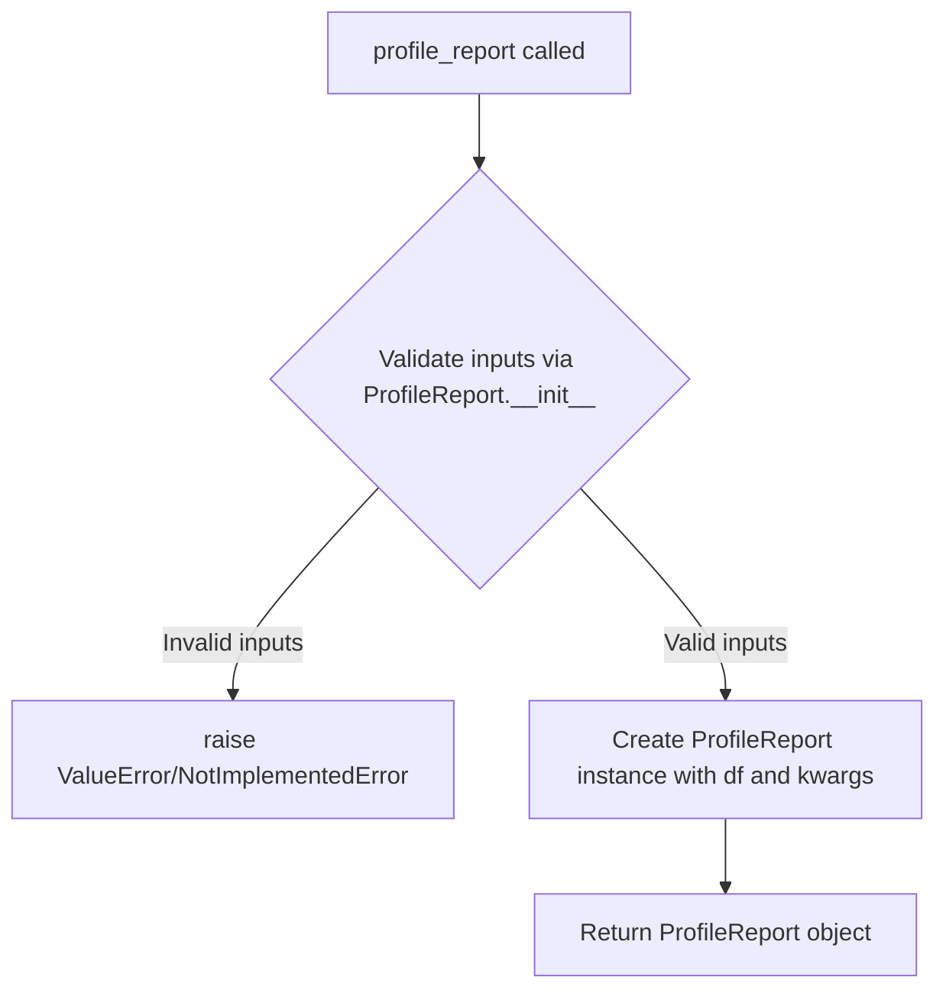

# `pandas_decorator.py`

## `src.ydata_profiling.controller.pandas_decorator.profile_report` · *function*

## Summary:
Creates a ProfileReport object from a pandas DataFrame with optional configuration parameters.

## Description:
This function serves as a simplified entry point for creating a ProfileReport instance. It encapsulates the instantiation logic for the ProfileReport class, allowing users to quickly generate profiling reports from pandas DataFrames with various configuration options. The function acts as a thin wrapper around the ProfileReport constructor, providing a clean interface for report generation.

This decorator-style function extracts the core instantiation logic into a separate utility, promoting code reuse and simplifying the API for common use cases. Instead of requiring users to directly instantiate ProfileReport, this function provides a more accessible entry point.

## Args:
    df (DataFrame): A pandas DataFrame containing the data to be profiled.
    **kwargs: Additional keyword arguments passed directly to the ProfileReport constructor for configuration. Common parameters include:
        - minimal (bool): Enable minimal mode for faster profiling
        - tsmode (bool): Enable time series mode
        - sortby (str): Column name to sort by in time series mode
        - sensitive (bool): Enable sensitive data detection
        - explorative (bool): Enable explorative mode
        - dark_mode (bool): Enable dark mode for HTML reports
        - orange_mode (bool): Enable orange mode for HTML reports
        - config_file (str): Path to YAML configuration file
        - lazy (bool): Enable lazy evaluation
        - sample (dict): Sample configuration
        - typeset (VisionsTypeset): Custom typeset
        - summarizer (BaseSummarizer): Custom summarizer
        - config (Settings): Direct Settings object
        - type_schema (dict): Type schema configuration

## Returns:
    ProfileReport: An initialized ProfileReport object ready for analysis or rendering.

## Raises:
    ValueError: If invalid combinations of arguments are provided (e.g., empty DataFrame, conflicting parameters like config_file and minimal=True).
    NotImplementedError: If time-series mode is used with Spark DataFrames.

## Constraints:
    Preconditions:
    - The input DataFrame must not be empty (unless in lazy mode)
    - When using config_file, minimal cannot also be True
    - When using time-series mode with Spark DataFrames, an error is raised
    
    Postconditions:
    - A valid ProfileReport object is returned
    - The object is properly initialized with the provided DataFrame and configuration

## Side Effects:
    None

## Control Flow:


## Examples:
```python
import pandas as pd
from ydata_profiling import profile_report

# Basic usage
df = pd.DataFrame({'A': [1, 2, 3], 'B': [4, 5, 6]})
report = profile_report(df)

# With configuration
report = profile_report(df, minimal=True, dark_mode=True)

# With time series mode
report = profile_report(df, tsmode=True, sortby='date_column')
```

