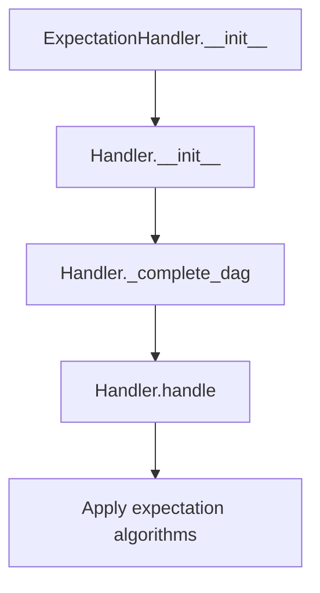
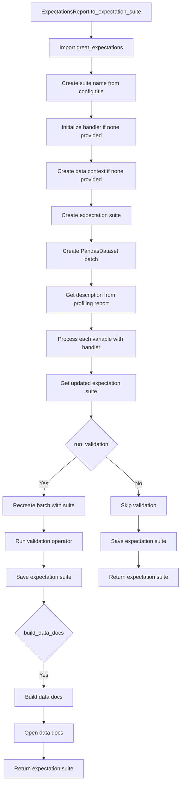

# `expectations_report.py`

## `src.ydata_profiling.expectations_report.ExpectationHandler` · *class*

## Summary:
Handles the application of Great Expectations to different data types by mapping data type categories to appropriate expectation algorithms.

## Description:
The ExpectationHandler class serves as a specialized handler that bridges data type categorization with Great Expectations validation algorithms. It is designed to automatically select and apply the most appropriate expectations based on the detected data type of columns in a dataset. This class is instantiated by the profiling system when generating expectations reports and is responsible for ensuring that domain-appropriate validations are applied to different data categories.

## State:
- mapping: Dictionary mapping data type strings to lists of expectation algorithm functions. This is initialized with specific mappings for various data types including "Unsupported", "Text", "Categorical", "Boolean", "Numeric", "URL", "File", "Path", "DateTime", and "Image". The mapping is processed by the parent Handler class to incorporate type relationships.
- typeset: A VisionsTypeset instance that provides the type hierarchy and relationships for data type inference and transformation.

## Lifecycle:
- Creation: Instances are created by passing a VisionsTypeset object to the constructor. The constructor initializes the mapping of data types to expectation algorithms and calls the parent Handler's initialization, which processes the mapping through `_complete_dag()` to incorporate type relationships.
- Usage: Typically used through the handle() method inherited from Handler, which applies the appropriate expectation algorithms based on data type.
- Destruction: No special cleanup is required as it inherits standard Python object lifecycle management.

## Method Map:


## Raises:
- No explicit exceptions are raised by the __init__ method beyond those potentially raised by the parent Handler class initialization.

## Example:
```python
# Create a typeset (typically done by the profiling system)
typeset = VisionsTypeset(...)

# Instantiate the handler
handler = ExpectationHandler(typeset)

# Apply expectations to a column (typically done internally by the profiler)
result = handler.handle("Numeric", column_name, summary_dict, batch)
```

### `src.ydata_profiling.expectations_report.ExpectationHandler.__init__` · *method*

## Summary:
Initializes the ExpectationHandler with a type mapping for generating Great Expectations tests based on data types.

## Description:
This method sets up the expectation handler by creating a mapping between data types and their corresponding expectation algorithms. It inherits from the base Handler class and configures the mapping to ensure appropriate expectations are generated for different data type categories. The mapping defines which expectation algorithms should be applied to each data type, enabling automated generation of data quality tests. The method also processes the mapping through `_complete_dag()` to incorporate type relationships defined in the typeset's base graph.

## Args:
    typeset (VisionsTypeset): The typeset used to determine data types and their relationships
    *args: Additional positional arguments passed to the parent Handler class
    **kwargs: Additional keyword arguments passed to the parent Handler class

## Returns:
    None: This method initializes the object and does not return a value

## Raises:
    None explicitly raised, though parent class may raise exceptions

## State Changes:
    Attributes READ: None
    Attributes WRITTEN: 
    - self.mapping: Set to the type-specific expectation algorithm mappings, then updated by _complete_dag()
    - self.typeset: Set to the provided typeset instance

## Constraints:
    Preconditions:
    - typeset must be a valid VisionsTypeset instance
    - The typeset should contain the expected data type categories referenced in the mapping
    
    Postconditions:
    - self.mapping contains the complete expectation algorithm mappings for all supported data types
    - self.typeset is properly assigned to the provided typeset instance
    - The mapping is processed through _complete_dag() to incorporate type relationships from the typeset's base graph

## Side Effects:
    None: This method performs no I/O operations or external service calls

## `src.ydata_profiling.expectations_report.ExpectationsReport` · *class*

## Summary:
A class that generates Great Expectations validation suites from profiling reports by applying type-specific expectation algorithms to dataset variables.

## Description:
The ExpectationsReport class serves as the bridge between data profiling results and Great Expectations validation frameworks. It transforms statistical summaries and data type information from a profiling report into executable expectation suites that can validate data quality and consistency. This class is typically instantiated by the profiling system when users request expectation-based validation reports.

## State:
- config: Settings object containing configuration parameters including title used for naming expectation suites
- df: Optional pandas DataFrame representing the dataset being profiled and validated
- typeset: Property that returns None (placeholder for future implementation or external typeset integration)

## Lifecycle:
- Creation: Instantiated with a configuration object; requires a valid Settings instance and optionally a DataFrame
- Usage: Typically called via the to_expectation_suite() method which orchestrates the full process of expectation generation, validation, and documentation building
- Destruction: Standard Python object lifecycle management; no special cleanup required

## Method Map:


## Raises:
- ImportError: Raised when great_expectations is not installed in the environment
- Various exceptions may be raised by underlying Great Expectations operations during suite creation, validation, or documentation building

## Example:
```python
# Assuming a ProfileReport instance exists
report = ProfileReport(df, config=settings)

# Generate expectation suite
suite = report.expectations.to_expectation_suite(
    suite_name="my_data_suite",
    save_suite=True,
    run_validation=True,
    build_data_docs=True
)
```

### `src.ydata_profiling.expectations_report.ExpectationsReport.typeset` · *method*

## Summary:
Returns the Visions typeset associated with the expectations report, or None if not available.

## Description:
This method provides access to the VisionsTypeset object that defines the data types for the dataset being analyzed. It serves as a getter for the internal typeset attribute, which is populated during the initialization or processing of the expectations report. This property allows external components to access the type information without directly accessing internal attributes.

Known callers:
- ExpectationsReport.to_expectation_suite: Called during the creation of expectation suites to determine appropriate type handling for variables
- The method is part of the property interface for accessing type information in the expectations report

This logic is implemented as a property rather than being inlined because it provides a clean abstraction layer for accessing type information, maintains consistency with Python property patterns, and allows for future extension without breaking existing code.

## Args:
    None

## Returns:
    Optional[VisionsTypeset]: The VisionsTypeset object containing type information for the dataset, or None if no typeset has been defined.

## Raises:
    None

## State Changes:
    Attributes READ: self._typeset
    Attributes WRITTEN: None

## Constraints:
    Preconditions: The ExpectationsReport instance must be properly initialized
    Postconditions: The returned value is either a VisionsTypeset object or None

## Side Effects:
    None

### `src.ydata_profiling.expectations_report.ExpectationsReport.to_expectation_suite` · *method*

## Summary:
Converts a profiling report into a Great Expectations validation suite with optional validation and documentation generation.

## Description:
Transforms the statistical summary and type information from a profiling report into a structured Great Expectations expectation suite. This method orchestrates the creation of validation rules for each column based on its inferred data type and statistical properties, then optionally executes validation and generates documentation.

The method is designed as a standalone interface for converting profiling insights into executable validation logic. It encapsulates the entire workflow from expectation suite creation to result reporting, making it easy to integrate profiling findings with Great Expectations validation pipelines.

## Args:
    suite_name (Optional[str]): Name for the expectation suite. Defaults to a slugified version of the report title.
    data_context (Optional[Any]): Great Expectations data context instance. Creates a default DataContext if not provided.
    save_suite (bool): Whether to persist the expectation suite to disk. Defaults to True.
    run_validation (bool): Whether to execute validation against the original dataset. Defaults to True.
    build_data_docs (bool): Whether to generate and open data documentation. Defaults to True.
    handler (Optional[Handler]): Custom expectation handler. Uses default ExpectationHandler if not provided.

## Returns:
    Any: The final expectation suite object containing all generated expectations.

## Raises:
    ImportError: When great_expectations is not installed in the environment.

## State Changes:
    Attributes READ: self.config.title, self.typeset, self.df, self.get_description()
    Attributes WRITTEN: None (modifies external objects via Great Expectations API)

## Constraints:
    Preconditions: 
    - The ExpectationsReport must have a valid configuration with a title
    - The dataframe must be accessible via self.df
    - Great Expectations must be installed in the environment
    Postconditions:
    - An expectation suite is created and optionally saved
    - Validation results may be generated and stored
    - Data documentation may be built and opened

## Side Effects:
    - Creates and modifies files in the Great Expectations data context directory
    - Executes validation operations against the original dataset
    - Opens browser windows for data documentation (when build_data_docs=True)
    - May modify the global Great Expectations configuration

