# `alerts.py`

## `src.ydata_profiling.model.alerts.fmt_percent` · *function*

## Summary:
Formats a floating-point probability value into a human-readable percentage string with special handling for edge cases near 0% and 100%.

## Description:
This function converts a decimal probability value (between 0 and 1) into a formatted percentage string. It provides special formatting for values very close to 0% and 100% to improve readability by displaying them as "< 0.1%" and "> 99.9%" respectively. This function is typically used in data profiling reports to display statistical measures like missing value percentages or correlation strengths in a user-friendly manner.

## Args:
    value (float): The decimal probability value to format (must be between 0 and 1 inclusive)
    edge_cases (bool): Flag to enable special formatting for values near 0% and 100%. Defaults to True.

## Returns:
    str: Formatted percentage string. Returns "< 0.1%" for values that round to 0 but are greater than 0, "> 99.9%" for values that round to 1 but are less than 1, and standard formatted percentage otherwise.

## Raises:
    None explicitly raised

## Constraints:
    Preconditions:
        - The input value should be a float between 0 and 1 inclusive
        - When edge_cases=True, the function applies special rounding logic to detect values near boundaries
        
    Postconditions:
        - Always returns a string representation of the percentage
        - Special edge case handling only applies when edge_cases=True

## Side Effects:
    None

## Control Flow:
```mermaid
flowchart TD
    A[Start fmt_percent] --> B{edge_cases AND round(value,3)==0 AND value>0?}
    B -- Yes --> C[Return "< 0.1%"]
    B -- No --> D{edge_cases AND round(value,3)==1 AND value<1?}
    D -- Yes --> E[Return "> 99.9%"]
    D -- No --> F[Return "{value*100:2.1f}%"]
```

## Examples:
    >>> fmt_percent(0.0005)
    '< 0.1%'
    >>> fmt_percent(0.9995)
    '> 99.9%'
    >>> fmt_percent(0.5)
    '50.0%'
    >>> fmt_percent(0.0005, edge_cases=False)
    '0.1%'
```

## `src.ydata_profiling.model.alerts.AlertType` · *class*

## Summary:
An enumeration defining various alert types used for data profiling and quality assessment.

## Description:
The AlertType enum serves as a standardized classification system for different types of data quality issues or anomalies detected during profiling. It provides a centralized way to represent and handle various alert categories that may arise when analyzing datasets. This abstraction allows the system to consistently categorize findings and enables downstream processing based on alert type.

## State:
- CONSTANT: Represents alerts for constant value columns
- ZEROS: Represents alerts for columns containing only zero values
- HIGH_CORRELATION: Represents alerts for highly correlated columns
- HIGH_CARDINALITY: Represents alerts for columns with high cardinality
- UNSUPPORTED: Represents alerts for unsupported data types
- DUPLICATES: Represents alerts for duplicate rows or values
- SKEWED: Represents alerts for skewed distributions
- IMBALANCE: Represents alerts for imbalanced class distributions
- MISSING: Represents alerts for missing data patterns
- INFINITE: Represents alerts for infinite or NaN values
- TYPE_DATE: Represents alerts related to date type parsing issues
- UNIQUE: Represents alerts for unique value patterns
- CONSTANT_LENGTH: Represents alerts for constant string/sequence lengths
- REJECTED: Represents alerts for rejected data entries
- UNIFORM: Represents alerts for uniform distribution patterns
- NON_STATIONARY: Represents alerts for non-stationary time series data
- SEASONAL: Represents alerts for seasonal patterns in time series
- EMPTY: Represents alerts for completely empty datasets or columns

## Lifecycle:
- Creation: Instantiated automatically as part of the Enum definition; no explicit instantiation required
- Usage: Used as constants throughout the profiling system to categorize alerts
- Destruction: Managed by Python's garbage collection; no explicit cleanup needed

## Method Map:
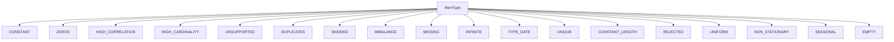

## Raises:
- No exceptions are raised during initialization as this is a standard Enum class

## Example:
```python
# Using alert types in code
alert_type = AlertType.HIGH_CORRELATION
if alert_type == AlertType.MISSING:
    # Handle missing data alert
    pass
```

## `src.ydata_profiling.model.alerts.Alert` · *class*

## Summary:
Represents a data quality alert or issue detected during profiling, encapsulating type, context, and metadata about the alert.

## Description:
The Alert class serves as a standardized container for representing data quality issues or anomalies discovered during dataset profiling. It provides a unified interface for storing alert information such as alert type, associated column names, related fields, and contextual values. The class is designed to be lightweight and focused solely on representing alert data, making it easy to process and display alerts in various contexts like reports or dashboards.

## State:
- fields: Set[str], optional set of related field names associated with the alert
- alert_type: AlertType, the categorized type of alert being represented
- values: Dict[str, Any], additional contextual data specific to the alert type
- column_name: str, optional name of the column that triggered the alert
- _is_empty: bool, internal flag indicating if the alert represents an empty state
- _anchor_id: str, cached identifier for linking alert elements in UI components

## Lifecycle:
- Creation: Instantiate with alert_type and optional parameters; fields defaults to empty set, values defaults to empty dict
- Usage: Access properties like alert_type_name, anchor_id, and fmt() for display formatting; use __repr__() for string representation
- Destruction: Managed by Python's garbage collection; no explicit cleanup required

## Method Map:
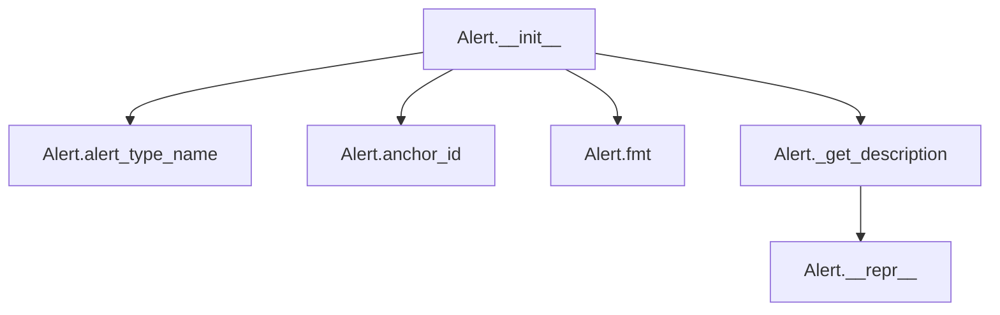

## Raises:
- No explicit exceptions raised during initialization

## Example:
```python
# Create an alert for high correlation
from ydata_profiling.model.alerts import Alert, AlertType

alert = Alert(
    alert_type=AlertType.HIGH_CORRELATION,
    column_name="feature_a",
    values={
        "fields": ["feature_b", "feature_c"],
        "corr": "positive"
    }
)

# Display formatted alert
print(alert.fmt())  # Output: '<abbr title="This variable has a high positive correlation with 2 fields: feature_b, feature_c">HIGH CORRELATION</abbr>'
print(repr(alert))  # Output: '[HIGH_CORRELATION] alert on column feature_a'
```

### `src.ydata_profiling.model.alerts.Alert.__init__` · *method*

## Summary:
Initializes an Alert object with specified type, values, column name, fields, and empty status.

## Description:
The Alert class constructor creates an instance with configurable properties for representing data quality alerts. This method serves as the primary entry point for creating Alert instances and sets up the initial state of the alert object.

## Args:
    alert_type (AlertType): The type of alert being created, defining the nature of the data quality issue.
    values (Optional[Dict], optional): Dictionary containing additional values or metadata associated with the alert. Defaults to None.
    column_name (Optional[str], optional): Name of the column related to this alert. Defaults to None.
    fields (Optional[Set], optional): Set of fields involved in this alert. Defaults to None.
    is_empty (bool, optional): Flag indicating whether the alert represents an empty state. Defaults to False.

## Returns:
    None: This method initializes the object's attributes and does not return a value.

## Raises:
    None: This method does not explicitly raise any exceptions.

## State Changes:
    Attributes READ: No attributes are read from the instance.
    Attributes WRITTEN: 
    - self.fields: Set to the provided fields parameter or an empty set if None
    - self.alert_type: Set to the provided alert_type parameter
    - self.values: Set to the provided values parameter or an empty dict if None
    - self.column_name: Set to the provided column_name parameter
    - self._is_empty: Set to the provided is_empty parameter

## Constraints:
    Preconditions: 
    - alert_type must be a valid AlertType enum value
    - fields must be a set or None
    - values must be a dictionary or None
    
    Postconditions:
    - All instance attributes are properly initialized
    - self.fields is always a set
    - self.values is always a dictionary

## Side Effects:
    None: This method performs no I/O operations or external service calls.

### `src.ydata_profiling.model.alerts.Alert.alert_type_name` · *method*

## Summary:
Returns a human-readable formatted version of the alert type name by converting snake_case to title case.

## Description:
This property method transforms the internal enum name representation of an alert type into a more readable format suitable for display purposes. It processes the alert type's name attribute by replacing underscores with spaces, converting to lowercase, and then applying title casing to create a clean, capitalized word.

## Args:
    None

## Returns:
    str: A formatted string representation of the alert type name with spaces instead of underscores, all lowercase except for the first letter of each word.

## Raises:
    None

## State Changes:
    Attributes READ: self.alert_type.name
    Attributes WRITTEN: None

## Constraints:
    Preconditions: The alert_type attribute must be a valid AlertType enum member
    Postconditions: The returned string will always be properly formatted with spaces and title case capitalization

## Side Effects:
    None

### `src.ydata_profiling.model.alerts.Alert.anchor_id` · *method*

## Summary:
Returns the anchor ID for an alert, generating it from the column name if not already set.

## Description:
This method provides a stable identifier for alerts that can be used for linking or referencing. It implements a lazy initialization pattern where the anchor ID is computed once and cached. The anchor ID is derived from hashing the column name, ensuring consistency across invocations. This approach avoids recomputing the hash on subsequent calls.

## Args:
    None

## Returns:
    Optional[str]: A string representation of the anchor ID, or None if the column name is None.

## Raises:
    None

## State Changes:
    Attributes READ: self.column_name, self._anchor_id
    Attributes WRITTEN: self._anchor_id (only when initially set)

## Constraints:
    Preconditions: The Alert instance must have a valid column_name attribute.
    Postconditions: After first invocation, self._anchor_id will be set to a string value derived from the column name hash.

## Side Effects:
    None

### `src.ydata_profiling.model.alerts.Alert.fmt` · *method*

## Summary:
Formats the alert type name for display, with special handling for high correlation alerts to include detailed correlation information in a tooltip.

## Description:
This method transforms the alert type name into a user-friendly string representation. For high correlation alerts, it enhances the display by embedding detailed correlation information within an HTML abbr tag tooltip. This method is part of the Alert class's formatting logic and is typically called when rendering alerts in reports or UI components.

## Args:
    self: The Alert instance being formatted.

## Returns:
    str: A formatted string representation of the alert type name. For high correlation alerts, returns an HTML abbr tag with detailed correlation information as the title attribute.

## Raises:
    None explicitly raised.

## State Changes:
    Attributes READ: self.alert_type.name, self.values
    Attributes WRITTEN: None

## Constraints:
    Preconditions: 
    - self.alert_type must be an AlertType enum with a name attribute
    - self.values should be either None or a dictionary containing "fields" and "corr" keys for high correlation alerts
    Postconditions:
    - Returns a string representation of the alert type name
    - For high correlation alerts, the returned string contains HTML markup

## Side Effects:
    None.

### `src.ydata_profiling.model.alerts.Alert._get_description` · *method*

## Summary:
Returns a formatted string describing the alert type and associated column name.

## Description:
This method constructs a human-readable description of an alert by combining the alert type name and the column name it relates to. It is used primarily for display purposes in reporting or logging contexts. The method is called internally by the `__repr__` method to provide a string representation of the Alert instance.

## Args:
    None

## Returns:
    str: A formatted string in the pattern "[ALERT_TYPE] alert on column COLUMN_NAME"

## Raises:
    None

## State Changes:
    Attributes READ: self.alert_type.name, self.column_name
    Attributes WRITTEN: None

## Constraints:
    Preconditions: The alert_type attribute must be an enum with a .name property, and column_name must be a string or None.
    Postconditions: The returned string follows a consistent format for alert identification.

## Side Effects:
    None

### `src.ydata_profiling.model.alerts.Alert.__repr__` · *method*

## Summary:
Returns a string representation of the alert describing its type and associated column.

## Description:
The `__repr__` method provides a human-readable string representation of an Alert instance. It is automatically invoked when the object is printed, converted to a string, or displayed in interactive environments. This method delegates to the `_get_description` method to generate a formatted description that varies based on the specific alert type and column name.

## Args:
    None

## Returns:
    str: A formatted string describing the alert type and column name. For base Alert instances, this follows the pattern "[ALERT_TYPE] alert on column COLUMN_NAME". Specific alert subclasses may provide more detailed descriptions.

## Raises:
    None

## State Changes:
    Attributes READ: 
    - self.alert_type.name
    - self.column_name

## Constraints:
    Preconditions:
    - The alert instance must have been initialized with a valid alert_type and column_name.
    - The alert_type.name should be a valid string representation of the alert type enum.

    Postconditions:
    - The returned string follows a consistent format for all Alert instances.
    - The method does not modify any instance attributes.

## Side Effects:
    None

## `src.ydata_profiling.model.alerts.ConstantLengthAlert` · *class*

## Summary:
Represents a data quality alert for columns with constant length values.

## Description:
The ConstantLengthAlert class is a specialized alert type used to identify columns where all entries maintain identical length. This alert is part of the data profiling system's capability to detect uniform string lengths, fixed-width fields, or sequences of identical length in datasets.

As a subclass of Alert, it inherits the fundamental structure for representing data quality issues while implementing the specific behavior for constant-length detection. The alert type CONSTANT_LENGTH is defined in the AlertType enumeration and indicates that a column's values all share the same character or element count.

## State:
- fields: Set[str], set containing {"composition_min_length", "composition_max_length"} indicating related fields
- alert_type: AlertType.CONSTANT_LENGTH, the categorized type of alert being represented
- values: Dict[str, Any], additional contextual data specific to the alert type
- column_name: str, optional name of the column that triggered the alert
- _is_empty: bool, internal flag indicating if the alert represents an empty state
- _anchor_id: str, cached identifier for linking alert elements in UI components

## Lifecycle:
- Creation: Instantiate with optional column_name, values, and is_empty parameters; automatically sets alert_type to CONSTANT_LENGTH
- Usage: Access properties inherited from Alert parent class (alert_type_name, anchor_id, fmt()); call _get_description() for formatted alert text
- Destruction: Managed by Python's garbage collection; no explicit cleanup required

## Method Map:
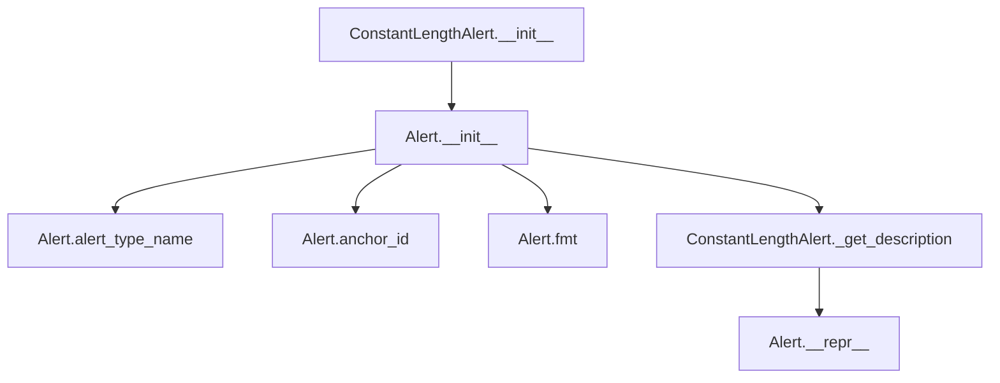

## Raises:
- No explicit exceptions raised during initialization

## Example:
```python
# Create a constant length alert for a column named "product_code"
alert = ConstantLengthAlert(
    column_name="product_code",
    values={
        "composition_min_length": 8,
        "composition_max_length": 8
    }
)

# Get formatted description
description = alert._get_description()  # Returns "[product_code] has a constant length"

# Format for display
formatted_alert = alert.fmt()  # Returns HTML-formatted alert string
```

### `src.ydata_profiling.model.alerts.ConstantLengthAlert.__init__` · *method*

## Summary:
Initializes a ConstantLengthAlert instance with specific alert type and field configuration.

## Description:
Configures a ConstantLengthAlert object to represent data quality issues related to constant string or sequence lengths in columns. This method sets up the alert with the appropriate alert type identifier, field specifications, and metadata about the column being analyzed.

## Args:
    values (Optional[Dict], default: None): Dictionary containing alert-specific data values
    column_name (Optional[str], default: None): Name of the column that triggered this alert
    is_empty (bool, default: False): Flag indicating if the alert relates to empty data

## Returns:
    None: This method initializes the object's state but does not return a value

## Raises:
    No explicit exceptions are raised by this method

## State Changes:
    Attributes READ: None
    Attributes WRITTEN: 
    - self.fields: Set containing {"composition_min_length", "composition_max_length"}
    - self.alert_type: Set to AlertType.CONSTANT_LENGTH
    - self.values: Assigned the provided values parameter
    - self.column_name: Assigned the provided column_name parameter
    - self._is_empty: Assigned the provided is_empty parameter

## Constraints:
    Preconditions:
    - The parent Alert class constructor must accept the provided parameters
    - AlertType.CONSTANT_LENGTH must be a valid enum value
    - Fields set must contain the required composition_min_length and composition_max_length keys
    
    Postconditions:
    - The alert object will have its alert_type properly set to CONSTANT_LENGTH
    - The fields attribute will contain exactly the two required composition fields
    - All provided parameters will be stored in their respective instance attributes

## Side Effects:
    None: This method performs no I/O operations or external service calls

### `src.ydata_profiling.model.alerts.ConstantLengthAlert._get_description` · *method*

## Summary:
Returns a human-readable description string indicating that a column has a constant length.

## Description:
This method generates a descriptive message for a ConstantLengthAlert, identifying the column that exhibits uniform length across all its entries. It is part of the Alert base class hierarchy and provides a standardized way to represent alert descriptions for data quality issues.

The method is specifically designed to be overridden by subclasses to provide context-specific descriptions while maintaining a consistent interface. In the case of ConstantLengthAlert, it focuses on communicating that a particular column maintains identical length values throughout all rows.

## Args:
    None

## Returns:
    str: A formatted string describing the alert, following the pattern "[column_name] has a constant length"

## Raises:
    None

## State Changes:
    Attributes READ: self.column_name
    Attributes WRITTEN: None

## Constraints:
    Preconditions:
    - The method assumes self.column_name is properly initialized and contains a valid column name string
    - The method does not validate the actual length consistency of the column data - this validation occurs at the alert creation level
    
    Postconditions:
    - The returned string follows a consistent format for all ConstantLengthAlert instances
    - The returned string is suitable for display in user interfaces or reports

## Side Effects:
    None

## `src.ydata_profiling.model.alerts.ConstantAlert` · *class*

## Summary:
Represents an alert for columns containing constant values during data profiling.

## Description:
The ConstantAlert class is a specialized alert type that identifies columns in a dataset where all values are identical. This alert is particularly useful for detecting uninformative features that may negatively impact machine learning models or data analysis workflows. The class extends the base Alert class to provide specific functionality for constant value detection.

## State:
- Inherits all attributes from Alert parent class:
  - alert_type: AlertType.CONSTANT (fixed value)
  - values: Optional[Dict], additional contextual data (default: None)
  - column_name: Optional[str], name of the column with constant values (default: None)
  - fields: Set[str], related field names (fixed to {"n_distinct"})
  - _is_empty: bool, indicates if alert represents empty state (default: False)
  - _anchor_id: str, cached identifier for UI linking (inherited)

## Lifecycle:
- Creation: Instantiate with optional values, column_name, and is_empty parameters
- Usage: Access alert_type_name, anchor_id, and fmt() for display formatting; use __repr__() for string representation
- Destruction: Managed by Python's garbage collection; no explicit cleanup required

## Method Map:


## Raises:
- No explicit exceptions raised during initialization

## Example:
```python
# Create a constant alert for a column named "status"
alert = ConstantAlert(
    column_name="status",
    values={"n_distinct": 1}
)

# Display formatted alert
print(alert.fmt())  # Output: '<abbr title="This variable has a constant value">CONSTANT</abbr>'
print(repr(alert))  # Output: '[CONSTANT] alert on column status'
```

### `src.ydata_profiling.model.alerts.ConstantAlert.__init__` · *method*

## Summary:
Initializes a ConstantAlert instance with specified properties, setting its alert type to CONSTANT and configuring associated metadata fields.

## Description:
The ConstantAlert constructor creates an alert instance specifically for identifying columns with constant values during data profiling. It inherits from the base Alert class and configures the alert with the CONSTANT alert type, ensuring proper field tracking for distinct value counts. This method centralizes the initialization logic for constant value alerts, making it reusable and maintaining consistency with the Alert base class interface.

## Args:
    values (Optional[Dict], default: None): Dictionary containing alert-specific data, such as statistical values or metadata about the constant column
    column_name (Optional[str], default: None): Name of the column that triggered this alert
    is_empty (bool, default: False): Boolean flag indicating whether the dataset or column is empty

## Returns:
    None: This method initializes the object's state and does not return a value

## Raises:
    No explicit exceptions are raised by this method; any exceptions would originate from the parent Alert.__init__ method

## State Changes:
    Attributes READ: None
    Attributes WRITTEN: 
    - self.fields: Set containing {"n_distinct"} to track distinct value count fields
    - self.alert_type: Set to AlertType.CONSTANT
    - self.values: Assigned the provided values parameter or defaults to empty dict
    - self.column_name: Assigned the provided column_name parameter or defaults to None
    - self._is_empty: Assigned the provided is_empty parameter

## Constraints:
    Preconditions:
    - The alert_type parameter in the parent call must be AlertType.CONSTANT
    - The fields parameter must contain "n_distinct" to properly track constant value analysis
    - All parameters should be of the expected types (Dict for values, str for column_name, bool for is_empty)

    Postconditions:
    - The alert instance will have its alert_type property set to AlertType.CONSTANT
    - The fields attribute will contain exactly {"n_distinct"}
    - The values and column_name attributes will be initialized with provided parameters or defaults

## Side Effects:
    None: This method performs no I/O operations, external service calls, or mutations to objects outside self

### `src.ydata_profiling.model.alerts.ConstantAlert._get_description` · *method*

## Summary:
Returns a formatted string describing a column with a constant value alert.

## Description:
This method generates a human-readable description indicating that a specific column contains only a single unique value throughout all rows. It is part of the ConstantAlert class which represents alerts for columns with constant values in data profiling reports.

## Args:
    self: The ConstantAlert instance containing the column_name attribute.

## Returns:
    str: A formatted string in the pattern "[column_name] has a constant value" where column_name is the name of the column identified as having constant values.

## Raises:
    None: This method does not raise any exceptions.

## State Changes:
    Attributes READ: self.column_name
    Attributes WRITTEN: None

## Constraints:
    Preconditions: The self.column_name attribute must be set to a valid string value before calling this method.
    Postconditions: The returned string follows a consistent format for constant value alerts.

## Side Effects:
    None: This method performs no I/O operations or external service calls. It only returns a formatted string based on internal state.

## `src.ydata_profiling.model.alerts.DuplicatesAlert` · *class*

## Summary:
Represents an alert for detecting duplicate rows in a dataset during data profiling.

## Description:
The DuplicatesAlert class is a specialized alert type used to identify and report duplicate rows within a dataset. It extends the base Alert class to provide specific functionality for handling duplicate data detection. This class is typically instantiated by the data profiling system when duplicate rows are detected, providing detailed information about the extent of duplication in terms of count and percentage.

## State:
- values: Dict[str, Any], optional dictionary containing duplicate statistics with keys 'n_duplicates' (number of duplicates) and 'p_duplicates' (percentage of duplicates)
- column_name: str, optional name of the column that triggered the alert (though duplicates are typically detected at the dataset level)
- is_empty: bool, flag indicating if the alert represents an empty state (defaults to False)

## Lifecycle:
- Creation: Instantiate with optional values, column_name, and is_empty parameters; automatically sets alert_type to AlertType.DUPLICATES
- Usage: Call _get_description() to retrieve formatted description of duplicate findings
- Destruction: Managed by Python's garbage collection; no explicit cleanup required

## Method Map:
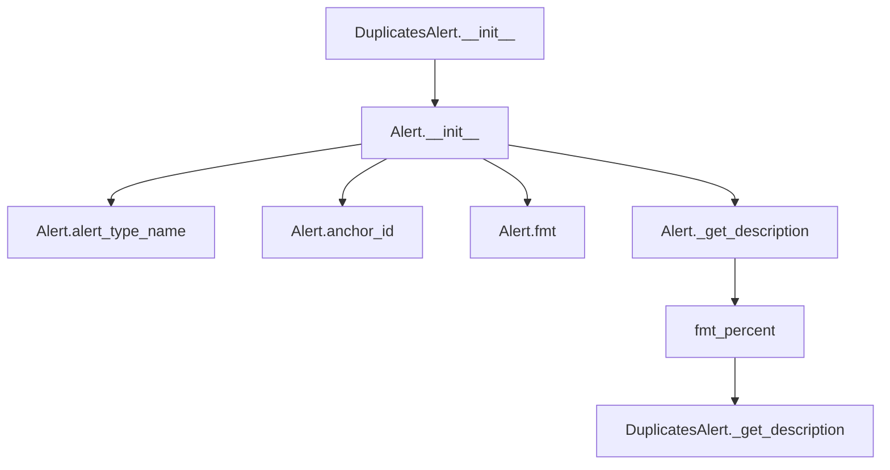

## Raises:
- No explicit exceptions raised during initialization

## Example:
```python
# Create a duplicates alert with detailed statistics
alert = DuplicatesAlert(
    values={
        "n_duplicates": 150,
        "p_duplicates": 0.15
    },
    column_name="user_id"
)

# Get formatted description
description = alert._get_description()
# Returns: "Dataset has 150 (15.0%) duplicate rows"

# Create a general duplicates alert without statistics
general_alert = DuplicatesAlert()
description = general_alert._get_description()
# Returns: "Dataset has duplicated values"
```

### `src.ydata_profiling.model.alerts.DuplicatesAlert.__init__` · *method*

## Summary:
Initializes a DuplicatesAlert instance, setting up the alert with type DUPLICATES and configuring its associated metadata fields.

## Description:
The DuplicatesAlert.__init__ method serves as the constructor for creating duplicate detection alerts within the data profiling system. It extends the base Alert class to specifically handle duplicate row or value detection scenarios. This method is called during the instantiation of DuplicatesAlert objects, typically when duplicate analysis is performed on datasets or columns during the profiling process.

## Args:
    values (Optional[Dict], default: None): Dictionary containing duplicate-related statistics such as count and percentage
    column_name (Optional[str], default: None): Name of the column being analyzed for duplicates
    is_empty (bool, default: False): Flag indicating whether the dataset/column is empty

## Returns:
    None: This method initializes the object's state but does not return a value

## Raises:
    No explicit exceptions are raised by this method

## State Changes:
    Attributes READ: None
    Attributes WRITTEN: 
    - self.fields: Set containing {"n_duplicates"}
    - self.alert_type: Set to AlertType.DUPLICATES (enumeration constant)
    - self.values: Set to the provided values parameter
    - self.column_name: Set to the provided column_name parameter
    - self._is_empty: Set to the provided is_empty parameter

## Constraints:
    Preconditions:
    - The AlertType.DUPLICATES constant must be properly defined in the AlertType enum
    - The parent Alert class must be properly initialized with the required parameters
    
    Postconditions:
    - The alert instance will have its alert_type attribute set to DUPLICATES
    - The fields attribute will contain exactly {"n_duplicates"}
    - All provided parameters will be stored in their respective instance attributes

## Side Effects:
    None: This method performs no I/O operations or external service calls

### `src.ydata_profiling.model.alerts.DuplicatesAlert._get_description` · *method*

## Summary:
Returns a human-readable description of duplicate row counts in a dataset, with optional percentage formatting.

## Description:
Generates a descriptive string indicating the number and percentage of duplicate rows in a dataset. This method is part of the DuplicatesAlert class and provides a formatted message for reporting duplicate data findings. The method handles two cases: when detailed duplicate statistics are available (including count and percentage) versus when only general duplication information is present.

## Args:
    None explicitly required (uses self)

## Returns:
    str: A formatted description string describing duplicate rows. When detailed statistics are available, returns a string like "Dataset has X (Y%) duplicate rows". When only general duplication info is available, returns "Dataset has duplicated values".

## Raises:
    None explicitly raised

## State Changes:
    Attributes READ: self.values

## Constraints:
    Preconditions:
        - self.values should be either None or a dictionary containing 'n_duplicates' and 'p_duplicates' keys when not None
        - When self.values is not None, 'p_duplicates' should be a numeric value between 0 and 1 representing a probability/percentage
        
    Postconditions:
        - Always returns a string describing duplicate rows
        - The returned string follows a consistent format pattern

## Side Effects:
    None

## `src.ydata_profiling.model.alerts.EmptyAlert` · *class*

## Summary:
Represents an alert indicating that a dataset or column is completely empty.

## Description:
The EmptyAlert class is a specialized subclass of Alert designed to signal when a dataset or specific column contains no data. It inherits from the base Alert class and implements the required interface for empty dataset detection. This alert type is particularly useful in data profiling workflows where identifying completely empty datasets or columns is important for data quality assessment.

## State:
- Inherits all attributes from Alert parent class:
  - fields: Set[str], defaults to {"n"} (indicates the count field)
  - alert_type: AlertType, set to AlertType.EMPTY (constant)
  - values: Dict[str, Any], optional contextual data (defaults to None)
  - column_name: str, optional column name that triggered the alert (defaults to None)
  - _is_empty: bool, internal flag indicating empty state (set to is_empty parameter)
  - _anchor_id: str, cached identifier for UI linking (inherited)

## Lifecycle:
- Creation: Instantiate with optional values, column_name, and is_empty parameters
- Usage: Access inherited properties like alert_type_name, anchor_id, and fmt() for display formatting
- Destruction: Managed by Python's garbage collection; no explicit cleanup required

## Method Map:
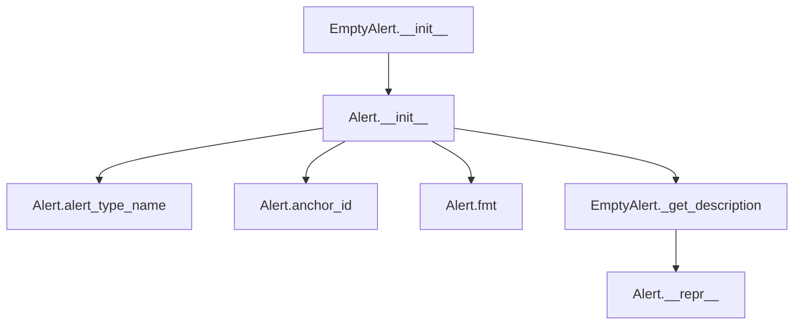

## Raises:
- No explicit exceptions raised during initialization

## Example:
```python
# Create an empty dataset alert
from ydata_profiling.model.alerts import EmptyAlert

alert = EmptyAlert(
    values={"count": 0},
    column_name="empty_column",
    is_empty=True
)

# Display formatted alert
print(alert.fmt())  # Output: '<abbr title="Dataset is empty">EMPTY</abbr>'
print(repr(alert))  # Output: '[EMPTY] alert on column empty_column'
```

### `src.ydata_profiling.model.alerts.EmptyAlert.__init__` · *method*

## Summary:
Initializes an EmptyAlert instance with specified properties, setting the alert type to EMPTY and configuring associated metadata.

## Description:
The EmptyAlert constructor creates an alert instance specifically designed to indicate when a dataset or column is completely empty. It inherits from the base Alert class and initializes the alert with the predefined EMPTY alert type while accepting optional parameters for values, column name, and empty status flags. This method centralizes the initialization logic for empty dataset/column alerts, ensuring consistent object construction across the profiling system.

## Args:
    values (Optional[Dict], default: None): Dictionary containing additional metadata about the empty state, such as field information or statistics
    column_name (Optional[str], default: None): Name of the column being analyzed, or None for dataset-level alerts
    is_empty (bool, default: False): Boolean flag indicating whether the dataset/column is considered empty

## Returns:
    None: This method initializes the object's state but does not return any value

## Raises:
    No explicit exceptions are raised by this method; any validation occurs in the parent Alert class constructor

## State Changes:
    Attributes READ: None
    Attributes WRITTEN: 
    - self.fields: Set containing field names (initialized to {"n"})
    - self.alert_type: Set to AlertType.EMPTY
    - self.values: Set to provided values or empty dict
    - self.column_name: Set to provided column_name or None
    - self._is_empty: Set to provided is_empty flag

## Constraints:
    Preconditions:
    - The alert_type parameter in the parent constructor must be AlertType.EMPTY
    - All arguments must be compatible with the parent Alert class initialization requirements
    - The fields parameter is hardcoded to {"n"} and cannot be overridden
    
    Postconditions:
    - The created instance will have alert_type equal to AlertType.EMPTY
    - The fields attribute will be initialized to {"n"}
    - All provided parameters will be correctly assigned to their respective instance attributes

## Side Effects:
    None: This method performs no I/O operations, external service calls, or mutations to objects outside self

### `src.ydata_profiling.model.alerts.EmptyAlert._get_description` · *method*

## Summary:
Returns a fixed string description indicating that the dataset is empty.

## Description:
This method provides a human-readable description for empty dataset alerts. It is called during the alert generation phase when an EmptyAlert is created to provide context about why the alert was triggered. The method serves as a dedicated interface for accessing the alert's description, separating the description logic from the alert creation process.

## Args:
    self: The EmptyAlert instance

## Returns:
    str: The string "Dataset is empty"

## Raises:
    None

## State Changes:
    Attributes READ: None
    Attributes WRITTEN: None

## Constraints:
    Preconditions: None
    Postconditions: Always returns the same constant string

## Side Effects:
    None

## `src.ydata_profiling.model.alerts.HighCardinalityAlert` · *class*

## Summary:
Represents a data quality alert for columns with high cardinality, encapsulating type, context, and metadata about the alert.

## Description:
The HighCardinalityAlert class extends the base Alert class to provide a specialized alert type for identifying columns with excessive numbers of unique values. As a member of the AlertType.HIGH_CARDINALITY category, this alert serves as a standardized mechanism for detecting and communicating data quality issues related to column cardinality during dataset profiling.

This class inherits all core functionality from the Alert base class while implementing specific behavior for high cardinality scenarios through the _get_description method override. It maintains the lightweight design principle of the Alert system, focusing solely on representing alert data for easy processing and display in various contexts.

## State:
- values: Optional[Dict], dictionary containing statistical information about the column, including 'n_distinct' (number of distinct values) and 'p_distinct' (percentage of distinct values). When None, indicates basic high cardinality detection without detailed statistics.
- column_name: Optional[str], the name of the column that triggered this alert. Can be None if the alert is generated without column context.
- _is_empty: bool, inherited from Alert base class, indicates if this alert represents an empty state.
- _anchor_id: str, inherited from Alert base class, cached identifier for UI linking.

## Lifecycle:
- Creation: Instantiate with optional values dictionary, column name, and is_empty flag. The alert_type is automatically set to AlertType.HIGH_CARDINALITY through the parent constructor.
- Usage: The alert can be formatted for display using Alert.fmt() or converted to string representation via Alert.__repr__(). These methods internally call _get_description() to generate the appropriate description.
- Destruction: Managed by Python's garbage collection; no explicit cleanup required.

## Method Map:
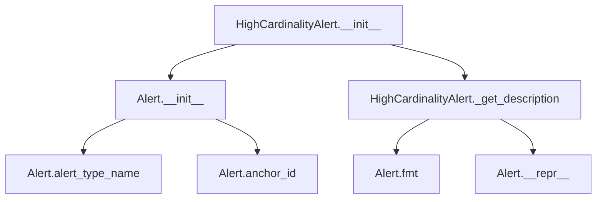

## Raises:
- No explicit exceptions raised during initialization as the parent Alert.__init__ handles validation
- The _get_description method assumes values dictionary contains required keys when not None, though this is not enforced at runtime

## Example:
```python
# Create a high cardinality alert with detailed statistics
alert_with_stats = HighCardinalityAlert(
    values={'n_distinct': 1000, 'p_distinct': 0.85},
    column_name='user_id'
)

# Create a high cardinality alert without statistics
alert_without_stats = HighCardinalityAlert(
    column_name='product_code',
    is_empty=False
)

# Display formatted alerts
print(alert_with_stats.fmt())  # Shows detailed cardinality info
print(alert_without_stats.fmt())  # Shows general high cardinality message
```

### `src.ydata_profiling.model.alerts.HighCardinalityAlert.__init__` · *method*

## Summary:
Initializes a HighCardinalityAlert instance, configuring it to represent columns with high cardinality data.

## Description:
This constructor initializes a HighCardinalityAlert object by calling the parent Alert class constructor with specific parameters tailored for high cardinality detection. It sets the alert type to HIGH_CARDINALITY and establishes the required field "n_distinct" for tracking distinct value counts in columns. This method is part of the data profiling system's alert infrastructure and is typically invoked during the analysis phase when high cardinality patterns are identified in datasets.

## Args:
- values: Optional dictionary containing alert-specific data such as distinct value counts, defaults to None
- column_name: Optional string identifying the column being analyzed, defaults to None  
- is_empty: Boolean flag indicating if the column is empty, defaults to False

## Returns:
- None: This is a constructor method that initializes object state and does not return a value

## Raises:
- No explicit exceptions are raised by this method
- Exceptions may be raised by the parent Alert.__init__ method if invalid parameters are passed

## State Changes:
- Attributes READ: None
- Attributes WRITTEN: 
  - self.fields: Set to {"n_distinct"} to track distinct value count fields
  - self.alert_type: Set to AlertType.HIGH_CARDINALITY
  - self.values: Assigned the provided values parameter or defaults to empty dict
  - self.column_name: Assigned the provided column_name parameter or defaults to None
  - self._is_empty: Assigned the provided is_empty parameter

## Constraints:
- Preconditions:
  - The alert_type parameter in the parent call must be AlertType.HIGH_CARDINALITY
  - The fields parameter must contain "n_distinct" to properly track cardinality analysis
  - All parameters should be of the expected types (Dict for values, str for column_name, bool for is_empty)
- Postconditions:
  - The alert instance will have its alert_type property set to AlertType.HIGH_CARDINALITY
  - The fields attribute will contain exactly {"n_distinct"}
  - All provided parameters will be stored in their respective instance attributes

## Side Effects:
- No I/O operations, external service calls, or mutations to objects outside self

### `src.ydata_profiling.model.alerts.HighCardinalityAlert._get_description` · *method*

## Summary:
Generates a human-readable description string for high cardinality alerts, showing distinct value counts when available or indicating high cardinality otherwise.

## Description:
This method produces a formatted description string that communicates the cardinality status of a column in a data profile. When detailed statistics are available (self.values is not None), it displays the number and percentage of distinct values. When statistics are unavailable, it provides a general indication of high cardinality.

The method is called by Alert.fmt() and Alert.__repr__() to generate descriptive text for high cardinality alerts. This separation allows the Alert base class to handle common formatting while enabling specific alert types to customize their description content.

## Args:
    None

## Returns:
    str: A formatted description string. When values are available, returns format "[column_name] has n_distinct (p_distinct%) distinct values". When values are None, returns format "[column_name] has a high cardinality".

## Raises:
    None

## State Changes:
    Attributes READ: 
    - self.values: Checked for None to determine which message format to use
    - self.column_name: Used to construct the description message

## Constraints:
    Preconditions:
    - self.column_name must be a valid string or None
    - When self.values is not None, it must contain 'n_distinct' and 'p_distinct' keys
    - The 'p_distinct' value should be a decimal between 0 and 1 for proper percentage formatting
    
    Postconditions:
    - Always returns a string describing the alert state
    - The returned string follows a consistent format for high cardinality alerts

## Side Effects:
    None

## `src.ydata_profiling.model.alerts.HighCorrelationAlert` · *class*

## Summary:
Represents an alert for detecting highly correlated columns in a dataset during data profiling.

## Description:
The HighCorrelationAlert class is a specialized alert type that identifies when columns in a dataset exhibit strong correlation relationships. This alert is particularly useful for identifying multicollinearity issues in datasets, which can impact model performance and interpretation. The class extends the base Alert class to provide specific handling for correlation-related findings, including detailed descriptions of correlation strength and related fields.

## State:
- values: Optional[Dict], contains correlation metadata including 'corr' (correlation type) and 'fields' (list of related columns)
- column_name: Optional[str], name of the column that triggered the correlation alert
- is_empty: bool, flag indicating if the alert represents an empty state (defaults to False)

## Lifecycle:
- Creation: Instantiate with optional values dictionary, column_name, and is_empty flag
- Usage: Call _get_description() to generate human-readable correlation descriptions
- Destruction: Managed by Python's garbage collection

## Method Map:


## Raises:
- No explicit exceptions raised during initialization

## Example:
```python
# Create a high correlation alert with detailed metadata
alert = HighCorrelationAlert(
    values={
        "corr": "positive",
        "fields": ["feature_b", "feature_c"]
    },
    column_name="feature_a"
)

# Get human-readable description
description = alert._get_description()
# Returns: "[feature_a] is highly positive correlated with [feature_b] and 1 other fields"

# Create a general high correlation alert
general_alert = HighCorrelationAlert(
    column_name="feature_x",
    is_empty=True
)

# Get general description
general_desc = general_alert._get_description()
# Returns: "[feature_x] has a high correlation with one or more colums"
```

### `src.ydata_profiling.model.alerts.HighCorrelationAlert.__init__` · *method*

## Summary:
Initializes a HighCorrelationAlert instance, setting up the alert with the specific type and associated metadata for highly correlated columns.

## Description:
This method constructs a HighCorrelationAlert object by calling the parent Alert class constructor with the appropriate alert type and provided parameters. It serves as a specialized constructor that ensures all high correlation alerts are properly categorized and initialized with the correct alert type identifier.

## Args:
- values (Optional[Dict], default: None): Dictionary containing correlation details such as the correlation coefficient and related field names
- column_name (Optional[str], default: None): Name of the column triggering the alert
- is_empty (bool, default: False): Flag indicating whether the dataset/column is empty

## Returns:
- None: This method initializes the object state but does not return any value

## Raises:
- No explicit exceptions are raised by this method
- Exceptions may be raised by the parent Alert.__init__ method if invalid arguments are passed

## State Changes:
- Attributes READ: None
- Attributes WRITTEN: 
  - self.alert_type: Set to AlertType.HIGH_CORRELATION
  - self.values: Set to the provided values parameter
  - self.column_name: Set to the provided column_name parameter
  - self._is_empty: Set to the provided is_empty parameter
  - self.fields: Set via parent class initialization

## Constraints:
- Preconditions: The alert_type parameter must be AlertType.HIGH_CORRELATION (implicitly enforced by the method design)
- Postconditions: The resulting object will have alert_type set to HIGH_CORRELATION and all provided parameters properly assigned

## Side Effects:
- No I/O operations, external service calls, or mutations to objects outside self occur

### `src.ydata_profiling.model.alerts.HighCorrelationAlert._get_description` · *method*

## Summary:
Creates a human-readable description of high correlation alert conditions involving one or more columns.

## Description:
Formats a descriptive message that explains the correlation relationship detected by the profiling system. This method generates user-friendly text that indicates which column is highly correlated with others, including the correlation type and number of related fields. The method handles two cases: when detailed correlation metadata is available (showing specific correlation type and fields) and when only a general high correlation warning exists. This method is specifically designed to provide readable output for correlation alerts in reporting systems.

## Args:
    self: The HighCorrelationAlert instance containing correlation data in self.values and column information in self.column_name.

## Returns:
    str: A formatted description string describing the correlation relationship. When correlation data is available, it includes the correlation type and related fields. When only a general alert exists, it provides a simpler description.

## Raises:
    None: This method does not raise any exceptions directly.

## State Changes:
    Attributes READ: 
    - self.values: Dictionary containing correlation metadata including 'corr' (correlation type) and 'fields' (related columns)
    - self.column_name: String identifier for the column triggering the alert

## Constraints:
    Preconditions:
    - self.column_name must be a valid string identifier for a column
    - self.values, when present, must be a dictionary with keys 'corr' and 'fields'
    - self.values['fields'] must be a list with at least one element when present
    
    Postconditions:
    - Returns a properly formatted string describing the correlation
    - The returned string is suitable for display in user interfaces

## Side Effects:
    None: This method performs no I/O operations or external service calls. It only processes internal state to generate a string description.

## `src.ydata_profiling.model.alerts.ImbalanceAlert` · *class*

## Summary:
Represents an alert indicating a highly imbalanced distribution in a dataset column.

## Description:
The ImbalanceAlert class is a specialized alert type used to identify columns with skewed or uneven distributions, particularly important for classification problems where class imbalance can affect model performance. This class extends the base Alert class to provide specific handling for imbalance detection scenarios.

## State:
- values: Optional[Dict], additional contextual data about the imbalance, including the imbalance metric value
- column_name: Optional[str], name of the column that triggered the imbalance alert
- is_empty: bool, flag indicating if the alert represents an empty state

## Lifecycle:
- Creation: Instantiate with optional values, column_name, and is_empty parameters; automatically sets alert_type to IMBALANCE
- Usage: Typically created by profiling functions that detect imbalance in data distributions; used in alert reporting systems
- Destruction: Managed by Python's garbage collection; no explicit cleanup required

## Method Map:
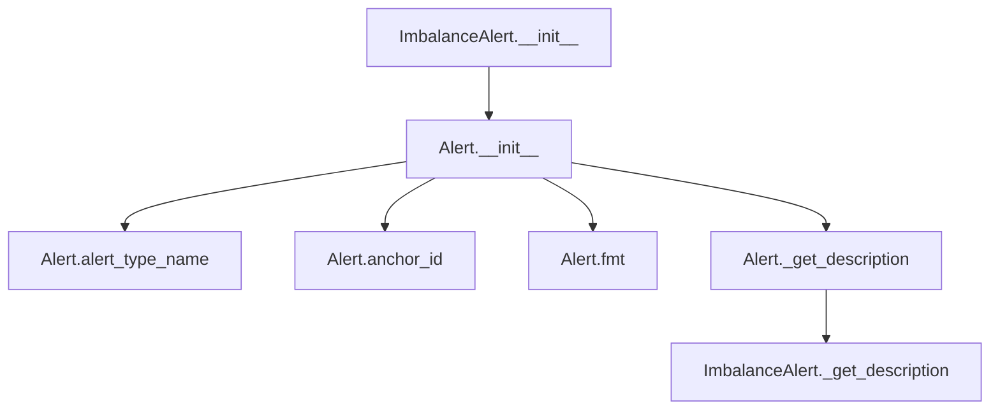

## Raises:
- No explicit exceptions raised during initialization

## Example:
```python
# Create an imbalance alert for a column with significant class imbalance
alert = ImbalanceAlert(
    values={"imbalance": 0.95},
    column_name="target_class"
)

# Get formatted description
description = alert._get_description()
# Returns: "[target_class] is highly imbalanced (0.95)"

# Create an empty imbalance alert
empty_alert = ImbalanceAlert(is_empty=True)
description = empty_alert._get_description()
# Returns: "[None] is highly imbalanced"
```

### `src.ydata_profiling.model.alerts.ImbalanceAlert.__init__` · *method*

## Summary:
Initializes an ImbalanceAlert object with specific alert type, values, column name, and empty status flags.

## Description:
The ImbalanceAlert constructor creates an instance representing a data quality alert for imbalanced class distributions. This method extends the base Alert class to specialize in handling imbalance-related warnings while maintaining consistent interface with other alert types. It is called during the data profiling process when imbalance detection is performed on categorical or binary columns.

## Args:
    values (Optional[Dict], optional): Dictionary containing imbalance statistics such as class distribution ratios. Defaults to None.
    column_name (Optional[str], optional): Name of the column showing imbalance. Defaults to None.
    is_empty (bool, optional): Flag indicating whether the alert relates to an empty dataset/column. Defaults to False.

## Returns:
    None: This method initializes the object's attributes and does not return a value.

## Raises:
    None: This method does not explicitly raise any exceptions.

## State Changes:
    Attributes READ: No attributes are read from the instance.
    Attributes WRITTEN: 
    - self.fields: Set to {"imbalance"} indicating this alert focuses on imbalance detection
    - self.alert_type: Set to AlertType.IMBALANCE to categorize this as an imbalance alert
    - self.values: Set to the provided values parameter or an empty dict if None
    - self.column_name: Set to the provided column_name parameter
    - self._is_empty: Set to the provided is_empty parameter

## Constraints:
    Preconditions: 
    - alert_type must be a valid AlertType enum value (specifically AlertType.IMBALANCE)
    - values must be a dictionary or None
    - column_name must be a string or None
    
    Postconditions:
    - All instance attributes are properly initialized
    - self.fields is always set to {"imbalance"}
    - self.alert_type is always set to AlertType.IMBALANCE

## Side Effects:
    None: This method performs no I/O operations or external service calls.

### `src.ydata_profiling.model.alerts.ImbalanceAlert._get_description` · *method*

## Summary:
Returns a formatted string describing the imbalance alert for a specific column.

## Description:
This method generates a human-readable description of an imbalance alert, indicating that a column has a highly imbalanced distribution. It is called during the alert reporting phase to provide contextual information about the detected imbalance. The description includes the column name and, when available, the specific imbalance metric value.

## Args:
    self: The ImbalanceAlert instance containing alert metadata.

## Returns:
    str: A formatted description string in the format "[column_name] is highly imbalanced" or "[column_name] is highly imbalanced (value)" when imbalance data is available.

## Raises:
    None: This method does not raise any exceptions.

## State Changes:
    Attributes READ: self.column_name, self.values
    Attributes WRITTEN: None

## Constraints:
    Preconditions: The method assumes self.column_name is a valid string and self.values is either None or a dictionary containing an 'imbalance' key.
    Postconditions: The returned string is always a valid description of the imbalance alert.

## Side Effects:
    None: This method performs no I/O operations or external service calls.

## `src.ydata_profiling.model.alerts.InfiniteAlert` · *class*

## Summary:
Represents an alert for detecting infinite or NaN values in a data column during profiling.

## Description:
The InfiniteAlert class is a specialized alert type that identifies and reports columns containing infinite or NaN values. It extends the base Alert class to provide specific functionality for handling infinite value detection, including formatting descriptive messages that can include count and percentage information about the infinite values found.

## State:
- values: Optional[Dict], dictionary containing statistics about infinite values with keys 'n_infinite' (count) and 'p_infinite' (percentage); can be None when no detailed statistics are available
- column_name: Optional[str], name of the column that contains infinite values; can be None when column context is not available
- is_empty: bool, flag indicating whether the alert represents an empty state (default: False)

## Lifecycle:
- Creation: Instantiate with optional values dictionary, column name, and is_empty flag; internally calls parent Alert constructor with AlertType.INFINITE
- Usage: Typically accessed through the Alert's fmt() method which invokes _get_description() to generate display text
- Destruction: Managed by Python's garbage collection; no explicit cleanup required

## Method Map:
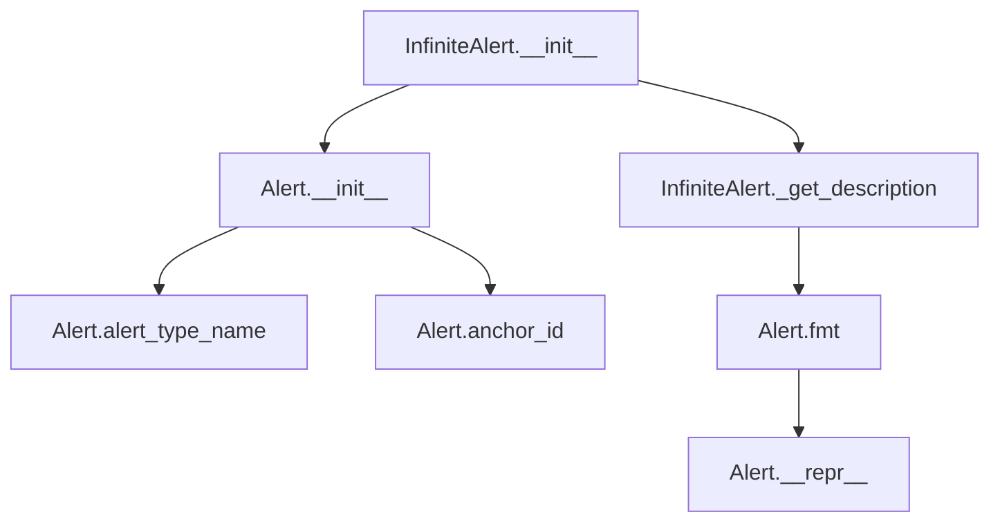

## Raises:
- No explicit exceptions raised during initialization as it inherits from Alert class
- Exception handling depends on parent Alert class behavior

## Example:
```python
# Create an infinite alert with detailed statistics
alert = InfiniteAlert(
    values={'n_infinite': 5, 'p_infinite': 0.05},
    column_name='feature_x'
)

# Get formatted description
description = alert.fmt()  # Returns "[feature_x] has 5 (5.0%) infinite values"

# Create an infinite alert without statistics
alert2 = InfiniteAlert(column_name='feature_y')
description2 = alert2.fmt()  # Returns "[feature_y] has infinite values"
```

### `src.ydata_profiling.model.alerts.InfiniteAlert.__init__` · *method*

## Summary:
Initializes an InfiniteAlert instance with specific alert type and field configuration for infinite value detection.

## Description:
Configures an InfiniteAlert object by setting its alert type to INFINITE, establishing the expected fields for infinite value reporting, and initializing other alert properties. This method serves as the constructor for the InfiniteAlert class, which inherits from the base Alert class and specializes in detecting infinite or NaN values in data columns.

## Args:
    values (Optional[Dict], default: None): Dictionary containing statistics about infinite values, including counts and percentages
    column_name (Optional[str], default: None): Name of the column being analyzed for infinite values
    is_empty (bool, default: False): Flag indicating whether the dataset/column is empty

## Returns:
    None: This method initializes the object's state but does not return a value

## Raises:
    No explicit exceptions are raised by this method

## State Changes:
    Attributes READ: None
    Attributes WRITTEN: 
    - self.fields: Set containing {"p_infinite", "n_infinite"} 
    - self.alert_type: Set to AlertType.INFINITE
    - self.values: Set to the provided values parameter or empty dict
    - self.column_name: Set to the provided column_name parameter
    - self._is_empty: Set to the provided is_empty parameter

## Constraints:
    Preconditions:
    - The alert_type parameter in the parent constructor must accept AlertType.INFINITE
    - The fields parameter must be a valid set containing "p_infinite" and "n_infinite"
    
    Postconditions:
    - The alert_type attribute is properly set to AlertType.INFINITE
    - The fields attribute contains exactly {"p_infinite", "n_infinite"}
    - All provided parameters are correctly assigned to instance attributes

## Side Effects:
    None: This method performs no I/O operations or external service calls

### `src.ydata_profiling.model.alerts.InfiniteAlert._get_description` · *method*

## Summary:
Returns a formatted description string indicating the number of infinite values found in a column, with optional percentage information.

## Description:
Generates a human-readable description of infinite value counts in a data column. This method is part of the InfiniteAlert class and provides descriptive text for reporting infinite value issues detected during data profiling. The description varies based on whether detailed statistics (count and percentage) are available.

## Args:
    None explicitly required

## Returns:
    str: A formatted description string describing infinite values in the column. Format depends on availability of statistics:
        - When statistics are available: "[column_name] has {n_infinite} ({percentage}) infinite values"
        - When statistics are not available: "[column_name] has infinite values"

## Raises:
    None explicitly raised

## State Changes:
    Attributes READ: 
        - self.values (Optional[Dict]): Dictionary containing infinite value statistics if available
        - self.column_name (str): Name of the column being analyzed

## Constraints:
    Preconditions:
        - self.column_name must be a valid string or None
        - self.values must be either None or a dictionary containing 'n_infinite' and 'p_infinite' keys when not None
        
    Postconditions:
        - Always returns a properly formatted string describing infinite values
        - The returned string follows a consistent format for reporting purposes

## Side Effects:
    None

## `src.ydata_profiling.model.alerts.MissingAlert` · *class*

## Summary:
Represents an alert for missing data patterns in a data column, providing detailed statistics or basic presence information.

## Description:
The MissingAlert class specializes the base Alert class to specifically represent missing value conditions in dataset columns. It is used during data profiling to identify and report on columns with missing data, offering either detailed statistical information (count and percentage) or basic presence indicators. This class is instantiated by the profiling system when missing value patterns are detected and is responsible for generating appropriate textual descriptions for reporting purposes.

## State:
- values: Optional[Dict], contains missing value statistics ('n_missing' and 'p_missing') when available, or None
- column_name: Optional[str], the name of the column that has missing values, or None
- is_empty: bool, indicates whether the alert represents an empty state (default: False)
- fields: Set[str], set containing "p_missing" and "n_missing" as required fields for missing data alerts

## Lifecycle:
- Creation: Instantiate with optional values dictionary, column_name string, and is_empty boolean flag
- Usage: Typically accessed through the parent Alert class interface (alert_type_name, anchor_id, fmt())
- Destruction: Managed by Python's garbage collection; no explicit cleanup required

## Method Map:


## Raises:
- No explicit exceptions raised during initialization as it delegates to parent Alert class

## Example:
```python
# Create a missing alert with detailed statistics
alert_with_stats = MissingAlert(
    values={'n_missing': 15, 'p_missing': 0.15},
    column_name='age',
    is_empty=False
)
print(alert_with_stats.fmt())  # Displays: "[age] 15 (15.0%) missing values"

# Create a missing alert with basic presence info
alert_basic = MissingAlert(
    values=None,
    column_name='income',
    is_empty=False
)
print(alert_basic.fmt())  # Displays: "[income] has missing values"
```

### `src.ydata_profiling.model.alerts.MissingAlert.__init__` · *method*

## Summary:
Initializes a MissingAlert instance with specific parameters for missing data detection.

## Description:
The MissingAlert constructor sets up an alert instance specifically designed to report missing data patterns in datasets. It inherits from the base Alert class and configures the alert type to MISSING while establishing the expected fields for missing data reporting (p_missing and n_missing). This method centralizes the initialization logic for missing data alerts, ensuring consistent configuration across all instances.

## Args:
    values (Optional[Dict], default=None): Dictionary containing missing data statistics including 'p_missing' (percentage) and 'n_missing' (count)
    column_name (Optional[str], default=None): Name of the column being analyzed for missing values
    is_empty (bool, default=False): Flag indicating whether the dataset/column is empty

## Returns:
    None: This method initializes the object's state but does not return a value

## Raises:
    No explicit exceptions are raised by this method; any errors would stem from the parent Alert class initialization

## State Changes:
    Attributes READ: None
    Attributes WRITTEN: 
    - self.fields: Set containing {"p_missing", "n_missing"}
    - self.alert_type: Set to AlertType.MISSING
    - self.values: Set to the provided values parameter or empty dict
    - self.column_name: Set to the provided column_name parameter
    - self._is_empty: Set to the provided is_empty parameter

## Constraints:
    Preconditions:
    - The alert_type parameter in the parent class must accept AlertType.MISSING
    - The fields parameter must be a set containing at least "p_missing" and "n_missing"
    - Values dictionary, if provided, must contain keys "p_missing" and "n_missing"

    Postconditions:
    - The alert instance will have alert_type set to AlertType.MISSING
    - The fields attribute will contain exactly {"p_missing", "n_missing"}
    - All provided parameters will be properly assigned to instance attributes

## Side Effects:
    None: This method performs no I/O operations, external service calls, or mutations to objects outside self

### `src.ydata_profiling.model.alerts.MissingAlert._get_description` · *method*

## Summary:
Returns a formatted string describing missing value statistics for a column, or a generic message if no detailed statistics are available.

## Description:
This method generates a human-readable description of missing value conditions for a data column. It is called during report generation to provide informative alerts about missing data patterns. The method distinguishes between two cases: when detailed missing value statistics (count and percentage) are available, and when only a basic presence of missing values is known.

## Args:
    None explicitly taken as arguments (uses self)

## Returns:
    str: A formatted description string containing column name and missing value information. When detailed statistics are available, returns format "[column_name] n_missing (p_missing%) missing values". When only basic information is available, returns format "[column_name] has missing values".

## Raises:
    None explicitly raised

## State Changes:
    Attributes READ: 
        - self.values (Optional[Dict]): Contains missing value statistics if available
        - self.column_name (Optional[str]): Name of the column being described

## Constraints:
    Preconditions:
        - self.column_name should be a valid string or None
        - self.values should be either None or a dictionary containing 'n_missing' and 'p_missing' keys when not None
        
    Postconditions:
        - Always returns a string describing the missing value situation
        - The returned string follows a consistent format for reporting purposes

## Side Effects:
    None

## `src.ydata_profiling.model.alerts.NonStationaryAlert` · *class*

## Summary:
Represents an alert for detecting non-stationary time series data patterns in a dataset column.

## Description:
The NonStationaryAlert class is a specialized alert type used to identify when a column in a dataset exhibits non-stationary characteristics, meaning its statistical properties (like mean, variance) change over time or across segments. This alert type is particularly relevant for time series analysis where stationarity is often a key assumption for many modeling techniques.

This class extends the base Alert class and implements the specific behavior for non-stationary data detection. It inherits all standard alert functionality while providing a type-specific description for non-stationary patterns.

## State:
- Inherits all attributes from Alert parent class:
  - alert_type: AlertType.NON_STATIONARY (constant)
  - values: Dict[str, Any], optional contextual data about the non-stationary pattern
  - column_name: str, optional name of the column that triggered the alert
  - _is_empty: bool, internal flag indicating if the alert represents an empty state
  - fields: Set[str], optional set of related field names associated with the alert
  - _anchor_id: str, cached identifier for linking alert elements in UI components

## Lifecycle:
- Creation: Instantiate with optional values, column_name, and is_empty parameters
- Usage: Typically created by profiling functions that detect non-stationary patterns; accessed via alert_type_name property or formatted display through fmt() method
- Destruction: Managed by Python's garbage collection; no explicit cleanup required

## Method Map:
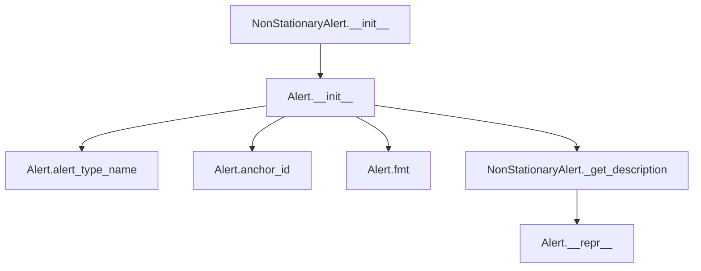

## Raises:
- No explicit exceptions raised during initialization
- Inherits all exception handling from Alert parent class

## Example:
```python
# Create a non-stationary alert for a time series column
from ydata_profiling.model.alerts import NonStationaryAlert

# Alert with column name
alert = NonStationaryAlert(
    column_name="temperature_readings",
    values={"stationarity_test": "ADF", "p_value": 0.05}
)

# Display formatted alert
print(alert.fmt())  # Output: '<abbr title="This variable is non stationary">NON STATIONARY</abbr>'
print(repr(alert))  # Output: '[NON_STATIONARY] alert on column temperature_readings'
```

### `src.ydata_profiling.model.alerts.NonStationaryAlert.__init__` · *method*

## Summary:
Initializes a NonStationaryAlert instance with specified properties, setting its alert type to NON_STATIONARY.

## Description:
The __init__ method constructs a NonStationaryAlert object by calling the parent Alert class constructor with the appropriate alert type and provided parameters. This method ensures that the alert is properly categorized as a non-stationary time series issue while preserving any additional metadata passed through values, column_name, and is_empty parameters.

## Args:
    values (Optional[Dict], default: None): Additional data values associated with the alert, such as statistical measures or diagnostic information about the non-stationarity.
    column_name (Optional[str], default: None): Name of the column that triggered this alert, used for identification and reporting purposes.
    is_empty (bool, default: False): Flag indicating whether the alert relates to an empty dataset or column, affecting how the alert is processed or displayed.

## Returns:
    None: This method initializes the object's state but does not return any value.

## Raises:
    No explicit exceptions are raised by this method. Any exceptions would originate from the parent Alert.__init__ method if invalid arguments were passed.

## State Changes:
    Attributes READ: None
    Attributes WRITTEN: 
    - self.alert_type: Set to AlertType.NON_STATIONARY
    - self.values: Set to the provided values parameter
    - self.column_name: Set to the provided column_name parameter
    - self._is_empty: Set to the provided is_empty parameter
    - self.fields: Inherited from parent Alert class, initialized as an empty set or populated with provided fields

## Constraints:
    Preconditions:
    - The alert_type parameter must be AlertType.NON_STATIONARY (implicitly enforced by the method)
    - All parameters should conform to their expected types (values as dict, column_name as str, is_empty as bool)
    
    Postconditions:
    - The created object will have alert_type equal to AlertType.NON_STATIONARY
    - The object will preserve all provided parameters in their respective attributes
    - The object will inherit proper initialization from the Alert base class

## Side Effects:
    None: This method performs only object initialization and does not cause any I/O operations, external service calls, or mutations to objects outside self.

### `src.ydata_profiling.model.alerts.NonStationaryAlert._get_description` · *method*

## Summary:
Returns a formatted description string indicating that a column contains non-stationary data.

## Description:
This method generates a descriptive message for non-stationary data alerts, specifically formatted as "[{column_name}] is non stationary". It is part of the Alert base class hierarchy and overridden by NonStationaryAlert to provide type-specific messaging for non-stationarity detection.

The method is invoked during alert formatting operations when presenting information about non-stationary data patterns in datasets. This approach enables consistent alert presentation while allowing specialized descriptions for different alert types.

## Args:
    self: NonStationaryAlert instance with column_name attribute

## Returns:
    str: Formatted description string in the format "[{column_name}] is non stationary"

## Raises:
    None: This method does not raise any exceptions

## State Changes:
    Attributes READ: self.column_name
    Attributes WRITTEN: None

## Constraints:
    Preconditions: 
    - self.column_name must be accessible (either a string or None)
    - The method assumes proper initialization of the NonStationaryAlert instance
    
    Postconditions:
    - Returns a consistent string format for non-stationary alerts
    - The returned string follows the exact pattern "[column_name] is non stationary"

## Side Effects:
    None: This method performs no I/O operations or external service calls

## `src.ydata_profiling.model.alerts.SeasonalAlert` · *class*

## Summary:
Represents an alert indicating that a column exhibits seasonal patterns in time series data.

## Description:
The SeasonalAlert class is a specialized alert type used to identify and report columns that display seasonal characteristics. It extends the base Alert class to provide specific functionality for seasonal pattern detection in time series data analysis. This alert type is particularly useful in identifying recurring patterns that repeat at regular intervals, such as daily, weekly, monthly, or yearly cycles.

## State:
- Inherits all attributes from Alert base class:
  - alert_type: AlertType.SEASONAL (constant)
  - values: Optional[Dict], additional contextual data about the seasonal pattern
  - column_name: Optional[str], name of the column exhibiting seasonal behavior
  - _is_empty: bool, internal flag indicating empty state
  - fields: Set[str], optional related field names
  - _anchor_id: str, cached identifier for UI linking

## Lifecycle:
- Creation: Instantiate with optional values, column_name, and is_empty parameters
- Usage: Typically created by seasonal pattern detection algorithms and processed by alert handlers
- Destruction: Managed by Python's garbage collection

## Method Map:
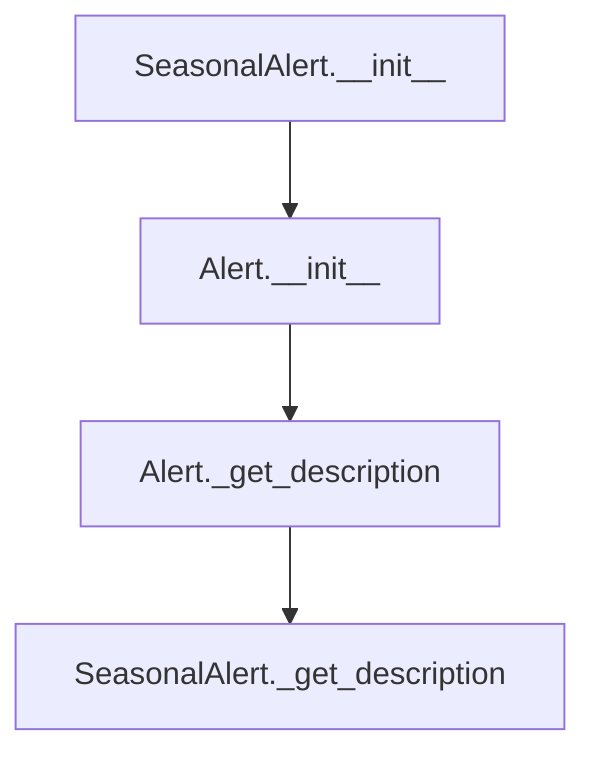

## Raises:
- No explicit exceptions raised during initialization
- Inherits all exceptions from Alert.__init__

## Example:
```python
# Create a seasonal alert for a time series column
alert = SeasonalAlert(
    column_name="sales_revenue",
    values={"seasonality_period": "monthly", "cycle_length": 12}
)

# Get the formatted description
description = alert._get_description()  # Returns "[sales_revenue] is seasonal"

# Access alert properties
print(alert.alert_type)  # Returns AlertType.SEASONAL
print(alert.column_name)  # Returns "sales_revenue"
```

### `src.ydata_profiling.model.alerts.SeasonalAlert.__init__` · *method*

## Summary:
Initializes a SeasonalAlert instance with specified properties, setting its alert type to SEASONAL.

## Description:
The SeasonalAlert constructor creates an instance of the SeasonalAlert class, which inherits from the base Alert class. This method configures the alert with the SEASONAL alert type and initializes its core properties including values, column name, and empty status. It delegates the actual initialization to the parent Alert class constructor.

## Args:
    values (Optional[Dict], default: None): Dictionary containing alert-specific data or metadata
    column_name (Optional[str], default: None): Name of the column associated with this alert
    is_empty (bool, default: False): Boolean flag indicating if the alert relates to an empty dataset/column

## Returns:
    None: This method does not return any value

## Raises:
    No explicit exceptions are raised by this method

## State Changes:
    Attributes READ: None
    Attributes WRITTEN: 
    - self.alert_type: Set to AlertType.SEASONAL
    - self.values: Set to the provided values parameter or empty dict
    - self.column_name: Set to the provided column_name parameter
    - self._is_empty: Set to the provided is_empty parameter
    - self.fields: Set via parent class initialization

## Constraints:
    Preconditions:
    - The AlertType.SEASONAL constant must be defined and accessible
    - The parent Alert class must be properly initialized
    - All parameters must be compatible with the parent class expectations
    
    Postconditions:
    - The instance will have alert_type set to AlertType.SEASONAL
    - The instance will have appropriate values, column_name, and is_empty attributes set
    - The instance will inherit all properties from the Alert base class

## Side Effects:
    None: This method performs no I/O operations, external service calls, or mutations to objects outside self

### `src.ydata_profiling.model.alerts.SeasonalAlert._get_description` · *method*

## Summary:
Returns a formatted string describing a seasonal alert for a specific column.

## Description:
This method generates a human-readable description indicating that a particular column exhibits seasonal patterns. It is part of the SeasonalAlert class which represents alerts related to seasonal data analysis. The method is called during the alert reporting phase to provide descriptive information about detected seasonal patterns in the data.

## Args:
    self: The SeasonalAlert instance containing the column_name attribute.

## Returns:
    str: A formatted string in the form "[column_name] is seasonal" that describes the seasonal pattern detected in the specified column.

## Raises:
    None: This method does not raise any exceptions.

## State Changes:
    Attributes READ: self.column_name
    Attributes WRITTEN: None

## Constraints:
    Preconditions: The self.column_name attribute must be a valid string or None.
    Postconditions: The returned string follows the format "[column_name] is seasonal" where column_name is either the actual column name or None.

## Side Effects:
    None: This method performs no I/O operations, external service calls, or mutations to objects outside self.

## `src.ydata_profiling.model.alerts.SkewedAlert` · *class*

## Summary:
Represents an alert for detecting highly skewed distributions in data columns.

## Description:
The SkewedAlert class is a specialized alert type used to identify columns with highly skewed data distributions during data profiling. It extends the base Alert class to provide specific handling and formatting for skewness detection. This alert is particularly useful for identifying data quality issues where the distribution of values in a column deviates significantly from normal distribution, which can impact statistical analysis and model performance.

## State:
- Inherits all attributes from Alert base class:
  - alert_type: AlertType.SKEWED (constant)
  - values: Optional[Dict], stores skewness coefficient γ₁ value when available
  - column_name: Optional[str], name of the column triggering the alert
  - fields: Set[str], contains "skewness" field identifier
  - _is_empty: bool, indicates if alert represents empty state
  - _anchor_id: str, cached identifier for UI linking

## Lifecycle:
- Creation: Instantiate with optional values, column_name, and is_empty parameters
- Usage: Typically created by profiling routines when skewness thresholds are exceeded; accessed via alert_type_name, anchor_id, and fmt() methods
- Destruction: Managed by Python's garbage collection

## Method Map:
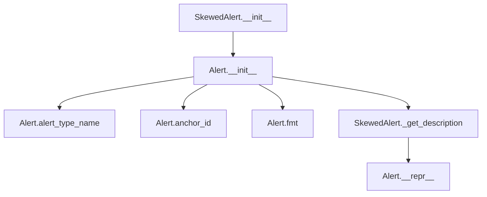

## Raises:
- No explicit exceptions raised during initialization
- Inherits all potential exceptions from Alert.__init__

## Example:
```python
# Create a skewed alert for a column with high skewness
alert = SkewedAlert(
    values={"skewness": 2.5},
    column_name="income"
)

# Get formatted description
description = alert.fmt()  # "[income] is highly skewed(γ1 = 2.5)"

# Create an alert without skewness value
empty_alert = SkewedAlert(column_name="age")
description = empty_alert.fmt()  # "[age] is highly skewed"
```

### `src.ydata_profiling.model.alerts.SkewedAlert.__init__` · *method*

## Summary:
Initializes a SkewedAlert instance with specific alert type and metadata for skewed distribution detection.

## Description:
The SkewedAlert constructor sets up an alert instance specifically designed to identify and report skewed data distributions. It inherits from the base Alert class and configures the alert with the SKEWED alert type, establishing the appropriate metadata fields for skewness analysis. This method centralizes the initialization logic for skewed distribution alerts, ensuring consistent setup across all instances.

## Args:
    values (Optional[Dict], default: None): Dictionary containing skewness calculation results and related statistics
    column_name (Optional[str], default: None): Name of the column being analyzed for skewness
    is_empty (bool, default: False): Flag indicating whether the column being analyzed is empty

## Returns:
    None: This method initializes the object's state but does not return any value

## Raises:
    No explicit exceptions are raised by this method

## State Changes:
    Attributes READ: None
    Attributes WRITTEN: 
    - self.fields: Set containing "skewness" to indicate the field being analyzed
    - self.alert_type: Set to AlertType.SKEWED to categorize this alert properly
    - self.values: Assigned the provided values parameter
    - self.column_name: Assigned the provided column_name parameter
    - self._is_empty: Assigned the provided is_empty parameter

## Constraints:
    Preconditions:
    - The AlertType.SKEWED constant must be defined in the AlertType enum
    - The parent Alert class must be properly initialized with the required parameters
    - The fields parameter must be a set containing at least "skewness"

    Postconditions:
    - The alert instance will have its alert_type property set to AlertType.SKEWED
    - The fields attribute will contain exactly {"skewness"}
    - All provided parameters will be correctly assigned to their respective instance attributes

## Side Effects:
    None: This method performs only internal object initialization without external I/O or service calls

### `src.ydata_profiling.model.alerts.SkewedAlert._get_description` · *method*

## Summary:
Returns a formatted string describing a highly skewed column alert, including skewness value when available.

## Description:
This method generates a human-readable description for a SkewedAlert instance, indicating which column is highly skewed and optionally including the skewness coefficient γ₁ value. It is called during the alert reporting phase to provide descriptive information about detected skewness issues in the data. This method overrides the base Alert._get_description method to provide specific formatting for skewness alerts.

## Args:
    self: The SkewedAlert instance containing alert metadata.

## Returns:
    str: A formatted description string indicating column skewness, optionally including the skewness coefficient value.

## Raises:
    None explicitly raised.

## State Changes:
    Attributes READ: self.column_name, self.values
    Attributes WRITTEN: None

## Constraints:
    Preconditions: The method assumes self.column_name is properly initialized and self.values is either None or contains a dictionary with a 'skewness' key.
    Postconditions: The returned string follows a consistent format for skewness alerts.

## Side Effects:
    None.

## `src.ydata_profiling.model.alerts.TypeDateAlert` · *class*

## Summary:
Represents an alert for columns that contain only datetime values but are incorrectly categorized as categorical data types.

## Description:
The TypeDateAlert class is a specialized alert type that identifies when a column in a dataset contains only datetime values but has been classified as a categorical data type during profiling. This situation often occurs when date strings are parsed as categorical values rather than proper datetime objects. The alert suggests applying pandas' `to_datetime()` function to convert these columns to appropriate datetime types for better analysis and visualization.

This class extends the base Alert class and implements the `_get_description` method to provide a meaningful error message that guides users toward correcting the data type issue.

## State:
- Inherits all attributes from Alert parent class:
  - alert_type: AlertType.TYPE_DATE (constant)
  - values: Optional[Dict], additional contextual data about the alert
  - column_name: Optional[str], name of the column triggering the alert
  - _is_empty: bool, internal flag for empty state handling
  - fields: Set[str], optional related field names
  - _anchor_id: str, cached identifier for UI linking

## Lifecycle:
- Creation: Instantiate with optional values, column_name, and is_empty parameters
- Usage: Typically created by profiling logic when datetime inconsistency is detected; accessed via alert management systems
- Destruction: Managed by Python's garbage collection

## Method Map:
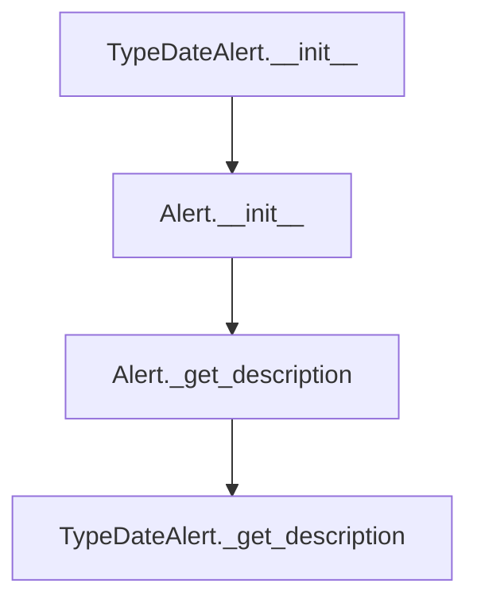

## Raises:
- No explicit exceptions raised during initialization
- Inherits all exception handling from Alert parent class

## Example:
```python
# Create a TypeDateAlert for a column with datetime strings
alert = TypeDateAlert(
    column_name="date_column",
    values={"sample_values": ["2023-01-01", "2023-01-02"]}
)

# Get the descriptive message
description = alert._get_description()
# Returns: "[date_column] only contains datetime values, but is categorical. Consider applying `pd.to_datetime()`"

# Format for display
formatted_alert = alert.fmt()
# Returns: formatted HTML representation of the alert
```

### `src.ydata_profiling.model.alerts.TypeDateAlert.__init__` · *method*

## Summary:
Initializes a TypeDateAlert instance, setting up the alert with the specific TYPE_DATE alert type and associated metadata.

## Description:
The TypeDateAlert constructor initializes an alert instance specifically designed to identify when a column contains only datetime values but is classified as categorical. This method delegates to the parent Alert class constructor to establish the fundamental alert properties including the alert type, column name, and other metadata. The alert type is explicitly set to AlertType.TYPE_DATE, which distinguishes this alert from other types of data quality issues.

## Args:
    values (Optional[Dict], default: None): Additional contextual data about the alert, such as field names or correlation values.
    column_name (Optional[str], default: None): The name of the column that triggered this alert.
    is_empty (bool, default: False): Flag indicating whether the column is empty.

## Returns:
    None: This method does not return a value.

## Raises:
    No explicit exceptions are raised by this method. Any exceptions would originate from the parent Alert.__init__ method.

## State Changes:
    Attributes READ: None
    Attributes WRITTEN: 
    - self.alert_type: Set to AlertType.TYPE_DATE
    - self.values: Set to the provided values parameter
    - self.column_name: Set to the provided column_name parameter
    - self._is_empty: Set to the provided is_empty parameter

## Constraints:
    Preconditions:
    - The AlertType.TYPE_DATE constant must be properly defined in the AlertType enum
    - The parent Alert class must be properly initialized with the provided parameters
    
    Postconditions:
    - The instance will have its alert_type attribute set to AlertType.TYPE_DATE
    - All provided parameters will be stored as instance attributes

## Side Effects:
    None: This method performs no I/O operations, external service calls, or mutations to objects outside the instance being constructed.

### `src.ydata_profiling.model.alerts.TypeDateAlert._get_description` · *method*

## Summary:
Returns a descriptive message indicating that a column contains only datetime values but is incorrectly categorized as categorical.

## Description:
This method generates a human-readable description for a TypeDateAlert, which is triggered when a column is detected to contain only datetime values but is classified as categorical in the data profiling process. The alert suggests applying pandas' to_datetime() function to properly convert the column.

The method is called during the alert generation phase of data profiling, specifically when analyzing column types and identifying inconsistencies between actual data content and data type classifications.

## Args:
    self: The TypeDateAlert instance containing the column information

## Returns:
    str: A formatted string describing the alert with column name and suggested fix

## Raises:
    None

## State Changes:
    Attributes READ: self.column_name
    Attributes WRITTEN: None

## Constraints:
    Preconditions: The alert instance must have a valid column_name attribute set
    Postconditions: The returned string follows a consistent format for alert descriptions

## Side Effects:
    None

## `src.ydata_profiling.model.alerts.UniformAlert` · *class*

## Summary:
Represents an alert indicating that a column exhibits a uniform distribution pattern.

## Description:
The UniformAlert class is a specialized subclass of Alert designed to identify and represent data quality issues where a column displays a uniform distribution. This alert type is particularly useful in data profiling scenarios where detecting uniform distributions may indicate data quality concerns, such as artificially generated data, lack of meaningful variation, or unexpected data patterns.

## State:
- Inherits all attributes from Alert parent class including alert_type, values, column_name, and _is_empty
- column_name: str, optional name of the column that triggered the uniform distribution alert
- _is_empty: bool, inherited flag indicating if the alert represents an empty state (defaults to False)

## Lifecycle:
- Creation: Instantiate with optional values, column_name, and is_empty parameters; alert_type is automatically set to AlertType.UNIFORM
- Usage: Access inherited properties like alert_type_name, anchor_id, and fmt() for display formatting; use _get_description() for specific alert text
- Destruction: Managed by Python's garbage collection; no explicit cleanup required

## Method Map:
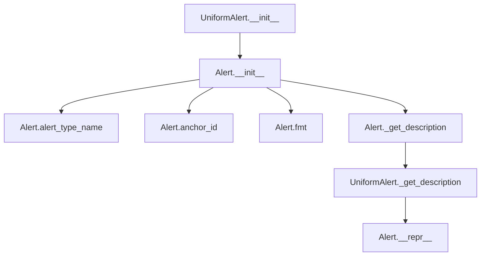

## Raises:
- No explicit exceptions raised during initialization
- Inherits all exception handling from Alert parent class

## Example:
```python
# Create a uniform distribution alert
from ydata_profiling.model.alerts import UniformAlert

alert = UniformAlert(
    column_name="age_group",
    values={"distribution": "uniform"}
)

# Display formatted alert
print(alert.fmt())  # Output: '<abbr title="[age_group] is uniformly distributed">UNIFORM</abbr>'
print(repr(alert))  # Output: '[UNIFORM] alert on column age_group'
```

### `src.ydata_profiling.model.alerts.UniformAlert.__init__` · *method*

## Summary:
Initializes a UniformAlert instance, setting up the alert with uniform distribution characteristics and establishing its base properties.

## Description:
The `__init__` method constructs a UniformAlert object by calling the parent Alert class constructor with specific parameters indicating this is a uniform distribution alert. This method serves as the primary constructor for UniformAlert instances, ensuring proper initialization of alert metadata including the alert type, associated column name, and data values.

## Args:
    values (Optional[Dict], default: None): Dictionary containing alert-specific data values, such as distribution statistics or related field information.
    column_name (Optional[str], default: None): Name of the column that triggered this uniform distribution alert.
    is_empty (bool, default: False): Boolean flag indicating whether the alert relates to an empty dataset or column.

## Returns:
    None: This method initializes the object's state but does not return any value.

## Raises:
    No explicit exceptions are raised by this method. Any exceptions would originate from the parent Alert class constructor.

## State Changes:
    Attributes READ: None
    Attributes WRITTEN: 
    - self.alert_type: Set to AlertType.UNIFORM
    - self.values: Set to the provided values parameter or empty dict
    - self.column_name: Set to the provided column_name parameter
    - self._is_empty: Set to the provided is_empty parameter
    - self.fields: Set via parent class initialization

## Constraints:
    Preconditions:
    - The AlertType.UNIFORM constant must be properly defined in the AlertType enum
    - All parameters should conform to their respective type annotations
    - The parent Alert class must be properly initialized with the provided arguments
    
    Postconditions:
    - The created UniformAlert instance will have its alert_type attribute set to AlertType.UNIFORM
    - The instance will maintain the provided values, column_name, and is_empty state
    - The instance will inherit all base Alert functionality

## Side Effects:
    None: This method performs no I/O operations, external service calls, or mutations to objects outside the instance being constructed.

### `src.ydata_profiling.model.alerts.UniformAlert._get_description` · *method*

## Summary:
Returns a formatted string describing that a column is uniformly distributed.

## Description:
This method generates a human-readable description indicating that the column associated with this alert has a uniform distribution. It is part of the UniformAlert class which represents alerts for uniformly distributed data columns.

## Args:
    self: The UniformAlert instance containing the column_name attribute.

## Returns:
    str: A formatted string in the form "[column_name] is uniformly distributed"

## Raises:
    None: This method does not raise any exceptions.

## State Changes:
    Attributes READ: self.column_name
    Attributes WRITTEN: None

## Constraints:
    Preconditions: The self.column_name attribute must be set and not None.
    Postconditions: The returned string follows a consistent format for uniform distribution alerts.

## Side Effects:
    None: This method performs no I/O operations or external service calls.

## `src.ydata_profiling.model.alerts.UniqueAlert` · *class*

## Summary:
Represents an alert indicating that a column contains unique values, used in data profiling to identify columns where all values are distinct.

## Description:
The UniqueAlert class is a specialized subclass of Alert designed to signal when a dataset column exhibits unique value characteristics. It extends the base Alert functionality by providing specific handling for unique value patterns and generating appropriate descriptive messages. This alert type is particularly useful for identifying columns that may serve as identifiers or keys in datasets.

## State:
- Inherits all attributes from Alert parent class:
  - alert_type: AlertType.UNIQUE, identifies this as a unique value alert
  - values: Optional[Dict], additional contextual data (defaults to None)
  - column_name: Optional[str], name of the column triggering the alert (defaults to None)
  - fields: Set[str], set containing {"n_distinct", "p_distinct", "n_unique", "p_unique"}
  - _is_empty: bool, indicates if the alert represents an empty state (defaults to False)
- _anchor_id: str, cached identifier for UI linking (inherited from Alert)

## Lifecycle:
- Creation: Instantiate with optional values, column_name, and is_empty parameters
- Usage: Typically created by profiling routines when unique value patterns are detected; accessed via alert_type_name property and fmt() method for display
- Destruction: Managed by Python's garbage collection; no explicit cleanup required

## Method Map:
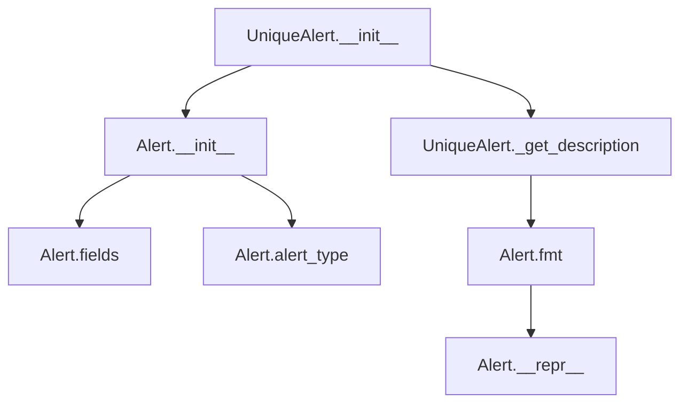

## Raises:
- No explicit exceptions raised during initialization
- Inherits all exception handling from Alert parent class

## Example:
```python
# Create a unique alert for a column named "user_id"
alert = UniqueAlert(
    values={"n_distinct": 1000, "p_distinct": 1.0, "n_unique": 1000, "p_unique": 1.0},
    column_name="user_id",
    is_empty=False
)

# Display formatted alert
print(alert.fmt())  # Output: '<abbr title="[user_id] has unique values">UNIQUE</abbr>'
print(repr(alert))  # Output: '[UNIQUE] alert on column user_id'
```

### `src.ydata_profiling.model.alerts.UniqueAlert.__init__` · *method*

## Summary:
Initializes a UniqueAlert instance with predefined alert type and field set for unique value analysis.

## Description:
The UniqueAlert constructor sets up an alert specifically designed to identify columns with unique value patterns. It inherits from the base Alert class and configures the alert with the UNIQUE alert type, along with a fixed set of fields that capture distinct and unique value statistics. This method centralizes the initialization logic for unique value alerts, ensuring consistent configuration across all instances.

## Args:
    values (Optional[Dict], default=None): Dictionary containing statistical values for the alert, such as distinct counts and percentages
    column_name (Optional[str], default=None): Name of the column being analyzed for uniqueness
    is_empty (bool, default=False): Flag indicating whether the dataset/column is empty

## Returns:
    None: This method initializes the object's state but does not return any value

## Raises:
    No explicit exceptions are raised by this method; any errors would stem from the parent Alert class initialization

## State Changes:
    Attributes READ: None
    Attributes WRITTEN: 
    - self.fields: Set containing {"n_distinct", "p_distinct", "n_unique", "p_unique"}
    - self.alert_type: Set to AlertType.UNIQUE
    - self.values: Assigned the provided values parameter or defaults to empty dict
    - self.column_name: Assigned the provided column_name parameter or defaults to None
    - self._is_empty: Assigned the provided is_empty parameter

## Constraints:
    Preconditions:
    - The alert_type parameter in the parent class call must be AlertType.UNIQUE
    - The fields parameter must contain the set {"n_distinct", "p_distinct", "n_unique", "p_unique"}
    - All parameters should be of the expected types (Dict for values, str for column_name, bool for is_empty)

    Postconditions:
    - The instance will have its alert_type attribute set to AlertType.UNIQUE
    - The instance will have its fields attribute initialized with the unique value statistics set
    - The instance will store the provided values, column_name, and is_empty flags

## Side Effects:
    None: This method performs no I/O operations, external service calls, or mutations to objects outside self

### `src.ydata_profiling.model.alerts.UniqueAlert._get_description` · *method*

## Summary:
Returns a formatted string describing that a column contains unique values.

## Description:
This method generates a human-readable description indicating that a specific column in the dataset has unique values. It is part of the UniqueAlert class which represents an alert for columns with unique value characteristics. The method is called during the reporting phase to provide descriptive information about unique value alerts.

## Args:
    self: The UniqueAlert instance containing the column_name attribute.

## Returns:
    str: A formatted string in the pattern "[column_name] has unique values" where column_name is the name of the column being described.

## Raises:
    None: This method does not raise any exceptions.

## State Changes:
    Attributes READ: self.column_name
    Attributes WRITTEN: None

## Constraints:
    Preconditions: The self.column_name attribute must be set to a valid string value.
    Postconditions: The returned string follows a consistent format for unique value alerts.

## Side Effects:
    None: This method performs no I/O operations or external service calls. It only returns a formatted string based on internal state.

## `src.ydata_profiling.model.alerts.UnsupportedAlert` · *class*

## Summary:
Represents an alert for columns containing data of an unsupported type that requires cleaning or further analysis.

## Description:
The UnsupportedAlert class is a specialized alert type used to identify columns in a dataset that contain data in formats not supported by the profiling system. This alert is typically triggered when a column's data type cannot be properly interpreted or processed during the profiling workflow. The alert serves as a signal to users that they should investigate and potentially clean or transform the problematic column data.

## State:
- Inherits all attributes from Alert base class:
  - alert_type: AlertType.UNSUPPORTED (constant)
  - values: Optional[Dict], additional contextual data about the unsupported type
  - column_name: Optional[str], name of the column with unsupported type
  - _is_empty: bool, internal flag indicating empty state
  - fields: Set[str], optional related field names
  - _anchor_id: str, cached identifier for UI linking

## Lifecycle:
- Creation: Instantiate with optional values, column_name, and is_empty parameters
- Usage: Typically created by profiling logic when unsupported data types are detected; accessed via alert_type property and description methods
- Destruction: Managed by Python's garbage collection

## Method Map:
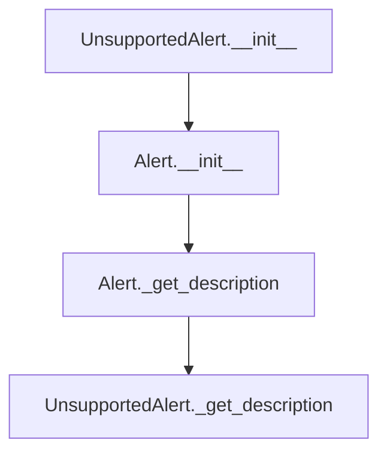

## Raises:
- No explicit exceptions raised during initialization
- Inherits all exceptions from Alert.__init__

## Example:
```python
# Create an unsupported alert for a column
alert = UnsupportedAlert(
    column_name="phone_numbers",
    values={"detected_type": "mixed_strings"}
)

# Get the formatted description
description = alert._get_description()
# Returns: "[phone_numbers] is an unsupported type, check if it needs cleaning or further analysis"

# Access alert properties
print(alert.alert_type)  # Output: AlertType.UNSUPPORTED
print(alert.column_name)  # Output: "phone_numbers"
```

### `src.ydata_profiling.model.alerts.UnsupportedAlert.__init__` · *method*

## Summary:
Initializes an UnsupportedAlert instance with specified properties, setting its alert type to UNSUPPORTED.

## Description:
The `__init__` method constructs an UnsupportedAlert object by delegating to its parent Alert class constructor with the predefined alert type of UNSUPPORTED. This method is responsible for initializing the alert's core properties including values, column name, and empty status flags. It ensures that all UnsupportedAlert instances are properly configured with the correct alert type while maintaining consistency with the base Alert class interface.

## Args:
    values (Optional[Dict], default: None): Dictionary containing additional metadata or values associated with the alert
    column_name (Optional[str], default: None): Name of the column that triggered this alert
    is_empty (bool, default: False): Boolean flag indicating whether the column is empty

## Returns:
    None: This method initializes the object state but does not return any value

## Raises:
    No explicit exceptions are raised by this method; any exceptions would originate from the parent Alert.__init__ method

## State Changes:
    Attributes READ: None
    Attributes WRITTEN: 
    - self.alert_type: Set to AlertType.UNSUPPORTED
    - self.values: Set to the provided values parameter or empty dict
    - self.column_name: Set to the provided column_name parameter
    - self._is_empty: Set to the provided is_empty parameter
    - self.fields: Set via parent class initialization

## Constraints:
    Preconditions:
    - The AlertType.UNSUPPORTED constant must be defined and accessible
    - All parameters should be compatible with the parent Alert class constructor requirements
    
    Postconditions:
    - The created instance will have alert_type equal to AlertType.UNSUPPORTED
    - The instance will maintain proper inheritance from Alert class

## Side Effects:
    None: This method performs no I/O operations or external service calls

### `src.ydata_profiling.model.alerts.UnsupportedAlert._get_description` · *method*

## Summary:
Returns a formatted string describing an unsupported column type alert.

## Description:
This method generates a human-readable description for an UnsupportedAlert instance, indicating that a specific column contains data of an unsupported type that may require cleaning or further analysis. It is called during the alert reporting phase to provide contextual information about the nature of the unsupported data type.

## Args:
    None

## Returns:
    str: A formatted string describing the unsupported column type with the column name embedded in brackets.

## Raises:
    None

## State Changes:
    Attributes READ: self.column_name
    Attributes WRITTEN: None

## Constraints:
    Preconditions: The method assumes self.column_name is properly initialized and contains a valid string value.
    Postconditions: The returned string follows a consistent format pattern for all UnsupportedAlert instances.

## Side Effects:
    None

## `src.ydata_profiling.model.alerts.ZerosAlert` · *class*

## Summary:
Represents an alert for columns containing zero values during data profiling, providing detailed statistics or a general indication of predominant zeros.

## Description:
The ZerosAlert class extends the base Alert class to specifically handle data quality issues related to zero values in columns. It is designed to be instantiated when profiling identifies columns with significant zero values, either providing exact counts and percentages or indicating a general pattern of predominantly zeros. This alert type helps data analysts quickly identify columns that may require special attention due to excessive zero values, which could indicate data entry issues, missing data patterns, or legitimate data characteristics.

## State:
- values: Optional[Dict], dictionary containing zero value statistics with keys 'n_zeros' (integer count) and 'p_zeros' (float percentage); can be None when only general information is available
- column_name: Optional[str], name of the column that triggered the alert; can be None when alert is created without column context
- is_empty: bool, flag indicating if the alert represents an empty state; defaults to False

## Lifecycle:
- Creation: Instantiate with optional values dictionary, column name, and is_empty flag; inherits initialization from Alert parent class
- Usage: Typically accessed through the alert system's reporting mechanisms; uses inherited methods like fmt() for display formatting
- Destruction: Managed by Python's garbage collection; no explicit cleanup required

## Method Map:
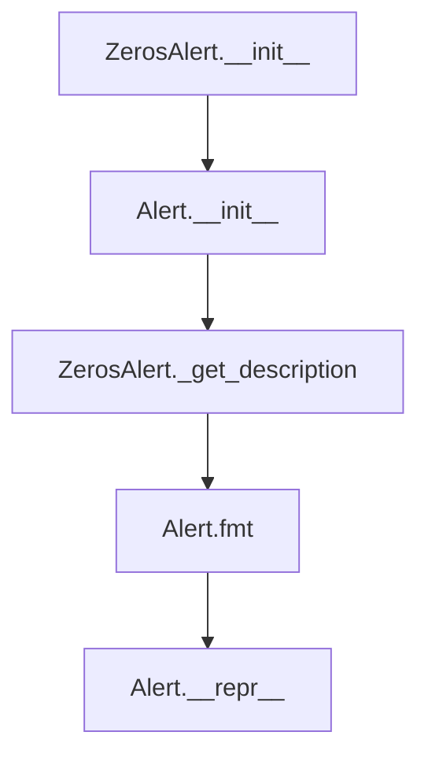

## Raises:
- No explicit exceptions raised during initialization; inherits error handling from Alert parent class

## Example:
```python
# Create a ZerosAlert with detailed statistics
alert_with_stats = ZerosAlert(
    values={'n_zeros': 150, 'p_zeros': 0.15},
    column_name='sales_amount',
    is_empty=False
)

# Create a ZerosAlert with general information
alert_general = ZerosAlert(
    values=None,
    column_name='inventory_count',
    is_empty=False
)

# Display formatted alerts
print(alert_with_stats.fmt())  # Shows detailed zero statistics
print(alert_general.fmt())     # Shows general "predominantly zeros" message
```

### `src.ydata_profiling.model.alerts.ZerosAlert.__init__` · *method*

## Summary:
Initializes a ZerosAlert instance with specific alert type, values, column name, and field set for zero-count tracking.

## Description:
The ZerosAlert constructor sets up an alert specifically designed to identify columns with zero values in data profiling. It inherits from the base Alert class and configures the alert to track zero counts (both absolute and percentage) through the defined fields. This method centralizes the initialization logic for zero-related alerts, ensuring consistent alert creation across the profiling system.

## Args:
    values (Optional[Dict]): Dictionary containing zero count statistics with keys 'n_zeros' and 'p_zeros'. Defaults to None.
    column_name (Optional[str]): Name of the column being analyzed for zeros. Defaults to None.
    is_empty (bool): Flag indicating if the dataset/column is empty. Defaults to False.

## Returns:
    None: This method initializes the object's state but does not return a value.

## Raises:
    No explicit exceptions are raised by this method directly.

## State Changes:
    Attributes READ: None
    Attributes WRITTEN: 
    - self.fields: Set containing {"n_zeros", "p_zeros"}
    - self.alert_type: Set to AlertType.ZEROS
    - self.values: Set to the provided values parameter or empty dict
    - self.column_name: Set to the provided column_name parameter
    - self._is_empty: Set to the provided is_empty parameter

## Constraints:
    Preconditions:
    - The alert_type parameter in the parent constructor must be AlertType.ZEROS
    - The fields parameter must contain exactly "n_zeros" and "p_zeros"
    - Values dictionary, if provided, must contain the required keys for zero counting
    
    Postconditions:
    - The alert instance will have its alert_type properly set to ZEROS
    - The fields attribute will contain exactly the two zero-tracking fields
    - All provided parameters will be stored in their respective instance attributes

## Side Effects:
    None: This method performs no I/O operations, external service calls, or mutations to objects outside self.

### `src.ydata_profiling.model.alerts.ZerosAlert._get_description` · *method*

## Summary:
Returns a human-readable description of zero values in a column, indicating either the exact count and percentage or a general "predominantly zeros" message.

## Description:
This method generates a descriptive string that communicates the presence of zero values in a data column. When detailed statistics are available (via the `values` attribute), it provides the exact number of zeros and their percentage. Otherwise, it indicates that the column contains predominantly zeros. This method is part of the alert system for identifying columns with significant zero values during data profiling.

## Args:
    None

## Returns:
    str: A formatted description string describing the zero value characteristics of the column. Format depends on availability of detailed statistics:
        - When `self.values` is not None: "[column_name] has n_zeros (p_zeros%) zeros"
        - When `self.values` is None: "[column_name] has predominantly zeros"

## Raises:
    None explicitly raised

## State Changes:
    Attributes READ: 
        - self.values (Optional[Dict])
        - self.column_name (str)

## Constraints:
    Preconditions:
        - The method assumes `self.column_name` is properly initialized
        - The method assumes `self.values` is either None or a dictionary containing keys 'n_zeros' and 'p_zeros'
        
    Postconditions:
        - Always returns a string describing zero values in the column
        - The returned string follows a consistent format for reporting zero value statistics

## Side Effects:
    None

## `src.ydata_profiling.model.alerts.RejectedAlert` · *class*

## Summary:
Represents an alert indicating that a column was rejected during data profiling due to failing validation criteria.

## Description:
The RejectedAlert class is a specialized subclass of Alert designed to signal when a column has been rejected from further analysis because it did not meet specified validation requirements. This alert type is typically generated when data quality checks fail, such as when a column contains invalid values, violates business rules, or cannot be processed according to configured settings. The class inherits all standard alert functionality while providing a specific description format for rejected columns.

## State:
- Inherits all attributes from Alert parent class:
  - alert_type: AlertType.REJECTED (constant)
  - values: Optional[Dict], additional contextual data about the rejection
  - column_name: Optional[str], name of the rejected column
  - _is_empty: bool, indicates if the alert represents an empty state
  - fields: Set[str], optional related field names
  - _anchor_id: str, cached identifier for UI linking

## Lifecycle:
- Creation: Instantiate with optional values, column_name, and is_empty parameters
- Usage: Typically created by profiling logic when validation fails; accessed via alert_type_name property and fmt() method for display
- Destruction: Managed by Python's garbage collection

## Method Map:
```mermaid
graph TD
    A[RejectedAlert.__init__] --> B[Alert.__init__]
    B --> C[Alert.alert_type_name]
    B --> D[Alert.anchor_id]
    B --> E[Alert.fmt]
    B --> F[RejectedAlert._get_description]
    F --> G[Alert.__repr__]
```

## Raises:
- No explicit exceptions raised during initialization
- Inherits all potential exceptions from Alert.__init__()

## Example:
```python
# Create a rejected alert for a column
from ydata_profiling.model.alerts import RejectedAlert

# Alert with column name
rejected_alert = RejectedAlert(
    column_name="invalid_column",
    values={"reason": "contains invalid characters"}
)

# Display the alert
print(rejected_alert.fmt())  # Shows formatted description
print(repr(rejected_alert))  # Shows string representation
```

### `src.ydata_profiling.model.alerts.RejectedAlert.__init__` · *method*

## Summary:
Initializes a RejectedAlert instance with specified properties, setting its alert type to REJECTED.

## Description:
The RejectedAlert constructor creates an instance of the RejectedAlert class, which inherits from Alert. This method configures the alert with the REJECTED alert type and initializes its core properties including values, column name, and empty status. It serves as a specialized constructor for alerts indicating that data has been rejected during the profiling process.

## Args:
    values (Optional[Dict], default: None): Dictionary containing additional metadata or values associated with the rejection.
    column_name (Optional[str], default: None): Name of the column that triggered this alert.
    is_empty (bool, default: False): Boolean flag indicating whether the data being analyzed is empty.

## Returns:
    None: This method does not return a value; it initializes the instance attributes.

## Raises:
    No explicit exceptions are raised by this method.

## State Changes:
    Attributes READ: None
    Attributes WRITTEN: 
    - self.alert_type: Set to AlertType.REJECTED
    - self.values: Set to the provided values parameter or empty dict
    - self.column_name: Set to the provided column_name parameter
    - self._is_empty: Set to the provided is_empty parameter

## Constraints:
    Preconditions:
    - The alert_type parameter must be AlertType.REJECTED (implicitly enforced by super().__init__ call)
    - All other parameters are optional and can accept None or default values
    
    Postconditions:
    - The instance will have its alert_type attribute set to AlertType.REJECTED
    - All provided parameters will be stored as instance attributes

## Side Effects:
    None: This method performs no I/O operations or external service calls.

### `src.ydata_profiling.model.alerts.RejectedAlert._get_description` · *method*

## Summary:
Returns a formatted string describing a rejected column alert.

## Description:
This method generates a human-readable description for a RejectedAlert instance, indicating which column was rejected. It is called during the alert reporting phase to provide contextual information about why a column failed validation or processing.

## Args:
    None

## Returns:
    str: A formatted string in the form "[column_name] was rejected" where column_name is the name of the rejected column.

## Raises:
    None

## State Changes:
    Attributes READ: self.column_name
    Attributes WRITTEN: None

## Constraints:
    Preconditions: The RejectedAlert instance must have a valid column_name attribute set during initialization.
    Postconditions: The returned string always follows the format "[column_name] was rejected".

## Side Effects:
    None

## `src.ydata_profiling.model.alerts.check_table_alerts` · *function*

## Summary:
Checks a dataset table for potential quality issues and returns a list of applicable alerts.

## Description:
Analyzes the provided table dictionary for common data quality problems such as duplicate rows and empty datasets. This function extracts key metrics from the table data and applies specific alerting logic to identify issues that require attention. The function is designed to be called during data profiling workflows to systematically detect and report on fundamental data quality concerns.

## Args:
    table (dict): Dictionary containing dataset statistics and metadata, including keys like 'n_duplicates', 'n', and other profiling metrics.

## Returns:
    List[Alert]: A list of Alert objects representing detected data quality issues. May be empty if no issues are found.

## Raises:
    None explicitly raised.

## Constraints:
    Preconditions:
        - The table dictionary must contain the required keys ('n_duplicates', 'n') for proper alert evaluation
        - All values in the table should be compatible with the alerting logic (numeric types for comparisons)
    Postconditions:
        - Always returns a list of Alert objects (empty or populated)
        - Does not modify the input table dictionary

## Side Effects:
    None.

## Control Flow:
```mermaid
flowchart TD
    A[Start check_table_alerts] --> B{Has n_duplicates > 0.01?}
    B -- Yes --> C[Create DuplicatesAlert]
    B -- No --> D[Skip DuplicatesAlert]
    D --> E{Is table['n'] == 0?}
    E -- Yes --> F[Create EmptyAlert]
    E -- No --> G[Skip EmptyAlert]
    G --> H[Return alerts list]
```

## Examples:
    >>> table_data = {
    ...     "n_duplicates": 150,
    ...     "n": 1000
    ... }
    >>> alerts = check_table_alerts(table_data)
    >>> print(len(alerts))
    1
    
    >>> empty_table = {
    ...     "n_duplicates": 0,
    ...     "n": 0
    ... }
    >>> alerts = check_table_alerts(empty_table)
    >>> print(len(alerts))
    1

## `src.ydata_profiling.model.alerts.numeric_alerts` · *function*

## Summary:
Generates a list of numeric data quality alerts based on statistical properties of numerical data columns.

## Description:
Processes numerical summary statistics to detect and create alerts for common data quality issues including skewness, infinite values, zero values, and uniform distributions. This function serves as a centralized alert generation point for numerical data profiling, extracting specific quality indicators from summary statistics and creating appropriate alert objects.

## Args:
    config (Settings): Configuration object containing threshold values for alert detection
    summary (dict): Dictionary containing numerical summary statistics for a data column

## Returns:
    List[Alert]: A list of Alert objects representing detected data quality issues, potentially including:
        - SkewedAlert: When skewness exceeds configured threshold
        - InfiniteAlert: When infinite value proportion exceeds alert threshold
        - ZerosAlert: When zero value proportion exceeds alert threshold
        - UniformAlert: When chi-squared test indicates uniform distribution

## Raises:
    None explicitly raised by this function

## Constraints:
    Preconditions:
        - config must be a valid Settings object with vars.num attributes containing threshold configurations
        - summary must be a dictionary containing required keys: "skewness", "p_infinite", "p_zeros"
        - summary may optionally contain "chi_squared" key with "pvalue" sub-key for uniform distribution detection
    Postconditions:
        - Always returns a list of Alert objects (possibly empty)
        - Does not modify input parameters

## Side Effects:
    None

## Control Flow:
```mermaid
flowchart TD
    A[Start numeric_alerts] --> B{skewness_alert check}
    B -- True --> C[Add SkewedAlert]
    B -- False --> D{alert_value p_infinite}
    D -- True --> E[Add InfiniteAlert]
    D -- False --> F{alert_value p_zeros}
    F -- True --> G[Add ZerosAlert]
    F -- False --> H{"chi_squared" in summary?}
    H -- Yes --> I{summary["chi_squared"]["pvalue"] > threshold?}
    I -- True --> J[Add UniformAlert]
    I -- False --> K[Return alerts]
    H -- No --> K
```

## Examples:
    # Basic usage with all alert types
    from ydata_profiling.config import Settings
    from ydata_profiling.model.alerts import numeric_alerts
    
    config = Settings()
    summary = {
        "skewness": 3.2,
        "p_infinite": 0.05,
        "p_zeros": 0.15,
        "chi_squared": {"pvalue": 0.03}
    }
    
    alerts = numeric_alerts(config, summary)
    # Returns list containing SkewedAlert, InfiniteAlert, ZerosAlert, and UniformAlert
    
    # Minimal usage with no alerts
    summary_empty = {
        "skewness": 0.1,
        "p_infinite": 0.001,
        "p_zeros": 0.002
    }
    
    alerts_empty = numeric_alerts(config, summary_empty)
    # Returns empty list

## `src.ydata_profiling.model.alerts.timeseries_alerts` · *function*

## Summary:
Generates time series-specific data quality alerts based on statistical properties and patterns detected in time series data.

## Description:
Processes time series summary statistics to identify and create alerts for non-stationary and seasonal patterns in data. This function builds upon the general numeric alerts by adding time series-specific detection logic, making it a specialized component for time series data profiling.

The function integrates with the broader alerting system by first generating standard numeric alerts through the `numeric_alerts` function, then extending those alerts with time series-specific conditions. This modular approach ensures that time series analysis benefits from both general data quality checks and domain-specific pattern detection.

Known callers within the codebase:
- Called by time series profiling pipelines when analyzing temporal data patterns
- Integrated into the main profiling workflow as part of the alert generation phase
- Triggered during time series column analysis where stationarity and seasonality tests are performed

This logic is extracted into its own function rather than being inlined because it separates time series-specific concerns from general numeric alert generation, enabling better maintainability and allowing for future expansion of time series alert types without affecting the core numeric alerting logic.

## Args:
    config (Settings): Configuration object containing profiling settings and thresholds
    summary (dict): Dictionary containing time series summary statistics including:
        - "stationary" (bool): Flag indicating if the time series is stationary
        - "seasonal" (bool): Flag indicating if the time series exhibits seasonal patterns
        - Other keys required by numeric_alerts function for general numeric alerts

## Returns:
    List[Alert]: A list of Alert objects representing detected data quality issues, including:
        - Alerts from numeric_alerts function (SkewedAlert, InfiniteAlert, ZerosAlert, UniformAlert)
        - NonStationaryAlert (when summary["stationary"] is False)
        - SeasonalAlert (when summary["seasonal"] is True)

## Raises:
    None explicitly raised by this function

## Constraints:
    Preconditions:
        - config must be a valid Settings object with proper configuration
        - summary must contain "stationary" and "seasonal" boolean keys
        - summary must contain all required keys for numeric_alerts function execution
    Postconditions:
        - Always returns a list of Alert objects (possibly empty)
        - Does not modify input parameters

## Side Effects:
    None

## Control Flow:
```mermaid
flowchart TD
    A[Start timeseries_alerts] --> B[Call numeric_alerts]
    B --> C{summary["stationary"] is False?}
    C -- Yes --> D[Append NonStationaryAlert]
    C -- No --> E{summary["seasonal"] is True?}
    E -- Yes --> F[Append SeasonalAlert]
    E -- No --> G[Return alerts]
    D --> G
    F --> G
```

## Examples:
    # Basic usage with stationary and seasonal data
    from ydata_profiling.config import Settings
    from ydata_profiling.model.alerts import timeseries_alerts
    
    config = Settings()
    summary = {
        "stationary": False,
        "seasonal": True,
        "skewness": 0.5,
        "p_infinite": 0.01,
        "p_zeros": 0.02
    }
    
    alerts = timeseries_alerts(config, summary)
    # Returns list containing numeric alerts plus NonStationaryAlert and SeasonalAlert
    
    # Usage with only numeric alerts
    summary_simple = {
        "stationary": True,
        "seasonal": False,
        "skewness": 2.1,
        "p_infinite": 0.001,
        "p_zeros": 0.002
    }
    
    alerts_simple = timeseries_alerts(config, summary_simple)
    # Returns list containing only numeric alerts (SkewedAlert, InfiniteAlert, ZerosAlert)

## `src.ydata_profiling.model.alerts.categorical_alerts` · *function*

## Summary:
Generates categorical data quality alerts based on statistical analysis of column summaries and configuration thresholds.

## Description:
The `categorical_alerts` function analyzes categorical column summaries and configuration settings to identify and generate appropriate data quality alerts. It evaluates various statistical indicators such as cardinality, uniform distribution, date formatting issues, constant string lengths, and distribution imbalance to provide comprehensive data quality feedback.

This function is part of the data profiling system's alert generation pipeline and serves as a centralized point for detecting common categorical data quality issues. It is called during the profiling process when categorical variables are analyzed, allowing for automated identification of potential data quality problems that may impact downstream analysis or modeling.

## Args:
    config (Settings): Configuration object containing categorical variable thresholds and settings
    summary (dict): Dictionary containing statistical summary information for a categorical column

## Returns:
    List[Alert]: A list of Alert objects representing detected data quality issues, potentially empty if no issues are found

## Raises:
    No explicit exceptions raised by this function itself

## Constraints:
    Preconditions:
    - config must be a valid Settings object with properly initialized categorical configuration
    - summary must be a dictionary containing relevant categorical statistics
    - All referenced keys in summary must exist or be safely handled with .get() methods
    
    Postconditions:
    - Returns a list of Alert instances (can be empty)
    - Does not modify the input parameters
    - All returned alerts are properly initialized Alert instances

## Side Effects:
    None - This function is pure and has no side effects

## Control Flow:
```mermaid
flowchart TD
    A[Start categorical_alerts] --> B{summary.n_distinct > threshold?}
    B -- Yes --> C[Add HighCardinalityAlert]
    B -- No --> D[Continue]
    D --> E{chi_squared in summary AND pvalue > threshold?}
    E -- Yes --> F[Add UniformAlert]
    E -- No --> G[Continue]
    G --> H{summary.date_warning?}
    H -- Yes --> I[Add TypeDateAlert]
    H -- No --> J[Continue]
    J --> K{composition in summary AND min_length == max_length?}
    K -- Yes --> L[Add ConstantLengthAlert]
    K -- No --> M[Continue]
    M --> N{imbalance in summary AND imbalance > threshold?}
    N -- Yes --> O[Add ImbalanceAlert]
    N -- No --> P[Return alerts]
    P --> Q[End]
```

## Examples:
```python
# Example 1: Basic usage with high cardinality
config = Settings()
summary = {
    "n_distinct": 100,
    "cardinality_threshold": 50
}
alerts = categorical_alerts(config, summary)
# Returns: [HighCardinalityAlert]

# Example 2: Multiple alerts
config = Settings()
summary = {
    "n_distinct": 100,
    "chi_squared": {"pvalue": 0.9995},
    "date_warning": True,
    "composition": {"min_length": 8, "max_length": 8},
    "imbalance": 0.75
}
alerts = categorical_alerts(config, summary)
# Returns: [HighCardinalityAlert, UniformAlert, TypeDateAlert, ConstantLengthAlert, ImbalanceAlert]
```

## `src.ydata_profiling.model.alerts.boolean_alerts` · *function*

## Summary:
Detects and reports imbalanced boolean distributions in datasets by analyzing summary statistics.

## Description:
The `boolean_alerts` function identifies potential data quality issues in boolean variables by checking if the distribution is significantly imbalanced. It evaluates the imbalance metric from the summary dictionary against a configurable threshold and generates an appropriate alert when the imbalance exceeds the defined limit. This function is part of the alert generation system that helps identify problematic data patterns during profiling.

The function is specifically designed to work with boolean variable summaries and integrates with the broader alerting framework. It extracts the imbalance value from the summary dictionary and compares it against a threshold configured in the Settings object under `config.vars.bool.imbalance_threshold`.

## Args:
- config (Settings): Configuration object containing profiling settings, specifically the boolean variable imbalance threshold
- summary (dict): Dictionary containing variable summary statistics, including an "imbalance" key if applicable

## Returns:
- List[Alert]: A list containing zero or one ImbalanceAlert objects when the imbalance exceeds the configured threshold

## Raises:
- No explicit exceptions raised by this function
- Implicitly raises exceptions from underlying configuration access if config structure is malformed

## Constraints:
- Preconditions:
  - The summary dictionary must be a valid dictionary object
  - The config parameter must be a properly initialized Settings object
  - The summary dictionary may optionally contain an "imbalance" key
- Postconditions:
  - The returned list will contain at most one ImbalanceAlert object
  - The function will not modify the input parameters

## Side Effects:
- No I/O operations or external state mutations
- No external service calls
- Pure function with no side effects

## Control Flow:
```mermaid
flowchart TD
    A[Start boolean_alerts] --> B{Is "imbalance" in summary?}
    B -- No --> C[Return empty alerts list]
    B -- Yes --> D{summary["imbalance"] > threshold?}
    D -- No --> C
    D -- Yes --> E[Create ImbalanceAlert]
    E --> F[Add to alerts list]
    F --> G[Return alerts list]
```

## Examples:
```python
# Example 1: No imbalance detected
config = Settings()
summary = {"count": 100, "unique": 2}
alerts = boolean_alerts(config, summary)
# Result: []

# Example 2: Imbalance detected
config = Settings()
config.vars.bool.imbalance_threshold = 0.7
summary = {"count": 100, "unique": 2, "imbalance": 0.85}
alerts = boolean_alerts(config, summary)
# Result: [ImbalanceAlert()]

# Example 3: Missing imbalance key
config = Settings()
summary = {"count": 100, "unique": 2}
alerts = boolean_alerts(config, summary)
# Result: []
```

## `src.ydata_profiling.model.alerts.generic_alerts` · *function*

## Summary:
Generates a list of alerts based on the percentage of missing values in a data summary.

## Description:
Processes a data summary dictionary to determine if missing value thresholds have been exceeded, returning a list of appropriate alerts. This function specifically evaluates the 'p_missing' field from the summary to decide whether to include a MissingAlert in the results. The function is part of the alert generation system that identifies data quality issues during profiling.

## Args:
    summary (dict): A dictionary containing data profiling summary information, including a 'p_missing' key with the percentage of missing values.

## Returns:
    List[Alert]: A list of Alert objects, currently containing at most one MissingAlert if the missing percentage exceeds the threshold.

## Raises:
    None explicitly raised.

## Constraints:
    Preconditions:
        - The summary dictionary must contain a 'p_missing' key with a numeric value
        - The value associated with 'p_missing' should be comparable to 0.01 (numeric comparison)
    Postconditions:
        - Always returns a list of Alert objects (possibly empty)
        - The returned list contains at most one MissingAlert if triggered

## Side Effects:
    None.

## Control Flow:
```mermaid
flowchart TD
    A[Start generic_alerts] --> B[Initialize empty alerts list]
    B --> C[Check if alert_value(summary["p_missing"]) is True]
    C -- Yes --> D[Create MissingAlert instance]
    D --> E[Append MissingAlert to alerts list]
    C -- No --> F[Skip alert creation]
    E --> G[Return alerts list]
    F --> G
```

## Examples:
    >>> summary = {"p_missing": 0.05}
    >>> alerts = generic_alerts(summary)
    >>> len(alerts)
    1
    >>> isinstance(alerts[0], MissingAlert)
    True
    
    >>> summary = {"p_missing": 0.001}
    >>> alerts = generic_alerts(summary)
    >>> len(alerts)
    0

## `src.ydata_profiling.model.alerts.supported_alerts` · *function*

## Summary:
Determines which alerts are applicable based on the distinct value count of a data column.

## Description:
This function evaluates the distinct value statistics from a data summary to identify applicable data quality alerts. It specifically checks for two conditions: when all values in a column are unique (n_distinct equals n) and when all values in a column are identical (n_distinct equals 1). These conditions indicate potential data quality issues that require attention during profiling.

The function is designed to be a pure utility that takes a summary dictionary and returns a list of appropriate Alert objects without side effects. It's part of the alerting system that helps identify problematic data patterns during automated profiling.

## Args:
    summary (dict): A dictionary containing column statistics including 'n' (total count) and 'n_distinct' (distinct value count)

## Returns:
    List[Alert]: A list of Alert objects representing applicable data quality issues. May be empty if no conditions are met.

## Raises:
    No explicit exceptions raised by this function

## Constraints:
    Preconditions:
    - The summary dictionary must contain both 'n' and 'n_distinct' keys
    - Both 'n' and 'n_distinct' values should be numeric
    
    Postconditions:
    - Returns a list of Alert objects (possibly empty)
    - Does not modify the input summary dictionary
    - Function execution is deterministic for the same input

## Side Effects:
    None - This function has no side effects as it only reads from the input dictionary and creates new Alert objects

## Control Flow:
```mermaid
flowchart TD
    A[Start: supported_alerts] --> B{summary['n_distinct'] == summary['n']}
    B -- True --> C[Append UniqueAlert()]
    B -- False --> D{summary['n_distinct'] == 1}
    D -- True --> E[Append ConstantAlert()]
    D -- False --> F[Return empty list]
    C --> G[Return alerts list]
    E --> G
    F --> G
```

## Examples:
```python
# Example 1: Column with all unique values
summary1 = {"n": 1000, "n_distinct": 1000}
alerts1 = supported_alerts(summary1)
# Returns [UniqueAlert()]

# Example 2: Column with constant values
summary2 = {"n": 500, "n_distinct": 1}
alerts2 = supported_alerts(summary2)
# Returns [ConstantAlert()]

# Example 3: Column with mixed values
summary3 = {"n": 100, "n_distinct": 50}
alerts3 = supported_alerts(summary3)
# Returns []
```

## `src.ydata_profiling.model.alerts.unsupported_alerts` · *function*

## Summary:
Returns a list containing predefined alert objects for unsupported and rejected data conditions.

## Description:
The `unsupported_alerts` function creates and returns a fixed list of two alert objects: `UnsupportedAlert` and `RejectedAlert`. These alerts represent fundamental data quality issues that commonly occur during dataset profiling - specifically, columns with unsupported data types and columns that failed validation and were rejected.

This function serves as a centralized factory for creating these standard alerts, promoting consistency and reusability throughout the profiling system. The function is intentionally simple and static, returning the same two alert instances regardless of input parameters.

The extraction of this logic into a separate function ensures that alert creation follows a consistent pattern and can be tested independently from the data analysis logic that determines when these alerts should be triggered.

## Args:
    summary (Dict[str, Any]): A dictionary containing profiling summary data. This parameter is currently unused in the function implementation and does not affect the return value.

## Returns:
    List[Alert]: A list containing exactly two Alert objects in a fixed order:
        - UnsupportedAlert(): Represents columns with data types not supported by the profiling system
        - RejectedAlert(): Represents columns that were rejected due to validation failures

## Raises:
    None: This function does not raise any exceptions under normal operation.

## Constraints:
    Preconditions:
        - The function does not validate or process the input `summary` parameter
        - The function assumes that `Alert`, `UnsupportedAlert`, and `RejectedAlert` classes are properly imported and available
    
    Postconditions:
        - Always returns a list with exactly two Alert objects
        - The returned list contains instances of UnsupportedAlert and RejectedAlert classes in that specific order

## Side Effects:
    None: This function has no side effects. It only instantiates and returns new Alert objects without modifying any external state or performing I/O operations.

## Control Flow:
```mermaid
flowchart TD
    A[unsupported_alerts function] --> B[Instantiate UnsupportedAlert()]
    B --> C[Instantiate RejectedAlert()]
    C --> D[Return list with both alert instances]
```

## Examples:
```python
# Basic usage to get standard alerts
from ydata_profiling.model.alerts import unsupported_alerts

alerts_list = unsupported_alerts({"some_key": "some_value"})
# Returns: [<UnsupportedAlert object>, <RejectedAlert object>]

# The function ignores the input parameter
empty_summary = {}
alerts = unsupported_alerts(empty_summary)
# Returns the same two alert objects regardless of input content
```

## `src.ydata_profiling.model.alerts.check_variable_alerts` · *function*

## Summary:
Generates a comprehensive list of data quality alerts for a given column based on its type and statistical properties.

## Description:
Processes a column's descriptive statistics to identify and create appropriate data quality alerts. This function serves as the central coordinator for alert generation, orchestrating calls to specialized alert functions based on the column's data type and characteristics. It handles both generic alerts that apply to all column types and type-specific alerts for supported data categories.

The function is called during the profiling process when analyzing individual columns to automatically detect potential data quality issues. It integrates with the broader alerting system by delegating to specialized alert generators and then attaching column metadata to each alert.

Known callers within the codebase:
- Invoked by the main profiling pipeline when processing individual columns
- Called during the variable analysis phase of data profiling workflows
- Triggered as part of automated data quality assessment routines

This logic is extracted into its own function rather than being inlined because it provides a clear separation of concerns between alert coordination and specific alert generation, making the system more maintainable and extensible. It also enables consistent attachment of column metadata to all generated alerts.

## Args:
    config (Settings): Configuration object containing profiling thresholds and settings
    col (str): Name of the column being analyzed
    description (dict): Dictionary containing statistical summary and type information for the column

## Returns:
    List[Alert]: A list of Alert objects representing detected data quality issues, potentially empty if no issues are found

## Raises:
    None explicitly raised by this function

## Constraints:
    Preconditions:
        - config must be a valid Settings object with properly initialized configuration
        - col must be a non-empty string representing a column name
        - description must be a dictionary containing required keys including "type"
        - description["type"] must be a valid string identifying the column data type
    Postconditions:
        - Returns a list of Alert instances (possibly empty)
        - All returned alerts have their column_name and values attributes properly set
        - Input parameters remain unmodified

## Side Effects:
    None - This function is pure and has no side effects

## Control Flow:
```mermaid
flowchart TD
    A[Start check_variable_alerts] --> B[Initialize empty alerts list]
    B --> C[Call generic_alerts(description)]
    C --> D[alerts += generic_alerts(description)]
    D --> E{description["type"] == "Unsupported"?}
    E -- Yes --> F[Call unsupported_alerts(description)]
    F --> G[alerts += unsupported_alerts(description)]
    E -- No --> H[Call supported_alerts(description)]
    H --> I[alerts += supported_alerts(description)]
    I --> J{description["type"] == "Categorical"?}
    J -- Yes --> K[Call categorical_alerts(config, description)]
    K --> L[alerts += categorical_alerts(config, description)]
    J -- No --> M{description["type"] == "Numeric"?}
    M -- Yes --> N[Call numeric_alerts(config, description)]
    N --> O[alerts += numeric_alerts(config, description)]
    M -- No --> P{description["type"] == "TimeSeries"?}
    P -- Yes --> Q[Call timeseries_alerts(config, description)]
    Q --> R[alerts += timeseries_alerts(config, description)]
    P -- No --> S{description["type"] == "Boolean"?}
    S -- Yes --> T[Call boolean_alerts(config, description)]
    T --> U[alerts += boolean_alerts(config, description)]
    S -- No --> V[End conditional checks]
    U --> V
    V --> W[Set column_name and values on all alerts]
    W --> X[Return alerts list]
```

## Examples:
    # Example 1: Unsupported column type
    config = Settings()
    description = {"type": "Unsupported"}
    alerts = check_variable_alerts(config, "invalid_col", description)
    # Returns: [UnsupportedAlert(), RejectedAlert()]
    
    # Example 2: Numeric column with multiple alerts
    config = Settings()
    description = {
        "type": "Numeric",
        "skewness": 3.2,
        "p_infinite": 0.05,
        "p_zeros": 0.15
    }
    alerts = check_variable_alerts(config, "numeric_col", description)
    # Returns: [SkewedAlert(), InfiniteAlert(), ZerosAlert()]
    
    # Example 3: Categorical column with high cardinality
    config = Settings()
    description = {
        "type": "Categorical",
        "n_distinct": 1000,
        "cardinality_threshold": 500
    }
    alerts = check_variable_alerts(config, "cat_col", description)
    # Returns: [HighCardinalityAlert()]
```

## `src.ydata_profiling.model.alerts.check_correlation_alerts` · *function*

## Summary:
Checks for high correlation alerts in dataset variables and generates appropriate alert objects for reporting.

## Description:
This function analyzes correlation matrices from different correlation methods to identify variables with high correlation values exceeding configured thresholds. It consolidates these correlations and creates HighCorrelationAlert objects for reporting. The function is part of the alerting system that detects data quality issues during profiling, specifically focusing on multicollinearity problems that can affect machine learning models.

The function is extracted into its own component to separate the correlation checking logic from the main profiling pipeline, allowing for cleaner code organization and easier testing of correlation detection independently.

## Args:
- config (Settings): Configuration object containing correlation settings including thresholds and warning flags for different correlation methods
- correlations (dict): Dictionary mapping correlation method names to their respective correlation matrices (pandas DataFrames)

## Returns:
- List[Alert]: A list of HighCorrelationAlert objects representing detected high correlation issues, or an empty list if no high correlations are found

## Raises:
- No explicit exceptions raised by this function
- Exceptions may propagate from underlying functions like perform_check_correlation

## Constraints:
- Preconditions: 
  - config.correlations must contain valid correlation configuration objects with warn_high_correlations and threshold attributes
  - correlations dictionary must contain valid pandas DataFrame correlation matrices
- Postconditions:
  - Returns a list of Alert objects (possibly empty)
  - Does not modify the input parameters

## Side Effects:
- No I/O operations
- No external state mutations
- No external service calls

## Control Flow:
```mermaid
flowchart TD
    A[Start check_correlation_alerts] --> B{config.correlations[corr].warn_high_correlations?}
    B -- Yes --> C[Get threshold]
    B -- No --> D[Skip correlation method]
    C --> E[Call perform_check_correlation]
    E --> F{Any correlations found?}
    F -- Yes --> G[Consolidate correlations]
    G --> H[Create HighCorrelationAlert objects]
    F -- No --> I[Continue to next method]
    H --> J[Return alerts list]
    D --> I
    I --> K{All methods processed?}
    K -- No --> B
    K -- Yes --> J
```

## Examples:
```python
# Basic usage with configuration
from ydata_profiling.config import Settings
from ydata_profiling.model.alerts import check_correlation_alerts

# Assuming config has correlation settings and correlations dict is populated
alerts = check_correlation_alerts(config, {"pearson": correlation_df})
# Returns list of HighCorrelationAlert objects if high correlations exist
```

## `src.ydata_profiling.model.alerts.get_alerts` · *function*

## Summary:
Aggregates data quality alerts from multiple analytical sources into a sorted list for reporting.

## Description:
Coordinates the collection of data quality alerts by invoking specialized alert-checking functions for table-level, variable-level, and correlation analyses. This function serves as the central aggregation point that gathers alerts from different profiling dimensions and ensures consistent sorting for presentation purposes.

Known callers within the codebase:
- Called by the main profiling pipeline during data analysis workflows
- Triggered as part of automated data quality assessment routines
- Invoked during report generation to compile all detected issues

This logic is extracted into its own function rather than being inlined because it provides a clear separation of concerns between the orchestration of alert generation and the specific alert-checking implementations. This modular approach makes the system more maintainable, testable, and extensible while ensuring consistent alert aggregation and sorting behavior.

## Args:
    config (Settings): Configuration object containing profiling thresholds and settings for alert generation
    table_stats (dict): Dictionary containing dataset-wide statistics and metadata for table-level alert checking
    series_description (dict): Dictionary mapping column names to their descriptive statistics and type information for variable-level alert checking
    correlations (dict): Dictionary mapping correlation method names to their respective correlation matrices for correlation-based alert checking

## Returns:
    List[Alert]: A sorted list of Alert objects representing all detected data quality issues across table, variable, and correlation dimensions. Returns an empty list if no issues are found.

## Raises:
    None explicitly raised by this function

## Constraints:
    Preconditions:
        - config must be a valid Settings object with properly initialized configuration
        - table_stats must be a dictionary containing required keys for table-level alert checking
        - series_description must be a dictionary mapping column names to valid descriptive statistics
        - correlations must be a dictionary containing valid correlation matrices
    Postconditions:
        - Returns a list of Alert instances (possibly empty)
        - Input parameters remain unmodified
        - All returned alerts are sorted by their alert type string representation

## Side Effects:
    None - This function is pure and has no side effects

## Control Flow:
```mermaid
flowchart TD
    A[Start get_alerts] --> B[Check table alerts]
    B --> C[Iterate through series descriptions]
    C --> D[Check variable alerts for each column]
    D --> E[Check correlation alerts]
    E --> F[Sort alerts by alert_type]
    F --> G[Return sorted alerts list]
```

## Examples:
    # Basic usage in profiling workflow
    from ydata_profiling.config import Settings
    from ydata_profiling.model.alerts import get_alerts
    
    config = Settings()
    table_stats = {"n_duplicates": 10, "n": 1000}
    series_description = {
        "col1": {"type": "Numeric", "skewness": 3.2},
        "col2": {"type": "Categorical", "n_distinct": 100}
    }
    correlations = {"pearson": correlation_matrix_df}
    
    alerts = get_alerts(config, table_stats, series_description, correlations)
    # Returns sorted list of alerts from all three alert types

## `src.ydata_profiling.model.alerts.alert_value` · *function*

## Summary:
Determines whether a numeric value should trigger an alert based on being a significant positive number.

## Description:
Checks if a given numeric value is both non-missing and greater than 0.01, indicating a potentially noteworthy positive value that may require attention or further investigation. This function is used to identify values that exceed a minimum threshold for alerting purposes within data profiling analysis.

## Args:
    value (float): The numeric value to evaluate for alert conditions.

## Returns:
    bool: True if the value is not null/missing and exceeds 0.01, False otherwise.

## Raises:
    None explicitly raised.

## Constraints:
    Preconditions:
        - Input value must be a numeric type compatible with pandas' isna function
        - Value should be comparable to 0.01 (numeric comparison)
    Postconditions:
        - Always returns a boolean value
        - Returns False for NaN/None values regardless of other conditions

## Side Effects:
    None.

## Control Flow:
```mermaid
flowchart TD
    A[Start alert_value] --> B{Is value NaN/None?}
    B -- Yes --> C[Return False]
    B -- No --> D{Is value > 0.01?}
    D -- Yes --> E[Return True]
    D -- No --> F[Return False]
```

## Examples:
    >>> alert_value(0.02)
    True
    >>> alert_value(0.005)
    False
    >>> alert_value(float('nan'))
    False
```

## `src.ydata_profiling.model.alerts.skewness_alert` · *function*

## Summary:
Determines if a skewness value indicates a significant deviation from normal distribution.

## Description:
Checks whether a given skewness value exceeds the specified threshold in either direction, signaling potential non-normal distribution. This function is used to generate alerts when data distributions deviate significantly from normality.

## Args:
    v (float): The skewness value to evaluate.
    threshold (int): The threshold value for determining significant skewness. Values beyond ±threshold indicate deviation from normal distribution.

## Returns:
    bool: True if the skewness value is significant (exceeds threshold in either direction) and not a missing value; False otherwise.

## Raises:
    None explicitly raised.

## Constraints:
    Preconditions:
        - The skewness value should be numeric
        - Threshold should be a positive integer
    Postconditions:
        - Returns boolean value indicating significance of skewness
        - Handles missing values appropriately

## Side Effects:
    None.

## Control Flow:
```mermaid
flowchart TD
    A[skewness_alert] --> B{v is not missing?}
    B -- Yes --> C{v < -threshold OR v > threshold?}
    C -- Yes --> D[Return True]
    C -- No --> E[Return False]
    B -- No --> F[Return False]
```

## Examples:
    # Normal distribution (low skewness)
    skewness_alert(0.1, 2)  # Returns False
    
    # Significant negative skewness
    skewness_alert(-3.5, 2)  # Returns True
    
    # Significant positive skewness
    skewness_alert(2.8, 2)  # Returns True
    
    # Missing value
    skewness_alert(float('nan'), 2)  # Returns False
```

## `src.ydata_profiling.model.alerts.type_date_alert` · *function*

## Summary:
Determines whether a pandas Series contains date-compatible values by attempting to parse each element.

## Description:
Checks if all elements in a pandas Series can be parsed as dates using the dateutil.parser.parse function. This function serves as an alert mechanism to identify Series that may contain date-like data but could have parsing issues.

## Args:
    series (pandas.Series): A pandas Series containing potentially date-like values to validate.

## Returns:
    bool: True if all elements in the series can be successfully parsed as dates, False otherwise.

## Raises:
    None explicitly raised, but may raise ParserError internally during parsing.

## Constraints:
    Preconditions:
        - Input must be a valid pandas Series object
        - Series should contain string-like or datetime-compatible values
    
    Postconditions:
        - Function returns a boolean value indicating date-parsability
        - No modifications are made to the input series

## Side Effects:
    None

## Control Flow:
```mermaid
flowchart TD
    A[Start type_date_alert] --> B{Apply parse to series}
    B --> C{ParserError raised?}
    C -->|Yes| D[Return False]
    C -->|No| E[Return True]
    D --> F[End]
    E --> F[End]
```

## Examples:
    # Valid date series
    series = pandas.Series(['2023-01-01', '2023-02-01', '2023-03-01'])
    result = type_date_alert(series)  # Returns True
    
    # Invalid date series
    series = pandas.Series(['2023-01-01', 'invalid-date', '2023-03-01'])
    result = type_date_alert(series)  # Returns False
    
    # Mixed valid/invalid series
    series = pandas.Series(['2023-01-01', '2023-02-01', 'not-a-date'])
    result = type_date_alert(series)  # Returns False
    
    # Empty series
    series = pandas.Series([], dtype=object)
    result = type_date_alert(series)  # Returns True (vacuous truth)
```

