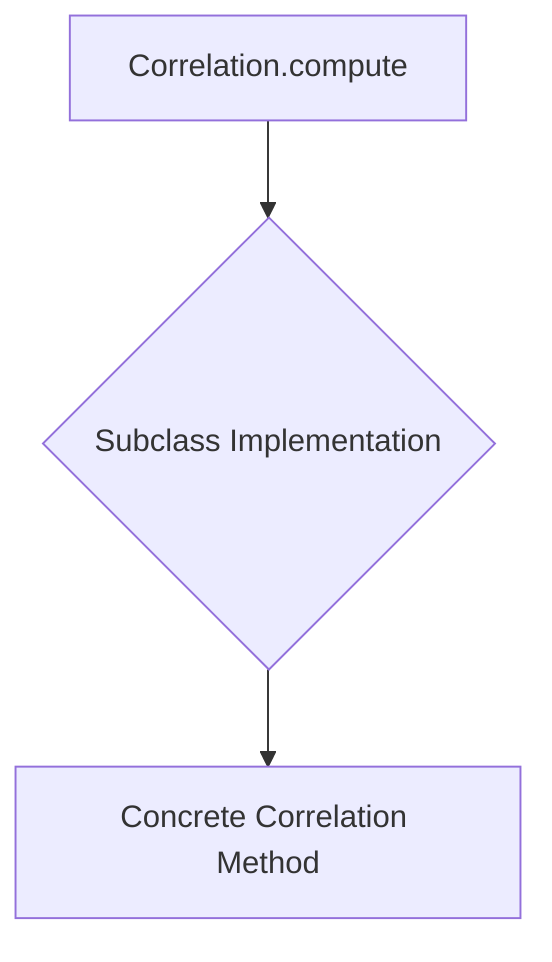
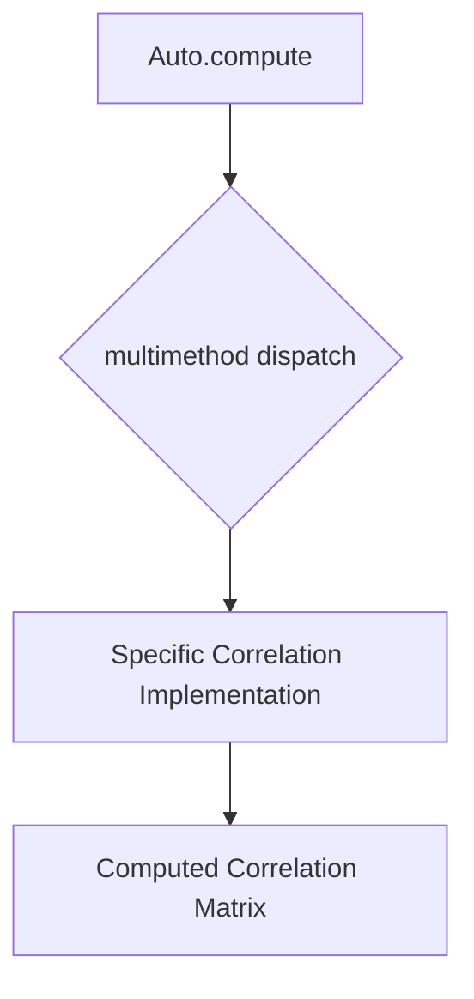
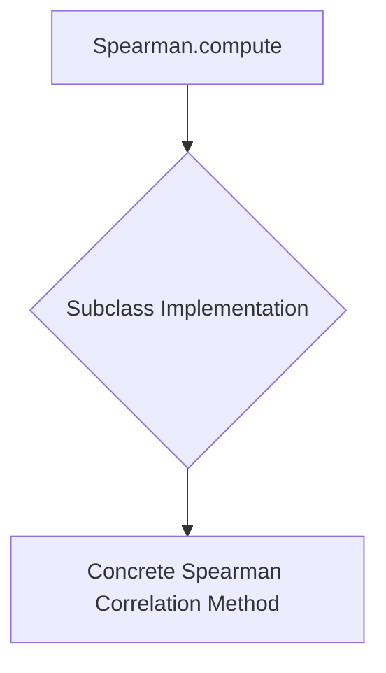
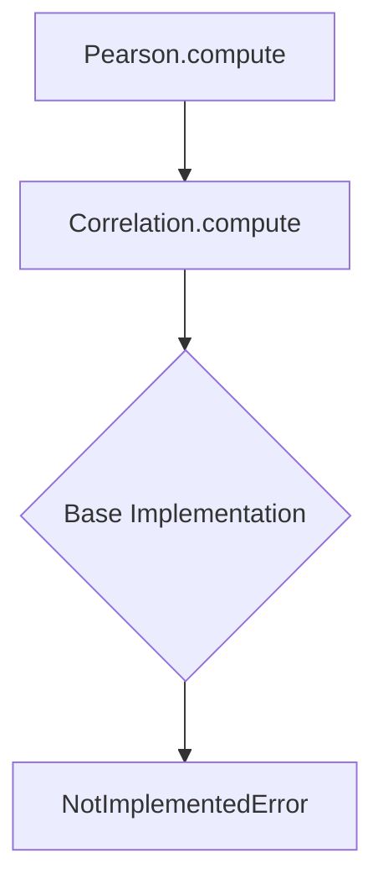
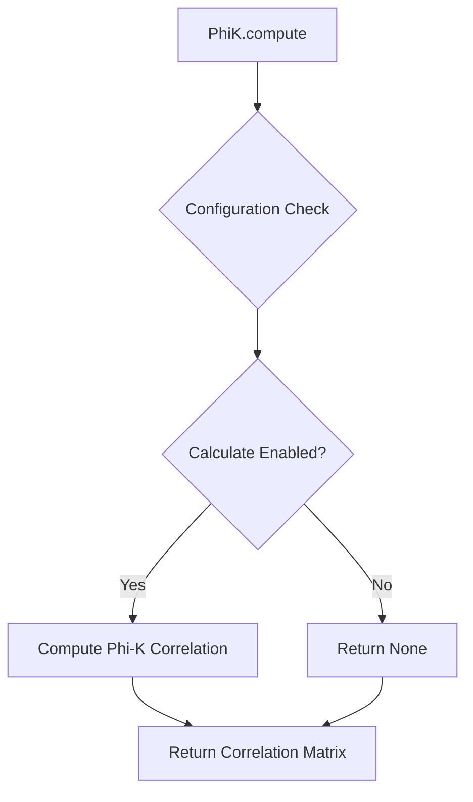
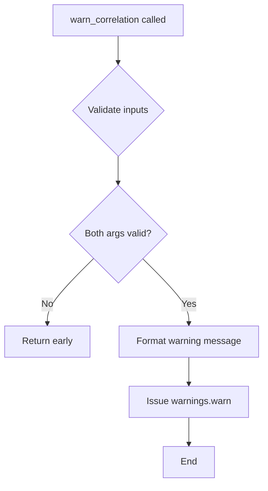
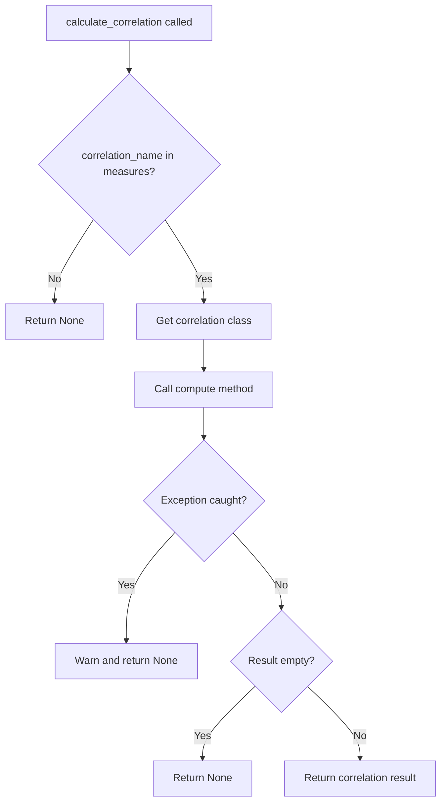
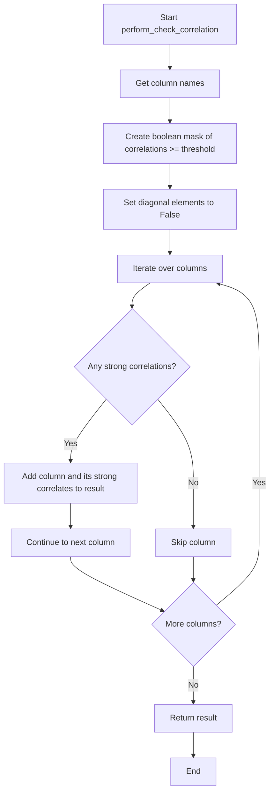

# `correlations.py`

## `src.ydata_profiling.model.correlations.Correlation` · *class*

## Summary:
A base class for computing correlations between variables in a dataset.

## Description:
The Correlation class serves as an abstract base class for implementing various correlation computation methods. It defines the interface that all correlation implementations must follow, providing a standardized way to calculate correlations between variables in a dataset. This class is part of the ydata-profiling library's model layer and is intended to be subclassed by concrete correlation implementations.

## State:
- config: Settings object containing configuration parameters for the correlation computation
- df: Sized object representing the dataset (typically a pandas DataFrame or similar structure)
- summary: dict containing pre-computed statistics about the dataset

## Lifecycle:
- Creation: The class is designed to be instantiated by subclasses that implement the compute method
- Usage: The compute static method is called with configuration, dataset, and summary parameters
- Destruction: No explicit cleanup required as this is a base class

## Method Map:


## Raises:
- NotImplementedError: Raised by the base implementation when called directly, indicating that subclasses must implement this method

## Example:
```python
# This would be implemented by subclasses
class PearsonCorrelation(Correlation):
    @staticmethod
    def compute(config: Settings, df: Sized, summary: dict) -> Optional[Sized]:
        # Implementation here
        pass

# Usage would be:
result = PearsonCorrelation.compute(settings, dataframe, summary_stats)
```

### `src.ydata_profiling.model.correlations.Correlation.compute` · *method*

## Summary:
Abstract method for computing correlation analysis on a dataset, currently raises NotImplementedError.

## Description:
This static method serves as the abstract interface for performing correlation analysis on a dataset. It is designed to be implemented by subclasses to provide concrete correlation computation functionality. The method coordinates correlation calculations based on configuration settings and returns correlation matrices or results.

When implemented, this method would handle different correlation computation strategies (Pearson, Spearman, etc.) according to the configuration in the Settings object. It would respect the correlation settings such as whether to calculate correlations, the warning threshold for high correlations, and binning parameters for discretization.

This method is part of the correlation analysis pipeline in ydata-profiling and is typically called during the profiling process when correlation analysis is requested.

## Args:
    config (Settings): Configuration object containing correlation settings and global profiling parameters
    df (Sized): Dataset to analyze for correlations, must support len() operation
    summary (dict): Pre-computed dataset summary information used for correlation calculations

## Returns:
    Optional[Sized]: Correlation matrix or results object if correlation analysis is enabled and successful, None otherwise

## Raises:
    NotImplementedError: This method is not yet implemented and always raises this exception

## State Changes:
    Attributes READ: 
    - config.correlations (accessed to determine which correlation methods to compute)
    - config.correlation_table (used to determine if correlation table should be included)
    - config.variables (accessed for variable metadata)
    Attributes WRITTEN: None

## Constraints:
    Preconditions:
    - config must be a valid Settings object with properly initialized correlation configurations
    - df must be a Sized object (supporting len() operation) representing the dataset
    - summary must be a dictionary containing pre-computed dataset statistics
    Postconditions:
    - Method always raises NotImplementedError (current implementation)
    - Future implementation will return correlation results or None based on configuration

## Side Effects:
    None directly observable side effects, though the method may indirectly cause:
    - Memory allocation for correlation matrices
    - Potential warnings about high correlations if configured
    - Access to external configuration sources through the Settings object

## `src.ydata_profiling.model.correlations.Auto` · *class*

## Summary:
The Auto class represents an abstract base implementation for automatically selecting and computing correlation analyses based on dataset characteristics and configuration settings.

## Description:
The Auto class serves as a specialized subclass of Correlation that implements automatic correlation selection logic. It provides the interface for computing correlations while delegating the actual computation to appropriate correlation methods based on data properties and configuration settings. This class is part of the ydata-profiling library's correlation analysis framework, enabling intelligent selection of correlation methods without explicit user specification.

The class is designed to be extended by concrete implementations that handle specific correlation computation strategies. It leverages the multimethod decorator to support multiple dispatch based on input types, allowing for flexible correlation computation approaches. The compute method is intentionally left unimplemented in this base class and must be overridden by subclasses.

## State:
- config: Settings object containing correlation configuration parameters
- df: Sized object representing the dataset being analyzed (typically a pandas DataFrame or Series)
- summary: dict containing pre-computed statistics about the dataset variables

## Lifecycle:
- Creation: The class is instantiated by subclasses that implement the compute method, not directly by users
- Usage: The static compute method is invoked with configuration, dataset, and summary parameters
- Destruction: No special cleanup required as this is a base class

## Method Map:


## Raises:
- NotImplementedError: Always raised by the base implementation, indicating that subclasses must override this method for actual correlation computation

## Example:
```python
# This would be implemented by subclasses
class AutoPearson(Auto):
    @staticmethod
    def compute(config: Settings, df: Sized, summary: dict) -> Optional[Sized]:
        # Implementation for automatic Pearson correlation selection
        pass

# Usage would be:
result = AutoPearson.compute(settings, dataframe, summary_stats)
```

### `src.ydata_profiling.model.correlations.Auto.compute` · *method*

## Summary:
Computes correlation analysis for a given dataset and configuration, returning the computed correlations or None if not applicable.

## Description:
This static method serves as the abstract interface for computing correlation matrices within the profiling framework. It is part of the Auto correlation class, which implements automatic correlation selection based on data characteristics. The method takes a configuration object, dataset, and summary dictionary as inputs and performs correlation analysis according to the specified settings. This base implementation raises NotImplementedError, requiring subclasses to provide concrete implementations for specific correlation types.

## Args:
    config (Settings): Configuration object containing profiling settings including correlation configurations
    df (Sized): Dataset to analyze for correlations, must support len() operation (typically a pandas DataFrame or Series)
    summary (dict): Pre-computed summary statistics for the dataset, containing variable-level information

## Returns:
    Optional[Sized]: Computed correlation matrix (typically a pandas DataFrame) or None if correlation analysis is not applicable or cannot be computed due to configuration or data issues

## Raises:
    NotImplementedError: Always raised by this base implementation, indicating subclass override is required for actual correlation computation

## State Changes:
    Attributes READ: None
    Attributes WRITTEN: None

## Constraints:
    Preconditions: 
    - config must be a valid Settings object with proper correlation configurations
    - df must be a Sized object (supporting len() operation) such as a pandas DataFrame or Series
    - summary must be a dictionary containing pre-computed statistics for the dataset
    Postconditions: None guaranteed

## Side Effects:
    None

## `src.ydata_profiling.model.correlations.Spearman` · *class*

## Summary:
A base class for computing Spearman rank correlation coefficients between variables in a dataset.

## Description:
The Spearman class serves as an abstract base class for implementing Spearman rank correlation computation methods. It extends the Correlation base class and defines the interface that all Spearman correlation implementations must follow, providing a standardized way to calculate Spearman rank correlations between variables in a dataset. This class is part of the ydata-profiling library's model layer and is intended to be subclassed by concrete Spearman correlation implementations.

## State:
- config: Settings object containing configuration parameters for the correlation computation
- df: Sized object representing the dataset (typically a pandas DataFrame or similar structure)
- summary: dict containing pre-computed statistics about the dataset

## Lifecycle:
- Creation: The class is designed to be instantiated by subclasses that implement the compute method
- Usage: The static compute method is called with configuration, dataset, and summary parameters
- Destruction: No explicit cleanup required as this is a base class

## Method Map:


## Raises:
- NotImplementedError: Raised by the base implementation when called directly, indicating that subclasses must implement this method

## Example:
```python
# This would be implemented by subclasses
class ConcreteSpearman(Spearman):
    @staticmethod
    def compute(config: Settings, df: Sized, summary: dict) -> Optional[Sized]:
        # Implementation here
        pass

# Usage would be:
result = ConcreteSpearman.compute(settings, dataframe, summary_stats)
```

### `src.ydata_profiling.model.correlations.Spearman.compute` · *method*

## Summary:
Abstract method for computing Spearman rank correlation coefficients between variables in a dataset.

## Description:
This static method serves as the abstract interface for performing Spearman rank correlation analysis on a dataset. Spearman correlation is a non-parametric measure that evaluates the monotonic relationship between two variables, making it suitable for ordinal data or when the relationship isn't strictly linear. This method is part of the Spearman class, which extends the Correlation base class to provide specific functionality for Spearman correlation analysis.

The method follows the standard correlation computation interface defined by the parent Correlation class, taking configuration, dataset, and summary parameters to produce correlation results. It is designed to be implemented by subclasses to provide concrete Spearman correlation computation functionality.

## Args:
    config (Settings): Configuration object containing correlation settings and global profiling parameters, including whether to calculate correlations and correlation thresholds
    df (Sized): Dataset to analyze for correlations, typically a pandas DataFrame or similar structure supporting len() operation
    summary (dict): Pre-computed summary statistics for the dataset, containing variable-level information and metadata

## Returns:
    Optional[Sized]: Computed Spearman correlation matrix as a pandas DataFrame or similar structure, or None if correlation analysis is disabled or not applicable

## Raises:
    NotImplementedError: This base implementation raises NotImplementedError, indicating that subclasses must provide the actual Spearman correlation computation logic

## State Changes:
    Attributes READ: 
    - config.correlations (accessed to determine which correlation methods to compute)
    - config.correlation_table (used to determine if correlation table should be included)
    - config.variables (accessed for variable metadata)
    Attributes WRITTEN: None

## Constraints:
    Preconditions:
    - config must be a valid Settings object with properly initialized correlation configurations
    - df must be a Sized object (supporting len() operation) representing the dataset
    - summary must be a dictionary containing pre-computed dataset statistics
    Postconditions:
    - Base implementation always raises NotImplementedError
    - Subclass implementation will return correlation results or None based on configuration

## Side Effects:
    None directly observable side effects, though the method may indirectly cause:
    - Memory allocation for correlation matrices
    - Potential warnings about high correlations if configured
    - Access to external configuration sources through the Settings object

## `src.ydata_profiling.model.correlations.Pearson` · *class*

## Summary:
Computes Pearson correlation coefficients for numerical variables in a dataset.

## Description:
This static method implements the Pearson correlation coefficient computation, a parametric measure of linear correlation between two continuous variables. Pearson correlation ranges from -1 to 1, where -1 indicates perfect negative linear correlation, 0 indicates no linear correlation, and 1 indicates perfect positive linear correlation. This method is part of the Pearson class, which extends the Correlation base class to provide specific functionality for Pearson correlation analysis.

The method follows the standard correlation computation interface defined by the parent Correlation class, taking configuration, dataset, and summary parameters to produce correlation results. It is designed to be called during the profiling process when Pearson correlation analysis is requested and enabled in the configuration.

## Args:
    config (Settings): Configuration object containing correlation settings and global profiling parameters, including whether to calculate correlations and correlation thresholds
    df (Sized): Dataset to analyze for correlations, typically a pandas DataFrame or similar structure supporting len() operation
    summary (dict): Pre-computed summary statistics for the dataset, containing variable-level information and metadata

## Returns:
    Optional[Sized]: Computed Pearson correlation matrix as a pandas DataFrame or similar structure, or None if correlation analysis is disabled or not applicable

## Raises:
    NotImplementedError: This method is currently not implemented and raises this exception to indicate that the actual implementation needs to be provided by subclasses

## State:
- config: Settings object containing correlation configuration parameters, specifically accessing the correlations dictionary which contains correlation method configurations
- df: Sized object representing the dataset (typically a pandas DataFrame)
- summary: dict containing pre-computed statistics about the dataset

## Lifecycle:
- Creation: Part of the Pearson class hierarchy that inherits from Correlation
- Usage: Called statically via Pearson.compute() with appropriate parameters during profiling
- Destruction: No explicit cleanup required as this is a static method

## Method Map:


## Example:
```python
# This would be called internally by the profiling system
# when Pearson correlation analysis is enabled in settings
# Note: This currently raises NotImplementedError
try:
    result = Pearson.compute(settings, dataframe, summary_stats)
except NotImplementedError:
    print("Pearson correlation computation not yet implemented")
```

### `src.ydata_profiling.model.correlations.Pearson.compute` · *method*

## Summary:
Computes Pearson correlation coefficients for numerical variables in a dataset.

## Description:
This static method implements the Pearson correlation coefficient computation, a parametric measure of linear correlation between two continuous variables. Pearson correlation ranges from -1 to 1, where -1 indicates perfect negative linear correlation, 0 indicates no linear correlation, and 1 indicates perfect positive linear correlation. This method is part of the Pearson class, which extends the Correlation base class to provide specific functionality for Pearson correlation analysis.

The method follows the standard correlation computation interface defined by the parent Correlation class, taking configuration, dataset, and summary parameters to produce correlation results. It is designed to be called during the profiling process when Pearson correlation analysis is requested and enabled in the configuration.

## Args:
    config (Settings): Configuration object containing correlation settings and global profiling parameters, including whether to calculate correlations and correlation thresholds
    df (Sized): Dataset to analyze for correlations, typically a pandas DataFrame or similar structure supporting len() operation
    summary (dict): Pre-computed summary statistics for the dataset, containing variable-level information and metadata

## Returns:
    Optional[Sized]: Computed Pearson correlation matrix as a pandas DataFrame or similar structure, or None if correlation analysis is disabled or not applicable

## Raises:
    NotImplementedError: This method is not yet implemented and raises this exception to indicate that subclasses must provide the actual implementation

## State Changes:
    Attributes READ: 
    - config.correlations (accessed to determine which correlation methods to compute)
    - config.correlation_table (used to determine if correlation table should be included)
    - config.variables (accessed for variable metadata)
    Attributes WRITTEN: None

## Constraints:
    Preconditions:
    - config must be a valid Settings object with properly initialized correlation configurations
    - df must be a Sized object (supporting len() operation) representing the dataset
    - summary must be a dictionary containing pre-computed dataset statistics
    Postconditions:
    - Method always raises NotImplementedError (current implementation)
    - Future implementation will return correlation results or None based on configuration

## Side Effects:
    None directly observable side effects, though the method may indirectly cause:
    - Memory allocation for correlation matrices
    - Potential warnings about high correlations if configured
    - Access to external configuration sources through the Settings object

## `src.ydata_profiling.model.correlations.Kendall` · *class*

## Summary:
Computes Kendall's tau correlation coefficient for ordinal or continuous variables in a dataset.

## Description:
This static method implements Kendall's tau correlation coefficient computation, a non-parametric measure of ordinal association between two variables. Kendall's tau is particularly suitable for datasets with tied ranks or when the relationship between variables is not strictly linear. This method is part of the Kendall class, which extends the Correlation base class to provide specific functionality for Kendall correlation analysis.

The method follows the standard correlation computation interface defined by the parent Correlation class, taking configuration, dataset, and summary parameters to produce correlation results. Currently, this implementation raises NotImplementedError, indicating that the actual computation logic needs to be implemented in a subclass.

## Args:
    config (Settings): Configuration object containing profiling settings including correlation configurations and global parameters
    df (Sized): Dataset to analyze for correlations, typically a pandas DataFrame or similar structure supporting len() operation
    summary (dict): Pre-computed summary statistics for the dataset, containing variable-level information and metadata

## Returns:
    Optional[Sized]: Computed Kendall's tau correlation matrix as a pandas DataFrame or similar structure, or None if correlation analysis is disabled or not applicable

## Raises:
    NotImplementedError: This method is not yet implemented and raises this exception to indicate that subclasses must provide the actual implementation

## State Changes:
    Attributes READ: 
    - config.correlations (accessed to determine which correlation methods to compute)
    - config.correlation_table (used to determine if correlation table should be included)
    - config.variables (accessed for variable metadata)
    Attributes WRITTEN: None

## Constraints:
    Preconditions:
    - config must be a valid Settings object with properly initialized correlation configurations
    - df must be a Sized object (supporting len() operation) representing the dataset
    - summary must be a dictionary containing pre-computed dataset statistics
    Postconditions:
    - Method raises NotImplementedError (current implementation)
    - Future implementation will return correlation results or None based on configuration

## Side Effects:
    None directly observable side effects, though the method may indirectly cause:
    - Memory allocation for correlation matrices
    - Potential warnings about high correlations if configured
    - Access to external configuration sources through the Settings object

### `src.ydata_profiling.model.correlations.Kendall.compute` · *method*

## Summary:
Computes Kendall's tau correlation coefficient for ordinal or continuous variables in a dataset.

## Description:
This static method implements Kendall's tau correlation coefficient computation, a non-parametric measure of ordinal association between two variables. Kendall's tau is particularly suitable for datasets with tied ranks or when the relationship between variables is not strictly linear. This method is part of the Kendall class, which extends the Correlation base class to provide specific functionality for Kendall correlation analysis.

The method follows the standard correlation computation interface defined by the parent Correlation class, taking configuration, dataset, and summary parameters to produce correlation results. Currently, this implementation raises NotImplementedError, indicating that the actual computation logic needs to be implemented in a subclass.

## Args:
    config (Settings): Configuration object containing profiling settings including correlation configurations and global parameters
    df (Sized): Dataset to analyze for correlations, typically a pandas DataFrame or similar structure supporting len() operation
    summary (dict): Pre-computed summary statistics for the dataset, containing variable-level information and metadata

## Returns:
    Optional[Sized]: Computed Kendall's tau correlation matrix as a pandas DataFrame or similar structure, or None if correlation analysis is disabled or not applicable

## Raises:
    NotImplementedError: This method is not yet implemented and raises this exception to indicate that subclasses must provide the actual implementation

## State Changes:
    Attributes READ: 
    - config.correlations (accessed to determine which correlation methods to compute)
    - config.correlation_table (used to determine if correlation table should be included)
    - config.variables (accessed for variable metadata)
    Attributes WRITTEN: None

## Constraints:
    Preconditions:
    - config must be a valid Settings object with properly initialized correlation configurations
    - df must be a Sized object (supporting len() operation) representing the dataset
    - summary must be a dictionary containing pre-computed dataset statistics
    Postconditions:
    - Method raises NotImplementedError (current implementation)
    - Future implementation will return correlation results or None based on configuration

## Side Effects:
    None directly observable side effects, though the method may indirectly cause:
    - Memory allocation for correlation matrices
    - Potential warnings about high correlations if configured
    - Access to external configuration sources through the Settings object

## `src.ydata_profiling.model.correlations.Cramers` · *class*

## Summary:
Computes Cramér's V correlation coefficient for categorical variables in a dataset.

## Description:
This static method implements Cramér's V correlation coefficient computation, a measure of association between categorical variables. Cramér's V is specifically designed for nominal (categorical) data and ranges from 0 to 1, where 0 indicates no association and 1 indicates perfect association. This method is part of the Cramers class, which extends the Correlation base class to provide specific functionality for categorical correlation analysis.

The method follows the standard correlation computation interface defined by the parent Correlation class, taking configuration, dataset, and summary parameters to produce correlation results. Currently, this implementation raises NotImplementedError, indicating that the actual computation logic needs to be implemented in a subclass.

## Args:
    config (Settings): Configuration object containing profiling settings including correlation configurations and global parameters
    df (Sized): Dataset to analyze for correlations, typically a pandas DataFrame or similar structure supporting len() operation
    summary (dict): Pre-computed summary statistics for the dataset, containing variable-level information and metadata

## Returns:
    Optional[Sized]: Computed Cramér's V correlation matrix as a pandas DataFrame or similar structure, or None if correlation analysis is disabled or not applicable

## Raises:
    NotImplementedError: This method is not yet implemented and raises this exception to indicate that subclasses must provide the actual implementation

## State Changes:
    Attributes READ: 
    - config.correlations (accessed to determine which correlation methods to compute)
    - config.correlation_table (used to determine if correlation table should be included)
    - config.variables (accessed for variable metadata)
    Attributes WRITTEN: None

## Constraints:
    Preconditions:
    - config must be a valid Settings object with properly initialized correlation configurations
    - df must be a Sized object (supporting len() operation) representing the dataset
    - summary must be a dictionary containing pre-computed dataset statistics
    Postconditions:
    - Method raises NotImplementedError (current implementation)
    - Future implementation will return correlation results or None based on configuration

## Side Effects:
    None directly observable side effects, though the method may indirectly cause:
    - Memory allocation for correlation matrices
    - Potential warnings about high correlations if configured
    - Access to external configuration sources through the Settings object

### `src.ydata_profiling.model.correlations.Cramers.compute` · *method*

## Summary:
Computes Cramér's V correlation coefficient for categorical variables in a dataset.

## Description:
This static method implements Cramér's V correlation coefficient computation, a measure of association between categorical variables. Cramér's V is specifically designed for nominal (categorical) data and ranges from 0 to 1, where 0 indicates no association and 1 indicates perfect association. This method is part of the Cramers class, which extends the Correlation base class to provide specific functionality for categorical correlation analysis.

The method follows the standard correlation computation interface defined by the parent Correlation class, taking configuration, dataset, and summary parameters to produce correlation results. Currently, this implementation raises NotImplementedError, indicating that the actual computation logic needs to be implemented in a subclass.

## Args:
    config (Settings): Configuration object containing profiling settings including correlation configurations and global parameters
    df (Sized): Dataset to analyze for correlations, typically a pandas DataFrame or similar structure supporting len() operation
    summary (dict): Pre-computed summary statistics for the dataset, containing variable-level information and metadata

## Returns:
    Optional[Sized]: Computed Cramér's V correlation matrix as a pandas DataFrame or similar structure, or None if correlation analysis is disabled or not applicable

## Raises:
    NotImplementedError: This method is not yet implemented and raises this exception to indicate that subclasses must provide the actual implementation

## State Changes:
    Attributes READ: 
    - config.correlations (accessed to determine which correlation methods to compute)
    - config.correlation_table (used to determine if correlation table should be included)
    - config.variables (accessed for variable metadata)
    Attributes WRITTEN: None

## Constraints:
    Preconditions:
    - config must be a valid Settings object with properly initialized correlation configurations
    - df must be a Sized object (supporting len() operation) representing the dataset
    - summary must be a dictionary containing pre-computed dataset statistics
    Postconditions:
    - Method raises NotImplementedError (current implementation)
    - Future implementation will return correlation results or None based on configuration

## Side Effects:
    None directly observable side effects, though the method may indirectly cause:
    - Memory allocation for correlation matrices
    - Potential warnings about high correlations if configured
    - Access to external configuration sources through the Settings object

## `src.ydata_profiling.model.correlations.PhiK` · *class*

## Summary:
Computes the Phi-K correlation matrix for categorical variables in a dataset.

## Description:
The PhiK class implements a specialized correlation computation method designed specifically for categorical variables. It extends the base Correlation class to provide Phi-K correlation coefficients, which quantify the association strength between pairs of categorical variables. This correlation measure is particularly useful in data profiling scenarios where understanding relationships between categorical features is important.

The class is intended to be subclassed by concrete implementations that provide the actual computation logic. The compute method serves as the entry point for correlation computation, taking configuration, dataset, and summary statistics as inputs.

## State:
- config: Settings object containing correlation configuration parameters including calculation flags and thresholds
- df: Sized object representing the dataset (typically a pandas DataFrame) containing categorical variables to correlate
- summary: dict containing pre-computed statistics about the dataset variables

## Lifecycle:
- Creation: The class is designed to be instantiated by subclasses that implement the compute method
- Usage: The static compute method is called with configuration, dataset, and summary parameters
- Destruction: No explicit cleanup required as this is a base class

## Method Map:


## Raises:
- NotImplementedError: Raised when the compute method is called directly on the base PhiK class, indicating that subclasses must implement this method

## Example:
```python
# Usage during correlation analysis
result = PhiK.compute(settings, dataframe, summary_stats)
# Returns correlation matrix if enabled, otherwise None
```

### `src.ydata_profiling.model.correlations.PhiK.compute` · *method*

## Summary:
Computes the Phi-K correlation matrix for categorical variables in a dataset.

## Description:
The PhiK.compute method implements the calculation of Phi-K correlation coefficients between categorical variables in a dataset. This correlation measure is specifically designed for categorical data and quantifies the association strength between pairs of categorical variables. The method is part of the PhiK correlation class, which extends the base Correlation class to provide specialized correlation computation for categorical variables.

This method is called during the correlation analysis phase of data profiling when the Phi-K correlation method is selected for computation. It takes the profiling configuration, dataset, and pre-computed summary statistics as inputs and returns the computed correlation matrix or None if computation is disabled.

## Args:
    config (Settings): Configuration object containing correlation settings including whether to calculate correlations and binning parameters
    df (Sized): Dataset object (typically a pandas DataFrame) containing the variables to correlate
    summary (dict): Pre-computed statistics about the dataset variables

## Returns:
    Optional[Sized]: The computed Phi-K correlation matrix if correlations are enabled in config, otherwise None

## Raises:
    NotImplementedError: This method is not implemented in the base PhiK class and must be overridden by subclasses

## State Changes:
    Attributes READ: 
    - config: Used to check correlation settings
    - df: Used as input data for correlation computation
    - summary: Used for pre-computed statistics
    
    Attributes WRITTEN: None

## Constraints:
    Preconditions:
    - config must be a valid Settings object with proper correlation configuration
    - df must be a Sized object (typically pandas DataFrame) with categorical variables
    - summary must be a dictionary containing pre-computed variable statistics
    
    Postconditions:
    - If config.correlations["phi_k"].calculate is True, returns a correlation matrix
    - If config.correlations["phi_k"].calculate is False, returns None

## Side Effects:
    None

## `src.ydata_profiling.model.correlations.warn_correlation` · *function*

## Summary:
Issues a warning message about correlation calculation failures with specific correlation name and error details.

## Description:
This function generates and issues a warning when correlation calculations fail, providing contextual information about which correlation method encountered an issue and what went wrong. It serves as a centralized warning mechanism for correlation-related computation errors.

## Args:
    correlation_name (str): The name of the correlation method that failed (e.g., "pearson", "spearman").
    error (str): A descriptive error message explaining the cause of the failure.

## Returns:
    None: This function does not return any value.

## Raises:
    None: This function does not raise any exceptions directly; it issues a warning via Python's warnings module.

## Constraints:
    Preconditions:
        - Both arguments must be non-empty strings.
        - The correlation_name should represent a valid correlation method identifier.
        - The error string should provide meaningful diagnostic information.

    Postconditions:
        - A warning is issued to the Python warnings system.
        - No state changes occur outside of the warning mechanism.

## Side Effects:
    - Issues a warning message to Python's warnings system.
    - May result in user-facing console output if warnings are not filtered.

## Control Flow:


## Examples:
```python
# Example usage when correlation calculation fails
warn_correlation("pearson", "Insufficient data for correlation calculation")
# Output: User sees a warning about pearson correlation failing due to insufficient data
```

## `src.ydata_profiling.model.correlations.calculate_correlation` · *function*

## Summary:
Computes correlation matrices for a dataset using specified correlation methods, with automatic error handling and validation.

## Description:
The `calculate_correlation` function serves as the central dispatcher for correlation computations in the ydata-profiling library. It selects and executes the appropriate correlation method based on the provided correlation name, handles various error conditions gracefully, and ensures proper validation of results before returning them.

This function is called during the profiling process when correlation analysis is requested. It acts as a bridge between the configuration-driven correlation selection and the actual computation implementations, which are provided by specialized classes like Pearson, Spearman, etc.

The function encapsulates the logic for:
1. Mapping correlation names to their respective implementation classes
2. Executing the correlation computation with proper error handling
3. Validating computed results to ensure they contain meaningful data
4. Returning appropriate results or None based on success/failure conditions

## Args:
    config (Settings): Configuration object containing profiling settings including correlation method preferences and thresholds
    df (Sized): Dataset to analyze for correlations, typically a pandas DataFrame or similar structure supporting len() operation
    correlation_name (str): Name of the correlation method to use (e.g., "auto", "pearson", "spearman", "kendall", "cramers", "phi_k")
    summary (dict): Pre-computed summary statistics for the dataset, containing variable-level information and metadata

## Returns:
    Optional[Sized]: Computed correlation matrix as a pandas DataFrame or similar structure, or None if:
    - The specified correlation method is not supported
    - The correlation computation fails due to invalid data or configuration
    - The computed correlation matrix is empty or contains no valid correlations

## Raises:
    None: This function does not raise exceptions directly, though it catches and handles several exception types internally

## Constraints:
    Preconditions:
    - config must be a valid Settings object with properly initialized correlation configurations
    - df must be a Sized object (supporting len() operation) representing the dataset
    - correlation_name must be one of the supported correlation method names
    - summary must be a dictionary containing pre-computed dataset statistics
    Postconditions:
    - Function returns either a valid correlation matrix or None
    - No side effects beyond issuing warnings for computation failures

## Side Effects:
    - Issues warnings via Python's warnings module when correlation computations fail
    - May cause memory allocation for correlation matrices during computation
    - Accesses external configuration sources through the Settings object

## Control Flow:


## Examples:
```python
# Basic usage with valid configuration
config = Settings()
df = pd.DataFrame({'A': [1, 2, 3], 'B': [4, 5, 6]})
summary = {'variables': {}}
result = calculate_correlation(config, df, 'pearson', summary)
# Returns computed Pearson correlation matrix or None

# Usage with unsupported correlation method
result = calculate_correlation(config, df, 'invalid_method', summary)
# Returns None without raising exception

# Usage with computation failure (will issue warning)
result = calculate_correlation(config, df, 'spearman', summary)
# Returns None and issues warning if spearman computation fails
```

## `src.ydata_profiling.model.correlations.perform_check_correlation` · *function*

## Summary:
Identifies pairs of columns in a correlation matrix that exceed a specified threshold, returning a mapping of columns to their highly correlated counterparts.

## Description:
This function processes a correlation matrix to find column pairs with absolute correlation values exceeding a given threshold. It is designed to detect multicollinearity among features in datasets, which is useful for feature selection and model diagnostics. The function filters out self-correlations (diagonal elements) and only returns columns that have at least one strongly correlated partner.

## Args:
    correlation_matrix (pd.DataFrame): A square correlation matrix where rows and columns represent features, and values are correlation coefficients between -1 and 1.
    threshold (float): Minimum absolute correlation value required for a pair to be considered strongly correlated. Must be between 0 and 1 inclusive.

## Returns:
    Dict[str, List[str]]: A dictionary mapping each column name to a list of column names that have absolute correlations greater than or equal to the threshold. Columns with no strong correlations are excluded from the result.

## Raises:
    None explicitly raised by this function.

## Constraints:
    Preconditions:
        - The correlation_matrix must be a square DataFrame with numeric values.
        - The threshold must be a float between 0 and 1 inclusive.
    Postconditions:
        - The returned dictionary will only include keys for columns that have at least one strongly correlated column.
        - All values in the returned dictionary are lists of column names from the original correlation matrix.
        - The function does not modify the input correlation_matrix.

## Side Effects:
    None.

## Control Flow:


## Examples:
```python
import pandas as pd
import numpy as np

# Example usage
corr_matrix = pd.DataFrame({
    'A': [1.0, 0.8, 0.2],
    'B': [0.8, 1.0, 0.1],
    'C': [0.2, 0.1, 1.0]
})

result = perform_check_correlation(corr_matrix, 0.7)
# Returns {'A': ['B'], 'B': ['A']} - A and B are strongly correlated

# Another example with multiple correlations
corr_matrix2 = pd.DataFrame({
    'X': [1.0, 0.9, 0.3, 0.1],
    'Y': [0.9, 1.0, 0.2, 0.05],
    'Z': [0.3, 0.2, 1.0, 0.8],
    'W': [0.1, 0.05, 0.8, 1.0]
})

result2 = perform_check_correlation(corr_matrix2, 0.5)
# Returns {'X': ['Y'], 'Y': ['X'], 'Z': ['W'], 'W': ['Z']}
```

## `src.ydata_profiling.model.correlations.get_active_correlations` · *function*

## Summary:
Filters and returns correlation method names that are enabled for calculation based on configuration settings.

## Description:
This function examines the correlation configuration and returns a list of correlation method names where the 'calculate' flag is set to True. It acts as a filter to determine which correlation analyses should be computed during the profiling process.

The function is typically called during the profiling pipeline initialization phase when preparing which correlation calculations to execute, ensuring computational efficiency by only processing enabled correlations.

## Args:
    config (Settings): Configuration object containing correlation settings with calculate flags

## Returns:
    List[str]: A list of correlation method names that have their calculate flag set to True

## Raises:
    None explicitly raised

## Constraints:
    Preconditions:
        - The config parameter must be a valid Settings object
        - The config.correlations attribute must be a dictionary-like object with string keys
        - Each value in config.correlations must have a 'calculate' attribute that is boolean

    Postconditions:
        - Returns an empty list if no correlations are enabled for calculation
        - Returns a list containing only correlation names where config.correlations[name].calculate is True

## Side Effects:
    None

## Control Flow:
```mermaid
flowchart TD
    A[Start get_active_correlations] --> B{config.correlations.keys()}
    B --> C[Iterate through correlation names]
    C --> D{config.correlations[name].calculate}
    D -- True --> E[Add to result list]
    D -- False --> F[Skip]
    E --> G{More names?}
    F --> G
    G -- Yes --> C
    G -- No --> H[Return result list]
```

## Examples:
    # Basic usage
    active_correlations = get_active_correlations(settings_config)
    # Returns ['pearson', 'spearman'] if those are enabled in config
    
    # When no correlations are enabled
    active_correlations = get_active_correlations(disabled_config)
    # Returns [] (empty list)

