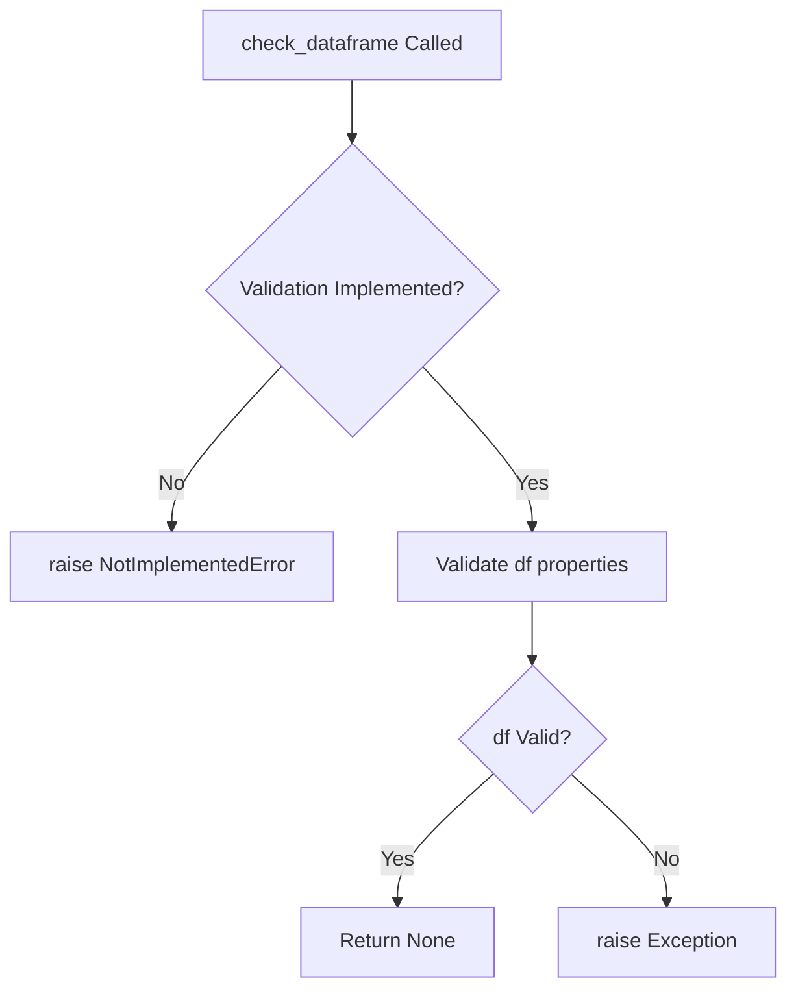
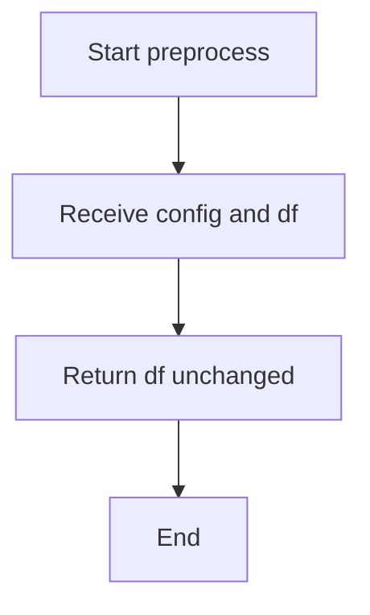

# `dataframe.py`

## `src.ydata_profiling.model.dataframe.check_dataframe` · *function*

## Summary:
Validates DataFrame input for compatibility with the profiling pipeline.

## Description:
This function performs validation checks on DataFrame objects to ensure they meet the requirements for profiling. It is designed to be called early in the data processing pipeline to catch incompatible or malformed DataFrames before proceeding with analysis. The function currently raises NotImplementedError, indicating that the full implementation is pending.

## Args:
    df (Any): Input object expected to be a pandas DataFrame or compatible structure.

## Returns:
    None: This function does not return any value.

## Raises:
    NotImplementedError: Indicates that the validation logic has not yet been implemented.

## Constraints:
    Preconditions: The input must be a valid DataFrame-like object.
    Postconditions: None, as the function does not return anything.

## Side Effects:
    None: This function does not perform any I/O operations or mutate external state.

## Control Flow:


## Examples:
    Not applicable due to NotImplementedError.

## `src.ydata_profiling.model.dataframe.preprocess` · *function*

## Summary:
Provides a standardized preprocessing interface for DataFrames in the profiling pipeline.

## Description:
This function acts as a designated entry point for DataFrame preprocessing within the profiling system. It serves as a bridge between the raw input data and the profiling analysis components, providing a consistent interface for potential future preprocessing operations while maintaining backward compatibility.

The function is called by the main profiling workflow to ensure all input data follows a standardized preprocessing protocol. Although currently implemented as a simple passthrough, it's designed to support configuration-driven transformations and data preparation steps that may be added in future versions.

## Args:
    config (Settings): Configuration object containing profiling settings that may influence preprocessing behavior.
    df (Any): Input DataFrame or data structure to be prepared for profiling. Type is generic to accommodate various data formats.

## Returns:
    Any: The DataFrame or data structure, returned unchanged in the current implementation. Future implementations may modify the data based on configuration settings.

## Raises:
    None: This function does not explicitly raise any exceptions.

## Constraints:
    Preconditions:
        - config must be a valid Settings object instance
        - df must be a valid data structure compatible with downstream processing
    
    Postconditions:
        - The returned value maintains the same data structure as the input df
        - No modifications are made to the input df in the current implementation

## Side Effects:
    None: This function has no observable side effects beyond returning the input DataFrame.

## Control Flow:


## Examples:
```python
# Basic usage in profiling pipeline
from ydata_profiling.config import Settings
import pandas as pd

config = Settings()
df = pd.DataFrame({'A': [1, 2, 3], 'B': [4, 5, 6]})
processed_df = preprocess(config, df)
# processed_df contains the same data as df
```

