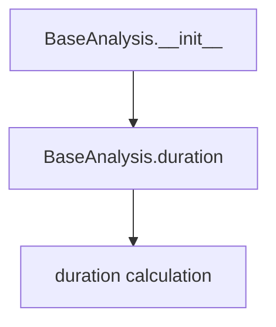
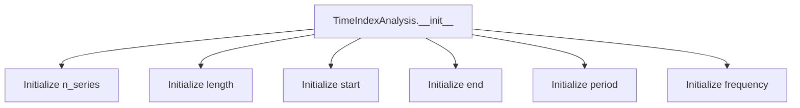
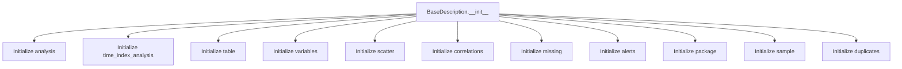

# `description.py`

## `src.ydata_profiling.model.description.BaseAnalysis` · *class*

## Summary:
BaseAnalysis is a base class for time-based analysis operations that stores metadata and calculates duration between date ranges.

## Description:
BaseAnalysis provides a foundation for time-based analysis implementations by storing a title and date range information. It supports both single datetime ranges and multiple datetime ranges through list handling. The class is designed to be subclassed by more specific analysis types that require time-based calculations and duration computations.

## State:
- title: str - The name or identifier of the analysis
- date_start: Union[datetime, List[datetime]] - The starting date(s) of the analysis period
- date_end: Union[datetime, List[datetime]] - The ending date(s) of the analysis period

The constructor accepts title as a string and date_start/date_end as datetime objects or lists of datetime objects. All three attributes are initialized in __init__ and are immutable after construction.

## Lifecycle:
- Creation: Instantiate with title (str), date_start (datetime or List[datetime]), and date_end (datetime or List[datetime])
- Usage: Access the duration property to calculate time differences
- Destruction: Standard Python garbage collection handles cleanup

## Method Map:


## Raises:
- ValueError: When date_start and date_end types don't match (one is datetime, other is list)

## Example:
```python
from datetime import datetime
from src.ydata_profiling.model.description import BaseAnalysis

# Single datetime range
analysis = BaseAnalysis("Monthly Report", datetime(2023, 1, 1), datetime(2023, 1, 31))
print(analysis.duration)  # timedelta(days=30)

# Multiple datetime ranges
start_dates = [datetime(2023, 1, 1), datetime(2023, 2, 1)]
end_dates = [datetime(2023, 1, 15), datetime(2023, 2, 15)]
analysis = BaseAnalysis("Quarterly Report", start_dates, end_dates)
print(analysis.duration)  # [timedelta(days=14), timedelta(days=14)]
```

### `src.ydata_profiling.model.description.BaseAnalysis.__init__` · *method*

## Summary:
Initializes a BaseAnalysis object with title and date range parameters.

## Description:
This method sets up the basic metadata for a profiling analysis by storing the provided title and date range. It serves as the constructor for the BaseAnalysis class, establishing the fundamental identifying characteristics of an analysis run.

## Args:
    title (str): The title or name of the analysis
    date_start (datetime): The starting date/time of the analysis period
    date_end (datetime): The ending date/time of the analysis period

## Returns:
    None: This method does not return any value

## Raises:
    No exceptions are explicitly raised by this method

## State Changes:
    Attributes READ: No self attributes are read
    Attributes WRITTEN: 
    - self.title: Stores the provided title
    - self.date_start: Stores the provided start date
    - self.date_end: Stores the provided end date

## Constraints:
    Preconditions:
    - title must be a string
    - date_start must be a datetime object
    - date_end must be a datetime object
    
    Postconditions:
    - The instance will have self.title set to the provided title
    - The instance will have self.date_start set to the provided start date
    - The instance will have self.date_end set to the provided end date

## Side Effects:
    None: This method performs no I/O operations, external service calls, or mutations to objects outside the instance

### `src.ydata_profiling.model.description.BaseAnalysis.duration` · *method*

## Summary:
Computes the time duration between date_start and date_end attributes, returning either a single timedelta or a list of timedeltas.

## Description:
This method calculates the time difference between two datetime values or lists of datetime values stored in the object's date_start and date_end attributes. It is designed to handle both single datetime pairs and multiple datetime pairs represented as lists. This method is typically used in profiling analysis to measure elapsed time periods.

## Args:
    None

## Returns:
    Union[timedelta, List[timedelta]]: A single timedelta when date_start and date_end are datetime objects, or a list of timedeltas when they are lists of datetime objects.

## Raises:
    ValueError: When date_start and date_end are not both datetime objects or both lists of datetime objects, or when lists have unequal lengths.

## State Changes:
    Attributes READ: self.date_start, self.date_end
    Attributes WRITTEN: None

## Constraints:
    Preconditions: 
    - Both self.date_start and self.date_end must be either datetime objects or lists of datetime objects
    - If both are lists, they must have equal length
    Postconditions:
    - Returns timedelta or list of timedeltas representing the time difference
    - Raises ValueError for invalid input combinations

## Side Effects:
    None

## `src.ydata_profiling.model.description.TimeIndexAnalysis` · *class*

## Summary:
Represents analysis results for time series data indexing, capturing metadata about temporal data structure and characteristics.

## Description:
The TimeIndexAnalysis class serves as a data container for storing and organizing metadata about time series data indexes. It is designed to hold key statistical properties of time-indexed datasets, such as the number of series, data length, temporal boundaries, periodicity, and frequency information. This class is typically instantiated by profiling components that analyze time series data to capture structural characteristics for reporting and further processing.

## State:
- n_series: Union[int, List[int]] - Number of time series in the dataset; can be a single integer or list of integers representing multiple series
- length: Union[int, List[int]] - Length of the time series data; can be a single integer or list of integers for multiple series
- start: Any - Starting timestamp or date of the time series data
- end: Any - Ending timestamp or date of the time series data
- period: Union[float, List[float]] - Average period between consecutive observations; can be a single float or list of floats for multiple series
- frequency: Union[Optional[str], List[Optional[str]]] - Temporal frequency string (e.g., 'D', 'H', 'M') or list of frequency strings; optional field that may be None

## Lifecycle:
- Creation: Instantiate with required parameters n_series, length, start, end, and period; frequency is optional
- Usage: Access attributes directly to retrieve time series metadata; no specific method invocation pattern required
- Destruction: No special cleanup required; relies on standard Python garbage collection

## Method Map:


## Raises:
- No explicit exceptions raised during initialization
- All parameters are stored as-is without validation or transformation

## Example:
```python
from datetime import datetime
from src.ydata_profiling.model.description import TimeIndexAnalysis

# Create a time index analysis instance for a single time series
analysis = TimeIndexAnalysis(
    n_series=1,
    length=100,
    start=datetime(2023, 1, 1),
    end=datetime(2023, 12, 31),
    period=1.0,
    frequency="D"
)

# Access the stored metadata
print(f"Number of series: {analysis.n_series}")
print(f"Data length: {analysis.length}")
print(f"Start date: {analysis.start}")
print(f"End date: {analysis.end}")
print(f"Period: {analysis.period}")
print(f"Frequency: {analysis.frequency}")

# Create a time index analysis instance for multiple time series
multi_analysis = TimeIndexAnalysis(
    n_series=[1, 2],
    length=[50, 75],
    start=datetime(2023, 1, 1),
    end=datetime(2023, 12, 31),
    period=[1.0, 1.5],
    frequency=["D", "H"]
)
```

### `src.ydata_profiling.model.description.TimeIndexAnalysis.__init__` · *method*

## Summary:
Initializes a TimeIndexAnalysis object with time series metadata including series count, length, temporal bounds, period, and optional frequency information.

## Description:
This constructor method sets up the fundamental time series characteristics for analysis. It is called during the instantiation of TimeIndexAnalysis objects, typically when processing time-indexed data in profiling workflows. The method serves as a dedicated initializer to establish the core temporal properties that subsequent analysis methods will rely upon.

## Args:
    n_series (int): Number of time series in the dataset
    length (int): Total number of observations/records in the time series
    start (Any): Starting timestamp or date of the time series
    end (Any): Ending timestamp or date of the time series
    period (float): Average time interval between consecutive observations in seconds
    frequency (Optional[str]): String representation of the sampling frequency (e.g., 'D', 'H', 'M'), defaults to None

## Returns:
    None: This method initializes instance attributes and does not return any value

## Raises:
    None: This method does not explicitly raise exceptions

## State Changes:
    Attributes READ: No attributes are read from self
    Attributes WRITTEN: 
    - self.n_series: Set to the provided n_series parameter
    - self.length: Set to the provided length parameter  
    - self.start: Set to the provided start parameter
    - self.end: Set to the provided end parameter
    - self.period: Set to the provided period parameter
    - self.frequency: Set to the provided frequency parameter

## Constraints:
    Preconditions: All parameters must be provided with appropriate types (n_series and length as integers, start and end as timestamp/date-like objects, period as float, frequency as string or None)
    Postconditions: All instance attributes are initialized with the provided parameter values

## Side Effects:
    None: This method performs no I/O operations, external service calls, or mutations to objects outside self

## `src.ydata_profiling.model.description.BaseDescription` · *class*

## Summary:
BaseDescription is a data container class that aggregates various analytical results and metadata for data profiling reports.

## Description:
BaseDescription serves as a central aggregation point for all analytical results and metadata generated during data profiling operations. It consolidates diverse analysis components including basic statistics, time-series analysis, variable-level insights, correlation matrices, missing data patterns, alerts, package information, sample data, and duplicate detection results. This class acts as a comprehensive data structure that enables the profiling system to maintain and organize all profiling outcomes in a structured manner for reporting and further processing.

## State:
- analysis: BaseAnalysis - Core time-based analysis metadata and duration calculations
- time_index_analysis: Optional[TimeIndexAnalysis] - Metadata about time series data structure and characteristics, if applicable
- table: Any - Overall table-level statistical information and metadata
- variables: Dict[str, Any] - Variable-specific analysis results indexed by variable names
- scatter: Any - Scatter plot-related analysis data
- correlations: Dict[str, Any] - Correlation matrix and related statistical measures
- missing: Dict[str, Any] - Missing data patterns and statistics
- alerts: Any - Alert notifications and warnings about data quality issues
- package: Dict[str, Any] - Package version and dependency information
- sample: Any - Sample data points and sampling statistics
- duplicates: Any - Duplicate detection results and statistics

All attributes are initialized during object construction and serve as containers for various analytical results. The class uses type hints to indicate expected data structures but maintains flexibility through Any types for complex nested structures.

## Lifecycle:
- Creation: Instantiated with all required attributes, typically through factory methods or constructors in higher-level profiling components
- Usage: Attributes are accessed sequentially during report generation and data visualization processes
- Destruction: Standard Python garbage collection handles cleanup

## Method Map:


## Raises:
- No explicit exceptions raised during initialization as this is primarily a data container
- Attribute assignment may raise exceptions if assigned values violate expected data structures

## Example:
```python
from src.ydata_profiling.model.description import BaseDescription, BaseAnalysis, TimeIndexAnalysis
from datetime import datetime

# Create a basic analysis
basic_analysis = BaseAnalysis("Test Analysis", datetime(2023, 1, 1), datetime(2023, 1, 31))

# Create a time index analysis (optional)
time_analysis = TimeIndexAnalysis(
    n_series=1,
    length=100,
    start=datetime(2023, 1, 1),
    end=datetime(2023, 12, 31),
    period=1.0,
    frequency="D"
)

# Create a BaseDescription instance
description = BaseDescription(
    analysis=basic_analysis,
    time_index_analysis=time_analysis,
    table={"count": 1000, "mean": 50.5},
    variables={"column1": {"dtype": "int", "unique": 50}},
    scatter=None,
    correlations={"pearson": {}},
    missing={"total": 0, "percentage": 0.0},
    alerts=[],
    package={"version": "1.0.0"},
    sample={"head": [], "tail": []},
    duplicates={"count": 0}
)
```

