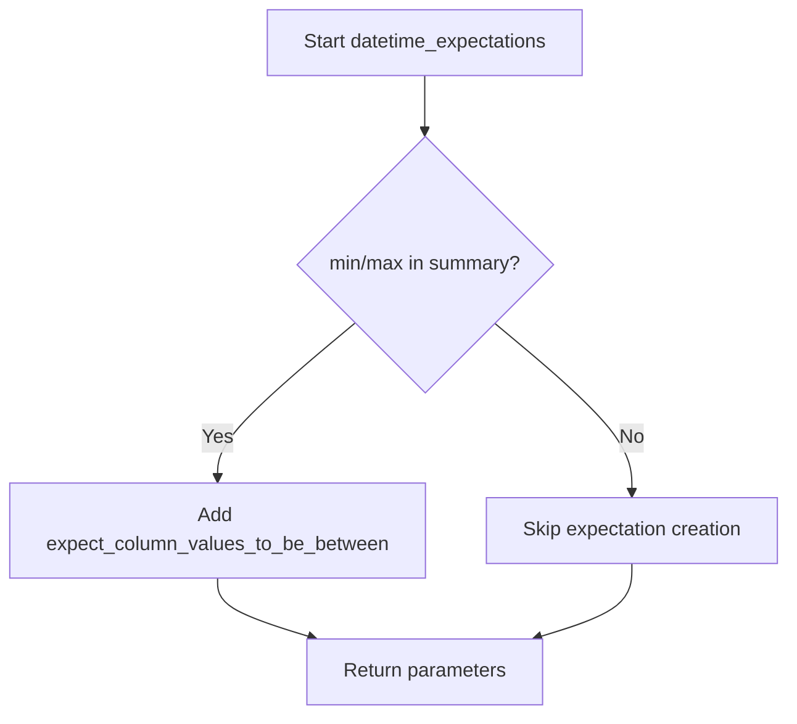

# `expectation_algorithms.py`

## `src.ydata_profiling.model.expectation_algorithms.generic_expectations` · *function*

## Summary:
Applies basic data quality expectations to a column based on its summary statistics.

## Description:
This function evaluates column summary statistics and applies appropriate Great Expectations to validate data quality properties such as column existence, absence of null values, and uniqueness constraints.

## Args:
    name (str): The name of the column to validate.
    summary (dict): A dictionary containing summary statistics for the column, including 'n_missing' and 'p_unique' keys.
    batch (Any): A Great Expectations batch object used to define expectations.
    *args: Additional arguments (unused in current implementation).

## Returns:
    Tuple[str, dict, Any]: A tuple containing the original column name, summary statistics, and the batch object with expectations applied.

## Raises:
    None explicitly raised by this function.

## Constraints:
    Preconditions:
        - The batch parameter must support the methods expect_column_to_exist, expect_column_values_to_not_be_null, and expect_column_values_to_be_unique.
        - The summary dictionary must contain the keys 'n_missing' and 'p_unique'.
    Postconditions:
        - The expect_column_to_exist expectation is always applied to the batch.
        - The expect_column_values_to_not_be_null expectation is applied if summary["n_missing"] equals 0.
        - The expect_column_values_to_be_unique expectation is applied if summary["p_unique"] equals 1.0.

## Side Effects:
    - Modifies the batch object by adding expectations to it.
    - No external I/O or state changes beyond the batch object.

## Control Flow:
```mermaid
flowchart TD
    A[Start generic_expectations] --> B[Apply expect_column_to_exist]
    B --> C{summary["n_missing"] == 0?}
    C -- Yes --> D[Apply expect_column_values_to_not_be_null]
    C -- No --> E[Skip null check]
    D --> E
    E --> F{summary["p_unique"] == 1.0?}
    F -- Yes --> G[Apply expect_column_values_to_be_unique]
    F -- No --> H[Return result]
    G --> H
```

## Examples:
```python
# Basic usage
name = "age"
summary = {"n_missing": 0, "p_unique": 1.0}
result = generic_expectations(name, summary, batch)
# Returns (name, summary, batch) with expectations added to batch

# Usage with missing values
summary = {"n_missing": 5, "p_unique": 0.8}
result = generic_expectations(name, summary, batch)
# Returns (name, summary, batch) with only column existence checked
```

## `src.ydata_profiling.model.expectation_algorithms.numeric_expectations` · *function*

## Summary:
Validates that a column contains numeric values and applies additional constraints based on summary statistics.

## Description:
This function performs data validation expectations on a numeric column by ensuring the values conform to expected numeric types and applying monotonicity and range constraints. It integrates with Great Expectations to define these expectations on a data batch. The function is designed to be part of a profiling pipeline that generates data quality expectations.

## Args:
    name (str): The name of the column being validated.
    summary (dict): A dictionary containing statistical summary information about the column, including:
        - monotonic_increase (bool): Whether the column values should be monotonically increasing
        - monotonic_decrease (bool): Whether the column values should be monotonically decreasing
        - monotonic_increase_strict (bool): Whether the monotonic increase should be strict
        - monotonic_decrease_strict (bool): Whether the monotonic decrease should be strict
        - min (float/int, optional): Minimum acceptable value for the column
        - max (float/int, optional): Maximum acceptable value for the column
    batch (Any): A Great Expectations batch object that will have expectations added to it.
    *args: Additional positional arguments (currently unused).

## Returns:
    Tuple[str, dict, Any]: A tuple containing the column name, summary dictionary, and the updated batch object with applied expectations.

## Raises:
    None explicitly raised, though underlying Great Expectations methods may raise exceptions.

## Constraints:
    Preconditions:
        - The batch parameter must be a valid Great Expectations batch object.
        - The summary dictionary must contain the expected keys for monotonicity and min/max values.
    Postconditions:
        - The batch object will have new expectations added for the specified column.
        - The returned tuple preserves the input parameters with the batch modified to include new expectations.

## Side Effects:
    - Modifies the batch object by adding new expectation definitions to it.
    - No external I/O operations or state mutations beyond the batch modification.

## Control Flow:
```mermaid
flowchart TD
    A[Start numeric_expectations] --> B{summary['monotonic_increase']}
    B -- True --> C[expect_column_values_to_be_increasing]
    B -- False --> D{summary['monotonic_decrease']}
    D -- True --> E[expect_column_values_to_be_decreasing]
    D -- False --> F{any(k in summary for k in ['min', 'max'])}
    F -- True --> G[expect_column_values_to_be_between]
    F -- False --> H[Return result]
    C --> H
    E --> H
    G --> H
```

## Examples:
```python
# Basic usage with minimal summary
name = "age"
summary = {"monotonic_increase": False, "monotonic_decrease": False, "min": 0, "max": 120}
batch = create_batch()  # Some Great Expectations batch creation
result = numeric_expectations(name, summary, batch)
# Result contains the column name, summary, and batch with expectations added

# Usage with monotonic constraints
summary_with_monotonic = {
    "monotonic_increase": True, 
    "monotonic_increase_strict": True,
    "monotonic_decrease": False,
    "min": 0, 
    "max": 1000
}
result = numeric_expectations(name, summary_with_monotonic, batch)
```

## `src.ydata_profiling.model.expectation_algorithms.categorical_expectations` · *function*

## Summary:
Applies categorical data validation expectations to a data batch based on distinct value thresholds.

## Description:
This function determines whether to apply a categorical expectation to validate that column values belong to a predefined set of categories. It evaluates the distinctness of values in a categorical column and applies the expectation only when the column meets specific threshold criteria. This extraction allows for modular expectation application logic within the profiling framework.

## Args:
    name (str): The name of the column being validated.
    summary (dict): A dictionary containing statistical summary of the column including:
        - n_distinct: Number of distinct values in the column
        - p_distinct: Proportion of distinct values relative to total count
        - value_counts_without_nan: Dictionary mapping values to their counts (excluding NaN values)
    batch (Any): The data batch object that contains the expect_column_values_to_be_in_set method for applying expectations.
    *args: Additional arguments (currently unused).

## Returns:
    Tuple[str, dict, Any]: A tuple containing the original column name, summary dictionary, and batch object, unchanged.

## Raises:
    None explicitly raised.

## Constraints:
    Preconditions:
        - The summary dictionary must contain keys: "n_distinct", "p_distinct", and "value_counts_without_nan"
        - The batch object must have an expect_column_values_to_be_in_set method
    Postconditions:
        - The returned tuple maintains the same structure and values as the input arguments
        - No modifications are made to the summary dictionary or batch object except for potential expectation application

## Side Effects:
    - May invoke batch.expect_column_values_to_be_in_set() method which could result in:
      * I/O operations if the batch stores expectations to disk
      * External state mutations if the batch implementation persists expectations elsewhere
      * Network calls if the batch uses remote expectation storage

## Control Flow:
```mermaid
flowchart TD
    A[Start categorical_expectations] --> B{summary["n_distinct"] < 10 OR summary["p_distinct"] < 0.2}
    B -- True --> C[batch.expect_column_values_to_be_in_set()]
    B -- False --> D[Return original values]
    C --> D
```

## Examples:
    # Basic usage with a categorical column that meets thresholds
    name = "category_col"
    summary = {
        "n_distinct": 5,
        "p_distinct": 0.15,
        "value_counts_without_nan": {"A": 10, "B": 5, "C": 3}
    }
    batch = SomeBatchClass()
    result = categorical_expectations(name, summary, batch)
    # Result would be (name, summary, batch) with expectation applied to batch
    
    # Usage with high cardinality column (no expectation applied)
    name = "high_cardinality_col"
    summary = {
        "n_distinct": 15,
        "p_distinct": 0.3,
        "value_counts_without_nan": {"X": 1, "Y": 2, "Z": 3, ...}
    }
    batch = SomeBatchClass()
    result = categorical_expectations(name, summary, batch)
    # Result would be (name, summary, batch) with no expectation applied

## `src.ydata_profiling.model.expectation_algorithms.path_expectations` · *function*

## Summary:
Returns the input parameters as a tuple without modification, serving as a placeholder or default expectation handler.

## Description:
This function acts as a simple passthrough mechanism that takes three primary arguments and returns them unchanged in a tuple format. It appears to be designed as a default or fallback expectation handler that can be used when more complex expectation logic is not required. The function is likely used in expectation algorithm pipelines where a uniform interface is needed regardless of the specific expectation being processed.

## Args:
    name (str): A string identifier for the expectation.
    summary (dict): A dictionary containing summary information about the expectation.
    batch (Any): An arbitrary object representing the data batch being processed.
    *args: Additional positional arguments that are ignored by this function.

## Returns:
    Tuple[str, dict, Any]: A tuple containing the original name, summary, and batch parameters in that order.

## Raises:
    None: This function does not raise any exceptions.

## Constraints:
    Preconditions:
        - The name parameter must be a string.
        - The summary parameter must be a dictionary.
        - The batch parameter can be any type.
    Postconditions:
        - The returned tuple contains the exact same values as the input parameters.
        - The types of the returned values match the types of the input parameters.

## Side Effects:
    None: This function has no side effects.

## Control Flow:
```mermaid
flowchart TD
    A[Start path_expectations] --> B[Receive name, summary, batch, *args]
    B --> C[Return (name, summary, batch)]
    C --> D[End]
```

## Examples:
    # Basic usage
    result = path_expectations("test_name", {"count": 10}, [1, 2, 3])
    # Returns: ("test_name", {"count": 10}, [1, 2, 3])

    # With additional args
    result = path_expectations("test", {"min": 1}, {"data": "test"}, "extra1", "extra2")
    # Returns: ("test", {"min": 1}, {"data": "test"})
```

## `src.ydata_profiling.model.expectation_algorithms.datetime_expectations` · *function*

## Summary:
Applies datetime range validation expectations to a column batch based on minimum and maximum summary values.

## Description:
This function validates datetime column values by creating Great Expectations validation rules that ensure all values fall within specified date/time ranges. It's designed to work with profiling summaries containing temporal data statistics. The function acts as a bridge between profiling data and validation expectations, enabling automated data quality checks.

## Args:
    name (str): The column name to validate
    summary (dict): Dictionary containing statistical summary including optional 'min' and 'max' keys
    batch (Any): Great Expectations batch object that supports expectation methods
    *args: Additional positional arguments (currently unused)

## Returns:
    Tuple[str, dict, Any]: The original input parameters unchanged, enabling fluent interface patterns

## Raises:
    AttributeError: If batch object lacks the expect_column_values_to_be_between method
    TypeError: If summary values are incompatible with datetime parsing requirements

## Constraints:
    Preconditions:
        - batch must support Great Expectations expectation methods
        - summary dictionary may contain 'min' and/or 'max' keys with comparable datetime values
    Postconditions:
        - If min/max values exist in summary, corresponding expectations are added to the batch
        - Original parameters are returned unmodified

## Side Effects:
    - Modifies the batch object by adding validation expectations
    - No external I/O operations performed

## Control Flow:


## Examples:
```python
# Basic usage with min/max values
name, summary, batch = datetime_expectations(
    "date_column", 
    {"min": "2020-01-01", "max": "2023-12-31"}, 
    batch_object
)

# Usage with only min value
name, summary, batch = datetime_expectations(
    "timestamp_col",
    {"min": "2020-01-01"},
    batch_object
)

# Usage with no range values
name, summary, batch = datetime_expectations(
    "date_column",
    {"mean": 123.45},
    batch_object
)
```

## `src.ydata_profiling.model.expectation_algorithms.image_expectations` · *function*

## Summary:
Returns the input parameters as a tuple for image expectation processing.

## Description:
This function serves as a placeholder or wrapper for image expectation processing logic. It takes the name, summary, and batch parameters and returns them unchanged as a tuple. The function appears to be part of a larger expectations framework, likely used to standardize the interface for different expectation types in data profiling.

## Args:
    name (str): The name identifier for the expectation.
    summary (dict): A dictionary containing summary statistics or metadata about the data.
    batch (Any): The data batch being processed, could be of any type.
    *args: Additional arguments that may be passed but are not utilized in the current implementation.

## Returns:
    Tuple[str, dict, Any]: A tuple containing the original name, summary, and batch parameters in the same order.

## Raises:
    None: This function does not raise any exceptions.

## Constraints:
    Preconditions:
        - The name parameter must be a string.
        - The summary parameter must be a dictionary.
        - The batch parameter can be of any type.
    Postconditions:
        - The returned tuple maintains the exact same values and types as the input parameters.

## Side Effects:
    None: This function has no side effects.

## Control Flow:
```mermaid
flowchart TD
    A[Start image_expectations] --> B[Receive name, summary, batch]
    B --> C[Return (name, summary, batch)]
    C --> D[End]
```

## Examples:
```python
# Basic usage
result = image_expectations("image_quality", {"mean": 0.5}, [1, 2, 3])
print(result)  # Output: ('image_quality', {'mean': 0.5}, [1, 2, 3])

# With additional args
result = image_expectations("image_format", {"size": 100}, "batch_data", "extra_arg")
print(result)  # Output: ('image_format', {'size': 100}, 'batch_data')
```

## `src.ydata_profiling.model.expectation_algorithms.url_expectations` · *function*

## Summary:
Returns the input parameters as a tuple without modification, serving as a placeholder expectation function for URL-related data validation.

## Description:
This function acts as a minimal expectation handler that simply returns the input arguments unchanged. It appears to be designed as a stub or placeholder implementation for URL validation expectations within the profiling framework. The function is likely intended to be overridden or extended by more sophisticated URL validation logic in a production environment.

## Args:
    name (str): The name identifier for the expectation
    summary (dict): A dictionary containing summary statistics or metadata about the data being validated
    batch (Any): The data batch or dataset being processed for validation
    *args: Additional positional arguments that may be passed to the expectation function

## Returns:
    Tuple[str, dict, Any]: A tuple containing the original name, summary, and batch parameters in the same order as received

## Raises:
    None: This function does not raise any exceptions under normal operation

## Constraints:
    Preconditions:
        - The name parameter must be a string
        - The summary parameter must be a dictionary
        - The batch parameter can be of any type
    Postconditions:
        - The returned tuple maintains the exact same values and types as the input parameters
        - No transformations or validations are applied to the inputs

## Side Effects:
    None: This function performs no I/O operations, state mutations, or external service calls

## Control Flow:
```mermaid
flowchart TD
    A[Start url_expectations] --> B[Receive name, summary, batch, *args]
    B --> C[Return (name, summary, batch)]
    C --> D[End]
```

## Examples:
```python
# Basic usage
result = url_expectations("url_validation", {"count": 10}, ["http://example.com"])
print(result)  # Output: ("url_validation", {"count": 10}, ["http://example.com"])

# With additional arguments
result = url_expectations("url_validation", {"count": 5}, {"data": [1,2,3]}, "extra_param")
print(result)  # Output: ("url_validation", {"count": 5}, {"data": [1,2,3]})
```

## `src.ydata_profiling.model.expectation_algorithms.file_expectations` · *function*

## Summary:
Validates that a specified file exists within a data batch using Great Expectations and returns the input parameters unchanged.

## Description:
This function implements a file existence validation expectation algorithm. It serves as a standardized interface for verifying that a file referenced by name exists within a data batch, leveraging Great Expectations' validation framework. The function is designed to be part of a pipeline where file validation is required before proceeding with data profiling or analysis operations.

## Args:
    name (str): The name or path of the file to validate for existence.
    summary (dict): A dictionary containing metadata or summary statistics about the file or batch.
    batch (Any): The data batch object that provides file validation capabilities through the `expect_file_to_exist` method.
    *args: Additional positional arguments that are accepted but not utilized in this implementation.

## Returns:
    Tuple[str, dict, Any]: A tuple containing the original filename (name), summary dictionary (summary), and batch object (batch) in their original form. This preserves the input parameters for continuation in processing pipelines.

## Raises:
    Exception: May propagate exceptions from the underlying `batch.expect_file_to_exist(name)` call if file validation fails, the file does not exist, or if the batch object does not support the validation method.

## Constraints:
    Preconditions:
        - The `batch` parameter must be an object implementing the `expect_file_to_exist` method.
        - The `name` parameter must be a valid string representing a file path or identifier.
    Postconditions:
        - The file existence validation has been executed via the batch object.
        - All input parameters are preserved and returned unchanged for pipeline continuity.

## Side Effects:
    - Executes the `expect_file_to_exist` method on the batch object, which may trigger file system operations or validation checks.
    - May cause program termination or exception propagation if validation fails.

## Control Flow:
```mermaid
flowchart TD
    A[Start file_expectations] --> B{batch.expect_file_to_exist(name)}
    B --> C[Return (name, summary, batch)]
```

## Examples:
```python
# Typical usage in a profiling pipeline
name = "data.csv"
summary = {"size": 1024, "format": "csv"}
batch = create_batch_object()

# Validates file existence and returns unchanged inputs
result_name, result_summary, result_batch = file_expectations(name, summary, batch)
assert result_name == "data.csv"
assert result_summary == {"size": 1024, "format": "csv"}
assert result_batch == batch
```

