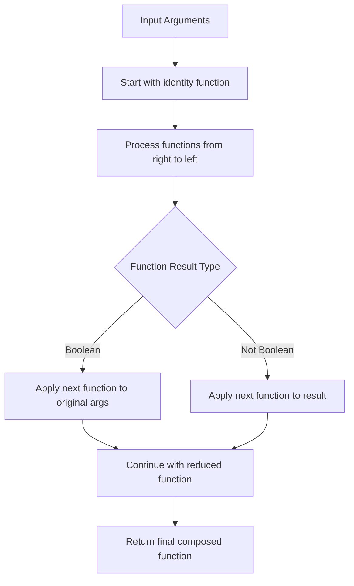
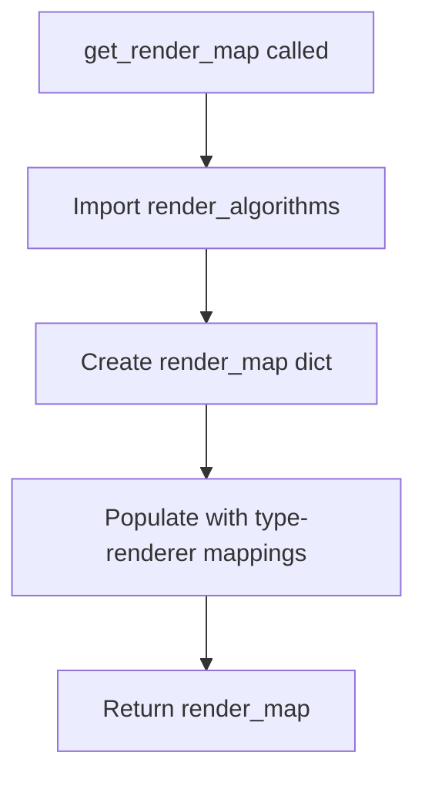

# `handler.py`

## `src.ydata_profiling.model.handler.compose` · *function*

## Summary:
Creates a composed function by applying a sequence of functions from right to left with conditional execution based on intermediate result types.

## Description:
This function implements function composition where functions are applied in reverse order (right-to-left) using Python's reduce function. The composition logic includes conditional execution: if an intermediate function returns a boolean, the next function is applied to the original arguments; otherwise, it's applied to the result of the previous function. This allows for flexible pipeline construction where some transformations may conditionally affect the data flow.

## Args:
    functions (Sequence[Callable]): A sequence of callable functions to compose. Functions are applied from right to left.

## Returns:
    Callable: A composed function that applies all input functions in sequence according to the composition rules.

## Raises:
    None explicitly raised.

## Constraints:
    Preconditions:
    - Input must be a sequence of callable objects
    - Functions in the sequence should be compatible with the data flow (output types should match input expectations of subsequent functions)
    
    Postconditions:
    - The returned function will execute all input functions in reverse order
    - The final result depends on the type of intermediate results from the function chain

## Side Effects:
    None.

## Control Flow:


## Examples:
    # Basic usage with simple functions
    def add_one(x):
        return x + 1
    
    def multiply_by_two(x):
        return x * 2
    
    composed_func = compose([add_one, multiply_by_two])
    result = composed_func(5)  # Returns 11 (multiply_by_two(5)=10, add_one(10)=11)
    
    # With conditional execution logic
    def check_positive(x):
        return x > 0
    
    def square(x):
        return x * x
    
    composed_conditional = compose([check_positive, square])
    result = composed_conditional(3)  # Returns True (check_positive(3)=True, so apply square to original args)
    
    # Identity case - empty sequence
    identity_func = compose([])
    result = identity_func(42)  # Returns (42,) - tuple of original arguments

## `src.ydata_profiling.model.handler.Handler` · *class*

## Summary:
A Handler class that manages type-specific operations through function composition and maintains dependency relationships between data types.

## Description:
The Handler class serves as a dispatcher for type-specific operations in a data profiling system. It maintains a mapping of data type names to sequences of functions that should be applied to data of that type. During initialization, it completes the dependency graph by ensuring all dependent types inherit the appropriate function chains from their parent types, enabling efficient processing of data transformations through a topological ordering of type dependencies.

## State:
- mapping: Dict[str, List[Callable]] - Maps data type names to lists of functions to be applied to data of that type. These functions are typically transformation or analysis operations.
- typeset: VisionsTypeset - Contains type information and dependency relationships between data types, specifically through its base_graph attribute.
- The mapping dictionary is modified during initialization to ensure all dependent types have the appropriate function chains inherited from their parent types in the dependency graph.

## Lifecycle:
- Creation: Instantiate with a mapping dictionary, typeset object, and optional arguments. The constructor automatically calls `_complete_dag()` to establish type dependencies.
- Usage: Call handle() method with a data type identifier and arguments to process data through the composed functions for that type.
- Destruction: No explicit cleanup required; relies on Python's garbage collection.

## Method Map:
```mermaid
flowchart TD
    A[Handler.__init__] --> B[Handler._complete_dag]
    B --> C[Handler.handle]
    C --> D{Get functions for dtype}
    D --> E{Functions exist?}
    E -- Yes --> F[Compose functions with compose()]
    E -- No --> G[Empty composition]
    F --> H[Execute composed function with op(*args)]
    G --> H
    H --> I[Return result dict]
```

## Raises:
- None explicitly raised in __init__
- May raise exceptions from the compose function or underlying graph operations if invalid inputs are provided
- May raise KeyError or TypeError if the mapping doesn't contain expected keys or functions are incompatible

## Example:
```python
# Create a handler with function mappings for different data types
handler = Handler(
    mapping={
        "int": [process_int_function],
        "float": [process_float_function]
    },
    typeset=my_typeset
)

# Process data of a specific type
result = handler.handle("int", data_value)
```

### `src.ydata_profiling.model.handler.Handler.__init__` · *method*

## Summary:
Initializes a Handler instance by setting up its mapping and typeset attributes, then completes the dependency graph.

## Description:
The Handler class constructor configures the object with a mapping of variable types to processing functions and a typeset for type inference. It then calls an internal method to complete the dependency graph structure, ensuring all relationships between variables are properly established for downstream processing. This method is part of the initialization lifecycle and ensures that type mappings are fully propagated through the type hierarchy before the handler is ready for use.

## Args:
    mapping (Dict[str, List[Callable]]): A dictionary mapping variable type names to lists of callable processing functions.
    typeset (VisionsTypeset): A Visions typeset object used for type inference and validation.
    *args: Additional positional arguments (not used in current implementation).
    **kwargs: Additional keyword arguments (not used in current implementation).

## Returns:
    None: This method initializes the object's state but does not return a value.

## Raises:
    None: This method does not explicitly raise exceptions.

## State Changes:
    Attributes READ: None
    Attributes WRITTEN: 
        - self.mapping: Set to the provided mapping parameter
        - self.typeset: Set to the provided typeset parameter

## Constraints:
    Preconditions:
        - The mapping parameter must be a dictionary with string keys and list of callable values
        - The typeset parameter must be a valid VisionsTypeset instance
    Postconditions:
        - self.mapping is assigned the provided mapping
        - self.typeset is assigned the provided typeset
        - The internal _complete_dag() method is called to finalize the handler setup, which propagates type mappings through the type hierarchy

## Side Effects:
    - Calls self._complete_dag() which performs graph operations using networkx to propagate type mappings through the type hierarchy
    - Modifies internal graph structures in the _complete_dag method

### `src.ydata_profiling.model.handler.Handler._complete_dag` · *method*

## Summary:
Completes a directed acyclic graph (DAG) by propagating type mappings from parent nodes to child nodes in topological order.

## Description:
This method processes the type relationships defined in the `typeset.base_graph` to ensure that all type mappings are properly propagated through the graph hierarchy. It constructs the line graph of the base graph and performs a topological sort to process nodes in dependency order. For each edge in the sorted order, it combines the handling functions from parent types with those from child types, ensuring that derived types inherit all applicable transformations from their ancestors.

The method is called automatically during object initialization in the `__init__` method, ensuring that the mapping is complete before the handler is ready for use. This allows the handler to efficiently resolve type-specific operations by traversing the type hierarchy.

## Args:
    None

## Returns:
    None

## Raises:
    None explicitly raised

## State Changes:
    Attributes READ: self.typeset.base_graph, self.mapping
    Attributes WRITTEN: self.mapping

## Constraints:
    Preconditions:
        - self.typeset must be a VisionsTypeset instance with a valid base_graph
        - self.mapping must be a dictionary with string keys and list of callable values
        - The base_graph must be a valid NetworkX graph
    Postconditions:
        - All entries in self.mapping are updated with propagated type information
        - The mapping dictionary reflects the complete type hierarchy
        - Each type mapping includes all applicable handling functions from parent types

## Side Effects:
    None

### `src.ydata_profiling.model.handler.Handler.handle` · *method*

## Summary:
Applies a sequence of transformation functions to input arguments based on a data type mapping, using composed function execution.

## Description:
The handle method retrieves a list of functions associated with a given data type from the handler's mapping, composes them into a single callable using the compose utility function, and executes the composed function with the provided arguments. This enables dynamic application of type-specific processing pipelines where functions are applied in right-to-left order with conditional execution logic.

## Args:
    dtype (str): The data type identifier used to look up transformation functions in the handler's mapping.
    *args: Variable length argument list passed to the composed functions.
    **kwargs: Arbitrary keyword arguments passed to the composed functions.

## Returns:
    dict: The result of executing the composed functions on the input arguments.

## Raises:
    None explicitly raised.

## State Changes:
    Attributes READ: self.mapping, self.typeset
    Attributes WRITTEN: None

## Constraints:
    Preconditions:
    - The handler must be properly initialized with a valid mapping and typeset
    - The dtype parameter must correspond to a key in self.mapping
    - All functions in the retrieved function list must be compatible with the provided arguments
    - The compose function must be available and properly implemented
    
    Postconditions:
    - The method returns the result of applying all functions in the mapping for the given dtype
    - Function composition follows right-to-left application order with conditional execution logic
    - The result is returned as a dictionary

## Side Effects:
    None.

## `src.ydata_profiling.model.handler.get_render_map` · *function*

## Summary:
Returns a dictionary mapping data type names to their corresponding rendering functions for report generation.

## Description:
This function creates and returns a mapping between data type identifiers and their associated rendering algorithms. It serves as a centralized registry for how different data types should be visually represented in profiling reports. The function is designed to encapsulate the relationship between data types and their rendering logic, making it easier to manage and extend rendering capabilities without modifying core reporting logic.

## Args:
    None

## Returns:
    Dict[str, Callable]: A dictionary where keys are string representations of data types and values are callable rendering functions from the render_algorithms module.

## Raises:
    None

## Constraints:
    Preconditions:
    - The ydata_profiling.report.structure.variables module must be importable and contain the expected rendering functions.
    - All referenced rendering functions (render_boolean, render_real, etc.) must exist in the render_algorithms module.

    Postconditions:
    - The returned dictionary contains exactly 12 key-value pairs.
    - All values in the dictionary are callable objects.
    - Keys are limited to the predefined set of data type names.

## Side Effects:
    None

## Control Flow:


## Examples:
```python
# Typical usage in report generation pipeline
render_map = get_render_map()
renderer_function = render_map["Numeric"]
# renderer_function would now reference render_algorithms.render_real
```

