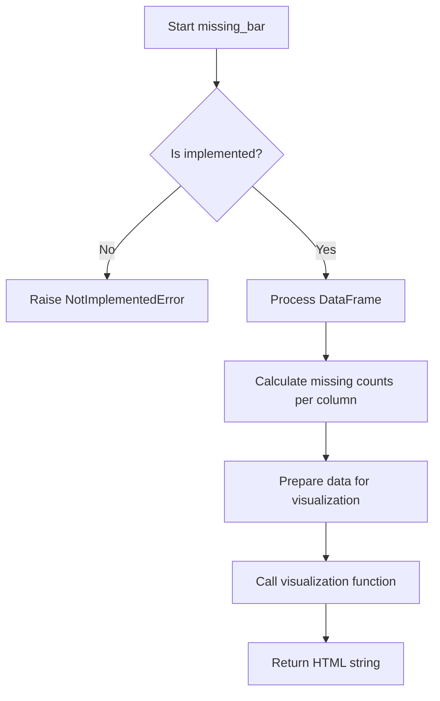
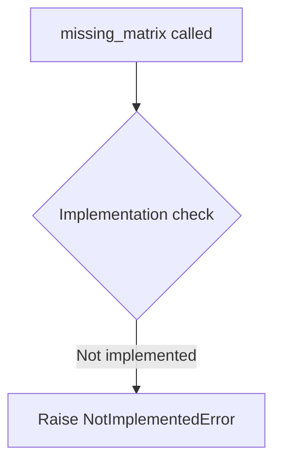
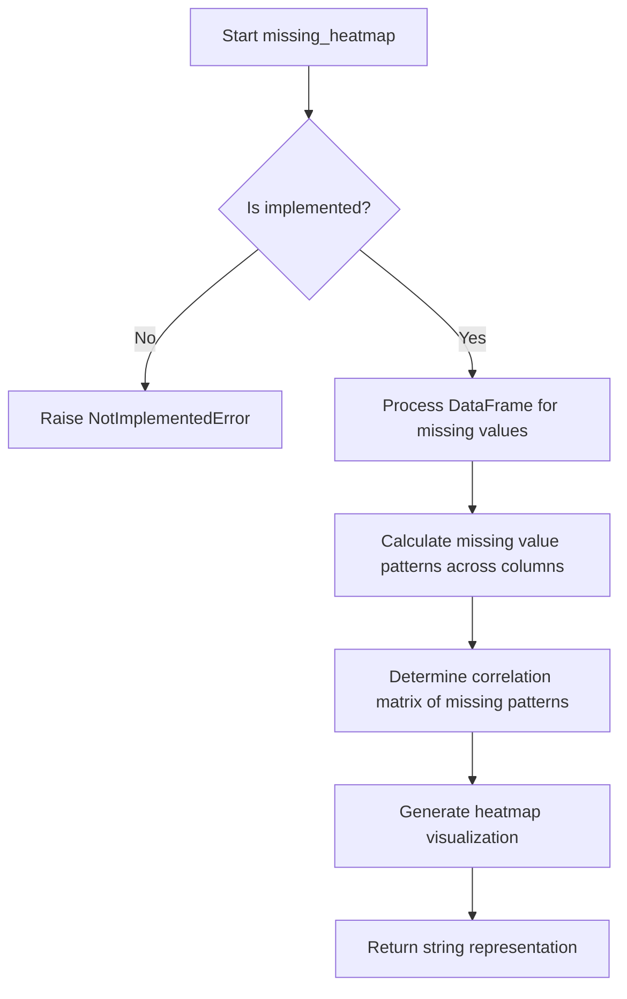
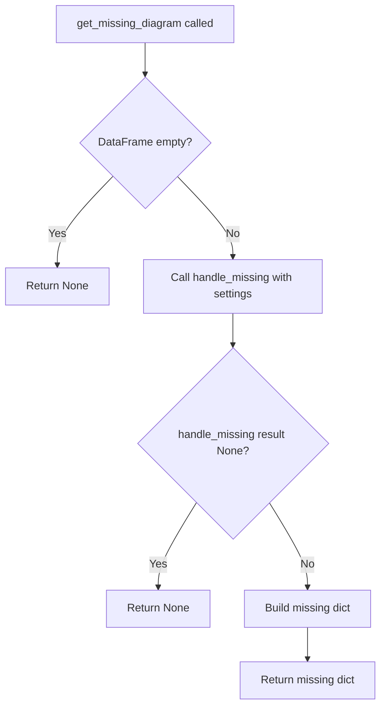

# `missing.py`

## `src.ydata_profiling.model.missing.missing_bar` · *function*

## Summary:
Generates a bar chart visualization showing the count of missing values for each column in a DataFrame.

## Description:
This function serves as a bridge between the data processing layer and visualization layer for missing value analysis. It calculates missing value counts per column and prepares the data for visualization. The function is designed to integrate with the profiling system's missing data analysis workflow. Currently raises NotImplementedError as the implementation is pending.

## Args:
    config (Settings): Configuration object containing settings for the profiling process
    df (Any): Input DataFrame containing the data to analyze for missing values

## Returns:
    str: HTML string representation of the missing values bar chart visualization

## Raises:
    NotImplementedError: This function is not yet implemented and always raises this exception

## Constraints:
    - Preconditions: The config parameter must be a valid Settings object and df must be a valid DataFrame-like object
    - Postconditions: Not applicable as the function is not implemented

## Side Effects:
    - None

## Control Flow:


## Examples:
    - This function would typically be called during the profiling process when generating missing data reports
    - Expected usage: missing_bar(config, dataframe) where config contains visualization settings

## `src.ydata_profiling.model.missing.missing_matrix` · *function*

## Summary:
Generates an interactive heatmap visualization of missing data patterns in a DataFrame.

## Description:
Creates an HTML-based visualization showing the distribution of missing values across columns and rows. This function is part of the missing data analysis module and provides a visual representation of data completeness patterns, helping users identify trends in missing data across their dataset.

## Args:
    config (Settings): Configuration object containing report settings and formatting options
    df (Any): Input DataFrame containing the data to analyze for missing values

## Returns:
    str: HTML string containing the interactive missing data matrix visualization

## Raises:
    NotImplementedError: Always raised as this function is not yet implemented

## Constraints:
    - Preconditions: Both config and df parameters must be provided and valid
    - Postconditions: Function always raises NotImplementedError

## Side Effects:
    - None

## Control Flow:


## Examples:
    - This function would typically be called during report generation when missing data analysis is requested
    - Usage example would involve passing a Settings configuration and DataFrame to generate missing data visualization

## `src.ydata_profiling.model.missing.missing_heatmap` · *function*

## Summary:
Generates a heatmap visualization showing the pattern of missing values in a DataFrame, typically used for identifying correlations between missing value patterns across columns.

## Description:
This function creates a heatmap representation that visualizes the distribution and correlation of missing values across columns in a DataFrame. It serves as a diagnostic tool to help identify patterns in missing data, such as whether missing values occur randomly or follow specific systematic patterns. The heatmap typically uses color coding to represent presence (e.g., white) vs. absence (e.g., colored) of missing values, allowing users to visually detect dependencies between missing value occurrences across different columns.

This function is part of the missing data analysis suite and is designed to integrate with the profiling system's visualization pipeline. It follows the same pattern as other missing value visualization functions like `missing_bar` and `missing_matrix`.

## Args:
    config (Settings): Configuration object containing settings for the profiling process, including visualization parameters such as colors, figure size, and labeling preferences.
    df (Any): Input DataFrame containing the data to analyze for missing values patterns.

## Returns:
    str: A string representation of the heatmap visualization, typically HTML or SVG content that can be embedded in profiling reports.

## Raises:
    NotImplementedError: This function is not yet implemented and always raises this exception.

## Constraints:
    Preconditions:
        - The config parameter must be a valid Settings object.
        - The df parameter must be a valid DataFrame-like object.
    
    Postconditions:
        - None, as the function is not implemented.

## Side Effects:
    - None, as the function is not implemented.

## Control Flow:


## Examples:
    - This function would typically be called during the profiling process when generating missing data reports
    - Expected usage: missing_heatmap(config, dataframe) where config contains visualization settings
    - The resulting visualization helps identify if missing values in one column correlate with missing values in another column

## `src.ydata_profiling.model.missing.get_missing_active` · *function*

## Summary:
Filters and returns active missing data visualization configurations based on user settings and data characteristics.

## Description:
This function determines which missing data visualization diagrams should be displayed in a profiling report by evaluating both user configuration settings and the actual characteristics of the dataset. It filters the available missing data visualization options ("bar", "matrix", "heatmap") based on whether they are enabled in the configuration and whether the dataset has sufficient missing data to justify their display.

The function is extracted into its own component to encapsulate the logic for determining active missing data diagrams, separating this concern from the main profiling workflow and making it reusable across different parts of the system. This allows for consistent filtering behavior regardless of where the missing data analysis is invoked.

## Args:
    config (Settings): Configuration object containing user preferences for missing data diagrams and other profiling settings, specifically the missing_diagrams dictionary
    table_stats (dict): Dictionary containing statistical information about the dataset, including "n_vars_with_missing" (number of variables with missing values) and "n_vars_all_missing" (number of variables with all values missing)

## Returns:
    Dict[str, Any]: Filtered dictionary mapping visualization names to their configuration settings, including min_missing threshold, name, caption, and function reference for active visualizations

## Raises:
    None explicitly raised by this function

## Constraints:
    - Preconditions: 
        * config must be a valid Settings object with missing_diagrams attribute containing keys "bar", "matrix", "heatmap"
        * table_stats must be a dictionary containing "n_vars_with_missing" and "n_vars_all_missing" keys with numeric values
    - Postconditions: 
        * Returns a dictionary with at most 3 keys ("bar", "matrix", "heatmap")
        * All returned entries have valid configuration settings including min_missing, name, caption, and function reference

## Side Effects:
    None

## Control Flow:
```mermaid
flowchart TD
    A[get_missing_active called] --> B[Initialize missing_map with all three visualization types]
    B --> C[Filter by config.missing_diagrams[name]]
    C --> D{config.missing_diagrams[name] == True?}
    D -- No --> E[Skip entry]
    D -- Yes --> F[Check n_vars_with_missing >= min_missing]
    F --> G{table_stats["n_vars_with_missing"] >= settings["min_missing"]?}
    G -- No --> E
    G -- Yes --> H{Is heatmap?}
    H -- Yes --> I[Special heatmap condition check]
    I --> J{table_stats["n_vars_with_missing"] - table_stats["n_vars_all_missing"] >= min_missing?}
    J -- No --> E
    J -- Yes --> K[Include heatmap]
    H -- No --> K
    K --> L[Return filtered missing_map]
```

## Examples:
    - Typical usage in profiling workflow: get_missing_active(settings, table_statistics)
    - When all missing diagrams are enabled and dataset has missing values: returns all three visualization configurations
    - When heatmap is disabled in config: only returns "bar" and "matrix" configurations  
    - When dataset has no missing values: returns empty dictionary
    - When heatmap is enabled but dataset has insufficient missing data for heatmap: returns only "bar" and "matrix" configurations

## `src.ydata_profiling.model.missing.handle_missing` · *function*

## Summary:
Decorator function that wraps a callable to catch and warn about ValueErrors related to missing data operations.

## Description:
This function serves as a decorator that intercepts ValueError exceptions raised by wrapped functions, specifically those related to missing data handling. It provides a standardized way to issue warnings when operations fail due to missing data conditions while allowing the calling code to continue execution.

The function is designed to be used as a decorator around functions that may encounter missing data scenarios, particularly in data profiling contexts where missing values need to be handled gracefully.

## Args:
    name (str): A descriptive name identifying the operation being performed, used in warning messages.
    fn (Callable): The function to be wrapped and monitored for ValueErrors.

## Returns:
    Callable: A new function that wraps the original function with error handling and warning capabilities.

## Raises:
    ValueError: Propagates ValueError exceptions that are not caught by the decorator's handling logic (though the current implementation catches all ValueErrors).

## Constraints:
    Preconditions:
        - The `name` parameter must be a string describing the operation.
        - The `fn` parameter must be a callable object that can accept arbitrary arguments.
    
    Postconditions:
        - The returned function maintains the same interface as the original function.
        - When a ValueError occurs, a warning is issued but the exception is not propagated further.

## Side Effects:
    - Issues a warning via Python's warnings module when a ValueError is caught.
    - No other I/O operations or external state mutations occur.

## Control Flow:
```mermaid
flowchart TD
    A[handle_missing called] --> B[Returns inner function]
    B --> C[inner function called]
    C --> D{Try fn(*args, **kwargs)}
    D -->|Success| E[Return fn result]
    D -->|ValueError| F[warn_missing called]
    F --> G[Warning issued with operation name and error details]
    G --> H[Exception swallowed]
```

## Examples:
```python
@handle_missing("data_processing", my_function)
def my_function(data):
    # Some processing that might raise ValueError
    pass

# If my_function raises ValueError, a warning will be issued
# but the exception will not propagate
```

## `src.ydata_profiling.model.missing.get_missing_diagram` · *function*

## Summary:
Generates a missing data diagram configuration by processing a DataFrame with specified missing data handling settings.

## Description:
This function creates a structured representation of missing data visualization settings for a given DataFrame. It serves as a bridge between configuration settings and the actual missing data processing logic, ensuring proper handling of edge cases like empty DataFrames and failed processing operations.

The function is part of the missing data analysis pipeline and is responsible for orchestrating the creation of missing data diagram configurations. It delegates the actual missing data processing to the `handle_missing` decorator, which provides error handling for missing data operations.

## Args:
    config (Settings): Configuration object containing profiling settings and parameters.
    df (pd.DataFrame): Input DataFrame containing the data to analyze for missing values.
    settings (Dict[str, Any]): Dictionary containing missing data processing settings including:
        - "name" (str): Name identifier for the missing data operation
        - "function" (Callable): Function to process missing data
        - "caption" (str): Caption for the missing data diagram

## Returns:
    Optional[Dict[str, Any]]: A dictionary containing the missing data diagram configuration with keys:
        - "name" (str): The operation name
        - "caption" (str): The diagram caption
        - "matrix" (Any): The processed missing data matrix
    Returns None if the DataFrame is empty or if the processing fails.

## Raises:
    None: This function does not explicitly raise exceptions, though underlying operations may raise exceptions that are handled internally.

## Constraints:
    Preconditions:
        - The input DataFrame must be a valid pandas DataFrame
        - The settings dictionary must contain "name", "function", and "caption" keys
        - The config parameter must be a valid Settings object
    
    Postconditions:
        - Returns None for empty DataFrames or failed processing operations
        - Returns a properly structured dictionary for successful operations

## Side Effects:
    - May issue warnings through the Python warnings module when missing data operations fail
    - No direct I/O operations or external state mutations

## Control Flow:


## Examples:
```python
# Basic usage
config = Settings()
df = pd.DataFrame({'A': [1, None, 3], 'B': [None, 2, 3]})
settings = {
    "name": "missing_matrix",
    "function": some_missing_function,
    "caption": "Missing Values Matrix"
}
result = get_missing_diagram(config, df, settings)
# Returns dictionary with missing data configuration or None
```

