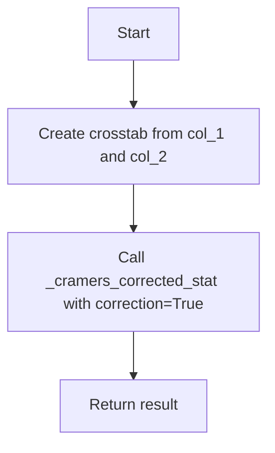
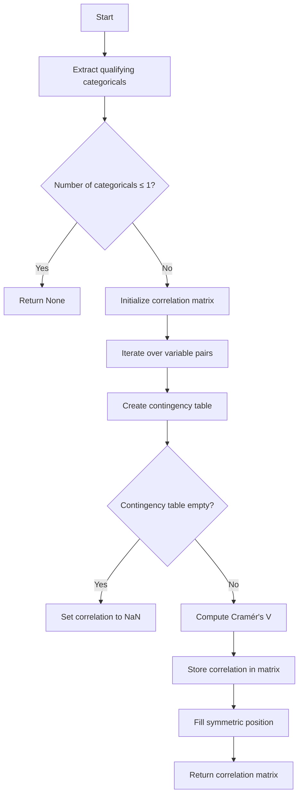
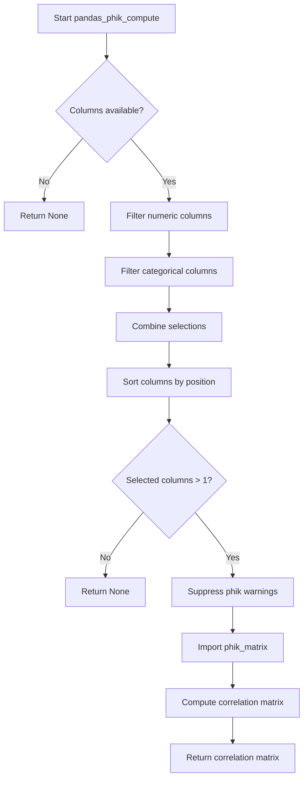
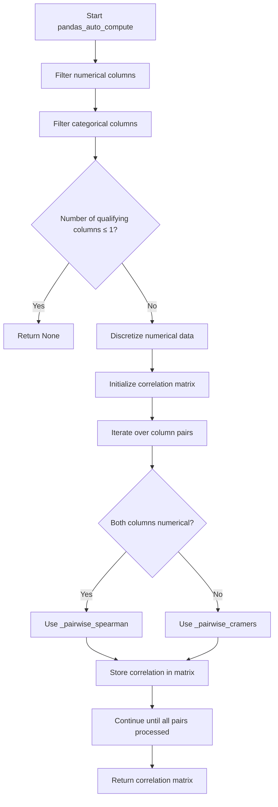

# `correlations_pandas.py`

## `src.ydata_profiling.model.pandas.correlations_pandas.pandas_spearman_compute` · *function*

## Summary:
Computes the Spearman rank correlation matrix for numeric columns in a DataFrame.

## Description:
This function calculates the Spearman rank correlation coefficients between all pairs of numeric columns in the input DataFrame. It is part of the ydata-profiling library's correlation analysis suite, specifically designed for Spearman correlation computations using pandas' built-in correlation method.

## Args:
    config (Settings): Configuration settings for the profiling process (unused in current implementation).
    df (pd.DataFrame): Input DataFrame containing the data to analyze.
    summary (dict): Summary statistics dictionary for the dataset (unused in current implementation).

## Returns:
    Optional[pd.DataFrame]: A DataFrame containing the Spearman correlation coefficients between all pairs of numeric columns, or None if no numeric columns exist.

## Raises:
    None explicitly raised.

## Constraints:
    Preconditions:
        - The input DataFrame must be valid and contain at least one numeric column.
        - The config parameter must be a properly initialized Settings object.
        
    Postconditions:
        - The returned DataFrame will have rows and columns corresponding to the numeric columns in the input DataFrame.
        - All correlation values will be between -1 and 1 inclusive.
        - If no numeric columns exist, None is returned.

## Side Effects:
    None.

## Control Flow:
```mermaid
flowchart TD
    A[Start pandas_spearman_compute] --> B{DataFrame has numeric columns?}
    B -- No --> C[Return None]
    B -- Yes --> D[Call df.corr(method="spearman")]
    D --> E[Return correlation matrix]
```

## Examples:
```python
# Basic usage with numeric data
config = Settings()
df = pd.DataFrame({'A': [1, 2, 3], 'B': [4, 5, 6]})
result = pandas_spearman_compute(config, df, {})
# Returns correlation matrix of A and B

# With mixed data types - only numeric columns considered
df_mixed = pd.DataFrame({'A': [1, 2, 3], 'B': ['x', 'y', 'z'], 'C': [4, 5, 6]})
result = pandas_spearman_compute(config, df_mixed, {})
# Returns correlation matrix of A and C only

# With no numeric columns
df_non_numeric = pd.DataFrame({'A': ['x', 'y', 'z'], 'B': ['p', 'q', 'r']})
result = pandas_spearman_compute(config, df_non_numeric, {})
# Returns None
```

## `src.ydata_profiling.model.pandas.correlations_pandas.pandas_pearson_compute` · *function*

## Summary:
Computes the Pearson correlation matrix for a given DataFrame using pandas' built-in correlation method.

## Description:
This function calculates the Pearson correlation coefficients between all pairs of numeric columns in the input DataFrame. It serves as a specific implementation for computing Pearson correlations within the ydata-profiling library's correlation analysis framework. The function is designed to be called as part of a broader correlation computation pipeline where different correlation methods (Pearson, Spearman, etc.) are handled through dedicated compute functions.

## Args:
    config (Settings): Configuration settings for the profiling process, though not directly used in this implementation.
    df (pd.DataFrame): The input DataFrame containing the data for which to compute correlations.
    summary (dict): A dictionary containing summary statistics of the DataFrame, though not directly used in this implementation.

## Returns:
    Optional[pd.DataFrame]: A DataFrame containing the Pearson correlation coefficients between all pairs of numeric columns. Returns None if the DataFrame contains no numeric columns or if the correlation computation fails.

## Raises:
    None explicitly raised by this function.

## Constraints:
    Preconditions:
        - The input DataFrame must be a valid pandas DataFrame.
        - The DataFrame should contain at least one numeric column for meaningful correlation computation.
    Postconditions:
        - The returned DataFrame will have rows and columns corresponding to the numeric columns in the input DataFrame.
        - All values in the returned DataFrame will be between -1 and 1, representing correlation coefficients.
        - The diagonal elements of the returned matrix will be 1.0, indicating perfect correlation of each variable with itself.

## Side Effects:
    None.

## Control Flow:
```mermaid
flowchart TD
    A[Start pandas_pearson_compute] --> B{Input DataFrame Valid?}
    B -- Yes --> C[Call df.corr(method="pearson")]
    C --> D[Return correlation matrix]
    B -- No --> E[Return None]
    E --> F[End]
    D --> F
```

## Examples:
```python
import pandas as pd
from ydata_profiling.config import Settings

# Create sample DataFrame with numeric columns
df = pd.DataFrame({
    'A': [1, 2, 3, 4],
    'B': [2, 4, 6, 8],
    'C': [1, 3, 5, 7]
})

# Compute Pearson correlations
config = Settings()
summary = {}
result = pandas_pearson_compute(config, df, summary)

print(result)
# Output:
#          A    B    C
# A  1.000000  1.0  1.0
# B  1.000000  1.0  1.0
# C  1.000000  1.0  1.0

# Example with mixed data types
df_mixed = pd.DataFrame({
    'numeric1': [1, 2, 3, 4],
    'numeric2': [2, 4, 6, 8],
    'string_col': ['a', 'b', 'c', 'd']
})

result_mixed = pandas_pearson_compute(config, df_mixed, summary)
print(result_mixed)
# Output:
#          numeric1  numeric2
# numeric1      1.0       1.0
# numeric2      1.0       1.0
```

## `src.ydata_profiling.model.pandas.correlations_pandas.pandas_kendall_compute` · *function*

## Summary:
Computes the Kendall rank correlation matrix for numeric columns in a pandas DataFrame.

## Description:
This function calculates the Kendall rank correlation coefficients between all pairs of numeric columns in the provided DataFrame. It serves as a specific implementation for computing Kendall correlations within the profiling framework, leveraging pandas' built-in correlation computation capabilities. The function is typically invoked as part of the correlation analysis pipeline when Kendall correlation is selected.

## Args:
    config (Settings): Configuration settings for the profiling process, though not directly used in this implementation.
    df (pd.DataFrame): Input DataFrame containing the data to analyze.
    summary (dict): Summary statistics dictionary for the dataset, though not directly used in this implementation.

## Returns:
    Optional[pd.DataFrame]: A DataFrame containing the Kendall correlation coefficients between all pairs of numeric columns. Returns None if no numeric columns are present in the DataFrame.

## Raises:
    None explicitly raised.

## Constraints:
    Preconditions:
        - The input DataFrame must contain at least one numeric column.
        - The config parameter should be properly initialized Settings object.
        - The summary parameter should be a valid dictionary.
    Postconditions:
        - The returned DataFrame will have rows and columns corresponding to the numeric columns in the input DataFrame.
        - All values in the returned matrix will be between -1 and 1, inclusive.
        - If no numeric columns exist, None is returned.

## Side Effects:
    None.

## Control Flow:
```mermaid
flowchart TD
    A[Start pandas_kendall_compute] --> B{DataFrame has numeric columns?}
    B -- No --> C[Return None]
    B -- Yes --> D[Call df.corr(method="kendall")]
    D --> E[Return correlation matrix]
```

## Examples:
```python
import pandas as pd
from ydata_profiling.config import Settings

# Create sample data
df = pd.DataFrame({
    'A': [1, 2, 3, 4],
    'B': [2, 3, 4, 5],
    'C': [1, 3, 2, 4]
})

config = Settings()
summary = {}

# Compute Kendall correlations
result = pandas_kendall_compute(config, df, summary)
print(result)
```

## `src.ydata_profiling.model.pandas.correlations_pandas._cramers_corrected_stat` · *function*

## Summary:
Computes the Cramér's corrected coefficient of association between two categorical variables using a contingency table.

## Description:
This function calculates Cramér's V statistic, a measure of association between two nominal categorical variables. It applies a correction factor to account for table dimensions and sample size, making it suitable for tables of any dimension. The function is an internal helper used by correlation analysis modules to compute associations between categorical variables.

## Args:
    confusion_matrix (pandas.DataFrame): A contingency table (cross-tabulation) of two categorical variables. Must be a pandas DataFrame with numeric values.
    correction (bool): Flag indicating whether to apply Yates' correction for continuity. When True, applies correction for 2x2 tables.

## Returns:
    float: The Cramér's corrected coefficient of association, ranging from 0 to 1. Returns 0 for empty matrices and 1.0 when the correction results in a degenerate case. A value of 0 indicates no association, while 1 indicates perfect association.

## Raises:
    None explicitly raised, but may raise exceptions from scipy.stats.chi2_contingency if the input matrix is invalid.

## Constraints:
    Preconditions:
        - confusion_matrix must be a valid pandas DataFrame
        - All values in confusion_matrix should be non-negative integers or floats
        - The matrix should represent a proper contingency table
    Postconditions:
        - Returns a float value between 0 and 1 inclusive
        - For empty matrices, returns 0
        - For perfectly associated variables, returns 1.0

## Side Effects:
    None

## Control Flow:
```mermaid
flowchart TD
    A[Start] --> B{confusion_matrix.empty?}
    B -- Yes --> C[Return 0]
    B -- No --> D[Calculate chi2_contingency]
    D --> E[Calculate n, phi2, r, k]
    E --> F[Apply numerical corrections]
    F --> G{rkcorr == 0.0?}
    G -- Yes --> H[Return 1.0]
    G -- No --> I[Return sqrt(phi2corr/rkcorr)]
```

## Examples:
    # Basic usage with a contingency table
    import pandas as pd
    import numpy as np
    
    # Create a simple contingency table
    matrix = pd.DataFrame({
        'A': [10, 5],
        'B': [3, 12]
    })
    
    result = _cramers_corrected_stat(matrix, correction=False)
    print(result)  # Output: Cramér's V coefficient
    
    # With correction applied
    result_corrected = _cramers_corrected_stat(matrix, correction=True)
    print(result_corrected)  # Output: Cramér's V coefficient with Yates correction

## `src.ydata_profiling.model.pandas.correlations_pandas._pairwise_spearman` · *function*

## Summary:
Computes the Spearman rank correlation coefficient between two pandas Series.

## Description:
Calculates the Spearman rank correlation between two numerical or ordinal data series using pandas' built-in correlation method. This function serves as a specialized wrapper for computing rank-based correlations in the profiling pipeline.

## Args:
    col_1 (pd.Series): First data series for correlation calculation
    col_2 (pd.Series): Second data series for correlation calculation

## Returns:
    float: Spearman correlation coefficient ranging from -1.0 (perfect negative correlation) to 1.0 (perfect positive correlation). Returns NaN if correlation cannot be computed due to insufficient data or identical values.

## Raises:
    None explicitly raised - relies on pandas' internal error handling

## Constraints:
    Preconditions:
        - Both arguments must be pandas Series objects
        - Series should contain comparable data types (numeric or ordinal)
        - At least 2 data points are required for meaningful correlation calculation
    
    Postconditions:
        - Returns a float value in the range [-1.0, 1.0] or NaN
        - Function execution does not modify input Series

## Side Effects:
    None - No I/O operations or external state mutations occur

## Control Flow:
```mermaid
flowchart TD
    A[Start _pairwise_spearman] --> B{Input validation}
    B --> C{Both inputs are pd.Series?}
    C -->|No| D[Throw TypeError]
    C -->|Yes| E[Call col_1.corr(col_2, method="spearman")]
    E --> F[Return correlation result]
```

## Examples:
```python
import pandas as pd
import numpy as np

# Basic usage
series1 = pd.Series([1, 2, 3, 4, 5])
series2 = pd.Series([2, 4, 6, 8, 10])
result = _pairwise_spearman(series1, series2)
# Returns 1.0 (perfect positive correlation)

# Negative correlation
series3 = pd.Series([1, 2, 3, 4, 5])
series4 = pd.Series([5, 4, 3, 2, 1])
result = _pairwise_spearman(series3, series4)
# Returns -1.0 (perfect negative correlation)

# With missing values
series5 = pd.Series([1, 2, np.nan, 4, 5])
series6 = pd.Series([2, 4, 6, 8, 10])
result = _pairwise_spearman(series5, series6)
# Returns 1.0 (ignores NaN values)
```

## `src.ydata_profiling.model.pandas.correlations_pandas._pairwise_cramers` · *function*

## Summary:
Computes the Cramér's corrected coefficient of association between two categorical variables.

## Description:
Calculates Cramér's V statistic, a measure of association between two nominal categorical variables, using their cross-tabulation. This function serves as a wrapper that prepares the data for the core Cramér's V calculation by creating a contingency table from two pandas Series.

## Args:
    col_1 (pd.Series): First categorical variable as a pandas Series.
    col_2 (pd.Series): Second categorical variable as a pandas Series.

## Returns:
    float: The Cramér's corrected coefficient of association, ranging from 0 to 1. Returns 0 when the contingency table is empty or when no association is detected.

## Raises:
    None explicitly raised, but may propagate exceptions from pd.crosstab() or _cramers_corrected_stat().

## Constraints:
    Preconditions:
        - Both col_1 and col_2 must be valid pandas Series objects
        - Both series should contain categorical or discrete data
    Postconditions:
        - Returns a float value between 0 and 1 inclusive
        - For empty or degenerate cases, returns 0

## Side Effects:
    None

## Control Flow:


## Examples:
    # Basic usage with two categorical series
    import pandas as pd
    
    series1 = pd.Series(['A', 'B', 'A', 'C'])
    series2 = pd.Series(['X', 'Y', 'X', 'Z'])
    
    result = _pairwise_cramers(series1, series2)
    print(result)  # Output: Cramér's V coefficient between the two series

## `src.ydata_profiling.model.pandas.correlations_pandas.pandas_cramers_compute` · *function*

## Summary:
Computes the Cramér's V correlation matrix for categorical variables within a pandas DataFrame.

## Description:
Calculates pairwise Cramér's V correlation coefficients between categorical and Boolean variables that meet the distinct value threshold criteria. This function generates a symmetric correlation matrix where each entry represents the association strength between two categorical variables, with values ranging from 0 (no association) to 1 (perfect association). The function is part of the pandas profiling correlation analysis pipeline and specifically handles categorical variable relationships using contingency table analysis.

## Args:
    config (Settings): Configuration object containing profiling settings, particularly the categorical_maximum_correlation_distinct threshold.
    df (pd.DataFrame): The input DataFrame containing the data to analyze.
    summary (dict): A dictionary containing variable summary statistics with keys representing column names and values containing type and distinct count information.

## Returns:
    Optional[pd.DataFrame]: A symmetric correlation matrix as a pandas DataFrame with categorical variable names as both row and column labels. Returns None if fewer than 2 qualifying categorical variables are found. Matrix values are Cramér's V coefficients or NaN for empty contingency tables.

## Raises:
    None explicitly raised by this function, though underlying operations may raise exceptions from pandas or numpy.

## Constraints:
    Preconditions:
        - config must be a valid Settings object with categorical_maximum_correlation_distinct attribute
        - df must be a valid pandas DataFrame
        - summary must be a dictionary with proper variable metadata structure
    Postconditions:
        - Returns None when fewer than 2 categorical variables qualify for correlation analysis
        - Returns a symmetric DataFrame with diagonal values set to 1.0
        - All off-diagonal values are between 0 and 1 inclusive, or NaN for empty tables

## Side Effects:
    None

## Control Flow:


## Examples:
    # Basic usage with a DataFrame containing categorical data
    import pandas as pd
    from ydata_profiling.config import Settings
    
    # Sample data
    df = pd.DataFrame({
        'color': ['red', 'blue', 'red', 'green', 'blue'],
        'size': ['small', 'large', 'medium', 'small', 'large'],
        'shape': ['circle', 'square', 'circle', 'triangle', 'square']
    })
    
    # Summary metadata
    summary = {
        'color': {'type': 'Categorical', 'n_distinct': 3},
        'size': {'type': 'Categorical', 'n_distinct': 3},
        'shape': {'type': 'Categorical', 'n_distinct': 3}
    }
    
    # Configuration
    config = Settings()
    config.categorical_maximum_correlation_distinct = 100
    
    # Compute correlations
    correlation_matrix = pandas_cramers_compute(config, df, summary)
    print(correlation_matrix)
```

## `src.ydata_profiling.model.pandas.correlations_pandas.pandas_phik_compute` · *function*

## Summary:
Computes the phi-k correlation matrix for a DataFrame using the phik library, selecting appropriate columns based on data type and distinct value counts.

## Description:
This function calculates the phi-k correlation between columns in a DataFrame, which is particularly useful for measuring associations between categorical variables. It filters columns based on their data type and distinct value counts, then computes correlations using the phik library. The function is designed to work within the ydata-profiling framework for automated data analysis.

Phi-k correlation is a measure of association between categorical variables that extends Pearson correlation to handle categorical data. Unlike traditional correlation measures, phi-k can capture non-linear relationships and is robust to outliers.

## Args:
    config (Settings): Configuration object containing settings such as categorical_maximum_correlation_distinct that determines the maximum number of distinct values for categorical columns to be considered for correlation analysis.
    df (pd.DataFrame): Input DataFrame containing the data to analyze.
    summary (dict): Dictionary containing column summaries with information about each column's type and number of distinct values.

## Returns:
    Optional[pd.DataFrame]: A correlation matrix computed using phi-k method if there are at least two selected columns, otherwise None.

## Raises:
    None explicitly raised, though phik_matrix may raise warnings or exceptions internally.

## Constraints:
    Preconditions:
    - config must contain a valid categorical_maximum_correlation_distinct setting
    - df must be a valid pandas DataFrame
    - summary must be a dictionary with proper column metadata
    Postconditions:
    - Returns None if fewer than 2 columns meet selection criteria
    - Returns a symmetric correlation matrix with values between 0 and 1 if successful

## Side Effects:
    - Suppresses warnings from the phik library using warnings.catch_warnings()
    - Imports phik.phik_matrix dynamically within the function scope

## Control Flow:


## Examples:
    # Basic usage with a DataFrame and summary
    config = Settings()
    df = pd.DataFrame({'A': [1, 2, 3], 'B': ['x', 'y', 'z']})
    summary = {'A': {'type': 'Numeric', 'n_distinct': 3}, 'B': {'type': 'Categorical', 'n_distinct': 2}}
    result = pandas_phik_compute(config, df, summary)
    # Returns correlation matrix or None if insufficient columns
    
    # Example with insufficient columns
    summary_single = {'A': {'type': 'Numeric', 'n_distinct': 3}}
    result = pandas_phik_compute(config, df, summary_single)
    # Returns None since only one column meets criteria

## `src.ydata_profiling.model.pandas.correlations_pandas.pandas_auto_compute` · *function*

## Summary:
Computes an automatic correlation matrix for mixed-type data columns using appropriate statistical methods.

## Description:
Automatically computes pairwise correlations between numerical and categorical columns in a DataFrame using either Spearman rank correlation for numerical pairs or Cramér's V for categorical pairs. The function dynamically selects correlation methods based on column types and handles discretization of numerical data for categorical correlation computation.

## Args:
    config (Settings): Configuration object containing profiling settings including correlation thresholds and binning parameters
    df (pd.DataFrame): Input DataFrame containing the data to analyze
    summary (dict): Column summary statistics dictionary with type and distinct count information

## Returns:
    Optional[pd.DataFrame]: Correlation matrix as a pandas DataFrame with correlation coefficients, or None if fewer than 2 columns qualify for correlation analysis

## Raises:
    None explicitly raised

## Constraints:
    Preconditions:
        - config must be a valid Settings object with categorical_maximum_correlation_distinct attribute
        - df must be a valid pandas DataFrame
        - summary must be a dictionary with proper column metadata including "type" and "n_distinct" keys
        
    Postconditions:
        - Returns a symmetric correlation matrix with values between -1.0 and 1.0
        - Matrix diagonal contains 1.0 values
        - Returns None when less than 2 qualifying columns exist

## Side Effects:
    None - No I/O operations or external state mutations occur

## Control Flow:


## Examples:
```python
import pandas as pd
from ydata_profiling.config import Settings

# Sample data with mixed types
df = pd.DataFrame({
    'age': [25, 30, 35, 40, 45],
    'income': [50000, 60000, 70000, 80000, 90000],
    'category': ['A', 'B', 'A', 'C', 'B']
})

# Configuration with default settings
config = Settings()

# Column summary (simplified)
summary = {
    'age': {'type': 'Numeric', 'n_distinct': 5},
    'income': {'type': 'Numeric', 'n_distinct': 5},
    'category': {'type': 'Categorical', 'n_distinct': 3}
}

# Compute correlation matrix
correlation_matrix = pandas_auto_compute(config, df, summary)
print(correlation_matrix)
# Returns a 3x3 correlation matrix showing relationships between all columns
```

