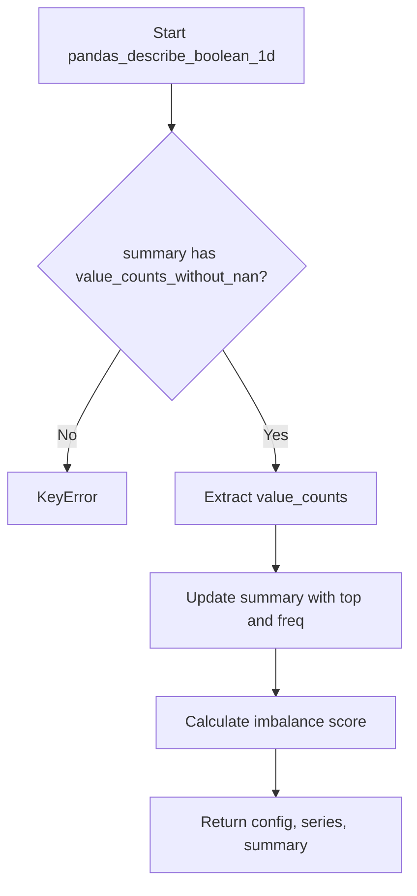

# `describe_boolean_pandas.py`

## `src.ydata_profiling.model.pandas.describe_boolean_pandas.pandas_describe_boolean_1d` · *function*

## Summary:
Computes additional statistical measures for boolean data series including top value frequency and imbalance score.

## Description:
This function enhances the summary statistics for boolean data by calculating the most frequent value and its frequency, as well as determining the class imbalance score. It serves as a specialized processing step for boolean data types within the profiling pipeline.

The function is called during the descriptive statistics computation phase for boolean columns, specifically when the column contains boolean data. It extracts the top value and frequency from existing value counts and computes an imbalance score to indicate how evenly distributed the boolean values are.

This logic is extracted into its own function to separate the concerns of basic statistical computation from specialized boolean data processing, making the code more modular and maintainable.

## Args:
    config (Settings): Configuration settings for the profiling process
    series (pd.Series): The boolean data series being analyzed
    summary (dict): Dictionary containing existing summary statistics including value_counts_without_nan

## Returns:
    Tuple[Settings, pd.Series, dict]: The unchanged config, series, and updated summary dictionary with additional keys 'top', 'freq', and 'imbalance'

## Raises:
    KeyError: When 'value_counts_without_nan' key is missing from the summary dictionary
    IndexError: When value_counts is empty, causing index access to fail

## Constraints:
    Preconditions:
        - The summary dictionary must contain 'value_counts_without_nan' key
        - The value_counts_without_nan must be a pandas Series with at least one element
        - The series should contain boolean data (though not validated)
    
    Postconditions:
        - The summary dictionary will contain 'top' key with the most frequent value
        - The summary dictionary will contain 'freq' key with the frequency count of the most frequent value
        - The summary dictionary will contain 'imbalance' key with the computed imbalance score

## Side Effects:
    None

## Control Flow:


## Examples:
```python
# Typical usage in profiling pipeline
config = Settings()
series = pd.Series([True, False, True, True])
summary = {"value_counts_without_nan": pd.Series([True: 3, False: 1])}
updated_config, updated_series, updated_summary = pandas_describe_boolean_1d(config, series, summary)
# Result: updated_summary contains 'top': True, 'freq': 3, 'imbalance': ~0.415
```

