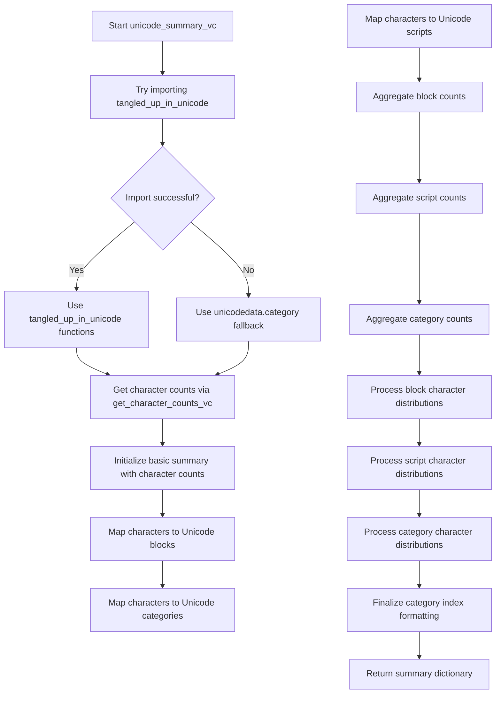
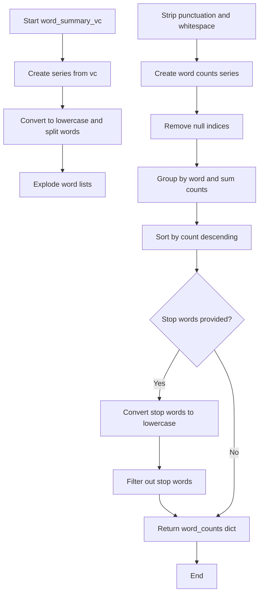
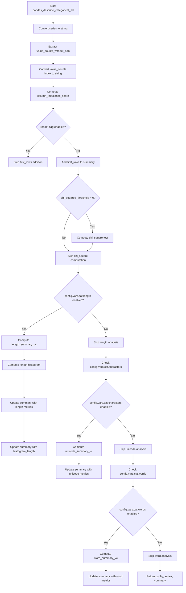

# `describe_categorical_pandas.py`

## `src.ydata_profiling.model.pandas.describe_categorical_pandas.get_character_counts_vc` · *function*

## Summary:
Computes aggregated character frequency counts from a pandas Series of character-value pairs.

## Description:
This function takes a pandas Series where the index contains individual characters and the values represent their occurrence counts. It processes these character-value pairs to compute total character frequencies across all entries. This utility is used in categorical data analysis to understand character distribution patterns.

## Args:
    vc (pd.Series): A pandas Series where each index element is a single character and each value represents the count/frequency of that character.

## Returns:
    pd.Series: A pandas Series containing aggregated character frequencies, indexed by character and sorted in descending order of frequency. Empty characters are filtered out.

## Raises:
    None explicitly raised.

## Constraints:
    Preconditions:
        - Input Series must have a valid index containing single-character strings
        - Values in the Series should represent counts or frequencies
    Postconditions:
        - Output Series is sorted by frequency in descending order
        - Empty characters are excluded from results
        - All returned characters have length > 0

## Side Effects:
    None.

## Control Flow:
```mermaid
flowchart TD
    A[Input vc Series] --> B[Create series with vc.index as values and vc as index]
    B --> C[Filter out empty strings from original series]
    C --> D[Apply list() to each remaining entry (convert to list of chars)]
    D --> E[Explode list elements into separate rows]
    E --> F[Create new Series with characters as index and original indices as values]
    F --> G[Drop NA values]
    G --> H{Length > 0?}
    H -->|Yes| I[Group by level 0, sum values]
    I --> J[Sort by values descending]
    J --> K[Filter out zero-length characters]
    K --> L[Return result]
    H -->|No| L
```

## Examples:
```python
import pandas as pd

# Basic usage with single characters
vc = pd.Series([10, 5, 3], index=['a', 'b', 'c'])
result = get_character_counts_vc(vc)
# Returns: Series(['a': 10, 'b': 5, 'c': 3]) sorted by frequency

# Usage with repeated characters from multiple entries
vc = pd.Series([2, 1, 3], index=['x', 'y', 'z'])
result = get_character_counts_vc(vc)
# Returns: Series(['x': 2, 'y': 1, 'z': 3]) sorted by frequency

# Edge case: empty characters are filtered out
vc = pd.Series([1, 2], index=['', 'a'])
result = get_character_counts_vc(vc)
# Returns: Series(['a': 2]) - empty character filtered out
```

## `src.ydata_profiling.model.pandas.describe_categorical_pandas.get_character_counts` · *function*

## Summary:
Computes character frequency counts for all characters in a pandas Series of strings.

## Description:
This function takes a pandas Series containing string data and returns a Counter object with the frequency count of each character across all strings in the series. It concatenates all strings in the series using the str.cat() method before counting individual characters. This function is typically used in text analysis and profiling workflows to understand character distributions in categorical data.

## Args:
    series (pd.Series): A pandas Series containing string data to analyze. The series may contain null values which are handled appropriately by the underlying str.cat() method.

## Returns:
    Counter: A collections.Counter object mapping each unique character to its total frequency count across all strings in the series. Empty series returns empty Counter.

## Raises:
    None explicitly raised.

## Constraints:
    Preconditions:
        - Input series must be a valid pandas Series
        - Series should contain string data or data that can be converted to strings
    Postconditions:
        - Returns a Counter object with character frequencies
        - Null values in the series are handled gracefully by str.cat()

## Side Effects:
    None.

## Control Flow:
```mermaid
flowchart TD
    A[Start get_character_counts] --> B{Input validation}
    B --> C[series.str.cat()]
    C --> D[Counter()]
    D --> E[Return Counter]
```

## Examples:
```python
import pandas as pd
from collections import Counter
from ydata_profiling.model.pandas.describe_categorical_pandas import get_character_counts

# Basic usage
series = pd.Series(['hello', 'world'])
result = get_character_counts(series)
print(result)  # Counter({'l': 3, 'o': 2, 'h': 1, 'e': 1, 'w': 1, 'r': 1, 'd': 1})

# Series with null values
series_with_nulls = pd.Series(['hello', None, 'world'])
result = get_character_counts(series_with_nulls)
print(result)  # Counter({'l': 3, 'o': 2, 'h': 1, 'e': 1, 'w': 1, 'r': 1, 'd': 1})

# Empty series
empty_series = pd.Series([], dtype='object')
result = get_character_counts(empty_series)
print(result)  # Counter()
```

## `src.ydata_profiling.model.pandas.describe_categorical_pandas.counter_to_series` · *function*

## Summary:
Converts a Counter object into a pandas Series with items as the index and their counts as values.

## Description:
This function transforms a collections.Counter object into a pandas Series where each unique item from the counter becomes an index label and its corresponding count becomes the value. The function handles empty counters gracefully by returning an empty Series with object dtype. This utility function is used internally to convert categorical data frequency counts into a standardized pandas Series format.

## Args:
    counter (Counter): A collections.Counter object containing items and their counts

## Returns:
    pd.Series: A pandas Series with items from the counter as the index and their counts as values, ordered by frequency (most common first). When the counter is empty, returns an empty Series with object dtype.

## Raises:
    None explicitly raised

## Constraints:
    Preconditions:
        - Input must be a collections.Counter object
        - Counter can be empty or contain items
    Postconditions:
        - Returns a pandas Series with object dtype when counter is empty
        - Returns a pandas Series with counts as values and items as index when counter has items
        - Items are ordered by frequency (most common first) in the returned Series

## Side Effects:
    None

## Control Flow:
```mermaid
flowchart TD
    A[Start counter_to_series] --> B{Is counter empty?}
    B -- Yes --> C[Return empty Series]
    B -- No --> D[Get most_common() tuples]
    D --> E[Unpack items and counts using zip(*...)]
    E --> F[Create Series with counts as values, items as index]
    C --> G[End]
    F --> G
```

## Examples:
    >>> from collections import Counter
    >>> counter = Counter(['a', 'b', 'c', 'a', 'b', 'a'])
    >>> result = counter_to_series(counter)
    >>> print(result)
    a    3
    b    2
    c    1
    dtype: int64
    
    >>> empty_counter = Counter()
    >>> result = counter_to_series(empty_counter)
    >>> print(result)
    Series([], dtype: object)
```

## `src.ydata_profiling.model.pandas.describe_categorical_pandas.unicode_summary_vc` · *function*

## Summary:
Computes detailed Unicode character statistics for a pandas Series containing character frequency data.

## Description:
Analyzes character frequency data from a pandas Series to generate comprehensive Unicode metadata including character blocks, scripts, and categories. This function serves as a core utility for categorical data profiling, providing insights into the Unicode characteristics of textual data. It is typically invoked during the analysis of categorical columns containing text data to understand character composition and distribution patterns.

## Args:
    vc (pd.Series): A pandas Series where each index element is a single character and each value represents the count/frequency of that character.

## Returns:
    dict: A dictionary containing comprehensive Unicode statistics including:
        - "n_characters_distinct": Total number of distinct characters
        - "n_characters": Total count of all characters
        - "character_counts": A pandas Series with character frequencies
        - "category_alias_values": Mapping of characters to Unicode category long names
        - "block_alias_values": Mapping of characters to Unicode block abbreviations
        - "block_alias_counts": A pandas Series with block name counts
        - "n_block_alias": Number of distinct Unicode blocks
        - "block_alias_char_counts": Dictionary mapping block names to character counts
        - "script_counts": A pandas Series with script name counts
        - "n_scripts": Number of distinct Unicode scripts
        - "script_char_counts": Dictionary mapping script names to character counts
        - "category_alias_counts": A pandas Series with category name counts
        - "n_category": Number of distinct Unicode categories
        - "category_alias_char_counts": Dictionary mapping category names to character counts

## Raises:
    None explicitly raised.

## Constraints:
    Preconditions:
        - Input Series must have a valid index containing single-character strings
        - Values in the Series should represent counts or frequencies
    Postconditions:
        - Output dictionary contains all Unicode metadata fields
        - All character counts are properly aggregated by Unicode properties
        - Empty characters are filtered out from results

## Side Effects:
    None.

## Control Flow:


## Examples:
```python
import pandas as pd
from src.ydata_profiling.model.pandas.describe_categorical_pandas import unicode_summary_vc

# Basic usage with character frequency data
vc = pd.Series([10, 5, 3], index=['a', 'b', 'c'])
result = unicode_summary_vc(vc)

# Result contains keys like:
# - 'n_characters_distinct': 3
# - 'n_characters': 18
# - 'character_counts': Series with character frequencies
# - 'block_alias_values': Mapping of characters to Unicode blocks
# - 'script_counts': Series with script name counts
# - 'category_alias_counts': Series with category name counts
```

## `src.ydata_profiling.model.pandas.describe_categorical_pandas.word_summary_vc` · *function*

## Summary:
Computes word frequency counts from a categorical value count series, optionally filtering out stop words.

## Description:
Processes a pandas Series containing categorical values and their counts to extract individual words and compute their frequencies. The function transforms the input into a word-level frequency distribution, applying optional stop word filtering. This extraction enables downstream analysis of textual content within categorical data.

## Args:
    vc (pandas.Series): A pandas Series where the index contains categorical values and the values represent their counts.
    stop_words (List[str], optional): A list of stop words to exclude from the word count results. Defaults to an empty list.

## Returns:
    dict: A dictionary containing the key "word_counts" mapping to a pandas Series of word frequencies sorted in descending order. Returns an empty dictionary if no valid words remain after processing or stop word filtering.

## Raises:
    None explicitly raised.

## Constraints:
    Preconditions:
        - The input `vc` must be a pandas Series with categorical values as the index and numeric counts as values.
        - The `stop_words` parameter must be a list of strings if provided.
    Postconditions:
        - The returned dictionary will contain a "word_counts" key with a pandas Series of word frequencies.
        - Word frequencies are sorted in descending order.
        - All words are converted to lowercase.
        - Stop words are filtered out if provided.

## Side Effects:
    None.

## Control Flow:


## Examples:
```python
import pandas as pd
from src.ydata_profiling.model.pandas.describe_categorical_pandas import word_summary_vc

# Example 1: Basic usage
vc = pd.Series([10, 5, 3], index=['apple pie', 'banana split', 'cherry pie'])
result = word_summary_vc(vc)
# Returns {'word_counts': pd.Series([10, 5, 3, 3, 1], index=['apple', 'pie', 'banana', 'split', 'cherry'])}

# Example 2: With stop words
vc = pd.Series([10, 5], index=['the cat', 'a dog'])
result = word_summary_vc(vc, stop_words=['the', 'a'])
# Returns {'word_counts': pd.Series([10, 5], index=['cat', 'dog'])}

# Example 3: Empty result case
vc = pd.Series([1], index=[''])
result = word_summary_vc(vc)
# Returns {}

# Example 4: Stop words filtering removes all words
vc = pd.Series([1], index=['the'])
result = word_summary_vc(vc, stop_words=['the'])
# Returns {}
```

## `src.ydata_profiling.model.pandas.describe_categorical_pandas.length_summary_vc` · *function*

## Summary:
Computes comprehensive length statistics for categorical data by analyzing character lengths of values in a value count series.

## Description:
This function processes a pandas Series containing categorical values and their counts to compute descriptive statistics about the character lengths of those values. It transforms the input value count series into a length distribution, then calculates key statistical measures including maximum, minimum, mean, median, and generates a histogram of length frequencies.

The function is extracted from the categorical data profiling pipeline to encapsulate the specific logic of length analysis, separating concerns from the broader categorical description logic. This modularization allows for reuse in different profiling contexts while maintaining clean separation of responsibilities.

## Args:
    vc (pd.Series): A pandas Series where the index contains categorical values and the values represent their respective counts.

## Returns:
    dict: A dictionary containing:
        - "max_length" (int): The maximum character length found among all categorical values
        - "mean_length" (float): The weighted average character length across all values
        - "median_length" (int): The weighted median character length
        - "min_length" (int): The minimum character length found among all categorical values
        - "length_histogram" (pd.Series): A Series indexed by character lengths with values representing the count of occurrences for each length

## Raises:
    None explicitly raised - however, underlying operations may raise exceptions from pandas/numpy operations if input is malformed.

## Constraints:
    Preconditions:
        - Input vc must be a pandas Series with valid index and numeric values
        - Index values should be hashable (typically strings or similar)
        
    Postconditions:
        - Output dictionary always contains exactly the five keys mentioned
        - All statistical values are computed from the same underlying length distribution
        - The length_histogram maintains the original order of unique lengths from highest to lowest frequency

## Side Effects:
    None - This function is pure and has no side effects.

## Control Flow:
```mermaid
flowchart TD
    A[Start with vc Series] --> B[Create series with vc.index as values and vc as index]
    B --> C[Compute character lengths of series values]
    C --> D[Create length_counts series with lengths as index and original indices as values]
    D --> E[Group by length (level=0) and sum counts]
    E --> F[Sort by count descending]
    F --> G[Calculate max_length from index]
    G --> H[Calculate mean_length using weighted average]
    H --> I[Calculate median_length using weighted_median]
    I --> J[Calculate min_length from index]
    J --> K[Return summary dictionary]
```

## Examples:
```python
import pandas as pd
import numpy as np

# Basic usage
vc = pd.Series([3, 1, 2], index=['a', 'bb', 'ccc'])
result = length_summary_vc(vc)
print(result)
# Expected output:
# {'max_length': 3, 'mean_length': 2.0, 'median_length': 2, 'min_length': 1, 'length_histogram': ...}

# With empty series
empty_vc = pd.Series([], dtype='object')
result = length_summary_vc(empty_vc)
# Will result in empty length_histogram and potentially NaN values

# Edge case with single value
single_vc = pd.Series([5], index=['hello'])
result = length_summary_vc(single_vc)
# Expected output:
# {'max_length': 5, 'mean_length': 5.0, 'median_length': 5, 'min_length': 5, 'length_histogram': ...}

# Edge case with repeated lengths
repeated_vc = pd.Series([2, 3, 1], index=['aa', 'bb', 'cc'])
result = length_summary_vc(repeated_vc)
# Expected output:
# {'max_length': 2, 'mean_length': 2.0, 'median_length': 2, 'min_length': 2, 'length_histogram': ...}
```

## `src.ydata_profiling.model.pandas.describe_categorical_pandas.pandas_describe_categorical_1d` · *function*

## Summary:
Processes and enriches categorical data summaries with statistical measures, character analysis, and distribution metrics.

## Description:
This function performs comprehensive analysis of categorical data by computing various statistical measures and enriching the summary dictionary with additional metadata. It handles conversion of data to string representation, computes imbalance scores, and conditionally adds detailed character-level analyses based on configuration settings.

The function is designed to be part of a larger categorical data profiling pipeline, extracting specific analytical responsibilities into reusable components. It serves as a bridge between raw categorical data and enriched statistical summaries, enabling downstream analysis tools to access comprehensive descriptive statistics.

## Args:
    config (Settings): Configuration object containing various profiling settings including categorical and numerical parameters
    series (pd.Series): Input pandas Series containing categorical data that needs to be analyzed
    summary (dict): Dictionary containing existing summary statistics including value_counts_without_nan

## Returns:
    Tuple[Settings, pd.Series, dict]: Returns the updated configuration, series (converted to string), and enhanced summary dictionary

## Raises:
    None explicitly raised - however, underlying operations may raise exceptions from pandas/numpy operations if inputs are malformed.

## Constraints:
    Preconditions:
        - Input series must be a valid pandas Series
        - Summary dictionary must contain "value_counts_without_nan" key with valid pandas Series data
        - Config object must be properly initialized with required settings
        
    Postconditions:
        - Series is converted to string type
        - Value counts index is also converted to string type
        - Summary dictionary is updated with additional computed metrics
        - Imbalance score is always computed and added to summary
        - Conditional metrics (first_rows, chi_squared, length, characters, words) are added based on config flags

## Side Effects:
    - Modifies the input summary dictionary in-place by adding new keys
    - Converts input series and value counts index to string type
    - May add new entries to the summary dictionary based on configuration flags

## Control Flow:


## Examples:
```python
import pandas as pd
from ydata_profiling.config import Settings

# Basic usage with minimal configuration
config = Settings()
series = pd.Series(['A', 'B', 'A', 'C', 'B', 'A'])
summary = {"value_counts_without_nan": pd.Series([3, 2, 1], index=['A', 'B', 'C'])}

# Call the function
updated_config, updated_series, updated_summary = pandas_describe_categorical_1d(config, series, summary)

# The summary now contains additional computed metrics like imbalance score
print(updated_summary.keys())
# Output includes: 'imbalance', 'first_rows', and potentially others based on config
```

