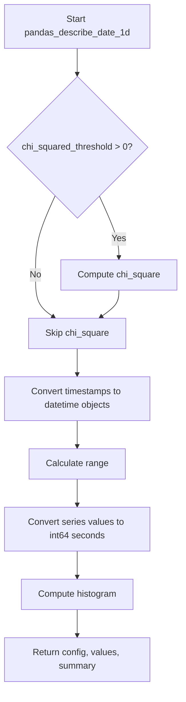

# `describe_date_pandas.py`

## `src.ydata_profiling.model.pandas.describe_date_pandas.pandas_describe_date_1d` · *function*

## Summary:
Computes descriptive statistics for a pandas datetime series, including min/max values, range, chi-square test results, and histogram data.

## Description:
This function processes a pandas Series containing datetime data to compute various statistical measures and distributions. It extracts temporal information such as minimum and maximum timestamps, calculates the date range, converts timestamp values to integers for numerical analysis, and optionally performs statistical tests and histogram computations based on configuration settings.

The function is designed to be part of a larger profiling pipeline where date/time series data needs detailed statistical analysis. It's extracted into its own function to encapsulate the specific logic for handling datetime data types while maintaining clean separation from other data type processing logic.

## Args:
    config (Settings): Configuration object containing settings for statistical analysis and plotting parameters
    series (pd.Series): A pandas Series containing datetime data to be analyzed
    summary (dict): Dictionary to be updated with computed statistics and metadata

## Returns:
    Tuple[Settings, np.ndarray, dict]: Returns the updated configuration, converted integer values (in seconds since epoch), and updated summary dictionary

## Raises:
    None explicitly raised - relies on underlying functions for exception handling

## Constraints:
    Preconditions:
        - The series parameter must contain valid pandas datetime data
        - The config parameter must be a properly initialized Settings object
        - The summary parameter must be a mutable dictionary
    
    Postconditions:
        - The summary dictionary will contain keys: 'min', 'max', 'range', and potentially 'chi_squared' and histogram data
        - The returned values will be integer representations of the datetime values in seconds since epoch

## Side Effects:
    - Modifies the summary dictionary in-place by updating it with computed statistics
    - No direct I/O operations or external state mutations

## Control Flow:

## Examples:
    # Basic usage with minimal configuration
    config = Settings()
    series = pd.Series([pd.Timestamp('2020-01-01'), pd.Timestamp('2020-12-31')])
    summary = {}
    result = pandas_describe_date_1d(config, series, summary)
    
    # Usage with chi-square enabled
    config.vars.num.chi_squared_threshold = 0.5
    result = pandas_describe_date_1d(config, series, summary)
    # Result will include chi_squared in summary

