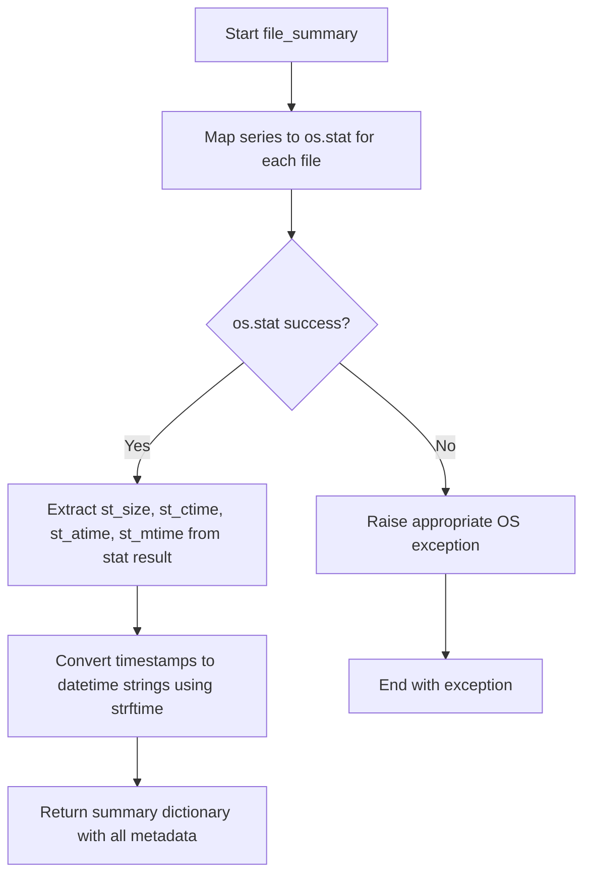
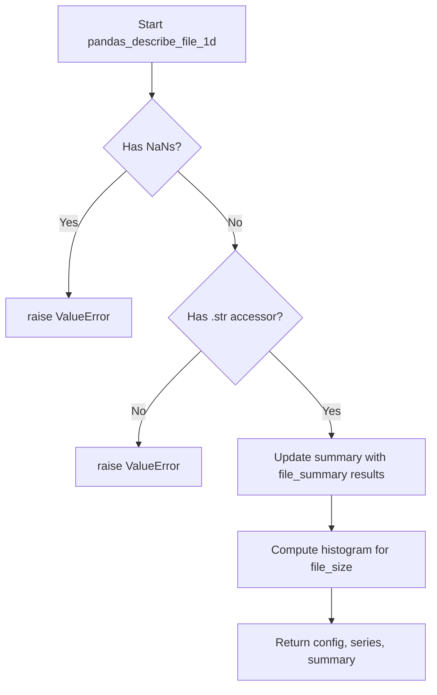

# `describe_file_pandas.py`

## `src.ydata_profiling.model.pandas.describe_file_pandas.file_summary` · *function*

## Summary:
Computes file metadata statistics for a pandas Series of file paths, including size and timestamp information.

## Description:
Processes a pandas Series containing file paths and extracts filesystem metadata for each file. This function encapsulates the logic for gathering file statistics such as size and various timestamps (creation, access, modification) while converting timestamps to human-readable datetime strings. The function is designed to work with pandas Series objects and leverages pandas' map functionality for efficient processing.

## Args:
    series (pandas.Series): A pandas Series containing file paths as strings

## Returns:
    dict: A dictionary containing four keys with pandas Series values:
        - "file_size": Series of file sizes in bytes
        - "file_created_time": Series of creation timestamps as formatted strings in "%Y-%m-%d %H:%M:%S" format
        - "file_accessed_time": Series of last access timestamps as formatted strings in "%Y-%m-%d %H:%M:%S" format
        - "file_modified_time": Series of last modification timestamps as formatted strings in "%Y-%m-%d %H:%M:%S" format

## Raises:
    FileNotFoundError: When any file path in the input series does not exist
    PermissionError: When access to any file path is denied
    OSError: When there are general OS errors accessing file metadata

## Constraints:
    Preconditions:
        - Input series must contain valid file paths as strings
        - Files must be accessible for stat operations
    Postconditions:
        - All returned Series have the same length as the input series
        - Timestamps are consistently converted to "%Y-%m-%d %H:%M:%S" format

## Side Effects:
    - Performs filesystem I/O operations for each file path in the input series
    - Calls os.stat() for each file path, which may involve disk access
    - May raise filesystem-related exceptions if files are inaccessible

## Control Flow:


## Examples:
```python
import pandas as pd
from src.ydata_profiling.model.pandas.describe_file_pandas import file_summary

# Basic usage
file_paths = pd.Series(['file1.txt', 'file2.txt'])
result = file_summary(file_paths)
print(result['file_size'])  # Series of file sizes in bytes
print(result['file_created_time'])  # Series of formatted creation dates
```

## `src.ydata_profiling.model.pandas.describe_file_pandas.pandas_describe_file_1d` · *function*

## Summary:
Processes a pandas Series of file paths to compute file metadata statistics and histogram data for profiling.

## Description:
This function serves as a specialized data processing step in the profiling pipeline that extracts filesystem metadata from a pandas Series containing file paths. It validates the input data, computes file statistics using the `file_summary` helper function, and generates histogram data for file sizes. The function is part of the pandas-specific profiling implementation and acts as a bridge between raw file path data and statistical summaries used in data profiling reports.

The function is extracted into its own component to enforce clear separation between data validation, metadata extraction, and histogram computation logic, making the profiling pipeline more modular and testable.

## Args:
    config (Settings): Configuration object containing plotting settings and parameters
    series (pandas.Series): A pandas Series containing file paths as strings
    summary (dict): Dictionary to be updated with computed file statistics and histogram data

## Returns:
    Tuple[Settings, pandas.Series, dict]: A tuple containing the unchanged config, the original series, and the updated summary dictionary

## Raises:
    ValueError: When the input series contains NaN values or lacks string accessor functionality
    FileNotFoundError: When any file path in the input series does not exist
    PermissionError: When access to any file path is denied
    OSError: When there are general OS errors accessing file metadata

## Constraints:
    Preconditions:
        - Input series must not contain NaN values
        - Input series must have a string accessor (.str)
        - All file paths in the series must be valid and accessible
    Postconditions:
        - The summary dictionary is updated with file metadata and histogram data
        - The returned tuple maintains the original input parameters unchanged

## Side Effects:
    - Performs filesystem I/O operations for each file path in the input series
    - Calls os.stat() for each file path, which may involve disk access
    - Updates the provided summary dictionary with computed statistics
    - May raise filesystem-related exceptions if files are inaccessible

## Control Flow:


## Examples:
```python
import pandas as pd
from ydata_profiling.config import Settings
from src.ydata_profiling.model.pandas.describe_file_pandas import pandas_describe_file_1d

# Basic usage
config = Settings()
file_paths = pd.Series(['file1.txt', 'file2.txt'])
summary = {}

try:
    config, series, summary = pandas_describe_file_1d(config, file_paths, summary)
    print("File statistics computed successfully")
    print(f"File sizes: {summary['file_size']}")
except (ValueError, FileNotFoundError, PermissionError) as e:
    print(f"Error processing files: {e}")
```

