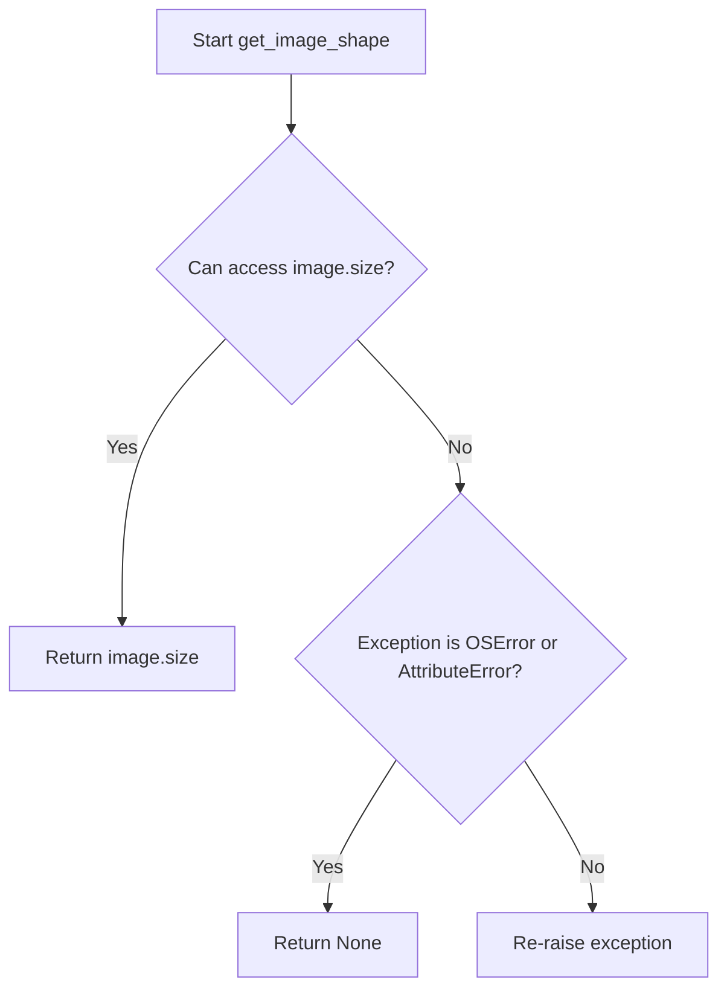
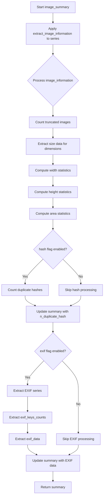

# `describe_image_pandas.py`

## `src.ydata_profiling.model.pandas.describe_image_pandas.open_image` · *function*

## Summary:
Attempts to open and load an image file from the specified path, returning the loaded PIL Image object or None if the operation fails.

## Description:
This function serves as a safe wrapper around PIL's Image.open() method to handle potential errors when loading image files. It is designed to gracefully handle corrupted or unsupported image formats by catching specific exceptions and returning None instead of propagating errors.

The function is typically called during image processing workflows where robustness against malformed image files is required. It's part of the image profiling pipeline in the ydata-profiling library, specifically used in the describe_image_pandas module for analyzing image datasets.

This logic is extracted into its own function rather than being inlined to provide a centralized error handling mechanism for image loading operations, making the code more maintainable and reusable across different image processing contexts.

## Args:
    path (Path): A pathlib.Path object pointing to the image file to be opened

## Returns:
    Optional[Image.Image]: A PIL Image object if the file is successfully opened, or None if the file cannot be opened due to OSError or AttributeError

## Raises:
    This function does not raise exceptions directly, but catches and handles OSError and AttributeError exceptions internally

## Constraints:
    Preconditions:
    - The path parameter must be a valid pathlib.Path object
    - The file at the specified path must be readable
    
    Postconditions:
    - If successful, returns a valid PIL Image object
    - If unsuccessful, returns None without raising an exception

## Side Effects:
    - Reads from the filesystem at the specified path
    - May trigger file system I/O operations (reading image metadata, pixel data)

## Control Flow:
```mermaid
flowchart TD
    A[Start open_image] --> B{Try Image.open(path)}
    B -->|Success| C[Return Image object]
    B -->|OSError/AttributeError| D[Return None]
    C --> E[End]
    D --> E
```

## Examples:
```python
from pathlib import Path
from PIL import Image

# Successful case
image_path = Path("example.jpg")
img = open_image(image_path)
if img is not None:
    print(f"Loaded image with size {img.size}")
else:
    print("Failed to load image")

# Failed case (corrupted file)
bad_path = Path("corrupted.png")
img = open_image(bad_path)
assert img is None
```

## `src.ydata_profiling.model.pandas.describe_image_pandas.is_image_truncated` · *function*

## Summary:
Determines whether an image object is truncated by attempting to load its pixel data and catching loading errors.

## Description:
This function tests if an image is corrupted or truncated by invoking the PIL Image.load() method. When an image is malformed or incomplete, loading its pixel data raises either an OSError or AttributeError. The function catches these exceptions and returns True to indicate truncation, while returning False if the image loads successfully.

The logic is extracted into a separate function to encapsulate the error handling and validation of image integrity, allowing the calling code to cleanly distinguish between valid and invalid images without cluttering the main processing flow with exception handling.

## Args:
    image (PIL.Image): A PIL Image object representing the image to check for truncation.

## Returns:
    bool: True if the image is truncated or corrupted (unable to load pixel data), False otherwise.

## Raises:
    None: Exceptions are caught internally and converted to boolean return values.

## Constraints:
    Preconditions:
        - The input must be a valid PIL Image object.
        - The image object should not be None.
    
    Postconditions:
        - The function always returns a boolean value (True or False).
        - No side effects occur beyond attempting to load image data.

## Side Effects:
    - May perform I/O operations when calling image.load() if the image data needs to be read from disk or memory.
    - No external state mutations or service calls.

## Control Flow:
```mermaid
flowchart TD
    A[Start is_image_truncated] --> B{Call image.load()}
    B --> C{Exception raised?}
    C -->|Yes| D[Return True]
    C -->|No| E[Return False]
    D --> F[End]
    E --> F
```

## Examples:
```python
from PIL import Image

# Valid image
img = Image.open("valid_image.jpg")
result = is_image_truncated(img)  # Returns False

# Truncated/corrupted image
img = Image.open("corrupt_image.jpg")
result = is_image_truncated(img)  # Returns True
```

## `src.ydata_profiling.model.pandas.describe_image_pandas.get_image_shape` · *function*

## Summary:
Retrieves the dimensions (width and height) of a PIL Image object, returning None if the operation fails.

## Description:
Extracts the size tuple (width, height) from a PIL Image object. This function serves as a safe wrapper around accessing the `.size` attribute of PIL images, handling potential errors gracefully by returning None when the image is invalid or malformed. It is designed to prevent crashes when working with potentially corrupted or improperly loaded images in data profiling workflows.

## Args:
    image (Image): A PIL Image object from which to extract dimensions.

## Returns:
    Optional[Tuple[int, int]]: A tuple containing (width, height) if successful, or None if the image is invalid or inaccessible.

## Raises:
    None explicitly raised, but handles OSError and AttributeError internally by returning None.

## Constraints:
    Preconditions:
        - The input must be a valid PIL Image object.
        - The image object must have a `.size` attribute accessible.
    
    Postconditions:
        - Returns either a tuple of two integers representing width and height, or None.
        - Does not modify the input image object.

## Side Effects:
    None.

## Control Flow:


## Examples:
    # Valid image
    >>> from PIL import Image
    >>> img = Image.new('RGB', (100, 200))
    >>> get_image_shape(img)
    (100, 200)
    
    # Invalid image (simulated)
    >>> get_image_shape(None)
    None
```

## `src.ydata_profiling.model.pandas.describe_image_pandas.hash_image` · *function*

## Summary:
Computes a perceptual hash of an image using the pHash algorithm and returns it as a string representation.

## Description:
This function takes a PIL Image object and computes its perceptual hash using the imagehash library's phash function. The perceptual hash is a compact representation that captures the visual characteristics of an image, making it useful for detecting similar images. The function handles potential errors during hash computation by returning None when the operation fails.

## Args:
    image (PIL.Image): A PIL Image object to compute the perceptual hash for

## Returns:
    Optional[str]: String representation of the perceptual hash if successful, None if hash computation fails due to OSError or AttributeError

## Raises:
    None explicitly raised, but may propagate OSError or AttributeError from imagehash.phash()

## Constraints:
    Preconditions:
        - Input must be a valid PIL Image object
        - Image data must be readable and valid for hash computation
    
    Postconditions:
        - Returns either a string representation of the hash or None
        - Original image object is not modified

## Side Effects:
    None

## Control Flow:
```mermaid
flowchart TD
    A[Start hash_image] --> B{imagehash.phash success?}
    B -->|Yes| C[Return str(phash)]
    B -->|No| D{Exception type?}
    D -->|OSError/AttributeError| E[Return None]
    D -->|Other| F[Raise exception]
```

## Examples:
    # Successful hash computation
    img = Image.open('example.jpg')
    hash_value = hash_image(img)
    # Returns: "1234567890abcdef" (string format of hash)
    
    # Failed hash computation
    bad_img = Image.new('RGB', (100, 100))  # Invalid image data
    hash_value = hash_image(bad_img)
    # Returns: None
```

## `src.ydata_profiling.model.pandas.describe_image_pandas.decode_byte_exif` · *function*

## Summary:
Decodes EXIF byte data into a string representation for image metadata processing.

## Description:
This function handles the conversion of EXIF metadata that may be stored as either a string or bytes format into a consistent string representation. It serves as a utility function to normalize EXIF data types before further processing in image analysis workflows. This function is typically used when extracting metadata from images where EXIF data might be represented in different formats.

## Args:
    exif_val (Union[str, bytes]): The EXIF metadata value that can be either a string or bytes object representing image metadata.

## Returns:
    str: A string representation of the EXIF metadata value. If the input is already a string, it is returned unchanged. If the input is bytes, it is decoded using UTF-8 encoding.

## Raises:
    UnicodeDecodeError: When the bytes object cannot be decoded using UTF-8 encoding, which occurs if the EXIF data contains invalid UTF-8 sequences.

## Constraints:
    Preconditions:
        - Input must be either a string or bytes object
        - Bytes objects must be valid UTF-8 encoded data
    
    Postconditions:
        - Always returns a string object
        - Input is not modified

## Side Effects:
    None

## Control Flow:
```mermaid
flowchart TD
    A[decode_byte_exif] --> B{isinstance(exif_val, str)?}
    B -- Yes --> C[Return exif_val]
    B -- No --> D[exif_val.decode()]
    D --> E[Return decoded string]
```

## Examples:
    # Example 1: String input (no change)
    result = decode_byte_exif("Camera Model XYZ")
    # Returns: "Camera Model XYZ"
    
    # Example 2: Bytes input (decoded)
    result = decode_byte_exif(b"Camera Model XYZ")
    # Returns: "Camera Model XYZ"
    
    # Example 3: Error case (invalid UTF-8 bytes)
    try:
        decode_byte_exif(b"\xff\xfe")
    except UnicodeDecodeError:
        print("Failed to decode EXIF bytes")
```

## `src.ydata_profiling.model.pandas.describe_image_pandas.extract_exif` · *function*

## Summary:
Extracts and processes EXIF metadata from PIL Image objects into a standardized dictionary format.

## Description:
This function retrieves EXIF metadata from a PIL Image object and converts it into a dictionary mapping human-readable tag names to their corresponding values. The function handles potential errors during EXIF extraction gracefully by returning an empty dictionary when issues occur. It is designed to work with PIL's Image objects and specifically uses the `_getexif()` method to access EXIF data.

## Args:
    image (PIL.Image): A PIL Image object from which EXIF metadata should be extracted.

## Returns:
    dict: A dictionary containing EXIF metadata where keys are human-readable tag names (from ExifTags.TAGS) and values are the corresponding metadata values. Returns an empty dictionary if no EXIF data is available or if an error occurs during extraction.

## Raises:
    None: This function catches and handles AttributeError and OSError exceptions internally, ensuring it always returns a dictionary.

## Constraints:
    Preconditions:
        - The input must be a valid PIL Image object
        - The image object must support the _getexif() method
        
    Postconditions:
        - Always returns a dictionary object
        - Input image object is not modified

## Side Effects:
    None

## Control Flow:
```mermaid
flowchart TD
    A[extract_exif] --> B[image._getexif()]
    B --> C{exif_data is not None?}
    C -- Yes --> D[Process EXIF data]
    C -- No --> E[Return empty dict]
    D --> F{All keys in ExifTags.TAGS?}
    F -- Yes --> G[Build result dict]
    F -- No --> G
    G --> H[Return result dict]
    H --> I[End]
    E --> I
```

## Examples:
    # Basic usage with a valid image
    from PIL import Image
    img = Image.open('sample.jpg')
    exif_data = extract_exif(img)
    # Returns: {'Make': 'Canon', 'Model': 'EOS 5D', ...} or {} if no EXIF
    
    # Usage with image lacking EXIF data
    img_no_exif = Image.new('RGB', (100, 100))
    exif_data = extract_exif(img_no_exif)
    # Returns: {}
```

## `src.ydata_profiling.model.pandas.describe_image_pandas.path_is_image` · *function*

## Summary:
Determines whether a file path corresponds to an image file by checking its magic numbers.

## Description:
Checks if a given file path points to a valid image file by examining the file's magic numbers using the standard library's imghdr module. This function is used to filter out non-image files when processing image datasets. The function leverages Python's built-in imghdr module which identifies file types based on their magic numbers (file signatures).

## Args:
    p (Path): A pathlib.Path object representing the file path to check

## Returns:
    bool: True if the file at path p appears to be an image file, False otherwise

## Raises:
    None explicitly raised

## Constraints:
    Preconditions:
        - The file at path p must exist and be readable
        - The path must be a valid pathlib.Path object
    
    Postconditions:
        - Returns a boolean value indicating image file status
        - Does not modify the file or its metadata

## Side Effects:
    - Reads the beginning bytes of the file to determine its type
    - May raise OSError if the file cannot be accessed

## Control Flow:
```mermaid
flowchart TD
    A[Start path_is_image] --> B{imghdr.what(p) is not None?}
    B -- Yes --> C[Return True]
    B -- No --> D[Return False]
```

## Examples:
    >>> from pathlib import Path
    >>> path_is_image(Path("image.jpg"))
    True
    >>> path_is_image(Path("document.pdf"))
    False
```

## `src.ydata_profiling.model.pandas.describe_image_pandas.count_duplicate_hashes` · *function*

## Summary:
Counts the total number of duplicate image hash occurrences across a collection of image descriptions.

## Description:
This function processes a collection of image descriptions to calculate how many times identical image hashes appear. It extracts valid hash values from the image descriptions and uses pandas Series value_counts to determine frequency of each hash. The result represents the total count of duplicate occurrences (i.e., the sum of all counts minus the number of unique hashes).

## Args:
    image_descriptions (list): A list of dictionaries containing image description data, where each dictionary should potentially contain a "hash" key with a hash value.

## Returns:
    int: The total number of duplicate hash occurrences. This equals the sum of all hash frequencies minus the count of unique hashes.

## Raises:
    None explicitly raised.

## Constraints:
    Preconditions:
        - The input must be a list-like object
        - Each item in the list should support the 'hash' key lookup via x["hash"]
    Postconditions:
        - Returns a non-negative integer representing duplicate occurrences
        - Does not modify the input list

## Side Effects:
    None.

## Control Flow:
```mermaid
flowchart TD
    A[Start count_duplicate_hashes] --> B{image_descriptions}
    B --> C{Iterate through items}
    C --> D{Check if "hash" in x}
    D -->|Yes| E[Extract x["hash"]]
    D -->|No| F[Skip item]
    E --> G[Create Series from hashes]
    G --> H[Calculate value_counts()]
    H --> I[Return counts.sum() - len(counts)]
```

## Examples:
```python
# Example 1: Basic usage with duplicates
image_descs = [
    {"hash": "abc123"},
    {"hash": "def456"},
    {"hash": "abc123"},  # Duplicate
    {"hash": "ghi789"}
]
result = count_duplicate_hashes(image_descs)
# Returns 1 (one duplicate occurrence of "abc123")

# Example 2: No duplicates
image_descs = [
    {"hash": "abc123"},
    {"hash": "def456"},
    {"hash": "ghi789"}
]
result = count_duplicate_hashes(image_descs)
# Returns 0 (no duplicates)

# Example 3: All same hashes
image_descs = [
    {"hash": "abc123"},
    {"hash": "abc123"},
    {"hash": "abc123"}
]
result = count_duplicate_hashes(image_descs)
# Returns 2 (two duplicate occurrences)
```

## `src.ydata_profiling.model.pandas.describe_image_pandas.extract_exif_series` · *function*

## Summary:
Extracts and aggregates EXIF metadata from a list of image EXIF dictionaries into frequency count series.

## Description:
Processes a list of EXIF metadata dictionaries from images and creates aggregated frequency counts for both EXIF keys and their corresponding values. This function serves as a utility for analyzing common EXIF metadata patterns across a collection of images.

## Args:
    image_exifs (list): A list of dictionaries containing EXIF metadata from images. Each dictionary maps EXIF tag names to their values.

## Returns:
    dict: A dictionary mapping EXIF key names to pandas Series containing value frequencies. Additionally includes an 'exif_keys' entry mapping to a dictionary of EXIF key frequencies.

## Raises:
    None explicitly raised.

## Constraints:
    Preconditions:
        - Input must be a list of dictionaries
        - Each dictionary should contain EXIF tag-value pairs
    Postconditions:
        - Output dictionary contains entries for each unique EXIF key found
        - All values in the returned dictionary are either pandas Series objects or dictionaries

## Side Effects:
    None.

## Control Flow:
```mermaid
flowchart TD
    A[Start extract_exif_series] --> B[Initialize exif_keys and exif_values]
    B --> C[Iterate over image_exifs]
    C --> D{image_exif not empty?}
    D -->|Yes| E[Extend exif_keys with image_exif keys]
    E --> F[Iterate over image_exif items]
    F --> G{exif_key in exif_values?}
    G -->|No| H[Add exif_key to exif_values]
    H --> I[Append exif_val to exif_values[exif_key]]
    G -->|Yes| J[Append exif_val to exif_values[exif_key]]
    J --> K[Continue iteration]
    D -->|No| L[Continue iteration]
    L --> M[End iteration]
    M --> N[Create series['exif_keys'] from exif_keys]
    N --> O[Iterate over exif_values items]
    O --> P{Key-value pair in exif_values?}
    P -->|Yes| Q[Create series[key] from values]
    Q --> R[Continue iteration]
    P -->|No| S[End iteration]
    S --> T[Return series]
```

## Examples:
```python
# Basic usage
exifs = [
    {'Make': 'Canon', 'Model': 'EOS 5D'},
    {'Make': 'Canon', 'Model': 'EOS 5D Mark II'}
]
result = extract_exif_series(exifs)
# Result would contain frequency counts for 'Make', 'Model', and 'exif_keys'
```

## `src.ydata_profiling.model.pandas.describe_image_pandas.extract_image_information` · *function*

## Summary
Extracts key metadata and information from an image file, including whether it was successfully opened, if it's truncated, its dimensions, and optional EXIF data or perceptual hash.

## Description
This function provides a comprehensive interface for gathering basic image information from a file path. It safely attempts to open an image file and extracts various metadata properties such as file opening status, truncation status, image dimensions, and optionally EXIF metadata or perceptual hash values. The function is designed to handle potentially corrupted or unsupported image formats gracefully by returning None for problematic operations rather than raising exceptions.

The logic is extracted into its own function to provide a clean abstraction layer for image information gathering, separating concerns between image loading, validation, and metadata extraction. This allows higher-level functions to reliably process image data without needing to handle low-level image parsing complexities.

## Args
    path (Path): A pathlib.Path object pointing to the image file to analyze
    exif (bool): Flag indicating whether to extract EXIF metadata from the image. Defaults to False
    hash (bool): Flag indicating whether to compute a perceptual hash of the image. Defaults to False

## Returns
    dict: A dictionary containing image information with the following possible keys:
        - "opened" (bool): Whether the image file was successfully opened
        - "truncated" (bool): Whether the image appears to be truncated/corrupted (only present if opened=True)
        - "size" (tuple): Image dimensions as (width, height) in pixels (only present if opened=True and not truncated)
        - "exif" (dict): EXIF metadata dictionary (only present if exif=True and image is valid)
        - "hash" (str): Perceptual hash of the image as a hexadecimal string (only present if hash=True and image is valid)

## Raises
    This function does not raise exceptions directly. All internal operations that could raise exceptions are handled gracefully.

## Constraints
    Preconditions:
        - The path parameter must be a valid pathlib.Path object pointing to a readable file
        - The file at the specified path must be accessible for reading
        
    Postconditions:
        - Always returns a dictionary with at least the "opened" key
        - If image opening succeeds, additional keys are populated based on subsequent processing
        - No modifications are made to the original image file

## Side Effects
    - Reads from the filesystem at the specified path
    - May perform file system I/O operations to load image data
    - No external state mutations or service calls

## Control Flow
```mermaid
flowchart TD
    A[Start extract_image_information] --> B[open_image(path)]
    B --> C{image is not None?}
    C -->|No| D[information["opened"] = False] --> G[Return information]
    C -->|Yes| D[information["opened"] = True]
    D --> E[is_image_truncated(image)]
    E --> F{truncated?}
    F -->|Yes| G[information["truncated"] = True] --> H[Return information]
    F -->|No| I[information["truncated"] = False]
    I --> J[information["size"] = image.size]
    J --> K{exif flag?}
    K -->|Yes| L[extract_exif(image)] --> M[information["exif"] = result]
    K -->|No| N[Skip EXIF extraction]
    N --> O{hash flag?}
    O -->|Yes| P[hash_image(image)] --> Q[information["hash"] = result]
    O -->|No| R[Skip hash computation]
    Q --> S[Return information]
    R --> S
```

## Examples
    # Basic usage - extract only basic information
    from pathlib import Path
    info = extract_image_information(Path("sample.jpg"))
    # Returns: {"opened": True, "truncated": False, "size": (1920, 1080)}
    
    # With EXIF extraction enabled
    info = extract_image_information(Path("photo.jpg"), exif=True)
    # Returns: {"opened": True, "truncated": False, "size": (1920, 1080), "exif": {...}}
    
    # With hash computation enabled
    info = extract_image_information(Path("image.png"), hash=True)
    # Returns: {"opened": True, "truncated": False, "size": (800, 600), "hash": "a1b2c3d4e5f6"}
    
    # Handling failed image opening
    info = extract_image_information(Path("nonexistent.jpg"))
    # Returns: {"opened": False}

## `src.ydata_profiling.model.pandas.describe_image_pandas.image_summary` · *function*

## Summary
Computes comprehensive statistical summaries for image data in a pandas Series, including dimension statistics, optional duplicate hash counting, and optional EXIF metadata analysis.

## Description
This function orchestrates the analysis of image data stored in a pandas Series by extracting key metadata through `extract_image_information`, computing aggregate statistics for image dimensions (width, height, area), and optionally performing additional analyses for hash-based duplicate detection and EXIF metadata aggregation. The function is designed to provide a unified interface for image profiling that handles various image processing scenarios while maintaining clean separation of concerns.

The logic is extracted into its own function to encapsulate the complete workflow for image summary generation, allowing higher-level profiling components to easily obtain standardized image statistics without duplicating the complex processing logic. This promotes code reuse and ensures consistent statistical reporting across different profiling contexts.

## Args
    series (pd.Series): A pandas Series containing image file paths (as pathlib.Path objects) to analyze
    exif (bool): Flag indicating whether to extract and analyze EXIF metadata from images. Defaults to False
    hash (bool): Flag indicating whether to compute and count perceptual hash duplicates among images. Defaults to False

## Returns
    dict: A dictionary containing comprehensive image statistics with the following structure:
        - "n_truncated" (int): Count of images that were detected as truncated/corrupted
        - "image_dimensions" (pd.Series): Series of image dimensions (width, height) tuples
        - "max_width", "mean_width", "median_width", "min_width" (float): Width statistics
        - "max_height", "mean_height", "median_height", "min_height" (float): Height statistics
        - "max_area", "mean_area", "median_area", "min_area" (float): Area statistics
        - "n_duplicate_hash" (int): Number of duplicate perceptual hash occurrences (only present if hash=True)
        - "exif_keys_counts" (dict): Frequency counts of EXIF keys (only present if exif=True)
        - "exif_data" (dict): Aggregated EXIF metadata statistics (only present if exif=True)

## Raises
    This function does not explicitly raise exceptions. All internal operations that could raise exceptions are handled by the underlying helper functions.

## Constraints
    Preconditions:
        - The series parameter must be a valid pandas Series containing pathlib.Path objects
        - Each path in the series must point to a readable image file
        - The series should not contain null/None values for image paths
        
    Postconditions:
        - Always returns a dictionary with at least the basic image statistics
        - Additional keys are only present when their respective flags are enabled
        - No modifications are made to the original image files or series data

## Side Effects
    - Reads from the filesystem for each image path in the series
    - Performs file system I/O operations to load image data
    - No external state mutations or service calls

## Control Flow


## Examples
    # Basic usage - extract only dimension statistics
    import pandas as pd
    from pathlib import Path
    
    image_paths = pd.Series([Path("img1.jpg"), Path("img2.png")])
    summary = image_summary(image_paths)
    # Returns: {"n_truncated": 0, "image_dimensions": Series, ...}
    
    # With EXIF analysis enabled
    summary = image_summary(image_paths, exif=True)
    # Returns: Same as above plus EXIF-related keys
    
    # With hash analysis enabled
    summary = image_summary(image_paths, hash=True)
    # Returns: Same as above plus duplicate hash count
    
    # Full analysis
    summary = image_summary(image_paths, exif=True, hash=True)
    # Returns: Complete set of image statistics including EXIF and hash analysis

## `src.ydata_profiling.model.pandas.describe_image_pandas.pandas_describe_image_1d` · *function*

## Summary
Processes a pandas Series of image file paths to compute and update statistical summaries for image data, ensuring data integrity and providing comprehensive image metadata analysis.

## Description
This function serves as the pandas-specific implementation for analyzing image data within a profiling context. It validates the input series for data integrity, performs image metadata extraction through the `image_summary` utility function, and integrates the computed statistics back into the provided summary dictionary. The function acts as a bridge between the general image analysis logic and the pandas data structure, ensuring that image profiling can be seamlessly integrated into broader data profiling workflows.

The logic is extracted into its own function to enforce clear separation between data validation, image analysis computation, and result integration. This modular approach allows the image profiling component to be reused across different profiling contexts while maintaining consistent data handling patterns and validation standards.

## Args
    config (Settings): Configuration object containing profiling settings, specifically the image-related configuration under `config.vars.image.exif`
    series (pd.Series): A pandas Series containing image file paths (as pathlib.Path objects) to analyze
    summary (dict): Dictionary to be updated with computed image statistics

## Returns
    Tuple[Settings, pd.Series, dict]: A tuple containing the unchanged config, the original series, and the updated summary dictionary

## Raises
    ValueError: When the series contains NaN values or lacks the string accessor (.str)
    
## Constraints
    Preconditions:
        - The series parameter must be a valid pandas Series
        - The series must not contain any NaN values
        - The series must have a string accessor (.str) available
        - Each item in the series should be a valid pathlib.Path pointing to an image file
        
    Postconditions:
        - The summary dictionary is updated with image statistics
        - The original series and config remain unchanged
        - No modifications are made to the original image files or series data

## Side Effects
    - Reads from the filesystem for each image path in the series
    - Performs file system I/O operations to load image data
    - Modifies the provided summary dictionary in-place
    - No external state mutations or service calls

## Control Flow
```mermaid
flowchart TD
    A[Start pandas_describe_image_1d] --> B{Check for NaNs}
    B -->|Yes| C[raise ValueError]
    B -->|No| D{Check for .str accessor}
    D -->|No| E[raise ValueError]
    D -->|Yes| F[Call image_summary with config.vars.image.exif]
    F --> G[Update summary with image_summary results]
    G --> H[Return (config, series, summary)]
```

## Examples
    # Basic usage in a profiling context
    import pandas as pd
    from pathlib import Path
    from ydata_profiling.config import Settings
    
    config = Settings()
    image_series = pd.Series([Path("image1.jpg"), Path("image2.png")])
    summary = {}
    
    try:
        config, series, summary = pandas_describe_image_1d(config, image_series, summary)
        print(summary)
        # Output includes image statistics like max_width, mean_height, etc.
    except ValueError as e:
        print(f"Invalid input: {e}")
```

