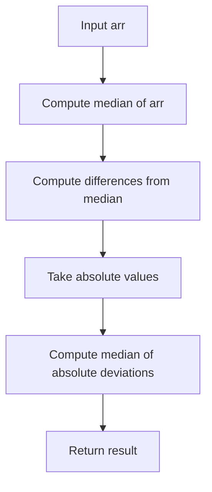
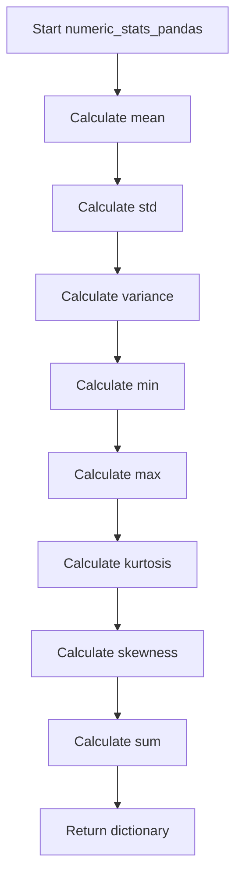
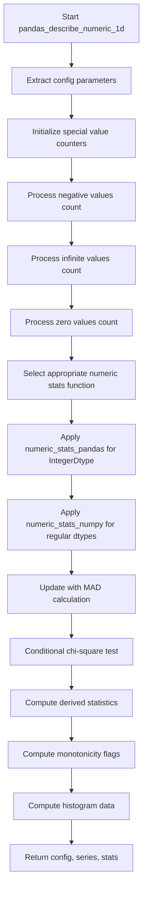

# `describe_numeric_pandas.py`

## `src.ydata_profiling.model.pandas.describe_numeric_pandas.mad` · *function*

## Summary:
Computes the Median Absolute Deviation (MAD) of an array of numerical values.

## Description:
Calculates the Median Absolute Deviation, a robust measure of statistical dispersion that is less sensitive to outliers than standard deviation. This function computes the median of the absolute deviations from the dataset's median.

The MAD is commonly used in statistics as a robust estimator of scale, particularly when dealing with datasets that may contain outliers. It's especially useful in outlier detection and data cleaning processes.

This function was extracted from the larger numeric description pipeline to provide a reusable, focused computation of the Median Absolute Deviation metric.

## Args:
    arr (numpy.ndarray): Input array of numerical values for which to compute the MAD.

## Returns:
    numpy.ndarray: The computed Median Absolute Deviation value. For 1D arrays, returns a scalar numpy array; for multi-dimensional arrays, returns an array with the same shape as the input containing the MAD calculation.

## Raises:
    None explicitly raised by this function.

## Constraints:
    Preconditions:
    - Input array must be a valid numpy array containing numerical values
    - Array should not be empty (though technically handles empty arrays gracefully)
    
    Postconditions:
    - Output is always a numeric value representing the median absolute deviation
    - Result maintains the same dimensional structure as input

## Side Effects:
    None.

## Control Flow:


## Examples:
```python
import numpy as np

# Basic usage with 1D array
data = np.array([1, 2, 3, 4, 5])
result = mad(data)
print(result)  # Output: 1.0

# Usage with 2D array
data_2d = np.array([[1, 2, 3], [4, 5, 6]])
result_2d = mad(data_2d)
print(result_2d)  # Output: 1.5

# Usage with array containing outliers
data_outliers = np.array([1, 2, 3, 4, 100])
result_outliers = mad(data_outliers)
print(result_outliers)  # Output: 1.0 (robust to outlier)
```

## `src.ydata_profiling.model.pandas.describe_numeric_pandas.numeric_stats_pandas` · *function*

## Summary:
Computes comprehensive descriptive statistics for a pandas Series containing numeric data.

## Description:
Calculates and returns a dictionary of common statistical measures for a numeric pandas Series. This function extracts key numerical properties such as central tendency, dispersion, and distribution shape characteristics. The function is designed to be a standalone utility for computing basic numeric statistics without any preprocessing or validation steps.

This logic is extracted into its own function to provide a clean abstraction layer for numeric statistical computation, separating the calculation logic from data processing pipelines and enabling reuse across different profiling components.

## Args:
    series (pd.Series): A pandas Series containing numeric data for which statistics will be computed.

## Returns:
    Dict[str, Any]: A dictionary containing the following keys and their corresponding computed values:
        - "mean": Arithmetic mean of the series values
        - "std": Standard deviation of the series values
        - "variance": Variance of the series values
        - "min": Minimum value in the series
        - "max": Maximum value in the series
        - "kurtosis": Kurtosis measure of the series distribution
        - "skewness": Skewness measure of the series distribution
        - "sum": Sum of all values in the series

## Raises:
    None explicitly raised, but may raise exceptions from underlying pandas operations when dealing with invalid data types or empty series.

## Constraints:
    Preconditions:
        - Input series must be a valid pandas Series object
        - Series should contain numeric data for meaningful statistical calculations
        - Series should not be empty for most operations (though some operations like sum() handle empty series gracefully)
    
    Postconditions:
        - Returns a dictionary with exactly 8 keys as specified
        - All returned values are numeric types or NaN for undefined operations

## Side Effects:
    None

## Control Flow:


## Examples:
```python
import pandas as pd
from src.ydata_profiling.model.pandas.describe_numeric_pandas import numeric_stats_pandas

# Basic usage with integer data
series = pd.Series([1, 2, 3, 4, 5])
stats = numeric_stats_pandas(series)
print(f"Mean: {stats['mean']}")  # Output: Mean: 3.0
print(f"Standard deviation: {stats['std']}")  # Output: Standard deviation: 1.4142135623730951

# Usage with floating point data
float_series = pd.Series([1.5, 2.7, 3.2, 4.8])
stats = numeric_stats_pandas(float_series)
print(f"Skewness: {stats['skewness']}")  # Output: Skewness: -0.1594553422412223

# Edge case: empty series
empty_series = pd.Series([], dtype=float)
stats = numeric_stats_pandas(empty_series)
print(f"Sum of empty series: {stats['sum']}")  # Output: Sum of empty series: 0.0
```

## `src.ydata_profiling.model.pandas.describe_numeric_pandas.numeric_stats_numpy` · *function*

## Summary:
Computes comprehensive statistical measures for numeric data series using NumPy operations.

## Description:
Calculates various descriptive statistics for a numeric pandas Series using NumPy functions. This function extracts key statistical measures from value counts and raw data values to provide a complete numerical summary. It is designed to work with the profiling pipeline where numeric data is analyzed for statistical properties.

## Args:
    present_values (np.ndarray): Array containing the actual numeric values from the series (excluding NaN values)
    series (pd.Series): The original pandas Series object being analyzed
    series_description (Dict[str, Any]): Dictionary containing metadata about the series, specifically including "value_counts_without_nan" key which maps to a pandas Series of value counts

## Returns:
    Dict[str, Any]: Dictionary containing computed statistical measures including:
        - 'mean': weighted average of index values using value counts as weights
        - 'std': sample standard deviation of present_values
        - 'variance': sample variance of present_values  
        - 'min': minimum of index values
        - 'max': maximum of index values
        - 'kurtosis': kurtosis statistic calculated using pandas Series.kurt()
        - 'skewness': skewness statistic calculated using pandas Series.skew()
        - 'sum': dot product of index values and value counts

## Raises:
    None explicitly raised

## Constraints:
    Preconditions:
        - present_values must be a valid NumPy array of numeric values
        - series must be a valid pandas Series object
        - series_description must contain a "value_counts_without_nan" key with valid pandas Series data
    Postconditions:
        - All returned statistics are computed using appropriate NumPy functions
        - The returned dictionary always contains exactly the keys: 'mean', 'std', 'variance', 'min', 'max', 'kurtosis', 'skewness', 'sum'

## Side Effects:
    None

## Control Flow:
```mermaid
flowchart TD
    A[Start numeric_stats_numpy] --> B[present_values, series, series_description]
    B --> C[Extract vc from series_description["value_counts_without_nan"]]
    C --> D[Extract index_values from vc.index.values]
    D --> E[Compute mean using np.average with weights=vc.values]
    E --> F[Compute std using np.std with ddof=1]
    F --> G[Compute variance using np.var with ddof=1]
    G --> H[Compute min using np.min]
    H --> I[Compute max using np.max]
    I --> J[Compute kurtosis using series.kurt()]
    J --> K[Compute skewness using series.skew()]
    K --> L[Compute sum using np.dot(index_values, vc.values)]
    L --> M[Return dictionary with all stats]
```

## Examples:
```python
import numpy as np
import pandas as pd
from ydata_profiling.model.pandas.describe_numeric_pandas import numeric_stats_numpy

# Example 1: Basic usage with integer data
data = [1, 2, 2, 3, 3, 3]
series = pd.Series(data)
series_description = {"value_counts_without_nan": series.value_counts()}

result = numeric_stats_numpy(
    present_values=np.array(data),
    series=series,
    series_description=series_description
)

print(f"Mean: {result['mean']:.3f}")
print(f"Std: {result['std']:.3f}")
print(f"Sum: {result['sum']}")

# Example 2: Usage with floating point data
float_data = [1.5, 2.0, 2.0, 3.5, 3.5, 3.5]
float_series = pd.Series(float_data)
float_description = {"value_counts_without_nan": float_series.value_counts()}

float_result = numeric_stats_numpy(
    present_values=np.array(float_data),
    series=float_series,
    series_description=float_description
)

print(f"Float Mean: {float_result['mean']:.3f}")
print(f"Float Variance: {float_result['variance']:.3f}")
```

## `src.ydata_profiling.model.pandas.describe_numeric_pandas.pandas_describe_numeric_1d` · *function*

## Summary:
Computes comprehensive descriptive statistics for a numeric pandas Series, including measures of central tendency, dispersion, distribution shape, and special value counts.

## Description:
Processes a numeric pandas Series to calculate a rich set of statistical measures and special value indicators. This function serves as the core computational engine for numeric data profiling in the ydata-profiling library, aggregating both basic statistics and advanced metrics like skewness, kurtosis, and monotonicity properties.

The function is designed to handle both regular numeric data and pandas IntegerDtype data differently, applying appropriate statistical methods for each type. It also computes robust statistics like Median Absolute Deviation and optionally performs chi-square tests for distribution analysis.

This logic is extracted into its own function to provide a clean abstraction layer for comprehensive numeric statistical computation, separating the calculation logic from data processing pipelines and enabling reuse across different profiling components.

## Args:
    config (Settings): Configuration object containing settings for numeric variable analysis, including chi-squared threshold and quantile specifications
    series (pd.Series): A pandas Series containing numeric data to be analyzed
    summary (dict): Dictionary containing pre-computed summary statistics including value_counts_without_nan, n, and n_distinct

## Returns:
    Tuple[Settings, pd.Series, dict]: A tuple containing the unchanged config object, the original series, and a dictionary of computed statistics that includes:
        - Basic statistics: mean, std, variance, min, max, kurtosis, skewness, sum
        - Special value counts: n_negative, n_infinite, n_zeros
        - Proportions: p_negative, p_infinite, p_zeros
        - Distribution measures: range, iqr, cv (coefficient of variation)
        - Quantile values: specified percentiles (default 25%, 50%, 75%)
        - Monotonicity indicators: monotonic, monotonic_increase, monotonic_decrease, monotonic_increase_strict, monotonic_decrease_strict
        - Histogram data: computed histogram bins and counts
        - Robust statistics: mad (Median Absolute Deviation)
        - Chi-square test results: chi_squared (when chi_squared_threshold > 0.0)

## Raises:
    None explicitly raised, but may propagate exceptions from underlying pandas or numpy operations during statistical computations

## Constraints:
    Preconditions:
        - config must be a valid Settings object with vars.num configuration
        - series must be a valid pandas Series with numeric data
        - summary must contain required keys: "value_counts_without_nan", "n", "n_distinct"
        - "value_counts_without_nan" must be a pandas Series with numeric index values
    
    Postconditions:
        - Returns a tuple with unchanged config and series objects
        - The returned stats dictionary contains all computed metrics described in the Returns section
        - Statistical computations are performed using appropriate methods for data types

## Side Effects:
    None

## Control Flow:


## Examples:
```python
import pandas as pd
from ydata_profiling.config import Settings
from src.ydata_profiling.model.pandas.describe_numeric_pandas import pandas_describe_numeric_1d

# Basic usage with integer data
config = Settings()
series = pd.Series([1, 2, 3, 4, 5])
summary = {
    "value_counts_without_nan": series.value_counts(),
    "n": len(series),
    "n_distinct": series.nunique()
}
config.vars.num.chi_squared_threshold = 0.0  # Disable chi-square test
config.vars.num.quantiles = [0.25, 0.5, 0.75]

updated_config, updated_series, stats = pandas_describe_numeric_1d(config, series, summary)
print(f"Mean: {stats['mean']}")
print(f"Standard deviation: {stats['std']}")
print(f"Number of negative values: {stats['n_negative']}")

# Usage with floating point data including special values
float_series = pd.Series([1.5, 2.7, 3.2, 4.8, float('inf'), float('-inf')])
float_summary = {
    "value_counts_without_nan": float_series.value_counts(),
    "n": len(float_series),
    "n_distinct": float_series.nunique()
}
config.vars.num.chi_squared_threshold = 0.01  # Enable chi-square test

updated_config, updated_series, float_stats = pandas_describe_numeric_1d(config, float_series, float_summary)
print(f"Number of infinite values: {float_stats['n_infinite']}")
print(f"Range: {float_stats['range']}")
print(f"Median Absolute Deviation: {float_stats['mad']}")
```

