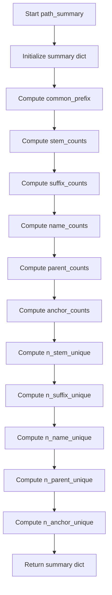

# `describe_path_pandas.py`

## `src.ydata_profiling.model.pandas.describe_path_pandas.path_summary` · *function*

## Summary:
Computes a comprehensive statistical summary of file paths in a pandas Series, extracting structural components like prefixes, stems, suffixes, names, parents, and anchors.

## Description:
This function analyzes a pandas Series containing file paths and generates a detailed breakdown of their structural elements. It extracts common prefixes, filename stems (without extension), suffixes (file extensions), base names, parent directories, and drive anchors. The function is designed to support profiling of file path data by providing insights into path patterns and structures.

The logic is extracted into its own function to separate the path analysis concerns from the broader profiling logic, enabling reuse and clearer separation of responsibilities in the data profiling pipeline. This allows the path analysis to be performed independently of other profiling operations while maintaining clean architectural boundaries.

## Args:
    series (pd.Series): A pandas Series containing file path strings to analyze

## Returns:
    dict: A dictionary containing:
        - "common_prefix" (str): The longest common prefix among all paths, or "No common prefix" if none exists
        - "stem_counts" (pd.Series): Count of each unique filename stem (without extension)
        - "suffix_counts" (pd.Series): Count of each unique file extension (including the dot)
        - "name_counts" (pd.Series): Count of each unique basename (filename with extension)
        - "parent_counts" (pd.Series): Count of each unique parent directory path
        - "anchor_counts" (pd.Series): Count of each unique drive anchor (e.g., "C:" on Windows)
        - "n_stem_unique" (int): Number of unique filename stems
        - "n_suffix_unique" (int): Number of unique file extensions
        - "n_name_unique" (int): Number of unique basenames
        - "n_parent_unique" (int): Number of unique parent directories
        - "n_anchor_unique" (int): Number of unique drive anchors

## Raises:
    None explicitly raised - however, underlying operations may raise exceptions from:
    - os.path operations when processing malformed paths
    - pandas operations when handling incompatible data types

## Constraints:
    Preconditions:
    - Input series must contain string values representing file paths
    - All values in the series should be valid path strings that can be processed by os.path functions
    
    Postconditions:
    - Returns a dictionary with exactly 11 keys including all computed statistics
    - All count series are ordered by frequency (descending) by default

## Side Effects:
    None - This function is pure and does not perform any I/O operations or mutate external state

## Control Flow:


## Examples:
```python
import pandas as pd
from src.ydata_profiling.model.pandas.describe_path_pandas import path_summary

# Basic usage with file paths
paths = pd.Series(["/home/user/file1.txt", "/home/user/file2.txt", "/home/user/data.csv"])
result = path_summary(paths)
print(result["common_prefix"])  # Output: "/home/user/"
print(result["n_suffix_unique"])  # Output: 2 (".txt" and ".csv")

# Usage with Windows-style paths
windows_paths = pd.Series(["C:\\Users\\file1.txt", "C:\\Users\\file2.txt"])
result = path_summary(windows_paths)
print(result["anchor_counts"])  # Shows counts for "C:"

# Edge case with no common prefix
no_common = pd.Series(["/home/user/file1.txt", "/tmp/file2.txt"])
result = path_summary(no_common)
print(result["common_prefix"])  # Output: "No common prefix"
```

## `src.ydata_profiling.model.pandas.describe_path_pandas.pandas_describe_path_1d` · *function*

## Summary:
Processes a pandas Series of file paths to compute and update statistical summaries for profiling purposes.

## Description:
This function validates a pandas Series containing file paths and computes descriptive statistics about the path structure. It ensures the series contains valid string data without missing values and has a string accessor, then updates the provided summary dictionary with path-specific metrics. The function acts as a bridge between the pandas-specific data processing layer and the general summary computation logic.

The logic is extracted into its own function to enforce validation boundaries and separate path-specific processing from the broader profiling workflow. This creates a clear interface between data validation, path analysis, and summary aggregation phases.

## Args:
    config (Settings): Configuration settings for the profiling process
    series (pd.Series): A pandas Series containing file path strings to analyze
    summary (dict): Dictionary to be updated with path summary statistics

## Returns:
    Tuple[Settings, pd.Series, dict]: The unchanged config, series, and updated summary dictionary

## Raises:
    ValueError: When the series contains NaN values or lacks a string accessor (.str)

## Constraints:
    Preconditions:
    - The series must not contain any NaN values
    - The series must have a string accessor (.str attribute)
    - The series should contain valid file path strings

    Postconditions:
    - The summary dictionary is updated with path-specific statistics
    - The function preserves the original config and series unchanged

## Side Effects:
    None - This function does not perform I/O operations or mutate external state beyond updating the summary dictionary

## Control Flow:
```mermaid
flowchart TD
    A[Start pandas_describe_path_1d] --> B{series.hasnans?}
    B -->|Yes| C[raise ValueError("May not contain NaNs")]
    B -->|No| D{hasattr(series, "str")?}
    D -->|No| E[raise ValueError("series should have .str accessor")]
    D -->|Yes| F[summary.update(path_summary(series))]
    F --> G[return config, series, summary]
```

## Examples:
```python
import pandas as pd
from ydata_profiling.config import Settings
from src.ydata_profiling.model.pandas.describe_path_pandas import pandas_describe_path_1d

# Basic usage
config = Settings()
series = pd.Series(["/home/user/file1.txt", "/home/user/file2.txt"])
summary = {}

config, series, summary = pandas_describe_path_1d(config, series, summary)
print(summary.get("common_prefix"))  # Shows computed common prefix

# Error case - series with NaN values
try:
    series_with_nan = pd.Series(["/path1/file.txt", None])
    pandas_describe_path_1d(config, series_with_nan, summary)
except ValueError as e:
    print(f"Caught expected error: {e}")  # Output: "May not contain NaNs"
```

