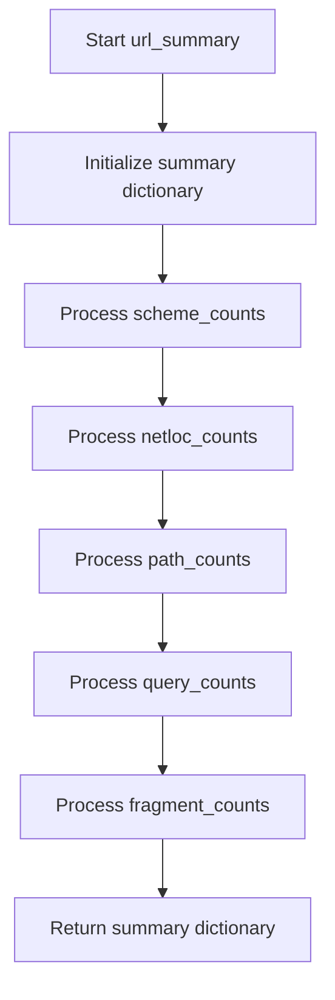

# `describe_url_pandas.py`

## `src.ydata_profiling.model.pandas.describe_url_pandas.url_summary` · *function*

## Summary:
Computes frequency distributions for URL components (scheme, netloc, path, query, fragment) from a pandas Series of parsed URLs.

## Description:
This function extracts individual URL components from a pandas Series of parsed URL objects and calculates their frequency distributions. It is designed to work with URL objects created by urllib.parse.urlsplit() and provides a structured summary of URL composition patterns in the data. The function is part of the URL-specific profiling capabilities in the ydata-profiling library.

## Args:
    series (pd.Series): A pandas Series containing parsed URL objects (from urllib.parse.urlsplit). Each element must have scheme, netloc, path, query, and fragment attributes.

## Returns:
    dict: A dictionary with five keys representing URL components:
        - 'scheme_counts': pandas Series with frequency counts of URL schemes (index = scheme values, values = counts)
        - 'netloc_counts': pandas Series with frequency counts of network locations (index = netloc values, values = counts)  
        - 'path_counts': pandas Series with frequency counts of URL paths (index = path values, values = counts)
        - 'query_counts': pandas Series with frequency counts of URL queries (index = query values, values = counts)
        - 'fragment_counts': pandas Series with frequency counts of URL fragments (index = fragment values, values = counts)

## Raises:
    AttributeError: When any element in the series lacks required URL component attributes (scheme, netloc, path, query, or fragment).

## Constraints:
    Preconditions:
        - Input series must contain only parsed URL objects from urllib.parse.urlsplit()
        - Each URL object must have scheme, netloc, path, query, and fragment attributes
    Postconditions:
        - All returned Series are sorted by frequency in descending order
        - Dictionary always contains exactly five keys with value count Series
        - Each Series index contains unique URL component values
        - Each Series value represents the count of occurrences for that component

## Side Effects:
    None

## Control Flow:


## Examples:
```python
import pandas as pd
from urllib.parse import urlsplit

# Create sample URL data
urls = [
    urlsplit('https://example.com/path?query=value#fragment'),
    urlsplit('http://example.com/path?query=value'),
    urlsplit('https://example.com/other')
]
series = pd.Series(urls)

# Generate URL summary statistics
result = url_summary(series)
print(result['scheme_counts'])
# Output: Shows frequency distribution of URL schemes (https, http)
```

## `src.ydata_profiling.model.pandas.describe_url_pandas.pandas_describe_url_1d` · *function*

## Summary:
Processes a pandas Series of URLs to extract and summarize URL components, validating input and updating a summary dictionary with frequency distributions.

## Description:
This function performs URL-specific profiling on a pandas Series by parsing URLs using `urlsplit()` and computing frequency distributions for URL components. It validates that the input series contains no NaN values and has a string accessor, then applies URL parsing and summary computation. The function is part of the pandas-specific URL profiling implementation and integrates with the broader profiling framework through the Settings configuration object.

The function is extracted from inline logic to provide a clear separation between data validation, URL parsing, and summary computation responsibilities. This modular approach enables reuse in different profiling contexts while maintaining consistent error handling and data processing flows.

## Args:
    config (Settings): Configuration object containing profiling settings and parameters
    series (pd.Series): Pandas Series containing URL strings to be analyzed
    summary (dict): Dictionary to be updated with URL component frequency distributions

## Returns:
    Tuple[Settings, pd.Series, dict]: A tuple containing the unchanged config object, the modified series with parsed URLs, and the updated summary dictionary

## Raises:
    ValueError: When the input series contains NaN values or lacks a string accessor (.str attribute)

## Constraints:
    Preconditions:
        - Input series must not contain any NaN values
        - Input series must have a .str accessor (pandas string accessor)
        - Input series should contain valid URL strings that can be parsed by urlsplit()
    Postconditions:
        - The series is transformed to contain parsed URL objects from urlsplit()
        - The summary dictionary is updated with URL component frequency distributions
        - All input parameters remain unchanged except for the series and summary

## Side Effects:
    - Modifies the input summary dictionary by updating it with URL component counts
    - Transforms the input series from URL strings to parsed URL objects
    - No external I/O operations or state mutations beyond parameter modification

## Control Flow:
```mermaid
flowchart TD
    A[Start pandas_describe_url_1d] --> B{series.hasnans?}
    B -- Yes --> C[raise ValueError]
    B -- No --> D{hasattr(series, "str")?}
    D -- No --> E[raise ValueError]
    D -- Yes --> F[series = series.apply(urlsplit)]
    F --> G[summary.update(url_summary(series))]
    G --> H[return config, series, summary]
```

## Examples:
```python
import pandas as pd
from ydata_profiling.config import Settings

# Create test data
urls = pd.Series(['https://example.com/path?query=value#fragment', 
                  'http://example.com/path', 
                  'https://example.com/other'])

# Initialize config and summary
config = Settings()
summary = {}

# Process URLs
config, processed_series, updated_summary = pandas_describe_url_1d(config, urls, summary)

# Result: processed_series contains parsed URL objects, summary contains component frequencies
```

