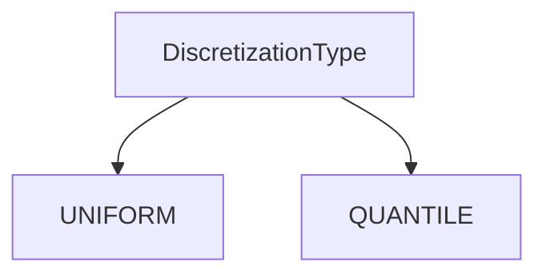
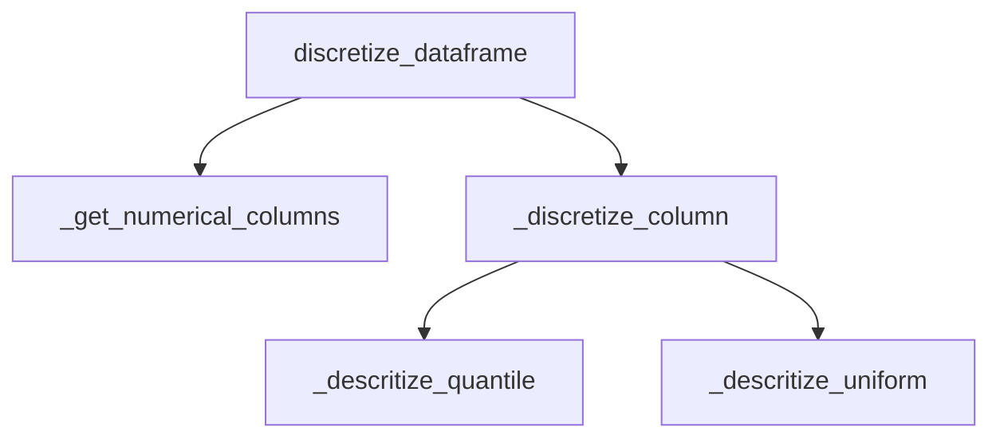

# `discretize_pandas.py`

## `src.ydata_profiling.model.pandas.discretize_pandas.DiscretizationType` · *class*

## Summary:
An enumeration defining discrete discretization methods for data processing.

## Description:
This class represents a set of available discretization techniques used in data profiling and analysis. It provides a standardized way to specify whether data should be discretized using uniform intervals or quantile-based intervals. The enumeration is designed to be used throughout the ydata-profiling library to ensure consistent discretization method selection across different components.

## State:
- UNIFORM: A class attribute representing uniform discretization with value "uniform"
- QUANTILE: A class attribute representing quantile-based discretization with value "quantile"

## Lifecycle:
- Creation: Instances are created automatically as part of the Enum class inheritance
- Usage: Used as a type-safe way to select discretization methods in various data processing functions
- Destruction: Managed automatically by Python's garbage collection

## Method Map:


## Raises:
- No exceptions are raised during initialization as this is an Enum class

## Example:
```python
from src.ydata_profiling.model.pandas.discretize_pandas import DiscretizationType

# Select discretization method
method = DiscretizationType.UNIFORM
print(method.value)  # Output: "uniform"

# Compare discretization methods
if method == DiscretizationType.UNIFORM:
    print("Using uniform discretization")
```

## `src.ydata_profiling.model.pandas.discretize_pandas.Discretizer` · *class*

## Summary:
A class for discretizing numerical columns in pandas DataFrames using either uniform or quantile-based binning methods.

## Description:
The Discretizer class provides functionality to convert continuous numerical data into discrete bins. It supports two discretization methods: uniform binning where each bin contains approximately equal numbers of observations, and quantile-based binning where each bin contains approximately equal numbers of observations. This class is typically used in data profiling and analysis workflows to transform numerical data for further processing or visualization.

## State:
- discretization_type: DiscretizationType enum value indicating the discretization method to use (UNIFORM or QUANTILE)
- n_bins: int value specifying the number of bins to create (default: 10)
- reset_index: bool value indicating whether to reset the DataFrame index after discretization (default: False)

## Lifecycle:
- Creation: Instantiate with a DiscretizationType enum value (UNIFORM or QUANTILE), optional n_bins (default 10), and optional reset_index (default False)
- Usage: Call discretize_dataframe() method with a pandas DataFrame containing numerical columns
- Destruction: Managed by Python's garbage collection

## Method Map:


## Raises:
- No explicit exceptions are raised by the constructor or methods in this class

## Example:
```python
from src.ydata_profiling.model.pandas.discretize_pandas import Discretizer, DiscretizationType
import pandas as pd

# Create discretizer with uniform binning
discretizer = Discretizer(DiscretizationType.UNIFORM, n_bins=5)

# Apply discretization to DataFrame
df = pd.DataFrame({'col1': [1, 2, 3, 4, 5], 'col2': [10, 20, 30, 40, 50]})
discretized_df = discretizer.discretize_dataframe(df)
```

### `src.ydata_profiling.model.pandas.discretize_pandas.Discretizer.__init__` · *method*

## Summary:
Initializes a Discretizer object with discretization method, number of bins, and index reset configuration.

## Description:
Configures the discretization parameters for the Discretizer class. This method sets up the core configuration that determines how numerical data will be discretized into bins. It is called during object instantiation to establish the discretization strategy and parameters.

## Args:
    method (DiscretizationType): The discretization method to use for binning numerical data, either UNIFORM or QUANTILE
    n_bins (int): Number of bins to create for discretization. Defaults to 10
    reset_index (bool): Whether to reset the DataFrame index after discretization. Defaults to False

## Returns:
    None: This method does not return any value

## Raises:
    None: This method does not explicitly raise exceptions

## State Changes:
    Attributes READ: No self attributes are read during initialization
    Attributes WRITTEN: 
    - self.discretization_type: Stores the discretization method
    - self.n_bins: Stores the number of bins for discretization
    - self.reset_index: Stores the index reset flag

## Constraints:
    Preconditions: 
    - The method parameter must be a valid DiscretizationType enum value (UNIFORM or QUANTILE)
    - n_bins must be a positive integer
    - reset_index must be a boolean value
    
    Postconditions:
    - All instance variables are properly initialized with provided values
    - The object is ready for discretization operations

## Side Effects:
    None: This method performs no I/O operations or external service calls

### `src.ydata_profiling.model.pandas.discretize_pandas.Discretizer.discretize_dataframe` · *method*

## Summary:
Transforms numerical columns in a DataFrame into discrete bins while preserving the original column order and index structure.

## Description:
Processes a pandas DataFrame by discretizing all numerical columns into a specified number of bins using either quantile-based or uniform-width binning strategies. This method creates a copy of the input DataFrame, applies discretization to numerical columns only, and maintains the original column ordering. The resulting DataFrame can optionally have its index reset based on the Discretizer configuration.

Known callers:
- Direct method invocation on Discretizer instances
- Called during data preprocessing pipelines where numerical data needs to be converted to categorical bins

This logic is separated into its own method to encapsulate the complete discretization workflow, allowing for clean separation of concerns and making the discretization process reusable across different parts of the profiling system.

## Args:
    dataframe (pd.DataFrame): Input pandas DataFrame containing mixed data types to be discretized

## Returns:
    pd.DataFrame: A new DataFrame with numerical columns discretized into bins, maintaining original column order and structure

## Raises:
    None explicitly raised

## State Changes:
    Attributes READ: self.reset_index, self.discretization_type, self.n_bins
    Attributes WRITTEN: None

## Constraints:
    Preconditions:
    - Input dataframe must be a valid pandas DataFrame
    - Discretizer instance must be properly initialized with valid configuration parameters
    - Numerical columns in the dataframe must be compatible with pandas discretization functions
    
    Postconditions:
    - Output DataFrame contains the same number of rows as input
    - Numerical columns are replaced with discrete bin indices (integers)
    - Non-numerical columns remain unchanged
    - Column order is preserved from the input DataFrame
    - Index handling follows the reset_index configuration

## Side Effects:
    None

### `src.ydata_profiling.model.pandas.discretize_pandas.Discretizer._discretize_column` · *method*

## Summary:
Discretizes a pandas Series into bins based on the configured discretization type (quantile or uniform).

## Description:
This method serves as a dispatcher that routes column discretization to either quantile-based or uniform-width binning methods. It is called during the dataframe discretization process when processing numerical columns. The method evaluates the discretization_type attribute and delegates to the appropriate private method based on the configuration.

Known callers:
- `discretize_dataframe` method in the same class, which calls this method for each numerical column in the dataframe

This logic is separated into its own method to provide a clean interface for the discretization process and to allow for easy extension with additional discretization types in the future.

## Args:
    column (pandas.Series): A pandas Series containing numerical data to be discretized

## Returns:
    pandas.Series: A pandas Series with the same length as the input, where each value represents the bin index (0-based) that the corresponding input value falls into

## Raises:
    None explicitly raised

## State Changes:
    Attributes READ: self.discretization_type, self.n_bins
    Attributes WRITTEN: None

## Constraints:
    Preconditions:
    - The input column must be a pandas Series containing numerical data
    - The Discretizer instance must be properly initialized with a valid DiscretizationType
    - self.n_bins must be a positive integer specifying the number of bins to create
    
    Postconditions:
    - The returned Series will have the same length as the input column
    - Each value in the returned Series will be an integer between 0 and (n_bins - 1)
    - The discretization approach used depends on the discretization_type attribute

## Side Effects:
    None

### `src.ydata_profiling.model.pandas.discretize_pandas.Discretizer._descritize_quantile` · *method*

## Summary:
Converts a continuous numerical column into discrete bins using quantile-based discretization.

## Description:
This method performs quantile-based discretization on a pandas Series by dividing the data into equally-sized bins based on quantiles. It is used internally by the Discretizer class when the discretization type is set to QUANTILE. The method leverages pandas' qcut function to create bins such that each bin contains approximately the same number of observations.

## Args:
    column (pandas.Series): A pandas Series containing numerical data to be discretized

## Returns:
    pandas.Series: A pandas Series with the same length as the input, where each value represents the bin index (0-based) that the corresponding input value falls into. Bin indices range from 0 to (n_bins - 1).

## Raises:
    None explicitly raised

## State Changes:
    Attributes READ: self.n_bins
    Attributes WRITTEN: None

## Constraints:
    Preconditions: 
    - The input column must be a pandas Series containing numerical data
    - self.n_bins must be a positive integer specifying the number of bins to create
    - The input column should not contain all identical values if n_bins > 1
    Postconditions: 
    - The returned Series will have the same length as the input column
    - Each value in the returned Series will be an integer between 0 and (n_bins - 1)
    - Values that cannot be binned due to duplicates or insufficient data will be handled according to pandas' qcut behavior

## Side Effects:
    None

### `src.ydata_profiling.model.pandas.discretize_pandas.Discretizer._descritize_uniform` · *method*

## Summary:
Converts a continuous numerical column into discrete bins using uniform width binning.

## Description:
This method performs uniform discretization on a pandas Series by dividing the range of values into equally sized bins. It is part of the Discretizer class and is specifically used when the discretization type is set to UNIFORM. The method leverages pandas' `pd.cut` function to create the bins and returns the bin indices for each value in the input series.

The method is called from `_discretize_column` which routes the discretization based on the configured discretization type. This separation allows for clean code organization and enables different discretization strategies (uniform vs quantile) to be implemented independently.

## Args:
    column (pd.Series): A pandas Series containing numerical data to be discretized.

## Returns:
    pd.Series: A pandas Series containing integer bin indices for each value in the input column. Values are assigned to bins such that each bin has approximately equal width.

## Raises:
    None explicitly raised, though pandas operations may raise exceptions for invalid inputs.

## State Changes:
    Attributes READ: self.n_bins
    Attributes WRITTEN: None

## Constraints:
    Preconditions: 
    - The input column must be a valid pandas Series with numerical data
    - self.n_bins must be a positive integer specifying the number of bins to create
    - The column should not contain all identical values if n_bins > 1
    
    Postconditions:
    - The returned Series will have the same length as the input column
    - Each value in the returned Series will be an integer between 0 and n_bins-1
    - Values that cannot be binned due to duplicates or edge cases will be handled according to pandas' duplicates="drop" parameter

## Side Effects:
    None

### `src.ydata_profiling.model.pandas.discretize_pandas.Discretizer._get_numerical_columns` · *method*

## Summary:
Returns a list of column names from a DataFrame that contain numerical data types.

## Description:
This method identifies and extracts the names of all columns in the provided DataFrame that have numerical data types. It is used during the discretization process to determine which columns should be transformed. The method is called by the `discretize_dataframe` method as part of the data preprocessing pipeline.

## Args:
    dataframe (pd.DataFrame): The input DataFrame from which numerical column names are extracted.

## Returns:
    List[str]: A list of column names (as strings) that contain numerical data types.

## Raises:
    None explicitly raised.

## State Changes:
    Attributes READ: None
    Attributes WRITTEN: None

## Constraints:
    Preconditions: The input dataframe must be a valid pandas DataFrame.
    Postconditions: The returned list contains only column names from the input DataFrame that have numerical dtypes.

## Side Effects:
    None

