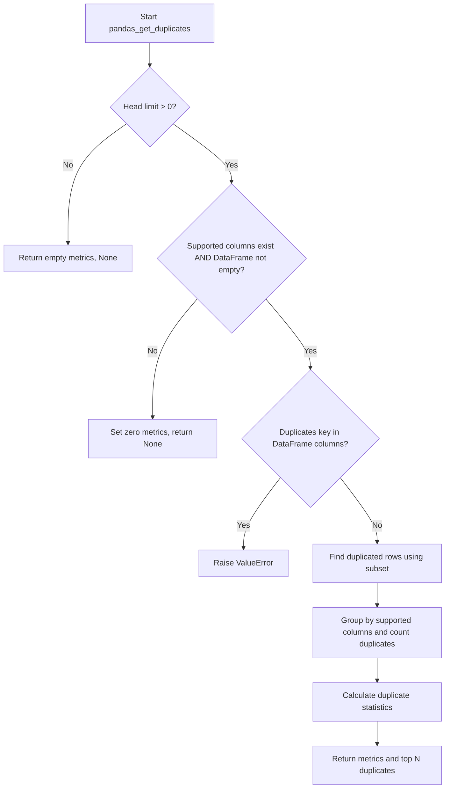

# `duplicates_pandas.py`

## `src.ydata_profiling.model.pandas.duplicates_pandas.pandas_get_duplicates` · *function*

## Summary:
Identifies and analyzes duplicate rows in a DataFrame based on specified columns, returning statistical metrics and optionally the actual duplicate records.

## Description:
This function performs duplicate detection on a pandas DataFrame by examining specified columns for repeated row patterns. It calculates duplicate statistics such as count and percentage, and optionally returns the actual duplicate rows for further inspection. The function serves as a pandas-specific implementation within the profiling framework, providing consistent duplicate analysis capabilities.

The logic is extracted into its own function to separate the duplicate detection algorithm from the broader profiling workflow, ensuring clean responsibility boundaries and enabling reuse across different profiling contexts.

## Args:
    config (Settings): Configuration object controlling duplicate detection behavior, including head limit and key name for duplicate counting.
    df (pd.DataFrame): Input DataFrame containing the data to analyze for duplicates.
    supported_columns (Sequence): Sequence of column names that are eligible for duplicate detection analysis. May be empty.

## Returns:
    Tuple[Dict[str, Any], Optional[pd.DataFrame]]: A tuple containing:
        - Dictionary with duplicate statistics including 'n_duplicates' (count) and 'p_duplicates' (percentage)
        - Optional DataFrame containing the actual duplicate rows (up to n_head rows), or None if head limit is 0, no duplicates exist, or DataFrame is empty

## Raises:
    ValueError: When the configured duplicates key is already present as a column name in the DataFrame, preventing conflict in duplicate counting.

## Constraints:
    Preconditions:
        - config must be a valid Settings instance with proper duplicate configuration
        - df must be a valid pandas DataFrame
        - supported_columns must be a sequence of column names that exist in df
    
    Postconditions:
        - Returned dictionary will contain structured duplicate statistics
        - Returned DataFrame (if present) will contain only rows identified as duplicates according to the specified columns

## Side Effects:
    None: Function does not perform I/O operations or modify external state.

## Control Flow:


## Examples:
Basic usage with duplicate detection enabled:
```python
from ydata_profiling.config import Settings
import pandas as pd

# Configure duplicate detection
config = Settings()
config.duplicates.head = 5  # Return top 5 duplicate groups
config.duplicates.key = 'duplicate_count'

# Create sample DataFrame
df = pd.DataFrame({
    'A': [1, 2, 1, 3, 2],
    'B': [4, 5, 4, 6, 5],
    'C': [7, 8, 7, 9, 8]
})

# Analyze for duplicates
metrics, duplicates = pandas_get_duplicates(config, df, ['A', 'B'])

# metrics contains {'n_duplicates': 2, 'p_duplicates': 0.4}
# duplicates contains the actual duplicate rows
```

Edge case example with no duplicates:
```python
# DataFrame with no duplicates
df_unique = pd.DataFrame({
    'A': [1, 2, 3],
    'B': [4, 5, 6]
})

metrics, duplicates = pandas_get_duplicates(config, df_unique, ['A', 'B'])
# metrics contains {'n_duplicates': 0, 'p_duplicates': 0.0}
# duplicates is None
```

