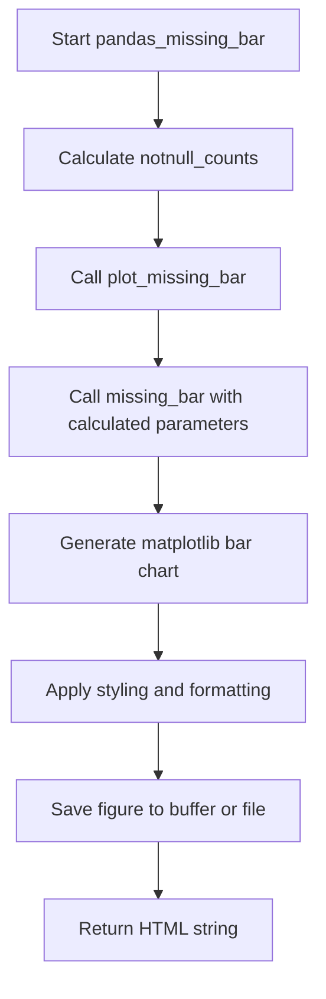
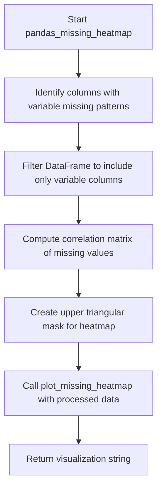

# `missing_pandas.py`

## `src.ydata_profiling.model.pandas.missing_pandas.pandas_missing_bar` · *function*

## Summary:
Generates an HTML bar chart visualization showing the count of non-missing values for each column in a DataFrame.

## Description:
This function processes a DataFrame to calculate the count of non-missing values per column and generates a bar chart visualization using matplotlib. It serves as a bridge between the data processing layer and visualization layer for missing data analysis. The function is part of the profiling system's missing data analysis workflow and integrates with the broader reporting infrastructure.

## Args:
    config (Settings): Configuration object containing settings for the profiling process, including HTML rendering options and plot configurations
    df (pd.DataFrame): Input DataFrame containing the data to analyze for missing values

## Returns:
    str: HTML string representation of the missing values bar chart visualization

## Raises:
    None explicitly raised by this function, though underlying functions may raise exceptions

## Constraints:
    - Preconditions: The config parameter must be a valid Settings object and df must be a valid pandas DataFrame
    - Postconditions: Returns a properly formatted HTML string containing the visualization

## Side Effects:
    - Creates matplotlib figures and plots
    - May write files to disk if config.html.inline is False and config.html.assets_path is set
    - Closes matplotlib figures after saving to prevent memory leaks

## Control Flow:


## Examples:
    - Typical usage within profiling pipeline: pandas_missing_bar(config, dataframe)
    - Generates visualizations showing percentage of non-missing values per column
    - Returns HTML string suitable for embedding in web-based reports

## `src.ydata_profiling.model.pandas.missing_pandas.pandas_missing_matrix` · *function*

## Summary:
Generates an HTML-based interactive heatmap visualization of missing data patterns in a DataFrame.

## Description:
This function creates a missing data matrix visualization that displays the distribution of missing values across columns and rows. It serves as a bridge between the pandas-specific data processing layer and the visualization layer, converting DataFrame information into a visual representation that helps identify patterns in missing data.

The function extracts column names, missing value indicators, and row count from the input DataFrame, then delegates to the visualization layer to create an interactive HTML heatmap. This extraction and delegation pattern allows for clean separation between data processing logic and visualization rendering.

## Args:
    config (Settings): Configuration object containing report settings and formatting options
    df (pd.DataFrame): Input DataFrame containing the data to analyze for missing values

## Returns:
    str: HTML string containing the interactive missing data matrix visualization

## Raises:
    None explicitly raised by this function

## Constraints:
    - Preconditions: config must be a valid Settings object and df must be a valid pandas DataFrame
    - Postconditions: Returns a properly formatted HTML string representing the missing data matrix

## Side Effects:
    - Creates matplotlib figures internally
    - May generate temporary files or assets depending on configuration settings
    - Closes matplotlib figures after rendering

## Control Flow:
```mermaid
flowchart TD
    A[pandas_missing_matrix called] --> B[Extract df.columns to list]
    B --> C[Compute df.notnull().values]
    C --> D[Get length of df as nrows]
    D --> E[Call plot_missing_matrix with extracted data]
    E --> F[Return HTML result from plot_missing_matrix]
```

## Examples:
    - Typical usage during report generation when missing data analysis is requested
    - Called internally by profiling pipelines when missing data visualization is enabled
    
    ```python
    # Example usage in a profiling context
    config = Settings()
    df = pd.DataFrame({'A': [1, None, 3], 'B': [None, 2, 3]})
    html_output = pandas_missing_matrix(config, df)
    # Returns HTML string with missing data visualization
    ```

## `src.ydata_profiling.model.pandas.missing_pandas.pandas_missing_heatmap` · *function*

## Summary:
Generates a heatmap visualization showing correlations between missing value patterns across DataFrame columns.

## Description:
Creates a heatmap that visualizes the correlation between missing value patterns in different columns of a DataFrame. This function identifies columns with varying missing value patterns and computes their correlation matrix to reveal relationships between missing data occurrences. It's designed to help detect systematic patterns in missing data that might indicate underlying data collection issues or relationships between variables.

The function is part of the pandas-specific missing data analysis pipeline and serves as a bridge between data processing and visualization components. It filters out columns with constant missing value patterns and prepares the data for heatmap generation.

## Args:
    config (Settings): Configuration object containing profiling settings including visualization parameters like color schemes, figure sizes, and labeling preferences.
    df (pd.DataFrame): Input DataFrame containing the data to analyze for missing value correlations.

## Returns:
    str: String representation of the heatmap visualization, typically HTML or SVG content that can be embedded in profiling reports.

## Raises:
    None explicitly raised by this function, though underlying visualization functions may raise exceptions.

## Constraints:
    Preconditions:
        - config must be a valid Settings object with proper visualization configuration
        - df must be a valid pandas DataFrame
    
    Postconditions:
        - Returns a string representation of a heatmap visualization
        - Only columns with variable missing value patterns are included in the analysis

## Side Effects:
    - Creates matplotlib figures and plots
    - May modify global matplotlib state through plotting operations
    - Generates visualization output (HTML/SVG string)

## Control Flow:


## Examples:
    - Typical usage: pandas_missing_heatmap(config, dataframe) where config contains visualization settings
    - The resulting heatmap helps identify if missing values in one column correlate with missing values in another column
    - Useful for detecting systematic data collection issues or dependencies between variables

