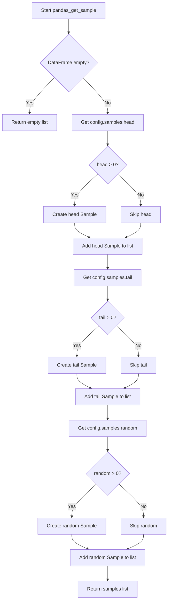

# `sample_pandas.py`

## `src.ydata_profiling.model.pandas.sample_pandas.pandas_get_sample` · *function*

## Summary:
Retrieves configured samples (head, tail, and random) from a pandas DataFrame for inclusion in profiling reports.

## Description:
This function extracts specific samples from a pandas DataFrame based on configuration settings. It creates three types of samples: the first N rows (head), last N rows (tail), and N random rows (random), where N values are determined by the configuration. The function is designed to be a dedicated sampling utility that separates the concerns of sample extraction from the broader profiling logic.

Known callers within the codebase:
- Called by ProfileReport.get_sample() in src/ydata_profiling/profile_report.py
- This function is part of the data sampling pipeline that feeds sample data into the report generation process

The logic is extracted into its own function to enforce a clear separation between configuration-driven sampling and the higher-level profiling workflow, allowing for easier testing and reuse of the sampling logic.

## Args:
- config (Settings): Configuration object containing sample size settings (head, tail, random)
- df (pd.DataFrame): Input pandas DataFrame from which samples are to be extracted

## Returns:
- List[Sample]: A list of Sample objects containing the requested samples. Each Sample object has:
  - id: String identifier ("head", "tail", or "random")
  - data: DataFrame slice containing the sample data
  - name: Human-readable name for the sample type

## Raises:
- None: This function does not explicitly raise exceptions, though underlying pandas operations may raise exceptions for invalid inputs.

## Constraints:
- Preconditions: 
  - config must be a valid Settings object with a samples attribute
  - df must be a valid pandas DataFrame
- Postconditions:
  - Returns an empty list if the input DataFrame is empty
  - Returns a list with 0-3 Sample objects depending on configuration values

## Side Effects:
- None: This function performs no I/O operations or external state mutations.

## Control Flow:


## Examples:
```python
# Basic usage with default configuration
import pandas as pd
from ydata_profiling.config import Settings
from ydata_profiling.model.pandas.sample_pandas import pandas_get_sample

df = pd.DataFrame({'A': [1, 2, 3, 4, 5], 'B': [6, 7, 8, 9, 10]})
config = Settings()
samples = pandas_get_sample(config, df)

# With custom sample sizes
config.samples.head = 2
config.samples.tail = 1
config.samples.random = 1
samples = pandas_get_sample(config, df)
# Returns 3 Sample objects: head(2 rows), tail(1 row), random(1 row)
```

