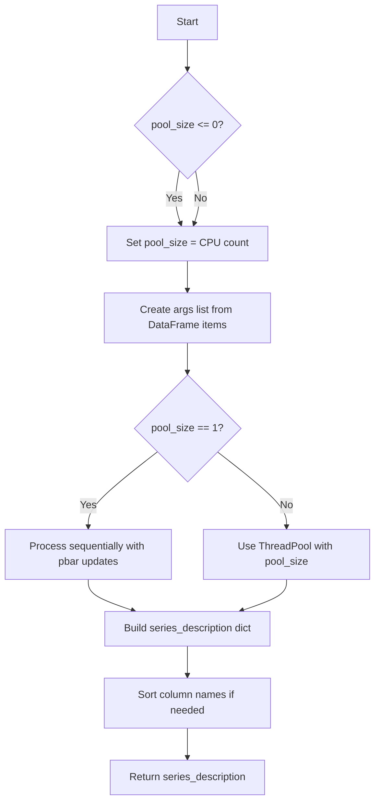

# `summary_pandas.py`

## `src.ydata_profiling.model.pandas.summary_pandas.pandas_describe_1d` · *function*

## Summary:
Determines the data type of a pandas Series and generates a statistical summary using a summarizer.

## Description:
This function serves as a bridge between data type inference and statistical summarization for individual pandas Series. It handles type detection and casting logic before delegating to a summarizer to compute descriptive statistics. The function is designed to be called within data profiling pipelines where individual column summaries are computed.

## Args:
    config (Settings): Configuration object containing profiling settings.
    series (pandas.Series): The pandas Series to summarize.
    summarizer (BaseSummarizer): An instance of a summarizer class responsible for computing statistics.
    typeset (VisionsTypeset): A typeset object used for type inference and detection.

## Returns:
    dict: A dictionary containing the statistical summary of the series computed by the summarizer.

## Raises:
    None explicitly raised in the function body.

## Constraints:
    Preconditions:
        - The `config` parameter must be a valid Settings object.
        - The `series` parameter must be a valid pandas Series.
        - The `summarizer` parameter must be a valid BaseSummarizer instance.
        - The `typeset` parameter must be a valid VisionsTypeset instance.
    Postconditions:
        - The `typeset.type_schema` dictionary will be updated with the inferred or detected type for the series name.
        - The returned dictionary contains the summary statistics computed by the summarizer.

## Side Effects:
    - Modifies the `typeset.type_schema` dictionary by adding/updating the type for the series name.
    - May modify the series data if `typeset.cast_to_inferred` is called (when config.infer_dtypes is True).
    - Calls `fillna(np.nan)` on the input series to handle missing values.

## Control Flow:
```mermaid
flowchart TD
    A[Start] --> B{isinstance(typeset, ProfilingTypeSet)?}
    B -- Yes --> C{series.name in typeset.type_schema?}
    C -- Yes --> D[Use existing type from schema]
    C -- No --> E[Check config.infer_dtypes]
    E -- True --> F[Infer type and cast series]
    E -- False --> G[Detect type]
    B -- No --> H[Check config.infer_dtypes]
    H -- True --> F
    H -- False --> G
    F --> I[Update type schema]
    G --> I
    D --> I
    I --> J[Return summarizer.summarize()]
```

## Examples:
```python
# Typical usage in a profiling pipeline
config = Settings()
series = pd.Series([1, 2, 3, 4, 5])
summarizer = MySummarizer()
typeset = VisionsTypeset()

result = pandas_describe_1d(config, series, summarizer, typeset)
print(result)
```

## `src.ydata_profiling.model.pandas.summary_pandas.pandas_get_series_descriptions` · *function*

## Summary:
Computes descriptive statistics for each column in a DataFrame using parallel processing for efficiency.

## Description:
This function processes each column of a pandas DataFrame to generate detailed statistical descriptions. It leverages multiprocessing to improve performance when analyzing large datasets, with the number of worker processes configurable via the Settings object. The results are returned as a dictionary mapping column names to their respective descriptions.

## Args:
    config (Settings): Configuration object containing settings such as pool_size for multiprocessing
    df (pd.DataFrame): Input DataFrame containing the data to be described
    summarizer (BaseSummarizer): Object responsible for generating statistical summaries for each series
    typeset (VisionsTypeset): Type set used to identify the data types of columns
    pbar (tqdm): Progress bar object for tracking processing progress

## Returns:
    dict: A dictionary where keys are column names and values are dictionaries containing descriptive statistics for each column

## Raises:
    ValueError: When an invalid sort parameter is provided to the sort_column_names utility function

## Constraints:
    Preconditions:
        - config must be a valid Settings object with pool_size attribute
        - df must be a valid pandas DataFrame
        - summarizer must be a valid BaseSummarizer instance
        - typeset must be a valid VisionsTypeset instance
        - pbar must be a valid tqdm progress bar object
    
    Postconditions:
        - All columns in the input DataFrame will be processed and described
        - The returned dictionary will have the same keys as the DataFrame columns
        - Column ordering in the result will match the sorting preference specified in config.sort

## Side Effects:
    - Updates the progress bar (pbar) during execution
    - May create multiple threads/processes depending on pool_size configuration
    - Calls external functions like describe_1d and sort_column_names

## Control Flow:


## Examples:
    # Basic usage with default settings
    config = Settings()
    df = pd.DataFrame({'A': [1, 2, 3], 'B': ['x', 'y', 'z']})
    summarizer = BaseSummarizer()
    typeset = VisionsTypeset()
    pbar = tqdm(total=len(df.columns))
    
    result = pandas_get_series_descriptions(config, df, summarizer, typeset, pbar)
    print(result)
    # Output: {'A': {...}, 'B': {...}} where each value is a dict of statistics

