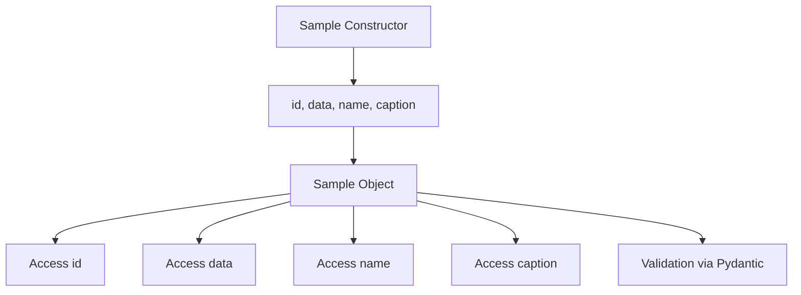
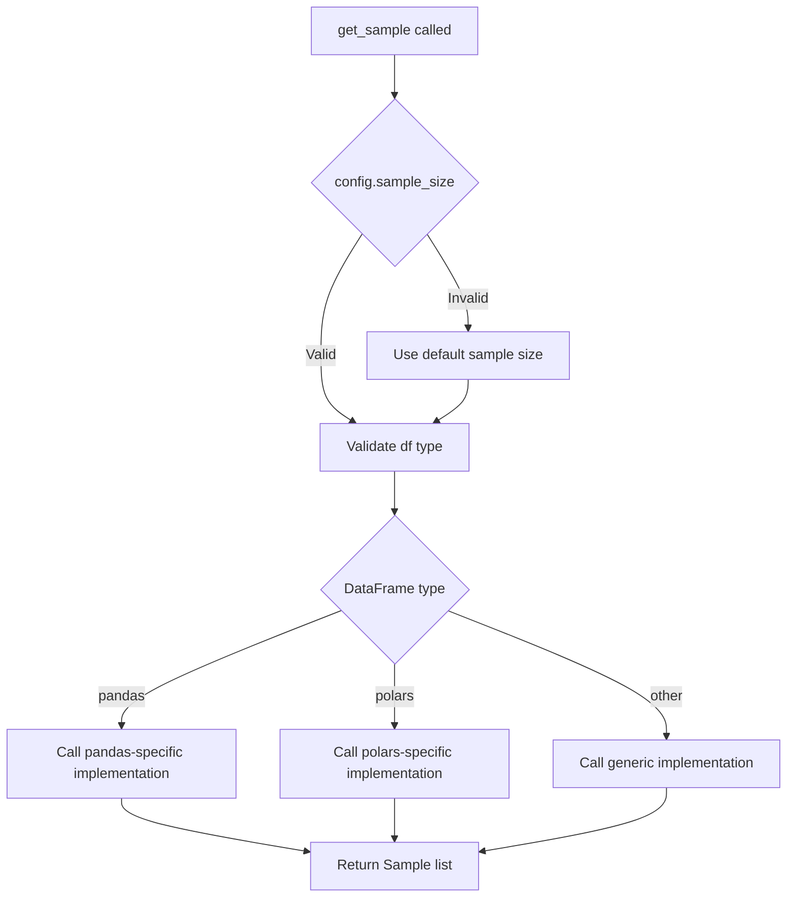

# `sample.py`

## `src.ydata_profiling.model.sample.Sample` · *class*

## Summary:
Represents a sample of data with identifying metadata for profiling and analysis.

## Description:
The Sample class serves as a standardized container for data samples within the profiling system. It extends Pydantic's BaseModel to provide structured data handling with built-in validation. This abstraction enables consistent representation of sample data across different profiling components while supporting flexible data types through its generic TypeVar parameter.

## State:
- id: str - Unique identifier for the sample, required for tracking and referencing
- data: TypeVar T - The actual sample data, allowing for flexible typing of different data structures (lists, strings, dictionaries, etc.)
- name: str - Human-readable name for the sample, used for display and identification
- caption: Optional[str] = None - Optional descriptive caption providing additional context about the sample

## Lifecycle:
- Creation: Instantiate with id, data, and name parameters; caption is optional
- Usage: Access attributes directly for data retrieval and processing
- Destruction: Managed by Python's garbage collection

## Method Map:


## Raises:
- ValidationError: If any of the required fields (id, data, name) are missing or invalid according to Pydantic validation rules

## Example:
```python
# Creating a sample with integer data
sample1 = Sample(id="sample_1", data=[1, 2, 3], name="Integer Sample")

# Creating a sample with string data  
sample2 = Sample(id="sample_2", data="hello world", name="String Sample", caption="A greeting")

# Accessing sample properties
print(sample1.id)        # "sample_1"
print(sample1.data)      # [1, 2, 3]
print(sample2.caption)   # "A greeting"

# The sample can be validated automatically through Pydantic
# All fields are properly typed and validated
```

## `src.ydata_profiling.model.sample.get_sample` · *function*

## Summary:
Retrieves a sample of data records from a DataFrame based on configuration settings using a multimethod approach.

## Description:
This function implements a multimethod for extracting sample data records from DataFrames of different types (pandas, polars, etc.). It serves as the entry point for sampling operations across the profiling system, with specific implementations provided for different DataFrame types through the multimethod decorator.

The function is designed to be extended by specialized implementations that handle specific DataFrame libraries. The base implementation raises NotImplementedError, requiring concrete implementations for actual usage.

Known callers within the codebase would include profiling components that require sample data for display purposes, such as summary statistics generators, visualization modules, and report rendering components. These callers typically invoke this function during the profiling process when sample data is needed for user presentation.

This logic is extracted into its own function rather than being inlined to provide a clean separation between the sampling interface and implementation details, enabling support for multiple DataFrame types while maintaining a consistent API.

## Args:
    config (Settings): Configuration object containing sampling parameters such as sample size limits, random seed settings, and sampling strategy
    df (T): Input DataFrame of generic type T, representing the data source to sample from. T is a TypeVar that can represent different DataFrame implementations (pandas, polars, etc.)

## Returns:
    List[Sample]: A list of Sample objects containing the sampled data records, where each Sample contains:
        - id: str - Unique identifier for the sample
        - data: T - The actual sampled data in the same format as input DataFrame
        - name: str - Human-readable name for the sample
        - caption: Optional[str] - Optional descriptive caption providing additional context

## Raises:
    NotImplementedError: Always raised by the base implementation, indicating that specific implementations must be provided for different DataFrame types

## Constraints:
    Preconditions:
        - config must be a valid Settings object with proper sampling configuration
        - df must be a valid DataFrame-like object that supports the sampling operation
    Postconditions:
        - The returned list contains Sample objects with properly formatted data
        - The number of samples respects the configuration limits
        - Each Sample object maintains the structural integrity of the original data

## Side Effects:
    None

## Control Flow:


## Examples:
```python
# Typical usage in profiling context
config = Settings()
df = pd.DataFrame({'a': [1, 2, 3], 'b': [4, 5, 6]})
samples = get_sample(config, df)
# Returns a list of Sample objects with sampled data

# The multimethod approach allows for different implementations:
# - pandas DataFrame -> pandas-specific sampling
# - polars DataFrame -> polars-specific sampling
# - Other DataFrame types -> generic sampling approach
```

## `src.ydata_profiling.model.sample.get_custom_sample` · *function*

## Summary:
Creates a standardized Sample object from a dictionary representation with optional name and caption fields.

## Description:
This function transforms a dictionary containing sample data into a properly structured Sample object suitable for profiling workflows. It ensures backward compatibility by providing default values for optional fields (name and caption) when they are missing from the input dictionary. The function extracts the required 'data' field and constructs a Sample instance with a fixed 'custom' ID, making it suitable for custom user-defined samples in the profiling pipeline.

## Args:
    sample (dict): A dictionary containing sample data with required 'data' key and optional 'name' and 'caption' keys

## Returns:
    List[Sample]: A list containing exactly one Sample object constructed from the input dictionary

## Raises:
    KeyError: If the required 'data' key is missing from the input sample dictionary

## Constraints:
    Preconditions:
        - Input sample dictionary must contain a 'data' key
        - The 'data' value can be of any type (list, string, dict, etc.)
    Postconditions:
        - Returned list contains exactly one Sample object
        - Sample object has id="custom", data matching input, and name/caption set to None if not provided

## Side Effects:
    None

## Control Flow:
```mermaid
flowchart TD
    A[Start get_custom_sample] --> B{Is "name" in sample?}
    B -->|No| C[Set sample["name"] = None]
    C --> D{Is "caption" in sample?}
    D -->|No| E[Set sample["caption"] = None]
    E --> F[Create Sample object]
    F --> G[Return List[Sample]]
    B -->|Yes| D
    D -->|Yes| F
```

## Examples:
```python
# Basic usage with minimal data
sample_dict = {"data": [1, 2, 3, 4, 5]}
result = get_custom_sample(sample_dict)
# Returns: [Sample(id="custom", data=[1, 2, 3, 4, 5], name=None, caption=None)]

# Usage with all fields provided
sample_dict = {
    "data": {"key": "value"}, 
    "name": "Test Sample", 
    "caption": "A test sample for demonstration"
}
result = get_custom_sample(sample_dict)
# Returns: [Sample(id="custom", data={"key": "value"}, name="Test Sample", caption="A test sample for demonstration")]
```

