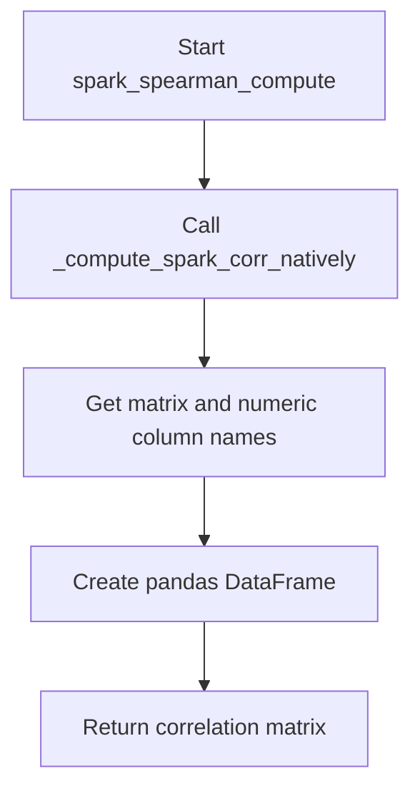
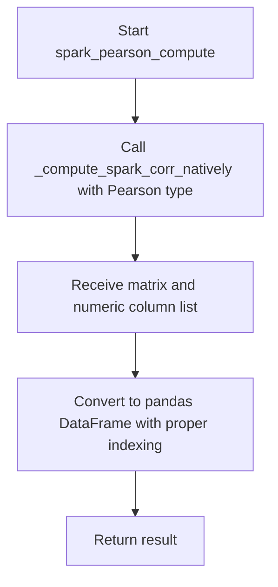
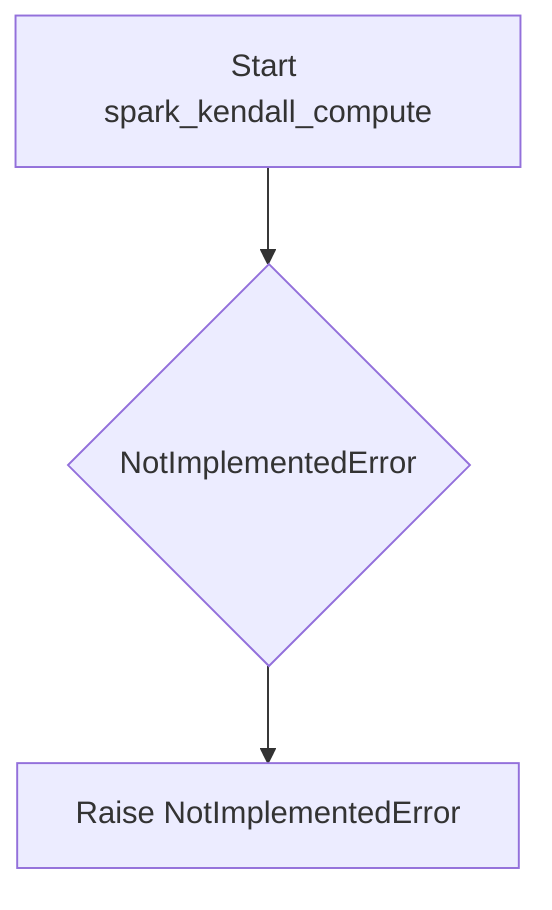
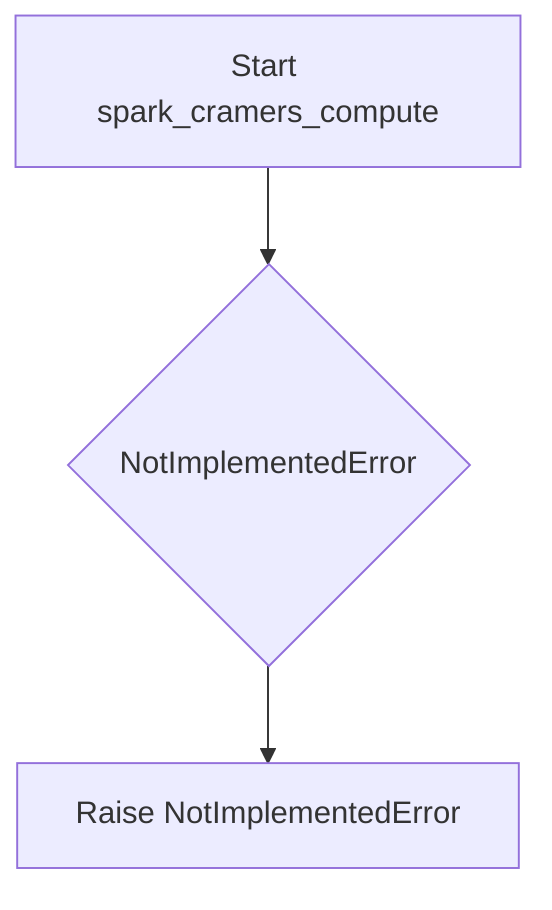
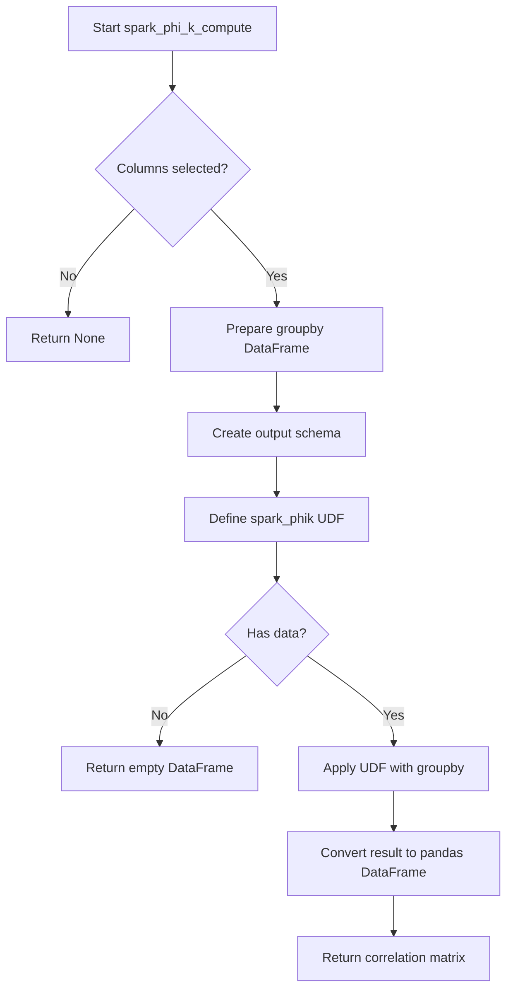

# `correlations_spark.py`

## `src.ydata_profiling.model.spark.correlations_spark.spark_spearman_compute` · *function*

## Summary:
Computes the Spearman rank correlation matrix for numeric columns in a Spark DataFrame.

## Description:
This function calculates the Spearman rank correlation coefficients between all pairs of numeric columns in a Spark DataFrame. It serves as a specialized wrapper around the native Spark correlation computation function, specifically configured for Spearman correlation. The function filters numeric columns from the input DataFrame and summary metadata, then delegates the actual computation to `_compute_spark_corr_natively` with the appropriate correlation type identifier.

The function is part of the Spark-specific correlation computation module and is designed to work with distributed data processing environments. It integrates with the broader ydata-profiling framework's correlation analysis system, allowing users to compute Spearman correlations efficiently on large-scale datasets using Spark's distributed computing capabilities.

## Args:
    config (Settings): Configuration object containing profiling settings and correlation preferences
    df (DataFrame): Input Spark DataFrame containing the data to compute correlations for
    summary (dict): Dictionary containing column metadata with column names as keys and description dictionaries as values, where each description contains a "type" field indicating the column type

## Returns:
    Optional[pd.DataFrame]: A pandas DataFrame representing the Spearman correlation matrix where rows and columns correspond to numeric column names. Returns None if no numeric columns are present in the DataFrame.

## Raises:
    None explicitly raised in the function body

## Constraints:
    Preconditions:
        - Input DataFrame must be a valid Spark DataFrame
        - Summary dictionary must contain valid column metadata with "type" fields
        - Config object must be properly initialized with correlation settings
    Postconditions:
        - Returns a symmetric correlation matrix with values between -1 and 1
        - Matrix dimensions equal the number of numeric columns in the DataFrame
        - Row and column labels match the numeric column names from the original DataFrame

## Side Effects:
    None

## Control Flow:


## Examples:
    # Basic usage with a Spark DataFrame
    from ydata_profiling.config import Settings
    
    # Assuming df is a Spark DataFrame with numeric columns
    config = Settings()
    summary = {
        "col1": {"type": "Numeric"},
        "col2": {"type": "Numeric"},
        "col3": {"type": "Categorical"}
    }
    
    correlation_df = spark_spearman_compute(config, df, summary)
    # Returns a pandas DataFrame with Spearman correlation coefficients
```

## `src.ydata_profiling.model.spark.correlations_spark.spark_pearson_compute` · *function*

## Summary:
Computes the Pearson correlation matrix for numeric columns in a Spark DataFrame and returns it as a pandas DataFrame.

## Description:
This function serves as a specialized wrapper for computing Pearson correlations in Spark DataFrames. It delegates the actual computation to `_compute_spark_corr_natively` with the appropriate correlation type parameter, then formats the result into a standard pandas DataFrame with row and column labels corresponding to the numeric columns.

The function is part of the Spark-specific correlation computation module and is used when profiling data using PySpark. It enables distributed computation of Pearson correlations while maintaining compatibility with the standard pandas DataFrame interface expected by downstream components.

## Args:
    config (Settings): Configuration object containing profiling settings and correlation preferences
    df (DataFrame): Input Spark DataFrame containing the data to compute correlations for
    summary (dict): Dictionary containing column metadata with column names as keys and description dictionaries as values, where each description contains a "type" field indicating the column type

## Returns:
    Optional[pd.DataFrame]: A pandas DataFrame representing the Pearson correlation matrix for numeric columns, or None if no numeric columns are present

## Raises:
    None explicitly raised in the function body

## Constraints:
    Preconditions:
        - Input DataFrame must be a valid Spark DataFrame
        - Summary dictionary must contain valid column metadata with "type" fields
        - Config must be a properly initialized Settings object
    Postconditions:
        - Returns a symmetric correlation matrix with values between -1 and 1
        - Matrix rows and columns are labeled with numeric column names
        - Returns None when no numeric columns are found in the DataFrame

## Side Effects:
    None

## Control Flow:


## Examples:
    # Basic usage with a Spark DataFrame
    spark_df = spark.createDataFrame([(1, 2.0, 3), (4, 5.0, 6)], ["a", "b", "c"])
    summary = {
        "a": {"type": "Numeric"},
        "b": {"type": "Numeric"}, 
        "c": {"type": "Numeric"}
    }
    config = Settings()
    result_df = spark_pearson_compute(config, spark_df, summary)
    # Returns a pandas DataFrame with Pearson correlation matrix

## `src.ydata_profiling.model.spark.correlations_spark._compute_spark_corr_natively` · *function*

## Summary:
Computes correlation matrix for numeric columns in a Spark DataFrame using native Spark MLlib correlation functions.

## Description:
This function extracts numeric columns from a Spark DataFrame and computes their correlation matrix using Spark's built-in correlation computation capabilities. It serves as a backend implementation for computing various types of correlations (Pearson, Spearman, etc.) on distributed data. The function is designed to work with Spark DataFrames and leverages PySpark's VectorAssembler and Correlation classes for efficient distributed computation.

## Args:
    df (DataFrame): Input Spark DataFrame containing the data to compute correlations for
    summary (dict): Dictionary containing column metadata with column names as keys and description dictionaries as values, where each description contains a "type" field indicating the column type
    corr_type (str): String identifier specifying the correlation method to use (e.g., "pearson", "spearman")

## Returns:
    tuple: A tuple containing:
        - matrix: The computed correlation matrix as a 2D array-like object (typically numpy array or similar)
        - interval_columns (list): List of column names that were used in the correlation computation (numeric columns)

## Raises:
    None explicitly raised in the function body

## Constraints:
    Preconditions:
        - Input DataFrame must be a valid Spark DataFrame
        - Summary dictionary must contain valid column metadata with "type" fields
        - corr_type must be a valid correlation method supported by Spark's Correlation.corr function
    Postconditions:
        - Returns a correlation matrix for all numeric columns in the DataFrame
        - The returned matrix dimensions match the number of numeric columns
        - Interval columns list contains only numeric column names from the original DataFrame

## Side Effects:
    None

## Control Flow:
```mermaid
flowchart TD
    A[Start _compute_spark_corr_natively] --> B[Extract variables from summary]
    B --> C[Filter interval columns (Numeric type)]
    C --> D[Select numeric columns from DataFrame]
    D --> E[Prepare VectorAssembler args]
    E --> F[Apply handleInvalid skip for Spark >= 2.4.0]
    F --> G[Create VectorAssembler instance]
    G --> H[Transform DataFrame to vector format]
    H --> I[Compute correlation matrix using Correlation.corr]
    I --> J[Return matrix and interval columns]
```

## Examples:
    # Basic usage with Pearson correlation
    df = spark.createDataFrame([(1, 2.0, 3), (4, 5.0, 6)], ["a", "b", "c"])
    summary = {
        "a": {"type": "Numeric"},
        "b": {"type": "Numeric"}, 
        "c": {"type": "Numeric"}
    }
    corr_matrix, cols = _compute_spark_corr_natively(df, summary, "pearson")
    # Returns correlation matrix and list of numeric columns

## `src.ydata_profiling.model.spark.correlations_spark.spark_kendall_compute` · *function*

## Summary:
Computes Kendall correlation coefficients for Spark DataFrame columns using PySpark MLlib statistical functions.

## Description:
This function computes Kendall rank correlation coefficients between pairs of numeric columns in a Spark DataFrame. It serves as the Spark-specific implementation of the Kendall correlation method, designed to work with PySpark DataFrames rather than pandas DataFrames. The function is part of the correlation analysis pipeline in the ydata-profiling library and is intended to be called by the general Kendall correlation class when processing Spark data.

This function acts as a bridge between the abstract correlation interface and the concrete Spark implementation, leveraging PySpark's MLlib capabilities for efficient distributed correlation computation.

## Args:
    config (Settings): Configuration object containing profiling settings, particularly correlation-related options such as whether to compute correlations and which methods to use.
    df (DataFrame): Input Spark DataFrame containing the data to analyze for correlations.
    summary (dict): Dictionary containing column summaries and metadata used for correlation computation, including column names and data types.

## Returns:
    Optional[pd.DataFrame]: A pandas DataFrame containing the Kendall correlation matrix if successful, or None if computation fails, is not applicable, or if the correlation method is disabled in the configuration.

## Raises:
    NotImplementedError: Raised because this function is currently not implemented and serves as a placeholder for the actual Spark-based Kendall correlation computation logic.

## Constraints:
    Preconditions:
        - The input DataFrame must be a valid PySpark DataFrame
        - The config object must contain appropriate correlation settings
        - The summary dictionary must contain valid column information
        - The DataFrame should contain numeric columns suitable for correlation analysis
    
    Postconditions:
        - Function raises NotImplementedError (current implementation)
        - Future implementation will return a correlation matrix or None based on configuration

## Side Effects:
    - No direct I/O operations
    - No external state mutations
    - No external service calls
    - May consume significant memory for large DataFrames during correlation computation

## Control Flow:


## Examples:
    Not applicable due to NotImplementedError being raised.

## `src.ydata_profiling.model.spark.correlations_spark.spark_cramers_compute` · *function*

## Summary:
Computes Cramér's V correlation matrix for categorical variables in Spark DataFrames.

## Description:
This function computes Cramér's V correlation coefficients between categorical variables in a Spark DataFrame. Cramér's V is a measure of association between categorical variables that ranges from 0 (no association) to 1 (perfect association). This implementation is specifically designed for distributed Spark environments and uses the Phik library for the actual computation.

The function is part of the correlation computation pipeline and serves as a Spark-specific implementation of the Cramers correlation method. It follows the same interface pattern as other correlation functions in the system but adapts to Spark's distributed processing capabilities. This function is intended to be called by the correlation analysis framework when Cramér's V correlation is selected for categorical data analysis.

## Args:
    config (Settings): Configuration object containing profiling settings including correlation configurations and global parameters
    df (DataFrame): Input Spark DataFrame containing the data to analyze for categorical correlations
    summary (dict): Pre-computed summary statistics for the dataset, containing variable-level information and metadata

## Returns:
    Optional[pandas.DataFrame]: Pandas DataFrame containing the Cramér's V correlation matrix, or None if correlation analysis is disabled or not applicable

## Raises:
    NotImplementedError: Always raised as the implementation is not yet completed

## Constraints:
    Preconditions:
        - config must be a valid Settings object with properly initialized correlation configurations
        - df must be a valid Spark DataFrame
        - summary must be a dictionary containing pre-computed dataset statistics
    Postconditions:
        - Function always raises NotImplementedError (current implementation)

## Side Effects:
    None

## Control Flow:


## Examples:
None - Implementation not yet available

## `src.ydata_profiling.model.spark.correlations_spark.spark_phi_k_compute` · *function*

## Summary:
Computes the phi-k correlation matrix for categorical and numerical columns in a Spark DataFrame using the phik library.

## Description:
This function calculates the phi-k correlation between columns in a Spark DataFrame, which measures the strength of association between categorical variables. It filters columns based on their data type and distinct value count, then applies the phik library through a Pandas UDF to compute correlations. The function is designed to work with Spark DataFrames and returns a pandas DataFrame containing the correlation matrix.

The phi-k correlation is particularly useful for measuring associations in categorical data, extending beyond traditional Pearson correlation to handle mixed data types including numeric and categorical variables.

## Args:
    config (Settings): Configuration object containing the maximum number of distinct values allowed for categorical correlation computation
    df (DataFrame): Input Spark DataFrame containing the data to analyze
    summary (dict): Dictionary containing column metadata including type and distinct count information

## Returns:
    Optional[pd.DataFrame]: A pandas DataFrame representing the phi-k correlation matrix, or None if insufficient columns exist for computation. The matrix contains correlation coefficients between -1 and 1, where 1 indicates perfect positive correlation, -1 indicates perfect negative correlation, and 0 indicates no correlation.

## Raises:
    None explicitly raised

## Constraints:
    Preconditions:
    - Input DataFrame must be a valid Spark DataFrame
    - Summary dictionary must contain proper column metadata with 'type' and 'n_distinct' keys
    - Config must contain 'categorical_maximum_correlation_distinct' attribute
    
    Postconditions:
    - Returns None when fewer than 2 columns meet selection criteria
    - Returns a square correlation matrix when computation succeeds
    - Matrix rows and columns correspond to selected column names
    - All correlation values are between -1 and 1 inclusive

## Side Effects:
    None

## Control Flow:


## Examples:
    # Basic usage with a Spark DataFrame
    config = Settings()
    df = spark.createDataFrame(data, schema)
    summary = {"col1": {"type": "Numeric", "n_distinct": 5}, "col2": {"type": "Categorical", "n_distinct": 3}}
    result = spark_phi_k_compute(config, df, summary)
    # Returns correlation matrix or None if insufficient columns
    
    # Example of result structure:
    #          col1      col2
    # col1   1.000000  0.123456
    # col2   0.123456  1.000000

