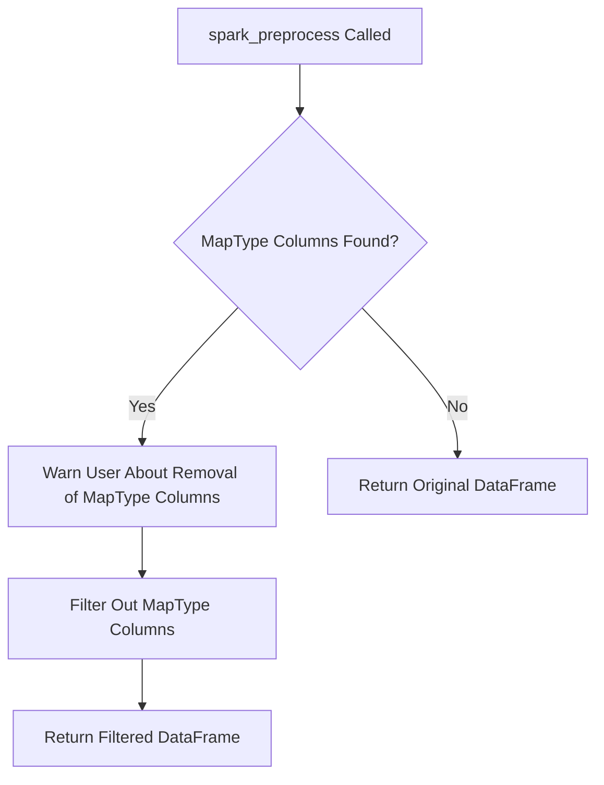

# `dataframe_spark.py`

## `src.ydata_profiling.model.spark.dataframe_spark.spark_check_dataframe` · *function*

## Summary:
Validates that the input is a PySpark DataFrame instance, issuing a warning if not.

## Description:
Performs a type check to ensure the provided input is a valid PySpark DataFrame. This function is part of the Spark-specific data validation layer and is called during the profiling pipeline to verify DataFrame compatibility before further processing. When the input is not a PySpark DataFrame, it issues a warning rather than raising an exception, allowing the pipeline to continue with potentially degraded functionality.

## Args:
    df (DataFrame): The input object to validate, expected to be a PySpark DataFrame instance.

## Returns:
    None: This function does not return any value.

## Raises:
    None: This function does not explicitly raise exceptions, though a warning is issued for invalid inputs.

## Constraints:
    Preconditions: The input parameter `df` must be passed to the function.
    Postconditions: The function completes without raising exceptions (though a warning may be issued).

## Side Effects:
    Warning emission: Issues a warning via Python's warnings module when the input is not a PySpark DataFrame.

## Control Flow:
```mermaid
flowchart TD
    A[spark_check_dataframe Called] --> B{df is DataFrame?}
    B -- No --> C[warn("df is not of type pyspark.sql.dataframe.DataFrame")]
    B -- Yes --> D[Return None]
```

## Examples:
```python
from pyspark.sql import SparkSession
from ydata_profiling.model.spark.dataframe_spark import spark_check_dataframe

spark = SparkSession.builder.appName("test").getOrCreate()
df = spark.createDataFrame([(1, "a"), (2, "b")], ["id", "value"])

# Valid usage - no warning issued
spark_check_dataframe(df)

# Invalid usage - warning issued
spark_check_dataframe("not_a_dataframe")
```

## `src.ydata_profiling.model.spark.dataframe_spark.spark_preprocess` · *function*

## Summary:
Preprocesses Spark DataFrames by filtering out columns with MapType data, warning users about removal of such columns.

## Description:
This function processes Spark DataFrames to remove columns with MapType data, which are incompatible with the profiling pipeline. It identifies MapType columns, issues a warning to users about their removal, and returns a filtered DataFrame containing only non-MapType columns. The function is designed to be part of the Spark-specific preprocessing pipeline, ensuring compatibility with downstream profiling operations.

## Args:
    config (Settings): Configuration object containing profiling settings that may influence preprocessing behavior.
    df (DataFrame): Input Spark DataFrame to be preprocessed.

## Returns:
    DataFrame: A Spark DataFrame with MapType columns removed. If no MapType columns exist, returns the original DataFrame unchanged.

## Raises:
    None: This function does not explicitly raise any exceptions.

## Constraints:
    Preconditions:
        - config must be a valid Settings object instance
        - df must be a valid Spark DataFrame object
    Postconditions:
        - All MapType columns are removed from the returned DataFrame
        - The returned DataFrame maintains the same schema as the input except for removed MapType columns

## Side Effects:
    - Issues a warning via Python's warnings module when MapType columns are detected and removed
    - No I/O operations or external state mutations occur

## Control Flow:


## Examples:
```python
from ydata_profiling.config import Settings
from pyspark.sql import SparkSession

# Initialize Spark session
spark = SparkSession.builder.appName("Test").getOrCreate()
config = Settings()

# Create test DataFrame with MapType column
data = [("Alice", {"age": 25, "city": "NYC"}), ("Bob", {"age": 30, "city": "LA"})]
columns = ["name", "attributes"]
df = spark.createDataFrame(data, columns)

# Apply preprocessing
processed_df = spark_preprocess(config, df)
# The resulting DataFrame will exclude the 'attributes' column
```

