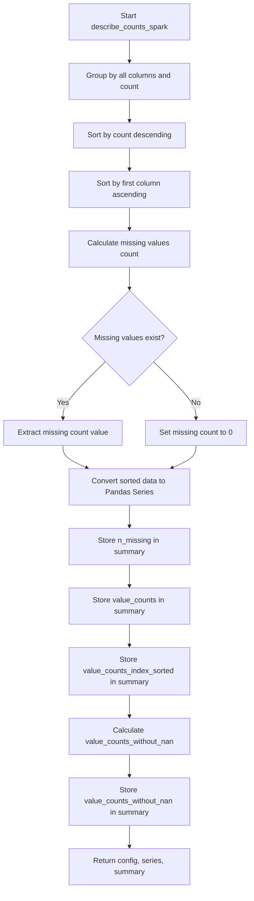

# `describe_counts_spark.py`

## `src.ydata_profiling.model.spark.describe_counts_spark.describe_counts_spark` · *function*

## Summary:
Computes and stores value counts and missing data statistics for a Spark DataFrame series.

## Description:
Processes a Spark DataFrame to calculate value frequencies, missing value counts, and organizes the data for profiling. This function extracts value count statistics from Spark DataFrames and converts them to Pandas format for downstream processing while maintaining persistence of intermediate results. It serves as the Spark-specific implementation of the general describe_counts algorithm.

## Args:
    config (Settings): Configuration settings for the profiling process
    series (DataFrame): Input Spark DataFrame containing the data to analyze
    summary (dict): Dictionary to store computed statistics and results

## Returns:
    Tuple[Settings, DataFrame, dict]: The unchanged config, original series, and updated summary dictionary containing:
        - n_missing: Count of missing/null values
        - value_counts: Spark DataFrame with value frequencies (persisted)
        - value_counts_index_sorted: Pandas Series with sorted values and frequencies
        - value_counts_without_nan: Pandas Series with frequencies excluding null values

## Raises:
    None explicitly raised - relies on Spark operations which may throw runtime exceptions

## Constraints:
    Preconditions:
        - series must be a valid Spark DataFrame
        - summary must be a mutable dictionary
        - config must be a valid Settings object
    
    Postconditions:
        - summary dictionary will contain the keys: n_missing, value_counts, value_counts_index_sorted, value_counts_without_nan
        - value_counts is persisted in memory
        - All returned data structures maintain their expected types

## Side Effects:
    - Persists Spark DataFrames in memory using .persist() method
    - Converts Spark DataFrames to Pandas Series via .toPandas() calls
    - Modifies the summary dictionary in-place by adding new keys

## Control Flow:

## Examples:
    # Typical usage in profiling pipeline
    config = Settings()
    spark_df = spark.createDataFrame([(1, "A"), (2, "B"), (None, "C")], ["id", "category"])
    summary = {}
    
    result_config, result_series, result_summary = describe_counts_spark(config, spark_df, summary)
    
    # Access computed statistics
    print(result_summary["n_missing"])  # Prints count of missing values
    print(result_summary["value_counts"].collect())  # Prints value frequency counts

