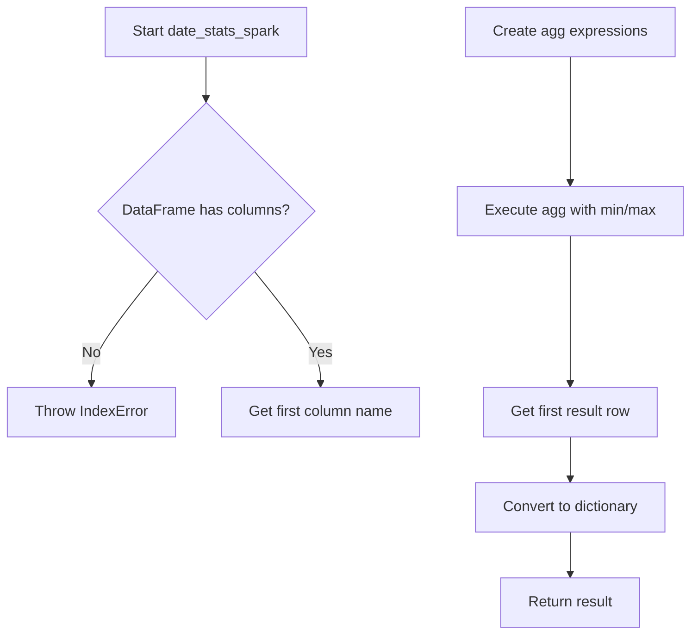
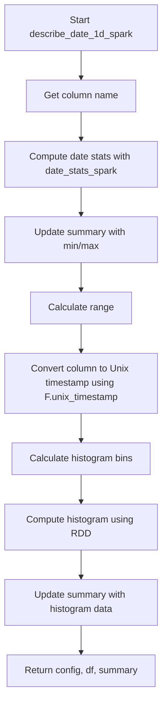

# `describe_date_spark.py`

## `src.ydata_profiling.model.spark.describe_date_spark.date_stats_spark` · *function*

## Summary:
Computes minimum and maximum date values for a Spark DataFrame column.

## Description:
This function extracts the minimum and maximum date values from a single-column Spark DataFrame. It is designed to work with date/time data types and returns these statistics as a dictionary. The function is part of the Spark-specific profiling utilities for date columns.

## Args:
    df (DataFrame): A PySpark DataFrame containing exactly one column of date/time data.
    summary (dict): A dictionary containing summary statistics (unused in current implementation).

## Returns:
    dict: A dictionary with keys 'min' and 'max' representing the minimum and maximum date values respectively.

## Raises:
    IndexError: When the DataFrame has zero columns.
    AttributeError: When the DataFrame column does not support min/max aggregation operations.

## Constraints:
    Preconditions:
        - The input DataFrame must contain exactly one column.
        - The column must contain date or timestamp data types that support min/max operations.
    Postconditions:
        - The returned dictionary will always contain 'min' and 'max' keys.
        - The values for 'min' and 'max' will be the actual date/timestamp values from the DataFrame.

## Side Effects:
    None

## Control Flow:


## Examples:
```python
# Basic usage
from pyspark.sql import SparkSession
from pyspark.sql.functions import col
spark = SparkSession.builder.appName("test").getOrCreate()
df = spark.createDataFrame([(1, '2023-01-01'), (2, '2023-12-31')], ['id', 'date_col'])
result = date_stats_spark(df.select('date_col'), {})
print(result)  # {'min': datetime.date(2023, 1, 1), 'max': datetime.date(2023, 12, 31)}
```

## `src.ydata_profiling.model.spark.describe_date_spark.describe_date_1d_spark` · *function*

## Summary:
Processes a Spark DataFrame date column to compute descriptive statistics and histogram data for profiling.

## Description:
This function performs comprehensive date column analysis for Spark DataFrames by computing min/max values, date range, converting dates to Unix timestamps, and generating histogram data. It integrates with the broader profiling framework by updating summary statistics and modifying the DataFrame to use timestamp representations for further analysis.

The function is part of the Spark-specific date profiling implementation and serves as a bridge between raw date data and the statistical summaries required for profiling reports. It's designed to work with single-column Spark DataFrames containing date/time data.

## Args:
    config (Settings): Configuration object containing profiling settings, particularly histogram bin settings
    df (DataFrame): A PySpark DataFrame containing exactly one date/time column to analyze
    summary (dict): Dictionary containing existing summary statistics that will be updated with date-specific metrics

## Returns:
    Tuple[Settings, DataFrame, dict]: A tuple containing the updated configuration, modified DataFrame with Unix timestamps, and updated summary dictionary with min, max, range, and histogram data

## Raises:
    IndexError: When the input DataFrame has zero columns
    AttributeError: When the DataFrame column does not support timestamp conversion operations

## Constraints:
    Preconditions:
        - The input DataFrame must contain exactly one column
        - The column must contain valid date/time data that can be converted to Unix timestamps
        - The config object must have a valid plot.histogram.bins setting
    Postconditions:
        - The returned DataFrame will have its date column converted to Unix timestamp representation
        - The summary dictionary will contain 'min', 'max', 'range', and 'histogram' keys
        - The histogram data will be stored as a tuple of numpy arrays (histogram counts, bin edges)

## Side Effects:
    - Modifies the input DataFrame by converting the date column to Unix timestamps using `pyspark.sql.functions.unix_timestamp`
    - Updates the summary dictionary in-place with computed statistics
    - Uses RDD operations for histogram computation which may trigger Spark job execution

## Control Flow:


## Examples:
```python
# Basic usage in profiling workflow
from pyspark.sql import SparkSession
from ydata_profiling.config import Settings
import pyspark.sql.functions as F

spark = SparkSession.builder.appName("test").getOrCreate()
config = Settings()
df = spark.createDataFrame([(1, '2023-01-01'), (2, '2023-12-31')], ['id', 'date_col'])

# Process date column for profiling
processed_config, processed_df, updated_summary = describe_date_1d_spark(config, df.select('date_col'), {})

# Resulting summary will contain min, max, range, and histogram data
print(updated_summary['min'])  # Minimum date value
print(updated_summary['max'])  # Maximum date value
print(updated_summary['range'])  # Date range
```

