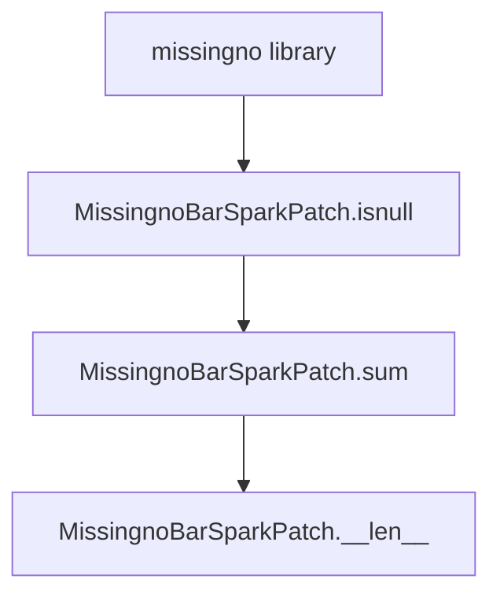
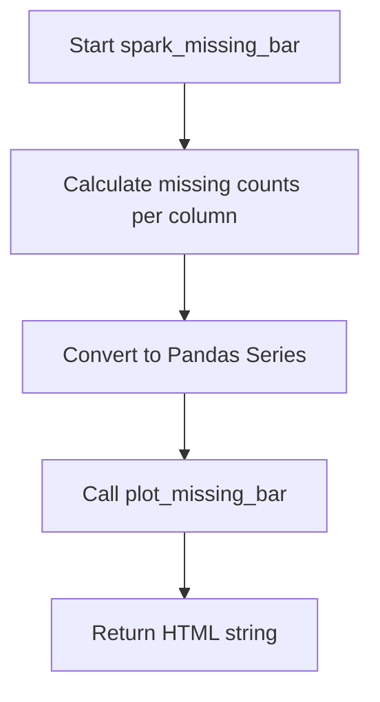
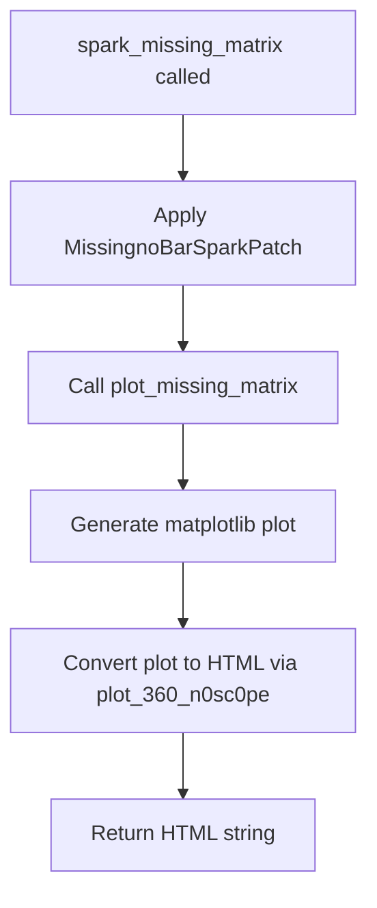
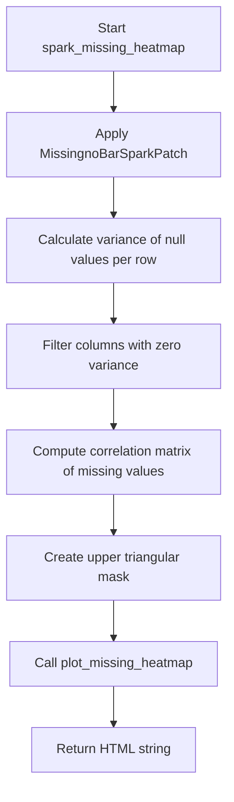

# `missing_spark.py`

## `src.ydata_profiling.model.spark.missing_spark.MissingnoBarSparkPatch` · *class*

## Summary:
A PySpark-compatible patch class that adapts missingno library functionality for Spark DataFrames by providing a minimal interface that maintains compatibility with missingno's expected API.

## Description:
This class acts as a bridge between the missingno visualization library and PySpark DataFrames. It implements a minimal interface that allows missingno's bar chart functionality to work with Spark DataFrames without requiring full pandas compatibility. The class is specifically designed to patch the missingno library's behavior when analyzing missing data patterns in distributed Spark environments.

## State:
- df: pyspark.sql.DataFrame - The PySpark DataFrame containing the data to analyze for missing values
- columns: List[str] or None - Specific column names to analyze for missing values; None indicates all columns should be analyzed
- original_df_size: int or None - The original row count of the DataFrame; used for length calculations

## Lifecycle:
- Creation: Initialize with a PySpark DataFrame, optional column filter list, and original DataFrame size
- Usage: Called internally by missingno visualization functions that expect a pandas-like interface for missing data analysis
- Destruction: No explicit cleanup required; Spark's resource management handles DataFrame lifecycle

## Method Map:


## Raises:
- No explicit exceptions raised during initialization
- Methods are designed to handle None values gracefully and maintain compatibility

## Example:
```python
# This class is typically used internally by missingno library functions
# when processing PySpark DataFrames for missing data visualization

from pyspark.sql import SparkSession
from src.ydata_profiling.model.spark.missing_spark import MissingnoBarSparkPatch

spark = SparkSession.builder.appName("test").getOrCreate()
df = spark.createDataFrame([(1, None), (None, 2)], ["col1", "col2"])

# Internal usage by missingno library
patch = MissingnoBarSparkPatch(df, columns=["col1", "col2"], original_df_size=2)

# The missingno library would internally call these methods:
# patch.isnull()  # Returns self to continue method chaining
# patch.sum()     # Returns the underlying DataFrame for further processing  
# len(patch)      # Returns the original DataFrame size
```

### `src.ydata_profiling.model.spark.missing_spark.MissingnoBarSparkPatch.__init__` · *method*

## Summary:
Initializes the MissingnoBarSparkPatch object with Spark DataFrame and configuration parameters.

## Description:
This method serves as the constructor for the MissingnoBarSparkPatch class, setting up the instance with the required Spark DataFrame and optional configuration parameters. It establishes the foundational data structure for subsequent missing value analysis operations within the Spark environment.

## Args:
    df (DataFrame): The Spark DataFrame containing the data to analyze for missing values.
    columns (List[str], optional): A list of column names to specifically analyze for missing values. If None, all columns are analyzed. Defaults to None.
    original_df_size (int, optional): The original size of the DataFrame before any transformations. If None, it's inferred from the DataFrame. Defaults to None.

## Returns:
    None: This method does not return any value.

## Raises:
    None: This method does not explicitly raise any exceptions.

## State Changes:
    Attributes READ: No attributes are read from the instance.
    Attributes WRITTEN: 
    - self.df: Assigned the input DataFrame
    - self.columns: Assigned the input columns list
    - self.original_df_size: Assigned the input original DataFrame size

## Constraints:
    Preconditions:
    - The df parameter must be a valid PySpark DataFrame.
    - If columns is provided, all elements must be valid column names present in the DataFrame.
    - If original_df_size is provided, it must be a positive integer.

    Postconditions:
    - The instance will have self.df set to the provided DataFrame.
    - The instance will have self.columns set to the provided columns list or None.
    - The instance will have self.original_df_size set to the provided size or None.

## Side Effects:
    None: This method does not perform any I/O operations, external service calls, or mutations to objects outside the instance.

### `src.ydata_profiling.model.spark.missing_spark.MissingnoBarSparkPatch.isnull` · *method*

## Summary:
Returns the instance itself to enable method chaining and patch the isnull functionality for Spark DataFrames in missing value analysis.

## Description:
This method serves as a patch implementation for the `isnull` functionality in the Spark DataFrame context. It returns the instance itself (`self`) to enable method chaining and maintain compatibility with the missing value analysis pipeline. This approach allows the patch to seamlessly integrate with existing code that expects a DataFrame-like interface while providing access to the underlying Spark DataFrame through other methods like `sum()`.

The method is part of the `MissingnoBarSparkPatch` class and is specifically designed to support missing data visualization workflows in Spark environments. It enables the patch to work with missing value analysis functions like `missing_bar`, `missing_heatmap`, and `missing_matrix` by providing a consistent interface that mimics standard DataFrame behavior.

## Args:
    None

## Returns:
    Any: The instance itself (self), enabling method chaining and maintaining compatibility with the missing value analysis framework.

## Raises:
    None

## State Changes:
    - Attributes READ: None
    - Attributes WRITTEN: None

## Constraints:
    - Preconditions: The method assumes the instance is properly initialized with a Spark DataFrame and associated metadata
    - Postconditions: The method always returns the instance itself without modifying any internal state

## Side Effects:
    - None

### `src.ydata_profiling.model.spark.missing_spark.MissingnoBarSparkPatch.sum` · *method*

## Summary:
Returns the underlying Spark DataFrame associated with this missing data visualization patch.

## Description:
This method provides access to the raw Spark DataFrame that contains the data being analyzed for missing values. It serves as a simple getter that exposes the internal DataFrame reference, allowing downstream components to work directly with the Spark DataFrame for further processing or visualization.

## Args:
    None

## Returns:
    DataFrame: The Spark DataFrame instance stored in the patch object's df attribute.

## Raises:
    None

## State Changes:
    Attributes READ: self.df
    Attributes WRITTEN: None

## Constraints:
    Preconditions: The patch object must have been initialized with a valid Spark DataFrame in its df attribute.
    Postconditions: The returned DataFrame reference is identical to the one stored in self.df.

## Side Effects:
    None

### `src.ydata_profiling.model.spark.missing_spark.MissingnoBarSparkPatch.__len__` · *method*

## Summary:
Returns the original DataFrame size stored in the patch instance.

## Description:
This method provides access to the pre-computed size of the original DataFrame that was used to create this patch instance. It serves as a minimal implementation of the `__len__` magic method, allowing the patch to behave like a sequence with a defined length.

## Returns:
    Optional[int]: The size of the original DataFrame, or None if not set.

## State Changes:
    Attributes READ: self.original_df_size

## Constraints:
    Preconditions: The instance must have been initialized with a valid original_df_size value or None.
    Postconditions: The returned value matches the original_df_size attribute exactly.

## Side Effects:
    None

## `src.ydata_profiling.model.spark.missing_spark.spark_missing_bar` · *function*

## Summary:
Generates an HTML bar chart visualization showing the count of missing values for each column in a Spark DataFrame.

## Description:
This function processes a PySpark DataFrame to calculate missing value counts for each column and generates a bar chart visualization using matplotlib. It serves as a Spark-specific implementation of the missing data analysis workflow, bridging the gap between Spark DataFrame processing and visualization rendering. The function extracts missing value statistics from the Spark DataFrame, converts them to Pandas for processing, and then delegates to the standard missing bar plotting function.

## Args:
    config (Settings): Configuration object containing settings for the profiling process, including HTML styling and plot configurations
    df (DataFrame): PySpark DataFrame containing the data to analyze for missing values

## Returns:
    str: HTML string representation of the missing values bar chart visualization

## Raises:
    None explicitly raised by this function, though underlying functions may raise exceptions

## Constraints:
    - Preconditions: The config parameter must be a valid Settings object and df must be a valid PySpark DataFrame
    - Postconditions: The returned HTML string represents a complete, self-contained visualization of missing data patterns

## Side Effects:
    - Converts PySpark DataFrame to Pandas DataFrame internally
    - Generates matplotlib figures and potentially saves files to disk if config.html.inline is False
    - May create temporary files in the assets directory if config.html.inline is False

## Control Flow:


## Examples:
    - Typical usage within a profiling pipeline: spark_missing_bar(config, spark_dataframe)
    - The function is designed to be called during automated data profiling workflows

## `src.ydata_profiling.model.spark.missing_spark.spark_missing_matrix` · *function*

## Summary:
Generates an interactive heatmap visualization of missing data patterns in a PySpark DataFrame.

## Description:
Creates an HTML-based visualization showing the distribution of missing values across columns in a PySpark DataFrame. This function serves as a Spark-specific implementation of missing data matrix visualization, adapting the standard missingno library functionality for distributed DataFrame processing. It patches the DataFrame to work with missingno's expected interface and then generates the visualization using matplotlib.

## Args:
    config (Settings): Configuration object containing report settings and formatting options
    df (DataFrame): PySpark DataFrame containing the data to analyze for missing values

## Returns:
    str: HTML string containing the interactive missing data matrix visualization

## Raises:
    None explicitly raised by this function

## Constraints:
    - Preconditions: config must be a valid Settings object and df must be a non-null PySpark DataFrame
    - Postconditions: Returns a valid HTML string representing the missing data matrix visualization

## Side Effects:
    - Generates matplotlib visualization plots
    - Returns HTML string representation of the visualization
    - May create temporary files if config.html.inline is False

## Control Flow:


## Examples:
    # Basic usage with a PySpark DataFrame
    from ydata_profiling.config import Settings
    from pyspark.sql import SparkSession
    
    spark = SparkSession.builder.appName("test").getOrCreate()
    df = spark.createDataFrame([(1, None), (None, 2)], ["col1", "col2"])
    config = Settings()
    
    html_output = spark_missing_matrix(config, df)
    print(html_output)  # Prints HTML string with missing data visualization
```

## `src.ydata_profiling.model.spark.missing_spark.spark_missing_heatmap` · *function*

## Summary:
Generates a heatmap visualization showing correlations between missing value patterns across columns in a PySpark DataFrame.

## Description:
This function creates a correlation matrix of missing value patterns across all columns in a PySpark DataFrame and visualizes it as a heatmap. It applies a Spark-compatible patch to enable missingno library functionality, filters out columns with no variance in missing values, computes pairwise correlations between missing value patterns, and generates a matplotlib-based heatmap visualization.

The function serves as a Spark-specific implementation of missing value pattern correlation analysis, allowing users to visualize how missing values are distributed and correlated across different columns in large-scale distributed datasets.

## Args:
    config (Settings): Configuration object containing visualization settings such as color maps and label preferences
    df (DataFrame): PySpark DataFrame containing the data to analyze for missing value correlations

## Returns:
    str: HTML representation of the generated missing value heatmap visualization

## Raises:
    None explicitly raised by this function

## Constraints:
    Preconditions:
    - Input DataFrame must be a valid PySpark DataFrame
    - Config object must contain properly initialized plotting configuration
    - DataFrame should have at least one column with missing values
    
    Postconditions:
    - Returns a string containing HTML representation of the heatmap
    - Original DataFrame remains unmodified
    - All intermediate Spark operations are lazily evaluated

## Side Effects:
    - Generates matplotlib figure and axes objects internally
    - May modify global matplotlib state through pyplot.subplots_adjust
    - Creates and displays a matplotlib visualization (though return value contains HTML)

## Control Flow:


## Examples:
```python
from ydata_profiling.config import Settings
from pyspark.sql import SparkSession

# Create Spark session and DataFrame
spark = SparkSession.builder.appName("test").getOrCreate()
df = spark.createDataFrame([(1, None), (None, 2), (3, 4)], ["col1", "col2"])

# Configure settings
config = Settings()

# Generate missing value heatmap
heatmap_html = spark_missing_heatmap(config, df)
print(heatmap_html)  # Prints HTML representation of heatmap
```

