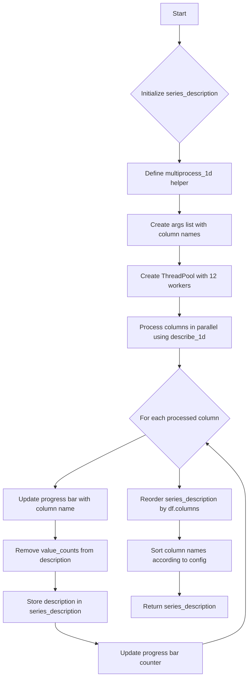

# `summary_spark.py`

## `src.ydata_profiling.model.spark.summary_spark.spark_describe_1d` · *function*

## Summary:
Computes descriptive statistics for a Spark DataFrame column using a specified summarizer and type inference logic.

## Description:
This function processes a single Spark DataFrame column to generate descriptive statistics by either inferring its data type or using a predefined mapping based on the schema. It serves as a bridge between Spark-specific data processing and the general summarization framework, enabling consistent statistical analysis across different data types.

## Args:
    config (Settings): Configuration object containing settings for the profiling process.
    series (DataFrame): A Spark DataFrame representing a single column of data.
    summarizer (BaseSummarizer): An instance of a summarizer class responsible for computing descriptive statistics.
    typeset (VisionsTypeset): A typeset object used for inferring and casting data types.

## Returns:
    dict: A dictionary containing the computed descriptive statistics for the input series.

## Raises:
    KeyError: When a data type from the Spark schema is not mapped in the predefined dtype conversion dictionary.

## Constraints:
    Preconditions:
        - The input `series` must be a valid PySpark DataFrame with a single column.
        - The `config` object must be properly initialized with required settings.
        - The `summarizer` must be an instance of `BaseSummarizer` or compatible subclass.
        - The `typeset` must be a valid `VisionsTypeset` instance.
    Postconditions:
        - The returned dictionary contains descriptive statistics for the input series.
        - The input DataFrame is not modified by this function.

## Side Effects:
    None

## Control Flow:
```mermaid
flowchart TD
    A[Start spark_describe_1d] --> B{config.infer_dtypes}
    B -- True --> C[typeset.infer_type(series)]
    B -- False --> D[Get schema dataType]
    C --> E[typeset.cast_to_inferred(series)]
    D --> F{dataType starts with ArrayType?}
    F -- Yes --> G[dtype = "ArrayType"]
    F -- No --> H[dtype = simpleString()]
    G --> I[vtype = dtype mapping]
    H --> I
    I --> J[summarizer.summarize]
    E --> J
    J --> K[Return summary dict]
```

## Examples:
```python
# Example usage with inferred dtypes
config = Settings()
series = spark.createDataFrame([(1,), (2,), (3,)], ["col1"])
summarizer = BaseSummarizer()
typeset = VisionsTypeset()
result = spark_describe_1d(config, series, summarizer, typeset)
print(result)
```

## `src.ydata_profiling.model.spark.summary_spark.spark_get_series_descriptions` · *function*

## Summary:
Computes descriptive statistics for each column in a Spark DataFrame using parallel processing and returns a dictionary mapping column names to their statistical summaries.

## Description:
This function processes each column of a Spark DataFrame in parallel to compute detailed descriptive statistics. It leverages multiprocessing to handle multiple columns simultaneously, making it efficient for large datasets. The function is designed specifically for Spark DataFrames and integrates with the profiling pipeline to generate comprehensive column-level summaries.

The logic is extracted into its own function to separate the concerns of parallel processing from the core statistical computation, enabling reuse in different contexts while maintaining clean code organization.

## Args:
    config (Settings): Configuration object containing profiling settings and options.
    df (DataFrame): Input Spark DataFrame to be described.
    summarizer (BaseSummarizer): Summarizer instance responsible for computing statistics for each column.
    typeset (VisionsTypeset): Typeset used for type inference and validation.
    pbar (tqdm): Progress bar instance for tracking processing progress.

## Returns:
    dict: A dictionary where keys are column names and values are dictionaries containing descriptive statistics computed by the summarizer for each column. The statistics exclude "value_counts" field.

## Raises:
    ValueError: If the sort parameter in config is not one of "ascending", "descending" or None.

## Constraints:
    Preconditions:
        - The input DataFrame must have a valid schema with columns.
        - All parameters must be properly initialized and compatible with the expected types.
    Postconditions:
        - The returned dictionary contains entries for all columns in the input DataFrame.
        - Column order in the result matches the order of columns in the input DataFrame.

## Side Effects:
    - Updates the progress bar to reflect processing status.
    - May perform I/O operations through the tqdm progress bar display.
    - Uses multiprocessing for parallel execution.

## Control Flow:


## Examples:
```python
# Typical usage in a profiling workflow
config = Settings()
df = spark.createDataFrame(...)
summarizer = BaseSummarizer()
typeset = VisionsTypeset()
pbar = tqdm(total=len(df.columns))

result = spark_get_series_descriptions(config, df, summarizer, typeset, pbar)
print(result['column_name'])
```

