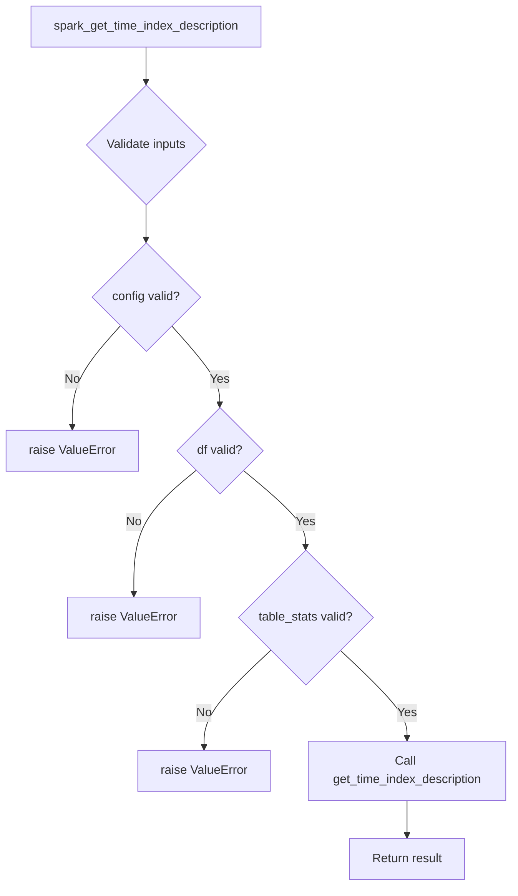

# `timeseries_index_spark.py`

## `src.ydata_profiling.model.spark.timeseries_index_spark.spark_get_time_index_description` · *function*

## Summary:
Returns a dictionary describing the time index properties of a Spark DataFrame for time series analysis.

## Description:
This function extracts and describes the time index characteristics from a Spark DataFrame, providing metadata about temporal ordering and frequency patterns. It serves as a Spark-specific implementation of time index analysis that integrates with the broader profiling framework.

The function is called during the time series profiling phase when analyzing temporal data patterns in Spark DataFrames. It acts as an adapter layer that bridges the generic time index analysis logic with Spark-specific data processing requirements.

## Args:
    config (Settings): Configuration object containing profiling settings and parameters
    df (DataFrame): Spark DataFrame to analyze for time index properties
    table_stats (dict): Pre-computed statistics about the DataFrame structure and content

## Returns:
    dict: A dictionary containing time index description metadata including temporal properties, frequency information, and ordering characteristics

## Raises:
    NotImplementedError: When the underlying implementation has not been properly implemented

## Constraints:
    Preconditions:
        - config must be a valid Settings object with appropriate time series configuration
        - df must be a valid PySpark DataFrame with proper schema
        - table_stats must contain pre-computed DataFrame metadata

    Postconditions:
        - Returns a dictionary with standardized time index description keys
        - All returned values are compatible with downstream time series analysis components

## Side Effects:
    None: This function is stateless and does not perform any I/O operations or external state mutations

## Control Flow:


## Examples:
```python
# Basic usage in Spark DataFrame profiling
config = Settings()
df = spark.createDataFrame([(1, '2023-01-01'), (2, '2023-01-02')], ['id', 'date'])
table_stats = {'nrows': 2, 'ncols': 2}

result = spark_get_time_index_description(config, df, table_stats)
print(result)  # Returns time index metadata dictionary
```

