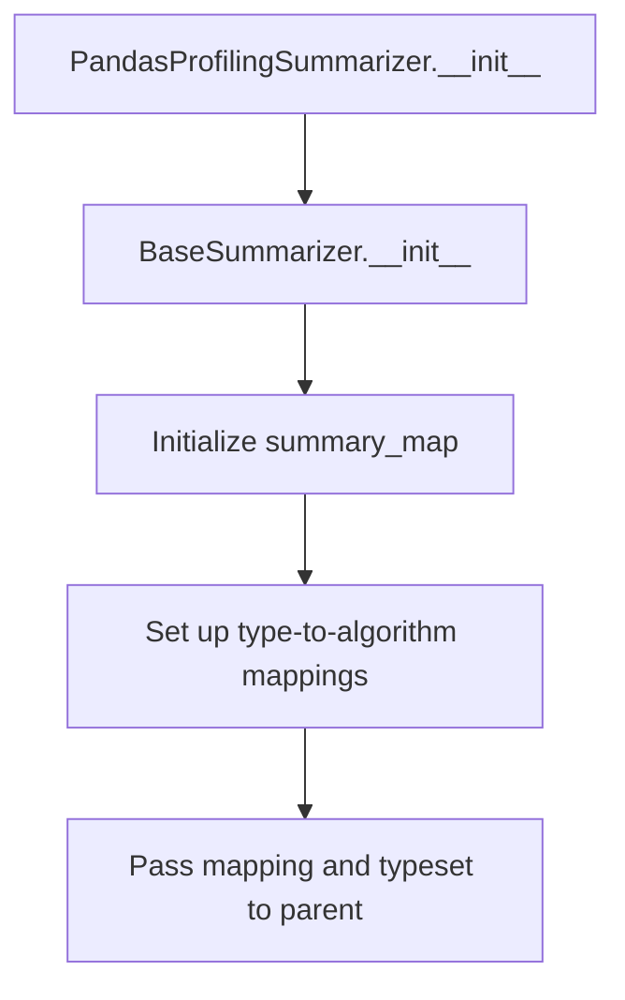

# `summarizer.py`

## `src.ydata_profiling.model.summarizer.BaseSummarizer` · *class*

## Summary:
Base class for summarizing data series by dispatching to type-specific summary algorithms.

## Description:
The BaseSummarizer class provides a standardized interface for generating statistical summaries of pandas Series data based on their inferred data types. It inherits from Handler and leverages its type-dispatching capabilities to apply appropriate summary algorithms. This class serves as the foundation for type-aware data profiling operations, ensuring that different data types are processed with their respective specialized algorithms.

The class is designed to be used in data profiling workflows where individual series need to be summarized according to their detected data types. It provides a clean interface for generating descriptive statistics by delegating to type-specific processing pipelines.

## State:
- Inherits all state from Handler class including:
  - mapping: Dict[str, List[Callable]] - Maps data type names to lists of functions for processing
  - typeset: VisionsTypeset - Contains type information and dependency relationships
- No additional instance attributes beyond those inherited from Handler

## Lifecycle:
- Creation: Instantiate with appropriate configuration and type mappings (handled by parent Handler class)
- Usage: Call summarize() method with a Settings config, pandas Series, and inferred data type
- Destruction: Relies on Python's garbage collection

## Method Map:
```mermaid
flowchart TD
    A[BaseSummarizer.summarize] --> B[Handler.handle]
    B --> C{Get functions for dtype}
    C --> D{Functions exist?}
    D -- Yes --> E[Compose functions with compose()]
    D -- No --> F[Empty composition]
    E --> G[Execute composed function with op(*args)]
    F --> G
    G --> H[Return summary dict]
```

## Raises:
- None explicitly raised by BaseSummarizer
- May propagate exceptions from Handler.handle() if invalid data types or function compositions occur
- May raise KeyError or TypeError if the type mapping is incomplete or inconsistent
- May raise exceptions from the underlying summary algorithms if they are not properly implemented

## Example:
```python
# Assuming proper initialization of Handler parent class with appropriate mappings
config = Settings()
series = pd.Series([1, 2, 3, 4, 5])
dtype = Integer  # Some VisionsBaseType subclass

# Generate summary for the series
summary = summarizer.summarize(config, series, dtype)
# Returns a dictionary with statistical summary for numeric data
```

### `src.ydata_profiling.model.summarizer.BaseSummarizer.summarize` · *method*

## Summary:
Generates a statistical summary for a pandas Series based on its inferred data type using the handler's type-specific processing pipeline.

## Description:
This method serves as the primary interface for generating descriptive statistics for a data series by delegating to the handler's type-specific processing pipeline. It takes a series and its inferred data type, converts the type to a string identifier, and uses the handler's internal mechanism to execute the appropriate summary algorithms. The method is part of the summarization workflow that produces detailed statistical descriptions for data profiling.

The method is designed to be called during the data profiling process when individual series need to be summarized according to their detected data types. It leverages the inheritance and composition mechanisms built into the Handler class to ensure that all necessary processing functions are applied in the correct order.

## Args:
    config (Settings): Configuration settings that control the summary generation process
    series (pd.Series): The pandas Series to be summarized
    dtype (Type[VisionsBaseType]): The inferred data type of the series, used to select appropriate summary algorithms

## Returns:
    dict: A dictionary containing the statistical summary of the series, with keys and values determined by the type-specific summary algorithm

## Raises:
    None explicitly raised.

## State Changes:
    Attributes READ: self.mapping, self.typeset (via handle method)
    Attributes WRITTEN: None

## Constraints:
    Preconditions:
    - The config parameter must be a valid Settings instance
    - The series parameter must be a valid pandas Series
    - The dtype parameter must be a valid VisionsBaseType subclass
    - The handler must be properly initialized with a valid mapping and typeset
    - The dtype string representation must correspond to a key in the handler's mapping
    
    Postconditions:
    - The method returns a dictionary containing the summary statistics
    - The returned dictionary structure depends on the specific summary algorithm for the given data type

## Side Effects:
    None.

## `src.ydata_profiling.model.summarizer.PandasProfilingSummarizer` · *class*

## Summary:
PandasProfilingSummarizer is a specialized summarizer that maps data types to their respective summary algorithms for pandas data profiling.

## Description:
This class implements a type-specific summarization strategy for pandas data profiling by defining mappings between data types and their corresponding summary algorithms. It inherits from BaseSummarizer and provides a concrete implementation of the summary mapping for various data types encountered in pandas datasets.

The class is designed to be used in data profiling workflows where individual series need to be summarized according to their detected data types. It ensures that different data types are processed with their respective specialized algorithms for generating descriptive statistics.

## State:
- Inherits all state from BaseSummarizer including:
  - mapping: Dict[str, List[Callable]] - Maps data type names to lists of functions for processing
  - typeset: VisionsTypeset - Contains type information and dependency relationships
- No additional instance attributes beyond those inherited from Handler

## Lifecycle:
- Creation: Instantiate with a VisionsTypeset object that defines the supported data types
- Usage: Call summarize() method with a Settings config, pandas Series, and inferred data type
- Destruction: Relies on Python's garbage collection

## Method Map:


## Raises:
- None explicitly raised by PandasProfilingSummarizer
- May propagate exceptions from BaseSummarizer.__init__() if invalid data types or function compositions occur
- May raise KeyError or TypeError if the type mapping is incomplete or inconsistent
- May raise exceptions from the underlying summary algorithms if they are not properly implemented

## Example:
```python
# Create a typeset with supported data types
typeset = VisionsTypeset()

# Initialize the summarizer with the typeset
summarizer = PandasProfilingSummarizer(typeset)

# The summarizer is now ready to process pandas Series
# with different data types using appropriate algorithms
```

### `src.ydata_profiling.model.summarizer.PandasProfilingSummarizer.__init__` · *method*

## Summary:
Initializes a PandasProfilingSummarizer with type-specific summary algorithm mappings and a Visions typeset.

## Description:
Configures the summarizer by establishing a mapping between data types and their corresponding summary algorithms, then initializes the parent Handler class with this mapping and the provided typeset. This method sets up the core infrastructure for type-aware data summarization in pandas profiling workflows.

The method creates a comprehensive mapping of data type names to lists of callable summary functions, ensuring that each supported data type has appropriate algorithms for generating descriptive statistics. This mapping is then passed to the parent Handler class for initialization, which handles the dependency resolution and function composition.

## Args:
    typeset (VisionsTypeset): A typeset object containing type definitions and dependency relationships for data type inference and handling.

## Returns:
    None: This method initializes the object's state and does not return a value.

## Raises:
    None explicitly raised by this method.
    May propagate exceptions from Handler.__init__() if the mapping or typeset contains invalid configurations.
    May raise KeyError or TypeError if the type mapping is incomplete or inconsistent.

## State Changes:
    Attributes READ: None
    Attributes WRITTEN: 
    - self.mapping: Set to the summary_map dictionary containing type-to-function mappings
    - self.typeset: Set to the provided typeset parameter

## Constraints:
    Preconditions:
    - The typeset parameter must be a valid VisionsTypeset instance
    - All callable functions in summary_map must be compatible with the Handler's expected interface
    - The summary_map dictionary must contain entries for all supported data types

    Postconditions:
    - The object's mapping attribute is initialized with the summary_map dictionary
    - The object's typeset attribute is set to the provided typeset
    - The parent Handler class is properly initialized with the configured mapping and typeset

## Side Effects:
    None: This method performs no I/O operations or external service calls.
    The method modifies the object's internal state by setting mapping and typeset attributes.

## `src.ydata_profiling.model.summarizer.format_summary` · *function*

## Summary:
Converts a summary object into a standardized dictionary format with properly formatted nested data structures.

## Description:
Transforms either a BaseDescription object or dictionary-based summary into a clean dictionary representation suitable for serialization or further processing. The function handles complex nested structures like pandas Series, numpy arrays, and tuples containing array data by converting them to JSON-compatible formats. This extraction allows for consistent data presentation regardless of the input format.

## Args:
    summary (Union[BaseDescription, dict]): Input summary data that can be either a BaseDescription instance or a dictionary containing summary information.

## Returns:
    dict: A dictionary representation of the summary with all nested data structures properly formatted for serialization.

## Raises:
    None explicitly raised.

## Constraints:
    Preconditions:
        - Input must be either a BaseDescription instance or a dictionary
        - All nested data structures within the summary must be compatible with the formatting logic
    
    Postconditions:
        - Output is always a dictionary
        - All pandas Series are converted to dictionaries
        - Tuples containing two numpy arrays are converted to dictionaries with "counts" and "bin_edges" keys
        - All other values remain unchanged

## Side Effects:
    None.

## Control Flow:
```mermaid
flowchart TD
    A[Start format_summary] --> B{Input is BaseDescription?}
    B -- Yes --> C[Convert to dict using asdict()]
    B -- No --> C
    C --> D[Apply fmt() to each key-value pair]
    D --> E[Return formatted dictionary]
    
    subgraph fmt_function
        F[Start fmt] --> G{Is dict?}
        G -- Yes --> H[Recursively apply fmt to values]
        G -- No --> I{Is pd.Series?}
        I -- Yes --> J[Convert to dict and recurse]
        I -- No --> K{Is tuple with 2 np.arrays?}
        K -- Yes --> L[Convert to counts/bin_edges dict]
        K -- No --> M[Return as-is]
    end
```

## Examples:
```python
# Example 1: With BaseDescription input
from ydata_profiling.model import BaseDescription
summary_obj = BaseDescription(...)
result = format_summary(summary_obj)

# Example 2: With dictionary input containing pandas Series
import pandas as pd
summary_dict = {
    "count": 100,
    "mean": 5.5,
    "series_data": pd.Series([1, 2, 3])
}
result = format_summary(summary_dict)

# Example 3: With tuple containing numpy arrays (histogram data)
import numpy as np
summary_dict = {
    "histogram": (np.array([1, 2, 3]), np.array([0, 1, 2, 3]))
}
result = format_summary(summary_dict)
```

## `src.ydata_profiling.model.summarizer._redact_column` · *function*

## Summary:
Redacts sensitive data fields in column summary dictionaries by replacing values with anonymized placeholders.

## Description:
This function processes column summary data structures to remove potentially sensitive information by replacing specific fields with redacted versions. It handles two categories of redaction: key-based redaction for dictionary keys and value-based redaction for dictionary values. The function is designed to be called internally during profile generation to ensure privacy compliance.

## Args:
    column (Dict[str, Any]): A dictionary containing column summary data with various statistical fields that may contain sensitive information.

## Returns:
    Dict[str, Any]: The modified column dictionary with specified fields redacted.

## Raises:
    None explicitly raised.

## Constraints:
    Preconditions:
    - Input column must be a dictionary
    - Fields to be redacted must exist in the column dictionary (though they may be missing)
    
    Postconditions:
    - All specified fields in keys_to_redact will have their keys replaced with REDACTED_X format
    - All specified fields in values_to_redact will have their values replaced with REDACTED_X format
    - Original column structure is preserved except for redacted fields

## Side Effects:
    None.

## Control Flow:
```mermaid
flowchart TD
    A[Start _redact_column] --> B[Process keys_to_redact fields]
    B --> C{Field exists in column?}
    C -- No --> D[Skip field]
    C -- Yes --> E{Values are dicts?}
    E -- Yes --> F[Apply redact_key to each dict value]
    E -- No --> G[Apply redact_key to flat values]
    F --> H[Update column[field]]
    G --> H
    H --> I[Next keys_to_redact field?]
    I -- No --> J[Process values_to_redact fields]
    I -- Yes --> C
    J --> K{Field exists in column?}
    K -- No --> L[Skip field]
    K -- Yes --> M{Values are dicts?}
    M -- Yes --> N[Apply redact_value to each dict value]
    M -- No --> O[Apply redact_value to flat values]
    N --> P[Update column[field]]
    O --> P
    P --> Q[Next values_to_redact field?]
    Q -- No --> R[Return column]
    Q -- Yes --> K
```

## Examples:
    Example usage:
    ```python
    column_data = {
        "first_rows": {"row1": "sensitive_data", "row2": "more_sensitive"},
        "value_counts_without_nan": {"a": 1, "b": 2}
    }
    redacted = _redact_column(column_data)
    # Result would have first_rows values replaced with REDACTED_0, REDACTED_1
    # and value_counts_without_nan keys replaced with REDACTED_0, REDACTED_1
    ```

## `src.ydata_profiling.model.summarizer.redact_summary` · *function*

## Summary:
Redacts sensitive information from categorical and text variable summaries based on configuration settings.

## Description:
Processes a summary dictionary to redact potentially sensitive data from categorical and text variables according to configured redaction policies. This function examines each variable in the summary and applies redaction to variables of type "Categorical" or "Text" when their respective redaction flags are enabled in the configuration.

## Args:
    summary (dict): A dictionary containing variable summaries with a "variables" key mapping to variable data
    config (Settings): Configuration object containing redaction settings for categorical and text variables

## Returns:
    dict: The modified summary dictionary with redacted variables (original reference is mutated and returned)

## Raises:
    None explicitly raised

## Constraints:
    Preconditions:
    - summary must contain a "variables" key with a dictionary value
    - config must be a valid Settings instance with proper nested configuration structure
    
    Postconditions:
    - Variables matching redaction criteria will have their data replaced with redacted versions
    - Non-matching variables remain unchanged
    - The original summary dictionary is modified in-place and returned

## Side Effects:
    None

## Control Flow:
```mermaid
flowchart TD
    A[Start redact_summary] --> B[Iterate over summary['variables']]
    B --> C{config.vars.cat.redact AND col['type'] == 'Categorical'?}
    C -- Yes --> D[Apply _redact_column to col]
    C -- No --> E{config.vars.text.redact AND col['type'] == 'Text'?}
    E -- Yes --> F[Apply _redact_column to col]
    E -- No --> G[Continue to next variable]
    D --> H[Update col in summary]
    F --> H
    H --> I[Next variable?]
    I -- No --> J[Return summary]
    I -- Yes --> B
```

## Examples:
    Basic usage with redaction enabled:
    ```python
    # Assuming config has vars.cat.redact = True and vars.text.redact = True
    summary = {
        "variables": {
            "category_col": {"type": "Categorical", "value_counts": {"A": 10, "B": 5}},
            "text_col": {"type": "Text", "first_rows": ["sensitive_data"]}
        }
    }
    redacted_summary = redact_summary(summary, config)
    # Both columns will have their sensitive data redacted
    ```

