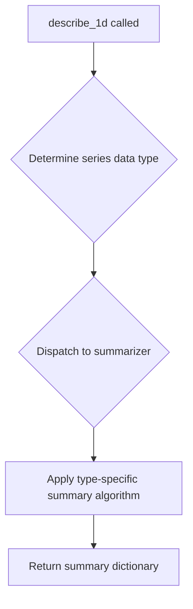
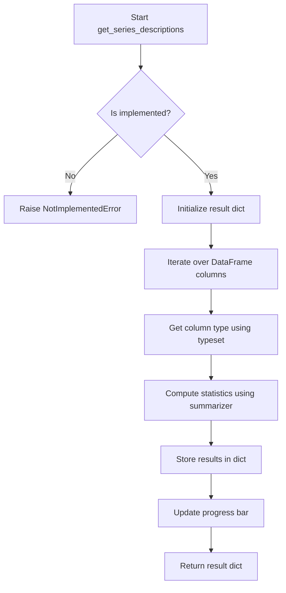

# `summary.py`

## `src.ydata_profiling.model.summary.describe_1d` · *function*

## Summary:
Generates a statistical summary for a single data series using type-aware summarization algorithms.

## Description:
The describe_1d function serves as the entry point for generating descriptive statistics for individual data series within a pandas DataFrame. It leverages type inference and specialized summarization algorithms to produce comprehensive statistical summaries tailored to the data type of each series. This function is part of the profiling pipeline that analyzes individual columns independently.

This logic is extracted into its own function to separate the concerns of data type inference and statistical summarization from the broader profiling workflow. It allows for modular processing of individual series while maintaining consistency with the type-aware approach used throughout the profiling system.

Based on the pattern established by BaseSummarizer.summarize(), this function is expected to:
1. Determine the appropriate data type for the input series using the provided typeset
2. Dispatch to the summarizer with the appropriate configuration and type information
3. Return a dictionary containing the statistical summary for that series

## Args:
- config (Settings): Configuration object containing profiling parameters and settings
- series (Any): Pandas Series object containing the data to be summarized
- summarizer (BaseSummarizer): Type-aware summarizer instance that applies appropriate algorithms based on data type
- typeset (VisionsTypeset): Type set instance that provides data type detection and classification capabilities

## Returns:
- dict: A dictionary containing statistical summary information for the input series, with keys and values determined by the specific summarization algorithm applied based on the series' data type

## Raises:
- NotImplementedError: Currently raised as the implementation is not yet completed

## Constraints:
- Preconditions: All arguments must be properly initialized and compatible with their expected types
- Postconditions: The returned dictionary structure depends on the specific summarization algorithm for the detected data type

## Side Effects:
- None explicitly documented
- May indirectly cause I/O or memory usage during summarization operations
- Depends on external libraries (visions, multimethod) for type detection and dispatch

## Control Flow:


## Examples:
```python
# Basic usage (implementation not yet complete)
config = Settings()
series = pd.Series([1, 2, 3, 4, 5])
summarizer = BaseSummarizer()
typeset = VisionsTypeset()

# This would eventually return a statistical summary
# summary = describe_1d(config, series, summarizer, typeset)
```

## `src.ydata_profiling.model.summary.get_series_descriptions` · *function*

## Summary:
Computes descriptive statistics and metadata for each series (column) in a DataFrame using configured summarization methods and type detection.

## Description:
This function is designed to analyze each column in a DataFrame and generate comprehensive descriptive statistics and metadata. It coordinates between the configuration settings, data summarization logic, type detection, and progress tracking to produce a structured summary for each series.

The function serves as a key component in data profiling workflows, aggregating information about individual columns including their data types, basic statistics, and other relevant characteristics. It is intended to be called during the profiling pipeline when detailed column-level analysis is required.

## Args:
- config (Settings): Configuration object containing profiling settings and options.
- df (Any): Input DataFrame to analyze.
- summarizer (BaseSummarizer): An instance implementing the BaseSummarizer interface for computing statistics.
- typeset (VisionsTypeset): Type detection framework used to infer column data types.
- pbar (tqdm): Progress bar instance for tracking analysis progress.

## Returns:
- dict: A dictionary mapping column names to their computed descriptive statistics and metadata.

## Raises:
- NotImplementedError: This function is not implemented yet and raises an exception when called.

## Constraints:
- Preconditions: All input arguments must be properly initialized and compatible with downstream processing.
- Postconditions: The returned dictionary contains entries for all columns in the input DataFrame.

## Side Effects:
- Updates the progress bar state during execution.
- May perform I/O operations during type inference or statistic computation.

## Control Flow:


## Examples:
Example usage would involve passing a properly configured Settings object, DataFrame, summarizer instance, typeset, and progress bar to obtain per-column descriptive statistics.

