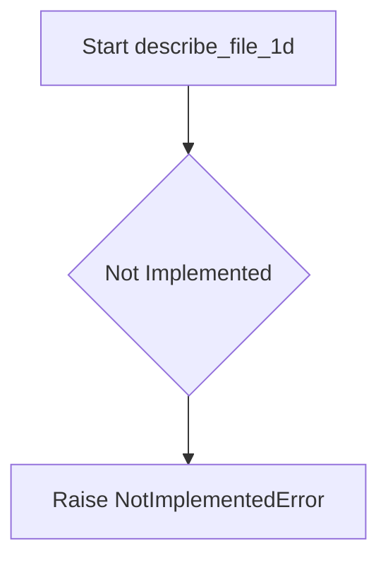
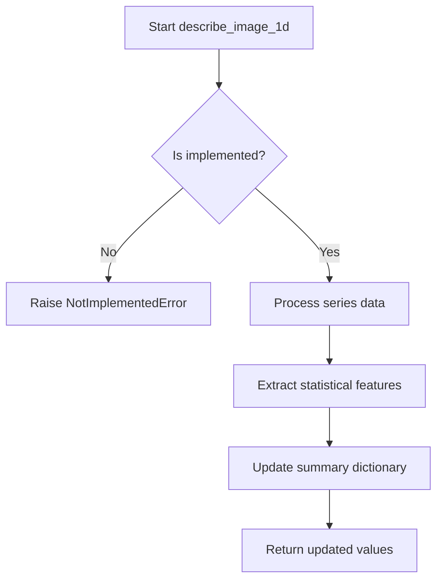
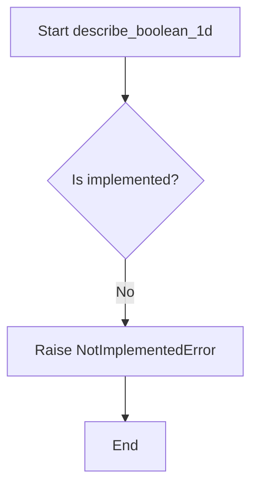
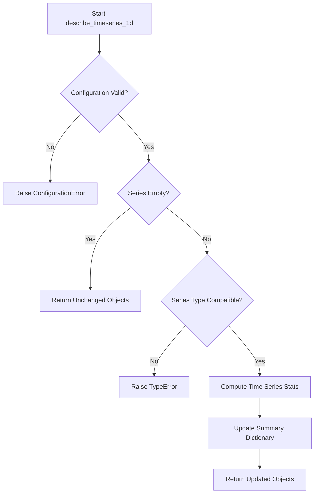

# `summary_algorithms.py`

## `src.ydata_profiling.model.summary_algorithms.func_nullable_series_contains` · *function*

## Summary:
Decorator that handles nullable series by removing NaN values before passing to the wrapped function.

## Description:
This decorator wraps a function that processes pandas Series data, automatically handling cases where the input series contains NaN values. It removes NaN values from the series before processing, and returns False if the resulting series would be empty after dropping NaN values.

The decorator extracts the common logic of handling nullable series into a reusable component, separating the concern of data cleaning from the core analysis logic. This promotes code reuse and ensures consistent handling of missing data across different analysis functions.

## Args:
    fn (Callable): The function to be wrapped, which should accept (config: Settings, series: pd.Series, state: dict, *args, **kwargs) and return a boolean value.

## Returns:
    Callable: A decorated version of the input function that handles nullable series appropriately.

## Raises:
    None explicitly raised by this decorator.

## Constraints:
    Preconditions:
    - The wrapped function must accept arguments in the form (config: Settings, series: pd.Series, state: dict, *args, **kwargs)
    - The series parameter must be a pandas Series object
    
    Postconditions:
    - If the input series contains only NaN values, the decorator returns False without calling the wrapped function
    - If the input series contains NaN values, they are removed before calling the wrapped function
    - The wrapped function's return value is returned unchanged

## Side Effects:
    None

## Control Flow:
```mermaid
flowchart TD
    A[func_nullable_series_contains called] --> B{series.hasnans?}
    B -- Yes --> C[series.dropna()]
    C --> D{series.empty?}
    D -- Yes --> E[return False]
    D -- No --> F[fn(config, series, state, *args, **kwargs)]
    B -- No --> G[fn(config, series, state, *args, **kwargs)]
    E --> H[return False]
    F --> H
    G --> H
```

## Examples:
```python
@func_nullable_series_contains
def my_analysis_function(config: Settings, series: pd.Series, state: dict) -> bool:
    # This function will receive a series without NaN values
    return len(series) > 0

# Usage:
result = my_analysis_function(config, pd.Series([1, 2, None, 4]), {})
# If series was [1, 2, None, 4], it becomes [1, 2, 4] before being passed to the function
```

## `src.ydata_profiling.model.summary_algorithms.histogram_compute` · *function*

## Summary:
Computes histogram statistics for a set of finite numerical values with configurable binning and weighting options.

## Description:
This function calculates histogram data for a given array of finite numerical values, applying configurable binning strategies and optional weights. It serves as a utility for generating histogram representations used in statistical profiling and data visualization. The function handles automatic bin selection based on configuration settings and ensures proper bin count management when exceeding maximum limits.

## Args:
    config (Settings): Configuration object containing plot settings, specifically histogram-related parameters like bin count and maximum bins.
    finite_values (np.ndarray): Array of finite numerical values to compute histogram for.
    n_unique (int): Number of unique values in the finite_values array, used for bin calculation logic.
    name (str, optional): Key name to store the computed histogram in the returned dictionary. Defaults to "histogram".
    weights (np.ndarray, optional): Weights for each value in finite_values. Must match the number of bins when provided. Defaults to None.

## Returns:
    dict: Dictionary containing the computed histogram under the specified key name. The histogram consists of two elements: bin edges and counts/frequencies.

## Raises:
    None explicitly raised in the function body.

## Constraints:
    Preconditions:
        - finite_values must be a numpy array of finite numerical values
        - n_unique must be a positive integer representing unique values count
        - config must be a valid Settings object with plot.histogram configuration
    Postconditions:
        - Returned dictionary contains exactly one key-value pair with the histogram data
        - Histogram data follows numpy.histogram format (bin_edges, counts)

## Side Effects:
    None.

## Control Flow:
```mermaid
flowchart TD
    A[Start histogram_compute] --> B{hist_config.bins == 0?}
    B -- Yes --> C[bins_arg = "auto"]
    B -- No --> D[bins_arg = min(hist_config.bins, n_unique)]
    C --> E[Calculate bins with np.histogram_bin_edges]
    D --> E
    E --> F{len(bins) > hist_config.max_bins?}
    F -- Yes --> G[Recalculate bins with max_bins]
    F -- No --> H[Proceed to histogram calculation]
    G --> I{weights provided and length matches max_bins?}
    I -- Yes --> J[Use weights]
    I -- No --> K[Set weights to None]
    J --> H
    K --> H
    H --> L[Calculate np.histogram]
    L --> M[Return stats dictionary]
```

## Examples:
    # Basic usage with default parameters
    config = Settings()
    values = np.array([1, 2, 2, 3, 3, 3])
    result = histogram_compute(config, values, 3)
    # Returns: {'histogram': (array([1., 2., 3., 4.]), array([1, 2, 3]))}
    
    # Usage with custom name and weights
    weights = np.array([1.0, 2.0, 3.0, 4.0, 5.0, 6.0])
    result = histogram_compute(config, values, 3, name="my_histogram", weights=weights)
    # Returns: {'my_histogram': (array([1., 2., 3., 4.]), array([1, 2, 3]))}

## `src.ydata_profiling.model.summary_algorithms.chi_square` · *function*

## Summary:
Computes the chi-square goodness-of-fit test statistic and p-value for a given dataset or histogram.

## Description:
Performs a chi-square goodness-of-fit test to assess whether the observed frequency distribution matches an expected uniform distribution. This function is commonly used in statistical profiling to evaluate the distribution characteristics of numerical data.

When raw values are provided, the function automatically computes an appropriate histogram using numpy's automatic bin selection. When a histogram is already available, it uses that directly. The result is returned as a dictionary containing the chi-square test statistic and p-value.

This function is extracted from the main profiling workflow to provide a reusable statistical utility that encapsulates the chi-square computation logic.

## Args:
    values (Optional[np.ndarray]): Array of raw numerical data values to analyze. Required if histogram is None.
    histogram (Optional[np.ndarray]): Pre-computed histogram frequencies. If provided, values parameter is ignored.

## Returns:
    dict: Dictionary containing the chi-square test results with keys:
        - statistic (float): The chi-square test statistic
        - pvalue (float): The p-value of the test

## Raises:
    None explicitly raised, but may raise exceptions from underlying scipy.stats.chisquare or numpy operations when invalid inputs are provided.

## Constraints:
    Preconditions:
        - If histogram is None, values must be provided and non-empty
        - values must be a valid numpy array if provided
        - histogram must be a valid numpy array if provided
        - Both values and histogram should contain numeric data
    
    Postconditions:
        - Returns a dictionary with exactly two keys: 'statistic' and 'pvalue'
        - Both returned values are numeric (float)

## Side Effects:
    None

## Control Flow:
```mermaid
flowchart TD
    A[Start chi_square] --> B{histogram is None?}
    B -- Yes --> C[Compute bins with np.histogram_bin_edges("auto")]
    C --> D[Compute histogram with np.histogram]
    D --> E[Call chisquare on histogram]
    E --> F[Return dict(chisquare()._asdict())]
    B -- No --> G[Call chisquare on histogram]
    G --> F
```

## Examples:
    # Analyzing raw data distribution
    values = np.array([1, 2, 2, 3, 3, 3, 4, 4, 4, 4])
    result = chi_square(values=values)
    print(f"Chi-square: {result['statistic']:.3f}, p-value: {result['pvalue']:.3f}")
    # Chi-square: 2.000, p-value: 0.368
    
    # Using pre-computed histogram
    histogram = np.array([1, 2, 3, 4])
    result = chi_square(histogram=histogram)
    print(f"Chi-square: {result['statistic']:.3f}, p-value: {result['pvalue']:.3f}")
    # Chi-square: 2.000, p-value: 0.368

## `src.ydata_profiling.model.summary_algorithms.series_hashable` · *function*

## Summary:
Decorator that conditionally executes a summary algorithm function only when a pandas Series is hashable.

## Description:
This function serves as a decorator that wraps summary algorithm functions to provide conditional execution based on whether a pandas Series is hashable. It prevents unnecessary computation when dealing with non-hashable data types that would cause errors in hash-based operations.

The decorator extracts the hashability check from individual algorithm implementations, creating a clean separation of concerns where hashability validation becomes a reusable cross-cutting concern rather than being duplicated across multiple summary algorithms.

## Args:
    fn (Callable[[Settings, pd.Series, dict], Tuple[Settings, pd.Series, dict]]): The summary algorithm function to be wrapped. This function takes configuration, a pandas Series, and a summary dictionary as inputs and returns a tuple of updated configuration, series, and summary.

## Returns:
    Callable[[Settings, pd.Series, dict], Tuple[Settings, pd.Series, dict]]: A decorated version of the input function that performs hashability checking before execution.

## Raises:
    None explicitly raised by this decorator - any exceptions come from the wrapped function fn.

## Constraints:
    Preconditions:
    - The input function fn must accept arguments in the form (Settings, pd.Series, dict) and return a tuple of (Settings, pd.Series, dict)
    - The summary dictionary must contain a key "hashable" with a boolean value
    - The summary dictionary must be mutable (as it may be modified by the wrapped function)

    Postconditions:
    - If summary["hashable"] is False, the original arguments are returned unchanged
    - If summary["hashable"] is True, the wrapped function fn is called with the original arguments
    - The returned tuple maintains the same structure as the wrapped function's return value

## Side Effects:
    None - This decorator itself has no side effects. However, the wrapped function fn may have side effects.

## Control Flow:
```mermaid
flowchart TD
    A[series_hashable decorator] --> B{summary["hashable"]}
    B -- False --> C[Return original args]
    B -- True --> D[Call wrapped function fn]
    D --> E[Return fn result]
    C --> F[End]
    E --> F
```

## Examples:
    Typical usage in a summary algorithm:
    ```python
    @series_hashable
    def calculate_unique_values(config: Settings, series: pd.Series, summary: dict) -> Tuple[Settings, pd.Series, dict]:
        # Implementation that assumes hashable data
        unique_count = series.nunique()
        summary['unique_values'] = unique_count
        return config, series, summary
    ```
    
    When applied to a non-hashable series:
    ```python
    # summary = {"hashable": False}
    # The function is skipped and original values returned unchanged
    ```
    
    When applied to a hashable series:
    ```python
    # summary = {"hashable": True}
    # The wrapped function executes normally
    ```

## `src.ydata_profiling.model.summary_algorithms.series_handle_nulls` · *function*

## Summary:
Decorator that preprocesses a pandas Series by removing null values before applying a summary function.

## Description:
This function is a decorator that wraps summary computation functions to handle missing data in pandas Series. It ensures that any function decorated with `series_handle_nulls` receives a clean series without null values, automatically dropping NaN entries when present. This extraction provides a standardized approach to null value handling across various summary computations.

## Args:
    fn (Callable[[Settings, pd.Series, dict], Tuple[Settings, pd.Series, dict]]): The summary computation function to be wrapped. This function should accept configuration settings, a pandas Series, and a summary dictionary, returning a tuple of updated settings, series, and summary.

## Returns:
    Callable[[Settings, pd.Series, dict], Tuple[Settings, pd.Series, dict]]: A wrapper function that processes the input series by removing null values before delegating to the original function.

## Raises:
    None explicitly raised by this decorator. Exceptions would originate from the wrapped function `fn`.

## Constraints:
    Preconditions:
    - The input `series` must be a valid pandas Series object.
    - The input `fn` must be callable with the signature (Settings, pd.Series, dict) -> (Settings, pd.Series, dict).
    
    Postconditions:
    - If the input series contains null values, they are removed before being passed to `fn`.
    - If the input series contains no null values, it is passed to `fn` unchanged.
    - The returned tuple maintains the same structure as the original function's return value.

## Side Effects:
    None. This function does not perform I/O operations or mutate external state.

## Control Flow:
```mermaid
flowchart TD
    A[series_handle_nulls decorator] --> B{series.hasnans?}
    B -- Yes --> C[series = series.dropna()]
    B -- No --> C
    C --> D[fn(config, series, summary)]
    D --> E[Return result]
```

## Examples:
```python
@series_handle_nulls
def compute_mean(config: Settings, series: pd.Series, summary: dict) -> Tuple[Settings, pd.Series, dict]:
    summary['mean'] = series.mean()
    return config, series, summary

# Usage
config = Settings()
series_with_nans = pd.Series([1, 2, None, 4])
summary = {}
config, processed_series, summary = compute_mean(config, series_with_nans, summary)
# processed_series will be [1, 2, 4] with mean computed and stored in summary
```

## `src.ydata_profiling.model.summary_algorithms.named_aggregate_summary` · *function*

## Summary:
Creates a dictionary of aggregate statistics (max, mean, median, min) for a given series with keys prefixed by a specified string.

## Description:
This function computes basic statistical measures for a pandas Series and returns them in a dictionary with prefixed keys. It is designed to be used in data profiling workflows where consistent naming conventions for aggregated statistics are required.

## Args:
    series (pandas.Series): Input pandas Series containing numeric data for statistical computation
    key (str): String prefix used to create the keys in the returned dictionary

## Returns:
    dict: Dictionary containing four key-value pairs with keys formatted as "max_{key}", "mean_{key}", "median_{key}", and "min_{key}" and their respective computed values. Values are numeric (float or int).

## Raises:
    None explicitly raised

## Constraints:
    Preconditions:
        - The input series must be a valid pandas Series object
        - The series should contain numeric data for meaningful statistical computation
    Postconditions:
        - The returned dictionary will always contain exactly four keys with the specified naming pattern
        - All computed values will be numeric (float or int)

## Side Effects:
    None

## Control Flow:
```mermaid
flowchart TD
    A[Start named_aggregate_summary] --> B[Initialize summary dict]
    B --> C[Compute max_{key}]
    C --> D[Compute mean_{key}]
    D --> E[Compute median_{key}]
    E --> F[Compute min_{key}]
    F --> G[Return summary dict]
```

## Examples:
    >>> import pandas as pd
    >>> import numpy as np
    >>> series = pd.Series([1, 2, 3, 4, 5])
    >>> result = named_aggregate_summary(series, "value")
    >>> print(result)
    {'max_value': 5, 'mean_value': 3.0, 'median_value': 3, 'min_value': 1}
    
    >>> # With NaN values
    >>> series_with_nan = pd.Series([1, 2, np.nan, 4, 5])
    >>> result = named_aggregate_summary(series_with_nan, "test")
    >>> print(result)
    {'max_test': 5.0, 'mean_test': 3.0, 'median_test': 3.0, 'min_test': 1.0}

## `src.ydata_profiling.model.summary_algorithms.describe_counts` · *function*

## Summary:
Computes and updates statistical summaries for count-based data series, including frequency distributions and categorical statistics.

## Description:
This function processes a data series to generate descriptive statistics specifically tailored for count or categorical data. It calculates various summary metrics such as value counts, frequencies, and statistical measures like chi-square tests for independence. The function integrates these computed values into an existing summary dictionary and returns updated configuration, series, and summary data.

The function is designed to handle different data types appropriately, particularly focusing on count-based analysis. It serves as part of a larger profiling pipeline where detailed statistical summaries are generated for data exploration and validation purposes.

## Args:
    config (Settings): Configuration object containing settings for the profiling process.
    series (Any): Input data series to be analyzed, which can be of various types including pandas Series, numpy arrays, or other iterable objects.
    summary (dict): Dictionary containing existing summary statistics that will be updated with new computed values.

## Returns:
    Tuple[Settings, Any, dict]: A tuple containing the updated configuration object, the processed series, and the updated summary dictionary with newly computed statistics.

## Raises:
    NotImplementedError: This function currently raises a NotImplementedError indicating that the implementation is pending.

## Constraints:
    Preconditions:
        - The config parameter must be a valid Settings object.
        - The series parameter should be compatible with statistical operations.
        - The summary parameter must be a mutable dictionary that can accept new key-value pairs.
    
    Postconditions:
        - The returned summary dictionary will contain updated statistical entries related to count data.
        - The returned series will remain unchanged or be appropriately transformed for further processing.
        - The config object will be returned unmodified.

## Side Effects:
    None: This function does not perform any I/O operations or mutate external state beyond updating the summary dictionary.

## Control Flow:
```mermaid
flowchart TD
    A[Start describe_counts] --> B{Check series type}
    B -->|Categorical/Count Data| C[Compute value counts]
    B -->|Other Data Types| D[Apply appropriate transformation]
    C --> E[Calculate frequencies]
    D --> E
    E --> F[Perform chi-square test if applicable]
    F --> G[Update summary dictionary]
    G --> H[Return (config, series, summary)]
```

## Examples:
```python
# Example usage (conceptual)
config = Settings()
series = pd.Series([1, 2, 2, 3, 3, 3])
summary = {}
updated_config, updated_series, updated_summary = describe_counts(config, series, summary)
```

## `src.ydata_profiling.model.summary_algorithms.describe_supported` · *function*

## Summary:
Abstract base function that determines if a statistical description algorithm is supported for a given data series and configures the appropriate settings for profiling.

## Description:
This function serves as an abstract interface that must be implemented by concrete profiling algorithms to determine whether they can process a given data series with the provided configuration. It acts as a dispatcher that selects the appropriate statistical analysis approach based on data type and configuration settings.

Known callers within the codebase:
- Called by the profiling framework's series description pipeline during data analysis
- Triggered when determining which statistical methods to apply to individual data columns
- Invoked during the preprocessing phase of the profiling workflow

This logic is extracted into its own function rather than being inlined because it provides a standardized interface for different data type handlers to implement their own support checking and configuration logic. This enables polymorphic behavior where different implementations can handle different data types appropriately.

## Args:
    config (Settings): Configuration object containing profiling settings and parameters that influence algorithm selection
    series (Any): The data series to be analyzed, which can be of various types (pandas Series, numpy array, etc.) 
    series_description (dict): Dictionary containing metadata about the series being described, including type information and existing statistics

## Returns:
    Tuple[Settings, Any, dict]: A tuple containing:
    - Updated configuration object (potentially modified based on data characteristics)
    - The processed series (potentially converted or validated)
    - Updated series description dictionary (with additional metadata or modifications)

## Raises:
    NotImplementedError: Always raised as this is an abstract base function that must be overridden by concrete implementations

## Constraints:
    Preconditions:
    - config must be a valid Settings object with properly initialized configuration
    - series must be a valid data structure that can be processed by profiling algorithms
    - series_description must be a dictionary with appropriate metadata keys
    
    Postconditions:
    - The returned tuple maintains the same structure regardless of implementation
    - The function must be overridden in concrete implementations to provide actual functionality

## Side Effects:
    None

## Control Flow:
```mermaid
flowchart TD
    A[describe_supported called] --> B{Implementation exists?}
    B -- No --> C[Raise NotImplementedError]
    B -- Yes --> D[Validate config against series]
    D --> E[Check series compatibility]
    E --> F[Configure processing parameters]
    F --> G[Process series data]
    G --> H[Update series description]
    H --> I[Return (config, series, series_description)]
```

## Examples:
    This function is intended to be overridden by concrete implementations such as:
    
    ```python
    # Example of how a concrete implementation might work
    def describe_supported(config, series, series_description):
        # Check if this implementation supports the series type
        if isinstance(series, pd.Series):
            # Configure settings for pandas Series
            updated_config = config.copy()
            # Process the series
            processed_series = series
            # Update description with additional metadata
            updated_description = series_description.copy()
            return (updated_config, processed_series, updated_description)
        else:
            raise NotImplementedError("Unsupported series type")
    ```

## `src.ydata_profiling.model.summary_algorithms.describe_generic` · *function*

## Summary:
Generic handler for computing descriptive statistics on data series, serving as a base implementation for type-specific summary algorithms in the YData Profiling framework.

## Description:
This function serves as the base implementation for computing descriptive statistics on data series within the YData Profiling system. As an abstract base function marked with `NotImplementedError()`, it is intended to be overridden by specialized implementations for specific data types (numeric, categorical, datetime, etc.) through a multimethod dispatch system.

The function follows a standardized interface pattern where configuration settings, data series, and summary dictionaries are processed and returned with updated information. It forms part of a polymorphic architecture where the appropriate specialized implementation is automatically selected based on the data type of the input series.

## Args:
    config (Settings): Configuration settings object containing profiling parameters and options that control the analysis behavior.
    series (Any): The data series to be summarized, which can be of various types (numeric, categorical, datetime, etc.). The specific type determines which specialized implementation will be invoked.
    summary (dict): Dictionary containing existing summary statistics that will be updated with new computed values for the given data type.

## Returns:
    Tuple[Settings, Any, dict]: A tuple containing:
        - Updated configuration object (typically unchanged unless transformations are required)
        - Processed data series (may be validated, transformed, or normalized)
        - Updated summary dictionary with new statistical information relevant to the data type

## Raises:
    NotImplementedError: This base implementation raises NotImplementedError to indicate that specific implementations must override this function for particular data types. The actual implementation is provided by specialized functions decorated with multimethod decorators.

## Constraints:
    Preconditions:
        - config must be a valid Settings object with appropriate profiling configurations
        - series should be compatible with the intended processing logic for the specific implementation
        - summary must be a mutable dictionary object that can accept new key-value pairs
    
    Postconditions:
        - The returned tuple maintains the same structure as the input arguments
        - The summary dictionary will contain updated statistical information relevant to the data type
        - The configuration and series objects are returned unchanged unless transformation is required

## Side Effects:
    None: This function does not perform any I/O operations or mutate external state directly. All processing occurs in-memory.

## Control Flow:
```mermaid
flowchart TD
    A[describe_generic called] --> B{Data type determined?}
    B -->|Yes| C[Dispatch to specific multimethod implementation]
    B -->|No| D[Use generic fallback processing]
    C --> E[Invoke specialized handler for data type]
    D --> E
    E --> F[Compute statistics for series type]
    F --> G[Update summary dictionary with results]
    G --> H[Return (config, series, updated_summary)]
```

## Examples:
This function is typically called internally by the profiling system when processing different data types. For instance, when profiling a numeric column, the system would dispatch to a numeric-specific implementation like `describe_numeric`, while categorical columns would use `describe_categorical`.

Example usage within the profiling pipeline:
```python
# This would be called internally by the profiling system
config, series, summary = describe_generic(settings, numeric_series, summary_dict)
```

Users should not call this function directly, but rather rely on the multimethod dispatch system to route to the appropriate specialized implementation based on the data type.

## `src.ydata_profiling.model.summary_algorithms.describe_numeric_1d` · *function*

## Summary:
Placeholder function for computing descriptive statistics for a single numeric data series in data profiling workflows.

## Description:
This function is intended to compute descriptive statistics for a single numeric data series and update the summary dictionary with the results. It follows the same pattern as other describe_* functions in the module and is designed to be part of a multimethod dispatch system for handling different data types. Currently, it raises NotImplementedError as the implementation is pending.

The function is part of a profiling framework that analyzes data series and builds comprehensive summary statistics. It accepts configuration settings, a data series, and an existing summary dictionary, then returns updated values while maintaining consistency with the broader profiling architecture.

## Args:
    config (Settings): Configuration object containing profiling settings and parameters
    series (Any): Input data series to be analyzed (typically a pandas Series or numpy array containing numeric data)
    summary (dict): Dictionary to be updated with computed statistics and metadata about the numeric series

## Returns:
    Tuple[Settings, Any, dict]: Returns the unchanged config, the unchanged series, and the updated summary dictionary

## Raises:
    NotImplementedError: Always raises this exception indicating that the implementation is not yet completed

## Constraints:
    Preconditions:
        - config must be a valid Settings object
        - series must be a valid data structure that can be processed numerically
        - summary must be a mutable dictionary object
    
    Postconditions:
        - The function does not modify the input series or config objects
        - The summary dictionary would contain updated statistical information about the numeric series (once implemented)

## Side Effects:
    - None: This function does not perform any I/O operations or mutate external state beyond returning updated values

## Control Flow:
```mermaid
flowchart TD
    A[Start describe_numeric_1d] --> B{Is implementation complete?}
    B -- No --> C[Raise NotImplementedError]
    B -- Yes --> D[Process numeric series]
    D --> E[Compute statistics]
    E --> F[Update summary dict]
    F --> G[Return (config, series, summary)]
```

## Examples:
    Not applicable: Function raises NotImplementedError and is not intended for direct use

## `src.ydata_profiling.model.summary_algorithms.describe_text_1d` · *function*

## Summary:
Processes and summarizes text data for univariate statistical profiling.

## Description:
This function implements a specialized algorithm for analyzing text-based data series in one-dimensional statistical profiling. It follows the same architectural pattern as other describe_* functions in the profiling system (such as `describe_numeric_1d` and `describe_categorical_1d`) and is designed to be part of a multimethod dispatch system for handling different data types.

The function is intended to compute descriptive statistics for a single text data series and update the summary dictionary with the results. It accepts configuration settings, a data series, and an existing summary dictionary, then returns updated values while maintaining consistency with the broader profiling architecture.

Currently, this function raises NotImplementedError as the implementation is pending, indicating it's a placeholder for future development of text analysis capabilities in the profiling framework.

This logic is extracted into its own function to maintain clean separation of concerns, allowing text-specific processing to be handled independently from other data types while ensuring consistency with the overall profiling architecture.

## Args:
    config (Settings): Configuration object containing profiling settings and parameters
    series (Any): Input data series containing text values to be analyzed (typically a pandas Series or similar structure)
    summary (dict): Dictionary to be updated with computed statistics and metadata about the text series

## Returns:
    Tuple[Settings, Any, dict, Any]: A tuple containing:
        - Updated configuration object (unchanged in current implementation)
        - Processed data series (unchanged in current implementation)  
        - Modified summary dictionary (to be updated with text statistics once implemented)
        - Additional metadata or results from text analysis (to be defined once implemented)

## Raises:
    NotImplementedError: Always raises this exception indicating that the implementation is not yet completed

## Constraints:
    Preconditions:
        - config must be a valid Settings object
        - series must be compatible with text data processing operations
        - summary must be a mutable dictionary object
    
    Postconditions:
        - The function does not modify the input series or config objects
        - The summary dictionary would contain updated statistical information about the text series (once implemented)

## Side Effects:
    - None: This function does not perform any I/O operations or mutate external state beyond returning updated values

## Control Flow:
```mermaid
flowchart TD
    A[Start describe_text_1d] --> B{Is implementation complete?}
    B -- No --> C[Raise NotImplementedError]
    B -- Yes --> D[Process text series]
    D --> E[Compute text statistics]
    E --> F[Update summary dict]
    F --> G[Return (config, series, summary, metadata)]
```

## Examples:
None: Function raises NotImplementedError and is not intended for direct use.

## `src.ydata_profiling.model.summary_algorithms.describe_date_1d` · *function*

## Summary:
Placeholder function for computing descriptive statistics for date-type series in data profiling workflows.

## Description:
This function serves as a placeholder for computing descriptive statistics specifically for date/datetime data series. It follows the same pattern as other describe_* functions in the module and is designed to be part of a multimethod dispatch system for handling different data types. The function is part of the profiling framework's architecture for processing various data types uniformly.

## Args:
    config (Settings): Configuration object containing profiling settings and parameters.
    series (Any): Input data series containing date/datetime values to be analyzed.
    summary (dict): Dictionary to be updated with computed statistics for the series.

## Returns:
    Tuple[Settings, Any, dict]: Returns the unchanged config, the unchanged series, and the updated summary dictionary.

## Raises:
    NotImplementedError: Always raises this exception indicating that the implementation is not yet completed.

## Constraints:
    Preconditions: 
    - The series parameter should contain date/datetime values
    - The summary parameter should be a mutable dictionary
    - Config should be a valid Settings object
    
    Postconditions:
    - The summary dictionary will be modified to include date-specific statistics (when implemented)
    - The function does not alter the config or series parameters

## Side Effects:
    - Modifies the input summary dictionary in-place
    - No external I/O operations or state mutations

## Control Flow:
```mermaid
flowchart TD
    A[Start describe_date_1d] --> B{Is implementation complete?}
    B -- No --> C[Raise NotImplementedError]
    C --> D[Return (config, series, summary)]
```

## Examples:
    This function is typically called internally by the profiling framework when processing date-type columns. Example usage would be:
    
    ```python
    # This would be called by the framework automatically
    config = Settings()
    date_series = pd.Series(['2020-01-01', '2020-01-02'])
    summary = {}
    result = describe_date_1d(config, date_series, summary)
    ```

## `src.ydata_profiling.model.summary_algorithms.describe_categorical_1d` · *function*

## Summary:
Placeholder function for computing descriptive statistics for a single categorical data series in data profiling workflows.

## Description:
This function is intended to compute descriptive statistics for a single categorical data series and update the summary dictionary with the results. It follows the same pattern as other describe_* functions in the module and is designed to be part of a multimethod dispatch system for handling different data types. Currently, it raises NotImplementedError as the implementation is pending.

## Args:
    config (Settings): Configuration object containing profiling settings and parameters
    series (pd.Series): A pandas Series containing categorical data to be described
    summary (dict): Dictionary to be updated with computed statistics and metadata about the categorical series

## Returns:
    Tuple[Settings, pd.Series, dict]: Returns the unchanged config, the unchanged series, and the updated summary dictionary

## Raises:
    NotImplementedError: Always raises this exception indicating that the implementation is not yet completed

## Constraints:
    Preconditions:
        - config must be a valid Settings object
        - series must be a pandas Series with categorical data
        - summary must be a mutable dictionary object
    
    Postconditions:
        - The function does not modify the input series or config objects
        - The summary dictionary would contain updated statistical information about the categorical series (once implemented)

## Side Effects:
    - None: This function does not perform any I/O operations or mutate external state beyond updating the summary dictionary

## Control Flow:
```mermaid
flowchart TD
    A[Start describe_categorical_1d] --> B{Is implementation complete?}
    B -- No --> C[Raise NotImplementedError]
    C --> D[Return (config, series, summary)]
```

## Examples:
    Not applicable: Function raises NotImplementedError and is not intended for direct use

## `src.ydata_profiling.model.summary_algorithms.describe_url_1d` · *function*

## Summary:
Placeholder function for URL data analysis in 1D data series profiling.

## Description:
This function is a placeholder for implementing URL-specific statistical analysis for 1D data series within the automated data profiling framework. It follows the established pattern of summary algorithms that process configuration, data series, and summary statistics to generate enhanced profiling information.

When implemented, this function would analyze URL patterns, extract structural components (such as domains, paths, protocols), and compute relevant statistical measures for URL data. It is designed to work as part of a multimethod dispatch system that applies appropriate analysis based on data type.

## Args:
    config (Settings): Configuration object containing profiling settings and parameters
    series (Any): Input data series containing URL data to be analyzed
    summary (dict): Dictionary containing existing summary statistics that will be extended

## Returns:
    Tuple[Settings, Any, dict]: A tuple containing:
        - Updated configuration object
        - Processed data series (potentially modified or normalized)
        - Extended summary dictionary with URL-specific statistics

## Raises:
    NotImplementedError: This function is not yet implemented and raises this exception when called

## Constraints:
    Preconditions:
        - config must be a valid Settings object
        - series should contain URL data or be convertible to URL format
        - summary should be a mutable dictionary object
    
    Postconditions:
        - When implemented, function would return a properly formatted tuple
        - The returned summary would contain URL-specific statistical information such as domain distribution, protocol frequency, path complexity metrics, etc.

## Side Effects:
    None: This function does not perform any I/O operations or external state mutations in its current implementation

## Control Flow:
```mermaid
flowchart TD
    A[Start describe_url_1d] --> B{Is implemented?}
    B -- No --> C[Raise NotImplementedError]
    B -- Yes --> D[Process config]
    D --> E[Analyze URL series]
    E --> F[Extract URL components]
    F --> G[Compute URL statistics]
    G --> H[Update summary stats]
    H --> I[Return (config, series, summary)]
```

## Examples:
    Not applicable: Function is not implemented and raises NotImplementedError

## `src.ydata_profiling.model.summary_algorithms.describe_file_1d` · *function*

## Summary:
Computes descriptive statistics for a single data series and updates the summary dictionary with the results.

## Description:
This function is designed to compute descriptive statistics for a single data series within a file as part of the data profiling process. It takes configuration settings, a data series, and a summary dictionary, and returns updated versions of these parameters. Based on the function signature and naming convention, it appears to be part of a data profiling pipeline that processes individual series to generate statistical summaries. The function is currently unimplemented and raises NotImplementedError.

## Args:
    config (Settings): Configuration settings object containing profiling parameters.
    series (Any): The data series to be described, typically a pandas Series or similar.
    summary (dict): Dictionary containing existing summary statistics to be updated.

## Returns:
    Tuple[Settings, Any, dict]: A tuple containing the updated config, series, and summary dictionary.

## Raises:
    NotImplementedError: Always raised as the function is not yet implemented.

## Constraints:
    - Preconditions: The config parameter must be a valid Settings object, series must be a valid data structure, and summary must be a dictionary.
    - Postconditions: None, as the function is not implemented.

## Side Effects:
    - None, as the function is not implemented.

## Control Flow:


## Examples:
    - This function would typically be called during data profiling to compute statistics for individual columns in a dataset.
    - Example usage would involve passing a Settings object, a pandas Series, and an existing summary dictionary.

## `src.ydata_profiling.model.summary_algorithms.describe_path_1d` · *function*

## Summary:
Computes descriptive statistics for a 1D data path using multimethod dispatch, returning updated configuration, processed series, and extended summary dictionary.

## Description:
This function serves as a multimethod dispatcher for computing descriptive statistics on 1-dimensional data paths within the profiling framework. It leverages the multimethod decorator to enable type-specific implementations for different data types while maintaining a consistent interface.

The function is designed to be overridden by specific implementations that handle different data types or structures. It acts as a central entry point that routes execution to appropriate specialized handlers based on the input data characteristics. The multimethod approach allows for flexible extension of profiling capabilities across various data types without modifying the core logic.

## Args:
    config (Settings): Configuration settings object that controls the profiling behavior and parameters.
    series (Any): Input data series that needs to be described; can be of various types (pandas Series, numpy array, etc.).
    summary (dict): Existing summary dictionary that will be extended with computed statistics.

## Returns:
    Tuple[Settings, Any, dict]: A tuple containing:
        - Updated Settings object (potentially modified based on processing)
        - Processed series data (possibly transformed or filtered)
        - Extended summary dictionary with additional statistical information

## Raises:
    NotImplementedError: Raised by the base implementation, indicating that specific multimethod implementations must be provided for different data types.

## Constraints:
    Preconditions:
        - config must be a valid Settings instance
        - series should be compatible with the intended data processing logic
        - summary must be a mutable dictionary that can accept new key-value pairs
    
    Postconditions:
        - The returned tuple maintains the expected structure and types
        - The summary dictionary will contain additional entries based on the data analysis

## Side Effects:
    None: This function does not perform any I/O operations or mutate external state directly.

## Control Flow:
```mermaid
flowchart TD
    A[Start describe_path_1d] --> B{Multimethod dispatch}
    B --> C[Route to specific implementation]
    C --> D{Implementation exists?}
    D -- No --> E[Raise NotImplementedError]
    D -- Yes --> F[Execute type-specific logic]
    F --> G[Update config, series, summary]
    G --> H[Return (config, series, summary)]
```

## Examples:
```python
# This function is meant to be overridden by specific implementations
# Example usage pattern (conceptual):
config = Settings()
series = pd.Series([1, 2, 3, 4, 5])
summary = {}

# Specific implementation would be called based on series type
# Result would contain updated config, processed series, and extended summary
```

## `src.ydata_profiling.model.summary_algorithms.describe_image_1d` · *function*

## Summary:
Placeholder function for analyzing and summarizing 1D image data series with statistical features and metadata.

## Description:
This function is intended to process 1D image data series to compute descriptive statistics and metadata that characterize image properties. It serves as part of the profiling pipeline for image data analysis, extracting meaningful numerical representations from image data arrays.

The function is currently not implemented and raises a NotImplementedError when called. It is designed to handle various image data formats and extract relevant statistical measures for data quality assessment, anomaly detection, and pattern recognition in image datasets.

## Args:
    config (Settings): Configuration object containing profiling settings and parameters
    series (Any): Input data series representing 1D image data, typically a numpy array or similar structure
    summary (dict): Dictionary containing existing summary statistics that will be updated with new findings

## Returns:
    Tuple[Settings, Any, dict]: A tuple containing the updated configuration, processed series data, and extended summary dictionary with new statistical information

## Raises:
    NotImplementedError: This function is not yet implemented and raises an exception when called

## Constraints:
    Preconditions:
        - The config parameter must be a valid Settings object
        - The series parameter should represent valid 1D image data
        - The summary parameter must be a mutable dictionary

    Postconditions:
        - The returned tuple maintains the same structure as the input
        - The summary dictionary will contain additional statistical entries

## Side Effects:
    None: This function does not perform any I/O operations or external state mutations

## Control Flow:


## Examples:
    Not applicable: Function is not implemented

## `src.ydata_profiling.model.summary_algorithms.describe_boolean_1d` · *function*

## Summary:
Computes descriptive statistics for a boolean data series and updates the summary dictionary with the results.

## Description:
This function processes a boolean data series to calculate various statistical measures and updates the provided summary dictionary with these metrics. It serves as a specialized algorithm for handling boolean data types within the profiling framework. The function follows the same pattern as other describe_* functions in the module (like describe_numeric_1d and describe_categorical_1d) and is intended to be part of a multimethod dispatch system for different data types.

## Args:
    config (Settings): Configuration object containing profiling settings and parameters
    series (Any): Input data series containing boolean values to be analyzed
    summary (dict): Dictionary to be updated with computed statistical metrics

## Returns:
    Tuple[Settings, Any, dict]: A tuple containing the configuration object, the processed series, and the updated summary dictionary

## Raises:
    NotImplementedError: This function is not yet implemented and always raises this exception

## Constraints:
    Preconditions: 
    - config must be a valid Settings object
    - series should contain boolean values or be convertible to boolean
    - summary must be a mutable dictionary object
    
    Postconditions:
    - The summary dictionary will be modified in-place to include boolean-specific statistics
    - The returned tuple maintains the original configuration and series objects

## Side Effects:
    None

## Control Flow:


## Examples:
    Not applicable due to NotImplementedError

## `src.ydata_profiling.model.summary_algorithms.describe_timeseries_1d` · *function*

## Summary:
Computes comprehensive descriptive statistics and temporal characteristics for univariate time series data.

## Description:
This function implements a specialized algorithm for analyzing single-dimensional time series data within the ydata-profiling framework. It processes time-ordered data series according to configuration settings and enriches the summary dictionary with temporal and statistical properties specific to time series analysis.

The function is designed to be part of a modular profiling system where different data types are handled by specialized algorithms. It follows a consistent interface pattern with other summary algorithms in the module, accepting configuration parameters, a data series, and an existing summary dictionary, then returning updated versions of these objects.

As a placeholder implementation, this function currently raises NotImplementedError to indicate that the full implementation is pending. When properly implemented, it would compute metrics such as trend analysis, seasonality indicators, autocorrelation statistics, and other time series-specific characteristics.

## Args:
    config (Settings): Configuration object containing profiling settings and parameters that control the analysis behavior, including time series-specific options
    series (Any): The univariate time series data to be analyzed, typically a pandas Series with datetime index or numeric values ordered chronologically
    summary (dict): Dictionary containing existing summary statistics that will be augmented with time series-specific metrics and characteristics

## Returns:
    Tuple[Settings, Any, dict]: A tuple containing:
        - Updated configuration object (if any settings were modified during processing)
        - Processed series data (potentially transformed or filtered)
        - Updated summary dictionary with new time series statistics added

## Raises:
    NotImplementedError: Always raised by this function as it is not yet implemented

## Constraints:
    Preconditions:
        - config must be a valid Settings object with appropriate time series configuration parameters
        - series should be compatible with time series analysis operations (time-ordered, numeric values)
        - summary should be a mutable dictionary that can accept new key-value pairs
    
    Postconditions:
        - When implemented, the returned summary dictionary will contain new entries related to time series characteristics
        - The function signature maintains consistency with other summary algorithms in the module
        - The function should gracefully handle edge cases like empty series, missing values, or irregular time intervals

## Side Effects:
    None: This function does not perform any I/O operations or mutate external state beyond returning updated objects

## Control Flow:


## Examples:
None: The function is not yet implemented, so no usage examples can be provided at this time.
```

