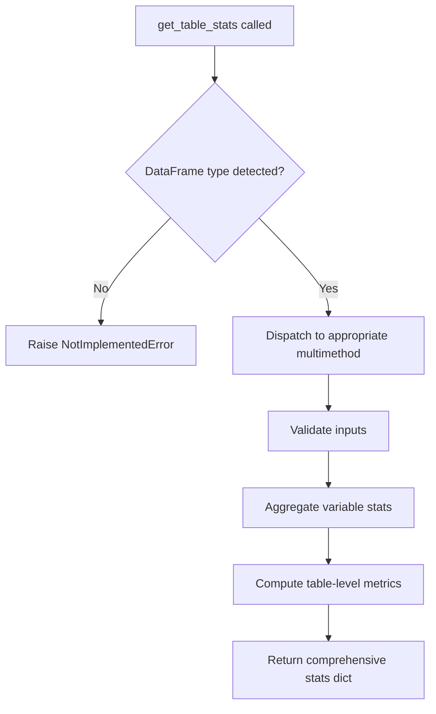

# `table.py`

## `src.ydata_profiling.model.table.get_table_stats` · *function*

## Summary:
Computes comprehensive table-level statistical summaries for data profiling, with specialized implementations for different DataFrame types.

## Description:
This function serves as the entry point for computing table-level statistics in the ydata-profiling library. As a multimethod, it provides a unified interface that dispatches to specialized implementations based on the type of DataFrame provided. The function aggregates information from configuration settings, the input DataFrame, and pre-computed variable statistics to generate a structured summary of table characteristics.

The separation into a dedicated function allows for clean abstraction of table-level computation logic while enabling different implementations for various data structures (e.g., pandas DataFrames, Polars DataFrames) through the multimethod mechanism.

## Args:
    config (Settings): Configuration object containing profiling settings that influence how statistics are computed and reported.
    df (Any): Input DataFrame or data structure to analyze. The specific type determines which multimethod implementation is invoked.
    variable_stats (dict): Dictionary containing pre-computed statistics for individual variables/columns within the DataFrame.

## Returns:
    dict: A dictionary containing table-level statistical information including but not limited to: data shape, data types, missing values summary, and other aggregate metrics relevant to the entire dataset.

## Raises:
    NotImplementedError: Raised by the base implementation when no specific multimethod handler has been registered for the given DataFrame type.

## Constraints:
    Preconditions:
        - The config parameter must be a valid Settings object with appropriate profiling configurations.
        - The df parameter must be a supported DataFrame type for which a multimethod implementation exists.
        - The variable_stats parameter must be a dictionary mapping column names to their respective statistics.
    Postconditions:
        - The returned dictionary contains consistent table-level statistics that complement the variable-level statistics provided.

## Side Effects:
    None: This function performs no I/O operations or external state mutations.

## Control Flow:


## Examples:
```python
# Typical usage in profiling pipeline
config = Settings()
df = pd.DataFrame({'col1': [1, 2, 3], 'col2': ['a', 'b', 'c']})
variable_stats = {'col1': {...}, 'col2': {...}}

# This would dispatch to the pandas DataFrame implementation
table_stats = get_table_stats(config, df, variable_stats)
# Returns dict with table-level metrics like shape, dtypes, missing counts, etc.
```

