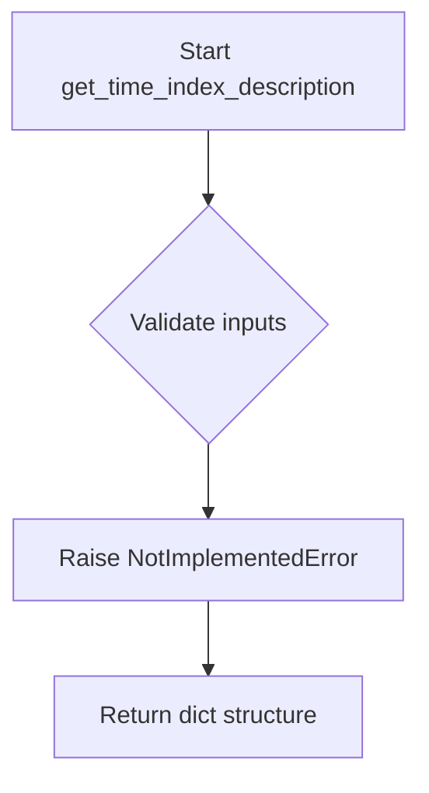

# `timeseries_index.py`

## `src.ydata_profiling.model.timeseries_index.get_time_index_description` · *function*

## Summary:
Generates descriptive metadata about time series index characteristics from dataset statistics.

## Description:
This function extracts and formats descriptive information about time series indexing properties from pre-computed table statistics. It serves as a specialized component within data profiling systems to provide insights into temporal data organization patterns.

The function is typically invoked during time series analysis workflows when detailed metadata about temporal indexing characteristics is required for reporting, visualization, or further analytical processing. It encapsulates the logic for transforming statistical information into structured descriptive elements.

This modular design enables clean separation between statistical computation and descriptive reporting, supporting maintainable and extensible profiling functionality.

## Args:
- config (Settings): Configuration object containing profiling settings that influence how time index descriptions are generated
- df (Any): Input DataFrame containing time series data potentially with temporal indexing
- table_stats (dict): Dictionary containing pre-computed statistical properties of the dataset, including time-related metadata and index characteristics

## Returns:
- dict: A structured dictionary containing time index descriptive statistics and metadata, including temporal patterns, frequency information, and indexing characteristics

## Raises:
- NotImplementedError: Indicates that the implementation is pending completion

## Constraints:
- Preconditions: All input parameters must be properly initialized and compatible with expected data structures
- Postconditions: Function execution produces a dictionary structure representing time index descriptions

## Side Effects:
- None: The function performs no I/O operations or external state mutations

## Control Flow:

## Examples:
Example usage would involve calling this function with profiling configuration, a DataFrame containing time series data, and pre-computed table statistics to extract time index metadata. The returned dictionary would contain structured information about temporal indexing characteristics.

