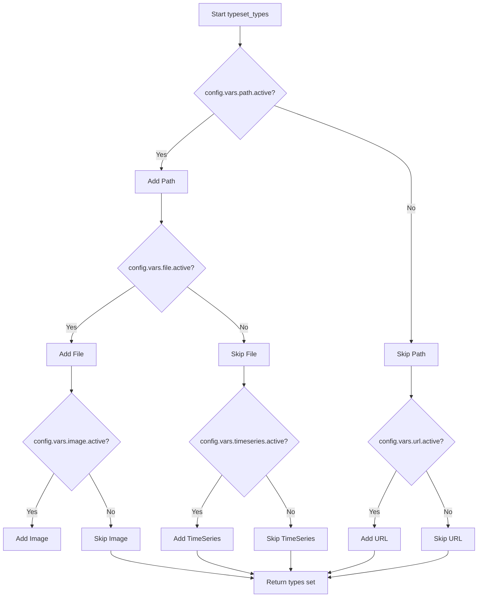
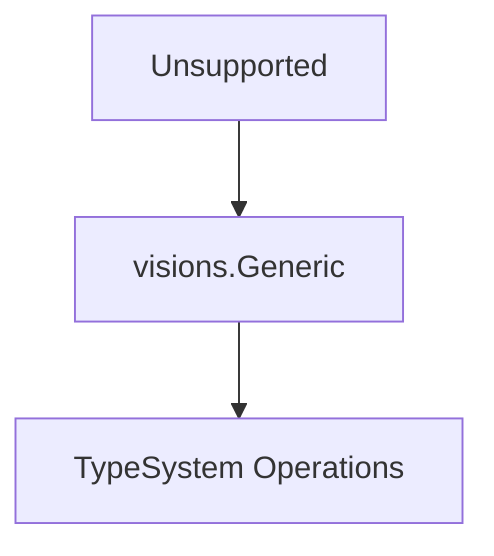

# `typeset.py`

## `src.ydata_profiling.model.typeset.series_handle_nulls` · *function*

## Summary:
Decorator that handles null values in pandas Series before applying a type checking function.

## Description:
This decorator preprocesses a pandas Series by removing null values when present, ensuring that downstream type checking functions operate on clean data. It maintains state tracking of null presence and handles edge cases where all values are null.

## Args:
    fn (Callable[..., bool]): The type checking function to be wrapped, expected to accept (series: pd.Series, state: dict, *args, **kwargs) and return a boolean.

## Returns:
    Callable[..., bool]: A decorated version of the input function that handles null values in the series before execution.

## Raises:
    None explicitly raised - delegates any exceptions from the wrapped function fn.

## Constraints:
    Preconditions:
        - Input series must be a valid pandas Series object
        - State dictionary must be mutable (passed by reference)
        - Wrapped function fn must accept (series, state, *args, **kwargs) signature returning bool
    
    Postconditions:
        - If series contains no nulls, original series is passed to fn unchanged
        - If series contains nulls, nulls are dropped before passing to fn
        - If all values are null, returns False without calling fn
        - State dictionary is updated with "hasnans" key if not already present

## Side Effects:
    None - No I/O operations or external state mutations occur.

## Control Flow:
```mermaid
flowchart TD
    A[series_handle_nulls called] --> B{hasnans in state?}
    B -- No --> C[state["hasnans"] = series.hasnans]
    C --> D{state["hasnans"]?}
    D -- Yes --> E[series = series.dropna()]
    E --> F{series.empty?}
    F -- Yes --> G[return False]
    F -- No --> H[fn(series, state, *args, **kwargs)]
    D -- No --> H
    B -- Yes --> D
    G --> I[Return False]
    H --> I
```

## Examples:
```python
# Basic usage with a type checking function
@series_handle_nulls
def check_numeric_type(series, state, *args, **kwargs):
    return pd.api.types.is_numeric_dtype(series)

# Usage with null values
import pandas as pd
series_with_nulls = pd.Series([1, 2, None, 4])
state = {}
result = check_numeric_type(series_with_nulls, state)  # Returns True (nulls dropped)

# Usage with all null values
all_null_series = pd.Series([None, None, None])
state = {}
result = check_numeric_type(all_null_series, state)  # Returns False (empty after dropna)

# Usage with no nulls
clean_series = pd.Series([1, 2, 3, 4])
state = {}
result = check_numeric_type(clean_series, state)  # Returns True (no change)
```

## `src.ydata_profiling.model.typeset.typeset_types` · *function*

## Summary:
Creates and returns a set of Visions base types for data profiling based on configuration settings.

## Description:
This function dynamically constructs a collection of Visions type classes that define how different data types should be recognized and handled during data profiling. It creates specialized type classes for various data categories like Numeric, Text, DateTime, Categorical, Boolean, URL, Path, File, Image, and TimeSeries, each with their own type detection logic and relationships to other types. The function respects configuration flags to conditionally include optional types like Path, File, Image, URL, and TimeSeries.

The function is designed to be a factory for type definitions that integrate with the Visions type inference system. It encapsulates the complexity of creating and configuring type relationships while allowing runtime customization based on user preferences. The resulting set of types is used by the profiling system to automatically categorize data fields in datasets.

## Args:
    config (Settings): Configuration object containing flags that control which optional types are included in the returned set. The config object must have the following attributes:
    - config.vars.path.active (bool): Controls inclusion of Path type
    - config.vars.file.active (bool): Controls inclusion of File type  
    - config.vars.image.active (bool): Controls inclusion of Image type
    - config.vars.url.active (bool): Controls inclusion of URL type
    - config.vars.timeseries.active (bool): Controls inclusion of TimeSeries type

## Returns:
    Set[visions.VisionsBaseType]: A set of Visions base type classes that define data type recognition logic for the profiling process. The set always contains at least the basic types: Unsupported, Boolean, Numeric, Text, Categorical, DateTime. Optional types (Path, File, Image, URL, TimeSeries) are included only if their respective configuration flags are True.

## Raises:
    None explicitly raised.

## Constraints:
    Preconditions:
    - The config parameter must be a valid Settings object with properly initialized vars attributes.
    - All configuration flags (path, file, image, url, timeseries) must be accessible and boolean-valued.
    
    Postconditions:
    - The returned set always contains at least the basic types: Unsupported, Boolean, Numeric, Text, Categorical, DateTime.
    - Optional types (Path, File, Image, URL, TimeSeries) are only included if their respective configuration flags are True.

## Side Effects:
    None.

## Control Flow:


## Examples:
```python
# Basic usage with default configuration
from ydata_profiling.config import Settings
config = Settings()
typeset = typeset_types(config)
print(len(typeset))  # Will print 6 (basic types)

# With optional types enabled
config.vars.path.active = True
config.vars.file.active = True
config.vars.image.active = True
config.vars.url.active = True
config.vars.timeseries.active = True
typeset = typeset_types(config)
print(len(typeset))  # Will print 11 (all types)

# Usage in profiling context
from ydata_profiling import ProfileReport
from ydata_profiling.config import Settings

# Configure to enable all types
settings = Settings()
settings.vars.path.active = True
settings.vars.file.active = True
settings.vars.image.active = True
settings.vars.url.active = True
settings.vars.timeseries.active = True

# Create profile with custom typeset
df = pd.DataFrame({'data': ['http://example.com', '/path/to/file']})
profile = ProfileReport(df, config=settings)
```

## `src.ydata_profiling.model.typeset.Unsupported` · *class*

## Summary:
Represents an unsupported data type in the visions type system, serving as a fallback for data that doesn't match any known type definitions.

## Description:
The Unsupported class is a placeholder type in the visions type system that represents data which cannot be classified into any of the predefined supported types. It inherits from visions.Generic and serves as a catch-all for data that fails to match other type definitions during type inference. This class is typically instantiated automatically by the type inference system when no other appropriate type can be determined for a given data series. It forms part of the type detection framework used by ydata-profiling to categorize data types in datasets.

## State:
- Inherits all attributes from visions.Generic parent class
- No additional instance attributes defined in the class body
- The class maintains the standard visions type system interface for type checking and conversion operations
- Acts as a terminal type in the type hierarchy when no other type matches

## Lifecycle:
- Creation: Instantiated automatically by the type inference system when no matching type is found
- Usage: Used internally by the visions type system for type validation and conversion operations
- Destruction: Managed by Python's garbage collection; no explicit cleanup required

## Method Map:


## Raises:
- No explicit exceptions raised in __init__ as it inherits from visions.Generic
- Any exceptions would be inherited from the parent class implementation

## Example:
```python
# This class is typically created automatically by the type inference system
# rather than being instantiated directly by users
unsupported_type = Unsupported()  # Created internally by type system when no type matches

# The type system uses this as a fallback when all other type checks fail
# During profiling, if a column's data doesn't match string, numeric, boolean, datetime, etc.
# it will be categorized as Unsupported
```

## `src.ydata_profiling.model.typeset.Numeric` · *class*

## Summary:
Defines the numeric data type for the YData Profiling typeset system, specifying detection and transformation rules for numeric data.

## Description:
The Numeric class implements a type specification for numeric data within the YData Profiling framework. It inherits from visions.VisionsBaseType and provides the necessary infrastructure for identifying numeric series and converting string representations to numeric values. This class is part of the type inference system that categorizes data columns according to their semantic meaning.

## State:
- Inherits from visions.VisionsBaseType, providing standard type behavior
- Contains no instance-specific attributes beyond those inherited from the parent class
- Defines two static methods: `get_relations()` and `contains_op()`
- The `contains_op` method is decorated with `@multimethod`, `@series_not_empty`, and `@series_handle_nulls`

## Lifecycle:
- Creation: Automatically instantiated by the type inference system when needed
- Usage: Called by the type inference engine to validate if a series matches the numeric type criteria
- Destruction: Managed by Python's garbage collection; no explicit cleanup required

## Method Map:
```mermaid
graph TD
    A[Numeric.get_relations] --> B[IdentityRelation(Unsupported)]
    A --> C[InferenceRelation(Text)]
    C --> D[string_is_numeric]
    C --> E[string_to_numeric]
    F[Numeric.contains_op] --> G[pd.api.types.is_numeric_dtype]
    F --> H[pd.api.types.is_bool_dtype]
    F --> I[series_handle_nulls decorator]
```

## Raises:
- No explicit exceptions defined in the class methods
- Exceptions may propagate from underlying pandas type checking functions or the type inference system

## Example:
```python
import pandas as pd
from ydata_profiling.model.typeset import Numeric

# Check if a series contains numeric data
numeric_series = pd.Series([1, 2, 3, 4])
result = Numeric.contains_op(numeric_series, {})
# Returns True for numeric series

# Check if a series contains boolean data (should return False)
bool_series = pd.Series([True, False, True])
result = Numeric.contains_op(bool_series, {})
# Returns False because boolean series are excluded from numeric type

# The type system uses get_relations to define how to infer numeric types
# from other types like Text
relations = Numeric.get_relations()
```

### `src.ydata_profiling.model.typeset.Numeric.get_relations` · *method*

## Summary:
Returns a sequence of type relations defining how the Numeric type relates to other types in the profiling system.

## Description:
This static method defines the type inference relationships for the Numeric type within the ydata-profiling typeset. It establishes two key relationships:
1. An identity relation with the Unsupported type
2. An inference relation from the Text type that allows conversion of strings to numeric values when appropriate

This method is part of the type system architecture that enables automatic type detection and conversion during data profiling. The separation of type relationships into this dedicated method promotes modularity and maintainability of the type system.

## Args:
    None

## Returns:
    Sequence[TypeRelation]: A list containing exactly two TypeRelation objects:
        - IdentityRelation(Unsupported): Indicates that Numeric types are considered identical to Unsupported types in the type hierarchy
        - InferenceRelation(Text, relationship, transformer): Defines how Text types can be inferred as Numeric types using the string_is_numeric validation function and converted via string_to_numeric transformer

## Raises:
    None explicitly raised

## State Changes:
    - Attributes READ: config (from outer scope), Text, Unsupported
    - Attributes WRITTEN: None

## Constraints:
    - Preconditions: The config variable must be available in the enclosing scope and properly initialized with Settings
    - Postconditions: The returned sequence always contains exactly two TypeRelation objects in the specified order

## Side Effects:
    - None

### `src.ydata_profiling.model.typeset.Numeric.contains_op` · *method*

## Summary:
Determines if a pandas Series contains numeric data that is not boolean type.

## Description:
This method evaluates whether a given pandas Series represents numeric data while excluding boolean data. It serves as a type checking operation within the profiling framework to identify numeric columns that should be treated as continuous variables rather than categorical or boolean ones. The method uses pandas' built-in type checking functions to make this determination.

## Args:
    series (pd.Series): A pandas Series to evaluate for numeric type
    state (dict): A dictionary containing processing state information (unused in current implementation)

## Returns:
    bool: True if the series contains numeric data and is not boolean type, False otherwise

## Raises:
    None explicitly raised

## State Changes:
    Attributes READ: None
    Attributes WRITTEN: None

## Constraints:
    Preconditions: 
    - The series parameter must be a valid pandas Series object
    - The state parameter must be a dictionary (though currently unused)
    
    Postconditions:
    - Returns a boolean value indicating the numeric nature of the series
    - Does not modify the input series or state

## Side Effects:
    None

## `src.ydata_profiling.model.typeset.Text` · *class*

## Summary:
Text is a type classifier in the ydata-profiling library that identifies string data by defining specific validation criteria and establishing its relationship with the Unsupported type.

## Description:
The Text class extends visions.VisionsBaseType to define how string data should be recognized within the ydata-profiling type inference system. It implements two key methods: get_relations() which defines the type relationship, and contains_op() which determines if a pandas Series qualifies as text/string data.

The class establishes an identity relationship with the Unsupported type, indicating that in this implementation, string data is treated as unsupported. This design choice likely reflects specific handling requirements or limitations in the type inference logic.

The contains_op method performs a three-part validation:
1. Checks that the series is NOT a categorical dtype
2. Confirms the series IS a string dtype  
3. Validates the series passes specialized string validation via series_is_string()

## State:
- Inherits from visions.VisionsBaseType (base type system functionality)
- No instance attributes defined
- Class-level state managed through get_relations() which returns a fixed sequence of TypeRelation objects
- __init__ parameters: None (inherited from parent class)
- Class invariants: The get_relations() method always returns a sequence containing exactly one IdentityRelation(Unsupported)

## Lifecycle:
- Creation: Automatically instantiated by the type inference system when processing data types
- Usage: Called internally by the profiling system's type detection mechanisms during data analysis
- Destruction: Managed automatically by Python's garbage collection

## Method Map:
```mermaid
flowchart TD
    A[Text.get_relations()] --> B[Returns IdentityRelation(Unsupported)]
    C[Text.contains_op(series, state)] --> D[Check categorical dtype]
    D --> E{NOT is_categorical_dtype(series)?}
    E -- No --> F[Return False]
    E -- Yes --> G[Check string dtype]
    G --> H{is_string_dtype(series)?}
    H -- No --> F
    H -- Yes --> I[series_is_string(series, state)]
    I --> J[Return validation result]
```

## Raises:
- No explicit exceptions defined in the Text class methods
- Exceptions may propagate from underlying pandas dtype checking functions or series_is_string validation
- The @series_handle_nulls decorator may affect behavior with null values but doesn't raise exceptions

## Example:
```python
# The Text type is used internally by the profiling system
# During type inference, the system might call:
# relation = Text.get_relations()  # Returns [IdentityRelation(Unsupported)]
# is_text = Text.contains_op(series, {})  # Evaluates if series qualifies as text
# This would return True if series is non-categorical string data that passes validation
```

### `src.ydata_profiling.model.typeset.Text.get_relations` · *method*

## Summary:
Returns the type relations for the Text type, establishing an identity relationship with the Unsupported type.

## Description:
This static method is part of the Text class that inherits from visions.VisionsBaseType. It defines how the Text type relates to other types in the ydata-profiling type system. The method establishes an IdentityRelation between the Text type and the Unsupported type, indicating that Text instances are treated as unsupported types in the type inference system.

This relationship is used during the type inference process when the profiling system analyzes data to determine appropriate type classifications. The Text type is designed to handle string-like data, but in this particular implementation, it's mapped to the Unsupported type, likely due to specific handling requirements or limitations in the type inference logic.

## Args:
    None

## Returns:
    Sequence[TypeRelation]: A sequence containing a single IdentityRelation that maps the Text type to the Unsupported type.

## Raises:
    None

## State Changes:
    Attributes READ: None
    Attributes WRITTEN: None

## Constraints:
    Preconditions: The method assumes the existence of the Unsupported type and IdentityRelation class in the system.
    Postconditions: The returned sequence always contains exactly one IdentityRelation mapping Text to Unsupported.

## Side Effects:
    None

### `src.ydata_profiling.model.typeset.Text.contains_op` · *method*

## Summary:
Determines whether a pandas Series should be treated as a string type based on its data characteristics and type properties.

## Description:
This method evaluates if a given pandas Series meets the criteria for being classified as a string type. It performs a tripartite check involving dtype validation, categorical exclusion, and a specialized string validation function. This logic is encapsulated in its own method to provide a clean, reusable interface for type classification decisions within the profiling system.

The method specifically checks:
1. That the series is NOT a categorical dtype (using pandas.api.types.is_categorical_dtype)
2. That the series IS a string dtype (using pandas.api.types.is_string_dtype)  
3. That the series passes the specialized string validation via series_is_string()

This approach ensures robust identification of string-like data while avoiding false positives from categorical or non-string dtypes.

## Args:
    series (pd.Series): The pandas Series to evaluate for string type eligibility
    state (dict): A dictionary containing contextual state information used by the validation logic

## Returns:
    bool: True if the series should be considered a string type, False otherwise

## Raises:
    None explicitly raised - though underlying operations may raise TypeError or ValueError

## State Changes:
    Attributes READ: None
    Attributes WRITTEN: None

## Constraints:
    Preconditions:
    - The series parameter must be a valid pandas Series object
    - The state parameter must be a dictionary (can be empty)
    
    Postconditions:
    - Returns a boolean value indicating string type eligibility
    - The returned value is determined solely by the three conditions in the logical expression

## Side Effects:
    None

## `src.ydata_profiling.model.typeset.DateTime` · *class*

## Summary:
DateTime represents a datetime type within the visions type system, enabling identification and inference of datetime data in pandas Series.

## Description:
The DateTime class is a specialized type definition within the ydata-profiling framework's type system. It extends visions.VisionsBaseType to define how datetime data should be recognized and handled. This class enables automatic type inference for datetime data by specifying relationships with other types and implementing a contains_op method to detect datetime content.

The class is designed to work within the broader profiling system where data types are automatically inferred from pandas Series. It specifically handles detection of datetime data through both native pandas datetime dtypes and Python datetime objects, making it suitable for mixed-type datasets where datetime information might be stored in various formats.

## State:
- No instance attributes maintained
- Class-level state is managed through the type system relationships defined in get_relations()
- The contains_op method uses a state dictionary parameter but doesn't store persistent state; it's designed for temporary processing state during type inference and is decorated with series_handle_nulls which manages null value preprocessing

## Lifecycle:
- Creation: Instantiated automatically by the visions type system when type inference occurs
- Usage: Called internally by the type inference engine during profiling runs through the contains_op method which is decorated with series_handle_nulls and series_not_empty
- Destruction: Managed by Python's garbage collection

## Method Map:
```mermaid
flowchart TD
    A[DateTime.get_relations] --> B[Type Relations Definition]
    A --> C[IdentityRelation(Unsupported)]
    A --> D[InferenceRelation(Text)]
    D --> E[string_is_datetime]
    D --> F[string_to_datetime]
    G[DateTime.contains_op] --> H[Series Datetime Detection]
    H --> I[pdt.is_datetime64_any_dtype]
    H --> J[datetime.date/datetime.datetime check]
```

## Raises:
- No explicit exceptions raised by DateTime class methods
- Exceptions from underlying functions (like string_to_datetime) are handled internally by the type system

## Example:
```python
# This class is typically used internally by the profiling system
# When a Series is processed, the type inference engine will call:
# DateTime.contains_op(series, state) to determine if it's datetime data
# The get_relations() method defines how DateTime interacts with other types
```

### `src.ydata_profiling.model.typeset.DateTime.get_relations` · *method*

## Summary:
Returns the type relations for the DateTime type, defining how it relates to other types in the type system.

## Description:
This static method defines the type relationships for the DateTime class within the visions type system. It specifies that DateTime can be identified as an IdentityRelation with Unsupported type, and can be inferred from Text type through a datetime string parsing process.

The method is part of the DateTime class's type system integration, enabling automatic type inference and validation within the profiling framework. This logic is encapsulated in its own method to maintain clean separation between type definition and implementation details, following the standard pattern for visions type definitions.

## Returns:
    Sequence[TypeRelation]: A list containing two TypeRelation objects:
        - IdentityRelation(Unsupported): Indicates DateTime is incompatible with Unsupported type
        - InferenceRelation(Text, relationship=string_is_datetime, transformer=string_to_datetime): Defines how DateTime can be inferred from Text type through string datetime parsing

## State Changes:
    - Attributes READ: None
    - Attributes WRITTEN: None

## Constraints:
    - Preconditions: None
    - Postconditions: The returned sequence always contains exactly two TypeRelation objects in the specified order

## Side Effects:
    - None

### `src.ydata_profiling.model.typeset.DateTime.contains_op` · *method*

## Summary:
Determines whether a pandas Series contains datetime-like data by checking for native datetime types or datetime-compatible objects.

## Description:
This method evaluates if a given pandas Series contains datetime data either through pandas' built-in datetime dtype detection or by examining the actual object types in the series. It serves as a type inference operation to identify datetime-compatible data within a Series.

The method is part of the DateTime type set's operations and is used during type inference to determine if a Series should be classified as containing datetime data. This logic is separated into its own method to encapsulate the datetime detection logic and make it reusable across different type inference contexts.

## Args:
    series (pandas.Series): The pandas Series to evaluate for datetime content
    state (dict): A dictionary containing processing state information (unused in current implementation)

## Returns:
    bool: True if the series contains datetime data (either via pandas datetime dtype or native datetime objects), False otherwise

## Raises:
    None explicitly raised

## State Changes:
    Attributes READ: None
    Attributes WRITTEN: None

## Constraints:
    Preconditions: 
    - The series parameter must be a valid pandas Series object
    - The state parameter must be a dictionary (though currently unused)
    
    Postconditions:
    - Returns a boolean value indicating datetime content presence
    - Does not modify the input series or state

## Side Effects:
    None

## `src.ydata_profiling.model.typeset.Categorical` · *class*

## Summary:
Represents the categorical data type within the YData Profiling framework's Visions type system, defining how categorical data is identified and transformed from other data types.

## Description:
The Categorical class extends visions.VisionsBaseType to define the categorical data type for the YData Profiling library. It implements type inference relationships that allow the system to identify categorical data from numeric and text data sources, and provides the logic for determining whether a pandas Series contains valid categorical data.

This class plays a crucial role in automated data profiling by enabling the system to recognize when data that appears numeric or textual should be treated as categorical. It integrates with the broader Visions type system to support type inference and transformation workflows.

The class defines two key methods:
1. `get_relations()` - Establishes type relationships for inference from other data types
2. `contains_op()` - Determines if a Series contains valid categorical data

## State:
- Inherits from visions.VisionsBaseType, which provides base type functionality
- No instance attributes beyond those inherited from the parent class
- Configuration dependency via `config` variable in `get_relations()` method
- Uses `pandas.api.types` module for dtype checking through `pdt.is_categorical_dtype` and `pdt.is_bool_dtype`

## Lifecycle:
- Creation: Instantiated automatically by the Visions type system when type inference occurs
- Usage: Called internally by the type inference engine during data profiling
- Destruction: Managed by Python garbage collection

## Method Map:
```mermaid
flowchart TD
    A[Categorical.get_relations] --> B[IdentityRelation(Unsupported)]
    A --> C[InferenceRelation(Numeric)]
    A --> D[InferenceRelation(Text)]
    C --> E[numeric_is_category]
    D --> F[string_is_category]
    E --> G[to_category]
    F --> G
    G --> H[Series transformation]
    
    I[Categorical.contains_op] --> J[series_handle_nulls]
    J --> K[pdt.is_categorical_dtype]
    K --> L[pdt.is_bool_dtype]
    L --> M[Return boolean result]
```

## Raises:
- No explicit exceptions raised by either method
- Exceptions from underlying functions (like `pdt.is_categorical_dtype`) are propagated
- The `@series_handle_nulls` decorator handles null value preprocessing

## Example:
```python
# This class is typically used internally by the profiling system
# During type inference, the system may:
# 1. Detect numeric data with few unique values
# 2. Call numeric_is_category with config thresholds
# 3. If True, apply to_category transformer to convert to categorical
# 4. Resulting Series is treated as categorical type in profiling

# Direct usage example (internal):
# series = pd.Series(['A', 'B', 'A'], dtype='object')
# result = Categorical.contains_op(series, {})
# # Returns True if series is categorical and not boolean

# The get_relations method defines how categorical data can be inferred:
# - From numeric data when it has low cardinality
# - From text data when it meets category thresholds
```

### `src.ydata_profiling.model.typeset.Categorical.get_relations` · *method*

## Summary:
Returns the type relations that define how categorical data can be identified from other data types and converted between types.

## Description:
This static method defines the type inference relationships for the Categorical type within the ydata-profiling framework's Visions type system. It specifies how categorical data can be identified from other data types (Numeric and Text) and how it can be transformed between these types during type inference processes.

The method returns a sequence of TypeRelation objects that establish:
1. Identity relationship with Unsupported type (categorical data cannot be identified as unsupported)
2. Inference relationships from Numeric and Text types to categorical type, using specific validation functions and transformation methods

This method is called during the initialization of the Categorical type to configure its type relationships within the profiling system.

## Args:
    None

## Returns:
    Sequence[TypeRelation]: A sequence of type relations defining:
        - IdentityRelation(Unsupported): Categorical data cannot be identified as Unsupported type
        - InferenceRelation(Numeric, relationship, transformer): Numeric data can be inferred as categorical when numeric_is_category returns True, using to_category transformer
        - InferenceRelation(Text, relationship, transformer): Text data can be inferred as categorical when string_is_category returns True, using to_category transformer

## Raises:
    None explicitly raised

## State Changes:
    Attributes READ: config (configuration object containing type thresholds)
    Attributes WRITTEN: None

## Constraints:
    Preconditions:
        - The config object must be available in the local scope
        - The configuration must contain vars.num.low_categorical_threshold, vars.cat.percentage_cat_threshold, and vars.cat.cardinality_threshold
    Postconditions:
        - Always returns exactly 3 TypeRelation objects in fixed order
        - The returned relations are immutable and represent the type inference rules for Categorical

## Side Effects:
    None

### `src.ydata_profiling.model.typeset.Categorical.contains_op` · *method*

## Summary:
Determines whether a pandas Series contains categorical data that is not boolean by checking data type properties.

## Description:
This method evaluates if a given pandas Series represents categorical data while excluding boolean data types. It serves as a type inference check within the YData Profiling framework to identify categorical variables. The method is decorated with `@series_handle_nulls` which preprocesses the series by removing null values before evaluation, ensuring robust handling of missing data. This logic is encapsulated in its own method to provide a clean interface for type detection within the vision-based type system.

The method specifically checks two conditions:
1. Whether the series has a categorical dtype using `pandas.api.types.is_categorical_dtype()`
2. Whether the series is NOT a boolean dtype using `pandas.api.types.is_bool_dtype()`

This ensures that only true categorical data (excluding boolean data) returns True.

## Args:
    series (pd.Series): The pandas Series to check for categorical content
    state (dict): A dictionary containing processing state information including null value tracking

## Returns:
    bool: True if the series has categorical dtype and is not boolean dtype, False otherwise

## Raises:
    None explicitly raised by this method

## State Changes:
    Attributes READ: None
    Attributes WRITTEN: None

## Constraints:
    Preconditions:
    - series must be a valid pandas Series object
    - state parameter should be a dictionary (though currently unused in the core logic)
    
    Postconditions:
    - Returns a boolean value indicating whether the series contains categorical data (excluding booleans)
    - The method does not modify the input series or state

## Side Effects:
    None

## `src.ydata_profiling.model.typeset.Boolean` · *class*

## Summary:
Represents the Boolean type in the YData Profiling typeset, defining how boolean data is identified and transformed from other data types.

## Description:
The Boolean class is a specialized type definition within the YData Profiling framework that extends visions.VisionsBaseType. It defines the behavior and recognition patterns for boolean data, including how it can be inferred from textual representations and how it relates to other data types like Unsupported and Text. This class is part of the type inference system that helps categorize data fields in datasets.

The class implements two key methods:
1. `get_relations()` - Defines how this type relates to other types in the system
2. `contains_op()` - Determines whether a pandas Series contains boolean data

## State:
- Inherits from visions.VisionsBaseType, which provides base type functionality
- Contains no instance attributes beyond those inherited from the parent class
- Uses static methods, so no instance state is maintained
- The `get_relations()` method references `config.vars.bool.mappings` for string-to-boolean conversion mappings

## Lifecycle:
- Creation: Instantiated automatically by the Visions type system when processing data types
- Usage: Called internally by the profiling pipeline when determining data types through type inference
- Destruction: Managed by Python's garbage collection

## Method Map:
```mermaid
graph TD
    A[Boolean.get_relations] --> B[IdentityRelation(Unsupported)]
    A --> C[InferenceRelation(Text)]
    C --> D[string_is_bool]
    C --> E[string_to_bool]
    F[Boolean.contains_op] --> G[series_handle_nulls]
    F --> H[series_not_empty]
    F --> I[pandas.api.types.is_object_dtype]
    F --> J[pandas.api.types.is_bool_dtype]
```

## Raises:
- No explicit exceptions are raised by the constructor or methods of this class
- Exceptions may occur internally during type checking or transformation operations, but these are handled by decorators or upstream components

## Example:
```python
# This class is typically used internally by the profiling system
# When a dataset is processed, the Boolean type is automatically recognized
# from either native boolean columns or string representations like "true"/"false"

# Example of type inference process:
# Column with values ["true", "false", "TRUE", "FALSE"] would be inferred as Boolean
# Column with native boolean values [True, False, True] would be recognized as Boolean
```

### `src.ydata_profiling.model.typeset.Boolean.get_relations` · *method*

## Summary:
Returns type relations defining how Boolean types relate to other types in the type inference system, enabling identity with Unsupported and inference from Text types.

## Description:
This static method defines the type relationships for the Boolean type within the ydata-profiling type system. It returns a sequence of TypeRelation objects that specify how Boolean values can be identified or converted from other types during type inference. The method is called during the initialization of the Boolean type's type set to establish its relationship with other types in the system.

The method creates two relations:
1. An IdentityRelation with Unsupported type, indicating Boolean can be treated as a subtype of Unsupported
2. An InferenceRelation from Text type, allowing automatic conversion of string representations to boolean values using configurable mappings

## Returns:
    Sequence[TypeRelation]: A list containing exactly two TypeRelation objects:
        1. IdentityRelation(Unsupported) - Boolean is considered a subtype of Unsupported
        2. InferenceRelation(Text, relationship_function, transformer_function) - Enables inference of Boolean from Text series

## State Changes:
    - Attributes READ: config.vars.bool.mappings (configuration for string-to-boolean mappings)
    - Attributes WRITTEN: None

## Constraints:
    - Preconditions: config.vars.bool.mappings must be a dictionary mapping string keys to boolean values
    - Postconditions: Always returns a sequence of exactly two TypeRelation objects in fixed order

## Side Effects:
    - None

### `src.ydata_profiling.model.typeset.Boolean.contains_op` · *method*

## Summary:
Determines whether a pandas Series contains boolean values by checking data type and value content.

## Description:
This method evaluates if a given pandas Series represents boolean data. It handles both object dtype series that may contain boolean values and direct boolean dtype series. The method is designed to be used as part of a type inference system to identify boolean data types in datasets. When the series has object dtype, it attempts to verify that all values are either True or False by using the isin() method with a set containing {True, False}. For boolean dtype series, it directly uses pandas' built-in type checking via is_bool_dtype(). The method is robust to edge cases and gracefully handles exceptions during the isin() operation.

## Args:
    series (pd.Series): The pandas Series to check for boolean content
    state (dict): A dictionary containing processing state information (unused in current implementation)

## Returns:
    bool: True if the series contains only boolean values, False otherwise

## Raises:
    None explicitly raised, though a bare except clause may catch unexpected errors during series.isin() operation

## State Changes:
    Attributes READ: None
    Attributes WRITTEN: None

## Constraints:
    Preconditions: 
    - series must be a valid pandas Series object
    - state parameter should be a dictionary (though currently unused)
    
    Postconditions:
    - Returns a boolean value indicating whether the series contains boolean data
    - The method does not modify the input series or state

## Side Effects:
    None

## `src.ydata_profiling.model.typeset.URL` · *class*

## Summary:
URL is a type classifier that identifies URL data within pandas Series by validating URL structure.

## Description:
The URL class extends visions.VisionsBaseType to define how URL data should be recognized within the ydata-profiling type inference system. It implements the get_relations() method to specify that URL types are equivalent to Text types, and contains_op() to validate if a pandas Series contains valid URL strings.

The contains_op method specifically checks each element in a pandas Series by parsing it with urllib.parse.urlparse and verifying that each parsed URL contains both a scheme (like 'http', 'https', 'ftp') and a network location (netloc). This validation is crucial for identifying URL-type data in datasets during automated profiling. The method is decorated with @series_handle_nulls to properly handle null values in the input series.

## State:
- Inherits from visions.VisionsBaseType (base type system functionality)
- No instance attributes defined
- Class-level state managed through get_relations() which returns a fixed sequence of TypeRelation objects
- __init__ parameters: None (inherited from parent class)
- Class invariants: The get_relations() method always returns a sequence containing exactly one IdentityRelation(Text)

## Lifecycle:
- Creation: Automatically instantiated by the type inference system when processing data types
- Usage: Called internally by the profiling system's type detection mechanisms during data analysis
- Destruction: Managed automatically by Python's garbage collection

## Method Map:
```mermaid
flowchart TD
    A[URL.get_relations()] --> B[Returns IdentityRelation(Text)]
    C[URL.contains_op(series, state)] --> D[Apply series_handle_nulls decorator]
    D --> E[Parse URLs with urlparse]
    E --> F{All URLs valid?}
    F -- Yes --> G[Return True]
    F -- No --> G[Return False]
```

## Raises:
- No explicit exceptions defined in the URL class methods
- The @series_handle_nulls decorator handles null value preprocessing but doesn't raise exceptions
- AttributeError may occur internally during parsing but is caught and handled by returning False

## Example:
```python
# The URL type is used internally by the profiling system
# During type inference, the system might call:
# relation = URL.get_relations()  # Returns [IdentityRelation(Text)]
# is_url = URL.contains_op(series, {})  # Evaluates if series qualifies as URL data
# This would return True if series contains valid URLs with schemes and netlocs
```

### `src.ydata_profiling.model.typeset.URL.get_relations` · *method*

## Summary:
Returns the type relations defining how URL types relate to other types in the type inference system, establishing URL as an identity relation with Text type.

## Description:
This static method defines the type relationships for the URL class within the ydata-profiling type system. It specifies that URL types can be identified as equivalent to Text types through an IdentityRelation, meaning URL data is treated as a specialized form of text in the type inference system.

The method is part of the URL class's type system integration, following the standard pattern used by other type classes in the system. This logic is encapsulated in its own method to maintain clean separation between type definition and implementation details, enabling proper type inference and validation within the profiling framework.

The method is called during the initialization of the URL type's type set to establish its relationship with other types in the system. This enables the profiling system to recognize URL data columns and treat them appropriately during type inference and analysis.

Known callers:
- Type inference system during initialization of URL type instances
- Visions type system when building type relationships for the URL class

## Args:
    None

## Returns:
    Sequence[TypeRelation]: A sequence containing exactly one TypeRelation object:
        - IdentityRelation(Text): Indicates URL types are identical to Text types in the type system

## Raises:
    None explicitly raised

## State Changes:
    - Attributes READ: None
    - Attributes WRITTEN: None

## Constraints:
    - Preconditions: None
    - Postconditions: Always returns a sequence containing exactly one IdentityRelation object with Text as the target type

## Side Effects:
    - None

### `src.ydata_profiling.model.typeset.URL.contains_op` · *method*

## Summary:
Validates whether all elements in a pandas Series are valid URL strings by checking for required URL components (scheme and network location).

## Description:
This method serves as a type inference operation that determines if all elements in a pandas Series can be parsed as valid URLs. It uses urllib.parse.urlparse to parse each element and verifies that each parsed URL contains both a scheme (such as 'http', 'https', 'ftp') and a network location (netloc). This validation is used within the type inference system to identify URL-type data in datasets. When an AttributeError occurs during parsing (indicating invalid input), the method gracefully returns False.

## Args:
    series (pd.Series): A pandas Series containing elements to validate as URLs
    state (dict): A dictionary containing processing state information (unused in current implementation)

## Returns:
    bool: True if all elements in the series are valid URLs with both scheme and netloc components, False otherwise

## Raises:
    None explicitly raised - AttributeError is caught internally and handled by returning False

## State Changes:
    Attributes READ: None
    Attributes WRITTEN: None

## Constraints:
    Preconditions:
    - The series parameter must be a pandas Series
    - All elements in the series should be convertible to strings for urlparse parsing
    
    Postconditions:
    - Returns a boolean value indicating URL validity across all elements
    - Does not modify the input series or state parameters

## Side Effects:
    None

## `src.ydata_profiling.model.typeset.Path` · *class*

## Summary
Represents an absolute file path data type in the ydata-profiling typeset system.

## Description
The Path class is a specialized data type implementation that identifies columns containing absolute file paths. It extends visions.VisionsBaseType to integrate with the Visions type inference system and implements specific logic for detecting absolute file paths in pandas Series data.

This class establishes an identity relationship with the Text type, indicating that Path data can be treated as textual data in type inference contexts. It's designed to work within the Visions type system architecture where type relationships are explicitly defined for reliable type detection.

The class is used internally by the ydata-profiling system during data type inference to identify columns that contain absolute file path strings. The type detection mechanism relies on the contains_op method which evaluates whether all elements in a pandas Series represent absolute file paths.

## State
- Inherits all attributes from visions.VisionsBaseType parent class
- No additional instance attributes defined
- Class-level state maintained through static methods and type relationships

## Lifecycle
- Creation: Instantiated automatically by the Visions type inference system when type detection occurs
- Usage: The contains_op static method is invoked by the Visions type inference engine to determine if a Series contains absolute file paths
- Destruction: Managed by Python's garbage collection; no explicit cleanup required

## Method Map
```mermaid
flowchart TD
    A[Visions inference engine] --> B[Path.contains_op]
    B --> C[series_handle_nulls wrapper]
    C --> D[Series preprocessing]
    D --> E[os.path.isabs check on each element]
    E --> F[All elements absolute?]
    F --> G[Return boolean result]
    B --> H[Path.get_relations]
    H --> I[Returns IdentityRelation(Path, Text)]
```

## Raises
- No explicit exceptions raised by Path class methods
- Internal TypeError handling in contains_op method when processing invalid path elements (caught and returns False)

## Example
```python
# The Path type is used internally by the profiling system
# When a column contains absolute file paths like "/home/user/file.txt"
# The system will automatically detect it as a Path type

# Internal usage example:
# During data profiling, if a Series contains elements like:
# series = pd.Series(["/home/user/file1.txt", "/var/log/app.log"])
# The contains_op method would evaluate:
# - os.path.isabs("/home/user/file1.txt") returns True
# - os.path.isabs("/var/log/app.log") returns True  
# - all([True, True]) returns True
# This causes the type inference system to classify the column as Path type

# Edge case handling:
# If series contains mixed data types or invalid paths:
# series = pd.Series(["/valid/path", None, 123])
# The series_handle_nulls decorator removes nulls and handles the TypeError
# Result would be False due to invalid path elements
```

### `src.ydata_profiling.model.typeset.Path.get_relations` · *method*

## Summary:
Returns the type relations for the Path type, establishing an identity relationship with the Text type.

## Description:
This static method defines the type relationships for the Path class within the ydata-profiling typeset framework. It specifies that Path is identically related to Text, meaning that Path instances can be treated as Text instances in type inference contexts. This method is part of the Visions type system integration and is called during type detection and inference processes.

The method is defined as a static method within the Path class and is responsible for returning the appropriate TypeRelation objects that define how Path relates to other types in the system. It is specifically designed to work with the Visions type inference framework and is not intended to be called directly by user code.

Known callers:
- The method is invoked internally by the Visions type inference engine during type detection workflows.
- It is called as part of the type hierarchy resolution process when determining compatible types for a given series.

This logic is encapsulated in its own method because type relationships are fundamental to the Visions type system architecture and need to be consistently defined across all type implementations. Separating this logic allows for clear type hierarchy definitions and enables the inference engine to make reliable decisions about type compatibility.

## Args:
    None

## Returns:
    Sequence[TypeRelation]: A sequence containing a single IdentityRelation that maps Path to Text.

## Raises:
    None

## State Changes:
    Attributes READ: None
    Attributes WRITTEN: None

## Constraints:
    Preconditions:
    - This method must be called on the Path class itself, not on an instance.
    - The Text and Path classes must be properly defined and imported.
    
    Postconditions:
    - The returned sequence always contains exactly one IdentityRelation.
    - The IdentityRelation always maps from Path to Text.

## Side Effects:
    None

### `src.ydata_profiling.model.typeset.Path.contains_op` · *method*

## Summary:
Determines whether all elements in a pandas Series are absolute file paths.

## Description:
This method evaluates a pandas Series to check if every element represents an absolute file path. It uses `os.path.isabs()` to test each element and returns True only if all elements are absolute paths. This operation is part of the Path type inference system used in data profiling to identify columns containing file path data. The method handles invalid inputs gracefully by catching TypeError exceptions and returning False.

## Args:
    series (pandas.Series): A pandas Series containing potential file path strings
    state (dict): A dictionary containing processing state information (currently unused in implementation)

## Returns:
    bool: True if all elements in the series are absolute paths, False otherwise

## Raises:
    None explicitly raised, but catches TypeError internally when elements cannot be processed as paths

## State Changes:
    Attributes READ: None
    Attributes WRITTEN: None

## Constraints:
    Preconditions: 
    - series should be a pandas Series object
    - state should be a dictionary (though currently unused)
    
    Postconditions:
    - Returns a boolean value indicating whether all elements are absolute paths
    - Handles non-string inputs gracefully
    - Returns False for empty series (as all() on empty iterable returns True, but logically empty series should not be considered as having absolute paths)

## Side Effects:
    None

## `src.ydata_profiling.model.typeset.File` · *class*

## Summary:
Represents a file path type in the ydata-profiling type inference system, identifying columns containing valid file paths that exist on the filesystem.

## Description:
The File class is a specialized type implementation within the ydata-profiling framework that identifies columns containing file path strings that correspond to actual files on the local filesystem. It extends visions.VisionsBaseType to integrate with the type inference system, specifically designed to recognize when a pandas Series contains valid file paths that exist.

This class plays a crucial role in automated data profiling by enabling the system to distinguish file path columns from other string data, facilitating appropriate analysis and validation. It's particularly useful for datasets that reference external files, such as image datasets, log file references, or configuration file paths.

The File type establishes an identity relationship with the Path type, meaning that file paths are considered a specialized form of path in the type inference system. This relationship allows the profiling system to treat file paths appropriately while maintaining consistency with general path handling.

## State:
- Inherits all state from visions.VisionsBaseType base class
- No additional instance attributes defined
- Class-level state maintained through static methods and type relations
- The `get_relations()` method defines the type relationship as `IdentityRelation(Path)`

## Lifecycle:
- Creation: Instantiated automatically by the type inference system when a column matches file path characteristics
- Usage: Called during type inference phase when determining column data types, specifically through the `contains_op` method
- Destruction: Managed by Python garbage collection; no explicit cleanup required

## Method Map:
```mermaid
flowchart TD
    A[File.get_relations] --> B[Returns IdentityRelation(Path)]
    A --> C[Type system integration]
    B --> D[Establishes File ≡ Path relationship]
    C --> E[Type inference engine]
    E --> F[File.contains_op]
    F --> G[series_handle_nulls decorator]
    G --> H[os.path.exists check]
    H --> I[Returns boolean result]
```

## Raises:
- No explicit exceptions raised by File class methods
- Exceptions may propagate from underlying `os.path.exists()` operations or series handling
- The `series_handle_nulls` decorator handles null value preprocessing but doesn't raise exceptions

## Example:
```python
import pandas as pd
from ydata_profiling.model.typeset import File

# Create a sample DataFrame with file paths
df = pd.DataFrame({
    'file_paths': ['/home/user/document.txt', '/tmp/image.jpg', '/var/log/app.log']
})

# The type inference system will recognize these as File type columns
# This happens automatically during profiling, but can be triggered manually:
file_type = File()
relations = file_type.get_relations()  # Returns [IdentityRelation(Path)]

# Check if a series contains existing file paths
series = pd.Series(['/etc/passwd', '/bin/bash'])
result = File.contains_op(series, {})  # Returns True if both files exist

# The contains_op method:
# 1. Uses series_handle_nulls decorator to preprocess series (handle nulls)
# 2. Checks if all paths in the series exist using os.path.exists()
# 3. Returns boolean indicating existence of all paths
```

### `src.ydata_profiling.model.typeset.File.get_relations` · *method*

## Summary:
Returns the type relations defining how File types relate to other types in the type inference system, establishing File as an identity relation with Path type.

## Description:
This static method defines the type relationships for the File class within the ydata-profiling type system. It specifies that File types can be identified as equivalent to Path types through an IdentityRelation, meaning files are treated as a specialized form of path in the type inference system.

The method is part of the File class's type system integration, following the standard pattern used by other type classes in the system. This logic is encapsulated in its own method to maintain clean separation between type definition and implementation details, enabling proper type inference and validation within the profiling framework.

## Returns:
    Sequence[TypeRelation]: A list containing exactly one TypeRelation object:
        - IdentityRelation(Path): Indicates File types are identical to Path types in the type system

## State Changes:
    - Attributes READ: None
    - Attributes WRITTEN: None

## Constraints:
    - Preconditions: None
    - Postconditions: Always returns a sequence containing exactly one IdentityRelation object with Path as the target type

## Side Effects:
    - None

### `src.ydata_profiling.model.typeset.File.contains_op` · *method*

## Summary:
Checks whether all file paths in a pandas Series exist on the filesystem.

## Description:
This method evaluates a pandas Series containing file paths and determines if every path exists on the local filesystem. It is used as part of the type inference process to identify when a column contains file paths. The method is part of the File type implementation in the visions library.

## Args:
    series (pd.Series): A pandas Series containing file paths as strings.
    state (dict): A dictionary containing processing state information (unused in this implementation).

## Returns:
    bool: True if all paths in the series exist on the filesystem, False otherwise.

## Raises:
    None explicitly raised.

## State Changes:
    Attributes READ: None
    Attributes WRITTEN: None

## Constraints:
    Preconditions: The series should contain string representations of file paths.
    Postconditions: Returns a boolean indicating existence of all paths.

## Side Effects:
    I/O: Performs filesystem operations using os.path.exists() for each path in the series.

## `src.ydata_profiling.model.typeset.Image` · *class*

## Summary:
Represents an image file path type in the ydata-profiling type inference system, identifying columns containing valid image file paths by examining file headers.

## Description:
The Image class is a specialized type implementation within the ydata-profiling framework that identifies columns containing file paths that correspond to valid image files. It extends visions.VisionsBaseType to integrate with the type inference system, specifically designed to recognize when a pandas Series contains valid image file paths by examining the file's magic number header rather than just checking file existence.

This class plays a crucial role in automated data profiling by enabling the system to distinguish image file path columns from other string data, facilitating appropriate analysis and validation. It's particularly useful for datasets that reference image files, such as image datasets or directories containing image assets.

The Image type establishes an identity relationship with the File type, meaning image file paths are considered a specialized form of file in the type inference system. This relationship allows the profiling system to treat image file paths appropriately while maintaining consistency with general file handling.

## State:
- Inherits all state from visions.VisionsBaseType base class
- No additional instance attributes defined
- Class-level state maintained through static methods and type relations
- The `get_relations()` method defines the type relationship as `IdentityRelation(File)`

## Lifecycle:
- Creation: Instantiated automatically by the type inference system when a column matches image file path characteristics
- Usage: Called during type inference phase when determining column data types, specifically through the `contains_op` method
- Destruction: Managed by Python garbage collection; no explicit cleanup required

## Method Map:
```mermaid
flowchart TD
    A[Image.get_relations] --> B[Returns IdentityRelation(File)]
    A --> C[Type system integration]
    B --> D[Establishes Image ≡ File relationship]
    C --> E[Type inference engine]
    E --> F[Image.contains_op]
    F --> G[series_handle_nulls decorator]
    G --> H[imghdr.what checks]
    H --> I[Returns boolean result]
```

## Raises:
- No explicit exceptions raised by Image class methods
- Exceptions may propagate from underlying `imghdr.what()` operations or series handling
- The `series_handle_nulls` decorator handles null value preprocessing but doesn't raise exceptions

## Example:
```python
import pandas as pd
from ydata_profiling.model.typeset import Image

# Create a sample DataFrame with image file paths
df = pd.DataFrame({
    'image_paths': ['/home/user/photo.jpg', '/tmp/logo.png', '/var/images/icon.gif']
})

# The type inference system will recognize these as Image type columns
# This happens automatically during profiling, but can be triggered manually:
image_type = Image()
relations = image_type.get_relations()  # Returns [IdentityRelation(File)]

# Check if a series contains valid image file paths
series = pd.Series(['/home/user/photo.jpg', '/tmp/logo.png'])
result = Image.contains_op(series, {})  # Returns True if both files are valid images

# The contains_op method:
# 1. Uses series_handle_nulls decorator to preprocess series (handle nulls)
# 2. Checks if all paths in the series contain valid image headers using imghdr.what()
# 3. Returns boolean indicating whether all paths represent valid images
```

### `src.ydata_profiling.model.typeset.Image.get_relations` · *method*

## Summary:
Returns the type relations defining how Image types relate to other types in the type inference system, establishing Image as an identity relation with File type.

## Description:
This static method defines the type relationships for the Image class within the ydata-profiling type system. It specifies that Image types can be identified as equivalent to File types through an IdentityRelation, meaning image data is treated as a specialized form of file in the type inference system.

The method is part of the Image class's type system integration, following the standard pattern used by other type classes in the system. This logic is encapsulated in its own method to maintain clean separation between type definition and implementation details, enabling proper type inference and validation within the profiling framework.

The method is called during the initialization of the Image type's type set to establish its relationship with other types in the system. This enables the profiling system to recognize image data columns and treat them appropriately during type inference and analysis.

Known callers:
- Type inference system during initialization of Image type instances
- Visions type system when building type relationships for the Image class

## Returns:
    Sequence[TypeRelation]: A list containing exactly one TypeRelation object:
        - IdentityRelation(File): Indicates Image types are identical to File types in the type system

## State Changes:
    - Attributes READ: None
    - Attributes WRITTEN: None

## Constraints:
    - Preconditions: None
    - Postconditions: Always returns a sequence containing exactly one IdentityRelation object with File as the target type

## Side Effects:
    - None

### `src.ydata_profiling.model.typeset.Image.contains_op` · *method*

## Summary:
Determines whether all elements in a pandas Series are valid image file paths by checking their file headers.

## Description:
This method evaluates a pandas Series containing file paths and verifies that each path corresponds to a valid image file by examining the file's magic number header. It's designed to be used as part of a type inference system to identify when a series represents image file paths. The method uses Python's built-in `imghdr` module to detect image formats based on file headers.

## Args:
    series (pd.Series): A pandas Series containing file paths as strings
    state (dict): A dictionary containing processing state information (unused in current implementation)

## Returns:
    bool: True if all elements in the series are valid image file paths, False otherwise. Returns False if any path is invalid or if the file header cannot be determined.

## Raises:
    None explicitly raised, though underlying imghdr.what may raise exceptions for invalid file handles

## State Changes:
    Attributes READ: None
    Attributes WRITTEN: None

## Constraints:
    Preconditions: 
    - The series should contain string representations of file paths
    - Each path should be accessible to the filesystem
    Postconditions:
    - Returns a boolean indicating whether all paths represent valid images

## Side Effects:
    I/O operations: Accesses the filesystem to read file headers for validation

## `src.ydata_profiling.model.typeset.TimeSeries` · *class*

## Summary:
A type specification for time-series data that identifies numeric pandas Series exhibiting temporal dependencies through autocorrelation analysis.

## Description:
The TimeSeries class implements a specialized data type for time-series data within the YData Profiling framework. It inherits from visions.VisionsBaseType and provides type inference logic to identify when a pandas Series should be classified as containing time-series data. This classification requires two conditions: the series must contain numeric data (excluding boolean data) and must demonstrate time-dependent patterns through autocorrelation analysis.

This class establishes an identity relationship with the Numeric type, meaning any time-series data is also recognized as numeric. This design ensures compatibility with existing numeric data processing pipelines while enabling specialized time-series analysis capabilities. The class is used during automated type inference to categorize data appropriately for profiling and visualization.

## State:
- Inherits from visions.VisionsBaseType, providing standard type behavior
- No instance-specific attributes beyond those inherited from the parent class
- Defines two static methods: `get_relations()` and `contains_op()`
- The `contains_op` method is decorated with `@multimethod`, `@series_not_empty`, and `@series_handle_nulls`

## Lifecycle:
- Creation: Instantiated automatically by the type inference system during profiling
- Usage: Called by the type inference engine to validate time-series type membership
- Destruction: Managed by Python's garbage collection; no explicit cleanup required

## Method Map:
```mermaid
graph TD
    A[TimeSeries.get_relations] --> B[IdentityRelation(Numeric)]
    F[TimeSeries.contains_op] --> G[is_timedependent helper function]
    G --> H[pd.Series.autocorr method]
    F --> I[pd.api.types.is_numeric_dtype]
    F --> J[pd.api.types.is_bool_dtype]
    F --> K[series_handle_nulls decorator]
    F --> L[series_not_empty decorator]
```

## Raises:
- No explicit exceptions defined in the class methods
- Exceptions may propagate from underlying pandas type checking functions or the type inference system

## Example:
```python
import pandas as pd
from ydata_profiling.model.typeset import TimeSeries

# Create a time-series like numeric series
ts_series = pd.Series([1.0, 2.0, 3.0, 4.0, 5.0])

# Check if a series contains time-series data
result = TimeSeries.contains_op(ts_series, {})
# Returns True if the series is numeric and exhibits time-dependent patterns

# The type system uses get_relations to define how to infer time-series types
# from other types like Numeric
relations = TimeSeries.get_relations()
# Returns [IdentityRelation(Numeric)]
```

### `src.ydata_profiling.model.typeset.TimeSeries.get_relations` · *method*

## Summary:
Returns the type relations defining how the TimeSeries type infers and transforms data types, specifically establishing an identity relationship with the Numeric type.

## Description:
This static method defines the type inference relationships for the TimeSeries type within the YData Profiling system. It specifies that TimeSeries data is fundamentally identified as Numeric data through an identity relation, meaning that any series classified as TimeSeries is also inherently classified as Numeric. This relationship is crucial for the type inference system to properly categorize time series data.

The method is part of the type system architecture and is called during the type inference process when the profiling system evaluates what type a data series belongs to. By defining this identity relation, the system ensures that time series data is consistently treated as numeric data while maintaining its specialized time series characteristics.

This logic is encapsulated in its own method rather than being inlined because:
1. It follows the standard pattern of VisionsBaseType subclasses implementing get_relations()
2. It allows for clear separation of concerns between type identification and type validation logic
3. It enables the type inference system to programmatically discover and utilize these relationships

## Args:
    None

## Returns:
    Sequence[TypeRelation]: A sequence containing a single IdentityRelation that maps TimeSeries to Numeric type.

## Raises:
    None

## State Changes:
    Attributes READ: None
    Attributes WRITTEN: None

## Constraints:
    Preconditions: The method is static and doesn't require any instance state to be valid.
    Postconditions: Always returns a sequence with exactly one IdentityRelation(Numeric) element.

## Side Effects:
    None

### `src.ydata_profiling.model.typeset.TimeSeries.contains_op` · *method*

## Summary:
Determines whether a pandas Series contains time-series data by checking if it is numeric and exhibits time-dependent patterns through autocorrelation analysis.

## Description:
This method evaluates if a given pandas Series represents time-series data by performing two key checks. First, it verifies that the series contains numeric data (excluding boolean data) using pandas' built-in type checking. Second, it analyzes the time-dependency of the numeric series by calculating autocorrelations at various lags and comparing them against a configured threshold. This logic is encapsulated in a nested helper function `is_timedependent()` which performs the autocorrelation analysis.

The method is part of the TimeSeries type set's operations and is used during type inference to identify when a Series should be classified as containing time-series data. The time-dependency check uses the `autocorr()` method from pandas to compute correlation between the series and its own lagged version, which is a standard technique for detecting temporal patterns in time-series data.

## Args:
    series (pd.Series): The pandas Series to evaluate for time-series content
    state (dict): A dictionary containing processing state information (unused in current implementation)

## Returns:
    bool: True if the series contains numeric data and exhibits time-dependent patterns, False otherwise

## Raises:
    None explicitly raised

## State Changes:
    Attributes READ: None
    Attributes WRITTEN: None

## Constraints:
    Preconditions: 
    - The series parameter must be a valid pandas Series object
    - The state parameter must be a dictionary (though currently unused)
    
    Postconditions:
    - Returns a boolean value indicating time-series content presence
    - Does not modify the input series or state

## Side Effects:
    None

## `src.ydata_profiling.model.typeset.ProfilingTypeSet` · *class*

## Summary:
A specialized Visions type set for data profiling that extends the base VisionsTypeset with profiling-specific configurations and type resolution capabilities.

## Description:
The ProfilingTypeSet class serves as a specialized extension of VisionsTypeset tailored for data profiling operations. It integrates with the ydata-profiling configuration system to dynamically construct type sets based on user-defined settings, enabling flexible handling of various data types including optional ones like Path, File, Image, URL, and TimeSeries. This class acts as a central registry for type definitions that the profiling system uses to automatically categorize and analyze data fields in datasets.

The class is designed to work seamlessly with the Visions type inference framework while providing additional functionality for type schema management and resolution. It ensures that type definitions are properly initialized according to the configuration and provides mechanisms for resolving type names to actual type objects during schema processing.

## State:
- config: Settings object containing configuration flags that control which optional types are included in the type set
- type_schema: Dictionary mapping type names to resolved Visions type objects, initialized during construction
- types: Inherited from VisionsTypeset, contains the set of available type classes for data profiling

## Lifecycle:
- Creation: Instantiated with a Settings configuration object and optional type schema dictionary
- Usage: Used primarily during data profiling to determine field types and manage type relationships
- Destruction: Managed by Python's garbage collector; no explicit cleanup required

## Method Map:
```mermaid
graph TD
    A[ProfilingTypeSet.__init__] --> B[typeset_types(config)]
    B --> C[super().__init__(types)]
    C --> D[_init_type_schema(type_schema)]
    D --> E[_get_type(type_name)]
    E --> F[Return resolved type]
```

## Raises:
- ValueError: Raised by _get_type method when a requested type name is not found in the available type set

## Example:
```python
from ydata_profiling.config import Settings
from ydata_profiling.model.typeset import ProfilingTypeSet

# Create configuration with optional types enabled
config = Settings()
config.vars.path.active = True
config.vars.file.active = True

# Initialize the profiling type set
type_set = ProfilingTypeSet(config)

# Access type schema (will be empty initially)
schema = type_set.type_schema

# Resolve a type by name
try:
    text_type = type_set._get_type('text')
except ValueError as e:
    print(f"Type not found: {e}")

# Use with ProfileReport (typical usage)
from ydata_profiling import ProfileReport
import pandas as pd

df = pd.DataFrame({'data': ['http://example.com', '/path/to/file']})
profile = ProfileReport(df, config=config, typeset=type_set)
```

### `src.ydata_profiling.model.typeset.ProfilingTypeSet.__init__` · *method*

## Summary:
Initializes a profiling type set by configuring type definitions based on settings and establishing a type schema resolver.

## Description:
Configures the profiling type set by initializing Visions type classes according to the provided configuration settings, setting up the parent VisionsTypeset with these types, and preparing a type schema resolver for mapping type names to actual type objects. This method serves as the primary constructor for the ProfilingTypeSet class, orchestrating the setup of type detection capabilities that are essential for automated data profiling.

## Args:
    config (Settings): Configuration object that determines which optional types (Path, File, Image, URL, TimeSeries) are included in the type set
    type_schema (dict, optional): Dictionary mapping type names to type specifications for pre-initialization of type schema. Defaults to None, which initializes an empty schema

## Returns:
    None: This method initializes instance attributes but does not return a value

## Raises:
    None explicitly raised by this method

## State Changes:
    Attributes READ: None
    Attributes WRITTEN: 
    - self.config: Stores the provided configuration object
    - self.type_schema: Stores the initialized type schema dictionary

## Constraints:
    Preconditions:
    - The config parameter must be a valid Settings object with properly initialized vars attributes
    - All configuration flags (path, file, image, url, timeseries) must be accessible and boolean-valued
    
    Postconditions:
    - self.config is assigned the provided configuration object
    - self.type_schema is initialized as a dictionary mapping type names to resolved Visions type objects
    - The parent VisionsTypeset is properly initialized with the configured type set

## Side Effects:
    - Suppresses UserWarning exceptions during parent class initialization
    - May modify global warning filters temporarily through warnings.catch_warnings()

### `src.ydata_profiling.model.typeset.ProfilingTypeSet._init_type_schema` · *method*

## Summary:
Initializes a type schema dictionary by resolving type names to their corresponding Visions type objects.

## Description:
This method processes a type schema dictionary where keys are type names and values are type specifications. It maps each type specification to its corresponding Visions type object by calling the internal `_get_type` method. This is used during the initialization of the profiling type set to convert configuration-based type specifications into actual type objects that can be used for data analysis. The method is called during the construction of the `ProfilingTypeSet` instance.

## Args:
    type_schema (dict): A dictionary mapping type names to their specifications

## Returns:
    dict: A dictionary mapping type names to their resolved Visions type objects

## Raises:
    ValueError: When a type name in the schema cannot be found in the available type set

## State Changes:
    Attributes READ: self.types
    Attributes WRITTEN: None

## Constraints:
    Preconditions: The type_schema parameter must be a dictionary, and self.types must be properly initialized
    Postconditions: All type names in the input schema are resolved to valid Visions type objects

## Side Effects:
    None

### `src.ydata_profiling.model.typeset.ProfilingTypeSet._get_type` · *method*

## Summary:
Retrieves a type from the profiling type set by its name, returning the matching Visions type object.

## Description:
This method provides a lookup mechanism to find a specific type within the profiling type set based on its name. It iterates through all available types in the set and compares their names (case-insensitively) to the requested type name. This method is used internally to access specific type definitions during type inference and analysis operations, particularly in the `_init_type_schema` method which uses it to resolve type names in the configuration schema.

## Args:
    type_name (str): The name of the type to retrieve, case-insensitive

## Returns:
    visions.VisionsBaseType: The matching type object from the type set

## Raises:
    ValueError: When the specified type name is not found in the type set

## State Changes:
    Attributes READ: self.types
    Attributes WRITTEN: None

## Constraints:
    Preconditions: The type_name must be a non-empty string, and self.types must be initialized and iterable
    Postconditions: Returns the exact matching type object or raises ValueError

## Side Effects:
    None

